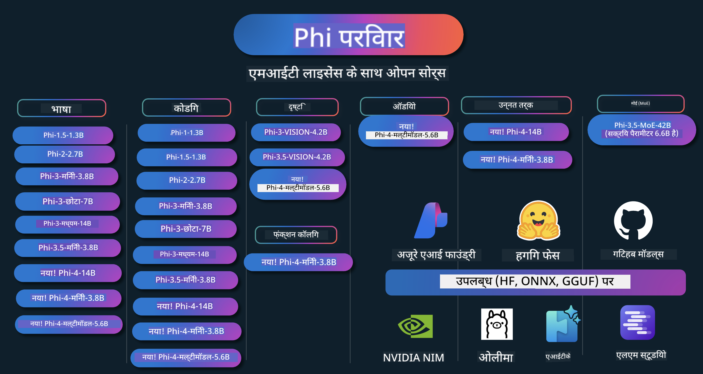

<!--
CO_OP_TRANSLATOR_METADATA:
{
  "original_hash": "8f2577190cbe70305b9de13df37e1c9a",
  "translation_date": "2025-04-04T17:08:06+00:00",
  "source_file": "README.md",
  "language_code": "hi"
}
-->
# Phi कुकबुक: Microsoft के Phi मॉडल्स के साथ प्रैक्टिकल उदाहरण

Phi Microsoft द्वारा विकसित ओपन सोर्स AI मॉडल्स की एक सीरीज़ है। 

Phi वर्तमान में सबसे शक्तिशाली और लागत-प्रभावी छोटे भाषा मॉडल (SLM) है, जो मल्टी-लैंग्वेज, तर्कशक्ति, टेक्स्ट/चैट जनरेशन, कोडिंग, इमेज, ऑडियो और अन्य परिदृश्यों में बहुत अच्छे बेंचमार्क प्रदान करता है।

आप Phi को क्लाउड या एज डिवाइस पर तैनात कर सकते हैं, और सीमित कंप्यूटिंग शक्ति के साथ आसानी से जनरेटिव AI एप्लिकेशन बना सकते हैं।

इन संसाधनों का उपयोग शुरू करने के लिए इन चरणों का पालन करें:
1. **रेपॉजिटरी को फोर्क करें**: क्लिक करें 
2. **रेपॉजिटरी को क्लोन करें**:   `git clone https://github.com/microsoft/PhiCookBook.git`
3. [**Microsoft AI Discord कम्युनिटी में शामिल हों और विशेषज्ञों तथा अन्य डेवलपर्स से मिलें**](https://discord.com/invite/ByRwuEEgH4?WT.mc_id=aiml-137032-kinfeylo)

## 🌐 मल्टी-लैंग्वेज सपोर्ट
[फ्रेंच](../fr/README.md) | [स्पेनिश](../es/README.md) | [जर्मन](../de/README.md) | [रूसी](../ru/README.md) | [अरबी](../ar/README.md) | [फ़ारसी (पर्शियन)](../fa/README.md) | [उर्दू](../ur/README.md) | [चीनी (सरलीकृत)](../zh/README.md) | [चीनी (पारंपरिक, मकाऊ)](../mo/README.md) | [चीनी (पारंपरिक, हांगकांग)](../hk/README.md) | [चीनी (पारंपरिक, ताइवान)](../tw/README.md) | [जापानी](../ja/README.md) | [कोरियाई](../ko/README.md) | [हिंदी](./README.md) | [बंगाली](../bn/README.md) | [मराठी](../mr/README.md) | [नेपाली](../ne/README.md) | [पंजाबी (गुरमुखी)](../pa/README.md) | [पुर्तगाली (पुर्तगाल)](../pt/README.md) | [पुर्तगाली (ब्राज़ील)](../br/README.md) | [इतालवी](../it/README.md) | [पोलिश](../pl/README.md) | [तुर्की](../tr/README.md) | [ग्रीक](../el/README.md) | [थाई](../th/README.md) | [स्वीडिश](../sv/README.md) | [डेनिश](../da/README.md) | [नॉर्वेजियन](../no/README.md) | [फिनिश](../fi/README.md) | [डच](../nl/README.md) | [हिब्रू](../he/README.md) | [वियतनामी](../vi/README.md) | [इंडोनेशियाई](../id/README.md) | [मलय](../ms/README.md) | [टागालोग (फिलिपीनो)](../tl/README.md) | [स्वाहिली](../sw/README.md) | [हंगेरियन](../hu/README.md) | [चेक](../cs/README.md) | [स्लोवाक](../sk/README.md) | [रोमानियन](../ro/README.md) | [बुल्गारियन](../bg/README.md) | [सर्बियन (सिरिलिक)](../sr/README.md) | [क्रोएशियाई](../hr/README.md) | [स्लोवेनियाई](../sl/README.md)
## सामग्री सूची

- परिचय
  - [फाई परिवार में आपका स्वागत है](./md/01.Introduction/01/01.PhiFamily.md)
  - [अपना वातावरण सेटअप करना](./md/01.Introduction/01/01.EnvironmentSetup.md)
  - [मुख्य तकनीकों को समझना](./md/01.Introduction/01/01.Understandingtech.md)
  - [फाई मॉडल्स के लिए AI सुरक्षा](./md/01.Introduction/01/01.AISafety.md)
  - [फाई हार्डवेयर समर्थन](./md/01.Introduction/01/01.Hardwaresupport.md)
  - [फाई मॉडल्स और प्लेटफॉर्म पर उपलब्धता](./md/01.Introduction/01/01.Edgeandcloud.md)
  - [Guidance-ai और फाई का उपयोग करना](./md/01.Introduction/01/01.Guidance.md)
  - [GitHub मार्केटप्लेस मॉडल्स](https://github.com/marketplace/models)
  - [Azure AI मॉडल कैटलॉग](https://ai.azure.com)

- विभिन्न वातावरण में फाई इनफेरेंस
    - [Hugging face](./md/01.Introduction/02/01.HF.md)
    - [GitHub मॉडल्स](./md/01.Introduction/02/02.GitHubModel.md)
    - [Azure AI Foundry मॉडल कैटलॉग](./md/01.Introduction/02/03.AzureAIFoundry.md)
    - [Ollama](./md/01.Introduction/02/04.Ollama.md)
    - [AI Toolkit VSCode (AITK)](./md/01.Introduction/02/05.AITK.md)
    - [NVIDIA NIM](./md/01.Introduction/02/06.NVIDIA.md)

- फाई परिवार इनफेरेंस
    - [iOS में फाई इनफेरेंस](./md/01.Introduction/03/iOS_Inference.md)
    - [Android में फाई इनफेरेंस](./md/01.Introduction/03/Android_Inference.md)
    - [Jetson में फाई इनफेरेंस](./md/01.Introduction/03/Jetson_Inference.md)
    - [AI PC में फाई इनफेरेंस](./md/01.Introduction/03/AIPC_Inference.md)
    - [Apple MLX फ्रेमवर्क के साथ फाई इनफेरेंस](./md/01.Introduction/03/MLX_Inference.md)
    - [लोकल सर्वर में फाई इनफेरेंस](./md/01.Introduction/03/Local_Server_Inference.md)
    - [AI Toolkit का उपयोग करके रिमोट सर्वर में फाई इनफेरेंस](./md/01.Introduction/03/Remote_Interence.md)
    - [Rust के साथ फाई इनफेरेंस](./md/01.Introduction/03/Rust_Inference.md)
    - [लोकल में फाई--Vision इनफेरेंस](./md/01.Introduction/03/Vision_Inference.md)
    - [Kaito AKS, Azure Containers (आधिकारिक समर्थन) के साथ फाई इनफेरेंस](./md/01.Introduction/03/Kaito_Inference.md)

- [फाई परिवार को क्वांटिफाई करना](./md/01.Introduction/04/QuantifyingPhi.md)
    - [llama.cpp का उपयोग करके Phi-3.5 / 4 को क्वांटिफाई करना](./md/01.Introduction/04/UsingLlamacppQuantifyingPhi.md)
    - [onnxruntime के लिए जनरेटिव AI एक्सटेंशन का उपयोग करके Phi-3.5 / 4 को क्वांटिफाई करना](./md/01.Introduction/04/UsingORTGenAIQuantifyingPhi.md)
    - [Intel OpenVINO का उपयोग करके Phi-3.5 / 4 को क्वांटिफाई करना](./md/01.Introduction/04/UsingIntelOpenVINOQuantifyingPhi.md)
    - [Apple MLX फ्रेमवर्क का उपयोग करके Phi-3.5 / 4 को क्वांटिफाई करना](./md/01.Introduction/04/UsingAppleMLXQuantifyingPhi.md)

- फाई का मूल्यांकन
- [रिस्पॉन्सिबल AI](./md/01.Introduction/05/ResponsibleAI.md)
    - [एज़्योर AI फाउंड्री के लिए मूल्यांकन](./md/01.Introduction/05/AIFoundry.md)
    - [मूल्यांकन के लिए प्रॉम्प्टफ्लो का उपयोग](./md/01.Introduction/05/Promptflow.md)
 
- एज़्योर AI सर्च के साथ RAG
    - [Phi-4-mini और Phi-4-multimodal (RAG) को एज़्योर AI सर्च के साथ कैसे उपयोग करें](https://github.com/microsoft/PhiCookBook/blob/main/code/06.E2E/E2E_Phi-4-RAG-Azure-AI-Search.ipynb)

- Phi एप्लिकेशन विकास के नमूने
  - टेक्स्ट और चैट एप्लिकेशन
    - Phi-4 नमूने 🆕
      - [📓] [Phi-4-mini ONNX मॉडल के साथ चैट करें](./md/02.Application/01.TextAndChat/Phi4/ChatWithPhi4ONNX/README.md)
      - [Phi-4 लोकल ONNX मॉडल .NET के साथ चैट करें](../../md/04.HOL/dotnet/src/LabsPhi4-Chat-01OnnxRuntime)
      - [Semantic Kernel का उपयोग करके Phi-4 ONNX के साथ .NET कंसोल ऐप चैट](../../md/04.HOL/dotnet/src/LabsPhi4-Chat-02SK)
    - Phi-3 / 3.5 नमूने
      - [Phi3, ONNX Runtime Web और WebGPU का उपयोग करके ब्राउज़र में लोकल चैटबॉट](https://github.com/microsoft/onnxruntime-inference-examples/tree/main/js/chat)
      - [ओपनवीनो चैट](./md/02.Application/01.TextAndChat/Phi3/E2E_OpenVino_Chat.md)
      - [मल्टी मॉडल - Phi-3-mini और OpenAI Whisper के साथ इंटरएक्टिव](./md/02.Application/01.TextAndChat/Phi3/E2E_Phi-3-mini_with_whisper.md)
      - [MLFlow - एक रैपर बनाना और MLFlow के साथ Phi-3 का उपयोग करना](./md//02.Application/01.TextAndChat/Phi3/E2E_Phi-3-MLflow.md)
      - [मॉडल ऑप्टिमाइजेशन - Olive के साथ ONNX Runtime Web के लिए Phi-3-min मॉडल को ऑप्टिमाइज़ कैसे करें](https://github.com/microsoft/Olive/tree/main/examples/phi3)
      - [WinUI3 ऐप Phi-3 mini-4k-instruct-onnx के साथ](https://github.com/microsoft/Phi3-Chat-WinUI3-Sample/)
      - [WinUI3 मल्टी मॉडल AI पावर्ड नोट्स ऐप नमूना](https://github.com/microsoft/ai-powered-notes-winui3-sample)
      - [कस्टम Phi-3 मॉडल को फाइन-ट्यून और प्रॉम्प्टफ्लो के साथ इंटीग्रेट करें](./md/02.Application/01.TextAndChat/Phi3/E2E_Phi-3-FineTuning_PromptFlow_Integration.md)
      - [एज़्योर AI फाउंड्री में कस्टम Phi-3 मॉडल को फाइन-ट्यून और प्रॉम्प्टफ्लो के साथ इंटीग्रेट करें](./md/02.Application/01.TextAndChat/Phi3/E2E_Phi-3-FineTuning_PromptFlow_Integration_AIFoundry.md)
      - [Microsoft के रिस्पॉन्सिबल AI सिद्धांतों पर ध्यान केंद्रित करते हुए एज़्योर AI फाउंड्री में फाइन-ट्यून किए गए Phi-3 / Phi-3.5 मॉडल का मूल्यांकन करें](./md/02.Application/01.TextAndChat/Phi3/E2E_Phi-3-Evaluation_AIFoundry.md)
      - [📓] [Phi-3.5-mini-instruct भाषा भविष्यवाणी नमूना (चीनी/अंग्रेज़ी)](../../md/02.Application/01.TextAndChat/Phi3/phi3-instruct-demo.ipynb)
      - [Phi-3.5-Instruct WebGPU RAG चैटबॉट](./md/02.Application/01.TextAndChat/Phi3/WebGPUWithPhi35Readme.md)
      - [Windows GPU का उपयोग करके Phi-3.5-Instruct ONNX के साथ प्रॉम्प्टफ्लो समाधान बनाना](./md/02.Application/01.TextAndChat/Phi3/UsingPromptFlowWithONNX.md)
      - [Microsoft Phi-3.5 tflite का उपयोग करके Android ऐप बनाना](./md/02.Application/01.TextAndChat/Phi3/UsingPhi35TFLiteCreateAndroidApp.md)
      - [Microsoft.ML.OnnxRuntime का उपयोग करके लोकल ONNX Phi-3 मॉडल के साथ Q&A .NET उदाहरण](../../md/04.HOL/dotnet/src/LabsPhi301)
      - [Semantic Kernel और Phi-3 के साथ कंसोल चैट .NET ऐप](../../md/04.HOL/dotnet/src/LabsPhi302)

  - एज़्योर AI इंफरेंस SDK कोड आधारित नमूने 
    - Phi-4 नमूने 🆕
      - [📓] [Phi-4-multimodal का उपयोग करके प्रोजेक्ट कोड जनरेट करें](./md/02.Application/02.Code/Phi4/GenProjectCode/README.md)
    - Phi-3 / 3.5 नमूने
      - [Microsoft Phi-3 परिवार के साथ अपना खुद का Visual Studio Code GitHub Copilot Chat बनाएं](./md/02.Application/02.Code/Phi3/VSCodeExt/README.md)
      - [GitHub मॉडल के साथ Phi-3.5 का उपयोग करके अपना खुद का Visual Studio Code Chat Copilot Agent बनाएं](/md/02.Application/02.Code/Phi3/CreateVSCodeChatAgentWithGitHubModels.md)

  - एडवांस्ड रीजनिंग नमूने
    - Phi-4 नमूने 🆕
      - [📓] [Phi-4-mini रीजनिंग नमूने](./md/02.Application/03.AdvancedReasoning/Phi4/AdvancedResoningPhi4mini/README.md)
  
  - डेमो
      - [Phi-4-mini डेमो Hugging Face Spaces पर होस्ट किए गए](https://huggingface.co/spaces/microsoft/phi-4-mini?WT.mc_id=aiml-137032-kinfeylo)
      - [Phi-4-multimodal डेमो Hugging Face Spaces पर होस्ट किए गए](https://huggingface.co/spaces/microsoft/phi-4-multimodal?WT.mc_id=aiml-137032-kinfeylo)
  - विज़न नमूने
    - Phi-4 नमूने 🆕
      - [📓] [छवियों को पढ़ने और कोड जनरेट करने के लिए Phi-4-multimodal का उपयोग करें](./md/02.Application/04.Vision/Phi4/CreateFrontend/README.md) 
    - Phi-3 / 3.5 नमूने
-  [📓][Phi-3-vision-Image text to text](../../md/02.Application/04.Vision/Phi3/E2E_Phi-3-vision-image-text-to-text-online-endpoint.ipynb)
      - [Phi-3-vision-ONNX](https://onnxruntime.ai/docs/genai/tutorials/phi3-v.html)
      - [📓][Phi-3-vision CLIP Embedding](../../md/02.Application/04.Vision/Phi3/E2E_Phi-3-vision-image-text-to-text-online-endpoint.ipynb)
      - [DEMO: Phi-3 Recycling](https://github.com/jennifermarsman/PhiRecycling/)
      - [Phi-3-vision - विजुअल लैंग्वेज असिस्टेंट - Phi3-Vision और OpenVINO के साथ](https://docs.openvino.ai/nightly/notebooks/phi-3-vision-with-output.html)
      - [Phi-3 Vision Nvidia NIM](./md/02.Application/04.Vision/Phi3/E2E_Nvidia_NIM_Vision.md)
      - [Phi-3 Vision OpenVino](./md/02.Application/04.Vision/Phi3/E2E_OpenVino_Phi3Vision.md)
      - [📓][Phi-3.5 Vision मल्टी-फ्रेम या मल्टी-इमेज सैंपल](../../md/02.Application/04.Vision/Phi3/phi3-vision-demo.ipynb)
      - [Phi-3 Vision Local ONNX Model Microsoft.ML.OnnxRuntime .NET का उपयोग करके](../../md/04.HOL/dotnet/src/LabsPhi303)
      - [मेनू आधारित Phi-3 Vision Local ONNX Model Microsoft.ML.OnnxRuntime .NET का उपयोग करके](../../md/04.HOL/dotnet/src/LabsPhi304)

  - ऑडियो सैंपल
    - Phi-4 सैंपल 🆕
      - [📓] [Phi-4-multimodal का उपयोग करके ऑडियो ट्रांसक्रिप्ट निकालना](./md/02.Application/05.Audio/Phi4/Transciption/README.md)
      - [📓] [Phi-4-multimodal ऑडियो सैंपल](../../md/02.Application/05.Audio/Phi4/Siri/demo.ipynb)
      - [📓] [Phi-4-multimodal स्पीच ट्रांसलेशन सैंपल](../../md/02.Application/05.Audio/Phi4/Translate/demo.ipynb)
      - [.NET कंसोल एप्लिकेशन Phi-4-multimodal ऑडियो का उपयोग करके ऑडियो फाइल का विश्लेषण करने और ट्रांसक्रिप्ट बनाने के लिए](../../md/04.HOL/dotnet/src/LabsPhi4-MultiModal-02Audio)

  - MOE सैंपल
    - Phi-3 / 3.5 सैंपल
      - [📓] [Phi-3.5 Mixture of Experts Models (MoEs) सोशल मीडिया सैंपल](../../md/02.Application/06.MoE/Phi3/phi3_moe_demo.ipynb)
      - [📓] [NVIDIA NIM Phi-3 MOE, Azure AI Search, और LlamaIndex के साथ Retrieval-Augmented Generation (RAG) Pipeline बनाना](../../md/02.Application/06.MoE/Phi3/azure-ai-search-nvidia-rag.ipynb)
  - फंक्शन कॉलिंग सैंपल
    - Phi-4 सैंपल 🆕
      -  [📓] [Phi-4-mini के साथ फंक्शन कॉलिंग का उपयोग करना](./md/02.Application/07.FunctionCalling/Phi4/FunctionCallingBasic/README.md)
      -  [📓] [Phi-4-mini के साथ मल्टी-एजेंट बनाने के लिए फंक्शन कॉलिंग का उपयोग करना](../../md/02.Application/07.FunctionCalling/Phi4/Multiagents/Phi_4_mini_multiagent.ipynb)
      -  [📓] [Ollama के साथ फंक्शन कॉलिंग का उपयोग करना](../../md/02.Application/07.FunctionCalling/Phi4/Ollama/ollama_functioncalling.ipynb)
  - मल्टीमॉडल मिक्सिंग सैंपल
    - Phi-4 सैंपल 🆕
      -  [📓] [Phi-4-multimodal का उपयोग टेक्नोलॉजी जर्नलिस्ट के रूप में करना](../../md/02.Application/08.Multimodel/Phi4/TechJournalist/phi_4_mm_audio_text_publish_news.ipynb)
      - [.NET कंसोल एप्लिकेशन Phi-4-multimodal का उपयोग करके इमेज का विश्लेषण करने के लिए](../../md/04.HOL/dotnet/src/LabsPhi4-MultiModal-01Images)

- Phi सैंपल का फाइन-ट्यूनिंग
  - [फाइन-ट्यूनिंग परिदृश्य](./md/03.FineTuning/FineTuning_Scenarios.md)
  - [फाइन-ट्यूनिंग बनाम RAG](./md/03.FineTuning/FineTuning_vs_RAG.md)
  - [फाइन-ट्यूनिंग Phi-3 को इंडस्ट्री विशेषज्ञ बनने देना](./md/03.FineTuning/LetPhi3gotoIndustriy.md)
  - [Phi-3 को VS Code के AI Toolkit के साथ फाइन-ट्यून करना](./md/03.FineTuning/Finetuning_VSCodeaitoolkit.md)
  - [Phi-3 को Azure Machine Learning Service के साथ फाइन-ट्यून करना](./md/03.FineTuning/Introduce_AzureML.md)
  - [Phi-3 को Lora के साथ फाइन-ट्यून करना](./md/03.FineTuning/FineTuning_Lora.md)
  - [Phi-3 को QLora के साथ फाइन-ट्यून करना](./md/03.FineTuning/FineTuning_Qlora.md)
  - [Phi-3 को Azure AI Foundry के साथ फाइन-ट्यून करना](./md/03.FineTuning/FineTuning_AIFoundry.md)
  - [Phi-3 को Azure ML CLI/SDK के साथ फाइन-ट्यून करना](./md/03.FineTuning/FineTuning_MLSDK.md)
- [Microsoft Olive के साथ फाइन-ट्यूनिंग](./md/03.FineTuning/FineTuning_MicrosoftOlive.md)
  - [Microsoft Olive हैंड्स-ऑन लैब के साथ फाइन-ट्यूनिंग](./md/03.FineTuning/olive-lab/readme.md)
  - [Weights और Bias के साथ Phi-3-vision का फाइन-ट्यूनिंग](./md/03.FineTuning/FineTuning_Phi-3-visionWandB.md)
  - [Apple MLX Framework के साथ Phi-3 का फाइन-ट्यूनिंग](./md/03.FineTuning/FineTuning_MLX.md)
  - [Phi-3-vision का फाइन-ट्यूनिंग (आधिकारिक समर्थन)](./md/03.FineTuning/FineTuning_Vision.md)
  - [Kaito AKS, Azure Containers के साथ Phi-3 का फाइन-ट्यूनिंग (आधिकारिक समर्थन)](./md/03.FineTuning/FineTuning_Kaito.md)
  - [Phi-3 और 3.5 Vision का फाइन-ट्यूनिंग](https://github.com/2U1/Phi3-Vision-Finetune)

- हैंड्स-ऑन लैब
  - [आधुनिक मॉडल्स की खोज: LLMs, SLMs, स्थानीय विकास और अधिक](https://github.com/microsoft/aitour-exploring-cutting-edge-models)
  - [NLP क्षमता को अनलॉक करना: Microsoft Olive के साथ फाइन-ट्यूनिंग](https://github.com/azure/Ignite_FineTuning_workshop)

- शैक्षणिक शोध पत्र और प्रकाशन
  - [Textbooks Are All You Need II: phi-1.5 तकनीकी रिपोर्ट](https://arxiv.org/abs/2309.05463)
  - [Phi-3 तकनीकी रिपोर्ट: आपके फोन पर एक सक्षम भाषा मॉडल](https://arxiv.org/abs/2404.14219)
  - [Phi-4 तकनीकी रिपोर्ट](https://arxiv.org/abs/2412.08905)
  - [Phi-4-Mini तकनीकी रिपोर्ट: Mixture-of-LoRAs के माध्यम से कॉम्पैक्ट और शक्तिशाली मल्टीमॉडल भाषा मॉडल](https://arxiv.org/abs/2503.01743)
  - [वाहन में कार्य-कॉलिंग के लिए छोटे भाषा मॉडल का अनुकूलन](https://arxiv.org/abs/2501.02342)
  - [(WhyPHI) PHI-3 को मल्टीपल-चॉइस प्रश्न उत्तर देने के लिए फाइन-ट्यून करना: पद्धति, परिणाम और चुनौतियाँ](https://arxiv.org/abs/2501.01588)

## Phi मॉडल्स का उपयोग करना

### Azure AI Foundry पर Phi

आप Microsoft Phi का उपयोग करना और अपने विभिन्न हार्डवेयर डिवाइस में एंड-टू-एंड समाधान बनाना सीख सकते हैं। Phi को अनुभव करने के लिए, मॉडल्स के साथ खेलना शुरू करें और अपने परिदृश्यों के लिए Phi को कस्टमाइज़ करें [Azure AI Foundry Azure AI Model Catalog](https://aka.ms/phi3-azure-ai) का उपयोग करके। आप [Azure AI Foundry](/md/02.QuickStart/AzureAIFoundry_QuickStart.md) के साथ शुरुआत करने के बारे में अधिक जान सकते हैं।

**प्लेग्राउंड**
प्रत्येक मॉडल का एक समर्पित प्लेग्राउंड है जहां आप मॉडल का परीक्षण कर सकते हैं [Azure AI Playground](https://aka.ms/try-phi3)।

### GitHub Models पर Phi

आप Microsoft Phi का उपयोग करना और अपने विभिन्न हार्डवेयर डिवाइस में एंड-टू-एंड समाधान बनाना सीख सकते हैं। Phi को अनुभव करने के लिए, मॉडल्स के साथ खेलना शुरू करें और अपने परिदृश्यों के लिए Phi को कस्टमाइज़ करें [GitHub Model Catalog](https://github.com/marketplace/models?WT.mc_id=aiml-137032-kinfeylo) का उपयोग करके। आप [GitHub Model Catalog](/md/02.QuickStart/GitHubModel_QuickStart.md) के साथ शुरुआत करने के बारे में अधिक जान सकते हैं।

**प्लेग्राउंड**
प्रत्येक मॉडल का एक समर्पित [प्लेग्राउंड है जहां आप मॉडल का परीक्षण कर सकते हैं](/md/02.QuickStart/GitHubModel_QuickStart.md)।

### Hugging Face पर Phi

आप मॉडल को [Hugging Face](https://huggingface.co/microsoft) पर भी पा सकते हैं।

**प्लेग्राउंड**
[Hugging Chat प्लेग्राउंड](https://huggingface.co/chat/models/microsoft/Phi-3-mini-4k-instruct)

## जिम्मेदार AI 

Microsoft हमारे ग्राहकों को हमारे AI उत्पादों का जिम्मेदारी से उपयोग करने में मदद करने, हमारे अनुभव साझा करने और ट्रस्ट-आधारित साझेदारी बनाने के लिए प्रतिबद्ध है। इसके लिए Transparency Notes और Impact Assessments जैसे उपकरणों का उपयोग किया जाता है। इन संसाधनों को [https://aka.ms/RAI](https://aka.ms/RAI) पर पाया जा सकता है। Microsoft का जिम्मेदार AI के प्रति दृष्टिकोण हमारे AI सिद्धांतों पर आधारित है: निष्पक्षता, विश्वसनीयता और सुरक्षा, गोपनीयता और सुरक्षा, समावेशिता, पारदर्शिता, और जवाबदेही।

बड़े पैमाने पर प्राकृतिक भाषा, छवि, और भाषण मॉडल - जैसे इस नमूने में उपयोग किए गए मॉडल - संभावित रूप से अनुचित, अविश्वसनीय, या आपत्तिजनक व्यवहार कर सकते हैं, जिससे नुकसान हो सकता है। कृपया [Azure OpenAI सेवा Transparency note](https://learn.microsoft.com/legal/cognitive-services/openai/transparency-note?tabs=text) को पढ़ें ताकि जोखिम और सीमाओं के बारे में जानकारी प्राप्त हो सके।

इन जोखिमों को कम करने के लिए अनुशंसित दृष्टिकोण यह है कि आपकी आर्किटेक्चर में एक सुरक्षा प्रणाली शामिल हो जो हानिकारक व्यवहार का पता लगा सके और उसे रोक सके। [Azure AI Content Safety](https://learn.microsoft.com/azure/ai-services/content-safety/overview) एक स्वतंत्र सुरक्षा परत प्रदान करता है, जो अनुप्रयोगों और सेवाओं में हानिकारक उपयोगकर्ता-जनित और AI-जनित सामग्री का पता लगाने में सक्षम है। Azure AI Content Safety में टेक्स्ट और इमेज APIs शामिल हैं जो आपको हानिकारक सामग्री का पता लगाने की अनुमति देते हैं। Azure AI Foundry के भीतर, Content Safety सेवा आपको विभिन्न माध्यमों में हानिकारक सामग्री का पता लगाने के लिए नमूना कोड देखने, एक्सप्लोर करने और आज़माने की अनुमति देती है। निम्नलिखित [क्विकस्टार्ट दस्तावेज़](https://learn.microsoft.com/azure/ai-services/content-safety/quickstart-text?tabs=visual-studio%2Clinux&pivots=programming-language-rest) आपको सेवा में अनुरोध करने के लिए मार्गदर्शन देता है।

एक अन्य पहलू जिसे ध्यान में रखना आवश्यक है वह है समग्र अनुप्रयोग प्रदर्शन। मल्टी-मॉडल और मल्टी-मोडल अनुप्रयोगों के साथ, प्रदर्शन का मतलब है कि सिस्टम आपके और आपके उपयोगकर्ताओं की अपेक्षा के अनुसार काम करता है, जिसमें हानिकारक आउटपुट न उत्पन्न करना भी शामिल है। आपके समग्र अनुप्रयोग के प्रदर्शन का आकलन करना महत्वपूर्ण है, जिसमें [Performance और Quality और Risk और Safety evaluators](https://learn.microsoft.com/azure/ai-studio/concepts/evaluation-metrics-built-in) का उपयोग किया जाता है। आपके पास [custom evaluators](https://learn.microsoft.com/azure/ai-studio/how-to/develop/evaluate-sdk#custom-evaluators) बनाने और उनका मूल्यांकन करने की क्षमता भी है।
आप अपने विकास वातावरण में [Azure AI Evaluation SDK](https://microsoft.github.io/promptflow/index.html) का उपयोग करके अपने AI एप्लिकेशन का मूल्यांकन कर सकते हैं। दिए गए परीक्षण डेटा सेट या लक्ष्य के आधार पर, आपके जनरेटिव AI एप्लिकेशन की उत्पत्तियों को अंतर्निर्मित मूल्यांककों या आपके चुने हुए कस्टम मूल्यांककों के साथ मात्रात्मक रूप से मापा जाता है। अपने सिस्टम का मूल्यांकन करने के लिए Azure AI Evaluation SDK के साथ शुरुआत करने के लिए, आप [त्वरित प्रारंभ गाइड](https://learn.microsoft.com/azure/ai-studio/how-to/develop/flow-evaluate-sdk) का अनुसरण कर सकते हैं। एक मूल्यांकन रन निष्पादित करने के बाद, आप [Azure AI Foundry में परिणामों को विज़ुअलाइज़ कर सकते हैं](https://learn.microsoft.com/azure/ai-studio/how-to/evaluate-flow-results)।

## ट्रेडमार्क्स

यह प्रोजेक्ट परियोजनाओं, उत्पादों, या सेवाओं के लिए ट्रेडमार्क या लोगो को शामिल कर सकता है। Microsoft ट्रेडमार्क या लोगो के अधिकृत उपयोग को [Microsoft के ट्रेडमार्क और ब्रांड दिशानिर्देशों](https://www.microsoft.com/legal/intellectualproperty/trademarks/usage/general) का पालन करना चाहिए। इस प्रोजेक्ट के संशोधित संस्करणों में Microsoft ट्रेडमार्क या लोगो का उपयोग भ्रम पैदा नहीं करना चाहिए या Microsoft प्रायोजन का संकेत नहीं देना चाहिए। किसी भी तृतीय-पक्ष ट्रेडमार्क या लोगो का उपयोग उन तृतीय-पक्ष की नीतियों के अधीन है।

**अस्वीकरण**:  
यह दस्तावेज़ AI अनुवाद सेवा [Co-op Translator](https://github.com/Azure/co-op-translator) का उपयोग करके अनुवादित किया गया है। जबकि हम सटीकता सुनिश्चित करने का प्रयास करते हैं, कृपया ध्यान दें कि स्वचालित अनुवाद में त्रुटियाँ या अशुद्धियाँ हो सकती हैं। मूल दस्तावेज़, जो इसकी मूल भाषा में है, को प्रामाणिक स्रोत माना जाना चाहिए। महत्वपूर्ण जानकारी के लिए, पेशेवर मानव अनुवाद की सिफारिश की जाती है। इस अनुवाद के उपयोग से उत्पन्न किसी भी गलतफहमी या गलत व्याख्या के लिए हम जिम्मेदार नहीं हैं।