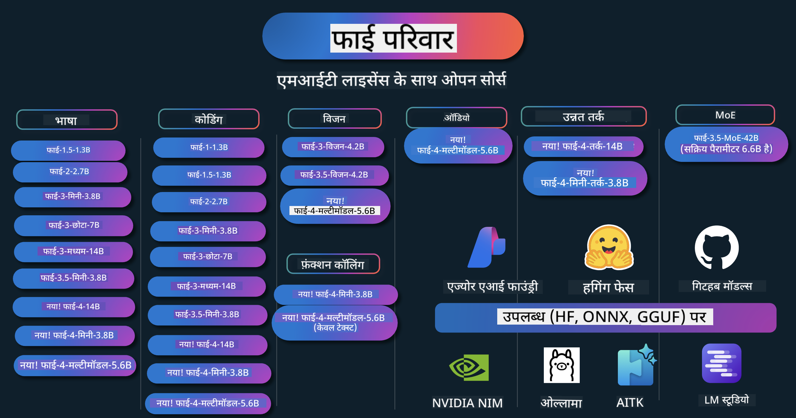

<!--
CO_OP_TRANSLATOR_METADATA:
{
  "original_hash": "5c07bb4c3c89a36c9be332a065a9a33c",
  "translation_date": "2025-07-16T15:02:25+00:00",
  "source_file": "README.md",
  "language_code": "hi"
}
-->
# Phi कुकबुक: Microsoft के Phi मॉडल्स के साथ व्यावहारिक उदाहरण

  

  
  
  

  
  

Phi Microsoft द्वारा विकसित एक ओपन सोर्स AI मॉडल्स की श्रृंखला है।

Phi वर्तमान में सबसे शक्तिशाली और किफायती छोटे भाषा मॉडल (SLM) में से एक है, जो बहुभाषी, तर्क, टेक्स्ट/चैट जनरेशन, कोडिंग, इमेज, ऑडियो और अन्य परिदृश्यों में बेहतरीन प्रदर्शन करता है।

आप Phi को क्लाउड या एज डिवाइसेस पर तैनात कर सकते हैं, और सीमित कंप्यूटिंग पावर के साथ आसानी से जनरेटिव AI एप्लिकेशन बना सकते हैं।

इन संसाधनों का उपयोग शुरू करने के लिए निम्नलिखित चरणों का पालन करें:  
1. **रिपॉजिटरी को फोर्क करें**: क्लिक करें   
2. **रिपॉजिटरी क्लोन करें**: `git clone https://github.com/microsoft/PhiCookBook.git`  
3. [**Microsoft AI Discord Community में शामिल हों और विशेषज्ञों तथा अन्य डेवलपर्स से मिलें**](https://discord.com/invite/ByRwuEEgH4?WT.mc_id=aiml-137032-kinfeylo)

### 🌐 बहुभाषी समर्थन

#### GitHub Action के माध्यम से समर्थित (स्वचालित और हमेशा अपडेटेड)

[French](../fr/README.md) | [Spanish](../es/README.md) | [German](../de/README.md) | [Russian](../ru/README.md) | [Arabic](../ar/README.md) | [Persian (Farsi)](../fa/README.md) | [Urdu](../ur/README.md) | [Chinese (Simplified)](../zh/README.md) | [Chinese (Traditional, Macau)](../mo/README.md) | [Chinese (Traditional, Hong Kong)](../hk/README.md) | [Chinese (Traditional, Taiwan)](../tw/README.md) | [Japanese](../ja/README.md) | [Korean](../ko/README.md) | [Hindi](./README.md)  
[Bengali](../bn/README.md) | [Marathi](../mr/README.md) | [Nepali](../ne/README.md) | [Punjabi (Gurmukhi)](../pa/README.md) | [Portuguese (Portugal)](../pt/README.md) | [Portuguese (Brazil)](../br/README.md) | [Italian](../it/README.md) | [Polish](../pl/README.md) | [Turkish](../tr/README.md) | [Greek](../el/README.md) | [Thai](../th/README.md) | [Swedish](../sv/README.md) | [Danish](../da/README.md) | [Norwegian](../no/README.md) | [Finnish](../fi/README.md) | [Dutch](../nl/README.md) | [Hebrew](../he/README.md) | [Vietnamese](../vi/README.md) | [Indonesian](../id/README.md) | [Malay](../ms/README.md) | [Tagalog (Filipino)](../tl/README.md) | [Swahili](../sw/README.md) | [Hungarian](../hu/README.md) | [Czech](../cs/README.md) | [Slovak](../sk/README.md) | [Romanian](../ro/README.md) | [Bulgarian](../bg/README.md) | [Serbian (Cyrillic)](../sr/README.md) | [Croatian](../hr/README.md) | [Slovenian](../sl/README.md)

## सामग्री सूची

- परिचय  
  - [Phi परिवार में आपका स्वागत है](./md/01.Introduction/01/01.PhiFamily.md)  
  - [अपने वातावरण की सेटअप](./md/01.Introduction/01/01.EnvironmentSetup.md)  
  - [मुख्य तकनीकों को समझना](./md/01.Introduction/01/01.Understandingtech.md)  
  - [Phi मॉडल्स के लिए AI सुरक्षा](./md/01.Introduction/01/01.AISafety.md)  
  - [Phi हार्डवेयर समर्थन](./md/01.Introduction/01/01.Hardwaresupport.md)  
  - [Phi मॉडल्स और प्लेटफॉर्म पर उपलब्धता](./md/01.Introduction/01/01.Edgeandcloud.md)  
  - [Guidance-ai और Phi का उपयोग](./md/01.Introduction/01/01.Guidance.md)  
  - [GitHub मार्केटप्लेस मॉडल्स](https://github.com/marketplace/models)  
  - [Azure AI मॉडल कैटलॉग](https://ai.azure.com)

- विभिन्न वातावरण में Phi का इनफेरेंस  
    -  [Hugging face](./md/01.Introduction/02/01.HF.md)  
    -  [GitHub मॉडल्स](./md/01.Introduction/02/02.GitHubModel.md)  
    -  [Azure AI Foundry मॉडल कैटलॉग](./md/01.Introduction/02/03.AzureAIFoundry.md)  
    -  [Ollama](./md/01.Introduction/02/04.Ollama.md)  
    -  [AI Toolkit VSCode (AITK)](./md/01.Introduction/02/05.AITK.md)  
    -  [NVIDIA NIM](./md/01.Introduction/02/06.NVIDIA.md)  
    -  [Foundry Local](./md/01.Introduction/02/07.FoundryLocal.md)

- Phi परिवार का इनफेरेंस  
    - [iOS में Phi का इनफेरेंस](./md/01.Introduction/03/iOS_Inference.md)  
    - [Android में Phi का इनफेरेंस](./md/01.Introduction/03/Android_Inference.md)  
    - [Jetson में Phi का इनफेरेंस](./md/01.Introduction/03/Jetson_Inference.md)  
    - [AI PC में Phi का इनफेरेंस](./md/01.Introduction/03/AIPC_Inference.md)  
    - [Apple MLX Framework के साथ Phi का इनफेरेंस](./md/01.Introduction/03/MLX_Inference.md)  
    - [लोकल सर्वर में Phi का इनफेरेंस](./md/01.Introduction/03/Local_Server_Inference.md)  
    - [AI Toolkit का उपयोग कर रिमोट सर्वर में Phi का इनफेरेंस](./md/01.Introduction/03/Remote_Interence.md)  
    - [Rust के साथ Phi का इनफेरेंस](./md/01.Introduction/03/Rust_Inference.md)  
    - [लोकल में Phi--Vision का इनफेरेंस](./md/01.Introduction/03/Vision_Inference.md)  
    - [Kaito AKS, Azure Containers (आधिकारिक समर्थन) के साथ Phi का इनफेरेंस](./md/01.Introduction/03/Kaito_Inference.md)  
-  [Phi परिवार का क्वांटिफिकेशन](./md/01.Introduction/04/QuantifyingPhi.md)  
    - [llama.cpp का उपयोग कर Phi-3.5 / 4 का क्वांटाइजेशन](./md/01.Introduction/04/UsingLlamacppQuantifyingPhi.md)  
    - [onnxruntime के लिए जनरेटिव AI एक्सटेंशन्स का उपयोग कर Phi-3.5 / 4 का क्वांटाइजेशन](./md/01.Introduction/04/UsingORTGenAIQuantifyingPhi.md)  
    - [Intel OpenVINO का उपयोग कर Phi-3.5 / 4 का क्वांटाइजेशन](./md/01.Introduction/04/UsingIntelOpenVINOQuantifyingPhi.md)  
    - [Apple MLX Framework का उपयोग कर Phi-3.5 / 4 का क्वांटाइजेशन](./md/01.Introduction/04/UsingAppleMLXQuantifyingPhi.md)

- Phi का मूल्यांकन  
    - [जिम्मेदार AI](./md/01.Introduction/05/ResponsibleAI.md)  
    - [मूल्यांकन के लिए Azure AI Foundry](./md/01.Introduction/05/AIFoundry.md)  
    - [मूल्यांकन के लिए Promptflow का उपयोग](./md/01.Introduction/05/Promptflow.md)

- Azure AI Search के साथ RAG  
    - [Azure AI Search के साथ Phi-4-mini और Phi-4-multimodal (RAG) का उपयोग कैसे करें](https://github.com/microsoft/PhiCookBook/blob/main/code/06.E2E/E2E_Phi-4-RAG-Azure-AI-Search.ipynb)

- Phi एप्लिकेशन विकास के नमूने  
  - टेक्स्ट और चैट एप्लिकेशन  
    - Phi-4 सैंपल्स 🆕  
      - [📓] [Phi-4-mini ONNX मॉडल के साथ चैट करें](./md/02.Application/01.TextAndChat/Phi4/ChatWithPhi4ONNX/README.md)  
      - [Phi-4 लोकल ONNX मॉडल .NET के साथ चैट करें](../../md/04.HOL/dotnet/src/LabsPhi4-Chat-01OnnxRuntime)  
      - [Semantic Kernel का उपयोग करते हुए Phi-4 ONNX के साथ .NET कंसोल ऐप में चैट करें](../../md/04.HOL/dotnet/src/LabsPhi4-Chat-02SK)  
    - Phi-3 / 3.5 सैंपल्स  
      - [Phi3, ONNX Runtime Web और WebGPU का उपयोग कर ब्राउज़र में लोकल चैटबॉट](https://github.com/microsoft/onnxruntime-inference-examples/tree/main/js/chat)  
      - [OpenVino चैट](./md/02.Application/01.TextAndChat/Phi3/E2E_OpenVino_Chat.md)  
      - [मल्टी मॉडल - इंटरैक्टिव Phi-3-mini और OpenAI Whisper](./md/02.Application/01.TextAndChat/Phi3/E2E_Phi-3-mini_with_whisper.md)  
      - [MLFlow - एक रैपर बनाना और Phi-3 के साथ MLFlow का उपयोग](./md//02.Application/01.TextAndChat/Phi3/E2E_Phi-3-MLflow.md)  
      - [मॉडल ऑप्टिमाइजेशन - Olive के साथ Phi-3-min मॉडल को ONNX Runtime Web के लिए कैसे ऑप्टिमाइज़ करें](https://github.com/microsoft/Olive/tree/main/examples/phi3)  
      - [Phi-3 mini-4k-instruct-onnx के साथ WinUI3 ऐप](https://github.com/microsoft/Phi3-Chat-WinUI3-Sample/)  
      - [WinUI3 मल्टी मॉडल AI पावर्ड नोट्स ऐप सैंपल](https://github.com/microsoft/ai-powered-notes-winui3-sample)
- [Prompt flow के साथ कस्टम Phi-3 मॉडल को फाइन-ट्यून और इंटीग्रेट करें](./md/02.Application/01.TextAndChat/Phi3/E2E_Phi-3-FineTuning_PromptFlow_Integration.md)
- [Azure AI Foundry में Prompt flow के साथ कस्टम Phi-3 मॉडल को फाइन-ट्यून और इंटीग्रेट करें](./md/02.Application/01.TextAndChat/Phi3/E2E_Phi-3-FineTuning_PromptFlow_Integration_AIFoundry.md)
- [Microsoft के Responsible AI सिद्धांतों पर ध्यान केंद्रित करते हुए Azure AI Foundry में फाइन-ट्यून किए गए Phi-3 / Phi-3.5 मॉडल का मूल्यांकन करें](./md/02.Application/01.TextAndChat/Phi3/E2E_Phi-3-Evaluation_AIFoundry.md)
- [📓] [Phi-3.5-mini-instruct भाषा पूर्वानुमान नमूना (चीनी/अंग्रेज़ी)](../../md/02.Application/01.TextAndChat/Phi3/phi3-instruct-demo.ipynb)
- [Phi-3.5-Instruct WebGPU RAG चैटबॉट](./md/02.Application/01.TextAndChat/Phi3/WebGPUWithPhi35Readme.md)
- [Windows GPU का उपयोग करके Phi-3.5-Instruct ONNX के साथ Prompt flow समाधान बनाना](./md/02.Application/01.TextAndChat/Phi3/UsingPromptFlowWithONNX.md)
- [Microsoft Phi-3.5 tflite का उपयोग करके Android ऐप बनाना](./md/02.Application/01.TextAndChat/Phi3/UsingPhi35TFLiteCreateAndroidApp.md)
- [Microsoft.ML.OnnxRuntime का उपयोग करते हुए स्थानीय ONNX Phi-3 मॉडल के साथ Q&A .NET उदाहरण](../../md/04.HOL/dotnet/src/LabsPhi301)
- [Semantic Kernel और Phi-3 के साथ कंसोल चैट .NET ऐप](../../md/04.HOL/dotnet/src/LabsPhi302)

- Azure AI Inference SDK कोड आधारित नमूने  
  - Phi-4 नमूने 🆕  
    - [📓] [Phi-4-multimodal का उपयोग करके प्रोजेक्ट कोड जनरेट करें](./md/02.Application/02.Code/Phi4/GenProjectCode/README.md)  
  - Phi-3 / 3.5 नमूने  
    - [Microsoft Phi-3 परिवार के साथ अपना Visual Studio Code GitHub Copilot चैट बनाएं](./md/02.Application/02.Code/Phi3/VSCodeExt/README.md)  
    - [GitHub मॉडल्स के साथ Phi-3.5 द्वारा अपना Visual Studio Code चैट कॉपिलट एजेंट बनाएं](/md/02.Application/02.Code/Phi3/CreateVSCodeChatAgentWithGitHubModels.md)  

- उन्नत तर्क नमूने  
  - Phi-4 नमूने 🆕  
    - [📓] [Phi-4-mini-reasoning या Phi-4-reasoning नमूने](./md/02.Application/03.AdvancedReasoning/Phi4/AdvancedResoningPhi4mini/README.md)  
    - [📓] [Microsoft Olive के साथ Phi-4-mini-reasoning का फाइन-ट्यूनिंग](../../md/02.Application/03.AdvancedReasoning/Phi4/AdvancedResoningPhi4mini/olive_ft_phi_4_reasoning_with_medicaldata.ipynb)  
    - [📓] [Apple MLX के साथ Phi-4-mini-reasoning का फाइन-ट्यूनिंग](../../md/02.Application/03.AdvancedReasoning/Phi4/AdvancedResoningPhi4mini/mlx_ft_phi_4_reasoning_with_medicaldata.ipynb)  
    - [📓] [GitHub मॉडल्स के साथ Phi-4-mini-reasoning](../../md/02.Application/02.Code/Phi4r/github_models_inference.ipynb)  
    - [📓] [Azure AI Foundry मॉडल्स के साथ Phi-4-mini-reasoning](../../md/02.Application/02.Code/Phi4r/azure_models_inference.ipynb)  
- डेमो  
    - [Phi-4-mini डेमो Hugging Face Spaces पर होस्ट किए गए](https://huggingface.co/spaces/microsoft/phi-4-mini?WT.mc_id=aiml-137032-kinfeylo)  
    - [Phi-4-multimodal डेमो Hugging Face Spaces पर होस्ट किए गए](https://huggingface.co/spaces/microsoft/phi-4-multimodal?WT.mc_id=aiml-137032-kinfeylo)  
- विज़न नमूने  
  - Phi-4 नमूने 🆕  
    - [📓] [Phi-4-multimodal का उपयोग करके इमेज पढ़ें और कोड जनरेट करें](./md/02.Application/04.Vision/Phi4/CreateFrontend/README.md)  
  - Phi-3 / 3.5 नमूने  
    - [📓][Phi-3-vision-इमेज टेक्स्ट से टेक्स्ट](../../md/02.Application/04.Vision/Phi3/E2E_Phi-3-vision-image-text-to-text-online-endpoint.ipynb)  
    - [Phi-3-vision-ONNX](https://onnxruntime.ai/docs/genai/tutorials/phi3-v.html)  
    - [📓][Phi-3-vision CLIP एम्बेडिंग](../../md/02.Application/04.Vision/Phi3/E2E_Phi-3-vision-image-text-to-text-online-endpoint.ipynb)  
    - [डेमो: Phi-3 रीसायक्लिंग](https://github.com/jennifermarsman/PhiRecycling/)  
    - [Phi-3-vision - विज़ुअल लैंग्वेज असिस्टेंट - Phi3-Vision और OpenVINO के साथ](https://docs.openvino.ai/nightly/notebooks/phi-3-vision-with-output.html)  
    - [Phi-3 विज़न Nvidia NIM](./md/02.Application/04.Vision/Phi3/E2E_Nvidia_NIM_Vision.md)  
    - [Phi-3 विज़न OpenVino](./md/02.Application/04.Vision/Phi3/E2E_OpenVino_Phi3Vision.md)  
    - [📓][Phi-3.5 विज़न मल्टी-फ्रेम या मल्टी-इमेज नमूना](../../md/02.Application/04.Vision/Phi3/phi3-vision-demo.ipynb)  
    - [Microsoft.ML.OnnxRuntime .NET का उपयोग करते हुए Phi-3 विज़न लोकल ONNX मॉडल](../../md/04.HOL/dotnet/src/LabsPhi303)  
    - [मेनू आधारित Phi-3 विज़न लोकल ONNX मॉडल Microsoft.ML.OnnxRuntime .NET के साथ](../../md/04.HOL/dotnet/src/LabsPhi304)  

- गणित नमूने  
  - Phi-4-Mini-Flash-Reasoning-Instruct नमूने 🆕 [Phi-4-Mini-Flash-Reasoning-Instruct के साथ गणित डेमो](../../md/02.Application/09.Math/MathDemo.ipynb)  

- ऑडियो नमूने  
  - Phi-4 नमूने 🆕  
    - [📓] [Phi-4-multimodal का उपयोग करके ऑडियो ट्रांसक्रिप्ट निकालना](./md/02.Application/05.Audio/Phi4/Transciption/README.md)  
    - [📓] [Phi-4-multimodal ऑडियो नमूना](../../md/02.Application/05.Audio/Phi4/Siri/demo.ipynb)  
    - [📓] [Phi-4-multimodal स्पीच ट्रांसलेशन नमूना](../../md/02.Application/05.Audio/Phi4/Translate/demo.ipynb)  
    - [Phi-4-multimodal का उपयोग करते हुए .NET कंसोल एप्लिकेशन जो ऑडियो फ़ाइल का विश्लेषण करता है और ट्रांसक्रिप्ट जनरेट करता है](../../md/04.HOL/dotnet/src/LabsPhi4-MultiModal-02Audio)  

- MOE नमूने  
  - Phi-3 / 3.5 नमूने  
    - [📓] [Phi-3.5 Mixture of Experts Models (MoEs) सोशल मीडिया नमूना](../../md/02.Application/06.MoE/Phi3/phi3_moe_demo.ipynb)  
    - [📓] [NVIDIA NIM Phi-3 MOE, Azure AI Search, और LlamaIndex के साथ Retrieval-Augmented Generation (RAG) पाइपलाइन बनाना](../../md/02.Application/06.MoE/Phi3/azure-ai-search-nvidia-rag.ipynb)  

- फंक्शन कॉलिंग नमूने  
  - Phi-4 नमूने 🆕  
    - [📓] [Phi-4-mini के साथ फंक्शन कॉलिंग का उपयोग करना](./md/02.Application/07.FunctionCalling/Phi4/FunctionCallingBasic/README.md)  
    - [📓] [Phi-4-mini के साथ मल्टी-एजेंट बनाने के लिए फंक्शन कॉलिंग का उपयोग](../../md/02.Application/07.FunctionCalling/Phi4/Multiagents/Phi_4_mini_multiagent.ipynb)  
    - [📓] [Ollama के साथ फंक्शन कॉलिंग का उपयोग](../../md/02.Application/07.FunctionCalling/Phi4/Ollama/ollama_functioncalling.ipynb)  
    - [📓] [ONNX के साथ फंक्शन कॉलिंग का उपयोग](../../md/02.Application/07.FunctionCalling/Phi4/ONNX/onnx_parallel_functioncalling.ipynb)  

- मल्टीमॉडल मिक्सिंग नमूने  
  - Phi-4 नमूने 🆕  
    - [📓] [Phi-4-multimodal का उपयोग एक टेक्नोलॉजी पत्रकार के रूप में करना](../../md/02.Application/08.Multimodel/Phi4/TechJournalist/phi_4_mm_audio_text_publish_news.ipynb)  
    - [Phi-4-multimodal का उपयोग करते हुए .NET कंसोल एप्लिकेशन जो इमेज का विश्लेषण करता है](../../md/04.HOL/dotnet/src/LabsPhi4-MultiModal-01Images)  

- Phi फाइन-ट्यूनिंग  
  - [फाइन-ट्यूनिंग परिदृश्य](./md/03.FineTuning/FineTuning_Scenarios.md)  
  - [फाइन-ट्यूनिंग बनाम RAG](./md/03.FineTuning/FineTuning_vs_RAG.md)  
  - [Phi-3 को उद्योग विशेषज्ञ बनने दें](./md/03.FineTuning/LetPhi3gotoIndustriy.md)  
  - [VS Code के लिए AI Toolkit के साथ Phi-3 का फाइन-ट्यूनिंग](./md/03.FineTuning/Finetuning_VSCodeaitoolkit.md)  
  - [Azure Machine Learning Service के साथ Phi-3 का फाइन-ट्यूनिंग](./md/03.FineTuning/Introduce_AzureML.md)  
  - [Lora के साथ Phi-3 का फाइन-ट्यूनिंग](./md/03.FineTuning/FineTuning_Lora.md)  
  - [QLora के साथ Phi-3 का फाइन-ट्यूनिंग](./md/03.FineTuning/FineTuning_Qlora.md)  
  - [Azure AI Foundry के साथ Phi-3 का फाइन-ट्यूनिंग](./md/03.FineTuning/FineTuning_AIFoundry.md)  
  - [Azure ML CLI/SDK के साथ Phi-3 का फाइन-ट्यूनिंग](./md/03.FineTuning/FineTuning_MLSDK.md)  
  - [Microsoft Olive के साथ फाइन-ट्यूनिंग](./md/03.FineTuning/FineTuning_MicrosoftOlive.md)  
  - [Microsoft Olive Hands-On Lab के साथ फाइन-ट्यूनिंग](./md/03.FineTuning/olive-lab/readme.md)  
  - [Weights and Bias के साथ Phi-3-vision का फाइन-ट्यूनिंग](./md/03.FineTuning/FineTuning_Phi-3-visionWandB.md)  
  - [Apple MLX Framework के साथ Phi-3 का फाइन-ट्यूनिंग](./md/03.FineTuning/FineTuning_MLX.md)  
  - [Phi-3-vision का फाइन-ट्यूनिंग (आधिकारिक समर्थन)](./md/03.FineTuning/FineTuning_Vision.md)  
  - [Kaito AKS, Azure Containers के साथ Phi-3 का फाइन-ट्यूनिंग (आधिकारिक समर्थन)](./md/03.FineTuning/FineTuning_Kaito.md)  
  - [Phi-3 और 3.5 विज़न का फाइन-ट्यूनिंग](https://github.com/2U1/Phi3-Vision-Finetune)  

- हैंड्स ऑन लैब  
  - [आधुनिक मॉडल्स का अन्वेषण: LLMs, SLMs, स्थानीय विकास और अधिक](https://github.com/microsoft/aitour-exploring-cutting-edge-models)  
  - [NLP क्षमता खोलना: Microsoft Olive के साथ फाइन-ट्यूनिंग](https://github.com/azure/Ignite_FineTuning_workshop)  

- अकादमिक शोध पत्र और प्रकाशन  
  - [Textbooks Are All You Need II: phi-1.5 तकनीकी रिपोर्ट](https://arxiv.org/abs/2309.05463)  
  - [Phi-3 तकनीकी रिपोर्ट: आपके फोन पर एक अत्यंत सक्षम भाषा मॉडल](https://arxiv.org/abs/2404.14219)  
  - [Phi-4 तकनीकी रिपोर्ट](https://arxiv.org/abs/2412.08905)  
  - [Phi-4-Mini तकनीकी रिपोर्ट: मिश्रण-ऑफ-LoRAs के माध्यम से कॉम्पैक्ट लेकिन शक्तिशाली मल्टीमॉडल भाषा मॉडल](https://arxiv.org/abs/2503.01743)  
  - [इन-व्हीकल फंक्शन-कॉलिंग के लिए छोटे भाषा मॉडलों का अनुकूलन](https://arxiv.org/abs/2501.02342)  
  - [(WhyPHI) बहुविकल्पीय प्रश्नोत्तरी के लिए PHI-3 का फाइन-ट्यूनिंग: पद्धति, परिणाम, और चुनौतियां](https://arxiv.org/abs/2501.01588)
- [Phi-4-reasoning Technical Report](https://www.microsoft.com/en-us/research/wp-content/uploads/2025/04/phi_4_reasoning.pdf)  
- [Phi-4-mini-reasoning Technical Report](https://huggingface.co/microsoft/Phi-4-mini-reasoning/blob/main/Phi-4-Mini-Reasoning.pdf)

## Phi मॉडल का उपयोग करना

### Azure AI Foundry पर Phi

आप Microsoft Phi का उपयोग कैसे करें और अपने विभिन्न हार्डवेयर उपकरणों में E2E समाधान कैसे बनाएं, यह सीख सकते हैं। Phi का अनुभव करने के लिए, मॉडल के साथ प्रयोग करना शुरू करें और अपने परिदृश्यों के लिए Phi को कस्टमाइज़ करें, [Azure AI Foundry Azure AI Model Catalog](https://aka.ms/phi3-azure-ai) का उपयोग करके। आप [Azure AI Foundry के साथ शुरुआत](/md/02.QuickStart/AzureAIFoundry_QuickStart.md) में और अधिक जान सकते हैं।

**प्लेलैंड**  
प्रत्येक मॉडल के लिए एक समर्पित प्लेलैंड होता है जहाँ आप मॉडल का परीक्षण कर सकते हैं [Azure AI Playground](https://aka.ms/try-phi3)।

### GitHub मॉडल पर Phi

आप Microsoft Phi का उपयोग कैसे करें और अपने विभिन्न हार्डवेयर उपकरणों में E2E समाधान कैसे बनाएं, यह सीख सकते हैं। Phi का अनुभव करने के लिए, मॉडल के साथ प्रयोग करना शुरू करें और अपने परिदृश्यों के लिए Phi को कस्टमाइज़ करें, [GitHub Model Catalog](https://github.com/marketplace/models?WT.mc_id=aiml-137032-kinfeylo) का उपयोग करके। आप [GitHub Model Catalog के साथ शुरुआत](/md/02.QuickStart/GitHubModel_QuickStart.md) में और अधिक जान सकते हैं।

**प्लेलैंड**  
प्रत्येक मॉडल के लिए एक समर्पित [प्लेलैंड होता है जहाँ आप मॉडल का परीक्षण कर सकते हैं](/md/02.QuickStart/GitHubModel_QuickStart.md)।

### Hugging Face पर Phi

आप मॉडल को [Hugging Face](https://huggingface.co/microsoft) पर भी पा सकते हैं।

**प्लेलैंड**  
[Hugging Chat playground](https://huggingface.co/chat/models/microsoft/Phi-3-mini-4k-instruct)

## जिम्मेदार AI

Microsoft अपने ग्राहकों को हमारे AI उत्पादों का जिम्मेदारी से उपयोग करने में मदद करने, हमारे अनुभव साझा करने, और Transparency Notes और Impact Assessments जैसे उपकरणों के माध्यम से भरोसेमंद साझेदारी बनाने के लिए प्रतिबद्ध है। इन संसाधनों में से कई [https://aka.ms/RAI](https://aka.ms/RAI) पर उपलब्ध हैं।  
Microsoft का जिम्मेदार AI के प्रति दृष्टिकोण हमारे AI सिद्धांतों पर आधारित है, जिनमें निष्पक्षता, विश्वसनीयता और सुरक्षा, गोपनीयता और सुरक्षा, समावेशन, पारदर्शिता, और जवाबदेही शामिल हैं।

बड़े पैमाने पर प्राकृतिक भाषा, छवि, और भाषण मॉडल - जैसे इस उदाहरण में उपयोग किए गए मॉडल - संभावित रूप से ऐसे व्यवहार कर सकते हैं जो अनुचित, अविश्वसनीय, या आपत्तिजनक हो सकते हैं, जिससे नुकसान हो सकता है। कृपया जोखिमों और सीमाओं के बारे में जानकारी के लिए [Azure OpenAI सेवा Transparency note](https://learn.microsoft.com/legal/cognitive-services/openai/transparency-note?tabs=text) देखें।

इन जोखिमों को कम करने के लिए अनुशंसित तरीका यह है कि आपकी आर्किटेक्चर में एक सुरक्षा प्रणाली शामिल हो जो हानिकारक व्यवहार का पता लगा सके और उसे रोक सके। [Azure AI Content Safety](https://learn.microsoft.com/azure/ai-services/content-safety/overview) एक स्वतंत्र सुरक्षा परत प्रदान करता है, जो एप्लिकेशन और सेवाओं में हानिकारक उपयोगकर्ता-जनित और AI-जनित सामग्री का पता लगाने में सक्षम है। Azure AI Content Safety में टेक्स्ट और इमेज API शामिल हैं जो हानिकारक सामग्री का पता लगाने की अनुमति देते हैं। Azure AI Foundry के भीतर, Content Safety सेवा आपको विभिन्न माध्यमों में हानिकारक सामग्री का पता लगाने के लिए नमूना कोड देखने, एक्सप्लोर करने और आज़माने की सुविधा देती है। निम्नलिखित [quickstart दस्तावेज़](https://learn.microsoft.com/azure/ai-services/content-safety/quickstart-text?tabs=visual-studio%2Clinux&pivots=programming-language-rest) आपको सेवा को अनुरोध भेजने के लिए मार्गदर्शन करता है।

एक और पहलू जिसे ध्यान में रखना चाहिए वह है समग्र एप्लिकेशन प्रदर्शन। मल्टी-मोडल और मल्टी-मॉडल एप्लिकेशन के साथ, हम प्रदर्शन को इस रूप में देखते हैं कि सिस्टम आपकी और आपके उपयोगकर्ताओं की अपेक्षाओं के अनुसार काम करता है, जिसमें हानिकारक आउटपुट न उत्पन्न करना भी शामिल है। अपने समग्र एप्लिकेशन के प्रदर्शन का आकलन करना महत्वपूर्ण है, इसके लिए आप [Performance and Quality and Risk and Safety evaluators](https://learn.microsoft.com/azure/ai-studio/concepts/evaluation-metrics-built-in) का उपयोग कर सकते हैं। आप [custom evaluators](https://learn.microsoft.com/azure/ai-studio/how-to/develop/evaluate-sdk#custom-evaluators) भी बना सकते हैं और उनका मूल्यांकन कर सकते हैं।

आप अपने विकास वातावरण में अपने AI एप्लिकेशन का मूल्यांकन [Azure AI Evaluation SDK](https://microsoft.github.io/promptflow/index.html) का उपयोग करके कर सकते हैं। चाहे आपके पास टेस्ट डेटा सेट हो या कोई लक्ष्य, आपके जनरेटिव AI एप्लिकेशन की उत्पत्तियों को अंतर्निहित मूल्यांकनकर्ता या आपकी पसंद के कस्टम मूल्यांकनकर्ताओं के साथ मात्रात्मक रूप से मापा जाता है। अपने सिस्टम का मूल्यांकन करने के लिए azure ai evaluation sdk के साथ शुरुआत करने के लिए, आप [quickstart गाइड](https://learn.microsoft.com/azure/ai-studio/how-to/develop/flow-evaluate-sdk) का पालन कर सकते हैं। एक बार जब आप मूल्यांकन रन निष्पादित कर लेते हैं, तो आप [Azure AI Foundry में परिणामों को विज़ुअलाइज़ कर सकते हैं](https://learn.microsoft.com/azure/ai-studio/how-to/evaluate-flow-results)।

## ट्रेडमार्क

यह परियोजना प्रोजेक्ट्स, उत्पादों, या सेवाओं के ट्रेडमार्क या लोगो शामिल कर सकती है। Microsoft ट्रेडमार्क या लोगो के अधिकृत उपयोग के लिए [Microsoft के ट्रेडमार्क और ब्रांड दिशानिर्देश](https://www.microsoft.com/legal/intellectualproperty/trademarks/usage/general) का पालन करना आवश्यक है।  
Microsoft ट्रेडमार्क या लोगो का इस परियोजना के संशोधित संस्करणों में उपयोग भ्रमित करने वाला नहीं होना चाहिए और न ही Microsoft के प्रायोजन का संकेत देना चाहिए। किसी भी तृतीय-पक्ष ट्रेडमार्क या लोगो का उपयोग उन तृतीय-पक्ष की नीतियों के अधीन है।

**अस्वीकरण**:  
यह दस्तावेज़ AI अनुवाद सेवा [Co-op Translator](https://github.com/Azure/co-op-translator) का उपयोग करके अनुवादित किया गया है। जबकि हम सटीकता के लिए प्रयासरत हैं, कृपया ध्यान दें कि स्वचालित अनुवादों में त्रुटियाँ या अशुद्धियाँ हो सकती हैं। मूल दस्तावेज़ अपनी मूल भाषा में ही अधिकारिक स्रोत माना जाना चाहिए। महत्वपूर्ण जानकारी के लिए, पेशेवर मानव अनुवाद की सलाह दी जाती है। इस अनुवाद के उपयोग से उत्पन्न किसी भी गलतफहमी या गलत व्याख्या के लिए हम जिम्मेदार नहीं हैं।