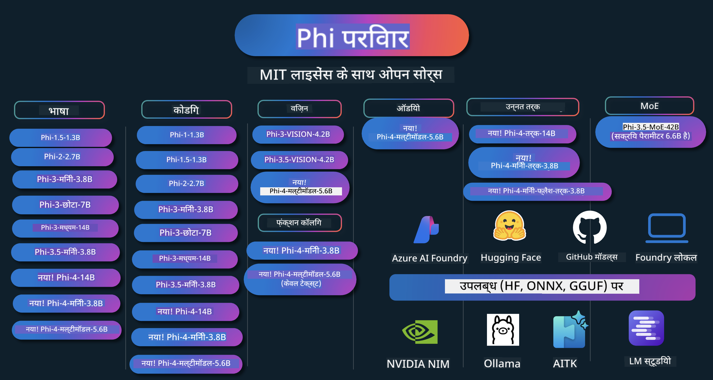

<!--
CO_OP_TRANSLATOR_METADATA:
{
  "original_hash": "c2e4b490f4bd424b095f21e38c6af33b",
  "translation_date": "2026-01-05T01:33:35+00:00",
  "source_file": "README.md",
  "language_code": "hi"
}
-->
# Phi Cookbook: Microsoft के Phi मॉडल्स के साथ हैंड्स-ऑन उदाहरण

[](https://codespaces.new/microsoft/phicookbook)
[](https://vscode.dev/redirect?url=vscode://ms-vscode-remote.remote-containers/cloneInVolume?url=https://github.com/microsoft/phicookbook)

[](https://GitHub.com/microsoft/phicookbook/graphs/contributors/?WT.mc_id=aiml-137032-kinfeylo)
[](https://GitHub.com/microsoft/phicookbook/issues/?WT.mc_id=aiml-137032-kinfeylo)
[](https://GitHub.com/microsoft/phicookbook/pulls/?WT.mc_id=aiml-137032-kinfeylo)
[](http://makeapullrequest.com?WT.mc_id=aiml-137032-kinfeylo)

[](https://GitHub.com/microsoft/phicookbook/watchers/?WT.mc_id=aiml-137032-kinfeylo)
[](https://GitHub.com/microsoft/phicookbook/network/?WT.mc_id=aiml-137032-kinfeylo)
[](https://GitHub.com/microsoft/phicookbook/stargazers/?WT.mc_id=aiml-137032-kinfeylo)

[](https://discord.com/invite/ByRwuEEgH4)

Phi Microsoft द्वारा विकसित ओपन सोर्स AI मॉडलों की एक श्रृंखला है। 

Phi वर्तमान में सबसे शक्तिशाली और लागत-प्रभावी छोटे भाषा मॉडल (SLM) है, जिसमें बहु-भाषा, तर्क, टेक्स्ट/चैट जनरेशन, कोडिंग, इमेजेस, ऑडियो और अन्य परिदृश्यों में बहुत अच्छे बेंचमार्क हैं। 

आप Phi को क्लाउड या एज डिवाइसेज़ पर डिप्लॉय कर सकते हैं, और सीमित कंप्यूटिंग पावर के साथ जनरेटिव AI एप्लिकेशन आसानी से बना सकते हैं।

इन संसाधनों का उपयोग शुरू करने के लिए निम्न चरणों का पालन करें :
1. **रिपॉज़िटरी फोर्क करें**: क्लिक करें [](https://GitHub.com/microsoft/phicookbook/network/?WT.mc_id=aiml-137032-kinfeylo)
2. **रिपॉज़िटरी क्लोन करें**:   `git clone https://github.com/microsoft/PhiCookBook.git`
3. [**Microsoft AI Discord समुदाय में जुड़ें और विशेषज्ञों व सह-विकासियों से मिलें**](https://discord.com/invite/ByRwuEEgH4?WT.mc_id=aiml-137032-kinfeylo)



### 🌐 बहुभाषी समर्थन

#### GitHub Action के माध्यम से समर्थित (स्वचालित और हमेशा अद्यतन)

<!-- CO-OP TRANSLATOR LANGUAGES TABLE START -->
[अरबी](../ar/README.md) | [बंगाली](../bn/README.md) | [बुल्गेरियाई](../bg/README.md) | [बर्मी (म्यांमार)](../my/README.md) | [चीनी (सरलीकृत)](../zh/README.md) | [चीनी (पारंपरिक, हांगकांग)](../hk/README.md) | [चीनी (पारंपरिक, मकाओ)](../mo/README.md) | [चीनी (पारंपरिक, ताइवान)](../tw/README.md) | [क्रोएशियाई](../hr/README.md) | [चेक](../cs/README.md) | [डेनिश](../da/README.md) | [डच](../nl/README.md) | [एस्टोनियाई](../et/README.md) | [फिनिश](../fi/README.md) | [फ्रेंच](../fr/README.md) | [जर्मन](../de/README.md) | [यूनानी](../el/README.md) | [हिब्रू](../he/README.md) | [हिंदी](./README.md) | [हंगेरियन](../hu/README.md) | [इंडोनेशियाई](../id/README.md) | [इतालवी](../it/README.md) | [जापानी](../ja/README.md) | [कन्नड़](../kn/README.md) | [कोरियाई](../ko/README.md) | [लिथुआनियाई](../lt/README.md) | [मलय](../ms/README.md) | [मलयालम](../ml/README.md) | [मराठी](../mr/README.md) | [नेपाली](../ne/README.md) | [नाइजीरियन पिजिन](../pcm/README.md) | [नॉर्वेजियाई](../no/README.md) | [फ़ारसी (Farsi)](../fa/README.md) | [पोलिश](../pl/README.md) | [पुर्तगाली (ब्राज़ील)](../br/README.md) | [पुर्तगाली (पुर्तगाल)](../pt/README.md) | [पंजाबी (गुरमुखी)](../pa/README.md) | [रोमानियाई](../ro/README.md) | [रूसी](../ru/README.md) | [सर्बियाई (सिरिलिक)](../sr/README.md) | [स्लोवाक](../sk/README.md) | [स्लोवेनियाई](../sl/README.md) | [स्पैनिश](../es/README.md) | [स्वाहिली](../sw/README.md) | [स्वीडिश](../sv/README.md) | [टैगालोग (फ़िलीपीनो)](../tl/README.md) | [तमिल](../ta/README.md) | [तेलुगु](../te/README.md) | [थाई](../th/README.md) | [तुर्की](../tr/README.md) | [यूक्रेनी](../uk/README.md) | [उर्दू](../ur/README.md) | [वियतनामी](../vi/README.md)

> **स्थानीय रूप से क्लोन करना पसंद करते हैं?**

> यह रिपॉज़िटरी 50+ भाषा अनुवाद शामिल करती है जो डाउनलोड साइज को काफी बढ़ा देती है। अनुवादों के बिना क्लोन करने के लिए, sparse checkout का उपयोग करें:
> ```bash
> git clone --filter=blob:none --sparse https://github.com/microsoft/PhiCookBook.git
> cd PhiCookBook
> git sparse-checkout set --no-cone '/*' '!translations' '!translated_images'
> ```
> यह आपको कोर्स पूरा करने के लिए आवश्यक सबकुछ देता है और डाउनलोड बहुत तेज़ होता है।
<!-- CO-OP TRANSLATOR LANGUAGES TABLE END -->

## सामग्री

- परिचय
  - [Phi परिवार में स्वागत](./md/01.Introduction/01/01.PhiFamily.md)
  - [अपने वातावरण को सेटअप करना](./md/01.Introduction/01/01.EnvironmentSetup.md)
  - [मुख्य तकनीकों को समझना](./md/01.Introduction/01/01.Understandingtech.md)
  - [Phi मॉडलों के लिए AI सुरक्षा](./md/01.Introduction/01/01.AISafety.md)
  - [Phi हार्डवेयर समर्थन](./md/01.Introduction/01/01.Hardwaresupport.md)
  - [Phi मॉडल और प्लेटफ़ॉर्म पर उपलब्धता](./md/01.Introduction/01/01.Edgeandcloud.md)
  - [Guidance-ai और Phi का उपयोग](./md/01.Introduction/01/01.Guidance.md)
  - [GitHub Marketplace मॉडल्स](https://github.com/marketplace/models)
  - [Azure AI मॉडल सूची](https://ai.azure.com)

- विभिन्न वातावरणों में Phi का इनफरेंस
    -  [Hugging face](./md/01.Introduction/02/01.HF.md)
    -  [GitHub मॉडल्स](./md/01.Introduction/02/02.GitHubModel.md)
    -  [Azure AI Foundry Model Catalog](./md/01.Introduction/02/03.AzureAIFoundry.md)
    -  [Ollama](./md/01.Introduction/02/04.Ollama.md)
    -  [AI Toolkit VSCode (AITK)](./md/01.Introduction/02/05.AITK.md)
    -  [NVIDIA NIM](./md/01.Introduction/02/06.NVIDIA.md)
    -  [Foundry Local](./md/01.Introduction/02/07.FoundryLocal.md)

- Phi परिवार में इनफरेंस
    - [iOS में Phi का इनफरेंस](./md/01.Introduction/03/iOS_Inference.md)
    - [Android में Phi का इनफरेंस](./md/01.Introduction/03/Android_Inference.md)
    - [Jetson में Phi का इनफरेंस](./md/01.Introduction/03/Jetson_Inference.md)
    - [AI पीसी में Phi का इनफरेंस](./md/01.Introduction/03/AIPC_Inference.md)
    - [Apple MLX फ्रेमवर्क के साथ Phi का इनफरेंस](./md/01.Introduction/03/MLX_Inference.md)
    - [लोकल सर्वर में Phi का इनफरेंस](./md/01.Introduction/03/Local_Server_Inference.md)
    - [AI Toolkit का उपयोग करके रिमोट सर्वर में Phi का इनफरेंस](./md/01.Introduction/03/Remote_Interence.md)
    - [Rust के साथ Phi का इनफरेंस](./md/01.Introduction/03/Rust_Inference.md)
    - [लोकल में Phi--Vision का इनफरेंस](./md/01.Introduction/03/Vision_Inference.md)
    - [Kaito AKS, Azure Containers (आधिकारिक समर्थन) के साथ Phi का इनफरेंस](./md/01.Introduction/03/Kaito_Inference.md)
-  [Phi परिवार का मात्रात्मक मूल्यांकन](./md/01.Introduction/04/QuantifyingPhi.md)
    - [llama.cpp का उपयोग करके Phi-3.5 / 4 का क्वांटाइज़ेशन](./md/01.Introduction/04/UsingLlamacppQuantifyingPhi.md)
    - [Generative AI extensions for onnxruntime का उपयोग करके Phi-3.5 / 4 का क्वांटाइज़ेशन](./md/01.Introduction/04/UsingORTGenAIQuantifyingPhi.md)
    - [Intel OpenVINO का उपयोग करके Phi-3.5 / 4 का क्वांटाइज़ेशन](./md/01.Introduction/04/UsingIntelOpenVINOQuantifyingPhi.md)
    - [Apple MLX फ्रेमवर्क का उपयोग करके Phi-3.5 / 4 का क्वांटाइज़ेशन](./md/01.Introduction/04/UsingAppleMLXQuantifyingPhi.md)

-  Phi का मूल्यांकन
    - [Response AI](./md/01.Introduction/05/ResponsibleAI.md)
    - [मूल्यांकन के लिए Azure AI Foundry](./md/01.Introduction/05/AIFoundry.md)
    - [मूल्यांकन के लिए Promptflow का उपयोग](./md/01.Introduction/05/Promptflow.md)
 
- Azure AI Search के साथ RAG
    - [Azure AI Search के साथ Phi-4-mini और Phi-4-multimodal(RAG) का उपयोग कैसे करें](https://github.com/microsoft/PhiCookBook/blob/main/code/06.E2E/E2E_Phi-4-RAG-Azure-AI-Search.ipynb)

- Phi अनुप्रयोग विकास नमूने
  - टेक्स्ट और चैट अनुप्रयोग
    - Phi-4 नमूने 🆕
      - [📓] [Phi-4-mini ONNX मॉडल के साथ चैट](./md/02.Application/01.TextAndChat/Phi4/ChatWithPhi4ONNX/README.md)
      - [Phi-4 लोकल ONNX मॉडल के साथ चैट .NET](../../md/04.HOL/dotnet/src/LabsPhi4-Chat-01OnnxRuntime)
      - [Phi-4 ONNX के साथ .NET कंसोल ऐप Sementic Kernel का उपयोग करके](../../md/04.HOL/dotnet/src/LabsPhi4-Chat-02SK)
    - Phi-3 / 3.5 नमूने
      - [Phi3, ONNX Runtime Web और WebGPU का उपयोग करके ब्राउज़र में लोकल चैटबोट](https://github.com/microsoft/onnxruntime-inference-examples/tree/main/js/chat)
      - [OpenVino चैट](./md/02.Application/01.TextAndChat/Phi3/E2E_OpenVino_Chat.md)
      - [मल्टी मॉडल - इंटरैक्टिव Phi-3-mini और OpenAI Whisper](./md/02.Application/01.TextAndChat/Phi3/E2E_Phi-3-mini_with_whisper.md)
      - [MLFlow - एक रैपर बनाना और Phi-3 को MLFlow के साथ उपयोग करना](./md//02.Application/01.TextAndChat/Phi3/E2E_Phi-3-MLflow.md)
      - [मॉडल अनुकूलन - Olive के साथ ONNX Runtime Web के लिए Phi-3-min मॉडल को कैसे अनुकूलित करें](https://github.com/microsoft/Olive/tree/main/examples/phi3)
      - [WinUI3 ऐप Phi-3 mini-4k-instruct-onnx के साथ](https://github.com/microsoft/Phi3-Chat-WinUI3-Sample/)
      -[WinUI3 मल्टी मॉडल AI-संचालित नोट्स ऐप नमूना](https://github.com/microsoft/ai-powered-notes-winui3-sample)
      - [कस्टम Phi-3 मॉडलों को Prompt flow के साथ फाइन-ट्यून और एकीकृत करें](./md/02.Application/01.TextAndChat/Phi3/E2E_Phi-3-FineTuning_PromptFlow_Integration.md)
      - [Azure AI Foundry में कस्टम Phi-3 मॉडलों को Prompt flow के साथ फाइन-ट्यून और एकीकृत करें](./md/02.Application/01.TextAndChat/Phi3/E2E_Phi-3-FineTuning_PromptFlow_Integration_AIFoundry.md)
      - [Azure AI Foundry में फाइन‑ट्यून किए गए Phi-3 / Phi-3.5 मॉडल का मूल्यांकन, माइक्रोसॉफ्ट के जिम्मेदार AI सिद्धांतों पर ध्यान केंद्रित करते हुए](./md/02.Application/01.TextAndChat/Phi3/E2E_Phi-3-Evaluation_AIFoundry.md)
      - [📓] [Phi-3.5-mini-instruct भाषा पूर्वानुमान नमूना (Chinese/English)](./md/02.Application/01.TextAndChat/Phi3/phi3-instruct-demo.ipynb)
      - [Phi-3.5-Instruct WebGPU RAG चैटबोट](./md/02.Application/01.TextAndChat/Phi3/WebGPUWithPhi35Readme.md)
      - [Windows GPU का उपयोग करके Phi-3.5-Instruct ONNX के साथ Prompt flow समाधान बनाना](./md/02.Application/01.TextAndChat/Phi3/UsingPromptFlowWithONNX.md)
      - [Microsoft Phi-3.5 tflite का उपयोग करके Android ऐप बनाना](./md/02.Application/01.TextAndChat/Phi3/UsingPhi35TFLiteCreateAndroidApp.md)
      - [स्थानीय ONNX Phi-3 मॉडल का उपयोग करते हुए Microsoft.ML.OnnxRuntime के साथ Q&A .NET उदाहरण](../../md/04.HOL/dotnet/src/LabsPhi301)
      - [Semantic Kernel और Phi-3 के साथ कंसोल चैट .NET ऐप](../../md/04.HOL/dotnet/src/LabsPhi302)

  - Azure AI Inference SDK कोड-आधारित नमूने 
    - Phi-4 नमूने 🆕
      - [📓] [Phi-4-multimodal का उपयोग करके प्रोजेक्ट कोड जनरेट करें](./md/02.Application/02.Code/Phi4/GenProjectCode/README.md)
    - Phi-3 / 3.5 नमूने
      - [अपना Visual Studio Code GitHub Copilot चैट Microsoft Phi-3 Family के साथ बनाएं](./md/02.Application/02.Code/Phi3/VSCodeExt/README.md)
      - [GitHub Models द्वारा Phi-3.5 के साथ अपना Visual Studio Code Chat Copilot Agent बनाएं](/md/02.Application/02.Code/Phi3/CreateVSCodeChatAgentWithGitHubModels.md)

  - उन्नत तर्क नमूने
    - Phi-4 नमूने 🆕
      - [📓] [Phi-4-mini-reasoning या Phi-4-reasoning नमूने](./md/02.Application/03.AdvancedReasoning/Phi4/AdvancedResoningPhi4mini/README.md)
      - [📓] [Microsoft Olive के साथ Phi-4-mini-reasoning का फाइन-ट्यूनिंग](./md/02.Application/03.AdvancedReasoning/Phi4/AdvancedResoningPhi4mini/olive_ft_phi_4_reasoning_with_medicaldata.ipynb)
      - [📓] [Apple MLX के साथ Phi-4-mini-reasoning का फाइन-ट्यूनिंग](./md/02.Application/03.AdvancedReasoning/Phi4/AdvancedResoningPhi4mini/mlx_ft_phi_4_reasoning_with_medicaldata.ipynb)
      - [📓] [GitHub Models के साथ Phi-4-mini-reasoning](./md/02.Application/02.Code/Phi4r/github_models_inference.ipynb)
      - [📓] [Azure AI Foundry Models के साथ Phi-4-mini-reasoning](./md/02.Application/02.Code/Phi4r/azure_models_inference.ipynb)
  - डेमो
      - [Hugging Face Spaces पर होस्ट किए गए Phi-4-mini डेमो](https://huggingface.co/spaces/microsoft/phi-4-mini?WT.mc_id=aiml-137032-kinfeylo)
      - [Hugginge Face Spaces पर होस्ट किए गए Phi-4-multimodal डेमो](https://huggingface.co/spaces/microsoft/phi-4-multimodal?WT.mc_id=aiml-137032-kinfeylo)
  - विज़न नमूने
    - Phi-4 नमूने 🆕
      - [📓] [इमेज पढ़ने और कोड जनरेट करने के लिए Phi-4-multimodal का उपयोग करें](./md/02.Application/04.Vision/Phi4/CreateFrontend/README.md) 
    - Phi-3 / 3.5 नमूने
      -  [📓][Phi-3-vision - इमेज टेक्स्ट से टेक्स्ट](./md/02.Application/04.Vision/Phi3/E2E_Phi-3-vision-image-text-to-text-online-endpoint.ipynb)
      - [Phi-3-vision-ONNX](https://onnxruntime.ai/docs/genai/tutorials/phi3-v.html)
      - [📓][Phi-3-vision CLIP एम्बेडिंग](./md/02.Application/04.Vision/Phi3/E2E_Phi-3-vision-image-text-to-text-online-endpoint.ipynb)
      - [डेमो: Phi-3 रीसायक्लिंग](https://github.com/jennifermarsman/PhiRecycling/)
      - [Phi-3-vision - विज़ुअल भाषा सहायक - Phi3-Vision और OpenVINO के साथ](https://docs.openvino.ai/nightly/notebooks/phi-3-vision-with-output.html)
      - [Phi-3 Vision Nvidia NIM](./md/02.Application/04.Vision/Phi3/E2E_Nvidia_NIM_Vision.md)
      - [Phi-3 Vision OpenVino](./md/02.Application/04.Vision/Phi3/E2E_OpenVino_Phi3Vision.md)
      - [📓][Phi-3.5 Vision मल्टी-फ्रेम या मल्टी-इमेज नमूना](./md/02.Application/04.Vision/Phi3/phi3-vision-demo.ipynb)
      - [Phi-3 Vision Local ONNX Model using the Microsoft.ML.OnnxRuntime .NET](../../md/04.HOL/dotnet/src/LabsPhi303)
      - [Menu based Phi-3 Vision Local ONNX Model using the Microsoft.ML.OnnxRuntime .NET](../../md/04.HOL/dotnet/src/LabsPhi304)

  - गणित के नमूने
    -  Phi-4-Mini-Flash-Reasoning-Instruct नमूने 🆕 [Phi-4-Mini-Flash-Reasoning-Instruct के साथ गणित डेमो](./md/02.Application/09.Math/MathDemo.ipynb)

  - ऑडियो नमूने
    - Phi-4 नमूने 🆕
      - [📓] [Phi-4-multimodal का उपयोग करके ऑडियो ट्रांसक्रिप्ट निकालना](./md/02.Application/05.Audio/Phi4/Transciption/README.md)
      - [📓] [Phi-4-multimodal ऑडियो नमूना](./md/02.Application/05.Audio/Phi4/Siri/demo.ipynb)
      - [📓] [Phi-4-multimodal भाषण अनुवाद नमूना](./md/02.Application/05.Audio/Phi4/Translate/demo.ipynb)
      - [.NET कंसोल एप्लिकेशन जो Phi-4-multimodal ऑडियो का उपयोग करके एक ऑडियो फ़ाइल का विश्लेषण करता है और ट्रांसक्रिप्ट जनरेट करता है](../../md/04.HOL/dotnet/src/LabsPhi4-MultiModal-02Audio)

  - MOE नमूने
    - Phi-3 / 3.5 नमूने
      - [📓] [Phi-3.5 Mixture of Experts Models (MoEs) सोशल मीडिया नमूना](./md/02.Application/06.MoE/Phi3/phi3_moe_demo.ipynb)
      - [📓] [NVIDIA NIM Phi-3 MOE, Azure AI Search, और LlamaIndex के साथ Retrieval-Augmented Generation (RAG) पाइपलाइन बनाना](./md/02.Application/06.MoE/Phi3/azure-ai-search-nvidia-rag.ipynb)
      - 
  - फ़ंक्शन कॉलिंग नमूने
    - Phi-4 नमूने 🆕
      -  [📓] [Phi-4-mini के साथ फ़ंक्शन कॉलिंग का उपयोग करना](./md/02.Application/07.FunctionCalling/Phi4/FunctionCallingBasic/README.md)
      -  [📓] [Phi-4-mini के साथ मल्टी-एजेंट बनाने के लिए फ़ंक्शन कॉलिंग का उपयोग करना](./md/02.Application/07.FunctionCalling/Phi4/Multiagents/Phi_4_mini_multiagent.ipynb)
      -  [📓] [Ollama के साथ फ़ंक्शन कॉलिंग का उपयोग करना](./md/02.Application/07.FunctionCalling/Phi4/Ollama/ollama_functioncalling.ipynb)
      -  [📓] [ONNX के साथ फ़ंक्शन कॉलिंग का उपयोग करना](./md/02.Application/07.FunctionCalling/Phi4/ONNX/onnx_parallel_functioncalling.ipynb)
  - मल्टीमॉडल मिक्सिंग नमूने
    - Phi-4 नमूने 🆕
      -  [📓] [एक तकनीकी पत्रकार के रूप में Phi-4-multimodal का उपयोग करना](./md/02.Application/08.Multimodel/Phi4/TechJournalist/phi_4_mm_audio_text_publish_news.ipynb)
      - [.NET कंसोल एप्लिकेशन जो छवियों का विश्लेषण करने के लिए Phi-4-multimodal का उपयोग करता है](../../md/04.HOL/dotnet/src/LabsPhi4-MultiModal-01Images)

- Phi के फाइन-ट्यूनिंग नमूने
  - [फाइन-ट्यूनिंग परिदृश्य](./md/03.FineTuning/FineTuning_Scenarios.md)
  - [फाइन-ट्यूनिंग बनाम RAG](./md/03.FineTuning/FineTuning_vs_RAG.md)
  - [फाइन-ट्यूनिंग: Phi-3 को एक उद्योग विशेषज्ञ बनाएं](./md/03.FineTuning/LetPhi3gotoIndustriy.md)
  - [AI Toolkit for VS Code के साथ Phi-3 का फाइन-ट्यूनिंग](./md/03.FineTuning/Finetuning_VSCodeaitoolkit.md)
  - [Azure Machine Learning Service के साथ Phi-3 का फाइन-ट्यूनिंग](./md/03.FineTuning/Introduce_AzureML.md)
  - [Lora के साथ Phi-3 का फाइन-ट्यूनिंग](./md/03.FineTuning/FineTuning_Lora.md)
  - [QLora के साथ Phi-3 का फाइन-ट्यूनिंग](./md/03.FineTuning/FineTuning_Qlora.md)
  - [Azure AI Foundry के साथ Phi-3 का फाइन-ट्यूनिंग](./md/03.FineTuning/FineTuning_AIFoundry.md)
  - [Azure ML CLI/SDK के साथ Phi-3 का फाइन-ट्यूनिंग](./md/03.FineTuning/FineTuning_MLSDK.md)
  - [Microsoft Olive के साथ फाइन-ट्यूनिंग](./md/03.FineTuning/FineTuning_MicrosoftOlive.md)
  - [Microsoft Olive हैंड्स-ऑन लैब के साथ फाइन-ट्यूनिंग](./md/03.FineTuning/olive-lab/readme.md)
  - [Weights and Bias के साथ Phi-3-vision का फाइन-ट्यूनिंग](./md/03.FineTuning/FineTuning_Phi-3-visionWandB.md)
  - [Apple MLX Framework के साथ Phi-3 का फाइन-ट्यूनिंग](./md/03.FineTuning/FineTuning_MLX.md)
  - [Phi-3-vision का फाइन-ट्यूनिंग (आधिकारिक समर्थन)](./md/03.FineTuning/FineTuning_Vision.md)
  - [Kaito AKS, Azure Containers के साथ Phi-3 का फाइन-ट्यूनिंग (आधिकारिक समर्थन)](./md/03.FineTuning/FineTuning_Kaito.md)
  - [Phi-3 और 3.5 Vision का फाइन-ट्यूनिंग](https://github.com/2U1/Phi3-Vision-Finetune)

- हैंड्स-ऑन लैब
  - [उन्नत मॉडल का अन्वेषण: LLMs, SLMs, स्थानीय विकास और अधिक](https://github.com/microsoft/aitour-exploring-cutting-edge-models)
  - [NLP क्षमता अनलॉक करना: Microsoft Olive के साथ फाइन-ट्यूनिंग](https://github.com/azure/Ignite_FineTuning_workshop)

- अकादमिक शोध पत्र और प्रकाशन
  - [Textbooks Are All You Need II: phi-1.5 तकनीकी रिपोर्ट](https://arxiv.org/abs/2309.05463)
  - [Phi-3 तकनीकी रिपोर्ट: आपके फोन पर स्थानीय रूप से एक अत्यंत सक्षम भाषा मॉडल](https://arxiv.org/abs/2404.14219)
  - [Phi-4 तकनीकी रिपोर्ट](https://arxiv.org/abs/2412.08905)
  - [Phi-4-Mini तकनीकी रिपोर्ट: Mixture-of-LoRAs के माध्यम से कॉम्पैक्ट परंतु शक्तिशाली मल्टीमॉडल भाषा मॉडल](https://arxiv.org/abs/2503.01743)
  - [वाहन में फ़ंक्शन-कॉलिंग के लिए छोटे भाषा मॉडलों का अनुकूलन](https://arxiv.org/abs/2501.02342)
  - [(WhyPHI) PHI-3 को मल्टीपल-चॉइस प्रश्नोत्तर के लिए फाइन-ट्यून करना: कार्यप्रणाली, परिणाम, और चुनौतियाँ](https://arxiv.org/abs/2501.01588)
  - [Phi-4-reasoning तकनीकी रिपोर्ट](https://www.microsoft.com/en-us/research/wp-content/uploads/2025/04/phi_4_reasoning.pdf)
  - [Phi-4-mini-reasoning तकनीकी रिपोर्ट](https://huggingface.co/microsoft/Phi-4-mini-reasoning/blob/main/Phi-4-Mini-Reasoning.pdf)

## Phi मॉडल का उपयोग

### Azure AI Foundry पर Phi

आप सीख सकते हैं कि Microsoft Phi का उपयोग कैसे करें और अपने विभिन्न हार्डवेयर डिवाइसों में E2E समाधान कैसे बनाएं। Phi का अनुभव करने के लिए, मॉडल के साथ प्रयोग करना और अपने परिदृश्यों के लिए Phi को कस्टमाइज़ करना शुरू करें, [Azure AI Foundry Azure AI Model Catalog](https://aka.ms/phi3-azure-ai) का उपयोग करते हुए। आप [Azure AI Foundry](/md/02.QuickStart/AzureAIFoundry_QuickStart.md) के साथ आरंभ करने के बारे में और जान सकते हैं।

**प्लेग्राउंड**
प्रत्येक मॉडल के पास मॉडल का परीक्षण करने के लिए एक समर्पित प्लेग्राउंड है [Azure AI Playground](https://aka.ms/try-phi3).

### GitHub मॉडल्स पर Phi

आप सीख सकते हैं कि Microsoft Phi का उपयोग कैसे करें और अपने विभिन्न हार्डवेयर डिवाइसों में E2E समाधान कैसे बनाएं। Phi का अनुभव करने के लिए, मॉडल के साथ प्रयोग करना और अपने परिदृश्यों के लिए Phi को कस्टमाइज़ करना शुरू करें, [GitHub Model Catalog](https://github.com/marketplace/models?WT.mc_id=aiml-137032-kinfeylo) का उपयोग करते हुए। आप [GitHub Model Catalog](/md/02.QuickStart/GitHubModel_QuickStart.md) के साथ आरंभ करने के बारे में और जान सकते हैं।

**प्लेग्राउंड**
प्रत्येक मॉडल के पास एक समर्पित [प्लेग्राउंड to test the model](/md/02.QuickStart/GitHubModel_QuickStart.md).

### Hugging Face पर Phi

आप मॉडल को [Hugging Face](https://huggingface.co/microsoft) पर भी पा सकते हैं

**प्लेग्राउंड**
 [Hugging Chat प्लेग्राउंड](https://huggingface.co/chat/models/microsoft/Phi-3-mini-4k-instruct)

 ## 🎒 अन्य पाठ्यक्रम

हमारी टीम अन्य पाठ्यक्रम भी बनाती है! इन्हें देखें:

<!-- CO-OP TRANSLATOR OTHER COURSES START -->
### LangChain
[](https://aka.ms/langchain4j-for-beginners)
[](https://aka.ms/langchainjs-for-beginners?WT.mc_id=m365-94501-dwahlin)

---

### Azure / Edge / MCP / Agents
[](https://github.com/microsoft/AZD-for-beginners?WT.mc_id=academic-105485-koreyst)
[](https://github.com/microsoft/edgeai-for-beginners?WT.mc_id=academic-105485-koreyst)
[](https://github.com/microsoft/mcp-for-beginners?WT.mc_id=academic-105485-koreyst)
[](https://github.com/microsoft/ai-agents-for-beginners?WT.mc_id=academic-105485-koreyst)

---
 
### Generative AI Series
[](https://github.com/microsoft/generative-ai-for-beginners?WT.mc_id=academic-105485-koreyst)
[-9333EA?style=for-the-badge&labelColor=E5E7EB&color=9333EA)](https://github.com/microsoft/Generative-AI-for-beginners-dotnet?WT.mc_id=academic-105485-koreyst)
[-C084FC?style=for-the-badge&labelColor=E5E7EB&color=C084FC)](https://github.com/microsoft/generative-ai-for-beginners-java?WT.mc_id=academic-105485-koreyst)
[-E879F9?style=for-the-badge&labelColor=E5E7EB&color=E879F9)](https://github.com/microsoft/generative-ai-with-javascript?WT.mc_id=academic-105485-koreyst)

---
 
### Core Learning
[](https://aka.ms/ml-beginners?WT.mc_id=academic-105485-koreyst)
[](https://aka.ms/datascience-beginners?WT.mc_id=academic-105485-koreyst)
[](https://aka.ms/ai-beginners?WT.mc_id=academic-105485-koreyst)
[](https://github.com/microsoft/Security-101?WT.mc_id=academic-96948-sayoung)
[](https://aka.ms/webdev-beginners?WT.mc_id=academic-105485-koreyst)
[](https://aka.ms/iot-beginners?WT.mc_id=academic-105485-koreyst)
[](https://github.com/microsoft/xr-development-for-beginners?WT.mc_id=academic-105485-koreyst)

---
 
### Copilot Series
[](https://aka.ms/GitHubCopilotAI?WT.mc_id=academic-105485-koreyst)
[](https://github.com/microsoft/mastering-github-copilot-for-dotnet-csharp-developers?WT.mc_id=academic-105485-koreyst)
[](https://github.com/microsoft/CopilotAdventures?WT.mc_id=academic-105485-koreyst)
<!-- CO-OP TRANSLATOR OTHER COURSES END -->

## जिम्मेदार एआई 

Microsoft हमारे ग्राहकों को हमारे AI उत्पादों का जिम्मेदार उपयोग करने में मदद करने, अपने अनुभव साझा करने, और Transparency Notes और Impact Assessments जैसे उपकरणों के माध्यम से भरोसे पर आधारित साझेदारी बनाने के लिए प्रतिबद्ध है। इन संसाधनों में से कई [https://aka.ms/RAI](https://aka.ms/RAI) पर मिल सकते हैं।
Microsoft का जिम्मेदार AI के प्रति दृष्टिकोण हमारे AI सिद्धांतों—निष्पक्षता, विश्वसनीयता और सुरक्षा, गोपनीयता और सुरक्षा, समावेशिता, पारदर्शिता, और जवाबदेही—पर आधारित है।

बड़े पैमाने पर प्राकृतिक भाषा, छवि, और भाषण मॉडल - जैसे इस नमूने में उपयोग किए गए मॉडल - संभावित रूप से ऐसे व्यवहार कर सकते हैं जो अनुचित, अविश्वसनीय, या आपत्तिजनक हों, और परिणामस्वरूप नुकसान पहुंचा सकते हैं। जोखिमों और सीमाओं के बारे में सूचित रहने के लिए कृपया [Azure OpenAI service Transparency note](https://learn.microsoft.com/legal/cognitive-services/openai/transparency-note?tabs=text) देखें।

इन जोखिमों को कम करने के लिए सुझाया गया दृष्टिकोण यह है कि आपकी वास्तुकला में एक सुरक्षा प्रणाली शामिल की जाए जो हानिकारक व्यवहार का पता लगा सके और उसे रोके। [Azure AI Content Safety](https://learn.microsoft.com/azure/ai-services/content-safety/overview) एक स्वतंत्र सुरक्षा परत प्रदान करता है, जो एप्लिकेशन और सेवाओं में उपयोगकर्ता-जनित और AI-जनित हानिकारक सामग्री का पता लगाने में सक्षम है। Azure AI Content Safety में टेक्स्ट और इमेज API शामिल हैं जो आपको हानिकारक सामग्री का पता लगाने की अनुमति देते हैं। Azure AI Foundry के भीतर, Content Safety सेवा आपको विभिन्न मोडैलिटीज़ में हानिकारक सामग्री का पता लगाने के लिए नमूना कोड देखने, अन्वेषण करने और आज़माने की सुविधा देती है। निम्नलिखित [क्विकस्टार्ट प्रलेखन](https://learn.microsoft.com/azure/ai-services/content-safety/quickstart-text?tabs=visual-studio%2Clinux&pivots=programming-language-rest) आपको सेवा को अनुरोध भेजने के माध्यम से मार्गदर्शित करता है।

एक और पहलू जो ध्यान में रखने योग्य है वह है समग्र आवेदन प्रदर्शन। मल्टी-मॉडल और मल्टी-मॉडल्स एप्लिकेशन के साथ, हम प्रदर्शन का मतलब यह मानते हैं कि सिस्टम आपकी और आपके उपयोगकर्ताओं की अपेक्षाओं के अनुसार कार्य करता है, जिसमें हानिकारक आउटपुट न पैदा करना भी शामिल है। अपने समग्र आवेदन के प्रदर्शन का आकलन करना महत्वपूर्ण है, इसके लिए आप [Performance and Quality and Risk and Safety evaluators](https://learn.microsoft.com/azure/ai-studio/concepts/evaluation-metrics-built-in) का उपयोग कर सकते हैं। आपके पास [custom evaluators](https://learn.microsoft.com/azure/ai-studio/how-to/develop/evaluate-sdk#custom-evaluators) के साथ बनाकर और उनका मूल्यांकन करने की क्षमता भी है।
आप अपने विकास वातावरण में [Azure AI Evaluation SDK](https://microsoft.github.io/promptflow/index.html) का उपयोग करके अपने AI अनुप्रयोग का मूल्यांकन कर सकते हैं। किसी परीक्षण डेटासेट या लक्ष्य के साथ, आपके जनरेटिव AI अनुप्रयोग की जनरेशन को अंतर्निर्मित इवैल्युएटर्स या आपकी पसंद के कस्टम इवैल्युएटर्स के साथ मात्रात्मक रूप से मापा जाता है। अपने सिस्टम का मूल्यांकन शुरू करने के लिए Azure AI Evaluation SDK के साथ शुरुआत करने हेतु, आप [त्वरित प्रारंभ गाइड](https://learn.microsoft.com/azure/ai-studio/how-to/develop/flow-evaluate-sdk) का अनुसरण कर सकते हैं। एक बार जब आप एक इवैल्युएशन रन निष्पादित कर लेते हैं, तो आप [Azure AI Foundry में परिणामों का दृश्य देख सकते हैं](https://learn.microsoft.com/azure/ai-studio/how-to/evaluate-flow-results)। 

## ट्रेडमार्क

यह प्रोजेक्ट परियोजनाओं, उत्पादों या सेवाओं के ट्रेडमार्क या लोगो शामिल कर सकता है। Microsoft के ट्रेडमार्क या लोगो के अधिकृत उपयोग पर [Microsoft के ट्रेडमार्क और ब्रांड दिशानिर्देश](https://www.microsoft.com/legal/intellectualproperty/trademarks/usage/general) लागू होते हैं और उनका पालन अनिवार्य है। इस प्रोजेक्ट के संशोधित संस्करणों में Microsoft के ट्रेडमार्क या लोगो का उपयोग भ्रम पैदा नहीं करना चाहिए या Microsoft के प्रायोजन का संकेत नहीं देना चाहिए। किसी भी तृतीय-पक्ष के ट्रेडमार्क या लोगो का उपयोग उन तृतीय-पक्ष की नीतियों के अधीन होता है।

## सहायता

यदि आप फंस जाते हैं या AI एप्स बनाने के बारे में कोई प्रश्न है, तो जुड़ें:

[](https://aka.ms/foundry/discord)

यदि आपके पास उत्पाद के बारे में प्रतिक्रिया है या निर्माण के दौरान त्रुटियाँ आ रही हैं, तो जाएँ:

[](https://aka.ms/foundry/forum)

---

<!-- CO-OP TRANSLATOR DISCLAIMER START -->
अस्वीकरण:
यह दस्तावेज़ AI अनुवाद सेवा Co-op Translator (https://github.com/Azure/co-op-translator) का उपयोग करके अनूदित किया गया है। जबकि हम सटीकता के लिये प्रयासरत हैं, कृपया ध्यान दें कि स्वचालित अनुवादों में त्रुटियाँ या गलतियाँ हो सकती हैं। अधिकारिक स्रोत के रूप में मूल भाषा में उपलब्ध दस्तावेज़ को ही मान्यता दी जानी चाहिए। महत्वपूर्ण जानकारियों के लिये पेशेवर मानव अनुवाद की सिफारिश की जाती है। इस अनुवाद के उपयोग से उत्पन्न किसी भी गलतफहमी या गलत व्याख्या के लिए हम उत्तरदायी नहीं हैं।
<!-- CO-OP TRANSLATOR DISCLAIMER END -->