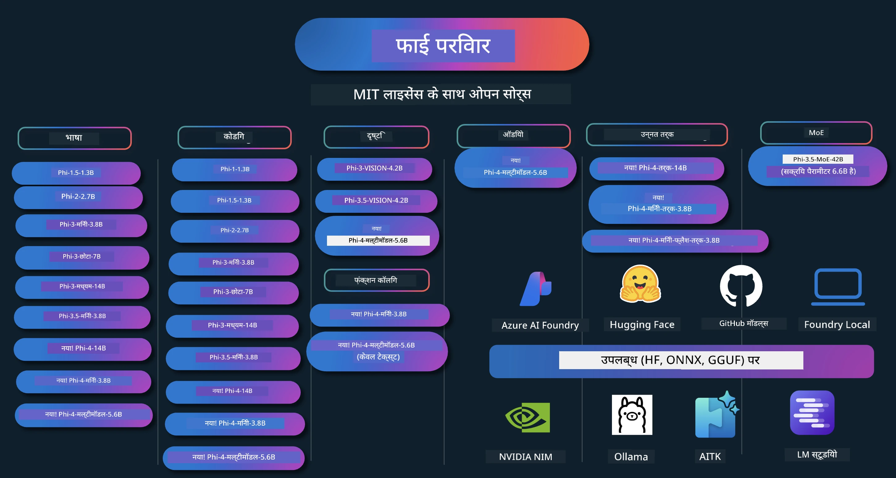

# Phi कुकबुक: Microsoft के Phi मॉडल के साथ हैंड्स-ऑन उदाहरण

[](https://codespaces.new/microsoft/phicookbook)
[](https://vscode.dev/redirect?url=vscode://ms-vscode-remote.remote-containers/cloneInVolume?url=https://github.com/microsoft/phicookbook)

[](https://GitHub.com/microsoft/phicookbook/graphs/contributors/?WT.mc_id=aiml-137032-kinfeylo)
[](https://GitHub.com/microsoft/phicookbook/issues/?WT.mc_id=aiml-137032-kinfeylo)
[](https://GitHub.com/microsoft/phicookbook/pulls/?WT.mc_id=aiml-137032-kinfeylo)
[](http://makeapullrequest.com?WT.mc_id=aiml-137032-kinfeylo)

[](https://GitHub.com/microsoft/phicookbook/watchers/?WT.mc_id=aiml-137032-kinfeylo)
[](https://GitHub.com/microsoft/phicookbook/network/?WT.mc_id=aiml-137032-kinfeylo)
[](https://GitHub.com/microsoft/phicookbook/stargazers/?WT.mc_id=aiml-137032-kinfeylo)

[](https://discord.com/invite/ByRwuEEgH4)

Phi माइक्रोसॉफ्ट द्वारा विकसित ओपन सोर्स AI मॉडल की एक श्रृंखला है।

Phi वर्तमान में सबसे शक्तिशाली और लागत-कुशल स्मॉल लैंग्वेज मॉडल (SLM) है, जिसमें बहुभाषी, तर्कशक्ति, टेक्स्ट/चैट जनरेशन, कोडिंग, इमेजेस, ऑडियो और अन्य परिदृश्यों में बहुत अच्छे बेंचमार्क हैं।

आप Phi को क्लाउड या एज डिवाइसों पर तैनात कर सकते हैं, और सीमित कंप्यूटिंग शक्ति के साथ आसानी से जनरेटिव AI एप्लिकेशन बना सकते हैं।

इन संसाधनों का उपयोग शुरू करने के लिए निम्नलिखित चरणों का पालन करें:
1. **रिपॉजिटरी को फ़ोर्क करें**: क्लिक करें [](https://GitHub.com/microsoft/phicookbook/network/?WT.mc_id=aiml-137032-kinfeylo)
2. **रिपॉजिटरी क्लोन करें**: `git clone https://github.com/microsoft/PhiCookBook.git`
3. [**Microsoft AI Discord कम्युनिटी में जुड़ें और विशेषज्ञों तथा अन्य डेवलपर्स से मिलें**](https://discord.com/invite/ByRwuEEgH4?WT.mc_id=aiml-137032-kinfeylo)



### 🌐 बहुभाषी समर्थन

#### GitHub Action के माध्यम से समर्थित (स्वचालित और हमेशा अपडेट रहता है)

<!-- CO-OP TRANSLATOR LANGUAGES TABLE START -->
[Arabic](../ar/README.md) | [Bengali](../bn/README.md) | [Bulgarian](../bg/README.md) | [Burmese (Myanmar)](../my/README.md) | [Chinese (Simplified)](../zh-CN/README.md) | [Chinese (Traditional, Hong Kong)](../zh-HK/README.md) | [Chinese (Traditional, Macau)](../zh-MO/README.md) | [Chinese (Traditional, Taiwan)](../zh-TW/README.md) | [Croatian](../hr/README.md) | [Czech](../cs/README.md) | [Danish](../da/README.md) | [Dutch](../nl/README.md) | [Estonian](../et/README.md) | [Finnish](../fi/README.md) | [French](../fr/README.md) | [German](../de/README.md) | [Greek](../el/README.md) | [Hebrew](../he/README.md) | [Hindi](./README.md) | [Hungarian](../hu/README.md) | [Indonesian](../id/README.md) | [Italian](../it/README.md) | [Japanese](../ja/README.md) | [Kannada](../kn/README.md) | [Korean](../ko/README.md) | [Lithuanian](../lt/README.md) | [Malay](../ms/README.md) | [Malayalam](../ml/README.md) | [Marathi](../mr/README.md) | [Nepali](../ne/README.md) | [Nigerian Pidgin](../pcm/README.md) | [Norwegian](../no/README.md) | [Persian (Farsi)](../fa/README.md) | [Polish](../pl/README.md) | [Portuguese (Brazil)](../pt-BR/README.md) | [Portuguese (Portugal)](../pt-PT/README.md) | [Punjabi (Gurmukhi)](../pa/README.md) | [Romanian](../ro/README.md) | [Russian](../ru/README.md) | [Serbian (Cyrillic)](../sr/README.md) | [Slovak](../sk/README.md) | [Slovenian](../sl/README.md) | [Spanish](../es/README.md) | [Swahili](../sw/README.md) | [Swedish](../sv/README.md) | [Tagalog (Filipino)](../tl/README.md) | [Tamil](../ta/README.md) | [Telugu](../te/README.md) | [Thai](../th/README.md) | [Turkish](../tr/README.md) | [Ukrainian](../uk/README.md) | [Urdu](../ur/README.md) | [Vietnamese](../vi/README.md)

> **स्थानीय रूप से क्लोन करना पसंद करें?**
>
> इस रिपॉजिटरी में 50+ भाषा अनुवाद शामिल हैं जो डाउनलोड साइज़ को बहुत बढ़ा देते हैं। अनुवादों के बिना क्लोन करने के लिए, sparse checkout का उपयोग करें:
>
> **Bash / macOS / Linux:**
> ```bash
> git clone --filter=blob:none --sparse https://github.com/microsoft/PhiCookBook.git
> cd PhiCookBook
> git sparse-checkout set --no-cone '/*' '!translations' '!translated_images'
> ```
>
> **CMD (Windows):**
> ```cmd
> git clone --filter=blob:none --sparse https://github.com/microsoft/PhiCookBook.git
> cd PhiCookBook
> git sparse-checkout set --no-cone "/*" "!translations" "!translated_images"
> ```
>
> यह आपको कोर्स पूरा करने के लिए ज़रूरी सब कुछ उपलब्ध कराता है, साथ ही डाउनलोड बहुत तेज़ होता है।
<!-- CO-OP TRANSLATOR LANGUAGES TABLE END -->

## सामग्री तालिका

- परिचय
  - [Phi परिवार में आपका स्वागत है](./md/01.Introduction/01/01.PhiFamily.md)
  - [अपने पर्यावरण को सेट अप करना](./md/01.Introduction/01/01.EnvironmentSetup.md)
  - [प्रमुख तकनीकों को समझना](./md/01.Introduction/01/01.Understandingtech.md)
  - [Phi मॉडल के लिए AI सुरक्षा](./md/01.Introduction/01/01.AISafety.md)
  - [Phi हार्डवेयर समर्थन](./md/01.Introduction/01/01.Hardwaresupport.md)
  - [प्लेटफॉर्म पर Phi मॉडल और उपलब्धता](./md/01.Introduction/01/01.Edgeandcloud.md)
  - [Guidance-ai और Phi का उपयोग करना](./md/01.Introduction/01/01.Guidance.md)
  - [GitHub मार्केटप्लेस मॉडल](https://github.com/marketplace/models)
  - [Azure AI मॉडल कैटलॉग](https://ai.azure.com)

- विभिन्न वातावरणों में Phi से निष्कर्ष निकालना
    -  [Hugging face](./md/01.Introduction/02/01.HF.md)
    -  [GitHub मॉडल](./md/01.Introduction/02/02.GitHubModel.md)
    -  [Microsoft Foundry मॉडल कैटलॉग](./md/01.Introduction/02/03.AzureAIFoundry.md)
    -  [Ollama](./md/01.Introduction/02/04.Ollama.md)
    -  [AI टूलकिट VSCode (AITK)](./md/01.Introduction/02/05.AITK.md)
    -  [NVIDIA NIM](./md/01.Introduction/02/06.NVIDIA.md)
    -  [Foundry लोकल](./md/01.Introduction/02/07.FoundryLocal.md)

- Phi परिवार से निष्कर्ष
    - [iOS में Phi से निष्कर्ष](./md/01.Introduction/03/iOS_Inference.md)
    - [Android में Phi से निष्कर्ष](./md/01.Introduction/03/Android_Inference.md)
    - [Jetson में Phi से निष्कर्ष](./md/01.Introduction/03/Jetson_Inference.md)
    - [AI PC में Phi से निष्कर्ष](./md/01.Introduction/03/AIPC_Inference.md)
    - [Apple MLX फ्रेमवर्क के साथ Phi से निष्कर्ष](./md/01.Introduction/03/MLX_Inference.md)
    - [लोकल सर्वर में Phi से निष्कर्ष](./md/01.Introduction/03/Local_Server_Inference.md)
    - [AI टूलकिट का उपयोग कर रिमोट सर्वर में Phi से निष्कर्ष](./md/01.Introduction/03/Remote_Interence.md)
    - [Rust के साथ Phi से निष्कर्ष](./md/01.Introduction/03/Rust_Inference.md)
    - [लोकल में Phi--Vision से निष्कर्ष](./md/01.Introduction/03/Vision_Inference.md)
    - [Kaito AKS, Azure कंटेनर (आधिकारिक समर्थन) के साथ Phi से निष्कर्ष](./md/01.Introduction/03/Kaito_Inference.md)
-  [Phi परिवार का क्वांटिफिकेशन](./md/01.Introduction/04/QuantifyingPhi.md)
    - [llama.cpp का उपयोग करके Phi-3.5 / 4 को क्वांटाइज़ करना](./md/01.Introduction/04/UsingLlamacppQuantifyingPhi.md)
    - [onnxruntime के लिए जनरेटिव AI एक्सटेंशन का उपयोग करके Phi-3.5 / 4 को क्वांटाइज़ करना](./md/01.Introduction/04/UsingORTGenAIQuantifyingPhi.md)
    - [Intel OpenVINO का उपयोग करके Phi-3.5 / 4 को क्वांटाइज़ करना](./md/01.Introduction/04/UsingIntelOpenVINOQuantifyingPhi.md)
    - [Apple MLX फ्रेमवर्क का उपयोग करके Phi-3.5 / 4 को क्वांटाइज़ करना](./md/01.Introduction/04/UsingAppleMLXQuantifyingPhi.md)

-  Phi का मूल्यांकन
    - [जिम्मेदार AI](./md/01.Introduction/05/ResponsibleAI.md)
    - [मूल्यांकन के लिए Microsoft Foundry](./md/01.Introduction/05/AIFoundry.md)
    - [मूल्यांकन के लिए Promptflow का उपयोग](./md/01.Introduction/05/Promptflow.md)
 
- Azure AI Search के साथ RAG
    - [Phi-4-mini और Phi-4-multimodal(RAG) को Azure AI Search के साथ कैसे उपयोग करें](https://github.com/microsoft/PhiCookBook/blob/main/code/06.E2E/E2E_Phi-4-RAG-Azure-AI-Search.ipynb)

- Phi एप्लिकेशन विकास सैंपल
  - टेक्स्ट और चैट एप्लिकेशन
    - Phi-4 सैंपल 🆕
      - [📓] [Phi-4-mini ONNX मॉडल के साथ चैट](./md/02.Application/01.TextAndChat/Phi4/ChatWithPhi4ONNX/README.md)
      - [Phi-4 लोकल ONNX मॉडल .NET के साथ चैट](../../md/04.HOL/dotnet/src/LabsPhi4-Chat-01OnnxRuntime)
      - [Sementic Kernel का उपयोग करते हुए Phi-4 ONNX के साथ .NET कंसोल ऐप से चैट](../../md/04.HOL/dotnet/src/LabsPhi4-Chat-02SK)
    - Phi-3 / 3.5 सैंपल
      - [Phi3, ONNX Runtime Web और WebGPU का उपयोग करके ब्राउज़र में लोकल चैटबॉट](https://github.com/microsoft/onnxruntime-inference-examples/tree/main/js/chat)
      - [OpenVino Chat](./md/02.Application/01.TextAndChat/Phi3/E2E_OpenVino_Chat.md)
      - [मल्टी मॉडल - इंटरैक्टिव Phi-3-mini और OpenAI Whisper](./md/02.Application/01.TextAndChat/Phi3/E2E_Phi-3-mini_with_whisper.md)
      - [MLFlow - एक रैपर बनाना और MLFlow के साथ Phi-3 का उपयोग करना](./md//02.Application/01.TextAndChat/Phi3/E2E_Phi-3-MLflow.md)
      - [मॉडल अनुकूलन - Olive के साथ ONNX Runtime Web के लिए Phi-3-min मॉडल को कैसे ऑप्टिमाइज़ करें](https://github.com/microsoft/Olive/tree/main/examples/phi3)
      - [WinUI3 ऐप विथ Phi-3 mini-4k-instruct-onnx](https://github.com/microsoft/Phi3-Chat-WinUI3-Sample/)
      -[WinUI3 मल्टी मॉडल AI पावर्ड नोट्स ऐप सैंपल](https://github.com/microsoft/ai-powered-notes-winui3-sample)
      - [कस्टम Phi-3 मॉडलों को फाइन-ट्यून और Prompt flow के साथ इंटीग्रेट करें](./md/02.Application/01.TextAndChat/Phi3/E2E_Phi-3-FineTuning_PromptFlow_Integration.md)
      - [Microsoft Foundry में Prompt flow के साथ कस्टम Phi-3 मॉडलों को फाइन-ट्यून और इंटीग्रेट करें](./md/02.Application/01.TextAndChat/Phi3/E2E_Phi-3-FineTuning_PromptFlow_Integration_AIFoundry.md)
      - [Microsoft Foundry में Microsoft's Responsible AI Principles पर फोकस करते हुए फाइन-ट्यून किए गए Phi-3 / Phi-3.5 मॉडल का मूल्यांकन करें](./md/02.Application/01.TextAndChat/Phi3/E2E_Phi-3-Evaluation_AIFoundry.md)
      - [📓] [Phi-3.5-mini-instruct भाषा भविष्यवाणी सैंपल (चीनी/अंग्रेजी)](./md/02.Application/01.TextAndChat/Phi3/phi3-instruct-demo.ipynb)
      - [Phi-3.5-Instruct WebGPU RAG चैटबोट](./md/02.Application/01.TextAndChat/Phi3/WebGPUWithPhi35Readme.md)
      - [Windows GPU का उपयोग करके Phi-3.5-Instruct ONNX के साथ Prompt flow सॉल्यूशन बनाना](./md/02.Application/01.TextAndChat/Phi3/UsingPromptFlowWithONNX.md)
      - [Microsoft Phi-3.5 tflite का उपयोग करके Android ऐप बनाना](./md/02.Application/01.TextAndChat/Phi3/UsingPhi35TFLiteCreateAndroidApp.md)
      - [स्थानीय ONNX Phi-3 मॉडल का उपयोग करते हुए Microsoft.ML.OnnxRuntime के साथ Q&A .NET उदाहरण](../../md/04.HOL/dotnet/src/LabsPhi301)
      - [Semantic Kernel और Phi-3 के साथ कंसोल चैट .NET ऐप](../../md/04.HOL/dotnet/src/LabsPhi302)

  - Azure AI Inference SDK कोड आधारित सैंपल्स 
    - Phi-4 सैंपल्स 🆕
      - [📓] [Phi-4-multimodal का उपयोग करके प्रोजेक्ट कोड जनरेट करें](./md/02.Application/02.Code/Phi4/GenProjectCode/README.md)
    - Phi-3 / 3.5 सैंपल्स
      - [Microsoft Phi-3 परिवार के साथ अपना Visual Studio Code GitHub Copilot चैट बनाएं](./md/02.Application/02.Code/Phi3/VSCodeExt/README.md)
      - [GitHub मॉडलों द्वारा Phi-3.5 के साथ अपना Visual Studio Code चैट कॉपिलॉट एजेंट बनाएं](/md/02.Application/02.Code/Phi3/CreateVSCodeChatAgentWithGitHubModels.md)

  - एडवांस्ड रीजनिंग सैंपल्स
    - Phi-4 सैंपल्स 🆕
      - [📓] [Phi-4-mini-रीजनिंग या Phi-4-रीजनिंग सैंपल्स](./md/02.Application/03.AdvancedReasoning/Phi4/AdvancedResoningPhi4mini/README.md)
      - [📓] [Microsoft Olive के साथ Phi-4-mini-रीजनिंग का फाइन-ट्यूनिंग](./md/02.Application/03.AdvancedReasoning/Phi4/AdvancedResoningPhi4mini/olive_ft_phi_4_reasoning_with_medicaldata.ipynb)
      - [📓] [Apple MLX के साथ Phi-4-mini-रीजनिंग का फाइन-ट्यूनिंग](./md/02.Application/03.AdvancedReasoning/Phi4/AdvancedResoningPhi4mini/mlx_ft_phi_4_reasoning_with_medicaldata.ipynb)
      - [📓] [GitHub मॉडलों के साथ Phi-4-mini-रीजनिंग](./md/02.Application/02.Code/Phi4r/github_models_inference.ipynb)
      - [📓] [Microsoft Foundry मॉडलों के साथ Phi-4-mini-रीजनिंग](./md/02.Application/02.Code/Phi4r/azure_models_inference.ipynb)
  - डेमो
      - [Phi-4-mini डेमो जिसका होस्टिंग Hugging Face Spaces पर है](https://huggingface.co/spaces/microsoft/phi-4-mini?WT.mc_id=aiml-137032-kinfeylo)
      - [Phi-4-multimodal डेमो जिसका होस्टिंग Hugginge Face Spaces पर है](https://huggingface.co/spaces/microsoft/phi-4-multimodal?WT.mc_id=aiml-137032-kinfeylo)
  - विज़न सैंपल्स
    - Phi-4 सैंपल्स 🆕
      - [📓] [Phi-4-multimodal का उपयोग करके छवियाँ पढ़ें और कोड जनरेट करें](./md/02.Application/04.Vision/Phi4/CreateFrontend/README.md) 
    - Phi-3 / 3.5 सैंपल्स
      -  [📓][Phi-3-vision-इमेज टेक्स्ट टू टेक्स्ट](./md/02.Application/04.Vision/Phi3/E2E_Phi-3-vision-image-text-to-text-online-endpoint.ipynb)
      - [Phi-3-vision-ONNX](https://onnxruntime.ai/docs/genai/tutorials/phi3-v.html)
      - [📓][Phi-3-vision CLIP एम्बेडिंग](./md/02.Application/04.Vision/Phi3/E2E_Phi-3-vision-image-text-to-text-online-endpoint.ipynb)
      - [डेमो: Phi-3 रीसाइक्लिंग](https://github.com/jennifermarsman/PhiRecycling/)
      - [Phi-3-vision - विज़ुअल लैंग्वेज असिस्टेंट - Phi3-विज़न और OpenVINO के साथ](https://docs.openvino.ai/nightly/notebooks/phi-3-vision-with-output.html)
      - [Phi-3 विज़न Nvidia NIM](./md/02.Application/04.Vision/Phi3/E2E_Nvidia_NIM_Vision.md)
      - [Phi-3 विज़न OpenVino](./md/02.Application/04.Vision/Phi3/E2E_OpenVino_Phi3Vision.md)
      - [📓][Phi-3.5 विज़न मल्टी-फ्रेम या मल्टी-इमेज सैंपल](./md/02.Application/04.Vision/Phi3/phi3-vision-demo.ipynb)
      - [Microsoft.ML.OnnxRuntime .NET का उपयोग करके Phi-3 विज़न स्थानीय ONNX मॉडल](../../md/04.HOL/dotnet/src/LabsPhi303)
      - [मेनू आधारित Phi-3 विज़न स्थानीय ONNX मॉडल Microsoft.ML.OnnxRuntime .NET के साथ](../../md/04.HOL/dotnet/src/LabsPhi304)

  - मैथ सैंपल्स
    -  Phi-4-Mini-Flash-Reasoning-Instruct सैंपल्स 🆕 [Phi-4-Mini-Flash-Reasoning-Instruct के साथ मैथ डेमो](./md/02.Application/09.Math/MathDemo.ipynb)

  - ऑडियो सैंपल्स
    - Phi-4 सैंपल्स 🆕
      - [📓] [Phi-4-multimodal का उपयोग करके ऑडियो ट्रांसक्रिप्ट निकालना](./md/02.Application/05.Audio/Phi4/Transciption/README.md)
      - [📓] [Phi-4-multimodal ऑडियो सैंपल](./md/02.Application/05.Audio/Phi4/Siri/demo.ipynb)
      - [📓] [Phi-4-multimodal स्पीच ट्रांसलेशन सैंपल](./md/02.Application/05.Audio/Phi4/Translate/demo.ipynb)
      - [.NET कंसोल एप्लिकेशन जो Phi-4-multimodal ऑडियो का उपयोग करके ऑडियो फ़ाइलों का विश्लेषण करता है और ट्रांसक्रिप्ट उत्पन्न करता है](../../md/04.HOL/dotnet/src/LabsPhi4-MultiModal-02Audio)

  - MOE सैंपल्स
    - Phi-3 / 3.5 सैंपल्स
      - [📓] [Phi-3.5 मिश्रित विशेषज्ञ मॉडल (MoEs) सोशल मीडिया सैंपल](./md/02.Application/06.MoE/Phi3/phi3_moe_demo.ipynb)
      - [📓] [NVIDIA NIM Phi-3 MOE, Azure AI सर्च, और LlamaIndex के साथ एक Retrieval-Augmented Generation (RAG) पाइपलाइन बनाना](./md/02.Application/06.MoE/Phi3/azure-ai-search-nvidia-rag.ipynb)
      - 
  - फंक्शन कॉलिंग सैंपल्स
    - Phi-4 सैंपल्स 🆕
      -  [📓] [Phi-4-mini के साथ Function Calling का उपयोग](./md/02.Application/07.FunctionCalling/Phi4/FunctionCallingBasic/README.md)
      -  [📓] [Phi-4-mini के साथ मल्टी-एजेंट बनाने के लिए Function Calling का उपयोग](./md/02.Application/07.FunctionCalling/Phi4/Multiagents/Phi_4_mini_multiagent.ipynb)
      -  [📓] [Ollama के साथ Function Calling का उपयोग](./md/02.Application/07.FunctionCalling/Phi4/Ollama/ollama_functioncalling.ipynb)
      -  [📓] [ONNX के साथ Function Calling का उपयोग](./md/02.Application/07.FunctionCalling/Phi4/ONNX/onnx_parallel_functioncalling.ipynb)
  - मल्टीमॉडल मिक्सिंग सैंपल्स
    - Phi-4 सैंपल्स 🆕
      -  [📓] [टेक्नोलॉजी पत्रकार के रूप में Phi-4-multimodal का उपयोग](./md/02.Application/08.Multimodel/Phi4/TechJournalist/phi_4_mm_audio_text_publish_news.ipynb)
      - [.NET कंसोल एप्लिकेशन जो Phi-4-multimodal का उपयोग करके छवियों का विश्लेषण करता है](../../md/04.HOL/dotnet/src/LabsPhi4-MultiModal-01Images)

- फाइन-ट्यूनिंग Phi सैंपल्स
  - [फाइन-ट्यूनिंग परिदृश्य](./md/03.FineTuning/FineTuning_Scenarios.md)
  - [फाइन-ट्यूनिंग बनाम RAG](./md/03.FineTuning/FineTuning_vs_RAG.md)
  - [Phi-3 को एक उद्योग विशेषज्ञ बनाएं फाइन-ट्यूनिंग](./md/03.FineTuning/LetPhi3gotoIndustriy.md)
  - [VS कोड के लिए AI टूलकिट के साथ Phi-3 का फाइन-ट्यूनिंग](./md/03.FineTuning/Finetuning_VSCodeaitoolkit.md)
  - [Azure मशीन लर्निंग सेवा के साथ Phi-3 का फाइन-ट्यूनिंग](./md/03.FineTuning/Introduce_AzureML.md)
  - [लॉरा के साथ Phi-3 का फाइन-ट्यूनिंग](./md/03.FineTuning/FineTuning_Lora.md)
  - [QLora के साथ Phi-3 का फाइन-ट्यूनिंग](./md/03.FineTuning/FineTuning_Qlora.md)
  - [Microsoft Foundry के साथ Phi-3 का फाइन-ट्यूनिंग](./md/03.FineTuning/FineTuning_AIFoundry.md)
  - [Azure ML CLI/SDK के साथ Phi-3 का फाइन-ट्यूनिंग](./md/03.FineTuning/FineTuning_MLSDK.md)
  - [Microsoft Olive के साथ फाइन-ट्यूनिंग](./md/03.FineTuning/FineTuning_MicrosoftOlive.md)
  - [Microsoft Olive हैंड्स-ऑन लैब के साथ फाइन-ट्यूनिंग](./md/03.FineTuning/olive-lab/readme.md)
  - [Weights and Bias के साथ Phi-3-विज़न का फाइन-ट्यूनिंग](./md/03.FineTuning/FineTuning_Phi-3-visionWandB.md)
  - [Apple MLX फ्रेमवर्क के साथ Phi-3 का फाइन-ट्यूनिंग](./md/03.FineTuning/FineTuning_MLX.md)
  - [Phi-3-विज़न का फाइन-ट्यूनिंग (आधिकारिक समर्थन)](./md/03.FineTuning/FineTuning_Vision.md)
  - [Kaito AKS , Azure Containers (आधिकारिक समर्थन) के साथ Phi-3 का फाइन-ट्यूनिंग](./md/03.FineTuning/FineTuning_Kaito.md)
  - [Phi-3 और 3.5 विज़न का फाइन-ट्यूनिंग](https://github.com/2U1/Phi3-Vision-Finetune)

- हैंड्स ऑन लैब
  - [अत्याधुनिक मॉडलों की खोज: LLMs, SLMs, स्थानीय विकास और बहुत कुछ](https://github.com/microsoft/aitour-exploring-cutting-edge-models)
  - [NLP क्षमता का अनलॉकिंग: Microsoft Olive के साथ फाइन-ट्यूनिंग](https://github.com/azure/Ignite_FineTuning_workshop)
- अकादमिक शोध पत्र और प्रकाशन
  - [Textbooks Are All You Need II: phi-1.5 तकनीकी रिपोर्ट](https://arxiv.org/abs/2309.05463)
  - [Phi-3 तकनीकी रिपोर्ट: आपके फोन पर स्थानीय रूप से एक अत्यंत सक्षम भाषा मॉडल](https://arxiv.org/abs/2404.14219)
  - [Phi-4 तकनीकी रिपोर्ट](https://arxiv.org/abs/2412.08905)
  - [Phi-4-Mini तकनीकी रिपोर्ट: Mixture-of-LoRAs के माध्यम से कॉम्पैक्ट फिर भी शक्तिशाली मल्टीमॉडल भाषा मॉडल](https://arxiv.org/abs/2503.01743)
  - [वाहन में फंक्शन-कॉलिंग के लिए छोटे भाषा मॉडलों का अनुकूलन](https://arxiv.org/abs/2501.02342)
  - [(WhyPHI) एकाधिक विकल्प प्रश्न उत्तर के लिए PHI-3 का फाइन-ट्यूनिंग: पद्धति, परिणाम और चुनौतियाँ](https://arxiv.org/abs/2501.01588)
  - [Phi-4-रिजनिंग तकनीकी रिपोर्ट](https://www.microsoft.com/en-us/research/wp-content/uploads/2025/04/phi_4_reasoning.pdf)
  - [Phi-4-मिनी-रिजनिंग तकनीकी रिपोर्ट](https://huggingface.co/microsoft/Phi-4-mini-reasoning/blob/main/Phi-4-Mini-Reasoning.pdf)

## Phi मॉडल का उपयोग

### Microsoft Foundry पर Phi

आप Microsoft Phi का उपयोग कैसे करें और अपने विभिन्न हार्डवेयर उपकरणों में E2E समाधान कैसे बनाएं, यह सीख सकते हैं। Phi का अनुभव करने के लिए, मॉडल के साथ खेलना शुरू करें और अपने परिदृश्यों के लिए Phi को अनुकूलित करें, [Microsoft Foundry Azure AI मॉडल कैटलॉग](https://aka.ms/phi3-azure-ai) का उपयोग करके। आप [Microsoft Foundry](/md/02.QuickStart/AzureAIFoundry_QuickStart.md) के साथ शुरुआत करने पर अधिक जान सकते हैं।

**प्लेटग्राउंड**  
प्रत्येक मॉडल का परीक्षण करने के लिए एक समर्पित प्लेटग्राउंड है [Azure AI Playground](https://aka.ms/try-phi3)।

### GitHub मॉडल पर Phi

आप Microsoft Phi का उपयोग कैसे करें और अपने विभिन्न हार्डवेयर उपकरणों में E2E समाधान कैसे बनाएं, यह सीख सकते हैं। Phi का अनुभव करने के लिए, मॉडल के साथ खेलना शुरू करें और अपने परिदृश्यों के लिए Phi को अनुकूलित करें, [GitHub मॉडल कैटलॉग](https://github.com/marketplace/models?WT.mc_id=aiml-137032-kinfeylo) का उपयोग करके। आप [GitHub मॉडल कैटलॉग](/md/02.QuickStart/GitHubModel_QuickStart.md) के साथ शुरुआत करने पर अधिक जान सकते हैं।

**प्लेटग्राउंड**  
प्रत्येक मॉडल का परीक्षण करने के लिए एक समर्पित [प्लेटग्राउंड](/md/02.QuickStart/GitHubModel_QuickStart.md) है।

### Hugging Face पर Phi

आप मॉडल को [Hugging Face](https://huggingface.co/microsoft) पर भी पा सकते हैं।

**प्लेटग्राउंड**  
[Hugging Chat प्लेटग्राउंड](https://huggingface.co/chat/models/microsoft/Phi-3-mini-4k-instruct)

## 🎒 अन्य पाठ्यक्रम

हमारी टीम अन्य पाठ्यक्रम भी बनाती है! देखें:

<!-- CO-OP TRANSLATOR OTHER COURSES START -->
### LangChain  
[](https://aka.ms/langchain4j-for-beginners)  
[](https://aka.ms/langchainjs-for-beginners?WT.mc_id=m365-94501-dwahlin)  
[](https://github.com/microsoft/langchain-for-beginners?WT.mc_id=m365-94501-dwahlin)  
---

### Azure / एज / MCP / एजेंट्स  
[](https://github.com/microsoft/AZD-for-beginners?WT.mc_id=academic-105485-koreyst)  
[](https://github.com/microsoft/edgeai-for-beginners?WT.mc_id=academic-105485-koreyst)  
[](https://github.com/microsoft/mcp-for-beginners?WT.mc_id=academic-105485-koreyst)  
[](https://github.com/microsoft/ai-agents-for-beginners?WT.mc_id=academic-105485-koreyst)  

---

### जनरेटिव AI श्रृंखला  
[](https://github.com/microsoft/generative-ai-for-beginners?WT.mc_id=academic-105485-koreyst)  
[-9333EA?style=for-the-badge&labelColor=E5E7EB&color=9333EA)](https://github.com/microsoft/Generative-AI-for-beginners-dotnet?WT.mc_id=academic-105485-koreyst)  
[-C084FC?style=for-the-badge&labelColor=E5E7EB&color=C084FC)](https://github.com/microsoft/generative-ai-for-beginners-java?WT.mc_id=academic-105485-koreyst)  
[-E879F9?style=for-the-badge&labelColor=E5E7EB&color=E879F9)](https://github.com/microsoft/generative-ai-with-javascript?WT.mc_id=academic-105485-koreyst)  

---

### कोर लर्निंग  
[](https://aka.ms/ml-beginners?WT.mc_id=academic-105485-koreyst)  
[](https://aka.ms/datascience-beginners?WT.mc_id=academic-105485-koreyst)  
[](https://aka.ms/ai-beginners?WT.mc_id=academic-105485-koreyst)  
[](https://github.com/microsoft/Security-101?WT.mc_id=academic-96948-sayoung)  
[](https://aka.ms/webdev-beginners?WT.mc_id=academic-105485-koreyst)  
[](https://aka.ms/iot-beginners?WT.mc_id=academic-105485-koreyst)  
[](https://github.com/microsoft/xr-development-for-beginners?WT.mc_id=academic-105485-koreyst)  

---

### Copilot श्रृंखला  
[](https://aka.ms/GitHubCopilotAI?WT.mc_id=academic-105485-koreyst)  
[](https://github.com/microsoft/mastering-github-copilot-for-dotnet-csharp-developers?WT.mc_id=academic-105485-koreyst)  
[](https://github.com/microsoft/CopilotAdventures?WT.mc_id=academic-105485-koreyst)  
<!-- CO-OP TRANSLATOR OTHER COURSES END -->

## जिम्मेदार AI

Microsoft इस बात के लिए प्रतिबद्ध है कि हमारे ग्राहक हमारी AI उत्पादों का जिम्मेदारी से उपयोग करें, हमारे अनुभव साझा करें, और ट्रांसपेरेंसी नोट्स और प्रभाव आकलन जैसे उपकरणों के माध्यम से भरोसेमंद साझेदारी बनाएँ। इन संसाधनों में से कई [https://aka.ms/RAI](https://aka.ms/RAI) पर पाए जा सकते हैं।  
Microsoft का जिम्मेदार AI के प्रति दृष्टिकोण हमारे AI सिद्धांतों पर आधारित है: निष्पक्षता, विश्वसनीयता और सुरक्षा, गोपनीयता और सुरक्षा, समावेशन, पारदर्शिता, और जवाबदेही।  

बड़े पैमाने पर प्राकृतिक भाषा, छवि, और भाषण मॉडल - जैसे कि इस नमूने में उपयोग किए गए - संभावित रूप से ऐसे व्यवहार कर सकते हैं जो अन्यायपूर्ण, अस्थिर, या आपत्तिजनक हो सकते हैं, जिससे हानि हो सकती है। कृपया जोखिमों और सीमाओं के बारे में सूचित होने के लिए [Azure OpenAI सेवा ट्रांसपेरेंसी नोट](https://learn.microsoft.com/legal/cognitive-services/openai/transparency-note?tabs=text) देखें।  

इन जोखिमों को कम करने के लिए अनुशंसित तरीका यह है कि आपकी वास्तुकला में एक सुरक्षा प्रणाली शामिल हो जो हानिकारक व्यवहार का पता लगा सके और उसे रोक सके। [Azure AI कंटेंट सेफ्टी](https://learn.microsoft.com/azure/ai-services/content-safety/overview) एक स्वतंत्र सुरक्षा परत प्रदान करता है, जो अनुप्रयोगों और सेवाओं में हानिकारक उपयोगकर्ता-जनित और AI-जनित सामग्री का पता लगाने में सक्षम है। Azure AI कंटेंट सेफ्टी में टेक्स्ट और इमेज API शामिल हैं जो हानिकारक सामग्री का पता लगाने की अनुमति देते हैं। Microsoft Foundry के भीतर, कंटेंट सेफ्टी सेवा हानिकारक सामग्री के विभिन्न रूपों का पता लगाने के लिए नमूना कोड देखने, खोजने और आज़माने की सुविधा देती है। निम्न [क्विकस्टार्ट दस्तावेज़](https://learn.microsoft.com/azure/ai-services/content-safety/quickstart-text?tabs=visual-studio%2Clinux&pivots=programming-language-rest) आपको सेवा को अनुरोध भेजने के माध्यम से मार्गदर्शन करता है।
एक अन्य पहलू जिसे ध्यान में रखना आवश्यक है वह है समग्र अनुप्रयोग प्रदर्शन। मल्टी-मोडल और मल्टी-मॉडल अनुप्रयोगों के साथ, हम प्रदर्शन का अर्थ लेते हैं कि सिस्टम आपके और आपके उपयोगकर्ताओं की अपेक्षा अनुसार कार्य करता है, जिसमें हानिकारक आउटपुट न उत्पन्न करना भी शामिल है। आपके समग्र अनुप्रयोग के प्रदर्शन का मूल्यांकन करना महत्वपूर्ण है, इसके लिए आप [Performance and Quality and Risk and Safety evaluators](https://learn.microsoft.com/azure/ai-studio/concepts/evaluation-metrics-built-in) का उपयोग कर सकते हैं। आपके पास [custom evaluators](https://learn.microsoft.com/azure/ai-studio/how-to/develop/evaluate-sdk#custom-evaluators) के साथ सृजन और मूल्यांकन करने की क्षमता भी है।

आप अपने विकास वातावरण में अपने AI अनुप्रयोग का मूल्यांकन [Azure AI Evaluation SDK](https://microsoft.github.io/promptflow/index.html) का उपयोग करके कर सकते हैं। परीक्षण डेटा सेट या लक्ष्य दिए जाने पर, आपके जनरेटिव AI अनुप्रयोग की पीढ़ियाँ बिल्ट-इन या आपकी पसंद के कस्टम मूल्यांककों के साथ मात्रात्मक रूप से मापी जाती हैं। अपने सिस्टम का मूल्यांकन करने के लिए azure ai evaluation sdk के साथ शुरुआत करने के लिए, आप [quickstart guide](https://learn.microsoft.com/azure/ai-studio/how-to/develop/flow-evaluate-sdk) का पालन कर सकते हैं। एक बार जब आप एक मूल्यांकन रन निष्पादित करते हैं, तो आप [Microsoft Foundry में परिणामों को विज़ुअलाइज़ कर सकते हैं](https://learn.microsoft.com/azure/ai-studio/how-to/evaluate-flow-results)।

## ट्रेडमार्क्स

यह परियोजना प्रोजेक्ट्स, उत्पादों, या सेवाओं के ट्रेडमार्क या लोगो शामिल कर सकती है। Microsoft ट्रेडमार्क या लोगो के अधिकृत उपयोग पर [Microsoft के ट्रेडमार्क और ब्रांड दिशानिर्देशों](https://www.microsoft.com/legal/intellectualproperty/trademarks/usage/general) का पालन करना आवश्यक है। इस परियोजना के संशोधित संस्करणों में Microsoft ट्रेडमार्क या लोगो के उपयोग से भ्रम नहीं होना चाहिए या Microsoft प्रायोजन का संकेत नहीं देना चाहिए। किसी भी तृतीय पक्ष के ट्रेडमार्क या लोगो के उपयोग पर उन तृतीय पक्ष की नीति लागू होती है।

## सहायता प्राप्त करना

यदि आप अटक जाते हैं या AI ऐप बनाने के बारे में कोई प्रश्न हैं, तो शामिल हों:

[](https://aka.ms/foundry/discord)

यदि आपके पास उत्पाद प्रतिक्रिया या निर्माण के दौरान कोई त्रुटि हो तो जाएँ:

[](https://aka.ms/foundry/forum)

---

<!-- CO-OP TRANSLATOR DISCLAIMER START -->
**अस्वीकरण**:  
यह दस्तावेज़ AI अनुवाद सेवा [Co-op Translator](https://github.com/Azure/co-op-translator) का उपयोग करके अनुवादित किया गया है। जबकि हम सटीकता के लिए प्रयासरत हैं, कृपया ध्यान दें कि स्वचालित अनुवादों में त्रुटियाँ या अशुद्धियाँ हो सकती हैं। मूल दस्तावेज़ अपनी मूल भाषा में ही आधिकारिक स्रोत माना जाना चाहिए। महत्वपूर्ण जानकारी के लिए पेशेवर मानव अनुवाद की सिफारिश की जाती है। इस अनुवाद के उपयोग से उत्पन्न किसी भी गलतफहमी या गलत व्याख्या के लिए हम उत्तरदायी नहीं हैं।
<!-- CO-OP TRANSLATOR DISCLAIMER END -->