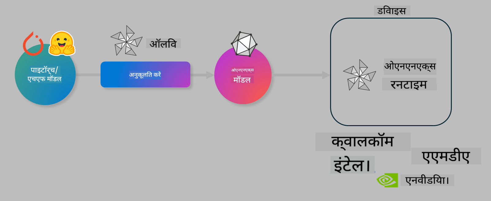

<!--
CO_OP_TRANSLATOR_METADATA:
{
  "original_hash": "6bbe47de3b974df7eea29dfeccf6032b",
  "translation_date": "2025-05-08T06:41:03+00:00",
  "source_file": "code/03.Finetuning/olive-lab/readme.md",
  "language_code": "hi"
}
-->
# Lab. ऑन-डिवाइस इन्फरेंस के लिए AI मॉडल्स का अनुकूलन करें

## परिचय

> [!IMPORTANT]
> इस लैब के लिए **Nvidia A10 या A100 GPU** के साथ संबंधित ड्राइवर्स और CUDA टूलकिट (संस्करण 12+) इंस्टॉल होना आवश्यक है।

> [!NOTE]
> यह एक **35 मिनट** की लैब है जो आपको OLIVE का उपयोग करके ऑन-डिवाइस इन्फरेंस के लिए मॉडल्स को अनुकूलित करने के मूल सिद्धांतों का व्यावहारिक परिचय देगी।

## सीखने के उद्देश्य

इस लैब के अंत तक, आप OLIVE का उपयोग करके निम्न कार्य कर पाएंगे:

- AWQ क्वांटाइजेशन मेथड का उपयोग करके AI मॉडल का क्वांटाइजेशन करना।
- एक विशिष्ट कार्य के लिए AI मॉडल को फाइन-ट्यून करना।
- ONNX Runtime पर कुशल ऑन-डिवाइस इन्फरेंस के लिए LoRA एडाप्टर्स (फाइन-ट्यून मॉडल) जनरेट करना।

### Olive क्या है

Olive (*O*NNX *live*) एक मॉडल ऑप्टिमाइजेशन टूलकिट है जिसमें CLI शामिल है जो आपको ONNX runtime +++https://onnxruntime.ai+++ के लिए गुणवत्ता और प्रदर्शन के साथ मॉडल भेजने में सक्षम बनाता है।



Olive का इनपुट आमतौर पर PyTorch या Hugging Face मॉडल होता है और आउटपुट एक अनुकूलित ONNX मॉडल होता है जिसे ONNX runtime चलाने वाले डिवाइस (डिप्लॉयमेंट टारगेट) पर निष्पादित किया जाता है। Olive मॉडल को डिप्लॉयमेंट टारगेट के AI एक्सेलेरेटर (NPU, GPU, CPU) के लिए ऑप्टिमाइज़ करेगा, जिसे Qualcomm, AMD, Nvidia या Intel जैसे हार्डवेयर विक्रेता प्रदान करते हैं।

Olive एक *workflow* चलाता है, जो व्यक्तिगत मॉडल ऑप्टिमाइजेशन टास्क का क्रमबद्ध अनुक्रम होता है, जिन्हें *passes* कहा जाता है - उदाहरण के लिए: मॉडल कंप्रेशन, ग्राफ कैप्चर, क्वांटाइजेशन, ग्राफ ऑप्टिमाइजेशन। प्रत्येक पास के पास पैरामीटर होते हैं जिन्हें सर्वोत्तम मेट्रिक्स जैसे सटीकता और विलंबता प्राप्त करने के लिए ट्यून किया जा सकता है, जिन्हें संबंधित इवैल्युएटर द्वारा मापा जाता है। Olive एक खोज रणनीति का उपयोग करता है जो प्रत्येक पास को एक-एक करके या पास के सेट को एक साथ ऑटो-ट्यून करने के लिए खोज एल्गोरिदम का उपयोग करता है।

#### Olive के लाभ

- ग्राफ ऑप्टिमाइजेशन, कंप्रेशन और क्वांटाइजेशन के लिए विभिन्न तकनीकों के साथ मैनुअल ट्रायल-एंड-एरर प्रयोग में **समय और निराशा को कम करें**। अपनी गुणवत्ता और प्रदर्शन सीमाएं परिभाषित करें और Olive को आपके लिए सर्वोत्तम मॉडल खोजने दें।
- **40+ बिल्ट-इन मॉडल ऑप्टिमाइजेशन कंपोनेंट्स** जो क्वांटाइजेशन, कंप्रेशन, ग्राफ ऑप्टिमाइजेशन और फाइनट्यूनिंग में नवीनतम तकनीकों को कवर करते हैं।
- सामान्य मॉडल ऑप्टिमाइजेशन कार्यों के लिए **आसान CLI**। उदाहरण के लिए, olive quantize, olive auto-opt, olive finetune।
- मॉडल पैकेजिंग और डिप्लॉयमेंट अंतर्निर्मित।
- **मल्टी LoRA सर्विंग** के लिए मॉडल जनरेट करने का समर्थन।
- YAML/JSON का उपयोग करके वर्कफ़्लोज़ बनाएं ताकि मॉडल ऑप्टिमाइजेशन और डिप्लॉयमेंट टास्क का समन्वय किया जा सके।
- **Hugging Face** और **Azure AI** एकीकरण।
- लागत बचाने के लिए बिल्ट-इन **कैशिंग** तंत्र।

## लैब निर्देश

> [!NOTE]
> कृपया सुनिश्चित करें कि आपने अपना Azure AI Hub और प्रोजेक्ट प्रोविजन किया है और लैब 1 के अनुसार अपना A100 कंप्यूट सेटअप किया है।

### चरण 0: अपने Azure AI Compute से कनेक्ट करें

आप **VS Code** में रिमोट फीचर का उपयोग करके Azure AI कंप्यूट से कनेक्ट करेंगे।

1. अपना **VS Code** डेस्कटॉप एप्लिकेशन खोलें।
2. **Shift+Ctrl+P** दबाकर कमांड पैलेट खोलें।
3. कमांड पैलेट में **AzureML - remote: Connect to compute instance in New Window** खोजें।
4. स्क्रीन पर दिए गए निर्देशों का पालन करें, जिसमें आपका Azure Subscription, Resource Group, Project और कंप्यूट नाम चुनना शामिल होगा जो आपने लैब 1 में सेटअप किया था।
5. एक बार जब आप Azure ML Compute नोड से कनेक्ट हो जाएं, तो यह **Visual Code के नीचे बाएं कोने** में दिखेगा `><Azure ML: Compute Name`

### चरण 1: इस रिपॉजिटरी को क्लोन करें

VS Code में, आप **Ctrl+J** दबाकर नया टर्मिनल खोल सकते हैं और इस रिपॉजिटरी को क्लोन कर सकते हैं:

टर्मिनल में आपको प्रॉम्प्ट दिखेगा

```
azureuser@computername:~/cloudfiles/code$ 
```  
सॉल्यूशन क्लोन करें

```bash
cd ~/localfiles
git clone https://github.com/microsoft/phi-3cookbook.git
```

### चरण 2: VS Code में फोल्डर खोलें

टर्मिनल में निम्न कमांड चलाकर VS Code में संबंधित फोल्डर खोलें, यह एक नई विंडो खोलेगा:

```bash
code phi-3cookbook/code/04.Finetuning/Olive-lab
```

वैकल्पिक रूप से, आप **File** > **Open Folder** चुनकर भी फोल्डर खोल सकते हैं।

### चरण 3: निर्भरताएँ

अपने Azure AI Compute इंस्टेंस में VS Code में टर्मिनल खोलें (टिप: **Ctrl+J**) और निम्न कमांड चलाकर निर्भरताएँ इंस्टॉल करें:

```bash
conda create -n olive-ai python=3.11 -y
conda activate olive-ai
pip install -r requirements.txt
az extension remove -n azure-cli-ml
az extension add -n ml
```

> [!NOTE]
> सभी निर्भरताओं को इंस्टॉल होने में लगभग 5 मिनट लगेंगे।

इस लैब में आप मॉडल डाउनलोड और Azure AI मॉडल कैटलॉग में अपलोड करेंगे। मॉडल कैटलॉग तक पहुंचने के लिए आपको Azure में लॉगिन करना होगा:

```bash
az login
```

> [!NOTE]
> लॉगिन के समय आपसे सब्सक्रिप्शन चुनने के लिए कहा जाएगा। सुनिश्चित करें कि आपने इस लैब के लिए दिया गया सब्सक्रिप्शन चुना है।

### चरण 4: Olive कमांड्स चलाएँ

अपने Azure AI Compute इंस्टेंस में VS Code के टर्मिनल में `olive-ai` कोंडा एनवायरनमेंट को सक्रिय करें:

```bash
conda activate olive-ai
```

इसके बाद, कमांड लाइन में निम्न Olive कमांड्स चलाएँ।

1. **डेटा निरीक्षण करें:** इस उदाहरण में, आप Phi-3.5-Mini मॉडल को फाइन-ट्यून करने जा रहे हैं ताकि यह यात्रा से संबंधित प्रश्नों का उत्तर देने में विशेषज्ञ हो जाए। नीचे दिया गया कोड JSON लाइन्स फॉर्मेट में डेटा सेट के पहले कुछ रिकॉर्ड दिखाता है:

    ```bash
    head data/data_sample_travel.jsonl
    ```

2. **मॉडल का क्वांटाइजेशन करें:** मॉडल को ट्रेनिंग से पहले क्वांटाइज करें, इसके लिए निम्न कमांड चलाएँ जो Active Aware Quantization (AWQ) तकनीक का उपयोग करता है +++https://arxiv.org/abs/2306.00978+++. AWQ मॉडल के वेट्स को क्वांटाइज करता है, जिसमें इन्फरेंस के दौरान उत्पन्न एक्टिवेशन को ध्यान में रखा जाता है। इसका मतलब है कि क्वांटाइजेशन प्रक्रिया वास्तविक डेटा वितरण को ध्यान में रखती है, जिससे पारंपरिक वेट क्वांटाइजेशन की तुलना में मॉडल की सटीकता बेहतर बनी रहती है।

    ```bash
    olive quantize \
       --model_name_or_path microsoft/Phi-3.5-mini-instruct \
       --trust_remote_code \
       --algorithm awq \
       --output_path models/phi/awq \
       --log_level 1
    ```

    AWQ क्वांटाइजेशन पूरा होने में लगभग **8 मिनट** लगते हैं, जो मॉडल के आकार को लगभग **7.5GB से घटाकर 2.5GB** कर देता है।

   इस लैब में, हम दिखा रहे हैं कि आप Hugging Face से मॉडल कैसे इनपुट करते हैं (उदाहरण के लिए: `microsoft/Phi-3.5-mini-instruct`). However, Olive also allows you to input models from the Azure AI catalog by updating the `model_name_or_path` argument to an Azure AI asset ID (for example:  `azureml://registries/azureml/models/Phi-3.5-mini-instruct/versions/4`). 

1. **Train the model:** Next, the `olive finetune` कमांड क्वांटाइज्ड मॉडल को फाइन-ट्यून करता है)। फाइन-ट्यूनिंग से पहले मॉडल का क्वांटाइजेशन करने से बेहतर सटीकता मिलती है क्योंकि फाइन-ट्यूनिंग क्वांटाइजेशन से हुए कुछ नुकसान की भरपाई करता है।

    ```bash
    olive finetune \
        --method lora \
        --model_name_or_path models/phi/awq \
        --data_files "data/data_sample_travel.jsonl" \
        --data_name "json" \
        --text_template "<|user|>\n{prompt}<|end|>\n<|assistant|>\n{response}<|end|>" \
        --max_steps 100 \
        --output_path ./models/phi/ft \
        --log_level 1
    ```

    फाइन-ट्यूनिंग (100 स्टेप्स के साथ) पूरा होने में लगभग **6 मिनट** लगते हैं।

3. **ऑप्टिमाइज़ करें:** मॉडल ट्रेनिंग के बाद, Olive के `auto-opt` command, which will capture the ONNX graph and automatically perform a number of optimizations to improve the model performance for CPU by compressing the model and doing fusions. It should be noted, that you can also optimize for other devices such as NPU or GPU by just updating the `--device` and `--provider` आर्गुमेंट्स का उपयोग करके मॉडल को ऑप्टिमाइज़ करें - लेकिन इस लैब के लिए हम CPU का उपयोग करेंगे।

    ```bash
    olive auto-opt \
       --model_name_or_path models/phi/ft/model \
       --adapter_path models/phi/ft/adapter \
       --device cpu \
       --provider CPUExecutionProvider \
       --use_ort_genai \
       --output_path models/phi/onnx-ao \
       --log_level 1
    ```

    ऑप्टिमाइजेशन पूरा होने में लगभग **5 मिनट** लगते हैं।

### चरण 5: मॉडल इन्फरेंस का त्वरित परीक्षण

मॉडल के इन्फरेंस को टेस्ट करने के लिए, अपने फोल्डर में **app.py** नामक एक Python फ़ाइल बनाएं और निम्न कोड कॉपी-पेस्ट करें:

```python
import onnxruntime_genai as og
import numpy as np

print("loading model and adapters...", end="", flush=True)
model = og.Model("models/phi/onnx-ao/model")
adapters = og.Adapters(model)
adapters.load("models/phi/onnx-ao/model/adapter_weights.onnx_adapter", "travel")
print("DONE!")

tokenizer = og.Tokenizer(model)
tokenizer_stream = tokenizer.create_stream()

params = og.GeneratorParams(model)
params.set_search_options(max_length=100, past_present_share_buffer=False)
user_input = "what is the best thing to see in chicago"
params.input_ids = tokenizer.encode(f"<|user|>\n{user_input}<|end|>\n<|assistant|>\n")

generator = og.Generator(model, params)

generator.set_active_adapter(adapters, "travel")

print(f"{user_input}")

while not generator.is_done():
    generator.compute_logits()
    generator.generate_next_token()

    new_token = generator.get_next_tokens()[0]
    print(tokenizer_stream.decode(new_token), end='', flush=True)

print("\n")
```

कोड चलाने के लिए:

```bash
python app.py
```

### चरण 6: मॉडल को Azure AI पर अपलोड करें

मॉडल को Azure AI मॉडल रिपॉजिटरी में अपलोड करने से मॉडल आपकी विकास टीम के अन्य सदस्यों के साथ साझा किया जा सकता है और मॉडल का संस्करण नियंत्रण भी हो जाता है। मॉडल अपलोड करने के लिए निम्न कमांड चलाएं:

> [!NOTE]
> `{}` placeholders with the name of your resource group and Azure AI Project Name. 

To find your resource group `` में अपना Resource Group और Azure AI प्रोजेक्ट का नाम अपडेट करें और फिर कमांड चलाएं।

```
az ml workspace show
```

या +++ai.azure.com+++ पर जाकर **management center** > **project** > **overview** चुनें।

`{}` प्लेसहोल्डर्स को अपने Resource Group और Azure AI प्रोजेक्ट के नाम से बदलें।

```bash
az ml model create \
    --name ft-for-travel \
    --version 1 \
    --path ./models/phi/onnx-ao \
    --resource-group {RESOURCE_GROUP_NAME} \
    --workspace-name {PROJECT_NAME}
```

आप फिर अपने अपलोड किए गए मॉडल को https://ml.azure.com/model/list पर देख सकते हैं और डिप्लॉय कर सकते हैं।

**अस्वीकरण**:  
यह दस्तावेज़ AI अनुवाद सेवा [Co-op Translator](https://github.com/Azure/co-op-translator) का उपयोग करके अनुवादित किया गया है। जबकि हम सटीकता के लिए प्रयासरत हैं, कृपया ध्यान रखें कि स्वचालित अनुवादों में त्रुटियाँ या गलतियाँ हो सकती हैं। मूल दस्तावेज़ अपनी मूल भाषा में ही अधिकारिक स्रोत माना जाना चाहिए। महत्वपूर्ण जानकारी के लिए, पेशेवर मानव अनुवाद की सिफारिश की जाती है। इस अनुवाद के उपयोग से उत्पन्न किसी भी गलतफहमी या गलत व्याख्या के लिए हम जिम्मेदार नहीं हैं।