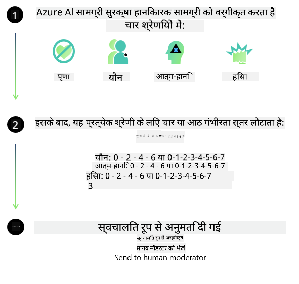

<!--
CO_OP_TRANSLATOR_METADATA:
{
  "original_hash": "839ccc4b3886ef10cfd4e64977f5792d",
  "translation_date": "2026-01-05T01:42:03+00:00",
  "source_file": "md/01.Introduction/01/01.AISafety.md",
  "language_code": "hi"
}
-->
# Phi मॉडलों के लिए एआई सुरक्षा
Phi परिवार के मॉडल [Microsoft Responsible AI Standard](https://www.microsoft.com/ai/principles-and-approach#responsible-ai-standard) के अनुसार विकसित किए गए थे, जो कि कंपनी-व्यापी आवश्यकताओं का एक सेट है और निम्नलिखित छह सिद्धांतों पर आधारित है: जवाबदेही, पारदर्शिता, निष्पक्षता, विश्वसनीयता और सुरक्षा, गोपनीयता और सुरक्षा, और समावेशन जो [Microsoft के Responsible AI सिद्धांत](https://www.microsoft.com/ai/responsible-ai) बनाते हैं। 

पिछले Phi मॉडलों की तरह, एक बहु-पक्षीय सुरक्षा मूल्यांकन और पोस्ट-ट्रेनिंग सुरक्षा दृष्टिकोण अपनाया गया था, और इस रिलीज़ की बहुभाषी क्षमताओं को ध्यान में रखने के लिए अतिरिक्त उपाय किए गए। कई भाषाओं और जोखिम श्रेणियों में परीक्षण सहित हमारी सुरक्षा प्रशिक्षण और मूल्यांकन की पद्धति [Phi Safety Post-Training Paper](https://arxiv.org/abs/2407.13833) में रेखांकित की गई है। जबकि Phi मॉडल इस दृष्टिकोण से लाभान्वित होते हैं, डेवलपर्स को अपने विशिष्ट उपयोग के मामले और सांस्कृतिक तथा भाषाई संदर्भ से जुड़े जोखिमों को मैप, माप और कम करने सहित जिम्मेदार एआई सर्वोत्तम प्रथाओं को लागू करना चाहिए।

## सर्वोत्तम प्रथाएँ

अन्य मॉडलों की तरह, Phi परिवार के मॉडल संभावित रूप से ऐसे तरीके से व्यवहार कर सकते हैं जो अन्यायपूर्ण, अविश्वसनीय, या आपत्तिजनक हों।

SLM और LLM के कुछ सीमित व्यवहार जिनसे आपको जानकारी होनी चाहिए, उनमें शामिल हैं:

- **Quality of Service:** Phi मॉडल मुख्य रूप से अंग्रेजी टेक्स्ट पर प्रशिक्षित हैं। अंग्रेज़ी के अलावा भाषाओं में प्रदर्शन घट सकता है। प्रशिक्षण डेटा में कम प्रतिनिधित्व वाले अंग्रेज़ी भाषा प्रकार मानक अमेरिकी अंग्रेजी की तुलना में खराब प्रदर्शन कर सकते हैं।
- **Representation of Harms & Perpetuation of Stereotypes:** ये मॉडल लोगों के समूहों का अधिक या कम प्रतिनिधित्व कर सकते हैं, कुछ समूहों का प्रतिनिधित्व मिटा सकते हैं, या अपमानजनक या नकारात्मक रूढ़ियों को मजबूत कर सकते हैं। सुरक्षा पोस्ट-ट्रेनिंग के बावजूद, ये सीमाएँ तब भी मौजूद रह सकती हैं जब विभिन्न समूहों का प्रतिनिधित्व अलग-अलग स्तर पर हो या प्रशिक्षण डेटा में नकारात्मक रूढ़ियों के उदाहरण वास्तविक दुनिया के पैटर्न और सामाजिक पूर्वाग्रहों को दर्शाते हों।
- **Inappropriate or Offensive Content:** ये मॉडल अन्य प्रकार की अनुचित या आपत्तिजनक सामग्री उत्पन्न कर सकते हैं, जो उपयोग के मामले के लिए विशिष्ट अतिरिक्त निवारण措施 के बिना संवेदनशील संदर्भों में परिनियोजित करने के लिए अनुपयुक्त बना सकती है।
Information Reliability: भाषा मॉडल तर्कहीन सामग्री उत्पन्न कर सकते हैं या ऐसी सामग्री बना सकते हैं जो सुनने में तर्कसंगत लगे लेकिन असत्य या पुरानी हो।
- **Limited Scope for Code:** Phi-3 के अधिकांश प्रशिक्षण डेटा का आधार Python है और इसमें सामान्य पैकेज जैसे "typing, math, random, collections, datetime, itertools" का उपयोग किया गया है। यदि मॉडल अन्य पैकेजों का उपयोग करने वाले Python स्क्रिप्ट या अन्य भाषाओं में स्क्रिप्ट जनरेट करता है, तो हम उपयोगकर्ताओं को सख्ती से सलाह देते हैं कि वे सभी API उपयोगों की मैन्युअल रूप से पुष्टि करें।

डेवलपर्स को जिम्मेदार एआई सर्वोत्तम प्रथाओं को लागू करना चाहिए और यह सुनिश्चित करने के लिए जिम्मेदार हैं कि एक विशिष्ट उपयोग मामला संबंधित कानूनों और नियमों का पालन करता हो (उदा. गोपनीयता, व्यापार, आदि)। 

## Responsible AI विचार

अन्य भाषा मॉडलों की तरह, Phi श्रृंखला के मॉडल संभावित रूप से ऐसे तरीके से व्यवहार कर सकते हैं जो अन्यायपूर्ण, अविश्वसनीय, या आपत्तिजनक हों। जिन सीमित व्यवहारों से सावधान रहना चाहिए उनमें शामिल हैं:

**Quality of Service:** Phi मॉडल मुख्य रूप से अंग्रेजी टेक्स्ट पर प्रशिक्षित हैं। अंग्रेज़ी के अलावा भाषाओं में प्रदर्शन घट सकता है। प्रशिक्षण डेटा में कम प्रतिनिधित्व वाले अंग्रेज़ी भाषा प्रकार मानक अमेरिकी अंग्रेज़ी की तुलना में खराब प्रदर्शन कर सकते हैं।

**Representation of Harms & Perpetuation of Stereotypes:** ये मॉडल लोगों के समूहों का अधिक या कम प्रतिनिधित्व कर सकते हैं, कुछ समूहों का प्रतिनिधित्व मिटा सकते हैं, या अपमानजनक या नकारात्मक रूढ़ियों को मजबूत कर सकते हैं। सुरक्षा पोस्ट-ट्रेनिंग के बावजूद, ये सीमाएँ तब भी मौजूद रह सकती हैं जब विभिन्न समूहों का प्रतिनिधित्व अलग-अलग स्तर पर हो या प्रशिक्षण डेटा में नकारात्मक रूढ़ियों के उदाहरण वास्तविक दुनिया के पैटर्न और सामाजिक पूर्वाग्रहों को दर्शाते हों।

**Inappropriate or Offensive Content:** ये मॉडल अन्य प्रकार की अनुचित या आपत्तिजनक सामग्री उत्पन्न कर सकते हैं, जो उपयोग के मामले के लिए विशिष्ट अतिरिक्त निवारण措施 के बिना संवेदनशील संदर्भों में परिनियोजित करने के लिए अनुपयुक्त बना सकती है।
Information Reliability: भाषा मॉडल तर्कहीन सामग्री उत्पन्न कर सकते हैं या ऐसी सामग्री बना सकते हैं जो सुनने में तर्कसंगत लगे लेकिन असत्य या पुरानी हो।

**Limited Scope for Code:** Phi-3 के अधिकांश प्रशिक्षण डेटा का आधार Python है और इसमें सामान्य पैकेज जैसे "typing, math, random, collections, datetime, itertools" का उपयोग किया गया है। यदि मॉडल अन्य पैकेजों का उपयोग करने वाले Python स्क्रिप्ट या अन्य भाषाओं में स्क्रिप्ट जनरेट करता है, तो हम उपयोगकर्ताओं को सख्ती से सलाह देते हैं कि वे सभी API उपयोगों की मैन्युअल रूप से पुष्टि करें।

डेवलपर्स को जिम्मेदार एआई सर्वोत्तम प्रथाओं को लागू करना चाहिए और यह सुनिश्चित करने के लिए जिम्मेदार हैं कि एक विशिष्ट उपयोग मामला संबंधित कानूनों और नियमों का पालन करता हो (उदा. गोपनीयता, व्यापार, आदि)। विचार के लिए महत्वपूर्ण क्षेत्र शामिल हैं:

**Allocation:** मॉडल उन परिदृश्यों के लिए उपयुक्त नहीं हो सकते जिनका कानूनी स्थिति या संसाधनों या जीवन के अवसरों के आवंटन पर परिणामस्वरूप प्रभाव हो सकता है (उदा.: आवास, रोजगार, क्रेडिट, आदि) बिना आगे के आकलनों और अतिरिक्त पूर्वाग्रह-निवारण तकनीकों के।

**High-Risk Scenarios:** डेवलपर्स को उन उच्च-जोखिम परिस्थितियों में मॉडलों के उपयोग की उपयुक्तता का मूल्यांकन करना चाहिए जहाँ अन्यायपूर्ण, अविश्वसनीय, या आपत्तिजनक आउटपुट अत्यधिक महंगे हो सकते हैं या नुकसान का कारण बन सकते हैं। इसमें संवेदनशील या विशेषज्ञ डोमेन में सलाह प्रदान करना शामिल है जहाँ सटीकता और विश्वसनीयता महत्वपूर्ण हैं (उदा.: कानूनी या स्वास्थ्य सलाह)। तैनाती संदर्भ के अनुसार आवेदन स्तर पर अतिरिक्त सुरक्षा उपाय लागू किए जाने चाहिए।

**Misinformation:** मॉडल गलत जानकारी उत्पन्न कर सकते हैं। डेवलपर्स को पारदर्शिता की सर्वोत्तम प्रथाओं का पालन करना चाहिए और अंत-उपयोगकर्ताओं को सूचित करना चाहिए कि वे एक AI सिस्टम के साथ इंटरैक्ट कर रहे हैं। आवेदन स्तर पर, डेवलपर्स उपयोग-मामले-विशिष्ट, प्रसंगगत जानकारी में प्रतिक्रियाओं को ग्राउंड करने के लिए फीडबैक तंत्र और पाइपलाइनों का निर्माण कर सकते हैं, एक तकनीक जिसे Retrieval Augmented Generation (RAG) के नाम से जाना जाता है।

**Generation of Harmful Content:** डेवलपर्स को अपने संदर्भ के लिए आउटपुट का आकलन करना चाहिए और उपलब्ध सुरक्षा क्लासिफ़ायर्स या अपने उपयोग-मामले के लिए उपयुक्त कस्टम समाधान उपयोग करने चाहिए।

**Misuse:** अन्य प्रकार के दुरुपयोग जैसे फ़्रॉड, स्पैम, या मैलवेयर उत्पादन संभव हो सकते हैं, और डेवलपर्स को यह सुनिश्चित करना चाहिए कि उनकी एप्लिकेशन लागू कानूनों और नियमों का उल्लंघन न करें।

### फाइनट्यूनिंग और एआई सामग्री सुरक्षा

मॉडल को फाइनट्यून करने के बाद, हम बहुत अनुशंसा करते हैं कि आप मॉडलों द्वारा उत्पन्न सामग्री की निगरानी, संभावित जोखिमों, खतरों और गुणवत्ता मुद्दों की पहचान और ब्लॉक करने के लिए [Azure AI Content Safety](https://learn.microsoft.com/azure/ai-services/content-safety/overview) उपायों का लाभ उठाएँ।

[Azure AI Content Safety](https://learn.microsoft.com/azure/ai-services/content-safety/overview) टेक्स्ट और इमेज दोनों प्रकार की सामग्री का समर्थन करता है। इसे क्लाउड, डिस्कनेक्टेड कंटेनर, और एज/एम्बेडेड डिवाइस पर परिनियोजित किया जा सकता है।

## Azure AI Content Safety का अवलोकन

- **Azure AI Content Safety**
- **Microsoft डेवलपर**
- **5 वीडियो**

Azure AI Content Safety सेवा एप्लिकेशन और सेवाओं में हानिकारक यूजर-जनरेटेड और एआई-जनरेटेड कंटेंट का पता लगाती है। इसमें टेक्स्ट और इमेज API शामिल हैं जो आपको हानिकारक या अनुपयुक्त सामग्री का पता लगाने की अनुमति देते हैं।

[AI कंटेंट सुरक्षा प्लेलिस्ट](https://www.youtube.com/playlist?list=PLlrxD0HtieHjaQ9bJjyp1T7FeCbmVcPkQ)

---

<!-- CO-OP TRANSLATOR DISCLAIMER START -->
अस्वीकरण:
यह दस्तावेज़ AI अनुवाद सेवा [Co-op Translator](https://github.com/Azure/co-op-translator) का उपयोग करके अनुवादित किया गया है। हम सटीकता के लिए प्रयासशील हैं, फिर भी कृपया ध्यान दें कि स्वचालित अनुवादों में त्रुटियाँ या अशुद्धियाँ हो सकती हैं। मूल भाषा में उपलब्ध दस्तावेज़ को प्रामाणिक स्रोत माना जाना चाहिए। महत्वपूर्ण जानकारी के लिए पेशेवर मानव अनुवाद की सिफारिश की जाती है। इस अनुवाद के उपयोग से उत्पन्न किसी भी गलतफहमी या गलत व्याख्या के लिए हम जिम्मेदार नहीं हैं।
<!-- CO-OP TRANSLATOR DISCLAIMER END -->