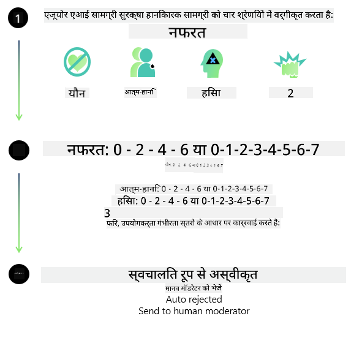
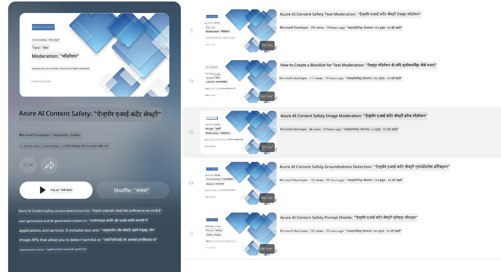

<!--
CO_OP_TRANSLATOR_METADATA:
{
  "original_hash": "1f6b561a224336bd4f413176ec40d994",
  "translation_date": "2025-04-04T17:28:20+00:00",
  "source_file": "md\\01.Introduction\\01\\01.AISafety.md",
  "language_code": "hi"
}
-->
# Phi मॉडल्स के लिए AI सुरक्षा

Phi मॉडल्स का विकास [Microsoft Responsible AI Standard](https://query.prod.cms.rt.microsoft.com/cms/api/am/binary/RE5cmFl) के अनुसार किया गया है, जो कंपनी-व्यापी आवश्यकताओं का एक सेट है। यह निम्नलिखित छह सिद्धांतों पर आधारित है: जवाबदेही, पारदर्शिता, निष्पक्षता, विश्वसनीयता और सुरक्षा, गोपनीयता और सुरक्षा, और समावेशिता। ये [Microsoft के Responsible AI सिद्धांतों](https://www.microsoft.com/ai/responsible-ai) का हिस्सा हैं। 

पिछले Phi मॉडल्स की तरह, बहुआयामी सुरक्षा मूल्यांकन और सुरक्षा पोस्ट-ट्रेनिंग दृष्टिकोण अपनाया गया था। इस रिलीज़ की बहुभाषी क्षमताओं को ध्यान में रखते हुए अतिरिक्त उपाय किए गए। हमारी सुरक्षा प्रशिक्षण और मूल्यांकन की प्रक्रिया, जिसमें कई भाषाओं और जोखिम श्रेणियों में परीक्षण शामिल है, [Phi Safety Post-Training Paper](https://arxiv.org/abs/2407.13833) में वर्णित है। हालांकि Phi मॉडल्स इस दृष्टिकोण से लाभान्वित होते हैं, डेवलपर्स को अपने विशिष्ट उपयोग मामलों और सांस्कृतिक व भाषाई संदर्भ के जोखिमों को मैप करने, मापने और कम करने सहित Responsible AI के सर्वोत्तम अभ्यासों को लागू करना चाहिए।

## सर्वोत्तम अभ्यास

अन्य मॉडल्स की तरह, Phi मॉडल्स संभावित रूप से ऐसे तरीके से व्यवहार कर सकते हैं जो अनुचित, अविश्वसनीय, या अपमानजनक हो।

SLM और LLM की कुछ सीमित व्यवहार जिनके बारे में आपको जागरूक होना चाहिए, वे हैं:

- **सेवा की गुणवत्ता:** Phi मॉडल्स मुख्य रूप से अंग्रेजी टेक्स्ट पर प्रशिक्षित किए गए हैं। अंग्रेजी के अलावा अन्य भाषाओं में प्रदर्शन खराब हो सकता है। प्रशिक्षण डेटा में कम प्रतिनिधित्व वाली अंग्रेजी भाषाई विविधताओं में मानक अमेरिकी अंग्रेजी की तुलना में प्रदर्शन खराब हो सकता है।  
- **हानियों का प्रतिनिधित्व और रूढ़ियों को बढ़ावा देना:** ये मॉडल्स कुछ समूहों का अधिक या कम प्रतिनिधित्व कर सकते हैं, कुछ समूहों का प्रतिनिधित्व मिटा सकते हैं, या अपमानजनक या नकारात्मक रूढ़ियों को मजबूत कर सकते हैं। सुरक्षा पोस्ट-ट्रेनिंग के बावजूद, ये सीमाएं अभी भी मौजूद हो सकती हैं, जो विभिन्न समूहों के प्रतिनिधित्व के स्तर और प्रशिक्षण डेटा में नकारात्मक रूढ़ियों के उदाहरणों की व्यापकता को दर्शाती हैं।  
- **अनुचित या अपमानजनक सामग्री:** ये मॉडल्स अन्य प्रकार की अनुचित या अपमानजनक सामग्री उत्पन्न कर सकते हैं, जो संवेदनशील संदर्भों में उपयोग के लिए अनुपयुक्त हो सकती है, यदि उपयोग के मामले के अनुसार अतिरिक्त उपाय न किए जाएं।  
- **जानकारी की विश्वसनीयता:** भाषा मॉडल्स कभी-कभी बेतुकी सामग्री उत्पन्न कर सकते हैं या ऐसी सामग्री बना सकते हैं जो सुनने में तर्कसंगत लगती है लेकिन गलत या पुरानी हो सकती है।  
- **कोड के लिए सीमित दायरा:** Phi-3 प्रशिक्षण डेटा का अधिकांश हिस्सा Python पर आधारित है और सामान्य पैकेज जैसे "typing, math, random, collections, datetime, itertools" का उपयोग करता है। यदि मॉडल ऐसे Python स्क्रिप्ट उत्पन्न करता है जो अन्य पैकेजों या अन्य भाषाओं में स्क्रिप्ट का उपयोग करता है, तो हम उपयोगकर्ताओं को सभी API उपयोगों को मैन्युअल रूप से सत्यापित करने की दृढ़ता से सलाह देते हैं।  

डेवलपर्स को Responsible AI के सर्वोत्तम अभ्यासों को लागू करना चाहिए और यह सुनिश्चित करना चाहिए कि उनका विशिष्ट उपयोग मामला संबंधित कानूनों और विनियमों (जैसे गोपनीयता, व्यापार, आदि) का पालन करता है।  

## Responsible AI पर विचार

अन्य भाषा मॉडल्स की तरह, Phi श्रृंखला मॉडल्स संभावित रूप से ऐसे तरीके से व्यवहार कर सकते हैं जो अनुचित, अविश्वसनीय, या अपमानजनक हो। कुछ सीमित व्यवहार जिनके बारे में जागरूक होना चाहिए, वे हैं:

**सेवा की गुणवत्ता:** Phi मॉडल्स मुख्य रूप से अंग्रेजी टेक्स्ट पर प्रशिक्षित किए गए हैं। अंग्रेजी के अलावा अन्य भाषाओं में प्रदर्शन खराब हो सकता है। प्रशिक्षण डेटा में कम प्रतिनिधित्व वाली अंग्रेजी भाषाई विविधताओं में मानक अमेरिकी अंग्रेजी की तुलना में प्रदर्शन खराब हो सकता है।  

**हानियों का प्रतिनिधित्व और रूढ़ियों को बढ़ावा देना:** ये मॉडल्स कुछ समूहों का अधिक या कम प्रतिनिधित्व कर सकते हैं, कुछ समूहों का प्रतिनिधित्व मिटा सकते हैं, या अपमानजनक या नकारात्मक रूढ़ियों को मजबूत कर सकते हैं। सुरक्षा पोस्ट-ट्रेनिंग के बावजूद, ये सीमाएं अभी भी मौजूद हो सकती हैं, जो विभिन्न समूहों के प्रतिनिधित्व के स्तर और प्रशिक्षण डेटा में नकारात्मक रूढ़ियों के उदाहरणों की व्यापकता को दर्शाती हैं।  

**अनुचित या अपमानजनक सामग्री:** ये मॉडल्स अन्य प्रकार की अनुचित या अपमानजनक सामग्री उत्पन्न कर सकते हैं, जो संवेदनशील संदर्भों में उपयोग के लिए अनुपयुक्त हो सकती है, यदि उपयोग के मामले के अनुसार अतिरिक्त उपाय न किए जाएं।  
जानकारी की विश्वसनीयता: भाषा मॉडल्स कभी-कभी बेतुकी सामग्री उत्पन्न कर सकते हैं या ऐसी सामग्री बना सकते हैं जो सुनने में तर्कसंगत लगती है लेकिन गलत या पुरानी हो सकती है।  

**कोड के लिए सीमित दायरा:** Phi-3 प्रशिक्षण डेटा का अधिकांश हिस्सा Python पर आधारित है और सामान्य पैकेज जैसे "typing, math, random, collections, datetime, itertools" का उपयोग करता है। यदि मॉडल ऐसे Python स्क्रिप्ट उत्पन्न करता है जो अन्य पैकेजों या अन्य भाषाओं में स्क्रिप्ट का उपयोग करता है, तो हम उपयोगकर्ताओं को सभी API उपयोगों को मैन्युअल रूप से सत्यापित करने की दृढ़ता से सलाह देते हैं।  

डेवलपर्स को Responsible AI के सर्वोत्तम अभ्यासों को लागू करना चाहिए और यह सुनिश्चित करना चाहिए कि उनका विशिष्ट उपयोग मामला संबंधित कानूनों और विनियमों (जैसे गोपनीयता, व्यापार, आदि) का पालन करता है। विचार करने के लिए महत्वपूर्ण क्षेत्र हैं:

**आवंटन:** मॉडल्स ऐसे परिदृश्यों के लिए उपयुक्त नहीं हो सकते हैं जिनका कानूनी स्थिति या संसाधनों या जीवन के अवसरों के आवंटन (जैसे: आवास, रोजगार, क्रेडिट, आदि) पर महत्वपूर्ण प्रभाव पड़ सकता है, जब तक कि आगे के मूल्यांकन और अतिरिक्त डिबायसिंग तकनीकों को लागू न किया जाए।  

**उच्च जोखिम वाले परिदृश्य:** डेवलपर्स को उन परिदृश्यों में मॉडल्स का उपयोग करने की उपयुक्तता का आकलन करना चाहिए जहां अनुचित, अविश्वसनीय, या अपमानजनक आउटपुट अत्यधिक महंगे हो सकते हैं या नुकसान पहुंचा सकते हैं। इसमें संवेदनशील या विशेषज्ञ डोमेन में सलाह प्रदान करना शामिल है, जहां सटीकता और विश्वसनीयता महत्वपूर्ण हैं (जैसे: कानूनी या स्वास्थ्य सलाह)। तैनाती संदर्भ के अनुसार एप्लिकेशन स्तर पर अतिरिक्त सुरक्षा उपाय लागू किए जाने चाहिए।  

**गलत जानकारी:** मॉडल्स गलत जानकारी उत्पन्न कर सकते हैं। डेवलपर्स को पारदर्शिता के सर्वोत्तम अभ्यासों का पालन करना चाहिए और अंतिम उपयोगकर्ताओं को सूचित करना चाहिए कि वे AI सिस्टम के साथ इंटरैक्ट कर रहे हैं। एप्लिकेशन स्तर पर, डेवलपर्स प्रतिक्रिया तंत्र और पाइपलाइनों का निर्माण कर सकते हैं जो उपयोग-केस विशिष्ट, संदर्भात्मक जानकारी में प्रतिक्रियाओं को ग्राउंड करते हैं। इस तकनीक को Retrieval Augmented Generation (RAG) के रूप में जाना जाता है।  

**हानिकारक सामग्री का उत्पादन:** डेवलपर्स को आउटपुट का उनके संदर्भ के लिए आकलन करना चाहिए और अपने उपयोग के मामले के लिए उपलब्ध सुरक्षा वर्गीकरणकर्ताओं या कस्टम समाधानों का उपयोग करना चाहिए।  

**दुरुपयोग:** अन्य प्रकार के दुरुपयोग जैसे धोखाधड़ी, स्पैम, या मैलवेयर उत्पादन संभव हो सकते हैं, और डेवलपर्स को यह सुनिश्चित करना चाहिए कि उनके एप्लिकेशन लागू कानूनों और विनियमों का उल्लंघन न करें।  

### फाइनट्यूनिंग और AI सामग्री सुरक्षा

मॉडल को फाइनट्यून करने के बाद, हम दृढ़ता से अनुशंसा करते हैं कि [Azure AI Content Safety](https://learn.microsoft.com/azure/ai-services/content-safety/overview) उपायों का उपयोग करें ताकि मॉडल्स द्वारा उत्पन्न सामग्री की निगरानी की जा सके, संभावित जोखिमों, खतरों, और गुणवत्ता मुद्दों की पहचान और रोकथाम की जा सके।

[Azure AI Content Safety](https://learn.microsoft.com/azure/ai-services/content-safety/overview) टेक्स्ट और इमेज सामग्री दोनों का समर्थन करता है। इसे क्लाउड, डिस्कनेक्टेड कंटेनर्स, और एज/एम्बेडेड डिवाइसों पर तैनात किया जा सकता है।

## Azure AI Content Safety का अवलोकन

Azure AI Content Safety एक सार्वभौमिक समाधान नहीं है; इसे व्यवसायों की विशिष्ट नीतियों के साथ अनुकूलित किया जा सकता है। इसके अलावा, इसके बहुभाषी मॉडल इसे एक साथ कई भाषाओं को समझने में सक्षम बनाते हैं।

- **Azure AI Content Safety**
- **Microsoft Developer**
- **5 वीडियो**

Azure AI Content Safety सेवा एप्लिकेशन और सेवाओं में हानिकारक उपयोगकर्ता-जनित और AI-जनित सामग्री का पता लगाती है। इसमें टेक्स्ट और इमेज API शामिल हैं जो हानिकारक या अनुचित सामग्री का पता लगाने की अनुमति देते हैं।

[AI Content Safety Playlist](https://www.youtube.com/playlist?list=PLlrxD0HtieHjaQ9bJjyp1T7FeCbmVcPkQ)

**अस्वीकरण**:  
यह दस्तावेज़ AI अनुवाद सेवा [Co-op Translator](https://github.com/Azure/co-op-translator) का उपयोग करके अनुवादित किया गया है। जबकि हम सटीकता के लिए प्रयास करते हैं, कृपया ध्यान दें कि स्वचालित अनुवाद में त्रुटियाँ या अशुद्धियाँ हो सकती हैं। मूल भाषा में उपलब्ध मूल दस्तावेज़ को आधिकारिक स्रोत माना जाना चाहिए। महत्वपूर्ण जानकारी के लिए, पेशेवर मानव अनुवाद की सिफारिश की जाती है। इस अनुवाद के उपयोग से उत्पन्न किसी भी गलतफहमी या व्याख्या के लिए हम जिम्मेदार नहीं हैं।