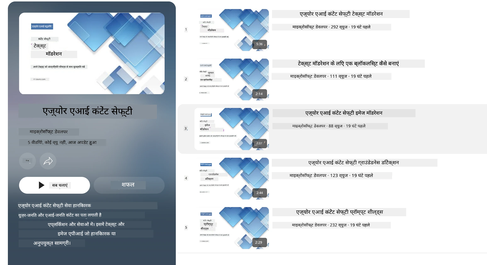

# Phi मॉडलों के लिए एआई सुरक्षा
Phi मॉडल परिवार को [Microsoft Responsible AI Standard](https://www.microsoft.com/ai/principles-and-approach#responsible-ai-standard) के अनुसार विकसित किया गया था, जो कंपनी-व्यापी आवश्यकताओं का एक सेट है जो निम्नलिखित छह सिद्धांतों पर आधारित है: जवाबदेही, पारदर्शिता, निष्पक्षता, विश्वसनीयता और सुरक्षा, गोपनीयता और सुरक्षा, तथा समावेशन, जो [Microsoft के Responsible AI सिद्धांतों](https://www.microsoft.com/ai/responsible-ai) का गठन करते हैं।

पिछले Phi मॉडलों की तरह, बहुआयामी सुरक्षा मूल्यांकन और प्रशिक्षण के बाद सुरक्षा दृष्टिकोण अपनाया गया था, साथ ही इस रिलीज की बहुभाषी क्षमताओं को ध्यान में रखते हुए अतिरिक्त उपाय किए गए थे। हमारी सुरक्षा प्रशिक्षण और मूल्यांकन की विधि जिसमें कई भाषाओं और जोखिम श्रेणियों में परीक्षण शामिल है, [Phi Safety Post-Training Paper](https://arxiv.org/abs/2407.13833) में विस्तृत की गई है। जबकि Phi मॉडल इस दृष्टिकोण से लाभान्वित होते हैं, डेवलपर्स को जिम्मेदार एआई सर्वोत्तम प्रथाओं को लागू करना चाहिए, जिसमें उनके विशिष्ट उपयोग मामले और सांस्कृतिक व भाषाई संदर्भ से जुड़े जोखिमों का मानचित्रण, मापन, और शमन शामिल है।

## सर्वोत्तम प्रथाएं

अन्य मॉडलों की तरह, Phi मॉडल परिवार संभावित रूप से असामान्य, अविश्वसनीय, या आपत्तिजनक व्यवहार कर सकता है।

SLM और LLM के कुछ सीमित व्यवहार जिनसे आपको अवगत होना चाहिए:

- **सेवा की गुणवत्ता:** Phi मॉडल मुख्य रूप से अंग्रेज़ी टेक्स्ट पर प्रशिक्षित हैं। अंग्रेज़ी के अलावा अन्य भाषाओं में प्रदर्शन खराब हो सकता है। उन अंग्रेज़ी भाषाई विविधताओं में जिनका प्रशिक्षण डेटा में कम प्रतिनिधित्व है, मानक अमेरिकी अंग्रेज़ी की तुलना में प्रदर्शन खराब हो सकता है।
- **हानियों का प्रतिनिधित्व और रूढ़िवादिता का निरंतरता:** ये मॉडल लोगों के समूहों का अधिक या कम प्रतिनिधित्व कर सकते हैं, कुछ समूहों के प्रतिनिधित्व को मिटा सकते हैं, या अपमानजनक या नकारात्मक रूढ़ियों को सुदृढ़ कर सकते हैं। सुरक्षा प्रशिक्षण के बावजूद, ये सीमाएं अभी भी मौजूद हो सकती हैं क्योंकि विभिन्न समूहों के प्रतिनिधित्व के स्तर में भिन्नता या प्रशिक्षण डेटा में नकारात्मक रूढ़ियों के उदाहरणों की प्रचुरता वास्तविक दुनिया के पैटर्न और सामाजिक पूर्वाग्रहों को प्रतिबिंबित करती है।
- **अनुचित या आपत्तिजनक सामग्री:** ये मॉडल अन्य प्रकार की अनुचित या आपत्तिजनक सामग्री उत्पन्न कर सकते हैं, जो संवेदनशील संदर्भों में बिना अतिरिक्त उपयोग-मामले विशिष्ट रोकथाम के उपयुक्त नहीं हो सकता।
- **जानकारी की विश्वसनीयता:** भाषा मॉडल बेमानी सामग्री उत्पन्न कर सकते हैं या ऐसी सामग्री बना सकते हैं जो सुनने में तर्कसंगत लगती हो लेकिन असत्य या पुरानी हो।
- **कोड के लिए सीमित दायरा:** Phi-3 के प्रशिक्षण डेटा का अधिकांश हिस्सा Python पर आधारित है और सामान्य पैकेज जैसे "typing, math, random, collections, datetime, itertools" का उपयोग करता है। यदि मॉडल ऐसे Python स्क्रिप्ट उत्पन्न करता है जो अन्य पैकेजों या अन्य भाषाओं में स्क्रिप्ट का उपयोग करते हैं, तो हम उपयोगकर्ताओं को सुझाव देते हैं कि वे सभी API उपयोगों को मैन्युअल रूप से सत्यापित करें।

डेवलपर्स को जिम्मेदार AI सर्वोत्तम प्रथाएं लागू करनी चाहिए और सुनिश्चित करना चाहिए कि कोई विशिष्ट उपयोग मामला संबंधित कानूनों और नियमों का पालन करता है (जैसे गोपनीयता, व्यापार, आदि)।

## जिम्मेदार AI विचार

अन्य भाषा मॉडलों की तरह, Phi श्रृंखला के मॉडल संभावित रूप से असामान्य, अविश्वसनीय, या आपत्तिजनक व्यवहार कर सकते हैं। ध्यान रखने योग्य कुछ सीमित व्यवहार निम्नलिखित हैं:

**सेवा की गुणवत्ता:** Phi मॉडल मुख्य रूप से अंग्रेज़ी टेक्स्ट पर प्रशिक्षित हैं। अंग्रेज़ी के अलावा अन्य भाषाओं में प्रदर्शन खराब हो सकता है। अंग्रेज़ी भाषाई विविधताओं में जिनका प्रशिक्षण डेटा में कम प्रतिनिधित्व है, मानक अमेरिकी अंग्रेज़ी की तुलना में प्रदर्शन खराब हो सकता है।

**हानियों का प्रतिनिधित्व और रूढ़िवादिता का निरंतरता:** ये मॉडल लोगों के समूहों का अधिक या कम प्रतिनिधित्व कर सकते हैं, कुछ समूहों का प्रतिनिधित्व मिटा सकते हैं, या अपमानजनक या नकारात्मक रूढ़िवादियां सुदृढ़ कर सकते हैं। सुरक्षा पोस्ट-ट्रेनिंग के बावजूद, ये सीमाएं अभी भी मौजूद हो सकती हैं क्योंकि विभिन्न समूहों के प्रतिनिधित्व के स्तर में भिन्नता या प्रशिक्षण डेटा में नकारात्मक रूढ़ियों के उदाहरणों की प्रचुरता वास्तविक दुनिया के पैटर्न और सामाजिक पूर्वाग्रहों को प्रतिबिंबित करती है।

**अनुचित या आपत्तिजनक सामग्री:** ये मॉडल अन्य प्रकार की अनुचित या आपत्तिजनक सामग्री उत्पन्न कर सकते हैं, जो बिना अतिरिक्त उपयोग-मामले-विशिष्ट रोकथाम के संवेदनशील संदर्भों में उपयुक्त नहीं हो सकता।  
जानकारी की विश्वसनीयता: भाषा मॉडल बेतुकी सामग्री उत्पन्न कर सकते हैं या ऐसी सामग्री बना सकते हैं जो सुनने में तर्कसंगत लगती हो लेकिन असत्य या पुरानी हो।

**कोड के लिए सीमित दायरा:** Phi-3 के अधिकांश प्रशिक्षण डेटा Python पर आधारित हैं और सामान्य पैकेज जैसे "typing, math, random, collections, datetime, itertools" का उपयोग करते हैं। यदि मॉडल ऐसे Python स्क्रिप्ट उत्पन्न करता है जो अन्य पैकेज या अन्य भाषाओं में स्क्रिप्ट का उपयोग करते हैं, तो हम उपयोगकर्ताओं को सभी API उपयोगों को मैन्युअल रूप से सत्यापित करने की सलाह देते हैं।

डेवलपर्स को जिम्मेदार AI सर्वोत्तम प्रथाएं लागू करनी चाहिए और सुनिश्चित करना चाहिए कि कोई विशिष्ट उपयोग मामला संबंधित कानूनों और नियमों का पालन करता है (जैसे गोपनीयता, व्यापार, आदि)। विचार करने के लिए महत्वपूर्ण क्षेत्र शामिल हैं:

**आवंटन:** मॉडल संभवतः उन परिस्थितियों के लिए उपयुक्त नहीं हैं जिनका कानूनी स्थिति या संसाधनों या जीवन के अवसरों (जैसे आवास, रोजगार, ऋण, आदि) के आवंटन पर प्रभाव पड़ सकता है, बिना आगे मूल्यांकन और अतिरिक्त पूर्वाग्रह दूर करने की तकनीकों के।

**उच्च जोखिम वाले परिदृश्य:** डेवलपर्स को उन उच्च जोखिम वाले परिदृश्यों में मॉडलों का उपयोग उपयुक्तता का आकलन करना चाहिए जहाँ असमान, अविश्वसनीय या आपत्तिजनक आउटपुट अत्यधिक महंगे या हानिकारक हो सकते हैं। इसमें संवेदनशील या विशेषज्ञ क्षेत्रों में सलाह प्रदान करना शामिल है जहाँ सटीकता और विश्वसनीयता महत्वपूर्ण होती है (जैसे कानूनी या स्वास्थ्य सलाह)। लागू करने के संदर्भ के अनुसार एप्लिकेशन स्तर पर अतिरिक्त सुरक्षा उपाय लागू किए जाने चाहिए।

**गलत सूचना:** मॉडलों द्वारा गलत जानकारी उत्पन्न हो सकती है। डेवलपर्स को पारदर्शिता सर्वोत्तम प्रथाओं का पालन करना चाहिए और उपयोगकर्ताओं को सूचित करना चाहिए कि वे एआई प्रणाली के साथ संवाद कर रहे हैं। एप्लिकेशन स्तर पर, डेवलपर्स प्रतिक्रिया तंत्र और पाइपलाइनों का निर्माण कर सकते हैं जो उपयोग-मामले विशिष्ट, सन्दर्भ-संबंधी जानकारी में उत्तरों को आधारभूत बनाते हैं, जिसे Retrieval Augmented Generation (RAG) के रूप में जाना जाता है।

**हानिकारक सामग्री का उत्पादन:** डेवलपर्स को आउटपुट का उनके संदर्भ में मूल्यांकन करना चाहिए और उपलब्ध सुरक्षा वर्गीकर्ताओं या उनके उपयोग-मामले के लिए उपयुक्त कस्टम समाधान का उपयोग करना चाहिए।

**दुरुपयोग:** धोखाधड़ी, स्पैम, या मैलवेयर उत्पादन जैसे दुरुपयोग के अन्य रूप संभव हो सकते हैं, और डेवलपर्स को सुनिश्चित करना चाहिए कि उनके अनुप्रयोग लागू कानूनों और नियमों का उल्लंघन न करें।

### फाइनट्यूनिंग और एआई सामग्री सुरक्षा

मॉडल का फाइनट्यूनिंग करने के बाद, हम अत्यधिक अनुशंसा करते हैं कि आप [Azure AI Content Safety](https://learn.microsoft.com/azure/ai-services/content-safety/overview) उपायों का उपयोग करें ताकि मॉडल द्वारा उत्पन्न सामग्री की निगरानी की जा सके, संभावित जोखिमों, खतरों और गुणवत्ता मुद्दों की पहचान और अवरोधन किया जा सके।

[Azure AI Content Safety](https://learn.microsoft.com/azure/ai-services/content-safety/overview) दोनों टेक्स्ट और छवि सामग्री का समर्थन करता है। इसे क्लाउड, डिस्कनेक्टेड कंटेनरों, और एज/एम्बेडेड उपकरणों पर तैनात किया जा सकता है।

## Azure AI Content Safety का अवलोकन

Azure AI Content Safety सभी के लिए एक जैसा समाधान नहीं है; इसे व्यवसायों की विशिष्ट नीतियों के अनुरूप अनुकूलित किया जा सकता है। इसके अलावा, इसके बहुभाषी मॉडल इसे एक साथ कई भाषाओं को समझने में सक्षम बनाते हैं।

- **Azure AI Content Safety**
- **Microsoft Developer**
- **5 वीडियो**

Azure AI Content Safety सेवा अनुप्रयोगों और सेवाओं में हानिकारक उपयोगकर्ता-उत्पन्न और एआई-उत्पन्न सामग्री का पता लगाती है। इसमें टेक्स्ट और छवि API शामिल हैं जो हानिकारक या अनुचित सामग्री का पता लगाने की अनुमति देते हैं।

[AI Content Safety Playlist](https://www.youtube.com/playlist?list=PLlrxD0HtieHjaQ9bJjyp1T7FeCbmVcPkQ)

---

<!-- CO-OP TRANSLATOR DISCLAIMER START -->
**अस्वीकरण**:  
यह दस्तावेज़ AI अनुवाद सेवा [Co-op Translator](https://github.com/Azure/co-op-translator) का उपयोग करके अनुवादित किया गया है। जबकि हम सटीकता के लिए प्रयासरत हैं, कृपया ध्यान रखें कि स्वचालित अनुवाद में त्रुटियाँ या असंगतियाँ हो सकती हैं। मूल दस्तावेज़ अपनी स्थानीय भाषा में अधिकारिक स्रोत माना जाना चाहिए। महत्वपूर्ण जानकारी के लिए पेशेवर मानव अनुवाद की सलाह दी जाती है। इस अनुवाद के उपयोग से उत्पन्न किसी भी गलतफहमी या गलत व्याख्या के लिए हम जिम्मेदार नहीं हैं।
<!-- CO-OP TRANSLATOR DISCLAIMER END -->