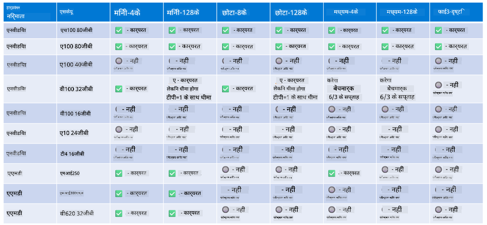

<!--
CO_OP_TRANSLATOR_METADATA:
{
  "original_hash": "c4afa6ffd13f29eb34e5f204b94310ff",
  "translation_date": "2025-04-04T17:33:11+00:00",
  "source_file": "md\\01.Introduction\\01\\01.Hardwaresupport.md",
  "language_code": "hi"
}
-->
# Phi हार्डवेयर समर्थन

Microsoft Phi को ONNX Runtime के लिए ऑप्टिमाइज़ किया गया है और यह Windows DirectML का समर्थन करता है। यह विभिन्न हार्डवेयर प्रकारों, जैसे GPUs, CPUs और मोबाइल डिवाइसों पर अच्छा काम करता है।

## डिवाइस हार्डवेयर 
विशेष रूप से, समर्थित हार्डवेयर में शामिल हैं:

- GPU SKU: RTX 4090 (DirectML)
- GPU SKU: 1 A100 80GB (CUDA)
- CPU SKU: Standard F64s v2 (64 vCPUs, 128 GiB मेमोरी)

## मोबाइल SKU

- एंड्रॉइड - Samsung Galaxy S21
- Apple iPhone 14 या उससे उच्च A16/A17 प्रोसेसर

## Phi हार्डवेयर विनिर्देश

- न्यूनतम आवश्यक कॉन्फ़िगरेशन।
- Windows: DirectX 12-सक्षम GPU और न्यूनतम 4GB संयुक्त RAM

CUDA: NVIDIA GPU जिसका Compute Capability >= 7.02 हो



## onnxruntime को कई GPUs पर चलाना

वर्तमान में उपलब्ध Phi ONNX मॉडल केवल 1 GPU के लिए हैं। Phi मॉडल के लिए मल्टी-GPU का समर्थन करना संभव है, लेकिन ORT के साथ 2 GPUs यह गारंटी नहीं देता कि यह 2 ORT इंस्टेंस की तुलना में अधिक थ्रूपुट देगा। नवीनतम अपडेट के लिए कृपया [ONNX Runtime](https://onnxruntime.ai/) देखें।

[Build 2024 में GenAI ONNX टीम](https://youtu.be/WLW4SE8M9i8?si=EtG04UwDvcjunyfC) ने घोषणा की कि उन्होंने Phi मॉडल के लिए मल्टी-इंस्टेंस को मल्टी-GPU के बजाय सक्षम किया है।

वर्तमान में, यह आपको CUDA_VISIBLE_DEVICES पर्यावरण वेरिएबल के साथ इस तरह से एक onnnxruntime या onnxruntime-genai इंस्टेंस चलाने की अनुमति देता है।

```Python
CUDA_VISIBLE_DEVICES=0 python infer.py
CUDA_VISIBLE_DEVICES=1 python infer.py
```

Phi को और अधिक एक्सप्लोर करने के लिए [Azure AI Foundry](https://ai.azure.com) पर जाएं।

**अस्वीकरण**:  
यह दस्तावेज़ AI अनुवाद सेवा [Co-op Translator](https://github.com/Azure/co-op-translator) का उपयोग करके अनुवादित किया गया है। जबकि हम सटीकता सुनिश्चित करने का प्रयास करते हैं, कृपया ध्यान दें कि स्वचालित अनुवादों में त्रुटियां या असामानताएं हो सकती हैं। मूल दस्तावेज़ को उसकी मूल भाषा में आधिकारिक स्रोत माना जाना चाहिए। महत्वपूर्ण जानकारी के लिए, पेशेवर मानव अनुवाद की सिफारिश की जाती है। इस अनुवाद के उपयोग से उत्पन्न किसी भी गलतफहमी या गलत व्याख्या के लिए हम उत्तरदायी नहीं हैं।