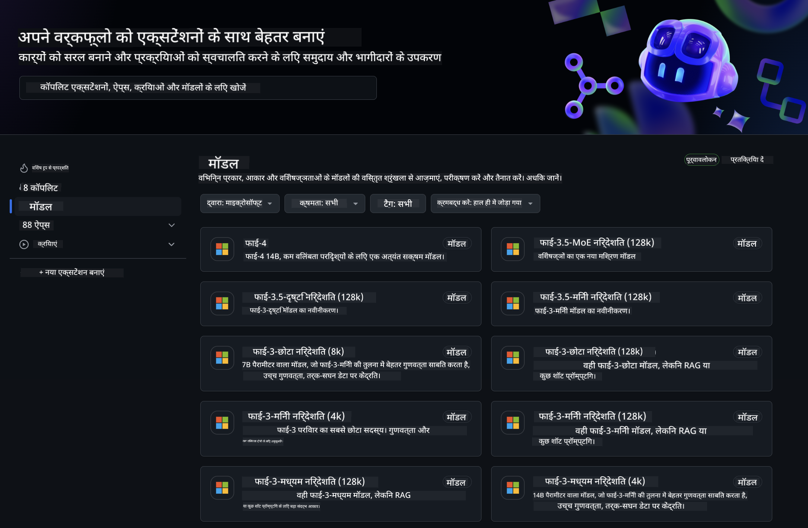
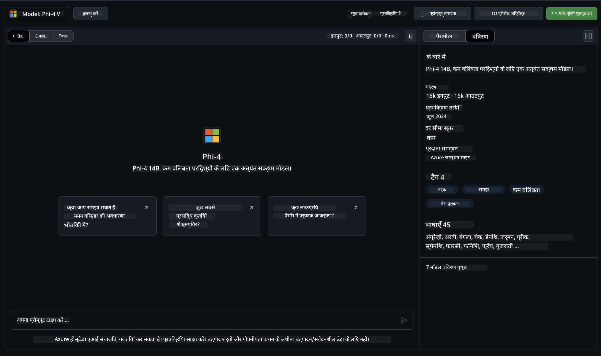
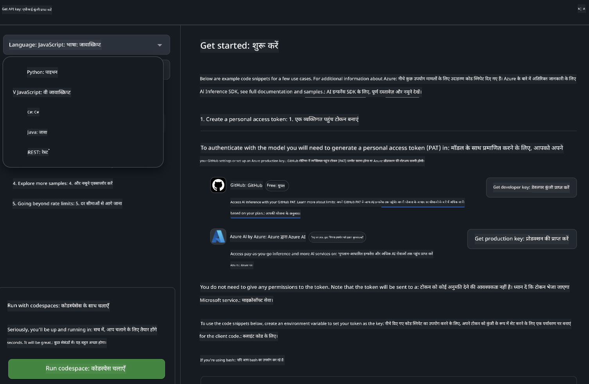
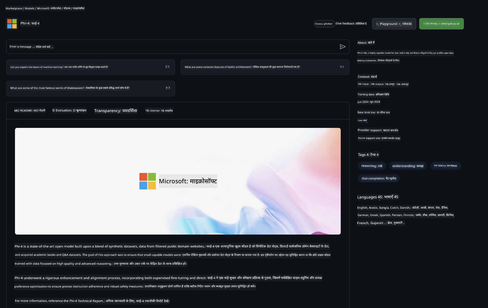

<!--
CO_OP_TRANSLATOR_METADATA:
{
  "original_hash": "fb67a08b9fc911a10ed58081fadef416",
  "translation_date": "2025-05-08T06:28:14+00:00",
  "source_file": "md/01.Introduction/02/02.GitHubModel.md",
  "language_code": "hi"
}
-->
## GitHub Models में Phi परिवार

[GitHub Models](https://github.com/marketplace/models) में आपका स्वागत है! हमने Azure AI पर होस्ट किए गए AI मॉडल्स को एक्सप्लोर करने के लिए सब कुछ तैयार कर रखा है।



GitHub Models पर उपलब्ध मॉडल्स के बारे में अधिक जानकारी के लिए, [GitHub Model Marketplace](https://github.com/marketplace/models) देखें।

## उपलब्ध मॉडल्स

प्रत्येक मॉडल के लिए एक समर्पित प्लेग्राउंड और सैंपल कोड उपलब्ध है।



### GitHub Model कैटलॉग में Phi परिवार

- [Phi-4](https://github.com/marketplace/models/azureml/Phi-4)

- [Phi-3.5-MoE instruct (128k)](https://github.com/marketplace/models/azureml/Phi-3-5-MoE-instruct)

- [Phi-3.5-vision instruct (128k)](https://github.com/marketplace/models/azureml/Phi-3-5-vision-instruct)

- [Phi-3.5-mini instruct (128k)](https://github.com/marketplace/models/azureml/Phi-3-5-mini-instruct)

- [Phi-3-Medium-128k-Instruct](https://github.com/marketplace/models/azureml/Phi-3-medium-128k-instruct)

- [Phi-3-medium-4k-instruct](https://github.com/marketplace/models/azureml/Phi-3-medium-4k-instruct)

- [Phi-3-mini-128k-instruct](https://github.com/marketplace/models/azureml/Phi-3-mini-128k-instruct)

- [Phi-3-mini-4k-instruct](https://github.com/marketplace/models/azureml/Phi-3-mini-4k-instruct)

- [Phi-3-small-128k-instruct](https://github.com/marketplace/models/azureml/Phi-3-small-128k-instruct)

- [Phi-3-small-8k-instruct](https://github.com/marketplace/models/azureml/Phi-3-small-8k-instruct)

## शुरुआत कैसे करें

कुछ बेसिक उदाहरण पहले से ही आपके चलाने के लिए तैयार हैं। आप इन्हें samples डायरेक्टरी में पा सकते हैं। अगर आप सीधे अपनी पसंदीदा भाषा में जाना चाहते हैं, तो निम्न भाषाओं में उदाहरण उपलब्ध हैं:

- Python  
- JavaScript  
- C#  
- Java  
- cURL  

सैंपल्स और मॉडल्स चलाने के लिए एक समर्पित Codespaces Environment भी उपलब्ध है।



## सैंपल कोड

नीचे कुछ उपयोग मामलों के लिए उदाहरण कोड स्निपेट दिए गए हैं। Azure AI Inference SDK के बारे में अधिक जानकारी के लिए, पूर्ण दस्तावेज़ और सैंपल्स देखें।

## सेटअप

1. एक personal access token बनाएं  
आपको टोकन को कोई विशेष अनुमति देने की जरूरत नहीं है। ध्यान दें कि यह टोकन Microsoft सेवा को भेजा जाएगा।

नीचे दिए गए कोड स्निपेट्स का उपयोग करने के लिए, अपने टोकन को क्लाइंट कोड के लिए एक environment variable के रूप में सेट करें।

अगर आप bash उपयोग कर रहे हैं:  
```
export GITHUB_TOKEN="<your-github-token-goes-here>"
```  
अगर आप powershell में हैं:  

```
$Env:GITHUB_TOKEN="<your-github-token-goes-here>"
```  

अगर आप Windows command prompt का उपयोग कर रहे हैं:  

```
set GITHUB_TOKEN=<your-github-token-goes-here>
```  

## Python सैंपल

### निर्भरताएँ इंस्टॉल करें  
pip का उपयोग करके Azure AI Inference SDK इंस्टॉल करें (आवश्यकता: Python >=3.8):

```
pip install azure-ai-inference
```  
### एक बेसिक कोड सैंपल चलाएं

यह सैंपल chat completion API को बेसिक कॉल दिखाता है। यह GitHub AI मॉडल inference endpoint और आपके GitHub टोकन का उपयोग करता है। कॉल synchronous है।

```python
import os
from azure.ai.inference import ChatCompletionsClient
from azure.ai.inference.models import SystemMessage, UserMessage
from azure.core.credentials import AzureKeyCredential

endpoint = "https://models.inference.ai.azure.com"
model_name = "Phi-4"
token = os.environ["GITHUB_TOKEN"]

client = ChatCompletionsClient(
    endpoint=endpoint,
    credential=AzureKeyCredential(token),
)

response = client.complete(
    messages=[
        UserMessage(content="I have $20,000 in my savings account, where I receive a 4% profit per year and payments twice a year. Can you please tell me how long it will take for me to become a millionaire? Also, can you please explain the math step by step as if you were explaining it to an uneducated person?"),
    ],
    temperature=0.4,
    top_p=1.0,
    max_tokens=2048,
    model=model_name
)

print(response.choices[0].message.content)
```  

### मल्टी-टर्न बातचीत चलाएं

यह सैंपल chat completion API के साथ एक मल्टी-टर्न बातचीत दिखाता है। जब आप चैट एप्लिकेशन के लिए मॉडल का उपयोग करते हैं, तो आपको उस बातचीत का इतिहास संभालना होगा और नवीनतम संदेश मॉडल को भेजने होंगे।

```
import os
from azure.ai.inference import ChatCompletionsClient
from azure.ai.inference.models import AssistantMessage, SystemMessage, UserMessage
from azure.core.credentials import AzureKeyCredential

token = os.environ["GITHUB_TOKEN"]
endpoint = "https://models.inference.ai.azure.com"
# Replace Model_Name
model_name = "Phi-4"

client = ChatCompletionsClient(
    endpoint=endpoint,
    credential=AzureKeyCredential(token),
)

messages = [
    SystemMessage(content="You are a helpful assistant."),
    UserMessage(content="What is the capital of France?"),
    AssistantMessage(content="The capital of France is Paris."),
    UserMessage(content="What about Spain?"),
]

response = client.complete(messages=messages, model=model_name)

print(response.choices[0].message.content)
```  

### आउटपुट स्ट्रीम करें

बेहतर उपयोगकर्ता अनुभव के लिए, आप मॉडल की प्रतिक्रिया को स्ट्रीम करना चाहेंगे ताकि पहला टोकन जल्दी दिखे और आपको लंबी प्रतिक्रियाओं के लिए इंतजार न करना पड़े।

```
import os
from azure.ai.inference import ChatCompletionsClient
from azure.ai.inference.models import SystemMessage, UserMessage
from azure.core.credentials import AzureKeyCredential

token = os.environ["GITHUB_TOKEN"]
endpoint = "https://models.inference.ai.azure.com"
# Replace Model_Name
model_name = "Phi-4"

client = ChatCompletionsClient(
    endpoint=endpoint,
    credential=AzureKeyCredential(token),
)

response = client.complete(
    stream=True,
    messages=[
        SystemMessage(content="You are a helpful assistant."),
        UserMessage(content="Give me 5 good reasons why I should exercise every day."),
    ],
    model=model_name,
)

for update in response:
    if update.choices:
        print(update.choices[0].delta.content or "", end="")

client.close()
```  

## GitHub Models के लिए मुफ्त उपयोग और रेट लिमिट्स



[प्लेग्राउंड और मुफ्त API उपयोग के लिए रेट लिमिट्स](https://docs.github.com/en/github-models/prototyping-with-ai-models#rate-limits) आपको मॉडल्स के साथ प्रयोग करने और अपनी AI एप्लिकेशन का प्रोटोटाइप बनाने में मदद करते हैं। इन सीमाओं से आगे उपयोग के लिए, और अपनी एप्लिकेशन को स्केल पर लाने के लिए, आपको Azure अकाउंट से संसाधन प्रावधान करना होगा, और GitHub personal access token की जगह वहाँ से प्रमाणीकृत होना होगा। अपने कोड में और कुछ बदलने की जरूरत नहीं है। Azure AI में मुफ्त टियर की सीमाओं से आगे जाने के लिए इस लिंक का उपयोग करें।

### खुलासे

ध्यान रखें कि जब आप मॉडल के साथ इंटरैक्ट कर रहे हैं, तो आप AI के साथ प्रयोग कर रहे हैं, इसलिए कंटेंट में गलतियां हो सकती हैं।

यह फीचर विभिन्न सीमाओं (जैसे प्रति मिनट अनुरोध, प्रति दिन अनुरोध, प्रति अनुरोध टोकन, और समवर्ती अनुरोध) के अधीन है और उत्पादन उपयोग के लिए डिज़ाइन नहीं किया गया है।

GitHub Models Azure AI Content Safety का उपयोग करता है। ये फिल्टर GitHub Models अनुभव का हिस्सा होने के नाते बंद नहीं किए जा सकते। यदि आप भुगतान सेवा के माध्यम से मॉडल का उपयोग करने का निर्णय लेते हैं, तो कृपया अपनी कंटेंट फिल्टर को अपनी आवश्यकताओं के अनुसार कॉन्फ़िगर करें।

यह सेवा GitHub के Pre-release Terms के अंतर्गत है।

**अस्वीकरण**:  
इस दस्तावेज़ का अनुवाद AI अनुवाद सेवा [Co-op Translator](https://github.com/Azure/co-op-translator) का उपयोग करके किया गया है। जबकि हम सटीकता के लिए प्रयासरत हैं, कृपया ध्यान दें कि स्वचालित अनुवाद में त्रुटियाँ या गलतियाँ हो सकती हैं। मूल दस्तावेज़ अपनी मूल भाषा में प्रामाणिक स्रोत माना जाना चाहिए। महत्वपूर्ण जानकारी के लिए, पेशेवर मानव अनुवाद की सलाह दी जाती है। इस अनुवाद के उपयोग से उत्पन्न किसी भी गलतफहमी या गलत व्याख्या के लिए हम उत्तरदायी नहीं हैं।