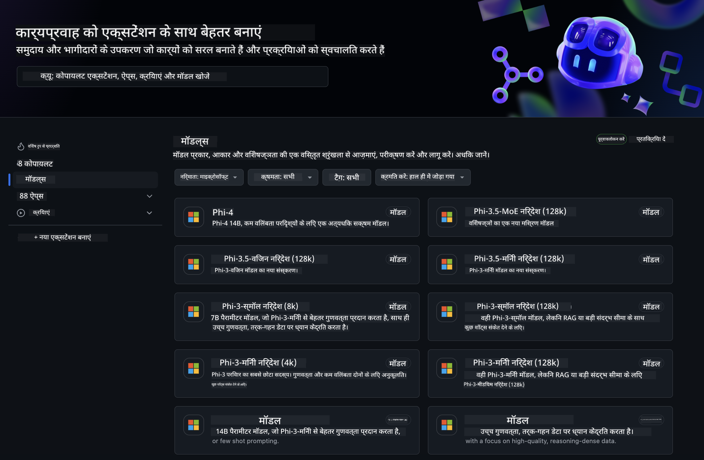
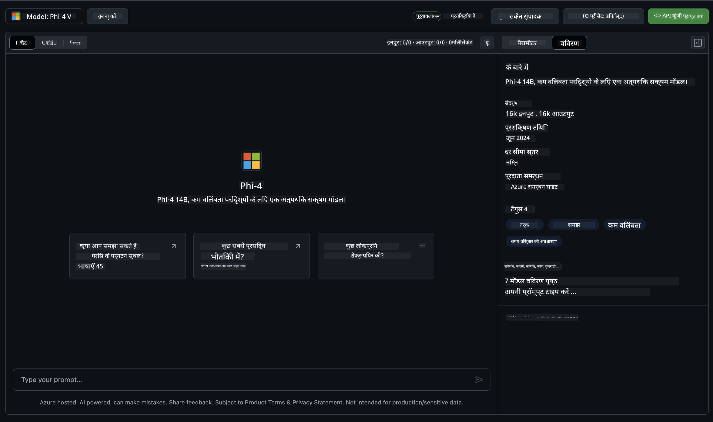
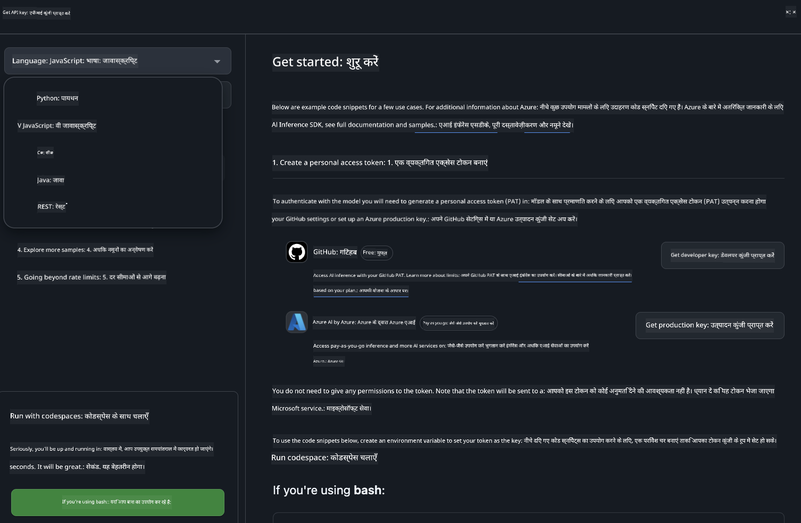
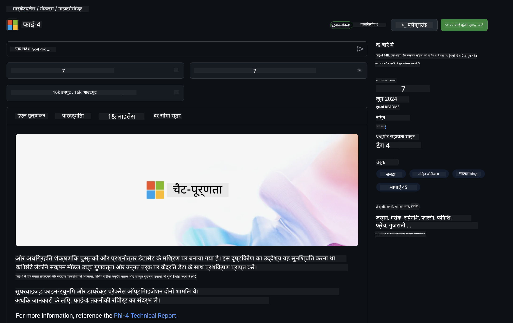

<!--
CO_OP_TRANSLATOR_METADATA:
{
  "original_hash": "fa5cdbc832e5bcffebb25ce25ec1a3c3",
  "translation_date": "2025-04-04T17:37:33+00:00",
  "source_file": "md\\01.Introduction\\02\\02.GitHubModel.md",
  "language_code": "hi"
}
-->
## GitHub मॉडल्स में Phi परिवार

[GitHub Models](https://github.com/marketplace/models) में आपका स्वागत है! हमने सब कुछ तैयार कर लिया है ताकि आप Azure AI पर होस्ट किए गए AI मॉडल्स का अन्वेषण कर सकें।



GitHub Models पर उपलब्ध मॉडल्स के बारे में अधिक जानकारी के लिए [GitHub Model Marketplace](https://github.com/marketplace/models) देखें।

## उपलब्ध मॉडल्स

प्रत्येक मॉडल के लिए एक समर्पित प्लेग्राउंड और सैंपल कोड उपलब्ध है।  



### GitHub Model Catalog में Phi परिवार

- [Phi-4](https://github.com/marketplace/models/azureml/Phi-4)

- [Phi-3.5-MoE instruct (128k)](https://github.com/marketplace/models/azureml/Phi-3-5-MoE-instruct)

- [Phi-3.5-vision instruct (128k)](https://github.com/marketplace/models/azureml/Phi-3-5-vision-instruct)

- [Phi-3.5-mini instruct (128k)](https://github.com/marketplace/models/azureml/Phi-3-5-mini-instruct)

- [Phi-3-Medium-128k-Instruct](https://github.com/marketplace/models/azureml/Phi-3-medium-128k-instruct)

- [Phi-3-medium-4k-instruct](https://github.com/marketplace/models/azureml/Phi-3-medium-4k-instruct)

- [Phi-3-mini-128k-instruct](https://github.com/marketplace/models/azureml/Phi-3-mini-128k-instruct)

- [Phi-3-mini-4k-instruct](https://github.com/marketplace/models/azureml/Phi-3-mini-4k-instruct)

- [Phi-3-small-128k-instruct](https://github.com/marketplace/models/azureml/Phi-3-small-128k-instruct)

- [Phi-3-small-8k-instruct](https://github.com/marketplace/models/azureml/Phi-3-small-8k-instruct)

## शुरुआत करें

कुछ बेसिक उदाहरण तैयार हैं जिन्हें आप चला सकते हैं। आप इन्हें सैंपल्स डायरेक्टरी में पा सकते हैं। अगर आप सीधे अपनी पसंदीदा भाषा पर जाना चाहते हैं, तो निम्न भाषाओं में उदाहरण उपलब्ध हैं:

- Python
- JavaScript
- C#
- Java
- cURL

सैंपल्स और मॉडल्स चलाने के लिए एक समर्पित Codespaces Environment भी उपलब्ध है।  



## सैंपल कोड 

नीचे कुछ उपयोग मामलों के लिए कोड स्निपेट्स के उदाहरण दिए गए हैं। Azure AI Inference SDK के बारे में अधिक जानकारी के लिए पूरी डाक्यूमेंटेशन और सैंपल्स देखें।

## सेटअप 

1. एक व्यक्तिगत एक्सेस टोकन बनाएं  
आपको टोकन को कोई भी अनुमति देने की आवश्यकता नहीं है। ध्यान दें कि टोकन को Microsoft सेवा पर भेजा जाएगा।

नीचे दिए गए कोड स्निपेट्स का उपयोग करने के लिए, एक पर्यावरण वेरिएबल बनाएं ताकि आप अपने टोकन को क्लाइंट कोड के लिए कुंजी के रूप में सेट कर सकें।

अगर आप bash का उपयोग कर रहे हैं:
```
export GITHUB_TOKEN="<your-github-token-goes-here>"
```  
अगर आप powershell में हैं:

```
$Env:GITHUB_TOKEN="<your-github-token-goes-here>"
```  

अगर आप Windows कमांड प्रॉम्प्ट का उपयोग कर रहे हैं:

```
set GITHUB_TOKEN=<your-github-token-goes-here>
```  

## Python सैंपल

### डिपेंडेंसी इंस्टॉल करें  
pip का उपयोग करके Azure AI Inference SDK इंस्टॉल करें (आवश्यक: Python >=3.8):

```
pip install azure-ai-inference
```  

### एक बेसिक कोड सैंपल चलाएं  

यह सैंपल चैट कम्प्लीशन API के लिए एक बेसिक कॉल को प्रदर्शित करता है। यह GitHub AI मॉडल इन्फ्रेंस एंडपॉइंट और आपके GitHub टोकन का उपयोग कर रहा है। यह कॉल सिंक्रोनस है।

```python
import os
from azure.ai.inference import ChatCompletionsClient
from azure.ai.inference.models import SystemMessage, UserMessage
from azure.core.credentials import AzureKeyCredential

endpoint = "https://models.inference.ai.azure.com"
model_name = "Phi-4"
token = os.environ["GITHUB_TOKEN"]

client = ChatCompletionsClient(
    endpoint=endpoint,
    credential=AzureKeyCredential(token),
)

response = client.complete(
    messages=[
        UserMessage(content="I have $20,000 in my savings account, where I receive a 4% profit per year and payments twice a year. Can you please tell me how long it will take for me to become a millionaire? Also, can you please explain the math step by step as if you were explaining it to an uneducated person?"),
    ],
    temperature=0.4,
    top_p=1.0,
    max_tokens=2048,
    model=model_name
)

print(response.choices[0].message.content)
```  

### मल्टी-टर्न बातचीत चलाएं  

यह सैंपल चैट कम्प्लीशन API के साथ मल्टी-टर्न बातचीत को प्रदर्शित करता है। जब आप मॉडल का उपयोग चैट एप्लिकेशन के लिए कर रहे हों, तो आपको उस बातचीत का इतिहास प्रबंधित करना होगा और नवीनतम संदेश मॉडल को भेजने होंगे।

```
import os
from azure.ai.inference import ChatCompletionsClient
from azure.ai.inference.models import AssistantMessage, SystemMessage, UserMessage
from azure.core.credentials import AzureKeyCredential

token = os.environ["GITHUB_TOKEN"]
endpoint = "https://models.inference.ai.azure.com"
# Replace Model_Name
model_name = "Phi-4"

client = ChatCompletionsClient(
    endpoint=endpoint,
    credential=AzureKeyCredential(token),
)

messages = [
    SystemMessage(content="You are a helpful assistant."),
    UserMessage(content="What is the capital of France?"),
    AssistantMessage(content="The capital of France is Paris."),
    UserMessage(content="What about Spain?"),
]

response = client.complete(messages=messages, model=model_name)

print(response.choices[0].message.content)
```  

### आउटपुट को स्ट्रीम करें  

बेहतर उपयोगकर्ता अनुभव के लिए, आप मॉडल के उत्तर को स्ट्रीम करना चाहेंगे ताकि पहला टोकन जल्दी दिखे और लंबे उत्तरों के लिए इंतजार न करना पड़े।

```
import os
from azure.ai.inference import ChatCompletionsClient
from azure.ai.inference.models import SystemMessage, UserMessage
from azure.core.credentials import AzureKeyCredential

token = os.environ["GITHUB_TOKEN"]
endpoint = "https://models.inference.ai.azure.com"
# Replace Model_Name
model_name = "Phi-4"

client = ChatCompletionsClient(
    endpoint=endpoint,
    credential=AzureKeyCredential(token),
)

response = client.complete(
    stream=True,
    messages=[
        SystemMessage(content="You are a helpful assistant."),
        UserMessage(content="Give me 5 good reasons why I should exercise every day."),
    ],
    model=model_name,
)

for update in response:
    if update.choices:
        print(update.choices[0].delta.content or "", end="")

client.close()
```  

## GitHub Models के लिए मुफ्त उपयोग और दर सीमाएं



[प्लेग्राउंड और मुफ्त API उपयोग के लिए दर सीमाएं](https://docs.github.com/en/github-models/prototyping-with-ai-models#rate-limits) आपको मॉडल्स के साथ प्रयोग करने और अपने AI एप्लिकेशन का प्रोटोटाइप बनाने में मदद करने के लिए डिज़ाइन की गई हैं। इन सीमाओं से आगे उपयोग करने के लिए, और अपने एप्लिकेशन को स्केल पर लाने के लिए, आपको Azure खाते से संसाधन प्रोविजन करना होगा और वहां से प्रमाणित करना होगा, बजाय इसके कि आप GitHub व्यक्तिगत एक्सेस टोकन का उपयोग करें। आपको अपने कोड में कुछ और बदलने की आवश्यकता नहीं है। Azure AI में मुफ्त टियर सीमाओं से आगे जाने के तरीके जानने के लिए इस लिंक का उपयोग करें।

### डिस्क्लोज़र  

याद रखें कि जब आप मॉडल के साथ इंटरैक्ट कर रहे हैं, तो आप AI के साथ प्रयोग कर रहे हैं, इसलिए सामग्री में त्रुटियां संभव हैं।

इस फीचर पर विभिन्न सीमाएं लागू होती हैं (जैसे प्रति मिनट अनुरोध, प्रति दिन अनुरोध, प्रति अनुरोध टोकन, और समवर्ती अनुरोध) और इसे प्रोडक्शन उपयोग मामलों के लिए डिज़ाइन नहीं किया गया है।

GitHub Models Azure AI Content Safety का उपयोग करता है। इन फ़िल्टरों को GitHub Models अनुभव के हिस्से के रूप में बंद नहीं किया जा सकता। यदि आप पेड सेवा के माध्यम से मॉडल्स का उपयोग करने का निर्णय लेते हैं, तो कृपया अपने कंटेंट फ़िल्टर को अपनी आवश्यकताओं के अनुसार कॉन्फ़िगर करें।

यह सेवा GitHub के प्री-रिलीज़ शर्तों के तहत आती है।

**अस्वीकरण**:  
यह दस्तावेज़ AI अनुवाद सेवा [Co-op Translator](https://github.com/Azure/co-op-translator) का उपयोग करके अनुवादित किया गया है। जबकि हम सटीकता सुनिश्चित करने का प्रयास करते हैं, कृपया ध्यान दें कि स्वचालित अनुवाद में त्रुटियाँ या अशुद्धियाँ हो सकती हैं। मूल भाषा में मूल दस्तावेज़ को आधिकारिक स्रोत माना जाना चाहिए। महत्वपूर्ण जानकारी के लिए, पेशेवर मानव अनुवाद की सिफारिश की जाती है। इस अनुवाद के उपयोग से उत्पन्न किसी भी गलतफहमी या गलत व्याख्या के लिए हम जिम्मेदार नहीं हैं।