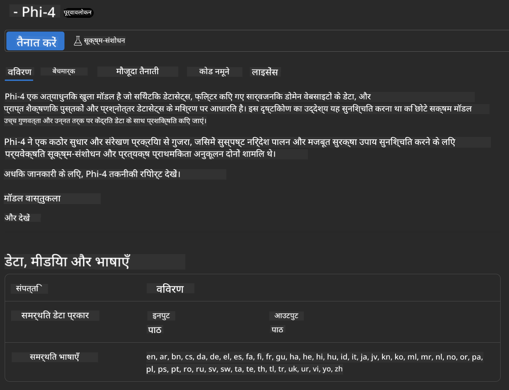
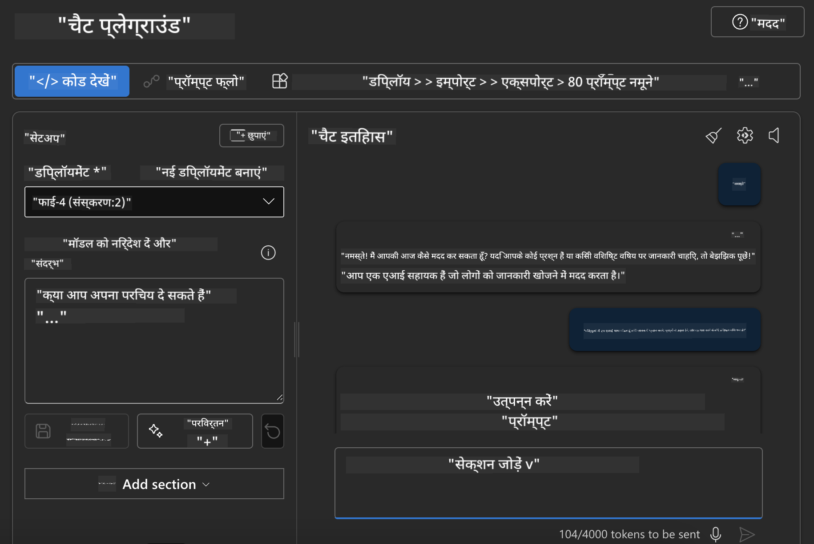

<!--
CO_OP_TRANSLATOR_METADATA:
{
  "original_hash": "3ae21dc5554e888defbe57946ee995ee",
  "translation_date": "2025-07-16T19:08:02+00:00",
  "source_file": "md/01.Introduction/02/03.AzureAIFoundry.md",
  "language_code": "hi"
}
-->
## Azure AI Foundry में Phi परिवार

[Azure AI Foundry](https://ai.azure.com) एक भरोसेमंद प्लेटफ़ॉर्म है जो डेवलपर्स को सुरक्षित, संरक्षित और जिम्मेदार तरीके से AI के साथ नवाचार करने और भविष्य को आकार देने में सक्षम बनाता है।

[Azure AI Foundry](https://ai.azure.com) डेवलपर्स के लिए इस प्रकार डिज़ाइन किया गया है:

- एंटरप्राइज-ग्रेड प्लेटफ़ॉर्म पर जनरेटिव AI एप्लिकेशन बनाएं।
- जिम्मेदार AI प्रथाओं के आधार पर अत्याधुनिक AI टूल्स और ML मॉडल का उपयोग करके एक्सप्लोर, निर्माण, परीक्षण और तैनाती करें।
- एप्लिकेशन विकास के पूरे जीवनचक्र के लिए टीम के साथ सहयोग करें।

Azure AI Foundry के साथ, आप विभिन्न प्रकार के मॉडल, सेवाओं और क्षमताओं का पता लगा सकते हैं, और उन AI एप्लिकेशन को बना सकते हैं जो आपके लक्ष्यों की सबसे अच्छी सेवा करते हैं। Azure AI Foundry प्लेटफ़ॉर्म प्रूफ ऑफ कॉन्सेप्ट को पूर्ण उत्पादन एप्लिकेशन में आसानी से बदलने के लिए स्केलेबिलिटी प्रदान करता है। निरंतर निगरानी और सुधार दीर्घकालिक सफलता का समर्थन करते हैं।


Azure AI Foundry में Azure AOAI Service का उपयोग करने के अलावा, आप Azure AI Foundry Model Catalog में थर्ड-पार्टी मॉडल भी उपयोग कर सकते हैं। यदि आप Azure AI Foundry को अपने AI समाधान प्लेटफ़ॉर्म के रूप में उपयोग करना चाहते हैं, तो यह एक अच्छा विकल्प है।

हम Azure AI Foundry में Model Catalog के माध्यम से Phi Family Models को जल्दी से तैनात कर सकते हैं

[Microsoft Phi Models in Azure AI Foundry Models](https://ai.azure.com/explore/models/?selectedCollection=phi)


### **Azure AI Foundry में Phi-4 तैनात करें**




### **Azure AI Foundry Playground में Phi-4 का परीक्षण करें**



### **Azure AI Foundry Phi-4 को कॉल करने के लिए Python कोड चलाना**


```python

import os  
import base64
from openai import AzureOpenAI  
from azure.identity import DefaultAzureCredential, get_bearer_token_provider  
        
endpoint = os.getenv("ENDPOINT_URL", "Your Azure AOAI Service Endpoint")  
deployment = os.getenv("DEPLOYMENT_NAME", "Phi-4")  
      
token_provider = get_bearer_token_provider(  
    DefaultAzureCredential(),  
    "https://cognitiveservices.azure.com/.default"  
)  
  
client = AzureOpenAI(  
    azure_endpoint=endpoint,  
    azure_ad_token_provider=token_provider,  
    api_version="2024-05-01-preview",  
)  
  

chat_prompt = [
    {
        "role": "system",
        "content": "You are an AI assistant that helps people find information."
    },
    {
        "role": "user",
        "content": "can you introduce yourself"
    }
] 
    
# Include speech result if speech is enabled  
messages = chat_prompt 

completion = client.chat.completions.create(  
    model=deployment,  
    messages=messages,
    max_tokens=800,  
    temperature=0.7,  
    top_p=0.95,  
    frequency_penalty=0,  
    presence_penalty=0,
    stop=None,  
    stream=False  
)  
  
print(completion.to_json())  

```

**अस्वीकरण**:  
यह दस्तावेज़ AI अनुवाद सेवा [Co-op Translator](https://github.com/Azure/co-op-translator) का उपयोग करके अनुवादित किया गया है। जबकि हम सटीकता के लिए प्रयासरत हैं, कृपया ध्यान दें कि स्वचालित अनुवादों में त्रुटियाँ या अशुद्धियाँ हो सकती हैं। मूल दस्तावेज़ अपनी मूल भाषा में ही अधिकारिक स्रोत माना जाना चाहिए। महत्वपूर्ण जानकारी के लिए, पेशेवर मानव अनुवाद की सलाह दी जाती है। इस अनुवाद के उपयोग से उत्पन्न किसी भी गलतफहमी या गलत व्याख्या के लिए हम जिम्मेदार नहीं हैं।