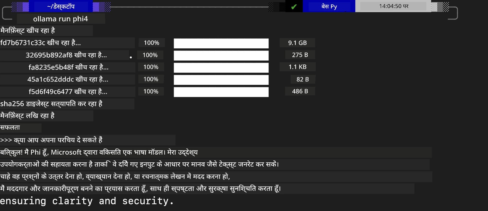
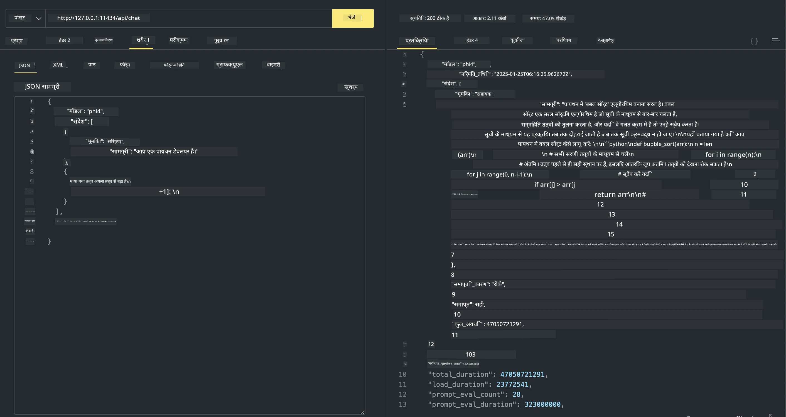

## Ollama में Phi परिवार


[Ollama](https://ollama.com) सरल स्क्रिप्ट के माध्यम से अधिक लोगों को open source LLM या SLM सीधे तैनात करने की अनुमति देता है, और स्थानीय Copilot एप्लिकेशन परिदृश्यों में मदद करने के लिए API भी बनाने में सक्षम है।

## **1. इंस्टॉलेशन**

Ollama Windows, macOS, और Linux पर चलता है। आप इस लिंक के माध्यम से Ollama इंस्टॉल कर सकते हैं ([https://ollama.com/download](https://ollama.com/download)). सफल इंस्टॉलेशन के बाद, आप टर्मिनल विंडो के माध्यम से सीधे Ollama स्क्रिप्ट का उपयोग करके Phi-3 को कॉल कर सकते हैं। आप Ollama में सभी [Ollama में उपलब्ध सभी लाइब्रेरी](https://ollama.com/library) देख सकते हैं। यदि आप इस repository को Codespace में खोलते हैं, तो इसमें पहले से ही Ollama इंस्टॉल होगा।

```bash

ollama run phi4

```

> [!NOTE]
> मॉडल पहली बार चलाने पर पहले डाउनलोड किया जाएगा। बेशक, आप सीधे डाउनलोड किए गए Phi-4 मॉडल को भी निर्दिष्ट कर सकते हैं। हम कमांड चलाने के उदाहरण के लिए WSL लेते हैं। मॉडल सफलतापूर्वक डाउनलोड होने के बाद, आप सीधे टर्मिनल पर इंटरैक्ट कर सकते हैं।



## **2. Ollama से phi-4 API को कॉल करना**

यदि आप Ollama द्वारा जनरेट की गई Phi-4 API को कॉल करना चाहते हैं, तो Ollama सर्वर शुरू करने के लिए आप टर्मिनल में यह कमांड उपयोग कर सकते हैं।

```bash

ollama serve

```

> [!NOTE]
> यदि आप macOS या Linux चला रहे हैं, तो कृपया ध्यान दें कि आपको निम्न त्रुटि मिल सकती है **"Error: listen tcp 127.0.0.1:11434: bind: address already in use"**। आप यह त्रुटि कमांड चलाते समय पा सकते हैं। आप या तो इस त्रुटि को अनदेखा कर सकते हैं, क्योंकि यह आमतौर पर संकेत करता है कि सर्वर पहले से चल रहा है, या आप Ollama को रोककर और फिर से शुरू कर सकते हैं:

**macOS**

```bash

brew services restart ollama

```

**Linux**

```bash

sudo systemctl stop ollama

```

Ollama दो API का समर्थन करता है: generate और chat। आप आवश्यकतानुसार Ollama द्वारा प्रदान किए गए मॉडल API को कॉल कर सकते हैं, स्थानीय सेवा (पोर्ट 11434 पर चल रही) को अनुरोध भेजकर।

**Chat**

```bash

curl http://127.0.0.1:11434/api/chat -d '{
  "model": "phi3",
  "messages": [
    {
      "role": "system",
      "content": "Your are a python developer."
    },
    {
      "role": "user",
      "content": "Help me generate a bubble algorithm"
    }
  ],
  "stream": false
  
}'
```

यह Postman में परिणाम है



## अतिरिक्त संसाधन

Ollama में उपलब्ध मॉडल की सूची उनकी [लाइब्रेरी](https://ollama.com/library) में देखें।

Ollama सर्वर से अपने मॉडल को इस कमांड का उपयोग करके खींचें

```bash
ollama pull phi4
```

इस कमांड का उपयोग करके मॉडल चलाएँ

```bash
ollama run phi4
```

***नोट:*** अधिक जानकारी के लिए इस लिंक पर जाएँ [https://github.com/ollama/ollama/blob/main/docs/api.md](https://github.com/ollama/ollama/blob/main/docs/api.md)

## Python से Ollama को कॉल करना

ऊपर उपयोग किए गए स्थानीय सर्वर एंडपॉइंट्स पर अनुरोध करने के लिए आप `requests` या `urllib3` का उपयोग कर सकते हैं। हालांकि, Python में Ollama का उपयोग करने का एक लोकप्रिय तरीका [openai](https://pypi.org/project/openai/) SDK के माध्यम से है, क्योंकि Ollama OpenAI-अनुकूल सर्वर एंडपॉइंट भी प्रदान करता है।

यहाँ phi3-mini के लिए एक उदाहरण है:

```python
import openai

client = openai.OpenAI(
    base_url="http://localhost:11434/v1",
    api_key="nokeyneeded",
)

response = client.chat.completions.create(
    model="phi4",
    temperature=0.7,
    n=1,
    messages=[
        {"role": "system", "content": "You are a helpful assistant."},
        {"role": "user", "content": "Write a haiku about a hungry cat"},
    ],
)

print("Response:")
print(response.choices[0].message.content)
```

## JavaScript से Ollama को कॉल करना 

```javascript
// Phi-4 के साथ फ़ाइल का सारांश बनाने का उदाहरण
script({
    model: "ollama:phi4",
    title: "Summarize with Phi-4",
    system: ["system"],
})

// सारांश बनाने का उदाहरण
const file = def("FILE", env.files)
$`Summarize ${file} in a single paragraph.`
```

## C# से Ollama को कॉल करना

एक नया C# Console एप्लिकेशन बनाएं और निम्न NuGet पैकेज जोड़ें:

```bash
dotnet add package Microsoft.SemanticKernel --version 1.34.0
```

फिर `Program.cs` फ़ाइल में इस कोड को बदलें

```csharp
using Microsoft.SemanticKernel;
using Microsoft.SemanticKernel.ChatCompletion;

// add chat completion service using the local ollama server endpoint
#pragma warning disable SKEXP0001, SKEXP0003, SKEXP0010, SKEXP0011, SKEXP0050, SKEXP0052
builder.AddOpenAIChatCompletion(
    modelId: "phi4",
    endpoint: new Uri("http://localhost:11434/"),
    apiKey: "non required");

// invoke a simple prompt to the chat service
string prompt = "Write a joke about kittens";
var response = await kernel.InvokePromptAsync(prompt);
Console.WriteLine(response.GetValue<string>());
```

इस कमांड के साथ ऐप चलाएँ:

```bash
dotnet run
```

---

<!-- CO-OP TRANSLATOR DISCLAIMER START -->
अस्वीकरण:
यह दस्तावेज़ AI अनुवाद सेवा [Co-op Translator](https://github.com/Azure/co-op-translator) का उपयोग करके अनुवादित किया गया है। जबकि हम सटीकता के लिए प्रयास करते हैं, कृपया ध्यान दें कि स्वचालित अनुवादों में त्रुटियाँ या गलतियाँ हो सकती हैं। मूल दस्तावेज़ उसकी मूल भाषा में अधिकृत स्रोत माना जाना चाहिए। महत्वपूर्ण जानकारी के लिए पेशेवर मानव अनुवाद की सिफारिश की जाती है। इस अनुवाद के उपयोग से उत्पन्न किसी भी गलतफहमी या ग़लत व्याख्या के लिए हम उत्तरदायी नहीं हैं।
<!-- CO-OP TRANSLATOR DISCLAIMER END -->