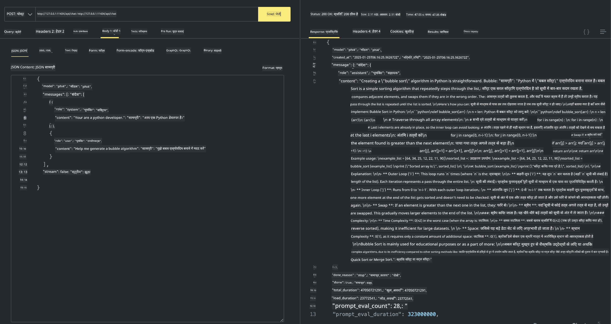

<!--
CO_OP_TRANSLATOR_METADATA:
{
  "original_hash": "0b38834693bb497f96bf53f0d941f9a1",
  "translation_date": "2025-07-16T19:14:21+00:00",
  "source_file": "md/01.Introduction/02/04.Ollama.md",
  "language_code": "hi"
}
-->
## Ollama में Phi परिवार


[Ollama](https://ollama.com) अधिक लोगों को सरल स्क्रिप्ट्स के माध्यम से ओपन सोर्स LLM या SLM को सीधे तैनात करने की अनुमति देता है, और स्थानीय Copilot एप्लिकेशन परिदृश्यों में मदद के लिए API भी बना सकता है।

## **1. स्थापना**

Ollama Windows, macOS, और Linux पर चलाने का समर्थन करता है। आप इस लिंक ([https://ollama.com/download](https://ollama.com/download)) के माध्यम से Ollama इंस्टॉल कर सकते हैं। सफल स्थापना के बाद, आप सीधे टर्मिनल विंडो से Ollama स्क्रिप्ट का उपयोग करके Phi-3 को कॉल कर सकते हैं। आप सभी [उपलब्ध लाइब्रेरीज़ Ollama में](https://ollama.com/library) देख सकते हैं। यदि आप इस रिपॉजिटरी को Codespace में खोलते हैं, तो इसमें पहले से ही Ollama इंस्टॉल होगा।

```bash

ollama run phi4

```

> [!NOTE]
> जब आप इसे पहली बार चलाएंगे तो मॉडल पहले डाउनलोड होगा। बेशक, आप सीधे डाउनलोड किए गए Phi-4 मॉडल को भी निर्दिष्ट कर सकते हैं। हम कमांड चलाने के लिए WSL को उदाहरण के रूप में लेते हैं। मॉडल सफलतापूर्वक डाउनलोड होने के बाद, आप सीधे टर्मिनल पर इंटरैक्ट कर सकते हैं।


## **2. Ollama से phi-4 API कॉल करना**

यदि आप Ollama द्वारा जनरेट किए गए Phi-4 API को कॉल करना चाहते हैं, तो आप टर्मिनल में इस कमांड का उपयोग करके Ollama सर्वर शुरू कर सकते हैं।

```bash

ollama serve

```

> [!NOTE]
> यदि आप MacOS या Linux चला रहे हैं, तो कृपया ध्यान दें कि आपको निम्न त्रुटि मिल सकती है **"Error: listen tcp 127.0.0.1:11434: bind: address already in use"** यह त्रुटि कमांड चलाते समय आ सकती है। आप इस त्रुटि को अनदेखा कर सकते हैं, क्योंकि यह आमतौर पर संकेत देता है कि सर्वर पहले से ही चल रहा है, या आप Ollama को रोककर फिर से शुरू कर सकते हैं:

**macOS**

```bash

brew services restart ollama

```

**Linux**

```bash

sudo systemctl stop ollama

```

Ollama दो API का समर्थन करता है: generate और chat। आप अपनी जरूरत के अनुसार Ollama द्वारा प्रदान किए गए मॉडल API को कॉल कर सकते हैं, जो पोर्ट 11434 पर चल रहे स्थानीय सेवा को अनुरोध भेजकर काम करता है।

**Chat**

```bash

curl http://127.0.0.1:11434/api/chat -d '{
  "model": "phi3",
  "messages": [
    {
      "role": "system",
      "content": "Your are a python developer."
    },
    {
      "role": "user",
      "content": "Help me generate a bubble algorithm"
    }
  ],
  "stream": false
  
}'

This is the result in Postman



## Additional Resources

Check the list of available models in Ollama in [their library](https://ollama.com/library).

Pull your model from the Ollama server using this command

```bash
ollama pull phi4
```

Run the model using this command

```bash
ollama run phi4
```

***Note:*** Visit this link [https://github.com/ollama/ollama/blob/main/docs/api.md](https://github.com/ollama/ollama/blob/main/docs/api.md) to learn more

## Calling Ollama from Python

You can use `requests` or `urllib3` to make requests to the local server endpoints used above. However, a popular way to use Ollama in Python is via the [openai](https://pypi.org/project/openai/) SDK, since Ollama provides OpenAI-compatible server endpoints as well.

Here is an example for phi3-mini:

```python
import openai

client = openai.OpenAI(
    base_url="http://localhost:11434/v1",
    api_key="nokeyneeded",
)

response = client.chat.completions.create(
    model="phi4",
    temperature=0.7,
    n=1,
    messages=[
        {"role": "system", "content": "You are a helpful assistant."},
        {"role": "user", "content": "Write a haiku about a hungry cat"},
    ],
)

print("Response:")
print(response.choices[0].message.content)
```

## Calling Ollama from JavaScript 

```javascript
// Phi-4 के साथ फ़ाइल का सारांश बनाने का उदाहरण
script({
    model: "ollama:phi4",
    title: "Phi-4 के साथ सारांश बनाएं",
    system: ["system"],
})

// सारांश बनाने का उदाहरण
const file = def("FILE", env.files)
$`Summarize ${file} in a single paragraph.`
```

## Calling Ollama from C#

Create a new C# Console application and add the following NuGet package:

```bash
dotnet add package Microsoft.SemanticKernel --version 1.34.0
```

Then replace this code in the `Program.cs` file

```csharp
using Microsoft.SemanticKernel;
using Microsoft.SemanticKernel.ChatCompletion;

// स्थानीय ollama सर्वर एंडपॉइंट का उपयोग करके चैट पूर्णता सेवा जोड़ें
#pragma warning disable SKEXP0001, SKEXP0003, SKEXP0010, SKEXP0011, SKEXP0050, SKEXP0052
builder.AddOpenAIChatCompletion(
    modelId: "phi4",
    endpoint: new Uri("http://localhost:11434/"),
    apiKey: "non required");

// चैट सेवा को एक सरल प्रॉम्प्ट भेजें
string prompt = "Write a joke about kittens";
var response = await kernel.InvokePromptAsync(prompt);
Console.WriteLine(response.GetValue<string>());
```

Run the app with the command:

```bash
dotnet run

**अस्वीकरण**:  
यह दस्तावेज़ AI अनुवाद सेवा [Co-op Translator](https://github.com/Azure/co-op-translator) का उपयोग करके अनुवादित किया गया है। जबकि हम सटीकता के लिए प्रयासरत हैं, कृपया ध्यान दें कि स्वचालित अनुवादों में त्रुटियाँ या अशुद्धियाँ हो सकती हैं। मूल दस्तावेज़ अपनी मूल भाषा में ही अधिकारिक स्रोत माना जाना चाहिए। महत्वपूर्ण जानकारी के लिए, पेशेवर मानव अनुवाद की सलाह दी जाती है। इस अनुवाद के उपयोग से उत्पन्न किसी भी गलतफहमी या गलत व्याख्या के लिए हम जिम्मेदार नहीं हैं।