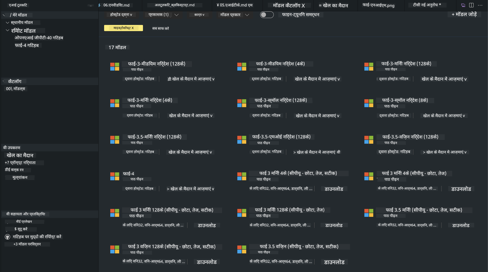
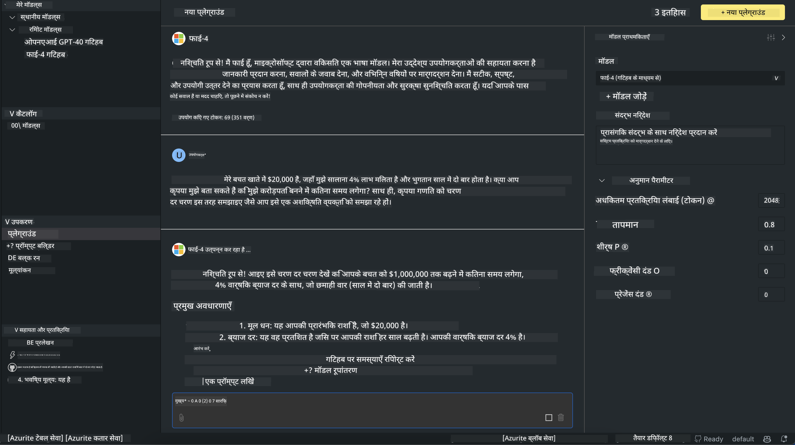

<!--
CO_OP_TRANSLATOR_METADATA:
{
  "original_hash": "9365fb38f5c75c4d7ac9b9a4baa7c9d1",
  "translation_date": "2025-04-04T17:40:36+00:00",
  "source_file": "md\\01.Introduction\\02\\05.AITK.md",
  "language_code": "hi"
}
-->
# AITK में Phi फैमिली

[VS Code के लिए AI Toolkit](https://marketplace.visualstudio.com/items?itemName=ms-windows-ai-studio.windows-ai-studio) जेनरेटिव AI ऐप डेवलपमेंट को सरल बनाता है। यह Azure AI Foundry Catalog और Hugging Face जैसे अन्य कैटलॉग से आधुनिक AI डेवलपमेंट टूल्स और मॉडल्स को एक साथ लाता है। आप GitHub Models और Azure AI Foundry Model Catalogs द्वारा संचालित AI मॉडल्स कैटलॉग ब्राउज़ कर सकते हैं, उन्हें लोकल या रिमोट डाउनलोड कर सकते हैं, फाइन-ट्यून कर सकते हैं, टेस्ट कर सकते हैं और अपने ऐप्लिकेशन में उपयोग कर सकते हैं।

AI Toolkit Preview लोकल रूप से चलेगा। लोकल इनफेरेंस या फाइन-ट्यून, यह आपके द्वारा चुने गए मॉडल पर निर्भर करता है। इसके लिए आपको NVIDIA CUDA GPU जैसे GPU की आवश्यकता हो सकती है। आप GitHub Models को सीधे AITK के साथ चला सकते हैं।

## शुरुआत कैसे करें

[Windows Subsystem for Linux कैसे इंस्टॉल करें](https://learn.microsoft.com/windows/wsl/install?WT.mc_id=aiml-137032-kinfeylo) के बारे में अधिक जानें।

और [डिफ़ॉल्ट डिस्ट्रीब्यूशन बदलना](https://learn.microsoft.com/windows/wsl/install#change-the-default-linux-distribution-installed)।

[AI Toolkit GitHub Repo](https://github.com/microsoft/vscode-ai-toolkit/)

- Windows, Linux, macOS
  
- Windows और Linux दोनों पर फाइन-ट्यूनिंग के लिए आपको Nvidia GPU की आवश्यकता होगी। इसके अतिरिक्त, **Windows** के लिए Ubuntu 18.4 या उससे अधिक के डिस्ट्रीब्यूशन के साथ Linux के लिए सबसिस्टम की आवश्यकता है। [Windows Subsystem for Linux कैसे इंस्टॉल करें](https://learn.microsoft.com/windows/wsl/install) और [डिफ़ॉल्ट डिस्ट्रीब्यूशन बदलना](https://learn.microsoft.com/windows/wsl/install#change-the-default-linux-distribution-installed) के बारे में जानें।

### AI Toolkit इंस्टॉल करें

AI Toolkit को [Visual Studio Code Extension](https://code.visualstudio.com/docs/setup/additional-components#_vs-code-extensions) के रूप में भेजा जाता है। इसलिए, पहले [VS Code](https://code.visualstudio.com/docs/setup/windows?WT.mc_id=aiml-137032-kinfeylo) इंस्टॉल करें और फिर [VS Marketplace](https://marketplace.visualstudio.com/items?itemName=ms-windows-ai-studio.windows-ai-studio) से AI Toolkit डाउनलोड करें।  
[AI Toolkit Visual Studio Marketplace](https://marketplace.visualstudio.com/items?itemName=ms-windows-ai-studio.windows-ai-studio) में उपलब्ध है और इसे किसी अन्य VS Code एक्सटेंशन की तरह इंस्टॉल किया जा सकता है।

यदि आप VS Code एक्सटेंशन इंस्टॉल करने से अपरिचित हैं, तो निम्न चरणों का पालन करें:

### साइन इन करें

1. VS Code में Activity Bar में **Extensions** चुनें।
1. Extensions Search बार में "AI Toolkit" टाइप करें।
1. "AI Toolkit for Visual Studio Code" चुनें।
1. **Install** चुनें।

अब आप एक्सटेंशन का उपयोग करने के लिए तैयार हैं!

आपको GitHub में साइन इन करने के लिए कहा जाएगा, कृपया "Allow" पर क्लिक करें। आपको GitHub साइन इन पेज पर रीडायरेक्ट कर दिया जाएगा।

कृपया साइन इन करें और प्रक्रिया के चरणों का पालन करें। सफलतापूर्वक पूरा होने के बाद, आप VS Code पर रीडायरेक्ट हो जाएंगे।

एक्सटेंशन इंस्टॉल होने के बाद, आपको Activity Bar में AI Toolkit का आइकन दिखाई देगा।

चलिए उपलब्ध एक्शन्स को एक्सप्लोर करते हैं!

### उपलब्ध एक्शन्स

AI Toolkit का प्राथमिक साइडबार निम्नलिखित में संगठित है:  

- **Models**
- **Resources**
- **Playground**  
- **Fine-tuning**
- **Evaluation**

Resources सेक्शन में उपलब्ध हैं। शुरुआत करने के लिए **Model Catalog** चुनें।

### कैटलॉग से मॉडल डाउनलोड करें

VS Code साइडबार से AI Toolkit लॉन्च करने पर, आप निम्न विकल्पों में से चुन सकते हैं:



- **Model Catalog** से एक समर्थित मॉडल खोजें और उसे लोकल डाउनलोड करें।
- **Model Playground** में मॉडल इनफेरेंस टेस्ट करें।
- **Model Fine-tuning** में मॉडल को लोकल या रिमोट फाइन-ट्यून करें।
- फाइन-ट्यून किए गए मॉडल को AI Toolkit के कमांड पैलेट के माध्यम से क्लाउड पर डिप्लॉय करें।
- मॉडल का मूल्यांकन करें।

> [!NOTE]
>
> **GPU बनाम CPU**
>
> आप देखेंगे कि मॉडल कार्ड मॉडल का आकार, प्लेटफॉर्म और एक्सेलेरेटर प्रकार (CPU, GPU) दिखाते हैं। **Windows डिवाइस जिनमें कम से कम एक GPU है** पर अनुकूलित प्रदर्शन के लिए, केवल उन मॉडल वर्जन्स को चुनें जो केवल Windows को टारगेट करते हैं।
>
> यह सुनिश्चित करता है कि आपके पास DirectML एक्सेलेरेटर के लिए अनुकूलित मॉडल है।
>
> मॉडल के नाम निम्नलिखित प्रारूप में होते हैं:
>
> - `{model_name}-{accelerator}-{quantization}-{format}`।
>
>यह जांचने के लिए कि आपके Windows डिवाइस में GPU है या नहीं, **Task Manager** खोलें और फिर **Performance** टैब चुनें। यदि आपके पास GPU(s) हैं, तो वे "GPU 0" या "GPU 1" जैसे नामों के तहत सूचीबद्ध होंगे।

### मॉडल को Playground में चलाएं

सभी पैरामीटर सेट होने के बाद, **Generate Project** पर क्लिक करें।

एक बार आपका मॉडल डाउनलोड हो जाने के बाद, कैटलॉग में मॉडल कार्ड पर **Load in Playground** चुनें:

- मॉडल डाउनलोड शुरू करें।
- सभी आवश्यकताओं और डिपेंडेंसियों को इंस्टॉल करें।
- VS Code वर्कस्पेस बनाएं।



### अपने ऐप्लिकेशन में REST API का उपयोग करें 

AI Toolkit एक लोकल REST API वेब सर्वर **पोर्ट 5272** पर प्रदान करता है, जो [OpenAI चैट कंप्लीशन फॉर्मेट](https://platform.openai.com/docs/api-reference/chat/create) का उपयोग करता है।  

यह आपको क्लाउड AI मॉडल सर्विस पर निर्भर किए बिना अपने ऐप्लिकेशन को लोकल रूप से टेस्ट करने की अनुमति देता है। उदाहरण के लिए, निम्न JSON फ़ाइल दिखाती है कि अनुरोध के बॉडी को कैसे कॉन्फ़िगर करें:

```json
{
    "model": "Phi-4",
    "messages": [
        {
            "role": "user",
            "content": "what is the golden ratio?"
        }
    ],
    "temperature": 0.7,
    "top_p": 1,
    "top_k": 10,
    "max_tokens": 100,
    "stream": true
}
```

आप REST API को (जैसे) [Postman](https://www.postman.com/) या CURL (Client URL) यूटिलिटी का उपयोग करके टेस्ट कर सकते हैं:

```bash
curl -vX POST http://127.0.0.1:5272/v1/chat/completions -H 'Content-Type: application/json' -d @body.json
```

### Python के लिए OpenAI क्लाइंट लाइब्रेरी का उपयोग करना

```python
from openai import OpenAI

client = OpenAI(
    base_url="http://127.0.0.1:5272/v1/", 
    api_key="x" # required for the API but not used
)

chat_completion = client.chat.completions.create(
    messages=[
        {
            "role": "user",
            "content": "what is the golden ratio?",
        }
    ],
    model="Phi-4",
)

print(chat_completion.choices[0].message.content)
```

### .NET के लिए Azure OpenAI क्लाइंट लाइब्रेरी का उपयोग करना

NuGet का उपयोग करके अपने प्रोजेक्ट में [Azure OpenAI क्लाइंट लाइब्रेरी फॉर .NET](https://www.nuget.org/packages/Azure.AI.OpenAI/) जोड़ें:

```bash
dotnet add {project_name} package Azure.AI.OpenAI --version 1.0.0-beta.17
```

अपने प्रोजेक्ट में **OverridePolicy.cs** नामक एक C# फ़ाइल जोड़ें और निम्नलिखित कोड पेस्ट करें:

```csharp
// OverridePolicy.cs
using Azure.Core.Pipeline;
using Azure.Core;

internal partial class OverrideRequestUriPolicy(Uri overrideUri)
    : HttpPipelineSynchronousPolicy
{
    private readonly Uri _overrideUri = overrideUri;

    public override void OnSendingRequest(HttpMessage message)
    {
        message.Request.Uri.Reset(_overrideUri);
    }
}
```

इसके बाद, अपने **Program.cs** फ़ाइल में निम्नलिखित कोड पेस्ट करें:

```csharp
// Program.cs
using Azure.AI.OpenAI;

Uri localhostUri = new("http://localhost:5272/v1/chat/completions");

OpenAIClientOptions clientOptions = new();
clientOptions.AddPolicy(
    new OverrideRequestUriPolicy(localhostUri),
    Azure.Core.HttpPipelinePosition.BeforeTransport);
OpenAIClient client = new(openAIApiKey: "unused", clientOptions);

ChatCompletionsOptions options = new()
{
    DeploymentName = "Phi-4",
    Messages =
    {
        new ChatRequestSystemMessage("You are a helpful assistant. Be brief and succinct."),
        new ChatRequestUserMessage("What is the golden ratio?"),
    }
};

StreamingResponse<StreamingChatCompletionsUpdate> streamingChatResponse
    = await client.GetChatCompletionsStreamingAsync(options);

await foreach (StreamingChatCompletionsUpdate chatChunk in streamingChatResponse)
{
    Console.Write(chatChunk.ContentUpdate);
}
```

## AI Toolkit के साथ Fine Tuning

- मॉडल डिस्कवरी और Playground के साथ शुरुआत करें।
- लोकल कंप्यूटिंग रिसोर्सेज का उपयोग करके मॉडल फाइन-ट्यूनिंग और इनफेरेंस।
- Azure रिसोर्सेज का उपयोग करके रिमोट फाइन-ट्यूनिंग और इनफेरेंस।

[AI Toolkit के साथ Fine Tuning](../../03.FineTuning/Finetuning_VSCodeaitoolkit.md)

## AI Toolkit Q&A Resources

कृपया सामान्य समस्याओं और उनके समाधान के लिए हमारे [Q&A पेज](https://github.com/microsoft/vscode-ai-toolkit/blob/main/archive/QA.md) को देखें।

**अस्वीकरण**:  
यह दस्तावेज़ AI अनुवाद सेवा [Co-op Translator](https://github.com/Azure/co-op-translator) का उपयोग करके अनुवादित किया गया है। जबकि हम सटीकता सुनिश्चित करने का प्रयास करते हैं, कृपया ध्यान दें कि स्वचालित अनुवाद में त्रुटियां या अशुद्धियाँ हो सकती हैं। मूल दस्तावेज़, जो इसकी मूल भाषा में है, को प्रामाणिक स्रोत माना जाना चाहिए। महत्वपूर्ण जानकारी के लिए, पेशेवर मानव अनुवाद की सिफारिश की जाती है। इस अनुवाद के उपयोग से उत्पन्न किसी भी गलतफहमी या गलत व्याख्या के लिए हम उत्तरदायी नहीं हैं।