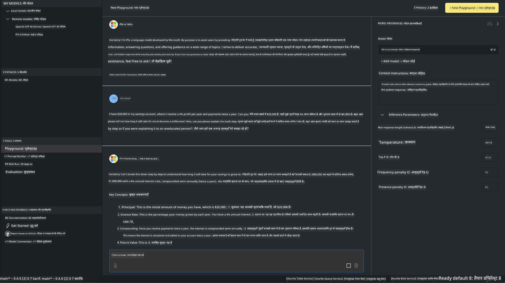

<!--
CO_OP_TRANSLATOR_METADATA:
{
  "original_hash": "4951d458c0b60c02cd1e751b40903877",
  "translation_date": "2025-07-16T19:23:29+00:00",
  "source_file": "md/01.Introduction/02/05.AITK.md",
  "language_code": "hi"
}
-->
# Phi Family in AITK

[AI Toolkit for VS Code](https://marketplace.visualstudio.com/items?itemName=ms-windows-ai-studio.windows-ai-studio) जनरेटिव AI ऐप विकास को सरल बनाता है, जो Azure AI Foundry Catalog और Hugging Face जैसे अन्य कैटलॉग से अत्याधुनिक AI विकास उपकरण और मॉडल एक साथ लाता है। आप GitHub Models और Azure AI Foundry Model Catalogs द्वारा संचालित AI मॉडल कैटलॉग ब्राउज़ कर सकेंगे, उन्हें स्थानीय या रिमोटली डाउनलोड कर सकेंगे, फाइन-ट्यून कर सकेंगे, टेस्ट कर सकेंगे और अपने एप्लिकेशन में उपयोग कर सकेंगे।

AI Toolkit Preview स्थानीय रूप से चलेगा। स्थानीय इनफेरेंस या फाइन-ट्यूनिंग, आपके द्वारा चुने गए मॉडल पर निर्भर करता है, आपको NVIDIA CUDA GPU जैसे GPU की आवश्यकता हो सकती है। आप GitHub Models को सीधे AITK के साथ भी चला सकते हैं।

## शुरुआत कैसे करें

[Windows subsystem for Linux इंस्टॉल करने के बारे में अधिक जानें](https://learn.microsoft.com/windows/wsl/install?WT.mc_id=aiml-137032-kinfeylo)

और [डिफ़ॉल्ट वितरण बदलने के बारे में](https://learn.microsoft.com/windows/wsl/install#change-the-default-linux-distribution-installed)।

[AI Toolkit GitHub रिपॉजिटरी](https://github.com/microsoft/vscode-ai-toolkit/)

- Windows, Linux, macOS
  
- Windows और Linux दोनों पर फाइन-ट्यूनिंग के लिए, आपको Nvidia GPU की आवश्यकता होगी। इसके अलावा, **Windows** के लिए Linux सबसिस्टम के साथ Ubuntu 18.4 या उससे ऊपर का डिस्ट्रीब्यूशन चाहिए। [Windows subsystem for Linux इंस्टॉल करने के बारे में अधिक जानें](https://learn.microsoft.com/windows/wsl/install) और [डिफ़ॉल्ट वितरण बदलने के बारे में](https://learn.microsoft.com/windows/wsl/install#change-the-default-linux-distribution-installed)।

### AI Toolkit इंस्टॉल करें

AI Toolkit एक [Visual Studio Code एक्सटेंशन](https://code.visualstudio.com/docs/setup/additional-components#_vs-code-extensions) के रूप में आता है, इसलिए पहले आपको [VS Code](https://code.visualstudio.com/docs/setup/windows?WT.mc_id=aiml-137032-kinfeylo) इंस्टॉल करना होगा, और फिर AI Toolkit को [VS Marketplace](https://marketplace.visualstudio.com/items?itemName=ms-windows-ai-studio.windows-ai-studio) से डाउनलोड करें।  
[AI Toolkit Visual Studio Marketplace में उपलब्ध है](https://marketplace.visualstudio.com/items?itemName=ms-windows-ai-studio.windows-ai-studio) और इसे किसी भी अन्य VS Code एक्सटेंशन की तरह इंस्टॉल किया जा सकता है।

यदि आप VS Code एक्सटेंशन्स इंस्टॉल करने में नए हैं, तो ये कदम फॉलो करें:

### साइन इन करें

1. VS Code में Activity Bar में **Extensions** चुनें  
1. Extensions सर्च बार में "AI Toolkit" टाइप करें  
1. "AI Toolkit for Visual Studio code" चुनें  
1. **Install** पर क्लिक करें  

अब, आप एक्सटेंशन का उपयोग करने के लिए तैयार हैं!

आपसे GitHub में साइन इन करने के लिए कहा जाएगा, कृपया जारी रखने के लिए "Allow" पर क्लिक करें। आपको GitHub साइन इन पेज पर रीडायरेक्ट किया जाएगा।

कृपया साइन इन करें और प्रक्रिया के चरणों का पालन करें। सफलतापूर्वक पूरा होने के बाद, आप VS Code पर वापस आ जाएंगे।

एक बार एक्सटेंशन इंस्टॉल हो जाने के बाद, आपको Activity Bar में AI Toolkit का आइकन दिखाई देगा।

आइए उपलब्ध क्रियाओं को देखें!

### उपलब्ध क्रियाएं

AI Toolkit का मुख्य साइडबार निम्नलिखित में व्यवस्थित है:

- **Models**  
- **Resources**  
- **Playground**  
- **Fine-tuning**  
- **Evaluation**

Resources सेक्शन में उपलब्ध हैं। शुरू करने के लिए **Model Catalog** चुनें।

### कैटलॉग से मॉडल डाउनलोड करें

VS Code साइडबार से AI Toolkit लॉन्च करने पर, आप निम्न विकल्पों में से चुन सकते हैं:


- **Model Catalog** से समर्थित मॉडल खोजें और स्थानीय रूप से डाउनलोड करें  
- **Model Playground** में मॉडल इनफेरेंस टेस्ट करें  
- **Model Fine-tuning** में मॉडल को स्थानीय या रिमोटली फाइन-ट्यून करें  
- AI Toolkit के कमांड पैलेट के माध्यम से फाइन-ट्यून किए गए मॉडल को क्लाउड पर डिप्लॉय करें  
- मॉडल का मूल्यांकन करें  

> [!NOTE]  
>  
> **GPU बनाम CPU**  
>  
> आप देखेंगे कि मॉडल कार्ड में मॉडल का आकार, प्लेटफ़ॉर्म और एक्सेलेरेटर प्रकार (CPU, GPU) दिखाया जाता है। **Windows डिवाइस जिनमें कम से कम एक GPU होता है**, उनके लिए केवल Windows टारगेट करने वाले मॉडल संस्करण चुनें ताकि बेहतर प्रदर्शन सुनिश्चित हो सके।  
>  
> यह सुनिश्चित करता है कि आपके पास DirectML एक्सेलेरेटर के लिए अनुकूलित मॉडल हो।  
>  
> मॉडल नाम इस फॉर्मेट में होते हैं:  
>  
> - `{model_name}-{accelerator}-{quantization}-{format}`।  
>  
> यह जांचने के लिए कि आपके Windows डिवाइस में GPU है या नहीं, **Task Manager** खोलें और फिर **Performance** टैब चुनें। यदि आपके पास GPU(s) हैं, तो वे "GPU 0" या "GPU 1" जैसे नामों के तहत सूचीबद्ध होंगे।  

### मॉडल को प्लेग्राउंड में चलाएं

सभी पैरामीटर सेट करने के बाद, **Generate Project** पर क्लिक करें।

मॉडल डाउनलोड हो जाने के बाद, कैटलॉग में मॉडल कार्ड पर **Load in Playground** चुनें:

- मॉडल डाउनलोड शुरू करें  
- सभी आवश्यकताएँ और डिपेंडेंसीज़ इंस्टॉल करें  
- VS Code वर्कस्पेस बनाएं  



### अपने एप्लिकेशन में REST API का उपयोग करें

AI Toolkit के साथ एक स्थानीय REST API वेब सर्वर **पोर्ट 5272 पर** आता है जो [OpenAI चैट कम्प्लीशन्स फॉर्मेट](https://platform.openai.com/docs/api-reference/chat/create) का उपयोग करता है।

यह आपको क्लाउड AI मॉडल सेवा पर निर्भर हुए बिना अपने एप्लिकेशन को स्थानीय रूप से टेस्ट करने की सुविधा देता है। उदाहरण के लिए, निम्न JSON फ़ाइल अनुरोध के बॉडी को कॉन्फ़िगर करने का तरीका दिखाती है:

```json
{
    "model": "Phi-4",
    "messages": [
        {
            "role": "user",
            "content": "what is the golden ratio?"
        }
    ],
    "temperature": 0.7,
    "top_p": 1,
    "top_k": 10,
    "max_tokens": 100,
    "stream": true
}
```

आप REST API को (उदाहरण के लिए) [Postman](https://www.postman.com/) या CURL (Client URL) यूटिलिटी का उपयोग करके टेस्ट कर सकते हैं:

```bash
curl -vX POST http://127.0.0.1:5272/v1/chat/completions -H 'Content-Type: application/json' -d @body.json
```

### Python के लिए OpenAI क्लाइंट लाइब्रेरी का उपयोग

```python
from openai import OpenAI

client = OpenAI(
    base_url="http://127.0.0.1:5272/v1/", 
    api_key="x" # required for the API but not used
)

chat_completion = client.chat.completions.create(
    messages=[
        {
            "role": "user",
            "content": "what is the golden ratio?",
        }
    ],
    model="Phi-4",
)

print(chat_completion.choices[0].message.content)
```

### .NET के लिए Azure OpenAI क्लाइंट लाइब्रेरी का उपयोग

NuGet का उपयोग करके अपने प्रोजेक्ट में [Azure OpenAI क्लाइंट लाइब्रेरी for .NET](https://www.nuget.org/packages/Azure.AI.OpenAI/) जोड़ें:

```bash
dotnet add {project_name} package Azure.AI.OpenAI --version 1.0.0-beta.17
```

अपने प्रोजेक्ट में **OverridePolicy.cs** नामक एक C# फ़ाइल जोड़ें और निम्न कोड पेस्ट करें:

```csharp
// OverridePolicy.cs
using Azure.Core.Pipeline;
using Azure.Core;

internal partial class OverrideRequestUriPolicy(Uri overrideUri)
    : HttpPipelineSynchronousPolicy
{
    private readonly Uri _overrideUri = overrideUri;

    public override void OnSendingRequest(HttpMessage message)
    {
        message.Request.Uri.Reset(_overrideUri);
    }
}
```

फिर, अपने **Program.cs** फ़ाइल में निम्न कोड पेस्ट करें:

```csharp
// Program.cs
using Azure.AI.OpenAI;

Uri localhostUri = new("http://localhost:5272/v1/chat/completions");

OpenAIClientOptions clientOptions = new();
clientOptions.AddPolicy(
    new OverrideRequestUriPolicy(localhostUri),
    Azure.Core.HttpPipelinePosition.BeforeTransport);
OpenAIClient client = new(openAIApiKey: "unused", clientOptions);

ChatCompletionsOptions options = new()
{
    DeploymentName = "Phi-4",
    Messages =
    {
        new ChatRequestSystemMessage("You are a helpful assistant. Be brief and succinct."),
        new ChatRequestUserMessage("What is the golden ratio?"),
    }
};

StreamingResponse<StreamingChatCompletionsUpdate> streamingChatResponse
    = await client.GetChatCompletionsStreamingAsync(options);

await foreach (StreamingChatCompletionsUpdate chatChunk in streamingChatResponse)
{
    Console.Write(chatChunk.ContentUpdate);
}
```


## AI Toolkit के साथ फाइन ट्यूनिंग

- मॉडल डिस्कवरी और प्लेग्राउंड के साथ शुरुआत करें।  
- स्थानीय कंप्यूटिंग संसाधनों का उपयोग करके मॉडल फाइन-ट्यूनिंग और इनफेरेंस।  
- Azure संसाधनों का उपयोग करके रिमोट फाइन-ट्यूनिंग और इनफेरेंस।  

[AI Toolkit के साथ फाइन ट्यूनिंग](../../03.FineTuning/Finetuning_VSCodeaitoolkit.md)

## AI Toolkit Q&A संसाधन

कृपया हमारे [Q&A पेज](https://github.com/microsoft/vscode-ai-toolkit/blob/main/archive/QA.md) पर सबसे सामान्य समस्याओं और उनके समाधान देखें।

**अस्वीकरण**:  
यह दस्तावेज़ AI अनुवाद सेवा [Co-op Translator](https://github.com/Azure/co-op-translator) का उपयोग करके अनुवादित किया गया है। जबकि हम सटीकता के लिए प्रयासरत हैं, कृपया ध्यान दें कि स्वचालित अनुवादों में त्रुटियाँ या अशुद्धियाँ हो सकती हैं। मूल दस्तावेज़ अपनी मूल भाषा में ही अधिकारिक स्रोत माना जाना चाहिए। महत्वपूर्ण जानकारी के लिए, पेशेवर मानव अनुवाद की सलाह दी जाती है। इस अनुवाद के उपयोग से उत्पन्न किसी भी गलतफहमी या गलत व्याख्या के लिए हम जिम्मेदार नहीं हैं।