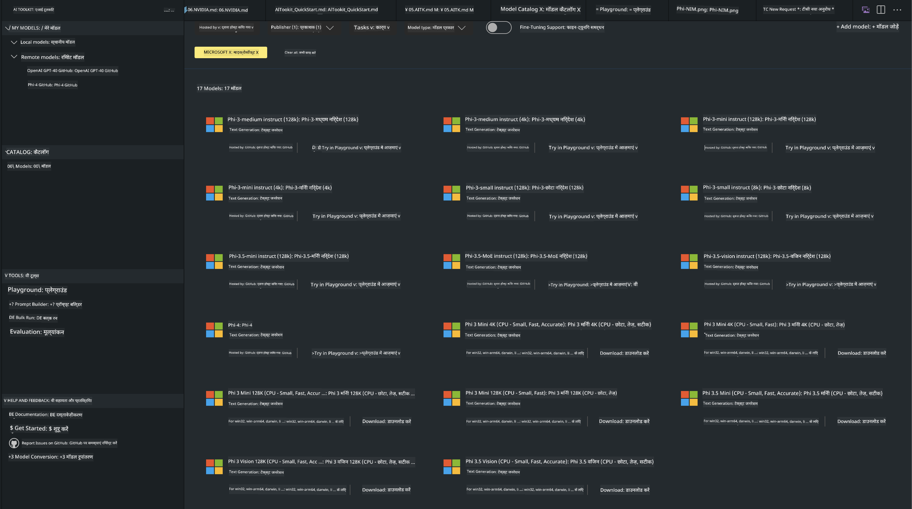

<!--
CO_OP_TRANSLATOR_METADATA:
{
  "original_hash": "4951d458c0b60c02cd1e751b40903877",
  "translation_date": "2025-05-08T06:20:29+00:00",
  "source_file": "md/01.Introduction/02/05.AITK.md",
  "language_code": "hi"
}
-->
# Phi Family in AITK

[AI Toolkit for VS Code](https://marketplace.visualstudio.com/items?itemName=ms-windows-ai-studio.windows-ai-studio) जनरेटिव AI ऐप डेवलपमेंट को आसान बनाता है, जिसमें Azure AI Foundry Catalog और Hugging Face जैसे अन्य कैटलॉग से नवीनतम AI टूल्स और मॉडल एक साथ लाए गए हैं। आप GitHub Models और Azure AI Foundry Model Catalogs द्वारा संचालित AI मॉडल कैटलॉग ब्राउज़ कर सकते हैं, उन्हें लोकली या रिमोटली डाउनलोड कर सकते हैं, फाइन-ट्यून कर सकते हैं, टेस्ट कर सकते हैं और अपने एप्लिकेशन में उपयोग कर सकते हैं।

AI Toolkit Preview लोकली चलेगा। लोकल इनफेरेंस या फाइन-ट्यून मॉडल पर निर्भर करता है, जिसे आपने चुना है, आपको NVIDIA CUDA GPU जैसे GPU की जरूरत हो सकती है। आप GitHub Models को सीधे AITK के साथ भी चला सकते हैं।

## Getting Started

[जानिए कैसे Windows subsystem for Linux इंस्टॉल करें](https://learn.microsoft.com/windows/wsl/install?WT.mc_id=aiml-137032-kinfeylo)

और [डिफ़ॉल्ट डिस्ट्रीब्यूशन कैसे बदलें](https://learn.microsoft.com/windows/wsl/install#change-the-default-linux-distribution-installed)।

[AI Tooklit GitHub Repo](https://github.com/microsoft/vscode-ai-toolkit/)

- Windows, Linux, macOS
  
- Windows और Linux दोनों पर फाइनट्यूनिंग के लिए, आपको Nvidia GPU की जरूरत होगी। साथ ही, **Windows** के लिए Ubuntu डिस्ट्रीब्यूशन 18.4 या उससे ऊपर के साथ Linux सबसिस्टम चाहिए। [जानिए कैसे Windows subsystem for Linux इंस्टॉल करें](https://learn.microsoft.com/windows/wsl/install) और [डिफ़ॉल्ट डिस्ट्रीब्यूशन कैसे बदलें](https://learn.microsoft.com/windows/wsl/install#change-the-default-linux-distribution-installed)।

### AI Toolkit इंस्टॉल करें

AI Toolkit [Visual Studio Code Extension](https://code.visualstudio.com/docs/setup/additional-components#_vs-code-extensions) के रूप में आता है, इसलिए पहले आपको [VS Code](https://code.visualstudio.com/docs/setup/windows?WT.mc_id=aiml-137032-kinfeylo) इंस्टॉल करना होगा, फिर AI Toolkit को [VS Marketplace](https://marketplace.visualstudio.com/items?itemName=ms-windows-ai-studio.windows-ai-studio) से डाउनलोड करें।  
[AI Toolkit Visual Studio Marketplace में उपलब्ध है](https://marketplace.visualstudio.com/items?itemName=ms-windows-ai-studio.windows-ai-studio) और इसे किसी भी अन्य VS Code एक्सटेंशन की तरह इंस्टॉल किया जा सकता है।

अगर आप VS Code एक्सटेंशन्स इंस्टॉल करने में नए हैं, तो ये स्टेप्स फॉलो करें:

### Sign In

1. VS Code में Activity Bar से **Extensions** चुनें  
1. Extensions Search बार में "AI Toolkit" टाइप करें  
1. "AI Toolkit for Visual Studio code" चुनें  
1. **Install** पर क्लिक करें  

अब, आप एक्सटेंशन इस्तेमाल करने के लिए तैयार हैं!

आपसे GitHub में साइन इन करने के लिए कहा जाएगा, कृपया "Allow" पर क्लिक करें। आप GitHub साइनिंग पेज पर रीडायरेक्ट होंगे।

साइन इन करें और प्रक्रिया पूरी करें। सफलतापूर्वक पूरा होने पर आप VS Code पर वापस आ जाएंगे।

एक्सटेंशन इंस्टॉल होने के बाद, AI Toolkit का आइकन आपके Activity Bar में दिखाई देगा।

चलो उपलब्ध विकल्पों को एक्सप्लोर करें!

### उपलब्ध विकल्प

AI Toolkit का मुख्य साइडबार इस प्रकार व्यवस्थित है:  

- **Models**  
- **Resources**  
- **Playground**  
- **Fine-tuning**  
- **Evaluation**

Resources सेक्शन में उपलब्ध हैं। शुरू करने के लिए **Model Catalog** चुनें।

### कैटलॉग से मॉडल डाउनलोड करें

VS Code साइडबार से AI Toolkit लॉन्च करने पर आप निम्न विकल्प चुन सकते हैं:



- **Model Catalog** से समर्थित मॉडल खोजें और लोकली डाउनलोड करें  
- **Model Playground** में मॉडल इनफेरेंस टेस्ट करें  
- **Model Fine-tuning** में मॉडल लोकली या रिमोटली फाइन-ट्यून करें  
- AI Toolkit के कमांड पैलेट के जरिए क्लाउड पर फाइन-ट्यून किए मॉडल डिप्लॉय करें  
- मॉडल का मूल्यांकन करें  

> [!NOTE]
>
> **GPU Vs CPU**
>
> आप देखेंगे कि मॉडल कार्ड पर मॉडल का साइज, प्लेटफ़ॉर्म और एक्सेलेरेटर टाइप (CPU, GPU) दिखाया जाता है। **Windows डिवाइसेस जिनमें कम से कम एक GPU होता है** उनके लिए, ऐसे मॉडल वर्शन चुनें जो केवल Windows के लिए ऑप्टिमाइज़्ड हों।  
>
> इससे आपको DirectML एक्सेलेरेटर के लिए ऑप्टिमाइज़्ड मॉडल मिलेगा।  
>
> मॉडल नाम इस फॉर्मेट में होते हैं:  
>
> - `{model_name}-{accelerator}-{quantization}-{format}`।  
>
> यह जांचने के लिए कि आपके Windows डिवाइस में GPU है या नहीं, **Task Manager** खोलें और **Performance** टैब चुनें। अगर GPU हैं, तो वे "GPU 0" या "GPU 1" जैसे नामों के तहत दिखेंगे।

### मॉडल को प्लेग्राउंड में चलाएं

सभी पैरामीटर सेट करने के बाद, **Generate Project** पर क्लिक करें।

मॉडल डाउनलोड हो जाने के बाद, कैटलॉग में मॉडल कार्ड पर **Load in Playground** चुनें:

- मॉडल डाउनलोड शुरू करें  
- सभी आवश्यक प्रीरेक्विज़िट्स और डिपेंडेंसीज इंस्टॉल करें  
- VS Code वर्कस्पेस बनाएं  


### अपने एप्लिकेशन में REST API का उपयोग करें

AI Toolkit एक लोकल REST API वेब सर्वर के साथ आता है जो **पोर्ट 5272** पर चलता है और [OpenAI chat completions फॉर्मेट](https://platform.openai.com/docs/api-reference/chat/create) का उपयोग करता है।

इससे आप अपने एप्लिकेशन को लोकली टेस्ट कर सकते हैं बिना क्लाउड AI मॉडल सेवा पर निर्भर हुए। उदाहरण के लिए, निम्न JSON फाइल दिखाती है कि रिक्वेस्ट बॉडी कैसे कॉन्फ़िगर करें:

```json
{
    "model": "Phi-4",
    "messages": [
        {
            "role": "user",
            "content": "what is the golden ratio?"
        }
    ],
    "temperature": 0.7,
    "top_p": 1,
    "top_k": 10,
    "max_tokens": 100,
    "stream": true
}
```

आप REST API को (जैसे) [Postman](https://www.postman.com/) या CURL (Client URL) यूटिलिटी से टेस्ट कर सकते हैं:

```bash
curl -vX POST http://127.0.0.1:5272/v1/chat/completions -H 'Content-Type: application/json' -d @body.json
```

### Python के लिए OpenAI क्लाइंट लाइब्रेरी का उपयोग

```python
from openai import OpenAI

client = OpenAI(
    base_url="http://127.0.0.1:5272/v1/", 
    api_key="x" # required for the API but not used
)

chat_completion = client.chat.completions.create(
    messages=[
        {
            "role": "user",
            "content": "what is the golden ratio?",
        }
    ],
    model="Phi-4",
)

print(chat_completion.choices[0].message.content)
```

### .NET के लिए Azure OpenAI क्लाइंट लाइब्रेरी का उपयोग

NuGet के माध्यम से अपने प्रोजेक्ट में [Azure OpenAI क्लाइंट लाइब्रेरी फॉर .NET](https://www.nuget.org/packages/Azure.AI.OpenAI/) जोड़ें:

```bash
dotnet add {project_name} package Azure.AI.OpenAI --version 1.0.0-beta.17
```

अपने प्रोजेक्ट में एक C# फाइल **OverridePolicy.cs** जोड़ें और निम्न कोड पेस्ट करें:

```csharp
// OverridePolicy.cs
using Azure.Core.Pipeline;
using Azure.Core;

internal partial class OverrideRequestUriPolicy(Uri overrideUri)
    : HttpPipelineSynchronousPolicy
{
    private readonly Uri _overrideUri = overrideUri;

    public override void OnSendingRequest(HttpMessage message)
    {
        message.Request.Uri.Reset(_overrideUri);
    }
}
```

फिर अपने **Program.cs** फाइल में निम्न कोड पेस्ट करें:

```csharp
// Program.cs
using Azure.AI.OpenAI;

Uri localhostUri = new("http://localhost:5272/v1/chat/completions");

OpenAIClientOptions clientOptions = new();
clientOptions.AddPolicy(
    new OverrideRequestUriPolicy(localhostUri),
    Azure.Core.HttpPipelinePosition.BeforeTransport);
OpenAIClient client = new(openAIApiKey: "unused", clientOptions);

ChatCompletionsOptions options = new()
{
    DeploymentName = "Phi-4",
    Messages =
    {
        new ChatRequestSystemMessage("You are a helpful assistant. Be brief and succinct."),
        new ChatRequestUserMessage("What is the golden ratio?"),
    }
};

StreamingResponse<StreamingChatCompletionsUpdate> streamingChatResponse
    = await client.GetChatCompletionsStreamingAsync(options);

await foreach (StreamingChatCompletionsUpdate chatChunk in streamingChatResponse)
{
    Console.Write(chatChunk.ContentUpdate);
}
```

## AI Toolkit के साथ Fine Tuning

- मॉडल डिस्कवरी और प्लेग्राउंड से शुरुआत करें।  
- लोकल कंप्यूटिंग रिसोर्सेज का उपयोग करके मॉडल फाइन-ट्यूनिंग और इनफेरेंस करें।  
- Azure रिसोर्सेज के साथ रिमोट फाइन-ट्यूनिंग और इनफेरेंस करें।

[Fine Tuning with AI Toolkit](../../03.FineTuning/Finetuning_VSCodeaitoolkit.md)

## AI Toolkit Q&A संसाधन

अधिकतर सामान्य समस्याओं और उनके समाधान के लिए कृपया हमारे [Q&A पेज](https://github.com/microsoft/vscode-ai-toolkit/blob/main/archive/QA.md) देखें।

**अस्वीकरण**:  
इस दस्तावेज़ का अनुवाद AI अनुवाद सेवा [Co-op Translator](https://github.com/Azure/co-op-translator) का उपयोग करके किया गया है। जबकि हम सटीकता के लिए प्रयासरत हैं, कृपया ध्यान दें कि स्वचालित अनुवादों में त्रुटियाँ या असंगतियाँ हो सकती हैं। मूल दस्तावेज़ अपनी मूल भाषा में ही प्रामाणिक स्रोत माना जाना चाहिए। महत्वपूर्ण जानकारी के लिए, पेशेवर मानव अनुवाद की सलाह दी जाती है। इस अनुवाद के उपयोग से उत्पन्न किसी भी गलतफहमी या गलत व्याख्या के लिए हम उत्तरदायी नहीं हैं।