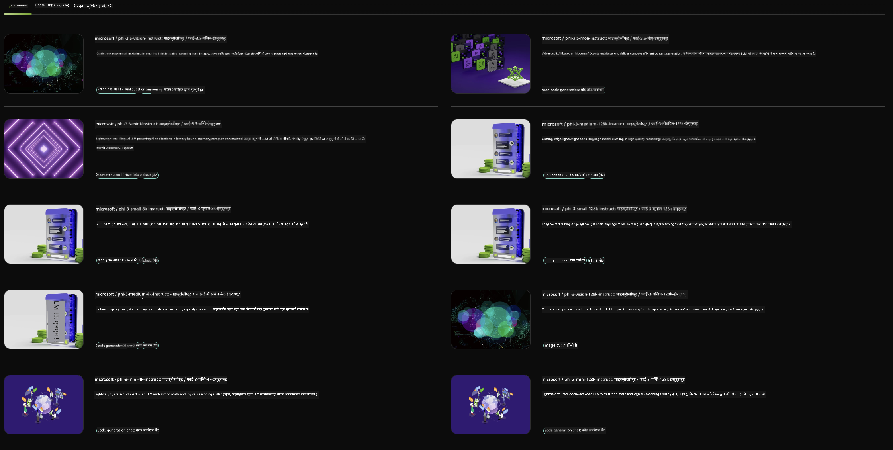

<!--
CO_OP_TRANSLATOR_METADATA:
{
  "original_hash": "7b08e277df2a9307f861ae54bc30c772",
  "translation_date": "2025-05-08T06:22:59+00:00",
  "source_file": "md/01.Introduction/02/06.NVIDIA.md",
  "language_code": "hi"
}
-->
## NVIDIA NIM में Phi परिवार

NVIDIA NIM माइक्रोसर्विसेज़ का एक सेट है जिसे जेनरेटिव AI मॉडल्स को क्लाउड, डेटा सेंटर और वर्कस्टेशन्स में तेजी से डिप्लॉय करने के लिए आसान बनाया गया है। NIM मॉडल परिवार और प्रति मॉडल आधार पर वर्गीकृत होते हैं। उदाहरण के लिए, बड़े भाषा मॉडल्स (LLMs) के लिए NVIDIA NIM, उन्नत LLMs की शक्ति को एंटरप्राइज एप्लिकेशन में लाता है, जो बेहतरीन प्राकृतिक भाषा प्रसंस्करण और समझ क्षमताएं प्रदान करता है।

NIM IT और DevOps टीमों के लिए अपने मैनेज्ड वातावरण में बड़े भाषा मॉडल्स (LLMs) को सेल्फ-होस्ट करना आसान बनाता है, साथ ही डेवलपर्स को उद्योग मानक API भी देता है जिससे वे शक्तिशाली copilots, चैटबॉट्स और AI असिस्टेंट बना सकते हैं जो उनके व्यवसाय को बदल सकते हैं। NVIDIA की अत्याधुनिक GPU एक्सेलेरेशन और स्केलेबल डिप्लॉयमेंट का उपयोग करते हुए, NIM बेहतरीन प्रदर्शन के साथ सबसे तेज़ इनफेरेंस पथ प्रदान करता है।

आप NVIDIA NIM का उपयोग Phi परिवार के मॉडल्स के इनफेरेंस के लिए कर सकते हैं



### **नमूने - NVIDIA NIM में Phi-3-Vision**

कल्पना कीजिए आपके पास एक छवि (`demo.png`) है और आप ऐसा Python कोड जनरेट करना चाहते हैं जो इस छवि को प्रोसेस करे और इसकी एक नई कॉपी (`phi-3-vision.jpg`) सेव करे।

ऊपर दिया गया कोड इस प्रक्रिया को स्वचालित करता है:

1. पर्यावरण और आवश्यक कॉन्फ़िगरेशन सेट करना।
2. ऐसा प्रॉम्प्ट बनाना जो मॉडल को आवश्यक Python कोड जनरेट करने का निर्देश दे।
3. प्रॉम्प्ट को मॉडल को भेजना और जनरेट किया गया कोड प्राप्त करना।
4. जनरेट किए गए कोड को निकालना और चलाना।
5. मूल और प्रोसेस की गई छवियों को दिखाना।

यह तरीका AI की शक्ति का उपयोग करके इमेज प्रोसेसिंग कार्यों को स्वचालित बनाता है, जिससे आपके लक्ष्य प्राप्त करना आसान और तेज़ हो जाता है।

[Sample Code Solution](../../../../../code/06.E2E/E2E_Nvidia_NIM_Phi3_Vision.ipynb)

आइए पूरे कोड को चरण दर चरण समझते हैं:

1. **आवश्यक पैकेज इंस्टॉल करें**:
    ```python
    !pip install langchain_nvidia_ai_endpoints -U
    ```  
    यह कमांड `langchain_nvidia_ai_endpoints` पैकेज को इंस्टॉल करता है, यह सुनिश्चित करते हुए कि यह नवीनतम संस्करण हो।

2. **जरूरी मॉड्यूल इम्पोर्ट करें**:
    ```python
    from langchain_nvidia_ai_endpoints import ChatNVIDIA
    import getpass
    import os
    import base64
    ```  
    ये इम्पोर्ट्स NVIDIA AI एंडपॉइंट्स से इंटरैक्ट करने, पासवर्ड सुरक्षित रखने, ऑपरेटिंग सिस्टम से जुड़ने और बेस64 फॉर्मेट में डेटा एन्कोड/डिकोड करने के लिए आवश्यक मॉड्यूल लाते हैं।

3. **API की सेट करें**:
    ```python
    if not os.getenv("NVIDIA_API_KEY"):
        os.environ["NVIDIA_API_KEY"] = getpass.getpass("Enter your NVIDIA API key: ")
    ```  
    यह कोड चेक करता है कि `NVIDIA_API_KEY` एन्वायरनमेंट वेरिएबल सेट है या नहीं। अगर नहीं, तो यह यूजर से सुरक्षित तरीके से API की दर्ज करने को कहता है।

4. **मॉडल और इमेज पाथ डिफाइन करें**:
    ```python
    model = 'microsoft/phi-3-vision-128k-instruct'
    chat = ChatNVIDIA(model=model)
    img_path = './imgs/demo.png'
    ```  
    यह उपयोग किए जाने वाले मॉडल को सेट करता है, `ChatNVIDIA` का एक इंस्टेंस बनाता है, और इमेज फाइल का पाथ बताता है।

5. **टेक्स्ट प्रॉम्प्ट बनाएं**:
    ```python
    text = "Please create Python code for image, and use plt to save the new picture under imgs/ and name it phi-3-vision.jpg."
    ```  
    यह एक टेक्स्ट प्रॉम्प्ट डिफाइन करता है जो मॉडल को इमेज प्रोसेसिंग के लिए Python कोड जनरेट करने का निर्देश देता है।

6. **इमेज को बेस64 में एन्कोड करें**:
    ```python
    with open(img_path, "rb") as f:
        image_b64 = base64.b64encode(f.read()).decode()
    image = f''
    ```  
    यह कोड इमेज फाइल पढ़ता है, उसे बेस64 में एन्कोड करता है, और एन्कोडेड डेटा के साथ एक HTML इमेज टैग बनाता है।

7. **टेक्स्ट और इमेज को प्रॉम्प्ट में मिलाएं**:
    ```python
    prompt = f"{text} {image}"
    ```  
    यह टेक्स्ट प्रॉम्प्ट और HTML इमेज टैग को एक स्ट्रिंग में जोड़ता है।

8. **ChatNVIDIA का उपयोग कर कोड जनरेट करें**:
    ```python
    code = ""
    for chunk in chat.stream(prompt):
        print(chunk.content, end="")
        code += chunk.content
    ```  
    यह कोड प्रॉम्प्ट को `ChatNVIDIA` model and collects the generated code in chunks, printing and appending each chunk to the `code` स्ट्रिंग को भेजता है।

9. **जनरेट किए गए कंटेंट से Python कोड निकालें**:
    ```python
    begin = code.index('```python') + 9  
    code = code[begin:]  
    end = code.index('```')
    code = code[:end]
    ```  
    यह मार्कडाउन फॉर्मेटिंग हटाकर जनरेट किए गए कंटेंट से वास्तविक Python कोड निकालता है।

10. **जनरेट किए गए कोड को चलाएं**:
    ```python
    import subprocess
    result = subprocess.run(["python", "-c", code], capture_output=True)
    ```  
    यह निकाले गए Python कोड को एक सबप्रोसेस के रूप में चलाता है और उसका आउटपुट कैप्चर करता है।

11. **इमेज दिखाएं**:
    ```python
    from IPython.display import Image, display
    display(Image(filename='./imgs/phi-3-vision.jpg'))
    display(Image(filename='./imgs/demo.png'))
    ```  
    ये लाइनें `IPython.display` मॉड्यूल का उपयोग करके इमेजेज़ को दिखाती हैं।

**अस्वीकरण**:  
यह दस्तावेज़ AI अनुवाद सेवा [Co-op Translator](https://github.com/Azure/co-op-translator) का उपयोग करके अनुवादित किया गया है। जबकि हम सटीकता के लिए प्रयासरत हैं, कृपया ध्यान दें कि स्वचालित अनुवादों में त्रुटियाँ या गलतियाँ हो सकती हैं। मूल दस्तावेज़ अपनी मूल भाषा में प्रामाणिक स्रोत माना जाना चाहिए। महत्वपूर्ण जानकारी के लिए, पेशेवर मानव अनुवाद की सलाह दी जाती है। इस अनुवाद के उपयोग से उत्पन्न किसी भी गलतफहमी या गलत व्याख्या के लिए हम जिम्मेदार नहीं हैं।