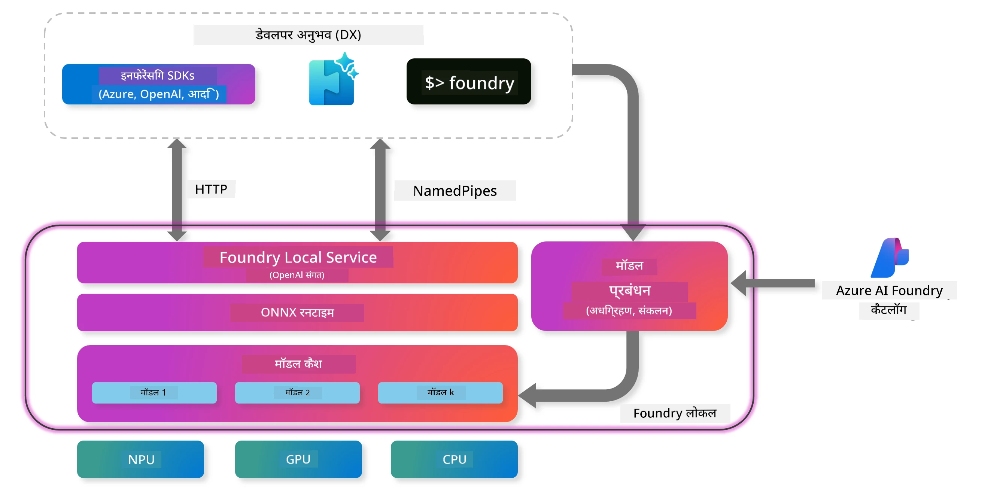
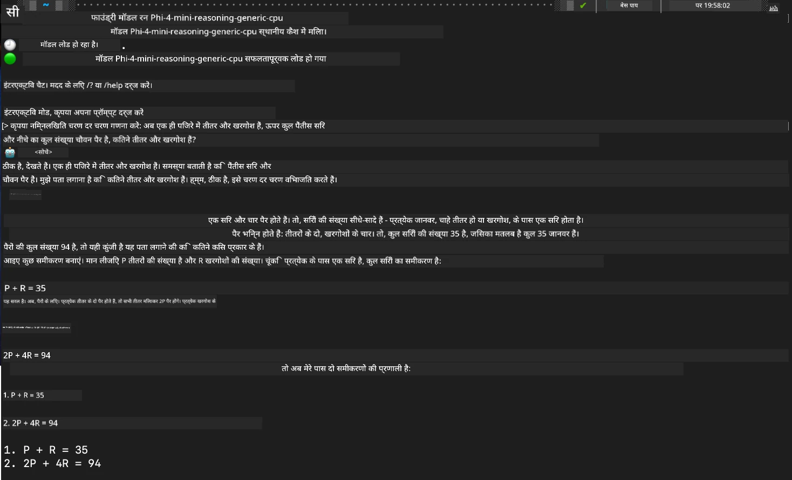

<!--
CO_OP_TRANSLATOR_METADATA:
{
  "original_hash": "52973a5680a65a810aa80b7036afd31f",
  "translation_date": "2025-07-16T19:44:21+00:00",
  "source_file": "md/01.Introduction/02/07.FoundryLocal.md",
  "language_code": "hi"
}
-->
## Foundry Local में Phi-Family मॉडल के साथ शुरुआत

### Foundry Local का परिचय

Foundry Local एक शक्तिशाली ऑन-डिवाइस AI इन्फरेंस समाधान है जो एंटरप्राइज-ग्रेड AI क्षमताओं को सीधे आपके स्थानीय हार्डवेयर पर लाता है। यह ट्यूटोरियल आपको Foundry Local के साथ Phi-Family मॉडल सेटअप और उपयोग करने में मार्गदर्शन करेगा, जिससे आप अपनी AI वर्कलोड पर पूर्ण नियंत्रण रख सकेंगे, साथ ही गोपनीयता बनी रहेगी और लागत कम होगी।

Foundry Local आपके डिवाइस पर AI मॉडल को लोकली चलाकर प्रदर्शन, गोपनीयता, कस्टमाइजेशन और लागत में लाभ प्रदान करता है। यह एक सहज CLI, SDK, और REST API के माध्यम से आपके मौजूदा वर्कफ़्लो और एप्लिकेशन में आसानी से एकीकृत हो जाता है।



### Foundry Local क्यों चुनें?

Foundry Local के फायदे समझना आपकी AI तैनाती रणनीति के लिए सही निर्णय लेने में मदद करेगा:

- **ऑन-डिवाइस इन्फरेंस:** अपने हार्डवेयर पर मॉडल लोकली चलाएं, जिससे लागत कम हो और आपका सारा डेटा आपके डिवाइस पर ही सुरक्षित रहे।

- **मॉडल कस्टमाइजेशन:** प्रीसेट मॉडल चुनें या अपनी आवश्यकताओं और उपयोग के मामलों के अनुसार अपने मॉडल का उपयोग करें।

- **लागत प्रभावशीलता:** मौजूदा हार्डवेयर का उपयोग करके क्लाउड सेवा की आवर्ती लागतों को खत्म करें, जिससे AI अधिक सुलभ हो।

- **सहज एकीकरण:** SDK, API एंडपॉइंट्स, या CLI के माध्यम से अपने एप्लिकेशन से कनेक्ट करें, और जरूरत बढ़ने पर Azure AI Foundry पर आसानी से स्केल करें।

> **Getting Started Note:** यह ट्यूटोरियल Foundry Local को CLI और SDK इंटरफेस के माध्यम से उपयोग करने पर केंद्रित है। आप दोनों तरीकों को सीखेंगे ताकि अपने उपयोग के लिए सबसे उपयुक्त तरीका चुन सकें।

## भाग 1: Foundry Local CLI सेटअप

### चरण 1: इंस्टॉलेशन

Foundry Local CLI आपके लिए AI मॉडल को लोकली मैनेज और चलाने का द्वार है। आइए इसे अपने सिस्टम पर इंस्टॉल करें।

**समर्थित प्लेटफॉर्म:** Windows और macOS

विस्तृत इंस्टॉलेशन निर्देशों के लिए कृपया [official Foundry Local documentation](https://github.com/microsoft/Foundry-Local/blob/main/README.md) देखें।

### चरण 2: उपलब्ध मॉडलों का पता लगाना

एक बार Foundry Local CLI इंस्टॉल हो जाने के बाद, आप देख सकते हैं कि आपके उपयोग के लिए कौन-कौन से मॉडल उपलब्ध हैं। यह कमांड सभी समर्थित मॉडलों को दिखाएगा:

```bash
foundry model list
```

### चरण 3: Phi Family मॉडल को समझना

Phi Family विभिन्न उपयोग मामलों और हार्डवेयर कॉन्फ़िगरेशन के लिए अनुकूलित कई मॉडल प्रदान करता है। Foundry Local में उपलब्ध Phi मॉडल निम्नलिखित हैं:

**उपलब्ध Phi मॉडल:**

- **phi-3.5-mini** - बुनियादी कार्यों के लिए कॉम्पैक्ट मॉडल
- **phi-3-mini-128k** - लंबी बातचीत के लिए विस्तारित संदर्भ संस्करण
- **phi-3-mini-4k** - सामान्य उपयोग के लिए मानक संदर्भ मॉडल
- **phi-4** - बेहतर क्षमताओं वाला उन्नत मॉडल
- **phi-4-mini** - Phi-4 का हल्का संस्करण
- **phi-4-mini-reasoning** - जटिल तर्क कार्यों के लिए विशेषीकृत

> **हार्डवेयर संगतता:** प्रत्येक मॉडल को आपके सिस्टम की क्षमताओं के अनुसार विभिन्न हार्डवेयर एक्सेलेरेशन (CPU, GPU) के लिए कॉन्फ़िगर किया जा सकता है।

### चरण 4: अपना पहला Phi मॉडल चलाना

आइए एक व्यावहारिक उदाहरण से शुरू करें। हम `phi-4-mini-reasoning` मॉडल चलाएंगे, जो जटिल समस्याओं को चरण-दर-चरण हल करने में माहिर है।

**मॉडल चलाने का कमांड:**

```bash
foundry model run Phi-4-mini-reasoning-generic-cpu
```

> **पहली बार सेटअप:** जब आप पहली बार कोई मॉडल चलाएंगे, तो Foundry Local इसे अपने आप आपके स्थानीय डिवाइस पर डाउनलोड कर लेगा। डाउनलोड का समय आपके नेटवर्क की गति पर निर्भर करता है, इसलिए प्रारंभिक सेटअप के दौरान कृपया धैर्य रखें।

### चरण 5: मॉडल का वास्तविक समस्या के साथ परीक्षण

अब आइए अपने मॉडल को एक क्लासिक लॉजिक समस्या के साथ टेस्ट करें ताकि देखें कि यह चरण-दर-चरण तर्क कैसे करता है:

**उदाहरण समस्या:**

```txt
Please calculate the following step by step: Now there are pheasants and rabbits in the same cage, there are thirty-five heads on top and ninety-four legs on the bottom, how many pheasants and rabbits are there?
```

**अपेक्षित व्यवहार:** मॉडल इस समस्या को तार्किक चरणों में विभाजित करेगा, यह तथ्य उपयोग करते हुए कि तीतर के 2 पैर होते हैं और खरगोश के 4 पैर, ताकि समीकरणों का समाधान किया जा सके।

**परिणाम:**



## भाग 2: Foundry Local SDK के साथ एप्लिकेशन बनाना

### SDK क्यों उपयोग करें?

जहां CLI परीक्षण और त्वरित इंटरैक्शन के लिए उपयुक्त है, SDK आपको Foundry Local को प्रोग्रामेटिक रूप से अपने एप्लिकेशन में एकीकृत करने की सुविधा देता है। इससे निम्नलिखित संभावनाएं खुलती हैं:

- कस्टम AI-संचालित एप्लिकेशन बनाना
- स्वचालित वर्कफ़्लो बनाना
- मौजूदा सिस्टम में AI क्षमताओं को जोड़ना
- चैटबॉट और इंटरैक्टिव टूल विकसित करना

### समर्थित प्रोग्रामिंग भाषाएँ

Foundry Local कई प्रोग्रामिंग भाषाओं के लिए SDK सपोर्ट प्रदान करता है ताकि आपकी विकास प्राथमिकताओं के अनुरूप हो:

**📦 उपलब्ध SDKs:**

- **C# (.NET):** [SDK Documentation & Examples](https://github.com/microsoft/Foundry-Local/tree/main/sdk/cs)
- **Python:** [SDK Documentation & Examples](https://github.com/microsoft/Foundry-Local/tree/main/sdk/python)
- **JavaScript:** [SDK Documentation & Examples](https://github.com/microsoft/Foundry-Local/tree/main/sdk/js)
- **Rust:** [SDK Documentation & Examples](https://github.com/microsoft/Foundry-Local/tree/main/sdk/rust)

### अगले कदम

1. अपनी विकास पर्यावरण के अनुसार अपनी पसंदीदा SDK चुनें
2. विस्तृत कार्यान्वयन मार्गदर्शिकाओं के लिए SDK-विशिष्ट दस्तावेज़ का पालन करें
3. जटिल एप्लिकेशन बनाने से पहले सरल उदाहरणों से शुरुआत करें
4. प्रत्येक SDK रिपॉजिटरी में उपलब्ध नमूना कोड का अन्वेषण करें

## निष्कर्ष

अब आपने सीख लिया है कि कैसे:
- ✅ Foundry Local CLI इंस्टॉल और सेटअप करें
- ✅ Phi Family मॉडल खोजें और चलाएं
- ✅ वास्तविक दुनिया की समस्याओं के साथ मॉडल का परीक्षण करें
- ✅ एप्लिकेशन विकास के लिए SDK विकल्प समझें

Foundry Local आपके स्थानीय वातावरण में सीधे AI क्षमताएं लाने के लिए एक मजबूत आधार प्रदान करता है, जिससे आपको प्रदर्शन, गोपनीयता, और लागत पर नियंत्रण मिलता है, साथ ही जरूरत पड़ने पर क्लाउड समाधानों पर स्केल करने की लचीलापन भी मिलती है।

**अस्वीकरण**:  
यह दस्तावेज़ AI अनुवाद सेवा [Co-op Translator](https://github.com/Azure/co-op-translator) का उपयोग करके अनुवादित किया गया है। जबकि हम सटीकता के लिए प्रयासरत हैं, कृपया ध्यान दें कि स्वचालित अनुवादों में त्रुटियाँ या अशुद्धियाँ हो सकती हैं। मूल दस्तावेज़ अपनी मूल भाषा में ही अधिकारिक स्रोत माना जाना चाहिए। महत्वपूर्ण जानकारी के लिए, पेशेवर मानव अनुवाद की सलाह दी जाती है। इस अनुवाद के उपयोग से उत्पन्न किसी भी गलतफहमी या गलत व्याख्या के लिए हम जिम्मेदार नहीं हैं।