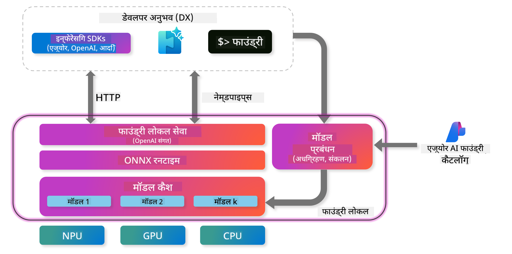
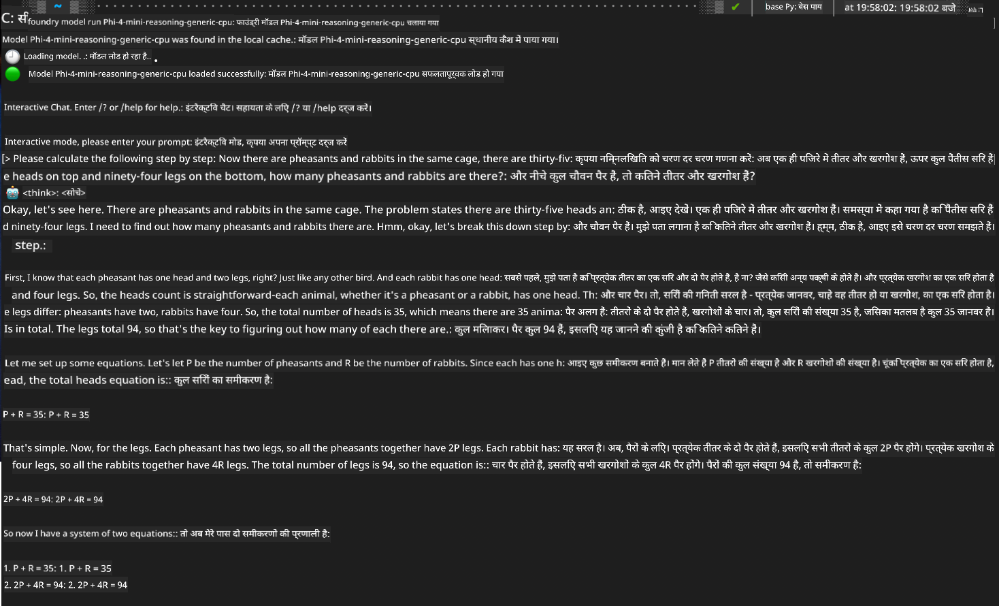

<!--
CO_OP_TRANSLATOR_METADATA:
{
  "original_hash": "52973a5680a65a810aa80b7036afd31f",
  "translation_date": "2025-06-27T13:36:28+00:00",
  "source_file": "md/01.Introduction/02/07.FoundryLocal.md",
  "language_code": "hi"
}
-->
## Foundry Local में Phi-Family मॉडल्स के साथ शुरुआत

### Foundry Local का परिचय

Foundry Local एक शक्तिशाली ऑन-डिवाइस AI इन्फेरेंस समाधान है जो एंटरप्राइज-ग्रेड AI क्षमताओं को सीधे आपके स्थानीय हार्डवेयर पर लाता है। यह ट्यूटोरियल आपको Foundry Local के साथ Phi-Family मॉडल्स सेटअप और उपयोग करने में मार्गदर्शन करेगा, जिससे आपको अपने AI वर्कलोड्स पर पूर्ण नियंत्रण मिलेगा, साथ ही प्राइवेसी बनी रहेगी और लागत कम होगी।

Foundry Local आपके डिवाइस पर AI मॉडल्स को लोकली चलाकर प्रदर्शन, प्राइवेसी, कस्टमाइज़ेशन, और लागत में लाभ प्रदान करता है। यह सहज CLI, SDK, और REST API के माध्यम से आपके मौजूदा वर्कफ़्लोज़ और एप्लिकेशन में आसानी से एकीकृत हो जाता है।




### Foundry Local क्यों चुनें?

Foundry Local के फायदे समझने से आपको अपनी AI तैनाती रणनीति के बारे में सूचित निर्णय लेने में मदद मिलेगी:

- **ऑन-डिवाइस इन्फेरेंस:** अपने हार्डवेयर पर मॉडल्स लोकली चलाएं, जिससे लागत कम होगी और आपका सारा डेटा आपके डिवाइस पर ही रहेगा।

- **मॉडल कस्टमाइज़ेशन:** प्रीसेट मॉडल्स में से चुनें या अपनी जरूरतों और उपयोग मामलों के अनुसार अपने मॉडल का उपयोग करें।

- **लागत प्रभावशीलता:** मौजूदा हार्डवेयर का उपयोग करके क्लाउड सेवा की आवर्ती लागत को खत्म करें, जिससे AI अधिक सुलभ बनता है।

- **सहज एकीकरण:** SDK, API एंडपॉइंट्स या CLI के माध्यम से अपने एप्लिकेशन से कनेक्ट करें, और जरूरत बढ़ने पर Azure AI Foundry पर आसानी से स्केल करें।

> **Getting Started Note:** यह ट्यूटोरियल Foundry Local को CLI और SDK इंटरफेस के माध्यम से उपयोग करने पर केंद्रित है। आप दोनों तरीकों को सीखेंगे ताकि अपने उपयोग के लिए सबसे अच्छा तरीका चुन सकें।

## भाग 1: Foundry Local CLI सेटअप

### चरण 1: इंस्टॉलेशन

Foundry Local CLI आपके लिए AI मॉडल्स को लोकली मैनेज और रन करने का द्वार है। आइए इसे अपने सिस्टम पर इंस्टॉल करके शुरू करें।

**सपोर्टेड प्लेटफ़ॉर्म:** Windows और macOS

विस्तृत इंस्टॉलेशन निर्देशों के लिए कृपया [official Foundry Local documentation](https://github.com/microsoft/Foundry-Local/blob/main/README.md) देखें।

### चरण 2: उपलब्ध मॉडल्स का अन्वेषण

Foundry Local CLI इंस्टॉल होने के बाद, आप देख सकते हैं कि आपके उपयोग के लिए कौन-कौन से मॉडल उपलब्ध हैं। यह कमांड आपको सभी सपोर्टेड मॉडल दिखाएगा:


```bash
foundry model list
```

### चरण 3: Phi Family मॉडल्स को समझना

Phi Family विभिन्न उपयोग मामलों और हार्डवेयर कॉन्फ़िगरेशन के लिए अनुकूलित मॉडल्स की एक श्रृंखला प्रदान करता है। Foundry Local में उपलब्ध Phi मॉडल्स इस प्रकार हैं:

**उपलब्ध Phi मॉडल्स:** 

- **phi-3.5-mini** - बुनियादी कार्यों के लिए कॉम्पैक्ट मॉडल
- **phi-3-mini-128k** - लंबी बातचीत के लिए विस्तारित संदर्भ संस्करण
- **phi-3-mini-4k** - सामान्य उपयोग के लिए स्टैंडर्ड संदर्भ मॉडल
- **phi-4** - उन्नत क्षमताओं वाला मॉडल
- **phi-4-mini** - Phi-4 का हल्का संस्करण
- **phi-4-mini-reasoning** - जटिल तर्क कार्यों के लिए विशेष

> **हार्डवेयर संगतता:** हर मॉडल को आपके सिस्टम की क्षमताओं के अनुसार विभिन्न हार्डवेयर एक्सेलेरेशन (CPU, GPU) के लिए कॉन्फ़िगर किया जा सकता है।

### चरण 4: अपना पहला Phi मॉडल चलाना

आइए एक व्यावहारिक उदाहरण से शुरू करें। हम `phi-4-mini-reasoning` मॉडल चलाएंगे, जो जटिल समस्याओं को चरण-दर-चरण हल करने में सक्षम है।


**मॉडल चलाने का कमांड:**

```bash
foundry model run Phi-4-mini-reasoning-generic-cpu
```

> **पहली बार सेटअप:** जब आप पहली बार कोई मॉडल चलाएंगे, तो Foundry Local उसे स्वचालित रूप से आपके स्थानीय डिवाइस पर डाउनलोड करेगा। डाउनलोड का समय आपके नेटवर्क स्पीड पर निर्भर करता है, इसलिए प्रारंभिक सेटअप के दौरान कृपया धैर्य रखें।

### चरण 5: वास्तविक समस्या के साथ मॉडल का परीक्षण

अब चलिए अपने मॉडल को एक क्लासिक लॉजिक समस्या के साथ टेस्ट करते हैं ताकि देखें कि यह चरण-दर-चरण तर्क कैसे करता है:

**उदाहरण समस्या:**

```txt
Please calculate the following step by step: Now there are pheasants and rabbits in the same cage, there are thirty-five heads on top and ninety-four legs on the bottom, how many pheasants and rabbits are there?
```

**अपेक्षित व्यवहार:** मॉडल को इस समस्या को तार्किक चरणों में विभाजित करना चाहिए, यह उपयोग करते हुए कि तीतर के 2 पैर होते हैं और खरगोश के 4 पैर, ताकि समीकरणों का हल निकाला जा सके।

**परिणाम:**



## भाग 2: Foundry Local SDK के साथ एप्लिकेशन बनाना

### SDK क्यों उपयोग करें?

जहां CLI परीक्षण और त्वरित इंटरैक्शन के लिए उपयुक्त है, वहीं SDK आपको Foundry Local को प्रोग्रामेटिक रूप से अपने एप्लिकेशन में एकीकृत करने की सुविधा देता है। इससे निम्नलिखित संभावनाएं खुलती हैं:

- कस्टम AI-संचालित एप्लिकेशन बनाना
- स्वचालित वर्कफ़्लोज़ तैयार करना
- मौजूदा सिस्टम में AI क्षमताओं को जोड़ना
- चैटबॉट्स और इंटरैक्टिव टूल्स विकसित करना

### सपोर्टेड प्रोग्रामिंग भाषाएँ

Foundry Local आपके विकास के अनुसार कई प्रोग्रामिंग भाषाओं के लिए SDK सपोर्ट प्रदान करता है:

**📦 उपलब्ध SDKs:**

- **C# (.NET):** [SDK Documentation & Examples](https://github.com/microsoft/Foundry-Local/tree/main/sdk/cs)
- **Python:** [SDK Documentation & Examples](https://github.com/microsoft/Foundry-Local/tree/main/sdk/python)
- **JavaScript:** [SDK Documentation & Examples](https://github.com/microsoft/Foundry-Local/tree/main/sdk/js)
- **Rust:** [SDK Documentation & Examples](https://github.com/microsoft/Foundry-Local/tree/main/sdk/rust)

### अगले कदम

1. **अपने विकास वातावरण के अनुसार पसंदीदा SDK चुनें**
2. **SDK-विशिष्ट दस्तावेज़ों का पालन करें** विस्तृत कार्यान्वयन गाइड के लिए
3. **सरल उदाहरणों से शुरुआत करें** फिर जटिल एप्लिकेशन बनाएं
4. **प्रत्येक SDK रिपॉजिटरी में दिए गए नमूना कोड का अन्वेषण करें**

## निष्कर्ष

अब आपने सीख लिया है कि कैसे:
- ✅ Foundry Local CLI इंस्टॉल और सेटअप करें
- ✅ Phi Family मॉडल्स खोजें और चलाएं
- ✅ मॉडल्स को वास्तविक समस्याओं के साथ टेस्ट करें
- ✅ एप्लिकेशन विकास के लिए SDK विकल्पों को समझें

Foundry Local आपके स्थानीय वातावरण में AI क्षमताओं को सीधे लाने के लिए एक मजबूत आधार प्रदान करता है, जिससे आपको प्रदर्शन, प्राइवेसी और लागत पर नियंत्रण मिलता है, साथ ही जरूरत पड़ने पर क्लाउड समाधानों तक स्केल करने की लचीलापन भी मिलती है।

**अस्वीकरण**:  
यह दस्तावेज़ AI अनुवाद सेवा [Co-op Translator](https://github.com/Azure/co-op-translator) का उपयोग करके अनुवादित किया गया है। जबकि हम सटीकता के लिए प्रयासरत हैं, कृपया ध्यान रखें कि स्वचालित अनुवादों में त्रुटियाँ या गलतियाँ हो सकती हैं। मूल दस्तावेज़ अपनी मूल भाषा में ही प्रामाणिक स्रोत माना जाना चाहिए। महत्वपूर्ण जानकारी के लिए पेशेवर मानव अनुवाद की सलाह दी जाती है। इस अनुवाद के उपयोग से उत्पन्न किसी भी गलतफहमी या गलत व्याख्या के लिए हम जिम्मेदार नहीं हैं।