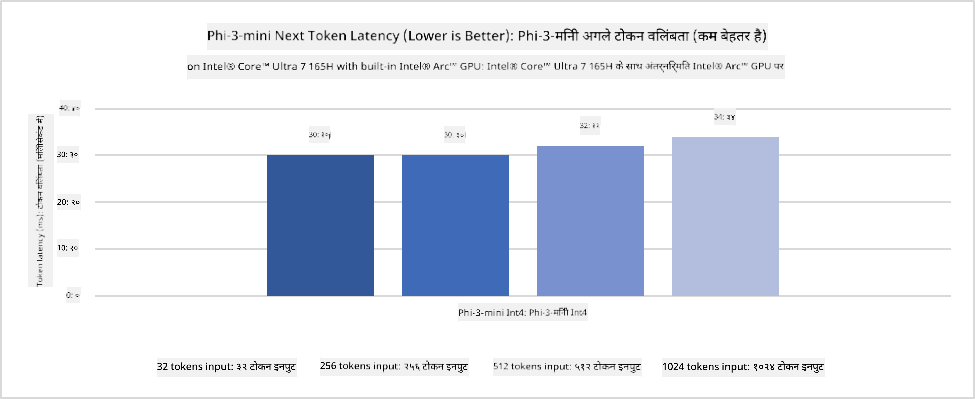
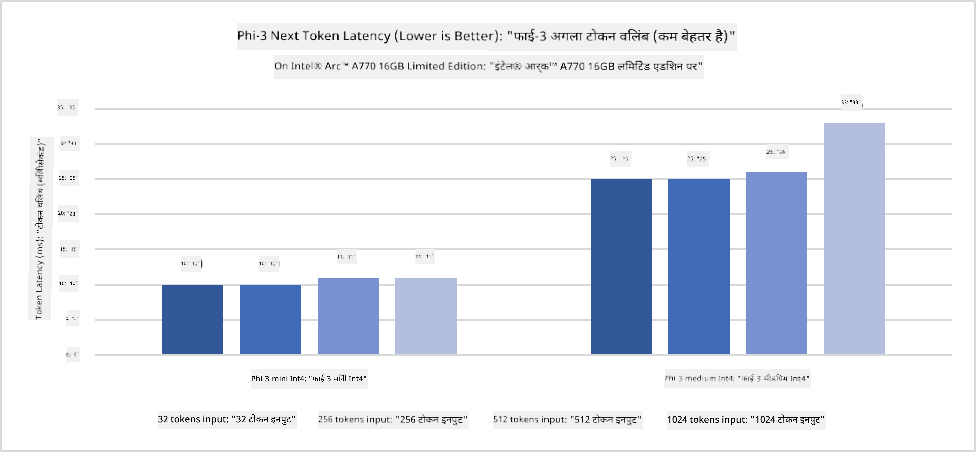
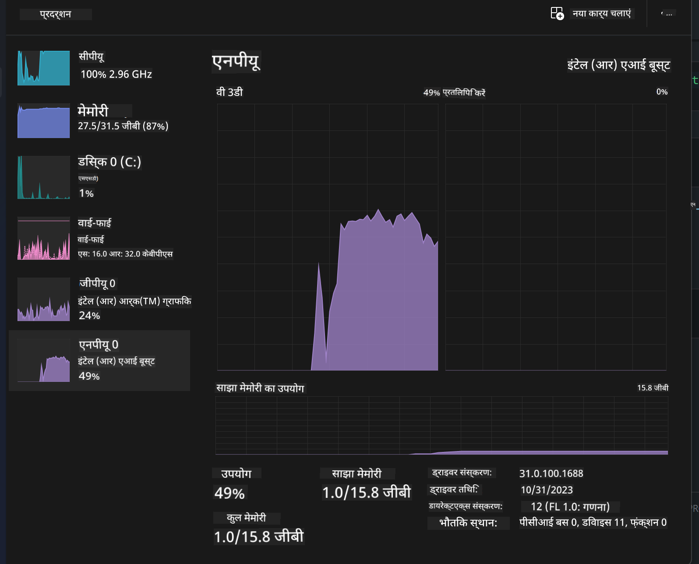
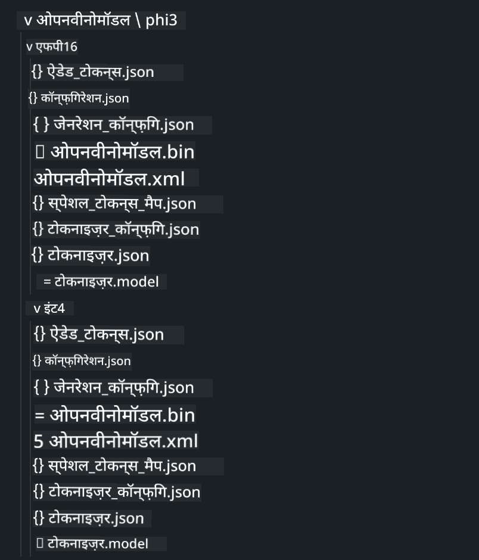
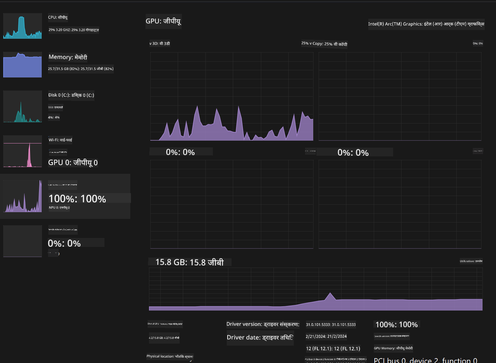

<!--
CO_OP_TRANSLATOR_METADATA:
{
  "original_hash": "5ca6ea8da7aa1335ef287124462b2833",
  "translation_date": "2025-04-04T17:43:48+00:00",
  "source_file": "md\\01.Introduction\\03\\AIPC_Inference.md",
  "language_code": "hi"
}
-->
# **AI PC में Phi-3 का निष्कर्षण**

जेनरेटिव AI में प्रगति और एज डिवाइस हार्डवेयर की क्षमता में सुधार के साथ, अब अधिक से अधिक जेनरेटिव AI मॉडल को उपयोगकर्ताओं के "अपना डिवाइस लाओ" (BYOD) डिवाइस में एकीकृत किया जा सकता है। AI PCs इन्हीं मॉडलों में से हैं। 2024 से शुरू होकर, Intel, AMD और Qualcomm ने PC निर्माताओं के साथ मिलकर AI PCs पेश किए हैं, जो हार्डवेयर संशोधनों के माध्यम से स्थानीय जेनरेटिव AI मॉडल के उपयोग को सक्षम बनाते हैं। इस चर्चा में, हम Intel AI PCs पर ध्यान केंद्रित करेंगे और देखेंगे कि Intel AI PC पर Phi-3 को कैसे तैनात किया जाए।

### NPU क्या है?

एक NPU (Neural Processing Unit) एक समर्पित प्रोसेसर या एक बड़े SoC पर प्रोसेसिंग यूनिट है, जो विशेष रूप से न्यूरल नेटवर्क संचालन और AI कार्यों को तेज करने के लिए डिज़ाइन की गई है। सामान्य-उद्देश्य वाले CPUs और GPUs के विपरीत, NPUs डेटा-चालित समानांतर कंप्यूटिंग के लिए अनुकूलित होते हैं, जिससे वे वीडियो और छवियों जैसे विशाल मल्टीमीडिया डेटा को प्रोसेस करने और न्यूरल नेटवर्क के लिए डेटा प्रोसेस करने में अत्यधिक कुशल बनते हैं। वे AI-संबंधित कार्यों को संभालने में विशेष रूप से सक्षम होते हैं, जैसे स्पीच रिकग्निशन, वीडियो कॉल में बैकग्राउंड ब्लरिंग, और फोटो या वीडियो एडिटिंग जैसे ऑब्जेक्ट डिटेक्शन।

## NPU बनाम GPU

हालांकि कई AI और मशीन लर्निंग कार्यभार GPUs पर चलते हैं, GPUs और NPUs के बीच एक महत्वपूर्ण अंतर है।  
GPUs समानांतर कंप्यूटिंग क्षमताओं के लिए जाने जाते हैं, लेकिन सभी GPUs ग्राफिक्स प्रोसेसिंग से परे समान रूप से कुशल नहीं होते। दूसरी ओर, NPUs न्यूरल नेटवर्क संचालन में शामिल जटिल गणनाओं के लिए उद्देश्य-निर्मित होते हैं, जिससे वे AI कार्यों के लिए अत्यधिक प्रभावी बनते हैं।

संक्षेप में, NPUs वे गणितज्ञ हैं जो AI गणनाओं को तेज करते हैं, और वे AI PCs के उभरते युग में एक प्रमुख भूमिका निभाते हैं!

***यह उदाहरण Intel के नवीनतम Intel Core Ultra Processor पर आधारित है***

## **1. NPU का उपयोग करके Phi-3 मॉडल चलाएं**

Intel® NPU डिवाइस Intel क्लाइंट CPUs के साथ एकीकृत AI निष्कर्षण त्वरक है, जो Intel® Core™ Ultra पीढ़ी के CPUs (पहले Meteor Lake के रूप में जाने जाते थे) से शुरू होता है। यह कृत्रिम न्यूरल नेटवर्क कार्यों के ऊर्जा-कुशल निष्पादन को सक्षम बनाता है।





**Intel NPU Acceleration Library**

Intel NPU Acceleration Library [https://github.com/intel/intel-npu-acceleration-library](https://github.com/intel/intel-npu-acceleration-library) एक Python लाइब्रेरी है, जिसे आपके एप्लिकेशन की दक्षता को बढ़ाने के लिए Intel Neural Processing Unit (NPU) की शक्ति का उपयोग करके उच्च गति की गणनाएँ करने के लिए डिज़ाइन किया गया है।

Intel® Core™ Ultra प्रोसेसर द्वारा संचालित AI PC पर Phi-3-mini का उदाहरण।


Python लाइब्रेरी को pip के साथ इंस्टॉल करें

```bash

   pip install intel-npu-acceleration-library

```

***नोट*** प्रोजेक्ट अभी विकासाधीन है, लेकिन संदर्भ मॉडल पहले से ही बहुत संपूर्ण है।

### **Intel NPU Acceleration Library के साथ Phi-3 चलाना**

Intel NPU त्वरक का उपयोग करते हुए, यह लाइब्रेरी पारंपरिक एनकोडिंग प्रक्रिया को प्रभावित नहीं करती। आपको केवल इस लाइब्रेरी का उपयोग करके मूल Phi-3 मॉडल को क्वांटाइज़ करना होगा, जैसे FP16, INT8, INT4।

```python
from transformers import AutoTokenizer, pipeline,TextStreamer
from intel_npu_acceleration_library import NPUModelForCausalLM, int4
from intel_npu_acceleration_library.compiler import CompilerConfig
import warnings

model_id = "microsoft/Phi-3-mini-4k-instruct"

compiler_conf = CompilerConfig(dtype=int4)
model = NPUModelForCausalLM.from_pretrained(
    model_id, use_cache=True, config=compiler_conf, attn_implementation="sdpa"
).eval()

tokenizer = AutoTokenizer.from_pretrained(model_id)

text_streamer = TextStreamer(tokenizer, skip_prompt=True)
```

क्वांटिफिकेशन सफल होने के बाद, NPU को कॉल करके Phi-3 मॉडल को चलाना जारी रखें।

```python
generation_args = {
   "max_new_tokens": 1024,
   "return_full_text": False,
   "temperature": 0.3,
   "do_sample": False,
   "streamer": text_streamer,
}

pipe = pipeline(
   "text-generation",
   model=model,
   tokenizer=tokenizer,
)

query = "<|system|>You are a helpful AI assistant.<|end|><|user|>Can you introduce yourself?<|end|><|assistant|>"

with warnings.catch_warnings():
    warnings.simplefilter("ignore")
    pipe(query, **generation_args)
```

कोड निष्पादित करते समय, हम Task Manager के माध्यम से NPU की रनिंग स्थिति देख सकते हैं।



***उदाहरण*** : [AIPC_NPU_DEMO.ipynb](../../../../../code/03.Inference/AIPC/AIPC_NPU_DEMO.ipynb)

## **2. DirectML + ONNX Runtime का उपयोग करके Phi-3 मॉडल चलाएं**

### **DirectML क्या है**

[DirectML](https://github.com/microsoft/DirectML) एक उच्च-प्रदर्शन, हार्डवेयर-त्वरित DirectX 12 लाइब्रेरी है, जो मशीन लर्निंग के लिए डिज़ाइन की गई है। DirectML सामान्य मशीन लर्निंग कार्यों के लिए GPU त्वरक प्रदान करता है और DirectX 12-सक्षम GPUs जैसे AMD, Intel, NVIDIA, और Qualcomm के साथ व्यापक हार्डवेयर और ड्राइवर समर्थन प्रदान करता है।

जब इसे अकेले उपयोग किया जाता है, DirectML API एक निम्न-स्तरीय DirectX 12 लाइब्रेरी है और यह उच्च-प्रदर्शन, कम-विलंबता एप्लिकेशन जैसे फ्रेमवर्क, गेम्स, और अन्य रीयल-टाइम एप्लिकेशन के लिए उपयुक्त है। DirectML की Direct3D 12 के साथ निर्बाध इंटरऑपरेबिलिटी, इसके निम्न ओवरहेड और हार्डवेयर के बीच परिणामों की भविष्यवाणी करने की क्षमता इसे मशीन लर्निंग के लिए आदर्श बनाती है।

***नोट*** : नवीनतम DirectML अब NPU का समर्थन करता है (https://devblogs.microsoft.com/directx/introducing-neural-processor-unit-npu-support-in-directml-developer-preview/)

### DirectML और CUDA की क्षमताओं और प्रदर्शन की तुलना:

**DirectML** माइक्रोसॉफ्ट द्वारा विकसित एक मशीन लर्निंग लाइब्रेरी है। यह Windows उपकरणों पर मशीन लर्निंग कार्यभार को तेज करने के लिए डिज़ाइन की गई है।  
- DX12-आधारित: DirectML DirectX 12 (DX12) पर आधारित है, जो GPUs पर व्यापक हार्डवेयर समर्थन प्रदान करता है।  
- व्यापक समर्थन: DX12 का उपयोग करने के कारण, DirectML किसी भी GPU के साथ काम कर सकता है जो DX12 का समर्थन करता है।  
- छवि प्रसंस्करण: DirectML छवियों और अन्य डेटा को न्यूरल नेटवर्क का उपयोग करके प्रोसेस करता है।  
- सेटअप में आसानी: DirectML को सेटअप करना आसान है।  
- प्रदर्शन: कुछ मामलों में, DirectML अच्छा प्रदर्शन करता है।  
- सीमाएं: हालांकि, कुछ कार्यभार के लिए DirectML धीमा हो सकता है।  

**CUDA** NVIDIA का समानांतर कंप्यूटिंग प्लेटफ़ॉर्म है। यह NVIDIA GPUs की शक्ति का उपयोग करता है।  
- NVIDIA-विशिष्ट: CUDA NVIDIA GPUs के लिए डिज़ाइन किया गया है।  
- अत्यधिक अनुकूलित: यह GPU-त्वरित कार्यों के लिए उत्कृष्ट प्रदर्शन प्रदान करता है।  
- व्यापक उपयोग: कई मशीन लर्निंग फ्रेमवर्क और लाइब्रेरी CUDA का समर्थन करती हैं।  
- अनुकूलन: CUDA सेटिंग्स को अनुकूलित किया जा सकता है।  
- सीमाएं: हालांकि, CUDA की NVIDIA हार्डवेयर पर निर्भरता इसे अन्य GPUs के लिए सीमित कर सकती है।  

### DirectML और CUDA के बीच चयन

चयन उपयोग के मामले, हार्डवेयर उपलब्धता और प्राथमिकताओं पर निर्भर करता है।  
यदि आप व्यापक संगतता और आसान सेटअप चाहते हैं, तो DirectML एक अच्छा विकल्प हो सकता है। लेकिन यदि आपके पास NVIDIA GPUs हैं और आपको उच्च अनुकूलित प्रदर्शन की आवश्यकता है, तो CUDA एक मजबूत विकल्प है।  

### **ONNX Runtime के साथ जेनरेटिव AI**

AI के युग में, AI मॉडलों की पोर्टेबिलिटी बहुत महत्वपूर्ण है। ONNX Runtime प्रशिक्षित मॉडलों को विभिन्न उपकरणों पर आसानी से तैनात कर सकता है। डेवलपर्स को निष्कर्षण फ्रेमवर्क की परवाह नहीं करनी होती है और एकीकृत API का उपयोग करके मॉडल निष्कर्षण पूरा कर सकते हैं।  

ONNX Runtime में, आप Python, C#, C/C++ के माध्यम से AI मॉडल API का उपयोग कर सकते हैं। iPhone पर तैनाती C++ के ONNX Runtime API का लाभ उठा सकती है।  

[उदाहरण कोड](https://github.com/Azure-Samples/Phi-3MiniSamples/tree/main/onnx)

***ONNX Runtime लाइब्रेरी के साथ जेनरेटिव AI को संकलित करें***

```bash

winget install --id=Kitware.CMake  -e

git clone https://github.com/microsoft/onnxruntime.git

cd .\onnxruntime\

./build.bat --build_shared_lib --skip_tests --parallel --use_dml --config Release

cd ../

git clone https://github.com/microsoft/onnxruntime-genai.git

cd .\onnxruntime-genai\

mkdir ort

cd ort

mkdir include

mkdir lib

copy ..\onnxruntime\include\onnxruntime\core\providers\dml\dml_provider_factory.h ort\include

copy ..\onnxruntime\include\onnxruntime\core\session\onnxruntime_c_api.h ort\include

copy ..\onnxruntime\build\Windows\Release\Release\*.dll ort\lib

copy ..\onnxruntime\build\Windows\Release\Release\onnxruntime.lib ort\lib

python build.py --use_dml


```

**लाइब्रेरी इंस्टॉल करें**

```bash

pip install .\onnxruntime_genai_directml-0.3.0.dev0-cp310-cp310-win_amd64.whl

```

यह रनिंग परिणाम है  


***उदाहरण*** : [AIPC_DirectML_DEMO.ipynb](../../../../../code/03.Inference/AIPC/AIPC_DirectML_DEMO.ipynb)

## **3. Intel OpenVINO का उपयोग करके Phi-3 मॉडल चलाएं**

### **OpenVINO क्या है**

[OpenVINO](https://github.com/openvinotoolkit/openvino) एक ओपन-सोर्स टूलकिट है, जो डीप लर्निंग मॉडलों को ऑप्टिमाइज़ और तैनात करने के लिए डिज़ाइन किया गया है। यह TensorFlow, PyTorch जैसे लोकप्रिय फ्रेमवर्क से विजन, ऑडियो और भाषा मॉडलों के लिए डीप लर्निंग प्रदर्शन को बढ़ाता है। OpenVINO को CPU और GPU के साथ संयोजन में भी उपयोग किया जा सकता है।  

***नोट***: वर्तमान में, OpenVINO NPU का समर्थन नहीं करता है।  

### **OpenVINO लाइब्रेरी इंस्टॉल करें**

```bash

 pip install git+https://github.com/huggingface/optimum-intel.git

 pip install git+https://github.com/openvinotoolkit/nncf.git

 pip install openvino-nightly

```

### **OpenVINO के साथ Phi-3 चलाना**

NPU की तरह, OpenVINO क्वांटेटिव मॉडल चलाकर जेनरेटिव AI मॉडलों का कॉल करता है। हमें पहले Phi-3 मॉडल को क्वांटाइज़ करना होगा और कमांड लाइन पर optimum-cli के माध्यम से मॉडल क्वांटिफिकेशन पूरा करना होगा।  

**INT4**

```bash

optimum-cli export openvino --model "microsoft/Phi-3-mini-4k-instruct" --task text-generation-with-past --weight-format int4 --group-size 128 --ratio 0.6  --sym  --trust-remote-code ./openvinomodel/phi3/int4

```

**FP16**

```bash

optimum-cli export openvino --model "microsoft/Phi-3-mini-4k-instruct" --task text-generation-with-past --weight-format fp16 --trust-remote-code ./openvinomodel/phi3/fp16

```

परिवर्तित प्रारूप इस प्रकार है  



मॉडल पथ (model_dir), संबंधित कॉन्फ़िगरेशन (ov_config = {"PERFORMANCE_HINT": "LATENCY", "NUM_STREAMS": "1", "CACHE_DIR": ""}), और हार्डवेयर-त्वरित डिवाइस (GPU.0) को OVModelForCausalLM के माध्यम से लोड करें।  

```python

ov_model = OVModelForCausalLM.from_pretrained(
     model_dir,
     device='GPU.0',
     ov_config=ov_config,
     config=AutoConfig.from_pretrained(model_dir, trust_remote_code=True),
     trust_remote_code=True,
)

```

कोड निष्पादित करते समय, हम Task Manager के माध्यम से GPU की रनिंग स्थिति देख सकते हैं।  



***उदाहरण*** : [AIPC_OpenVino_Demo.ipynb](../../../../../code/03.Inference/AIPC/AIPC_OpenVino_Demo.ipynb)

### ***नोट*** : उपरोक्त तीन विधियों में प्रत्येक के अपने फायदे हैं, लेकिन AI PC निष्कर्षण के लिए NPU त्वरक का उपयोग करने की सिफारिश की जाती है।

**अस्वीकरण**:  
यह दस्तावेज़ AI अनुवाद सेवा [Co-op Translator](https://github.com/Azure/co-op-translator) का उपयोग करके अनुवादित किया गया है। जबकि हम सटीकता सुनिश्चित करने का प्रयास करते हैं, कृपया ध्यान दें कि स्वचालित अनुवाद में त्रुटियां या अशुद्धियां हो सकती हैं। मूल दस्तावेज़, जो इसकी मूल भाषा में है, को आधिकारिक स्रोत माना जाना चाहिए। महत्वपूर्ण जानकारी के लिए, पेशेवर मानव अनुवाद की सिफारिश की जाती है। इस अनुवाद के उपयोग से उत्पन्न किसी भी गलतफहमी या गलत व्याख्या के लिए हम उत्तरदायी नहीं हैं।