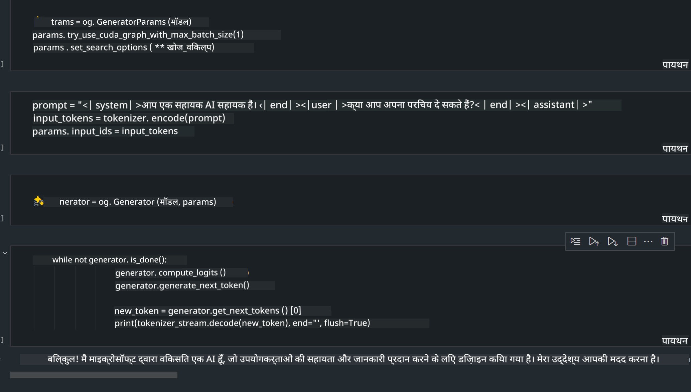

<!--
CO_OP_TRANSLATOR_METADATA:
{
  "original_hash": "e08ce816e23ad813244a09ca34ebb8ac",
  "translation_date": "2025-07-16T19:57:29+00:00",
  "source_file": "md/01.Introduction/03/AIPC_Inference.md",
  "language_code": "hi"
}
-->
# **AI PC में Inference Phi-3**

जनरेटिव AI के विकास और एज डिवाइस हार्डवेयर क्षमताओं में सुधार के साथ, अब अधिक से अधिक जनरेटिव AI मॉडल उपयोगकर्ताओं के Bring Your Own Device (BYOD) डिवाइसों में एकीकृत किए जा सकते हैं। AI PC ऐसे ही मॉडलों में से एक हैं। 2024 से, Intel, AMD, और Qualcomm ने PC निर्माताओं के साथ मिलकर AI PC पेश किए हैं जो हार्डवेयर संशोधनों के माध्यम से स्थानीय जनरेटिव AI मॉडल के तैनाती को आसान बनाते हैं। इस चर्चा में, हम Intel AI PC पर ध्यान केंद्रित करेंगे और देखेंगे कि Intel AI PC पर Phi-3 को कैसे तैनात किया जाए।

### NPU क्या है

NPU (Neural Processing Unit) एक समर्पित प्रोसेसर या प्रोसेसिंग यूनिट है जो बड़े SoC पर विशेष रूप से न्यूरल नेटवर्क ऑपरेशंस और AI कार्यों को तेज़ करने के लिए डिज़ाइन किया गया है। सामान्य प्रयोजन CPU और GPU के विपरीत, NPU डेटा-संचालित समानांतर कंप्यूटिंग के लिए अनुकूलित होते हैं, जिससे वे वीडियो और छवियों जैसे बड़े मल्टीमीडिया डेटा को संसाधित करने और न्यूरल नेटवर्क के लिए डेटा प्रोसेसिंग में अत्यंत कुशल होते हैं। वे विशेष रूप से AI से संबंधित कार्यों जैसे भाषण पहचान, वीडियो कॉल में पृष्ठभूमि धुंधलाना, और ऑब्जेक्ट डिटेक्शन जैसे फोटो या वीडियो संपादन प्रक्रियाओं को संभालने में माहिर हैं।

## NPU बनाम GPU

जबकि कई AI और मशीन लर्निंग कार्य GPU पर चलते हैं, GPU और NPU के बीच एक महत्वपूर्ण अंतर है।  
GPU अपनी समानांतर कंप्यूटिंग क्षमताओं के लिए जाने जाते हैं, लेकिन सभी GPU ग्राफिक्स के अलावा समान दक्षता नहीं दिखाते। दूसरी ओर, NPU न्यूरल नेटवर्क ऑपरेशंस में शामिल जटिल गणनाओं के लिए विशेष रूप से बनाए गए हैं, जिससे वे AI कार्यों के लिए अत्यंत प्रभावी होते हैं।

संक्षेप में, NPU गणित के विशेषज्ञ हैं जो AI गणनाओं को तेज़ करते हैं, और वे AI PC के उभरते युग में एक महत्वपूर्ण भूमिका निभाते हैं!

***यह उदाहरण Intel के नवीनतम Intel Core Ultra Processor पर आधारित है***

## **1. Phi-3 मॉडल चलाने के लिए NPU का उपयोग करें**

Intel® NPU डिवाइस एक AI inference एक्सेलेरेटर है जो Intel क्लाइंट CPU के साथ एकीकृत होता है, जो Intel® Core™ Ultra पीढ़ी के CPU से शुरू होता है (जिसे पहले Meteor Lake के नाम से जाना जाता था)। यह कृत्रिम न्यूरल नेटवर्क कार्यों के ऊर्जा-कुशल निष्पादन को सक्षम बनाता है।


**Intel NPU Acceleration Library**

Intel NPU Acceleration Library [https://github.com/intel/intel-npu-acceleration-library](https://github.com/intel/intel-npu-acceleration-library) एक Python लाइब्रेरी है जो Intel Neural Processing Unit (NPU) की शक्ति का उपयोग करके आपके एप्लिकेशन की दक्षता बढ़ाने के लिए डिज़ाइन की गई है, ताकि संगत हार्डवेयर पर उच्च गति की गणनाएं की जा सकें।

Intel® Core™ Ultra प्रोसेसर द्वारा संचालित AI PC पर Phi-3-mini का उदाहरण।


Python लाइब्रेरी को pip के साथ इंस्टॉल करें

```bash

   pip install intel-npu-acceleration-library

```

***ध्यान दें*** प्रोजेक्ट अभी विकासाधीन है, लेकिन संदर्भ मॉडल पहले से ही बहुत पूर्ण है।

### **Intel NPU Acceleration Library के साथ Phi-3 चलाना**

Intel NPU एक्सेलेरेशन का उपयोग करते हुए, यह लाइब्रेरी पारंपरिक एन्कोडिंग प्रक्रिया को प्रभावित नहीं करती। आपको केवल इस लाइब्रेरी का उपयोग करके मूल Phi-3 मॉडल को क्वांटाइज़ करना होगा, जैसे FP16, INT8, INT4, जैसे

```python
from transformers import AutoTokenizer, pipeline,TextStreamer
from intel_npu_acceleration_library import NPUModelForCausalLM, int4
from intel_npu_acceleration_library.compiler import CompilerConfig
import warnings

model_id = "microsoft/Phi-3-mini-4k-instruct"

compiler_conf = CompilerConfig(dtype=int4)
model = NPUModelForCausalLM.from_pretrained(
    model_id, use_cache=True, config=compiler_conf, attn_implementation="sdpa"
).eval()

tokenizer = AutoTokenizer.from_pretrained(model_id)

text_streamer = TextStreamer(tokenizer, skip_prompt=True)
```

क्वांटिफिकेशन सफल होने के बाद, Phi-3 मॉडल चलाने के लिए NPU को कॉल करने के लिए निष्पादन जारी रखें।

```python
generation_args = {
   "max_new_tokens": 1024,
   "return_full_text": False,
   "temperature": 0.3,
   "do_sample": False,
   "streamer": text_streamer,
}

pipe = pipeline(
   "text-generation",
   model=model,
   tokenizer=tokenizer,
)

query = "<|system|>You are a helpful AI assistant.<|end|><|user|>Can you introduce yourself?<|end|><|assistant|>"

with warnings.catch_warnings():
    warnings.simplefilter("ignore")
    pipe(query, **generation_args)
```

कोड निष्पादित करते समय, हम टास्क मैनेजर के माध्यम से NPU की रनिंग स्थिति देख सकते हैं


***नमूने*** : [AIPC_NPU_DEMO.ipynb](../../../../../code/03.Inference/AIPC/AIPC_NPU_DEMO.ipynb)

## **2. Phi-3 मॉडल चलाने के लिए DirectML + ONNX Runtime का उपयोग करें**

### **DirectML क्या है**

[DirectML](https://github.com/microsoft/DirectML) एक उच्च प्रदर्शन वाला, हार्डवेयर-त्वरित DirectX 12 लाइब्रेरी है जो मशीन लर्निंग के लिए है। DirectML सामान्य मशीन लर्निंग कार्यों के लिए GPU एक्सेलेरेशन प्रदान करता है, जो AMD, Intel, NVIDIA, और Qualcomm जैसे विक्रेताओं के सभी DirectX 12-सक्षम GPU सहित व्यापक हार्डवेयर और ड्राइवरों का समर्थन करता है।

जब अकेले उपयोग किया जाता है, तो DirectML API एक निम्न-स्तरीय DirectX 12 लाइब्रेरी है और उच्च प्रदर्शन, कम विलंबता वाले अनुप्रयोगों जैसे फ्रेमवर्क, गेम्स, और अन्य रियल-टाइम एप्लिकेशन के लिए उपयुक्त है। DirectML का Direct3D 12 के साथ सहज इंटरऑपरेबिलिटी, कम ओवरहेड, और हार्डवेयर के बीच संगतता इसे मशीन लर्निंग को तेज़ करने के लिए आदर्श बनाती है, खासकर जब उच्च प्रदर्शन और हार्डवेयर के बीच विश्वसनीयता और परिणामों की पूर्वानुमानिता महत्वपूर्ण हो।

***ध्यान दें*** : नवीनतम DirectML पहले से ही NPU का समर्थन करता है (https://devblogs.microsoft.com/directx/introducing-neural-processor-unit-npu-support-in-directml-developer-preview/)

### DirectML और CUDA की क्षमताओं और प्रदर्शन के संदर्भ में तुलना:

**DirectML** माइक्रोसॉफ्ट द्वारा विकसित एक मशीन लर्निंग लाइब्रेरी है। यह Windows डिवाइसों पर मशीन लर्निंग वर्कलोड को तेज़ करने के लिए डिज़ाइन की गई है, जिसमें डेस्कटॉप, लैपटॉप, और एज डिवाइस शामिल हैं।  
- DX12-आधारित: DirectML DirectX 12 (DX12) पर आधारित है, जो NVIDIA और AMD दोनों सहित GPUs के व्यापक हार्डवेयर समर्थन प्रदान करता है।  
- व्यापक समर्थन: चूंकि यह DX12 का उपयोग करता है, DirectML किसी भी GPU के साथ काम कर सकता है जो DX12 का समर्थन करता है, यहां तक कि इंटीग्रेटेड GPU भी।  
- इमेज प्रोसेसिंग: DirectML न्यूरल नेटवर्क का उपयोग करके छवियों और अन्य डेटा को प्रोसेस करता है, जिससे यह इमेज रिकग्निशन, ऑब्जेक्ट डिटेक्शन जैसे कार्यों के लिए उपयुक्त है।  
- सेटअप में आसानी: DirectML सेटअप करना सरल है, और इसे GPU निर्माताओं के विशिष्ट SDK या लाइब्रेरी की आवश्यकता नहीं होती।  
- प्रदर्शन: कुछ मामलों में, DirectML अच्छा प्रदर्शन करता है और कुछ वर्कलोड के लिए CUDA से तेज़ हो सकता है।  
- सीमाएं: हालांकि, कुछ स्थितियों में, विशेष रूप से float16 बड़े बैच साइज़ के लिए, DirectML धीमा हो सकता है।

**CUDA** NVIDIA का पैरेलल कंप्यूटिंग प्लेटफ़ॉर्म और प्रोग्रामिंग मॉडल है। यह डेवलपर्स को NVIDIA GPU की शक्ति का उपयोग सामान्य प्रयोजन कंप्यूटिंग, जिसमें मशीन लर्निंग और वैज्ञानिक सिमुलेशन शामिल हैं, के लिए करने की अनुमति देता है।  
- NVIDIA-विशिष्ट: CUDA NVIDIA GPU के साथ गहराई से एकीकृत है और विशेष रूप से उनके लिए डिज़ाइन किया गया है।  
- अत्यधिक अनुकूलित: यह GPU-त्वरित कार्यों के लिए उत्कृष्ट प्रदर्शन प्रदान करता है, खासकर NVIDIA GPU के साथ।  
- व्यापक उपयोग: कई मशीन लर्निंग फ्रेमवर्क और लाइब्रेरी (जैसे TensorFlow और PyTorch) में CUDA समर्थन है।  
- अनुकूलन: डेवलपर्स CUDA सेटिंग्स को विशिष्ट कार्यों के लिए अनुकूलित कर सकते हैं, जिससे इष्टतम प्रदर्शन प्राप्त होता है।  
- सीमाएं: हालांकि, CUDA की NVIDIA हार्डवेयर पर निर्भरता विभिन्न GPU के बीच व्यापक संगतता के लिए बाधा हो सकती है।

### DirectML और CUDA के बीच चयन

DirectML और CUDA के बीच चयन आपके विशिष्ट उपयोग, हार्डवेयर उपलब्धता, और प्राथमिकताओं पर निर्भर करता है।  
यदि आप व्यापक संगतता और सेटअप में आसानी चाहते हैं, तो DirectML एक अच्छा विकल्प हो सकता है। हालांकि, यदि आपके पास NVIDIA GPU हैं और आपको अत्यधिक अनुकूलित प्रदर्शन की आवश्यकता है, तो CUDA एक मजबूत विकल्प है। संक्षेप में, दोनों के अपने फायदे और नुकसान हैं, इसलिए निर्णय लेते समय अपनी आवश्यकताओं और उपलब्ध हार्डवेयर पर विचार करें।

### **ONNX Runtime के साथ जनरेटिव AI**

AI के युग में, AI मॉडल की पोर्टेबिलिटी बहुत महत्वपूर्ण है। ONNX Runtime प्रशिक्षित मॉडलों को विभिन्न डिवाइसों पर आसानी से तैनात कर सकता है। डेवलपर्स को इन्फरेंस फ्रेमवर्क की चिंता करने की जरूरत नहीं होती और वे एक एकीकृत API का उपयोग करके मॉडल इन्फरेंस पूरा कर सकते हैं। जनरेटिव AI के युग में, ONNX Runtime ने कोड ऑप्टिमाइज़ेशन भी किया है (https://onnxruntime.ai/docs/genai/)। ऑप्टिमाइज़्ड ONNX Runtime के माध्यम से, क्वांटाइज़्ड जनरेटिव AI मॉडल विभिन्न टर्मिनलों पर इन्फरेंस किया जा सकता है। ONNX Runtime के साथ जनरेटिव AI में, आप Python, C#, C / C++ के माध्यम से AI मॉडल API का उपयोग कर सकते हैं। निश्चित रूप से, iPhone पर तैनाती C++ के Generative AI with ONNX Runtime API का लाभ उठा सकती है।

[Sample Code](https://github.com/Azure-Samples/Phi-3MiniSamples/tree/main/onnx)

***ONNX Runtime लाइब्रेरी के साथ जनरेटिव AI को संकलित करें***

```bash

winget install --id=Kitware.CMake  -e

git clone https://github.com/microsoft/onnxruntime.git

cd .\onnxruntime\

./build.bat --build_shared_lib --skip_tests --parallel --use_dml --config Release

cd ../

git clone https://github.com/microsoft/onnxruntime-genai.git

cd .\onnxruntime-genai\

mkdir ort

cd ort

mkdir include

mkdir lib

copy ..\onnxruntime\include\onnxruntime\core\providers\dml\dml_provider_factory.h ort\include

copy ..\onnxruntime\include\onnxruntime\core\session\onnxruntime_c_api.h ort\include

copy ..\onnxruntime\build\Windows\Release\Release\*.dll ort\lib

copy ..\onnxruntime\build\Windows\Release\Release\onnxruntime.lib ort\lib

python build.py --use_dml


```

**लाइब्रेरी इंस्टॉल करें**

```bash

pip install .\onnxruntime_genai_directml-0.3.0.dev0-cp310-cp310-win_amd64.whl

```

यह चलने का परिणाम है



***नमूने*** : [AIPC_DirectML_DEMO.ipynb](../../../../../code/03.Inference/AIPC/AIPC_DirectML_DEMO.ipynb)

## **3. Phi-3 मॉडल चलाने के लिए Intel OpenVino का उपयोग करें**

### **OpenVINO क्या है**

[OpenVINO](https://github.com/openvinotoolkit/openvino) एक ओपन-सोर्स टूलकिट है जो डीप लर्निंग मॉडल के अनुकूलन और तैनाती के लिए है। यह TensorFlow, PyTorch और अन्य लोकप्रिय फ्रेमवर्क से विज़न, ऑडियो, और भाषा मॉडल के लिए बेहतर डीप लर्निंग प्रदर्शन प्रदान करता है। OpenVINO के साथ शुरुआत करें। OpenVINO CPU और GPU के संयोजन में Phi-3 मॉडल चलाने के लिए भी उपयोग किया जा सकता है।

***ध्यान दें***: वर्तमान में, OpenVINO NPU का समर्थन नहीं करता है।

### **OpenVINO लाइब्रेरी इंस्टॉल करें**

```bash

 pip install git+https://github.com/huggingface/optimum-intel.git

 pip install git+https://github.com/openvinotoolkit/nncf.git

 pip install openvino-nightly

```

### **OpenVINO के साथ Phi-3 चलाना**

NPU की तरह, OpenVINO क्वांटाइज़्ड मॉडल चलाकर जनरेटिव AI मॉडल को कॉल करता है। हमें पहले Phi-3 मॉडल को क्वांटाइज़ करना होगा और optimum-cli के माध्यम से कमांड लाइन पर मॉडल क्वांटाइज़ेशन पूरा करना होगा।

**INT4**

```bash

optimum-cli export openvino --model "microsoft/Phi-3-mini-4k-instruct" --task text-generation-with-past --weight-format int4 --group-size 128 --ratio 0.6  --sym  --trust-remote-code ./openvinomodel/phi3/int4

```

**FP16**

```bash

optimum-cli export openvino --model "microsoft/Phi-3-mini-4k-instruct" --task text-generation-with-past --weight-format fp16 --trust-remote-code ./openvinomodel/phi3/fp16

```

परिवर्तित फॉर्मेट, इस तरह


मॉडल पथ (model_dir), संबंधित कॉन्फ़िगरेशन (ov_config = {"PERFORMANCE_HINT": "LATENCY", "NUM_STREAMS": "1", "CACHE_DIR": ""}), और हार्डवेयर-त्वरित डिवाइस (GPU.0) को OVModelForCausalLM के माध्यम से लोड करें

```python

ov_model = OVModelForCausalLM.from_pretrained(
     model_dir,
     device='GPU.0',
     ov_config=ov_config,
     config=AutoConfig.from_pretrained(model_dir, trust_remote_code=True),
     trust_remote_code=True,
)

```

कोड निष्पादित करते समय, हम टास्क मैनेजर के माध्यम से GPU की रनिंग स्थिति देख सकते हैं


***नमूने*** : [AIPC_OpenVino_Demo.ipynb](../../../../../code/03.Inference/AIPC/AIPC_OpenVino_Demo.ipynb)

### ***ध्यान दें*** : उपरोक्त तीनों विधियों के अपने-अपने फायदे हैं, लेकिन AI PC इन्फरेंस के लिए NPU एक्सेलेरेशन का उपयोग करने की सलाह दी जाती है।

**अस्वीकरण**:  
यह दस्तावेज़ AI अनुवाद सेवा [Co-op Translator](https://github.com/Azure/co-op-translator) का उपयोग करके अनुवादित किया गया है। जबकि हम सटीकता के लिए प्रयासरत हैं, कृपया ध्यान दें कि स्वचालित अनुवादों में त्रुटियाँ या अशुद्धियाँ हो सकती हैं। मूल दस्तावेज़ अपनी मूल भाषा में ही अधिकारिक स्रोत माना जाना चाहिए। महत्वपूर्ण जानकारी के लिए, पेशेवर मानव अनुवाद की सलाह दी जाती है। इस अनुवाद के उपयोग से उत्पन्न किसी भी गलतफहमी या गलत व्याख्या के लिए हम जिम्मेदार नहीं हैं।