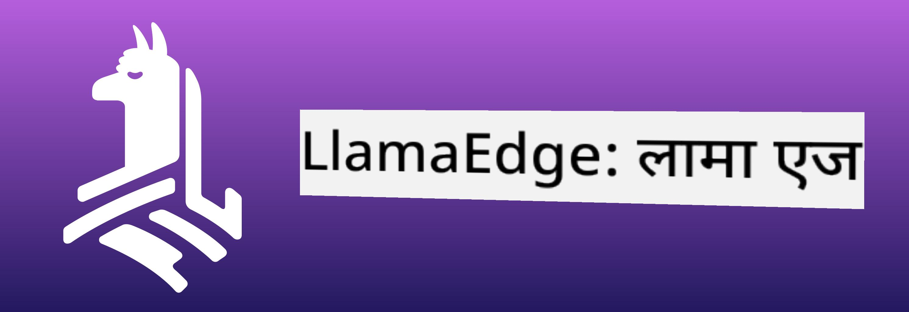
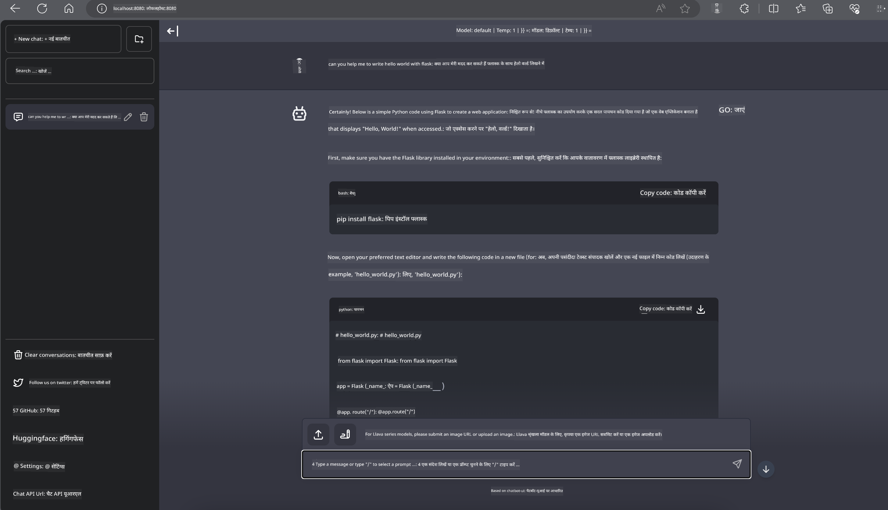

<!--
CO_OP_TRANSLATOR_METADATA:
{
  "original_hash": "be4101a30d98e95a71d42c276e8bcd37",
  "translation_date": "2025-05-08T05:55:36+00:00",
  "source_file": "md/01.Introduction/03/Jetson_Inference.md",
  "language_code": "hi"
}
-->
# **Nvidia Jetson में Inference Phi-3**

Nvidia Jetson Nvidia का एक एम्बेडेड कंप्यूटिंग बोर्ड्स का सीरीज है। Jetson TK1, TX1 और TX2 मॉडल्स में Nvidia का Tegra प्रोसेसर (या SoC) होता है, जिसमें ARM आर्किटेक्चर का सेंट्रल प्रोसेसिंग यूनिट (CPU) शामिल होता है। Jetson एक कम पावर वाला सिस्टम है और इसे मशीन लर्निंग एप्लिकेशन को तेज़ करने के लिए डिज़ाइन किया गया है। Nvidia Jetson का उपयोग प्रोफेशनल डेवलपर्स द्वारा सभी उद्योगों में क्रांतिकारी AI प्रोडक्ट बनाने के लिए किया जाता है, और छात्रों तथा उत्साही लोगों द्वारा AI सीखने और शानदार प्रोजेक्ट बनाने के लिए किया जाता है। SLM को एज डिवाइस जैसे Jetson पर डिप्लॉय किया जाता है, जो इंडस्ट्रियल जेनरेटिव AI एप्लिकेशन परिदृश्यों के बेहतर क्रियान्वयन को सक्षम बनाता है।

## NVIDIA Jetson पर डिप्लॉयमेंट:
स्वायत्त रोबोटिक्स और एम्बेडेड डिवाइस पर काम करने वाले डेवलपर्स Phi-3 Mini का लाभ उठा सकते हैं। Phi-3 का छोटा आकार इसे एज डिप्लॉयमेंट के लिए आदर्श बनाता है। प्रशिक्षण के दौरान पैरामीटर्स को बहुत ही सावधानी से ट्यून किया गया है, जिससे उत्तरों में उच्च सटीकता सुनिश्चित होती है।

### TensorRT-LLM ऑप्टिमाइज़ेशन:
NVIDIA की [TensorRT-LLM लाइब्रेरी](https://github.com/NVIDIA/TensorRT-LLM?WT.mc_id=aiml-138114-kinfeylo) बड़े भाषा मॉडल इनफेरेंस को ऑप्टिमाइज़ करती है। यह Phi-3 Mini की लंबी कंटेक्स्ट विंडो का समर्थन करती है, जिससे थ्रूपुट और लेटेंसी दोनों बेहतर होते हैं। ऑप्टिमाइज़ेशन में LongRoPE, FP8, और inflight बैचिंग जैसी तकनीकें शामिल हैं।

### उपलब्धता और डिप्लॉयमेंट:
डेवलपर्स Phi-3 Mini को 128K कंटेक्स्ट विंडो के साथ [NVIDIA के AI पेज](https://www.nvidia.com/en-us/ai-data-science/generative-ai/) पर एक्सप्लोर कर सकते हैं। इसे NVIDIA NIM के रूप में पैकेज किया गया है, जो एक माइक्रोसर्विस है और एक स्टैंडर्ड API के साथ कहीं भी डिप्लॉय किया जा सकता है। इसके अलावा, [TensorRT-LLM के GitHub इम्प्लीमेंटेशन](https://github.com/NVIDIA/TensorRT-LLM) भी उपलब्ध हैं।

## **1. तैयारी**

a. Jetson Orin NX / Jetson NX

b. JetPack 5.1.2+

c. Cuda 11.8

d. Python 3.8+

## **2. Jetson में Phi-3 चलाना**

हम [Ollama](https://ollama.com) या [LlamaEdge](https://llamaedge.com) चुन सकते हैं।

अगर आप क्लाउड और एज डिवाइस दोनों पर एक साथ gguf का उपयोग करना चाहते हैं, तो LlamaEdge को WasmEdge के रूप में समझा जा सकता है (WasmEdge एक हल्का, हाई परफॉर्मेंस, स्केलेबल WebAssembly रनटाइम है जो क्लाउड नेटिव, एज और विकेंद्रीकृत एप्लिकेशन के लिए उपयुक्त है। यह सर्वरलेस एप्लिकेशन, एम्बेडेड फंक्शंस, माइक्रोसर्विसेज, स्मार्ट कॉन्ट्रैक्ट्स और IoT डिवाइसेज का समर्थन करता है। आप gguf के क्वांटिटेटिव मॉडल को LlamaEdge के माध्यम से एज डिवाइस और क्लाउड दोनों पर डिप्लॉय कर सकते हैं।



इस्तेमाल करने के लिए ये स्टेप्स हैं:

1. संबंधित लाइब्रेरीज़ और फाइलें इंस्टॉल और डाउनलोड करें

```bash

curl -sSf https://raw.githubusercontent.com/WasmEdge/WasmEdge/master/utils/install.sh | bash -s -- --plugin wasi_nn-ggml

curl -LO https://github.com/LlamaEdge/LlamaEdge/releases/latest/download/llama-api-server.wasm

curl -LO https://github.com/LlamaEdge/chatbot-ui/releases/latest/download/chatbot-ui.tar.gz

tar xzf chatbot-ui.tar.gz

```

**Note**: llama-api-server.wasm और chatbot-ui को एक ही डायरेक्टरी में होना चाहिए

2. टर्मिनल में स्क्रिप्ट चलाएं

```bash

wasmedge --dir .:. --nn-preload default:GGML:AUTO:{Your gguf path} llama-api-server.wasm -p phi-3-chat

```

यहाँ रनिंग रिजल्ट है



***सैंपल कोड*** [Phi-3 mini WASM Notebook Sample](https://github.com/Azure-Samples/Phi-3MiniSamples/tree/main/wasm)

सारांश में, Phi-3 Mini भाषा मॉडलिंग में एक बड़ा कदम है, जो दक्षता, कंटेक्स्ट अवेयरनेस और NVIDIA के ऑप्टिमाइज़ेशन कौशल को मिलाता है। चाहे आप रोबोट बना रहे हों या एज एप्लिकेशन, Phi-3 Mini एक शक्तिशाली टूल है जिसे जानना ज़रूरी है।

**अस्वीकरण**:  
यह दस्तावेज़ AI अनुवाद सेवा [Co-op Translator](https://github.com/Azure/co-op-translator) का उपयोग करके अनूदित किया गया है। जबकि हम सटीकता के लिए प्रयासरत हैं, कृपया ध्यान रखें कि स्वचालित अनुवादों में त्रुटियाँ या अशुद्धियाँ हो सकती हैं। मूल दस्तावेज़ अपनी मूल भाषा में ही अधिकारिक स्रोत माना जाना चाहिए। महत्वपूर्ण जानकारी के लिए पेशेवर मानव अनुवाद की सलाह दी जाती है। इस अनुवाद के उपयोग से उत्पन्न किसी भी गलतफहमी या गलत व्याख्या के लिए हम जिम्मेदार नहीं हैं।