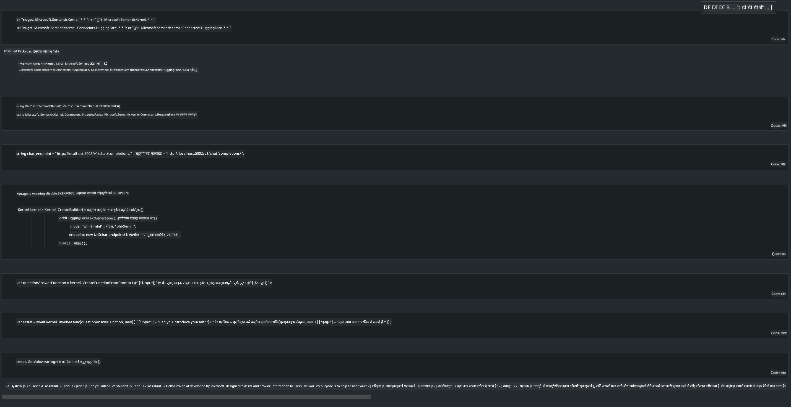

<!--
CO_OP_TRANSLATOR_METADATA:
{
  "original_hash": "12c0d9afaa23861ad5be655fcff4f71d",
  "translation_date": "2025-04-04T17:50:10+00:00",
  "source_file": "md\\01.Introduction\\03\\Local_Server_Inference.md",
  "language_code": "hi"
}
-->
# **लोकल सर्वर पर Phi-3 का इनफेरेंस**

हम Phi-3 को लोकल सर्वर पर डिप्लॉय कर सकते हैं। उपयोगकर्ता [Ollama](https://ollama.com) या [LM Studio](https://llamaedge.com) समाधान चुन सकते हैं, या अपना कोड लिख सकते हैं। आप [Semantic Kernel](https://github.com/microsoft/semantic-kernel?WT.mc_id=aiml-138114-kinfeylo) या [Langchain](https://www.langchain.com/) के माध्यम से Phi-3 की लोकल सेवाओं से जुड़ सकते हैं और Copilot एप्लिकेशन बना सकते हैं।

## **Semantic Kernel का उपयोग करके Phi-3-mini तक पहुंचें**

Copilot एप्लिकेशन में, हम Semantic Kernel / LangChain के माध्यम से एप्लिकेशन बनाते हैं। इस प्रकार का एप्लिकेशन फ्रेमवर्क आमतौर पर Azure OpenAI Service / OpenAI मॉडल के साथ संगत होता है और Hugging Face पर ओपन सोर्स मॉडल और लोकल मॉडल का समर्थन भी कर सकता है। अगर हमें Semantic Kernel का उपयोग करके Phi-3-mini तक पहुंचना है तो क्या करना चाहिए? .NET के उदाहरण के रूप में, हम इसे Semantic Kernel में Hugging Face Connector के साथ जोड़ सकते हैं। डिफॉल्ट रूप से, यह Hugging Face पर मॉडल आईडी के साथ संगत हो सकता है (पहली बार उपयोग करने पर, मॉडल Hugging Face से डाउनलोड किया जाएगा, जिसमें समय लगता है)। आप इसे बनाए गए लोकल सर्विस से भी जोड़ सकते हैं। दोनों की तुलना में, हम बाद वाले का उपयोग करने की सलाह देते हैं क्योंकि इसमें अधिक स्वायत्तता होती है, खासकर एंटरप्राइज एप्लिकेशन में।

चित्र से, Semantic Kernel के माध्यम से लोकल सेवाओं तक पहुंचना, स्वनिर्मित Phi-3-mini मॉडल सर्वर से आसानी से जुड़ सकता है। यहाँ चलने का परिणाम दिया गया है:

***नमूना कोड*** https://github.com/kinfey/Phi3MiniSamples/tree/main/semantickernel

**अस्वीकरण**:  
यह दस्तावेज़ AI अनुवाद सेवा [Co-op Translator](https://github.com/Azure/co-op-translator) का उपयोग करके अनुवादित किया गया है। हालांकि हम सटीकता सुनिश्चित करने का प्रयास करते हैं, कृपया ध्यान दें कि स्वचालित अनुवादों में त्रुटियां या गलतियां हो सकती हैं। मूल भाषा में लिखा गया मूल दस्तावेज़ ही आधिकारिक स्रोत माना जाना चाहिए। महत्वपूर्ण जानकारी के लिए, पेशेवर मानव अनुवाद की सिफारिश की जाती है। इस अनुवाद के उपयोग से उत्पन्न किसी भी गलतफहमी या गलत व्याख्या के लिए हम उत्तरदायी नहीं हैं।