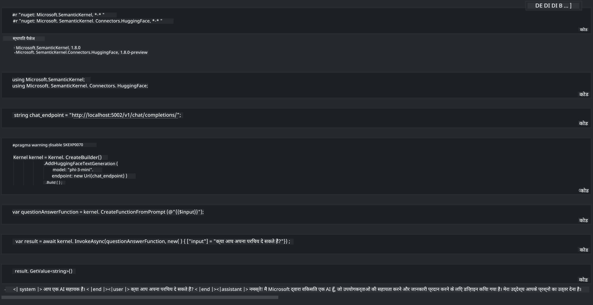

<!--
CO_OP_TRANSLATOR_METADATA:
{
  "original_hash": "bcf5dd7031db0031abdb9dd0c05ba118",
  "translation_date": "2025-05-08T05:57:02+00:00",
  "source_file": "md/01.Introduction/03/Local_Server_Inference.md",
  "language_code": "hi"
}
-->
# **लोकल सर्वर में Inference Phi-3**

हम Phi-3 को लोकल सर्वर पर डिप्लॉय कर सकते हैं। यूज़र्स [Ollama](https://ollama.com) या [LM Studio](https://llamaedge.com) सॉल्यूशंस चुन सकते हैं, या अपना खुद का कोड लिख सकते हैं। आप Phi-3 की लोकल सर्विसेज़ को [Semantic Kernel](https://github.com/microsoft/semantic-kernel?WT.mc_id=aiml-138114-kinfeylo) या [Langchain](https://www.langchain.com/) के जरिए कनेक्ट करके Copilot एप्लिकेशन बना सकते हैं।

## **Phi-3-mini तक पहुंचने के लिए Semantic Kernel का उपयोग करें**

Copilot एप्लिकेशन में, हम Semantic Kernel / LangChain के जरिए एप्लिकेशन बनाते हैं। इस प्रकार का एप्लिकेशन फ्रेमवर्क आमतौर पर Azure OpenAI Service / OpenAI मॉडल्स के साथ कम्पैटिबल होता है, और Hugging Face के ओपन सोर्स मॉडल्स और लोकल मॉडल्स को भी सपोर्ट कर सकता है। अगर हम Semantic Kernel का उपयोग करके Phi-3-mini तक पहुंचना चाहते हैं तो क्या करें? .NET को उदाहरण के तौर पर लेते हुए, हम इसे Semantic Kernel में Hugging Face Connector के साथ जोड़ सकते हैं। डिफ़ॉल्ट रूप से, यह Hugging Face पर मॉडल आईडी के अनुरूप होता है (पहली बार उपयोग करते समय, मॉडल Hugging Face से डाउनलोड होगा, जिसमें काफी समय लग सकता है)। आप बिल्ट लोकल सर्विस से भी कनेक्ट कर सकते हैं। इन दोनों की तुलना में, हम बाद वाले का उपयोग करने की सलाह देते हैं क्योंकि इसमें स्वायत्तता अधिक होती है, खासकर एंटरप्राइज एप्लिकेशन में।

चित्र से पता चलता है कि Semantic Kernel के जरिए लोकल सर्विसेज़ तक पहुंचना आसान है और यह खुद बनाए गए Phi-3-mini मॉडल सर्वर से कनेक्ट हो सकता है। यहाँ रनिंग रिजल्ट है:

***Sample Code*** https://github.com/kinfey/Phi3MiniSamples/tree/main/semantickernel

**अस्वीकरण**:  
यह दस्तावेज़ AI अनुवाद सेवा [Co-op Translator](https://github.com/Azure/co-op-translator) का उपयोग करके अनुवादित किया गया है। हम सटीकता के लिए प्रयासरत हैं, लेकिन कृपया ध्यान दें कि स्वचालित अनुवादों में त्रुटियाँ या असंगतियाँ हो सकती हैं। मूल दस्तावेज़ अपनी मूल भाषा में ही प्रामाणिक स्रोत माना जाना चाहिए। महत्वपूर्ण जानकारी के लिए पेशेवर मानव अनुवाद की सलाह दी जाती है। इस अनुवाद के उपयोग से उत्पन्न किसी भी गलतफहमी या गलत व्याख्या के लिए हम जिम्मेदार नहीं हैं।