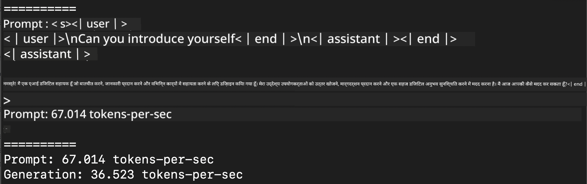
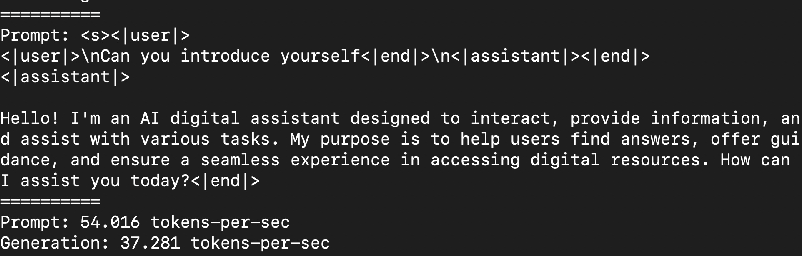
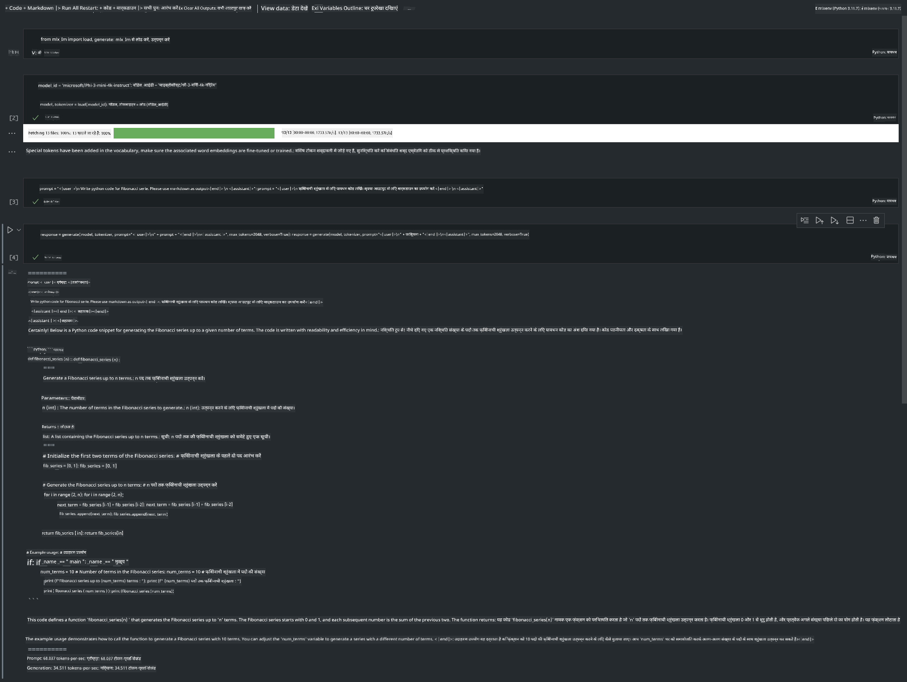

<!--
CO_OP_TRANSLATOR_METADATA:
{
  "original_hash": "700b9a537ce4426de5a7ccfa8e96e581",
  "translation_date": "2025-04-04T17:51:10+00:00",
  "source_file": "md\\01.Introduction\\03\\MLX_Inference.md",
  "language_code": "hi"
}
-->
# **Apple MLX फ्रेमवर्क के साथ Phi-3 का इनफरेंस**

## **MLX फ्रेमवर्क क्या है**

MLX एक एरे फ्रेमवर्क है जो Apple सिलिकॉन पर मशीन लर्निंग रिसर्च के लिए बनाया गया है। इसे Apple मशीन लर्निंग रिसर्च टीम ने पेश किया है।

MLX को मशीन लर्निंग रिसर्चर्स के लिए डिज़ाइन किया गया है। फ्रेमवर्क को उपयोगकर्ता के लिए सहज बनाने के साथ-साथ मॉडल को ट्रेन और डिप्लॉय करने में कुशल बनाने पर ध्यान दिया गया है। इसका डिज़ाइन भी अवधारणात्मक रूप से सरल है। हमारा उद्देश्य है कि रिसर्चर्स आसानी से MLX को बढ़ा सकें और उसमें सुधार कर सकें ताकि नए विचारों को जल्दी से एक्सप्लोर किया जा सके।

Apple सिलिकॉन डिवाइस पर LLMs को MLX के जरिए तेज़ी से चलाया जा सकता है, और मॉडल्स को लोकल डिवाइस पर बहुत ही आसानी से रन किया जा सकता है।

## **MLX का उपयोग करके Phi-3-mini का इनफरेंस करना**

### **1. अपना MLX एनवायरनमेंट सेट करें**

1. Python 3.11.x
2. MLX लाइब्रेरी इंस्टॉल करें

```bash

pip install mlx-lm

```

### **2. टर्मिनल में MLX के साथ Phi-3-mini चलाना**

```bash

python -m mlx_lm.generate --model microsoft/Phi-3-mini-4k-instruct --max-token 2048 --prompt  "<|user|>\nCan you introduce yourself<|end|>\n<|assistant|>"

```

परिणाम (मेरा एनवायरनमेंट Apple M1 Max, 64GB है) इस प्रकार है:



### **3. टर्मिनल में MLX के साथ Phi-3-mini को क्वांटाइज़ करना**

```bash

python -m mlx_lm.convert --hf-path microsoft/Phi-3-mini-4k-instruct

```

***नोट:*** मॉडल को mlx_lm.convert के जरिए क्वांटाइज़ किया जा सकता है, और डिफॉल्ट क्वांटाइज़ेशन INT4 है। इस उदाहरण में Phi-3-mini को INT4 में क्वांटाइज़ किया गया है।

मॉडल को mlx_lm.convert के जरिए क्वांटाइज़ किया जा सकता है, और डिफॉल्ट क्वांटाइज़ेशन INT4 है। इस उदाहरण में Phi-3-mini को INT4 में क्वांटाइज़ किया गया है। क्वांटाइज़ेशन के बाद, इसे डिफॉल्ट डायरेक्टरी ./mlx_model में स्टोर किया जाएगा।

हम टर्मिनल से MLX के साथ क्वांटाइज़ किए गए मॉडल का परीक्षण कर सकते हैं।

```bash

python -m mlx_lm.generate --model ./mlx_model/ --max-token 2048 --prompt  "<|user|>\nCan you introduce yourself<|end|>\n<|assistant|>"

```

परिणाम इस प्रकार है:



### **4. Jupyter Notebook में MLX के साथ Phi-3-mini चलाना**



***नोट:*** कृपया इस उदाहरण को पढ़ें [इस लिंक पर क्लिक करें](../../../../../code/03.Inference/MLX/MLX_DEMO.ipynb)

## **संसाधन**

1. Apple MLX फ्रेमवर्क के बारे में जानें [https://ml-explore.github.io](https://ml-explore.github.io/mlx/build/html/index.html)

2. Apple MLX GitHub रिपॉजिटरी [https://github.com/ml-explore](https://github.com/ml-explore)

**अस्वीकरण**:  
यह दस्तावेज़ AI अनुवाद सेवा [Co-op Translator](https://github.com/Azure/co-op-translator) का उपयोग करके अनुवादित किया गया है। जबकि हम सटीकता के लिए प्रयास करते हैं, कृपया ध्यान दें कि स्वचालित अनुवादों में त्रुटियां या अशुद्धियां हो सकती हैं। मूल दस्तावेज़ को उसकी मूल भाषा में प्रामाणिक स्रोत माना जाना चाहिए। महत्वपूर्ण जानकारी के लिए, पेशेवर मानव अनुवाद की सिफारिश की जाती है। इस अनुवाद के उपयोग से उत्पन्न किसी भी गलतफहमी या गलत व्याख्या के लिए हम जिम्मेदार नहीं हैं।