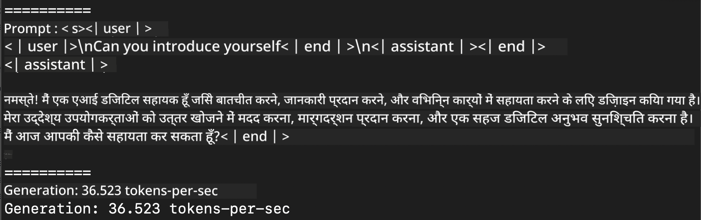
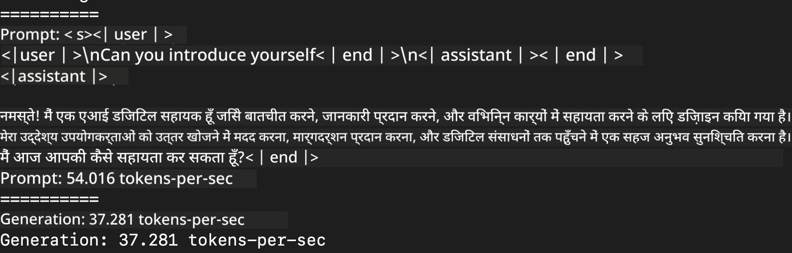
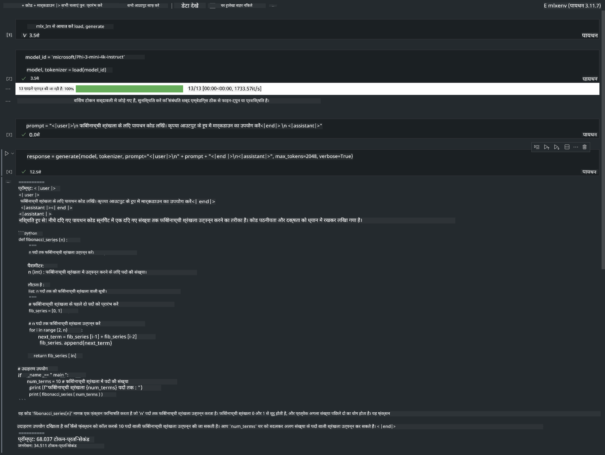

<!--
CO_OP_TRANSLATOR_METADATA:
{
  "original_hash": "dcb656f3d206fc4968e236deec5d4384",
  "translation_date": "2025-05-08T06:01:19+00:00",
  "source_file": "md/01.Introduction/03/MLX_Inference.md",
  "language_code": "hi"
}
-->
# **Inference Phi-3 with Apple MLX Framework**

## **MLX Framework क्या है**

MLX Apple सिलिकॉन पर मशीन लर्निंग रिसर्च के लिए एक array framework है, जिसे Apple मशीन लर्निंग रिसर्च द्वारा विकसित किया गया है।

MLX मशीन लर्निंग शोधकर्ताओं द्वारा मशीन लर्निंग शोधकर्ताओं के लिए डिज़ाइन किया गया है। यह framework उपयोगकर्ता के अनुकूल होने के साथ-साथ मॉडल को ट्रेन और डिप्लॉय करने में प्रभावी भी है। framework का डिज़ाइन भी अवधारणात्मक रूप से सरल है। हमारा उद्देश्य शोधकर्ताओं के लिए MLX को आसानी से बढ़ाने और सुधारने योग्य बनाना है ताकि वे नए विचारों का तेजी से पता लगा सकें।

Apple Silicon डिवाइसेज में LLMs को MLX के जरिए तेज़ किया जा सकता है, और मॉडल को लोकल रूप से बहुत ही सुविधाजनक तरीके से चलाया जा सकता है।

## **Phi-3-mini का MLX के साथ Inference करना**

### **1. अपना MLX पर्यावरण सेट करें**

1. Python 3.11.x
2. MLX लाइब्रेरी इंस्टॉल करें

```bash

pip install mlx-lm

```

### **2. MLX के साथ Terminal में Phi-3-mini चलाना**

```bash

python -m mlx_lm.generate --model microsoft/Phi-3-mini-4k-instruct --max-token 2048 --prompt  "<|user|>\nCan you introduce yourself<|end|>\n<|assistant|>"

```

परिणाम (मेरा पर्यावरण Apple M1 Max,64GB है) इस प्रकार है



### **3. Terminal में MLX के साथ Phi-3-mini को Quantize करना**

```bash

python -m mlx_lm.convert --hf-path microsoft/Phi-3-mini-4k-instruct

```

***Note：*** मॉडल को mlx_lm.convert के माध्यम से क्वांटाइज़ किया जा सकता है, और डिफ़ॉल्ट क्वांटाइजेशन INT4 है। इस उदाहरण में Phi-3-mini को INT4 में क्वांटाइज़ किया गया है।

मॉडल को mlx_lm.convert के जरिए क्वांटाइज़ किया जा सकता है, और डिफ़ॉल्ट क्वांटाइजेशन INT4 होता है। इस उदाहरण में Phi-3-mini को INT4 में क्वांटाइज़ किया गया है। क्वांटाइजेशन के बाद यह डिफ़ॉल्ट डायरेक्टरी ./mlx_model में सेव होगा।

हम टर्मिनल से MLX के साथ क्वांटाइज़ किए गए मॉडल का परीक्षण कर सकते हैं।

```bash

python -m mlx_lm.generate --model ./mlx_model/ --max-token 2048 --prompt  "<|user|>\nCan you introduce yourself<|end|>\n<|assistant|>"

```

परिणाम है



### **4. Jupyter Notebook में MLX के साथ Phi-3-mini चलाना**



***Note:*** कृपया इस सैंपल को पढ़ें [click this link](../../../../../code/03.Inference/MLX/MLX_DEMO.ipynb)

## **संसाधन**

1. Apple MLX Framework के बारे में जानें [https://ml-explore.github.io](https://ml-explore.github.io/mlx/build/html/index.html)

2. Apple MLX GitHub Repo [https://github.com/ml-explore](https://github.com/ml-explore)

**अस्वीकरण**:  
यह दस्तावेज़ AI अनुवाद सेवा [Co-op Translator](https://github.com/Azure/co-op-translator) का उपयोग करके अनुवादित किया गया है। जबकि हम सटीकता के लिए प्रयासरत हैं, कृपया ध्यान दें कि स्वचालित अनुवादों में त्रुटियाँ या गलतियाँ हो सकती हैं। मूल दस्तावेज़ अपनी मूल भाषा में प्रामाणिक स्रोत माना जाना चाहिए। महत्वपूर्ण जानकारी के लिए, पेशेवर मानव अनुवाद की सिफारिश की जाती है। इस अनुवाद के उपयोग से उत्पन्न किसी भी गलतफहमी या गलत व्याख्या के लिए हम उत्तरदायी नहीं हैं।