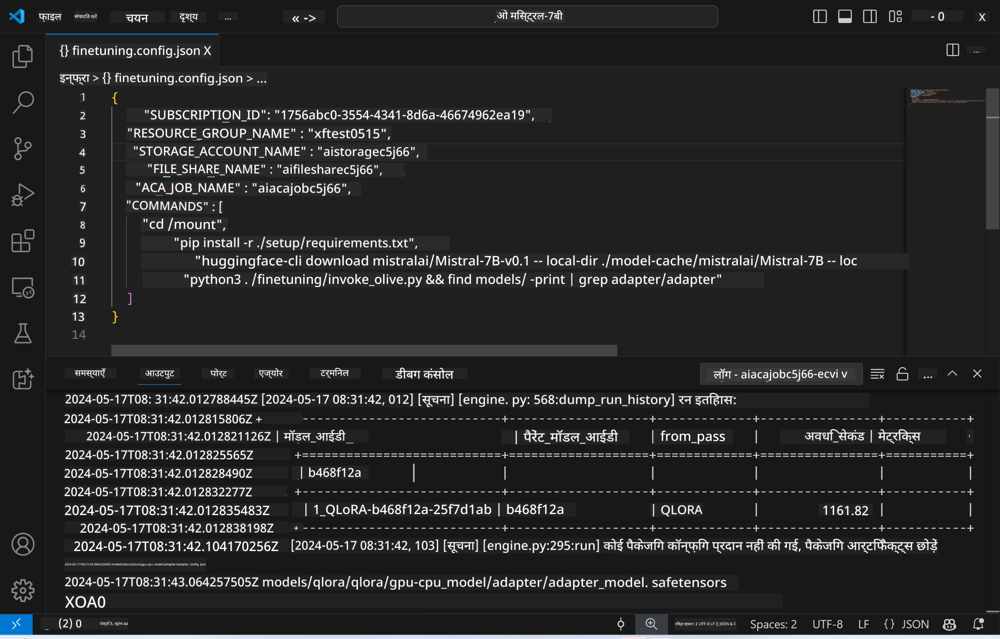
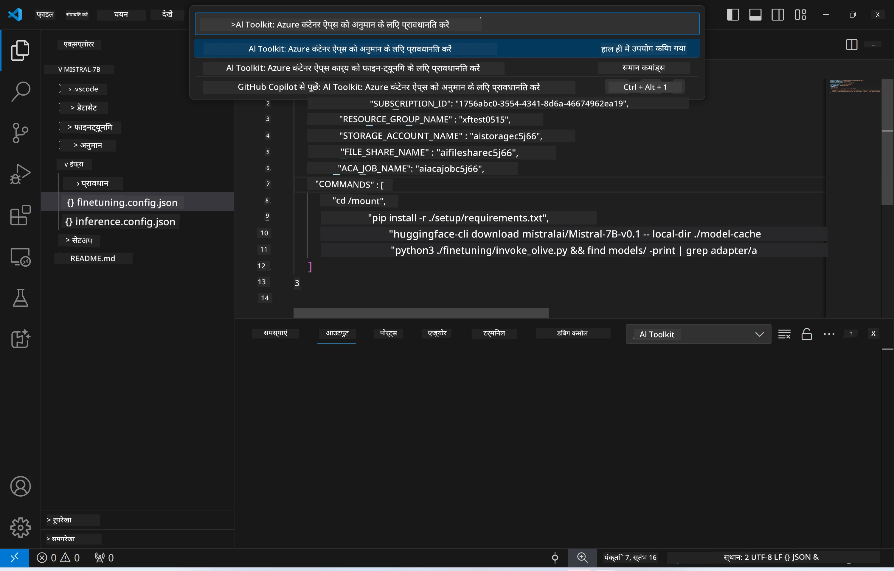
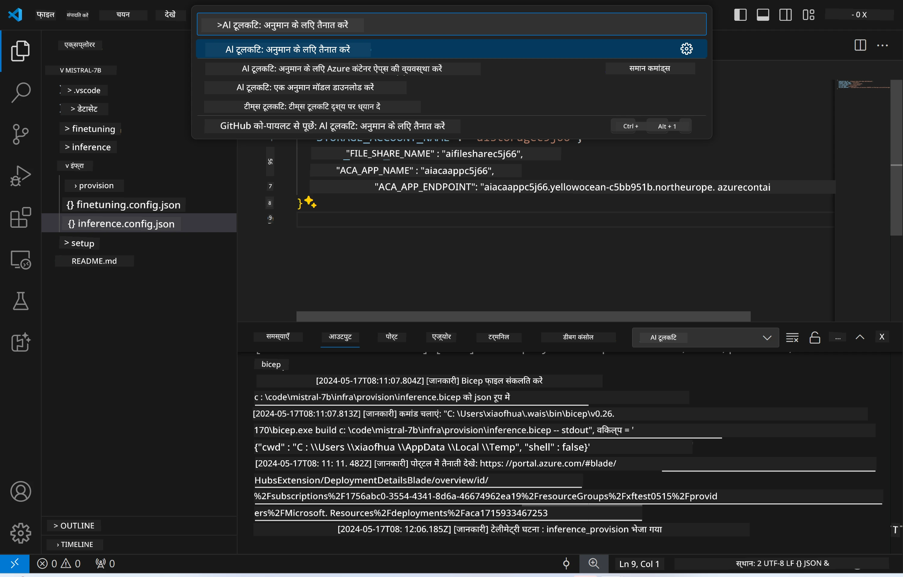
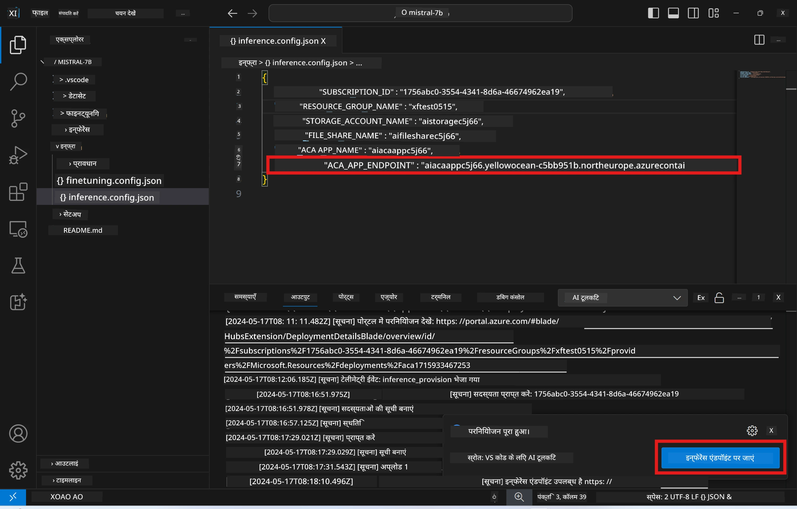

<!--
CO_OP_TRANSLATOR_METADATA:
{
  "original_hash": "a54cd3d65b6963e4e8ce21e143c3ab04",
  "translation_date": "2025-07-16T21:16:50+00:00",
  "source_file": "md/01.Introduction/03/Remote_Interence.md",
  "language_code": "hi"
}
-->
# फाइन-ट्यून किए गए मॉडल के साथ रिमोट इन्फरेंसिंग

जब एडाप्टर्स को रिमोट वातावरण में प्रशिक्षित कर लिया जाता है, तो मॉडल के साथ इंटरैक्ट करने के लिए एक सरल Gradio एप्लिकेशन का उपयोग करें।



### Azure संसाधनों की व्यवस्था करें  
रिमोट इन्फरेंस के लिए Azure संसाधनों को सेटअप करने के लिए कमांड पैलेट से `AI Toolkit: Provision Azure Container Apps for inference` कमांड चलाएं। इस सेटअप के दौरान, आपसे आपकी Azure सब्सक्रिप्शन और रिसोर्स ग्रुप चुनने के लिए कहा जाएगा।  


डिफ़ॉल्ट रूप से, इन्फरेंस के लिए सब्सक्रिप्शन और रिसोर्स ग्रुप वही होने चाहिए जो फाइन-ट्यूनिंग के लिए उपयोग किए गए थे। इन्फरेंस उसी Azure Container App Environment का उपयोग करेगा और मॉडल तथा मॉडल एडाप्टर को Azure Files में एक्सेस करेगा, जो फाइन-ट्यूनिंग चरण के दौरान बनाए गए थे।

## AI Toolkit का उपयोग

### इन्फरेंस के लिए डिप्लॉयमेंट  
यदि आप इन्फरेंस कोड को संशोधित करना चाहते हैं या इन्फरेंस मॉडल को पुनः लोड करना चाहते हैं, तो कृपया `AI Toolkit: Deploy for inference` कमांड चलाएं। यह आपके नवीनतम कोड को ACA के साथ सिंक्रनाइज़ करेगा और रिप्लिका को पुनः शुरू करेगा।



डिप्लॉयमेंट सफलतापूर्वक पूरा होने के बाद, मॉडल अब इस एंडपॉइंट के माध्यम से मूल्यांकन के लिए तैयार है।

### इन्फरेंस API तक पहुँच

आप VSCode नोटिफिकेशन में दिखाए गए "*Go to Inference Endpoint*" बटन पर क्लिक करके इन्फरेंस API तक पहुँच सकते हैं। वैकल्पिक रूप से, वेब API एंडपॉइंट `ACA_APP_ENDPOINT` के अंतर्गत `./infra/inference.config.json` में और आउटपुट पैनल में पाया जा सकता है।



> **Note:** इन्फरेंस एंडपॉइंट को पूरी तरह से सक्रिय होने में कुछ मिनट लग सकते हैं।

## टेम्पलेट में शामिल इन्फरेंस घटक

| फ़ोल्डर | सामग्री |
| ------ |--------- |
| `infra` | रिमोट ऑपरेशंस के लिए आवश्यक सभी कॉन्फ़िगरेशन शामिल हैं। |
| `infra/provision/inference.parameters.json` | बाइसेप टेम्पलेट्स के लिए पैरामीटर रखता है, जो इन्फरेंस के लिए Azure संसाधनों की व्यवस्था में उपयोग होता है। |
| `infra/provision/inference.bicep` | इन्फरेंस के लिए Azure संसाधनों की व्यवस्था के टेम्पलेट्स शामिल हैं। |
| `infra/inference.config.json` | यह कॉन्फ़िगरेशन फ़ाइल `AI Toolkit: Provision Azure Container Apps for inference` कमांड द्वारा जनरेट की जाती है। इसे अन्य रिमोट कमांड पैलेट्स के इनपुट के रूप में उपयोग किया जाता है। |

### Azure Resource Provision को कॉन्फ़िगर करने के लिए AI Toolkit का उपयोग  
[AI Toolkit](https://marketplace.visualstudio.com/items?itemName=ms-windows-ai-studio.windows-ai-studio) को कॉन्फ़िगर करें।

`Provision Azure Container Apps for inference` कमांड चलाएं।

आप कॉन्फ़िगरेशन पैरामीटर `./infra/provision/inference.parameters.json` फ़ाइल में पा सकते हैं। विवरण इस प्रकार हैं:  
| पैरामीटर | विवरण |
| --------- |------------ |
| `defaultCommands` | यह वे कमांड हैं जो वेब API को शुरू करते हैं। |
| `maximumInstanceCount` | यह पैरामीटर GPU इंस्टेंस की अधिकतम क्षमता सेट करता है। |
| `location` | यह वह स्थान है जहाँ Azure संसाधन प्रोविजन किए जाते हैं। डिफ़ॉल्ट मान चुने गए रिसोर्स ग्रुप के स्थान के समान होता है। |
| `storageAccountName`, `fileShareName`, `acaEnvironmentName`, `acaEnvironmentStorageName`, `acaAppName`, `acaLogAnalyticsName` | ये पैरामीटर Azure संसाधनों के नामकरण के लिए उपयोग होते हैं। डिफ़ॉल्ट रूप से, ये फाइन-ट्यूनिंग संसाधन नाम के समान होंगे। आप नए, अप्रयुक्त संसाधन नाम दर्ज कर सकते हैं ताकि अपने कस्टम नाम वाले संसाधन बना सकें, या यदि आप चाहें तो पहले से मौजूद Azure संसाधन का नाम भी दर्ज कर सकते हैं। विवरण के लिए [Using existing Azure Resources](../../../../../md/01.Introduction/03) अनुभाग देखें। |

### मौजूदा Azure संसाधनों का उपयोग

डिफ़ॉल्ट रूप से, इन्फरेंस प्रोविजन उसी Azure Container App Environment, Storage Account, Azure File Share, और Azure Log Analytics का उपयोग करता है जो फाइन-ट्यूनिंग के लिए उपयोग किए गए थे। इन्फरेंस API के लिए एक अलग Azure Container App बनाया जाता है।

यदि आपने फाइन-ट्यूनिंग चरण के दौरान Azure संसाधनों को कस्टमाइज़ किया है या इन्फरेंस के लिए अपने मौजूदा Azure संसाधनों का उपयोग करना चाहते हैं, तो उनके नाम `./infra/inference.parameters.json` फ़ाइल में निर्दिष्ट करें। फिर, कमांड पैलेट से `AI Toolkit: Provision Azure Container Apps for inference` कमांड चलाएं। यह निर्दिष्ट संसाधनों को अपडेट करेगा और जो संसाधन गायब हैं उन्हें बनाएगा।

उदाहरण के लिए, यदि आपके पास पहले से एक Azure कंटेनर वातावरण है, तो आपकी `./infra/finetuning.parameters.json` इस तरह दिखनी चाहिए:

```json
{
    "$schema": "https://schema.management.azure.com/schemas/2019-04-01/deploymentParameters.json#",
    "contentVersion": "1.0.0.0",
    "parameters": {
      ...
      "acaEnvironmentName": {
        "value": "<your-aca-env-name>"
      },
      "acaEnvironmentStorageName": {
        "value": null
      },
      ...
    }
  }
```

### मैनुअल प्रोविजन  
यदि आप Azure संसाधनों को मैन्युअली कॉन्फ़िगर करना पसंद करते हैं, तो आप `./infra/provision` फ़ोल्डर में उपलब्ध बाइसेप फाइलों का उपयोग कर सकते हैं। यदि आपने AI Toolkit कमांड पैलेट का उपयोग किए बिना पहले से सभी Azure संसाधनों को सेटअप और कॉन्फ़िगर कर लिया है, तो आप बस `inference.config.json` फ़ाइल में संसाधन नाम दर्ज कर सकते हैं।

उदाहरण के लिए:

```json
{
  "SUBSCRIPTION_ID": "<your-subscription-id>",
  "RESOURCE_GROUP_NAME": "<your-resource-group-name>",
  "STORAGE_ACCOUNT_NAME": "<your-storage-account-name>",
  "FILE_SHARE_NAME": "<your-file-share-name>",
  "ACA_APP_NAME": "<your-aca-name>",
  "ACA_APP_ENDPOINT": "<your-aca-endpoint>"
}
```

**अस्वीकरण**:  
यह दस्तावेज़ AI अनुवाद सेवा [Co-op Translator](https://github.com/Azure/co-op-translator) का उपयोग करके अनुवादित किया गया है। जबकि हम सटीकता के लिए प्रयासरत हैं, कृपया ध्यान दें कि स्वचालित अनुवादों में त्रुटियाँ या अशुद्धियाँ हो सकती हैं। मूल दस्तावेज़ अपनी मूल भाषा में ही अधिकारिक स्रोत माना जाना चाहिए। महत्वपूर्ण जानकारी के लिए, पेशेवर मानव अनुवाद की सलाह दी जाती है। इस अनुवाद के उपयोग से उत्पन्न किसी भी गलतफहमी या गलत व्याख्या के लिए हम जिम्मेदार नहीं हैं।