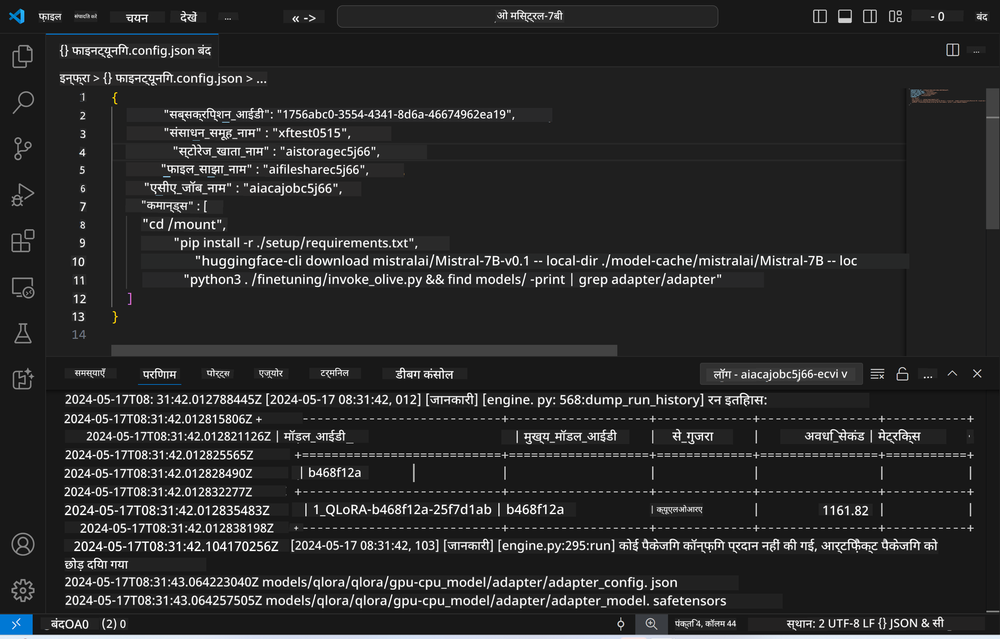
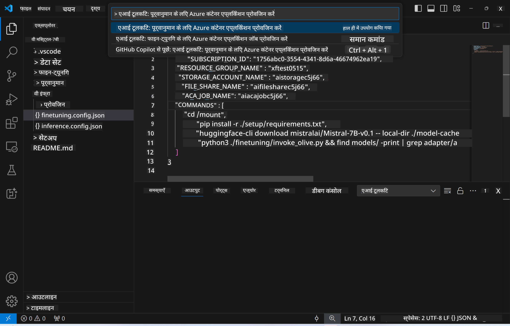
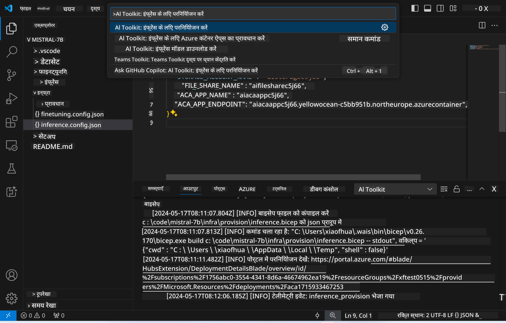
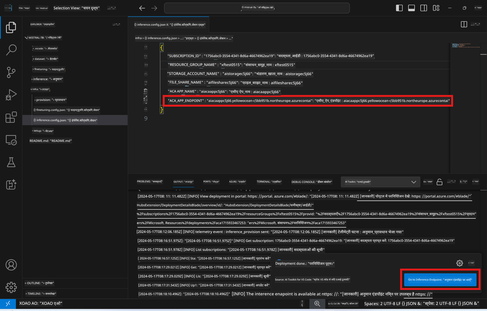

<!--
CO_OP_TRANSLATOR_METADATA:
{
  "original_hash": "8782d16f62bc2bdae1f0b38f39a2417c",
  "translation_date": "2025-04-04T17:53:12+00:00",
  "source_file": "md\\01.Introduction\\03\\Remote_Interence.md",
  "language_code": "hi"
}
-->
# फाइन-ट्यून किए गए मॉडल के साथ रिमोट इंफेरेंस

रिमोट वातावरण में एडॉप्टर को प्रशिक्षित करने के बाद, मॉडल के साथ इंटरैक्ट करने के लिए एक साधारण Gradio एप्लिकेशन का उपयोग करें।



### Azure संसाधनों का प्रावधान करें
रिमोट इंफेरेंस के लिए Azure संसाधनों को सेटअप करने के लिए कमांड पैलेट से `AI Toolkit: Provision Azure Container Apps for inference` को निष्पादित करें। इस सेटअप के दौरान, आपको अपनी Azure Subscription और resource group का चयन करने के लिए कहा जाएगा।  


डिफ़ॉल्ट रूप से, इंफेरेंस के लिए सब्सक्रिप्शन और resource group वही होना चाहिए जो फाइन-ट्यूनिंग के लिए उपयोग किया गया था। इंफेरेंस उसी Azure Container App Environment का उपयोग करेगा और Azure Files में संग्रहीत मॉडल और मॉडल एडॉप्टर तक पहुंच बनाएगा, जो फाइन-ट्यूनिंग चरण के दौरान उत्पन्न हुए थे। 

## AI Toolkit का उपयोग 

### इंफेरेंस के लिए डिप्लॉयमेंट  
यदि आप इंफेरेंस कोड को संशोधित करना चाहते हैं या इंफेरेंस मॉडल को पुनः लोड करना चाहते हैं, तो कृपया `AI Toolkit: Deploy for inference` कमांड निष्पादित करें। यह आपके नवीनतम कोड को ACA के साथ सिंक्रोनाइज़ करेगा और प्रतिकृति को पुनः प्रारंभ करेगा।  



डिप्लॉयमेंट सफलतापूर्वक पूरा होने के बाद, मॉडल अब इस एंडपॉइंट का उपयोग करके मूल्यांकन के लिए तैयार है।

### इंफेरेंस API तक पहुंच

आप इंफेरेंस API तक पहुंचने के लिए VSCode नोटिफिकेशन में दिखाए गए "*Go to Inference Endpoint*" बटन पर क्लिक कर सकते हैं। वैकल्पिक रूप से, वेब API एंडपॉइंट `ACA_APP_ENDPOINT` में `./infra/inference.config.json` और आउटपुट पैनल में पाया जा सकता है।



> **नोट:** इंफेरेंस एंडपॉइंट को पूरी तरह से चालू होने में कुछ मिनट लग सकते हैं।

## टेम्पलेट में शामिल इंफेरेंस घटक
 
| फ़ोल्डर | सामग्री |
| ------ |--------- |
| `infra` | रिमोट ऑपरेशन्स के लिए आवश्यक सभी कॉन्फ़िगरेशन शामिल हैं। |
| `infra/provision/inference.parameters.json` | बाइसेप टेम्पलेट्स के पैरामीटर रखता है, जो Azure संसाधनों को प्रावधान करने के लिए उपयोग किए जाते हैं। |
| `infra/provision/inference.bicep` | Azure संसाधनों को प्रावधान करने के लिए टेम्पलेट्स शामिल हैं। |
| `infra/inference.config.json` | कॉन्फ़िगरेशन फ़ाइल, जो `AI Toolkit: Provision Azure Container Apps for inference` कमांड द्वारा उत्पन्न की गई है। इसे अन्य रिमोट कमांड पैलेट्स के लिए इनपुट के रूप में उपयोग किया जाता है। |

### AI Toolkit का उपयोग करके Azure संसाधन प्रावधान को कॉन्फ़िगर करना
[AI Toolkit](https://marketplace.visualstudio.com/items?itemName=ms-windows-ai-studio.windows-ai-studio) को कॉन्फ़िगर करें।

इंफेरेंस के लिए Azure Container Apps को प्रावधान करें ` command.

You can find configuration parameters in `./infra/provision/inference.parameters.json` file. Here are the details:
| Parameter | Description |
| --------- |------------ |
| `defaultCommands` | This is the commands to initiate a web API. |
| `maximumInstanceCount` | This parameter sets the maximum capacity of GPU instances. |
| `location` | This is the location where Azure resources are provisioned. The default value is the same as the chosen resource group's location. |
| `storageAccountName`, `fileShareName` `acaEnvironmentName`, `acaEnvironmentStorageName`, `acaAppName`,  `acaLogAnalyticsName` | These parameters are used to name the Azure resources for provision. By default, they will be same to the fine-tuning resource name. You can input a new, unused resource name to create your own custom-named resources, or you can input the name of an already existing Azure resource if you'd prefer to use that. For details, refer to the section [Using existing Azure Resources](../../../../../md/01.Introduction/03). |

### Using Existing Azure Resources

By default, the inference provision use the same Azure Container App Environment, Storage Account, Azure File Share, and Azure Log Analytics that were used for fine-tuning. A separate Azure Container App is created solely for the inference API. 

If you have customized the Azure resources during the fine-tuning step or want to use your own existing Azure resources for inference, specify their names in the `./infra/inference.parameters.json फ़ाइल। फिर, कमांड पैलेट से `AI Toolkit: Provision Azure Container Apps for inference` कमांड चलाएं। यह किसी भी निर्दिष्ट संसाधन को अपडेट करता है और जो गायब हैं उन्हें बनाता है।

उदाहरण के लिए, यदि आपके पास पहले से ही एक मौजूदा Azure container environment है, तो आपका `./infra/finetuning.parameters.json` इस तरह दिखना चाहिए:

```json
{
    "$schema": "https://schema.management.azure.com/schemas/2019-04-01/deploymentParameters.json#",
    "contentVersion": "1.0.0.0",
    "parameters": {
      ...
      "acaEnvironmentName": {
        "value": "<your-aca-env-name>"
      },
      "acaEnvironmentStorageName": {
        "value": null
      },
      ...
    }
  }
```

### मैनुअल प्रावधान  
यदि आप Azure संसाधनों को मैन्युअल रूप से कॉन्फ़िगर करना पसंद करते हैं, तो आप `./infra/provision` folders. If you have already set up and configured all the Azure resources without using the AI Toolkit command palette, you can simply enter the resource names in the `inference.config.json` फ़ाइल में प्रदान किए गए बाइसेप फ़ाइलों का उपयोग कर सकते हैं।

उदाहरण के लिए:

```json
{
  "SUBSCRIPTION_ID": "<your-subscription-id>",
  "RESOURCE_GROUP_NAME": "<your-resource-group-name>",
  "STORAGE_ACCOUNT_NAME": "<your-storage-account-name>",
  "FILE_SHARE_NAME": "<your-file-share-name>",
  "ACA_APP_NAME": "<your-aca-name>",
  "ACA_APP_ENDPOINT": "<your-aca-endpoint>"
}
```

**अस्वीकरण**:  
यह दस्तावेज़ AI अनुवाद सेवा [Co-op Translator](https://github.com/Azure/co-op-translator) का उपयोग करके अनुवादित किया गया है। जबकि हम सटीकता सुनिश्चित करने का प्रयास करते हैं, कृपया ध्यान दें कि स्वचालित अनुवादों में त्रुटियां या गलतियां हो सकती हैं। मूल दस्तावेज़, जो इसकी मूल भाषा में है, को प्रामाणिक स्रोत माना जाना चाहिए। महत्वपूर्ण जानकारी के लिए, पेशेवर मानव अनुवाद की सिफारिश की जाती है। इस अनुवाद के उपयोग से उत्पन्न किसी भी गलतफहमी या गलत व्याख्या के लिए हम जिम्मेदार नहीं हैं।