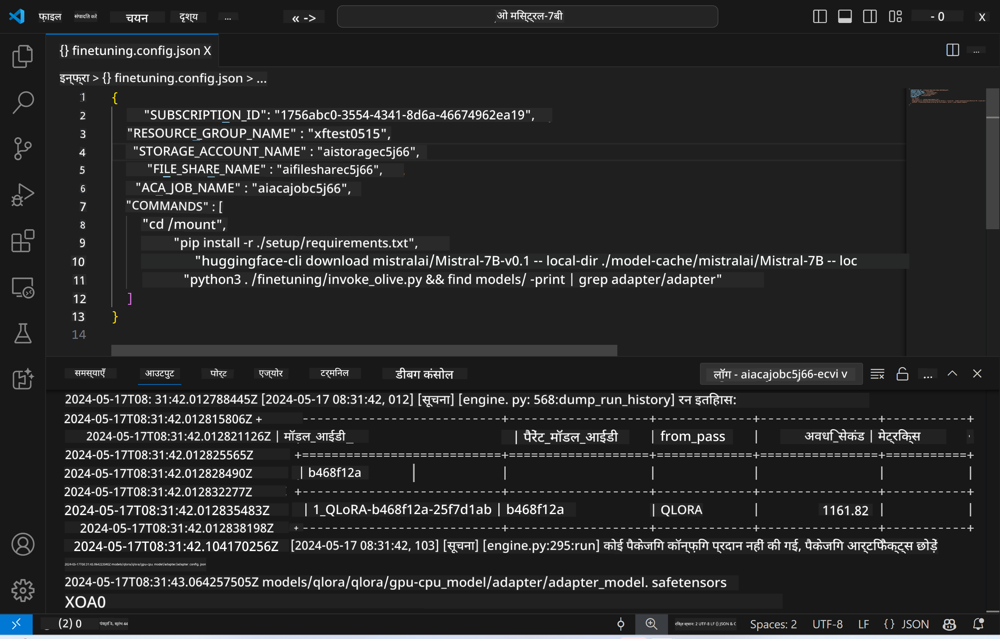

<!--
CO_OP_TRANSLATOR_METADATA:
{
  "original_hash": "a54cd3d65b6963e4e8ce21e143c3ab04",
  "translation_date": "2025-05-08T05:58:23+00:00",
  "source_file": "md/01.Introduction/03/Remote_Interence.md",
  "language_code": "hi"
}
-->
# फाइन-ट्यून किए गए मॉडल के साथ रिमोट इन्फरेंसिंग

जब एडाप्टर्स रिमोट वातावरण में ट्रेन हो जाएं, तो मॉडल के साथ इंटरैक्ट करने के लिए एक सरल Gradio एप्लिकेशन का उपयोग करें।



### Azure संसाधन सेटअप करें  
रिमोट इन्फरेंस के लिए Azure संसाधनों को सेटअप करने के लिए कमांड पैलेट से `AI Toolkit: Provision Azure Container Apps for inference` को चलाएं। इस सेटअप के दौरान, आपसे आपकी Azure सब्सक्रिप्शन और रिसोर्स ग्रुप चुनने के लिए कहा जाएगा।  


डिफ़ॉल्ट रूप से, इन्फरेंस के लिए सब्सक्रिप्शन और रिसोर्स ग्रुप फाइन-ट्यूनिंग में उपयोग किए गए वाले से मेल खाने चाहिए। इन्फरेंस उसी Azure Container App Environment का उपयोग करेगा और मॉडल और मॉडल एडाप्टर तक पहुंच बनाएगा, जो Azure Files में स्टोर होते हैं और फाइन-ट्यूनिंग चरण के दौरान बनाए गए थे।

## AI Toolkit का उपयोग

### इन्फरेंस के लिए डिप्लॉयमेंट  
यदि आप इन्फरेंस कोड को संशोधित करना चाहते हैं या इन्फरेंस मॉडल को फिर से लोड करना चाहते हैं, तो कृपया `AI Toolkit: Deploy for inference` कमांड चलाएं। यह आपके नवीनतम कोड को ACA के साथ सिंक्रनाइज़ करेगा और रेप्लिका को रीस्टार्ट करेगा।  


डिप्लॉयमेंट सफलतापूर्वक पूरा होने के बाद, मॉडल अब इस एंडपॉइंट के माध्यम से मूल्यांकन के लिए तैयार है।

### इन्फरेंस API तक पहुंच

आप VSCode नोटिफिकेशन में दिख रहे "*Go to Inference Endpoint*" बटन पर क्लिक करके इन्फरेंस API तक पहुंच सकते हैं। वैकल्पिक रूप से, वेब API एंडपॉइंट `ACA_APP_ENDPOINT` में `./infra/inference.config.json` के अंतर्गत और आउटपुट पैनल में भी पाया जा सकता है।


> **Note:** इन्फरेंस एंडपॉइंट को पूरी तरह से ऑपरेशनल होने में कुछ मिनट लग सकते हैं।

## टेम्पलेट में शामिल इन्फरेंस कंपोनेंट्स

| फ़ोल्डर | सामग्री |
| ------ |--------- |
| `infra` | रिमोट ऑपरेशंस के लिए आवश्यक सभी कॉन्फ़िगरेशन शामिल हैं। |
| `infra/provision/inference.parameters.json` | बाइसेप टेम्पलेट्स के लिए पैरामीटर रखता है, जो इन्फरेंस के लिए Azure संसाधनों के प्रावधान में उपयोग होते हैं। |
| `infra/provision/inference.bicep` | इन्फरेंस के लिए Azure संसाधनों के प्रावधान के टेम्पलेट्स शामिल हैं। |
| `infra/inference.config.json` | कॉन्फ़िगरेशन फ़ाइल, जो `AI Toolkit: Provision Azure Container Apps for inference` कमांड द्वारा जनरेट की जाती है। इसे अन्य रिमोट कमांड पैलेट के इनपुट के रूप में उपयोग किया जाता है। |

### AI Toolkit का उपयोग करके Azure Resource Provision कॉन्फ़िगर करना  
[AI Toolkit](https://marketplace.visualstudio.com/items?itemName=ms-windows-ai-studio.windows-ai-studio) को कॉन्फ़िगर करें

इन्फरेंस के लिए Azure Container Apps प्रावधान करें` command.

You can find configuration parameters in `./infra/provision/inference.parameters.json` file. Here are the details:
| Parameter | Description |
| --------- |------------ |
| `defaultCommands` | This is the commands to initiate a web API. |
| `maximumInstanceCount` | This parameter sets the maximum capacity of GPU instances. |
| `location` | This is the location where Azure resources are provisioned. The default value is the same as the chosen resource group's location. |
| `storageAccountName`, `fileShareName` `acaEnvironmentName`, `acaEnvironmentStorageName`, `acaAppName`,  `acaLogAnalyticsName` | These parameters are used to name the Azure resources for provision. By default, they will be same to the fine-tuning resource name. You can input a new, unused resource name to create your own custom-named resources, or you can input the name of an already existing Azure resource if you'd prefer to use that. For details, refer to the section [Using existing Azure Resources](../../../../../md/01.Introduction/03). |

### Using Existing Azure Resources

By default, the inference provision use the same Azure Container App Environment, Storage Account, Azure File Share, and Azure Log Analytics that were used for fine-tuning. A separate Azure Container App is created solely for the inference API. 

If you have customized the Azure resources during the fine-tuning step or want to use your own existing Azure resources for inference, specify their names in the `./infra/inference.parameters.json` फ़ाइल। फिर, कमांड पैलेट से `AI Toolkit: Provision Azure Container Apps for inference` कमांड चलाएं। यह निर्दिष्ट संसाधनों को अपडेट करेगा और जो संसाधन मौजूद नहीं हैं उन्हें बनाएगा।

उदाहरण के लिए, यदि आपके पास पहले से कोई Azure कंटेनर एनवायरनमेंट है, तो आपकी `./infra/finetuning.parameters.json` इस तरह दिखनी चाहिए:

```json
{
    "$schema": "https://schema.management.azure.com/schemas/2019-04-01/deploymentParameters.json#",
    "contentVersion": "1.0.0.0",
    "parameters": {
      ...
      "acaEnvironmentName": {
        "value": "<your-aca-env-name>"
      },
      "acaEnvironmentStorageName": {
        "value": null
      },
      ...
    }
  }
```

### मैनुअल प्राविजन  
यदि आप Azure संसाधनों को मैन्युअली कॉन्फ़िगर करना चाहते हैं, तो आप `./infra/provision` folders. If you have already set up and configured all the Azure resources without using the AI Toolkit command palette, you can simply enter the resource names in the `inference.config.json` फ़ाइल में उपलब्ध बाइसेप फ़ाइलों का उपयोग कर सकते हैं।

उदाहरण के लिए:

```json
{
  "SUBSCRIPTION_ID": "<your-subscription-id>",
  "RESOURCE_GROUP_NAME": "<your-resource-group-name>",
  "STORAGE_ACCOUNT_NAME": "<your-storage-account-name>",
  "FILE_SHARE_NAME": "<your-file-share-name>",
  "ACA_APP_NAME": "<your-aca-name>",
  "ACA_APP_ENDPOINT": "<your-aca-endpoint>"
}
```

**अस्वीकरण**:  
यह दस्तावेज़ AI अनुवाद सेवा [Co-op Translator](https://github.com/Azure/co-op-translator) का उपयोग करके अनुवादित किया गया है। जबकि हम सटीकता के लिए प्रयासरत हैं, कृपया ध्यान दें कि स्वचालित अनुवाद में त्रुटियाँ या असंगतियाँ हो सकती हैं। मूल दस्तावेज़ अपनी मूल भाषा में ही प्रामाणिक स्रोत माना जाना चाहिए। महत्वपूर्ण जानकारी के लिए, पेशेवर मानव अनुवाद की सलाह दी जाती है। इस अनुवाद के उपयोग से उत्पन्न किसी भी गलतफहमी या गलत व्याख्या के लिए हम जिम्मेदार नहीं हैं।