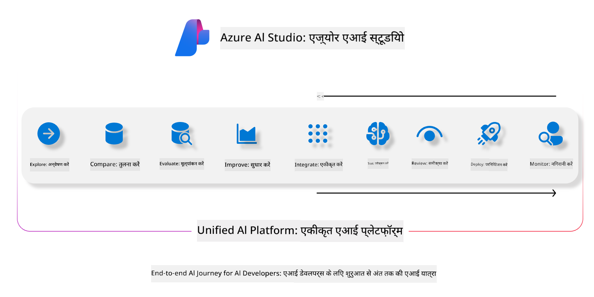
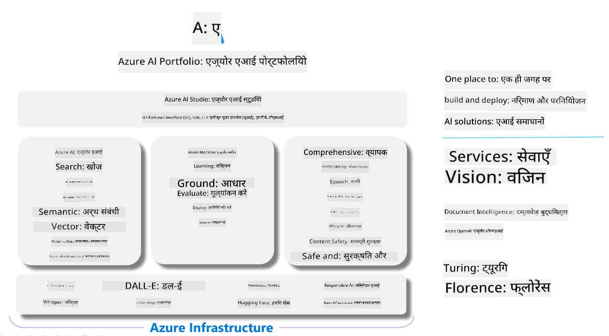

<!--
CO_OP_TRANSLATOR_METADATA:
{
  "original_hash": "5dfb4983a2e74e4b5e8317eb16fc2154",
  "translation_date": "2025-04-04T18:01:26+00:00",
  "source_file": "md\\01.Introduction\\05\\AIFoundry.md",
  "language_code": "hi"
}
-->
# **Azure AI Foundry का उपयोग करके मूल्यांकन करना**

[Azure AI Foundry](https://ai.azure.com?WT.mc_id=aiml-138114-kinfeylo) का उपयोग करके अपनी जनरेटिव AI एप्लिकेशन का मूल्यांकन कैसे करें। चाहे आप सिंगल-टर्न या मल्टी-टर्न बातचीत का आकलन कर रहे हों, Azure AI Foundry मॉडल प्रदर्शन और सुरक्षा का मूल्यांकन करने के लिए उपकरण प्रदान करता है।

## Azure AI Foundry के साथ जनरेटिव AI ऐप्स का मूल्यांकन कैसे करें
अधिक विस्तृत निर्देशों के लिए [Azure AI Foundry Documentation](https://learn.microsoft.com/azure/ai-studio/how-to/evaluate-generative-ai-app?WT.mc_id=aiml-138114-kinfeylo) देखें।

यहां शुरू करने के चरण दिए गए हैं:

## Azure AI Foundry में जनरेटिव AI मॉडल का मूल्यांकन करना

**पूर्व आवश्यकताएँ**

- CSV या JSON प्रारूप में एक टेस्ट डेटासेट।
- एक जनरेटिव AI मॉडल (जैसे Phi-3, GPT 3.5, GPT 4, या Davinci मॉडल) को डिप्लॉय किया गया हो।
- मूल्यांकन चलाने के लिए एक कंप्यूट इंस्टेंस वाला रनटाइम।

## बिल्ट-इन मूल्यांकन मेट्रिक्स

Azure AI Foundry आपको सिंगल-टर्न और जटिल, मल्टी-टर्न बातचीत दोनों का मूल्यांकन करने की सुविधा देता है।  
Retrieval Augmented Generation (RAG) परिदृश्यों के लिए, जहां मॉडल विशिष्ट डेटा में आधारित होता है, आप प्रदर्शन को बिल्ट-इन मूल्यांकन मेट्रिक्स का उपयोग करके आकलित कर सकते हैं।  
इसके अतिरिक्त, आप सामान्य सिंगल-टर्न प्रश्न उत्तर परिदृश्यों (गैर-RAG) का मूल्यांकन कर सकते हैं।

## मूल्यांकन रन बनाना

Azure AI Foundry UI से, Evaluate पेज या Prompt Flow पेज पर जाएं।  
मूल्यांकन रन सेट अप करने के लिए मूल्यांकन निर्माण विज़ार्ड का पालन करें।  
अपने मूल्यांकन के लिए एक वैकल्पिक नाम प्रदान करें।  
उस परिदृश्य का चयन करें जो आपके एप्लिकेशन के उद्देश्यों के साथ मेल खाता हो।  
मॉडल के आउटपुट का आकलन करने के लिए एक या अधिक मूल्यांकन मेट्रिक्स चुनें।

## कस्टम मूल्यांकन फ्लो (वैकल्पिक)

अधिक लचीलापन के लिए, आप एक कस्टम मूल्यांकन फ्लो स्थापित कर सकते हैं।  
अपने विशिष्ट आवश्यकताओं के आधार पर मूल्यांकन प्रक्रिया को अनुकूलित करें।

## परिणाम देखना

मूल्यांकन चलाने के बाद, Azure AI Foundry में विस्तृत मूल्यांकन मेट्रिक्स को लॉग करें, देखें और विश्लेषण करें।  
अपने एप्लिकेशन की क्षमताओं और सीमाओं के बारे में जानकारी प्राप्त करें।

**नोट** Azure AI Foundry वर्तमान में सार्वजनिक प्रीव्यू में है, इसलिए इसे प्रयोग और विकास उद्देश्यों के लिए उपयोग करें।  
प्रोडक्शन वर्कलोड्स के लिए अन्य विकल्पों पर विचार करें।  
अधिक विवरण और चरण-दर-चरण निर्देशों के लिए आधिकारिक [AI Foundry Documentation](https://learn.microsoft.com/azure/ai-studio/?WT.mc_id=aiml-138114-kinfeylo) देखें।

**अस्वीकरण**:  
यह दस्तावेज़ AI अनुवाद सेवा [Co-op Translator](https://github.com/Azure/co-op-translator) का उपयोग करके अनुवादित किया गया है। जबकि हम सटीकता सुनिश्चित करने का प्रयास करते हैं, कृपया ध्यान दें कि स्वचालित अनुवाद में त्रुटियां या अशुद्धियां हो सकती हैं। मूल दस्तावेज़ को उसकी मूल भाषा में प्रामाणिक स्रोत माना जाना चाहिए। महत्वपूर्ण जानकारी के लिए, पेशेवर मानव अनुवाद की सिफारिश की जाती है। इस अनुवाद के उपयोग से उत्पन्न किसी भी गलतफहमी या गलत व्याख्या के लिए हम उत्तरदायी नहीं हैं।