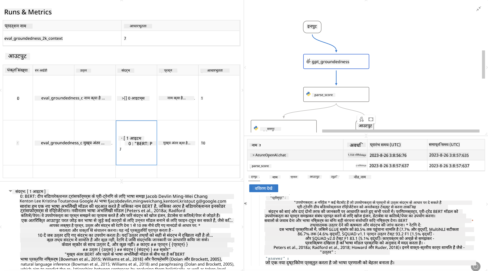

<!--
CO_OP_TRANSLATOR_METADATA:
{
  "original_hash": "01a5ee7478befb159e2b7ded29832206",
  "translation_date": "2025-04-04T18:02:59+00:00",
  "source_file": "md\\01.Introduction\\05\\Promptflow.md",
  "language_code": "hi"
}
-->
# **प्रॉम्प्टफ्लो का परिचय**

[Microsoft Prompt Flow](https://microsoft.github.io/promptflow/index.html?WT.mc_id=aiml-138114-kinfeylo) एक विज़ुअल वर्कफ़्लो ऑटोमेशन टूल है, जो उपयोगकर्ताओं को पहले से तैयार टेम्पलेट्स और कस्टम कनेक्टर्स का उपयोग करके स्वचालित वर्कफ़्लो बनाने की सुविधा देता है। इसे डेवलपर्स और बिज़नेस एनालिस्ट्स को डेटा प्रबंधन, सहयोग और प्रक्रिया अनुकूलन जैसे कार्यों के लिए तेज़ी से स्वचालित प्रक्रियाएँ बनाने में मदद करने के लिए डिज़ाइन किया गया है। प्रॉम्प्टफ्लो के साथ, उपयोगकर्ता विभिन्न सेवाओं, अनुप्रयोगों और प्रणालियों को आसानी से जोड़ सकते हैं और जटिल व्यावसायिक प्रक्रियाओं को स्वचालित कर सकते हैं।

Microsoft Prompt Flow को बड़े भाषा मॉडल्स (LLMs) द्वारा संचालित AI अनुप्रयोगों के एंड-टू-एंड विकास चक्र को सरल बनाने के लिए डिज़ाइन किया गया है। चाहे आप विचार मंथन कर रहे हों, प्रोटोटाइप बना रहे हों, परीक्षण कर रहे हों, मूल्यांकन कर रहे हों या LLM-आधारित अनुप्रयोगों को तैनात कर रहे हों, प्रॉम्प्टफ्लो इस प्रक्रिया को सरल बनाता है और आपको प्रोडक्शन क्वालिटी वाले LLM ऐप्स बनाने में सक्षम करता है।

## Microsoft Prompt Flow का उपयोग करने के मुख्य फीचर्स और लाभ:

**इंटरएक्टिव ऑथरिंग अनुभव**

प्रॉम्प्टफ्लो आपके फ्लो की संरचना का एक विज़ुअल प्रतिनिधित्व प्रदान करता है, जिससे आपके प्रोजेक्ट्स को समझना और नेविगेट करना आसान हो जाता है।  
यह कुशल फ्लो विकास और डिबगिंग के लिए एक नोटबुक-जैसा कोडिंग अनुभव प्रदान करता है।

**प्रॉम्प्ट वेरिएंट्स और ट्यूनिंग**

एकाधिक प्रॉम्प्ट वेरिएंट्स बनाएं और उनकी तुलना करें ताकि पुनरावृत्त सुधार प्रक्रिया को सुगम बनाया जा सके।  
विभिन्न प्रॉम्प्ट्स के प्रदर्शन का मूल्यांकन करें और सबसे प्रभावी प्रॉम्प्ट्स का चयन करें।

**बिल्ट-इन मूल्यांकन फ्लो**

बिल्ट-इन मूल्यांकन उपकरणों का उपयोग करके अपने प्रॉम्प्ट्स और फ्लो की गुणवत्ता और प्रभावशीलता का आकलन करें।  
यह समझें कि आपके LLM-आधारित अनुप्रयोग कितने प्रभावी हैं।

**व्यापक संसाधन**

प्रॉम्प्टफ्लो में बिल्ट-इन टूल्स, सैंपल्स और टेम्पलेट्स की एक लाइब्रेरी शामिल है।  
ये संसाधन विकास के लिए एक प्रारंभिक बिंदु के रूप में काम करते हैं, रचनात्मकता को प्रेरित करते हैं और प्रक्रिया को तेज़ करते हैं।

**सहयोग और एंटरप्राइज़ रेडीनेस**

टीम सहयोग का समर्थन करें, जिससे कई उपयोगकर्ता प्रॉम्प्ट इंजीनियरिंग प्रोजेक्ट्स पर एक साथ काम कर सकें।  
वर्ज़न कंट्रोल बनाए रखें और ज्ञान को प्रभावी ढंग से साझा करें।  
प्रॉम्प्ट इंजीनियरिंग प्रक्रिया को विकास, मूल्यांकन, तैनाती और निगरानी तक सुव्यवस्थित करें।

## प्रॉम्प्टफ्लो में मूल्यांकन

Microsoft Prompt Flow में, मूल्यांकन यह आकलन करने में एक महत्वपूर्ण भूमिका निभाता है कि आपके AI मॉडल कितने अच्छा प्रदर्शन करते हैं। आइए देखें कि आप प्रॉम्प्टफ्लो में मूल्यांकन फ्लो और मेट्रिक्स को कैसे कस्टमाइज़ कर सकते हैं:

**प्रॉम्प्टफ्लो में मूल्यांकन को समझना**

प्रॉम्प्टफ्लो में, एक फ्लो इनपुट को प्रोसेस करने और आउटपुट जनरेट करने वाले नोड्स का अनुक्रम दर्शाता है। मूल्यांकन फ्लो विशेष प्रकार के फ्लो होते हैं जो विशिष्ट मानदंडों और लक्ष्यों के आधार पर रन के प्रदर्शन का आकलन करने के लिए डिज़ाइन किए गए हैं।

**मूल्यांकन फ्लो की मुख्य विशेषताएँ**

ये आमतौर पर परीक्षण किए जा रहे फ्लो के बाद चलाए जाते हैं, और उसके आउटपुट का उपयोग करते हैं।  
ये स्कोर या मेट्रिक्स की गणना करते हैं ताकि परीक्षण किए गए फ्लो के प्रदर्शन को मापा जा सके।  
मेट्रिक्स में सटीकता, प्रासंगिकता स्कोर या अन्य उपयुक्त माप शामिल हो सकते हैं।

### मूल्यांकन फ्लो को कस्टमाइज़ करना

**इनपुट्स को परिभाषित करना**

मूल्यांकन फ्लो को परीक्षण किए जा रहे रन के आउटपुट्स को इनपुट के रूप में लेने की आवश्यकता होती है।  
इनपुट्स को मानक फ्लो के समान परिभाषित करें।  
उदाहरण के लिए, यदि आप एक QnA फ्लो का मूल्यांकन कर रहे हैं, तो एक इनपुट को "answer" नाम दें।  
यदि आप एक वर्गीकरण फ्लो का मूल्यांकन कर रहे हैं, तो एक इनपुट को "category" नाम दें।  
ग्राउंड ट्रुथ इनपुट्स (जैसे, वास्तविक लेबल) की भी आवश्यकता हो सकती है।

**आउटपुट्स और मेट्रिक्स**

मूल्यांकन फ्लो परिणाम उत्पन्न करते हैं जो परीक्षण किए गए फ्लो के प्रदर्शन को मापते हैं।  
मेट्रिक्स की गणना Python या LLM (Large Language Models) का उपयोग करके की जा सकती है।  
संबंधित मेट्रिक्स को लॉग करने के लिए log_metric() फ़ंक्शन का उपयोग करें।

**कस्टमाइज़ किए गए मूल्यांकन फ्लो का उपयोग करना**

अपने विशिष्ट कार्यों और उद्देश्यों के अनुसार अपना खुद का मूल्यांकन फ्लो विकसित करें।  
अपने मूल्यांकन लक्ष्यों के आधार पर मेट्रिक्स को कस्टमाइज़ करें।  
बड़े पैमाने पर परीक्षण के लिए बैच रन पर इस कस्टमाइज़ किए गए मूल्यांकन फ्लो को लागू करें।

## बिल्ट-इन मूल्यांकन विधियाँ

प्रॉम्प्टफ्लो बिल्ट-इन मूल्यांकन विधियाँ भी प्रदान करता है।  
आप बैच रन सबमिट कर सकते हैं और इन विधियों का उपयोग करके यह मूल्यांकन कर सकते हैं कि आपका फ्लो बड़े डेटा सेट्स के साथ कितना अच्छा प्रदर्शन करता है।  
मूल्यांकन परिणाम देखें, मेट्रिक्स की तुलना करें और आवश्यकता अनुसार सुधार करें।  
याद रखें, मूल्यांकन यह सुनिश्चित करने के लिए आवश्यक है कि आपके AI मॉडल वांछित मानदंडों और लक्ष्यों को पूरा करते हैं।  
Microsoft Prompt Flow में मूल्यांकन फ्लो विकसित करने और उपयोग करने के विस्तृत निर्देशों के लिए आधिकारिक दस्तावेज़ों का अन्वेषण करें।

संक्षेप में, Microsoft Prompt Flow डेवलपर्स को प्रॉम्प्ट इंजीनियरिंग को सरल बनाकर और एक मजबूत विकास वातावरण प्रदान करके उच्च-गुणवत्ता वाले LLM अनुप्रयोग बनाने में सक्षम बनाता है।  
यदि आप LLMs के साथ काम कर रहे हैं, तो प्रॉम्प्टफ्लो एक मूल्यवान टूल है जिसे आपको ज़रूर आज़माना चाहिए।  
[Prompt Flow Evaluation Documents](https://learn.microsoft.com/azure/machine-learning/prompt-flow/how-to-develop-an-evaluation-flow?view=azureml-api-2?WT.mc_id=aiml-138114-kinfeylo) का अन्वेषण करें, जो Microsoft Prompt Flow में मूल्यांकन फ्लो विकसित करने और उपयोग करने के विस्तृत निर्देश प्रदान करता है।

**अस्वीकरण**:  
यह दस्तावेज़ AI अनुवाद सेवा [Co-op Translator](https://github.com/Azure/co-op-translator) का उपयोग करके अनुवादित किया गया है। जबकि हम सटीकता सुनिश्चित करने का प्रयास करते हैं, कृपया ध्यान दें कि स्वचालित अनुवादों में त्रुटियां या अशुद्धियां हो सकती हैं। मूल भाषा में लिखा गया मूल दस्तावेज़ ही प्रामाणिक स्रोत माना जाना चाहिए। महत्वपूर्ण जानकारी के लिए, पेशेवर मानव अनुवाद की सिफारिश की जाती है। इस अनुवाद का उपयोग करने से उत्पन्न किसी भी गलतफहमी या गलत व्याख्या के लिए हम जिम्मेदार नहीं हैं।