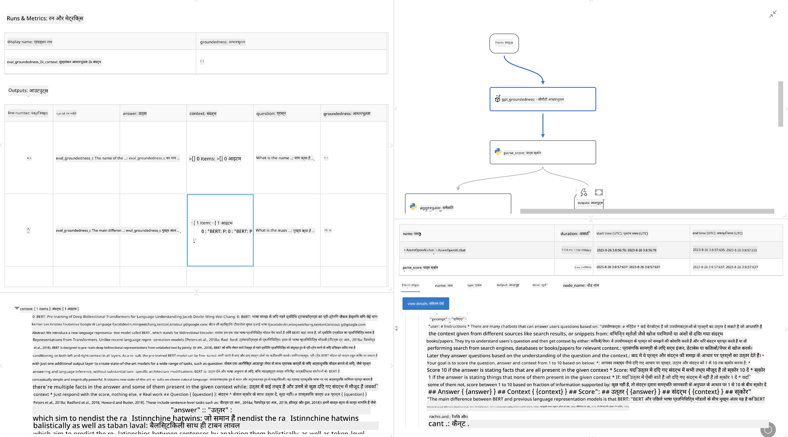

<!--
CO_OP_TRANSLATOR_METADATA:
{
  "original_hash": "3cbe7629d254f1043193b7fe22524d55",
  "translation_date": "2025-05-08T06:08:18+00:00",
  "source_file": "md/01.Introduction/05/Promptflow.md",
  "language_code": "hi"
}
-->
# **प्रॉम्प्टफ्लो का परिचय**

[Microsoft Prompt Flow](https://microsoft.github.io/promptflow/index.html?WT.mc_id=aiml-138114-kinfeylo) एक विजुअल वर्कफ़्लो ऑटोमेशन टूल है जो उपयोगकर्ताओं को प्री-बिल्ट टेम्पलेट्स और कस्टम कनेक्टर्स का उपयोग करके ऑटोमेटेड वर्कफ़्लो बनाने की सुविधा देता है। इसे डेवलपर्स और बिजनेस एनालिस्ट्स के लिए इस तरह से डिजाइन किया गया है कि वे डेटा प्रबंधन, सहयोग, और प्रक्रिया अनुकूलन जैसे कार्यों के लिए जल्दी से ऑटोमेटेड प्रक्रियाएं बना सकें। Prompt Flow के साथ, उपयोगकर्ता विभिन्न सेवाओं, एप्लिकेशन और सिस्टम्स को आसानी से जोड़ सकते हैं और जटिल व्यावसायिक प्रक्रियाओं को स्वचालित कर सकते हैं।

Microsoft Prompt Flow को बड़े भाषा मॉडल (LLMs) द्वारा संचालित AI एप्लिकेशन के एंड-टू-एंड विकास चक्र को सरल बनाने के लिए डिज़ाइन किया गया है। चाहे आप विचार कर रहे हों, प्रोटोटाइप बना रहे हों, परीक्षण कर रहे हों, मूल्यांकन कर रहे हों या LLM आधारित एप्लिकेशन तैनात कर रहे हों, Prompt Flow इस प्रक्रिया को आसान बनाता है और आपको उत्पादन गुणवत्ता वाले LLM ऐप्स बनाने में मदद करता है।

## Microsoft Prompt Flow के प्रमुख फीचर्स और लाभ:

**इंटरएक्टिव ऑथरिंग एक्सपीरियंस**

Prompt Flow आपके फ्लो की संरचना का एक विजुअल प्रतिनिधित्व प्रदान करता है, जिससे आपके प्रोजेक्ट्स को समझना और नेविगेट करना आसान हो जाता है।  
यह कुशल फ्लो विकास और डिबगिंग के लिए नोटबुक जैसा कोडिंग अनुभव देता है।

**प्रॉम्प्ट वेरिएंट्स और ट्यूनिंग**

कई प्रॉम्प्ट वेरिएंट्स बनाएं और तुलना करें ताकि एक पुनरावृत्त सुधार प्रक्रिया को सरल बनाया जा सके। विभिन्न प्रॉम्प्ट्स के प्रदर्शन का मूल्यांकन करें और सबसे प्रभावी चुनें।

**बिल्ट-इन इवैल्यूएशन फ्लोज़**  
अपने प्रॉम्प्ट्स और फ्लोज़ की गुणवत्ता और प्रभावशीलता का मूल्यांकन बिल्ट-इन इवैल्यूएशन टूल्स के माध्यम से करें।  
समझें कि आपके LLM आधारित एप्लिकेशन कितने प्रभावी रूप से काम कर रहे हैं।

**व्यापक संसाधन**

Prompt Flow में बिल्ट-इन टूल्स, सैंपल्स और टेम्पलेट्स की एक लाइब्रेरी शामिल है। ये संसाधन विकास के लिए शुरुआती बिंदु के रूप में काम करते हैं, रचनात्मकता को प्रेरित करते हैं, और प्रक्रिया को तेज करते हैं।

**सहयोग और एंटरप्राइज रेडीनेस**

प्रॉम्प्ट इंजीनियरिंग प्रोजेक्ट्स पर एक साथ काम करने के लिए टीम सहयोग का समर्थन करें।  
वर्शन कंट्रोल बनाए रखें और ज्ञान को प्रभावी ढंग से साझा करें। विकास, मूल्यांकन से लेकर तैनाती और निगरानी तक पूरे प्रॉम्प्ट इंजीनियरिंग प्रक्रिया को सरल बनाएं।

## Prompt Flow में मूल्यांकन

Microsoft Prompt Flow में, मूल्यांकन AI मॉडल के प्रदर्शन को समझने में महत्वपूर्ण भूमिका निभाता है। आइए देखें कि आप Prompt Flow के अंदर मूल्यांकन फ्लोज़ और मेट्रिक्स को कैसे कस्टमाइज़ कर सकते हैं:

**Prompt Flow में मूल्यांकन को समझना**

Prompt Flow में, एक फ्लो नोड्स की एक श्रृंखला होती है जो इनपुट को प्रोसेस कर आउटपुट जनरेट करती है। मूल्यांकन फ्लोज़ विशेष प्रकार के फ्लोज़ होते हैं जो किसी रन के प्रदर्शन का विशिष्ट मानदंडों और लक्ष्यों के आधार पर मूल्यांकन करते हैं।

**मूल्यांकन फ्लोज़ की प्रमुख विशेषताएँ**

ये आमतौर पर परीक्षण किए जा रहे फ्लो के बाद चलते हैं और उसके आउटपुट का उपयोग करते हैं। ये परीक्षण किए गए फ्लो के प्रदर्शन को मापने के लिए स्कोर या मेट्रिक्स की गणना करते हैं। मेट्रिक्स में सटीकता, प्रासंगिकता स्कोर या अन्य प्रासंगिक माप शामिल हो सकते हैं।

### मूल्यांकन फ्लोज़ को कस्टमाइज़ करना

**इनपुट्स को परिभाषित करना**

मूल्यांकन फ्लोज़ को परीक्षण किए जा रहे रन के आउटपुट लेने होते हैं। इनपुट्स को सामान्य फ्लोज़ की तरह परिभाषित करें।  
उदाहरण के लिए, यदि आप QnA फ्लो का मूल्यांकन कर रहे हैं, तो एक इनपुट का नाम "answer" रखें। यदि वर्गीकरण फ्लो का मूल्यांकन कर रहे हैं, तो इनपुट का नाम "category" रखें। ग्राउंड ट्रुथ इनपुट्स (जैसे वास्तविक लेबल) भी आवश्यक हो सकते हैं।

**आउटपुट्स और मेट्रिक्स**

मूल्यांकन फ्लोज़ ऐसे परिणाम उत्पन्न करते हैं जो परीक्षण किए गए फ्लो के प्रदर्शन को मापते हैं। मेट्रिक्स Python या LLM (बड़े भाषा मॉडल) का उपयोग करके गणना किए जा सकते हैं। प्रासंगिक मेट्रिक्स लॉग करने के लिए log_metric() फ़ंक्शन का उपयोग करें।

**कस्टमाइज्ड मूल्यांकन फ्लोज़ का उपयोग**

अपने विशिष्ट कार्यों और उद्देश्यों के अनुसार अपना मूल्यांकन फ्लो विकसित करें। अपने मूल्यांकन लक्ष्यों के आधार पर मेट्रिक्स को कस्टमाइज़ करें।  
बड़े पैमाने पर परीक्षण के लिए इस कस्टम मूल्यांकन फ्लो को बैच रन पर लागू करें।

## बिल्ट-इन मूल्यांकन विधियाँ

Prompt Flow बिल्ट-इन मूल्यांकन विधियाँ भी प्रदान करता है।  
आप बैच रन सबमिट कर सकते हैं और इन विधियों का उपयोग करके देख सकते हैं कि आपका फ्लो बड़े डेटा सेट के साथ कैसा प्रदर्शन करता है।  
मूल्यांकन परिणाम देखें, मेट्रिक्स की तुलना करें, और आवश्यकतानुसार पुनरावृत्ति करें।  
याद रखें, मूल्यांकन यह सुनिश्चित करने के लिए आवश्यक है कि आपके AI मॉडल वांछित मानदंडों और लक्ष्यों को पूरा करें। Microsoft Prompt Flow में मूल्यांकन फ्लोज़ विकसित करने और उपयोग करने के लिए विस्तृत निर्देशों के लिए आधिकारिक दस्तावेज़ देखें।

संक्षेप में, Microsoft Prompt Flow डेवलपर्स को उच्च गुणवत्ता वाले LLM एप्लिकेशन बनाने में सक्षम बनाता है, प्रॉम्प्ट इंजीनियरिंग को सरल बनाकर और एक मजबूत विकास वातावरण प्रदान करके। यदि आप LLMs के साथ काम कर रहे हैं, तो Prompt Flow एक मूल्यवान टूल है जिसे आपको अवश्य आज़माना चाहिए। Microsoft Prompt Flow में मूल्यांकन फ्लोज़ विकसित करने और उपयोग करने के लिए विस्तृत निर्देशों के लिए [Prompt Flow Evaluation Documents](https://learn.microsoft.com/azure/machine-learning/prompt-flow/how-to-develop-an-evaluation-flow?view=azureml-api-2?WT.mc_id=aiml-138114-kinfeylo) देखें।

**अस्वीकरण**:  
यह दस्तावेज़ AI अनुवाद सेवा [Co-op Translator](https://github.com/Azure/co-op-translator) का उपयोग करके अनुवादित किया गया है। जबकि हम सटीकता के लिए प्रयासरत हैं, कृपया ध्यान रखें कि स्वचालित अनुवादों में त्रुटियाँ या असंगतियाँ हो सकती हैं। मूल दस्तावेज़ उसकी मूल भाषा में ही अधिकारिक स्रोत माना जाना चाहिए। महत्वपूर्ण जानकारी के लिए, पेशेवर मानव अनुवाद की सलाह दी जाती है। इस अनुवाद के उपयोग से उत्पन्न किसी भी गलतफहमी या गलत व्याख्या के लिए हम उत्तरदायी नहीं हैं।