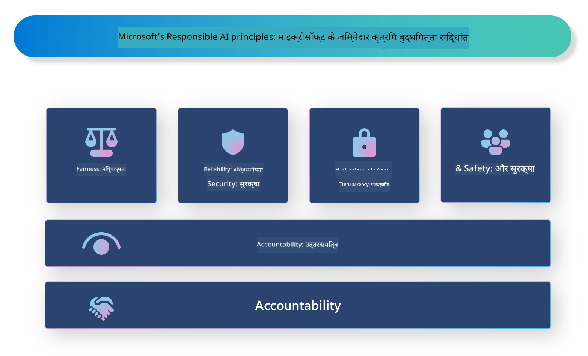

<!--
CO_OP_TRANSLATOR_METADATA:
{
  "original_hash": "3b3107c2477241058ef506743188f399",
  "translation_date": "2025-04-04T18:04:17+00:00",
  "source_file": "md\\01.Introduction\\05\\ResponsibleAI.md",
  "language_code": "hi"
}
-->
# **जिम्मेदार AI का परिचय**

[Microsoft Responsible AI](https://www.microsoft.com/ai/responsible-ai?WT.mc_id=aiml-138114-kinfeylo) एक पहल है जिसका उद्देश्य डेवलपर्स और संगठनों को ऐसे AI सिस्टम बनाने में मदद करना है जो पारदर्शी, भरोसेमंद और उत्तरदायी हों। यह पहल नैतिक सिद्धांतों जैसे कि गोपनीयता, निष्पक्षता और पारदर्शिता के साथ मेल खाते हुए जिम्मेदार AI समाधान विकसित करने के लिए मार्गदर्शन और संसाधन प्रदान करती है। हम जिम्मेदार AI सिस्टम बनाने से जुड़े कुछ चुनौतियों और सर्वोत्तम प्रथाओं का भी अन्वेषण करेंगे।

## Microsoft Responsible AI का अवलोकन

**नैतिक सिद्धांत**

Microsoft Responsible AI एक नैतिक सिद्धांतों के सेट द्वारा निर्देशित है, जैसे गोपनीयता, निष्पक्षता, पारदर्शिता, उत्तरदायित्व और सुरक्षा। इन सिद्धांतों को यह सुनिश्चित करने के लिए डिज़ाइन किया गया है कि AI सिस्टम नैतिक और जिम्मेदार तरीके से विकसित किए जाएं।

**पारदर्शी AI**

Microsoft Responsible AI AI सिस्टम में पारदर्शिता के महत्व पर जोर देता है। इसमें यह सुनिश्चित करना शामिल है कि AI मॉडल कैसे काम करते हैं, इसके स्पष्ट स्पष्टीकरण प्रदान किए जाएं, और डेटा स्रोत और एल्गोरिदम सार्वजनिक रूप से उपलब्ध हों।

**उत्तरदायी AI**

[Microsoft Responsible AI](https://www.microsoft.com/ai/responsible-ai?WT.mc_id=aiml-138114-kinfeylo) उत्तरदायी AI सिस्टम के विकास को बढ़ावा देता है, जो यह समझने में मदद कर सकते हैं कि AI मॉडल निर्णय कैसे लेते हैं। यह उपयोगकर्ताओं को AI सिस्टम के आउटपुट को समझने और उन पर विश्वास करने में मदद कर सकता है।

**समावेशिता**

AI सिस्टम सभी के लिए लाभकारी होने चाहिए। Microsoft का लक्ष्य ऐसा समावेशी AI बनाना है जो विविध दृष्टिकोणों पर विचार करे और पूर्वाग्रह या भेदभाव से बचे।

**विश्वसनीयता और सुरक्षा**

AI सिस्टम की विश्वसनीयता और सुरक्षा सुनिश्चित करना अत्यंत महत्वपूर्ण है। Microsoft मजबूत मॉडल बनाने पर ध्यान केंद्रित करता है जो लगातार प्रदर्शन करें और हानिकारक परिणामों से बचें।

**AI में निष्पक्षता**

Microsoft Responsible AI मानता है कि AI सिस्टम पूर्वाग्रहों को बढ़ावा दे सकते हैं यदि वे पूर्वाग्रही डेटा या एल्गोरिदम पर प्रशिक्षित किए गए हों। यह पहल निष्पक्ष AI सिस्टम विकसित करने के लिए मार्गदर्शन प्रदान करती है जो जाति, लिंग, या आयु जैसे कारकों के आधार पर भेदभाव न करें।

**गोपनीयता और सुरक्षा**

Microsoft Responsible AI AI सिस्टम में उपयोगकर्ता गोपनीयता और डेटा सुरक्षा की रक्षा के महत्व पर जोर देता है। इसमें मजबूत डेटा एन्क्रिप्शन और एक्सेस कंट्रोल लागू करना, साथ ही AI सिस्टम की कमजोरियों के लिए नियमित ऑडिट करना शामिल है।

**उत्तरदायित्व और जिम्मेदारी**

Microsoft Responsible AI AI विकास और तैनाती में उत्तरदायित्व और जिम्मेदारी को बढ़ावा देता है। इसमें यह सुनिश्चित करना शामिल है कि डेवलपर्स और संगठन AI सिस्टम से जुड़े संभावित जोखिमों से अवगत हों और उन जोखिमों को कम करने के लिए कदम उठाएं।

## जिम्मेदार AI सिस्टम बनाने के लिए सर्वोत्तम प्रथाएं

**विविध डेटा सेट का उपयोग करके AI मॉडल विकसित करें**

AI सिस्टम में पूर्वाग्रह से बचने के लिए, यह महत्वपूर्ण है कि विविध डेटा सेट का उपयोग किया जाए जो विभिन्न दृष्टिकोणों और अनुभवों का प्रतिनिधित्व करते हों।

**व्याख्यात्मक AI तकनीकों का उपयोग करें**

व्याख्यात्मक AI तकनीकें उपयोगकर्ताओं को यह समझने में मदद कर सकती हैं कि AI मॉडल निर्णय कैसे लेते हैं, जिससे सिस्टम पर विश्वास बढ़ सकता है।

**AI सिस्टम की कमजोरियों के लिए नियमित रूप से ऑडिट करें**

AI सिस्टम के नियमित ऑडिट संभावित जोखिमों और कमजोरियों की पहचान करने में मदद कर सकते हैं जिन्हें संबोधित करने की आवश्यकता है।

**मजबूत डेटा एन्क्रिप्शन और एक्सेस कंट्रोल लागू करें**

डेटा एन्क्रिप्शन और एक्सेस कंट्रोल AI सिस्टम में उपयोगकर्ता की गोपनीयता और सुरक्षा की रक्षा कर सकते हैं।

**AI विकास में नैतिक सिद्धांतों का पालन करें**

निष्पक्षता, पारदर्शिता, और उत्तरदायित्व जैसे नैतिक सिद्धांतों का पालन करने से AI सिस्टम में विश्वास बनाने और उन्हें जिम्मेदार तरीके से विकसित करने में मदद मिल सकती है।

## जिम्मेदार AI के लिए AI Foundry का उपयोग

[Azure AI Foundry](https://ai.azure.com?WT.mc_id=aiml-138114-kinfeylo) एक शक्तिशाली प्लेटफ़ॉर्म है जो डेवलपर्स और संगठनों को बुद्धिमान, अत्याधुनिक, बाजार के लिए तैयार, और जिम्मेदार एप्लिकेशन तेजी से बनाने की अनुमति देता है। Azure AI Foundry की कुछ मुख्य विशेषताएं और क्षमताएं निम्नलिखित हैं:

**आउट-ऑफ-द-बॉक्स APIs और मॉडल**

Azure AI Foundry प्री-बिल्ट और कस्टमाइज़ेबल APIs और मॉडल प्रदान करता है। ये कई AI कार्यों को कवर करते हैं, जिनमें जनरेटिव AI, बातचीत के लिए प्राकृतिक भाषा प्रसंस्करण, खोज, निगरानी, अनुवाद, वाक्, दृष्टि और निर्णय-निर्माण शामिल हैं।

**प्रॉम्प्ट फ्लो**

Azure AI Foundry में प्रॉम्प्ट फ्लो आपको बातचीत आधारित AI अनुभव बनाने में सक्षम बनाता है। यह आपको चैटबॉट्स, वर्चुअल असिस्टेंट्स, और अन्य इंटरैक्टिव एप्लिकेशन बनाने के लिए बातचीत प्रवाह को डिज़ाइन और प्रबंधित करने की अनुमति देता है।

**रिट्रीवल ऑगमेंटेड जेनरेशन (RAG)**

RAG एक तकनीक है जो रिट्रीवल-आधारित और जेनरेटिव-आधारित दृष्टिकोणों को संयोजित करती है। यह पूर्व-मौजूद ज्ञान (रिट्रीवल) और रचनात्मक पीढ़ी (जेनरेशन) दोनों का उपयोग करके उत्पन्न प्रतिक्रियाओं की गुणवत्ता को बढ़ाती है।

**जनरेटिव AI के लिए मूल्यांकन और निगरानी मेट्रिक्स**

Azure AI Foundry जनरेटिव AI मॉडल का मूल्यांकन और निगरानी करने के लिए उपकरण प्रदान करता है। आप उनके प्रदर्शन, निष्पक्षता, और अन्य महत्वपूर्ण मेट्रिक्स का आकलन कर सकते हैं ताकि जिम्मेदार तैनाती सुनिश्चित हो सके। इसके अलावा, यदि आपने एक डैशबोर्ड बनाया है, तो आप Azure Machine Learning Studio में नो-कोड UI का उपयोग करके Responsible AI Dashboard और संबंधित स्कोरकार्ड को कस्टमाइज़ और जनरेट कर सकते हैं। यह स्कोरकार्ड आपको निष्पक्षता, फीचर महत्व, और अन्य जिम्मेदार तैनाती विचारों से संबंधित प्रमुख अंतर्दृष्टि तकनीकी और गैर-तकनीकी हितधारकों के साथ साझा करने में मदद करता है।

जिम्मेदार AI के साथ AI Foundry का उपयोग करने के लिए आप निम्नलिखित सर्वोत्तम प्रथाओं का पालन कर सकते हैं:

**अपने AI सिस्टम की समस्या और उद्देश्यों को परिभाषित करें**

विकास प्रक्रिया शुरू करने से पहले, यह महत्वपूर्ण है कि उस समस्या या उद्देश्य को स्पष्ट रूप से परिभाषित किया जाए जिसे आपका AI सिस्टम हल करना चाहता है। यह आपको डेटा, एल्गोरिदम, और संसाधनों की पहचान करने में मदद करेगा जो एक प्रभावी मॉडल बनाने के लिए आवश्यक हैं।

**संबंधित डेटा इकट्ठा करें और पूर्व-प्रसंस्कृत करें**

AI सिस्टम के प्रशिक्षण में उपयोग किए गए डेटा की गुणवत्ता और मात्रा इसके प्रदर्शन पर महत्वपूर्ण प्रभाव डाल सकती है। इसलिए, यह महत्वपूर्ण है कि प्रासंगिक डेटा को इकट्ठा करें, साफ करें, पूर्व-प्रसंस्कृत करें, और यह सुनिश्चित करें कि यह उस जनसंख्या या समस्या का प्रतिनिधित्व करता है जिसे आप हल करने की कोशिश कर रहे हैं।

**उपयुक्त मूल्यांकन चुनें**

विभिन्न मूल्यांकन एल्गोरिदम उपलब्ध हैं। यह महत्वपूर्ण है कि आपके डेटा और समस्या के आधार पर सबसे उपयुक्त एल्गोरिदम चुना जाए।

**मॉडल का मूल्यांकन और व्याख्या करें**

एक बार जब आपने AI मॉडल बना लिया हो, तो यह महत्वपूर्ण है कि उसके प्रदर्शन का मूल्यांकन उचित मेट्रिक्स का उपयोग करके किया जाए और परिणामों को पारदर्शी तरीके से व्याख्या किया जाए। यह आपको मॉडल में किसी भी पूर्वाग्रह या सीमाओं की पहचान करने और आवश्यकतानुसार सुधार करने में मदद करेगा।

**पारदर्शिता और व्याख्यात्मकता सुनिश्चित करें**

AI सिस्टम पारदर्शी और व्याख्यात्मक होने चाहिए ताकि उपयोगकर्ता यह समझ सकें कि वे कैसे काम करते हैं और निर्णय कैसे लिए जाते हैं। यह विशेष रूप से उन अनुप्रयोगों के लिए महत्वपूर्ण है जिनका मानव जीवन पर महत्वपूर्ण प्रभाव पड़ता है, जैसे स्वास्थ्य देखभाल, वित्त, और कानूनी प्रणाली।

**मॉडल की निगरानी और अद्यतन करें**

AI सिस्टम को यह सुनिश्चित करने के लिए लगातार निगरानी और अद्यतन किया जाना चाहिए कि वे समय के साथ सटीक और प्रभावी बने रहें। इसके लिए मॉडल का निरंतर रखरखाव, परीक्षण और पुनःप्रशिक्षण आवश्यक है।

अंत में, Microsoft Responsible AI एक पहल है जिसका उद्देश्य डेवलपर्स और संगठनों को ऐसे AI सिस्टम बनाने में मदद करना है जो पारदर्शी, भरोसेमंद और उत्तरदायी हों। याद रखें कि जिम्मेदार AI का कार्यान्वयन अत्यंत महत्वपूर्ण है, और Azure AI Foundry संगठनों के लिए इसे व्यावहारिक बनाने का प्रयास करता है। नैतिक सिद्धांतों और सर्वोत्तम प्रथाओं का पालन करके, हम यह सुनिश्चित कर सकते हैं कि AI सिस्टम जिम्मेदारी से विकसित और तैनात किए जाएं, जिससे समाज को समग्र रूप से लाभ हो।

**अस्वीकरण**:  
यह दस्तावेज़ AI अनुवाद सेवा [Co-op Translator](https://github.com/Azure/co-op-translator) का उपयोग करके अनुवादित किया गया है। जबकि हम सटीकता के लिए प्रयासरत हैं, कृपया ध्यान दें कि स्वचालित अनुवाद में त्रुटियां या अशुद्धियां हो सकती हैं। मूल दस्तावेज़, जो इसकी मूल भाषा में है, को आधिकारिक स्रोत माना जाना चाहिए। महत्वपूर्ण जानकारी के लिए, पेशेवर मानव अनुवाद की अनुशंसा की जाती है। इस अनुवाद के उपयोग से उत्पन्न किसी भी गलतफहमी या गलत व्याख्या के लिए हम उत्तरदायी नहीं हैं।