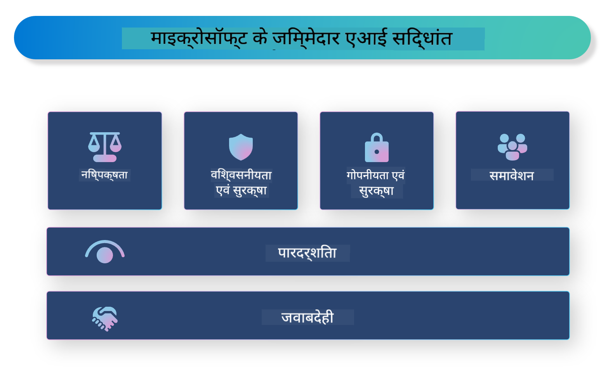

<!--
CO_OP_TRANSLATOR_METADATA:
{
  "original_hash": "805b96b20152936d8f4c587d90d6e06e",
  "translation_date": "2025-05-08T06:06:34+00:00",
  "source_file": "md/01.Introduction/05/ResponsibleAI.md",
  "language_code": "hi"
}
-->
# **Responsible AI का परिचय**

[Microsoft Responsible AI](https://www.microsoft.com/ai/responsible-ai?WT.mc_id=aiml-138114-kinfeylo) एक पहल है जिसका उद्देश्य डेवलपर्स और संगठनों को ऐसे AI सिस्टम बनाने में मदद करना है जो पारदर्शी, भरोसेमंद और जिम्मेदार हों। यह पहल जिम्मेदार AI समाधान विकसित करने के लिए मार्गदर्शन और संसाधन प्रदान करती है, जो नैतिक सिद्धांतों जैसे गोपनीयता, निष्पक्षता और पारदर्शिता के अनुरूप हों। हम जिम्मेदार AI सिस्टम बनाने से जुड़ी कुछ चुनौतियों और सर्वोत्तम प्रथाओं का भी अध्ययन करेंगे।

## Microsoft Responsible AI का अवलोकन

**नैतिक सिद्धांत**

Microsoft Responsible AI कुछ नैतिक सिद्धांतों द्वारा संचालित है, जैसे गोपनीयता, निष्पक्षता, पारदर्शिता, जवाबदेही, और सुरक्षा। ये सिद्धांत यह सुनिश्चित करते हैं कि AI सिस्टम नैतिक और जिम्मेदार तरीके से विकसित किए जाएं।

**पारदर्शी AI**

Microsoft Responsible AI AI सिस्टम में पारदर्शिता को महत्व देता है। इसमें यह सुनिश्चित करना शामिल है कि AI मॉडल कैसे काम करते हैं, इसकी स्पष्ट व्याख्या दी जाए, साथ ही डेटा स्रोत और एल्गोरिदम सार्वजनिक रूप से उपलब्ध हों।

**जवाबदेह AI**

[Microsoft Responsible AI](https://www.microsoft.com/ai/responsible-ai?WT.mc_id=aiml-138114-kinfeylo) जवाबदेह AI सिस्टम के विकास को बढ़ावा देता है, जो यह समझाने में सक्षम हों कि AI मॉडल निर्णय कैसे लेते हैं। इससे उपयोगकर्ताओं को AI सिस्टम के परिणामों पर विश्वास और समझ बढ़ती है।

**समावेशिता**

AI सिस्टम ऐसे डिज़ाइन किए जाने चाहिए जो सभी के लिए लाभकारी हों। Microsoft का लक्ष्य समावेशी AI बनाना है जो विभिन्न दृष्टिकोणों को ध्यान में रखे और पूर्वाग्रह या भेदभाव से बचे।

**विश्वसनीयता और सुरक्षा**

AI सिस्टम का विश्वसनीय और सुरक्षित होना बेहद जरूरी है। Microsoft ऐसे मजबूत मॉडल बनाने पर ध्यान केंद्रित करता है जो लगातार बेहतर प्रदर्शन करें और हानिकारक परिणामों से बचें।

**AI में निष्पक्षता**

Microsoft Responsible AI यह समझता है कि AI सिस्टम पूर्वाग्रहपूर्ण डेटा या एल्गोरिदम पर आधारित होने पर भेदभाव को बढ़ावा दे सकते हैं। यह पहल निष्पक्ष AI सिस्टम विकसित करने के लिए मार्गदर्शन देती है जो जाति, लिंग, या उम्र जैसे कारकों के आधार पर भेदभाव न करें।

**गोपनीयता और सुरक्षा**

Microsoft Responsible AI उपयोगकर्ता की गोपनीयता और डेटा सुरक्षा की सुरक्षा को महत्व देता है। इसमें मजबूत डेटा एन्क्रिप्शन और एक्सेस नियंत्रण लागू करना, साथ ही AI सिस्टम के कमजोरियों का नियमित ऑडिट करना शामिल है।

**जवाबदेही और जिम्मेदारी**

Microsoft Responsible AI AI विकास और तैनाती में जवाबदेही और जिम्मेदारी को बढ़ावा देता है। इसका मतलब है कि डेवलपर्स और संगठन AI सिस्टम से जुड़े संभावित जोखिमों से अवगत हों और उन जोखिमों को कम करने के लिए कदम उठाएं।

## जिम्मेदार AI सिस्टम बनाने के लिए सर्वोत्तम प्रथाएं

**विभिन्न डेटा सेट का उपयोग करके AI मॉडल विकसित करें**

AI सिस्टम में पूर्वाग्रह से बचने के लिए विविध डेटा सेट का उपयोग करना जरूरी है जो विभिन्न दृष्टिकोण और अनुभवों का प्रतिनिधित्व करते हों।

**व्याख्यात्मक AI तकनीकों का उपयोग करें**

व्याख्यात्मक AI तकनीकें उपयोगकर्ताओं को यह समझने में मदद करती हैं कि AI मॉडल निर्णय कैसे लेते हैं, जिससे सिस्टम पर भरोसा बढ़ता है।

**AI सिस्टम का नियमित ऑडिट करें**

AI सिस्टम का नियमित ऑडिट संभावित जोखिमों और कमजोरियों की पहचान करने में मदद करता है जिन्हें संबोधित करना आवश्यक है।

**मजबूत डेटा एन्क्रिप्शन और एक्सेस नियंत्रण लागू करें**

डेटा एन्क्रिप्शन और एक्सेस नियंत्रण AI सिस्टम में उपयोगकर्ता की गोपनीयता और सुरक्षा की रक्षा करते हैं।

**AI विकास में नैतिक सिद्धांतों का पालन करें**

निष्पक्षता, पारदर्शिता, और जवाबदेही जैसे नैतिक सिद्धांतों का पालन AI सिस्टम में विश्वास बनाता है और सुनिश्चित करता है कि वे जिम्मेदारी से विकसित किए जाएं।

## Responsible AI के लिए AI Foundry का उपयोग

[Azure AI Foundry](https://ai.azure.com?WT.mc_id=aiml-138114-kinfeylo) एक शक्तिशाली प्लेटफ़ॉर्म है जो डेवलपर्स और संगठनों को तेज़ी से बुद्धिमान, अत्याधुनिक, बाजार के लिए तैयार और जिम्मेदार एप्लिकेशन बनाने की सुविधा देता है। Azure AI Foundry की कुछ प्रमुख विशेषताएं और क्षमताएं इस प्रकार हैं:

**तैयार APIs और मॉडल**

Azure AI Foundry पहले से बने और अनुकूलित करने योग्य APIs और मॉडल प्रदान करता है। ये विभिन्न AI कार्यों को कवर करते हैं, जैसे जनरेटिव AI, बातचीत के लिए प्राकृतिक भाषा प्रसंस्करण, खोज, निगरानी, अनुवाद, भाषण, दृष्टि, और निर्णय-निर्माण।

**Prompt Flow**

Azure AI Foundry में Prompt Flow आपको संवादात्मक AI अनुभव बनाने की अनुमति देता है। यह संवाद प्रवाह को डिजाइन और प्रबंधित करना आसान बनाता है, जिससे चैटबॉट, वर्चुअल असिस्टेंट और अन्य इंटरैक्टिव एप्लिकेशन बनाना सरल होता है।

**Retrieval Augmented Generation (RAG)**

RAG एक तकनीक है जो पुनःप्राप्ति-आधारित और जनरेटिव-आधारित दृष्टिकोणों को मिलाती है। यह पूर्व-विद्यमान ज्ञान (retrieval) और रचनात्मक निर्माण (generation) दोनों का उपयोग करके प्रतिक्रियाओं की गुणवत्ता बढ़ाता है।

**जनरेटिव AI के लिए मूल्यांकन और निगरानी मेट्रिक्स**

Azure AI Foundry जनरेटिव AI मॉडलों के मूल्यांकन और निगरानी के लिए उपकरण प्रदान करता है। आप उनके प्रदर्शन, निष्पक्षता, और अन्य महत्वपूर्ण मेट्रिक्स का आकलन कर सकते हैं ताकि जिम्मेदार तैनाती सुनिश्चित हो सके। साथ ही, यदि आपने कोई डैशबोर्ड बनाया है, तो आप Azure Machine Learning Studio में नो-कोड UI का उपयोग करके [Responsible AI Toolbox](https://responsibleaitoolbox.ai/?WT.mc_id=aiml-138114-kinfeylo) Python लाइब्रेरीज़ के आधार पर Responsible AI डैशबोर्ड और संबंधित स्कोरकार्ड कस्टमाइज़ और जेनरेट कर सकते हैं। यह स्कोरकार्ड तकनीकी और गैर-तकनीकी हितधारकों दोनों के साथ निष्पक्षता, फीचर महत्व, और अन्य जिम्मेदार तैनाती संबंधी महत्वपूर्ण जानकारियाँ साझा करने में मदद करता है।

Responsible AI के साथ AI Foundry का उपयोग करने के लिए आप निम्न सर्वोत्तम प्रथाओं का पालन कर सकते हैं:

**अपने AI सिस्टम की समस्या और उद्देश्य स्पष्ट करें**

विकास प्रक्रिया शुरू करने से पहले यह स्पष्ट रूप से परिभाषित करना जरूरी है कि आपका AI सिस्टम किस समस्या को हल करना चाहता है या उसका उद्देश्य क्या है। इससे आपको डेटा, एल्गोरिदम, और संसाधनों की पहचान करने में मदद मिलेगी जो प्रभावी मॉडल बनाने के लिए आवश्यक हैं।

**संबंधित डेटा इकट्ठा करें और पूर्व-संसाधित करें**

AI सिस्टम के प्रशिक्षण में उपयोग किए जाने वाले डेटा की गुणवत्ता और मात्रा उसके प्रदर्शन पर महत्वपूर्ण प्रभाव डालती है। इसलिए, संबंधित डेटा इकट्ठा करना, उसे साफ़ करना, पूर्व-संसाधित करना, और यह सुनिश्चित करना जरूरी है कि वह उस जनसंख्या या समस्या का प्रतिनिधित्व करता हो जिसे आप हल करना चाहते हैं।

**उपयुक्त मूल्यांकन विधि चुनें**

विभिन्न मूल्यांकन एल्गोरिदम उपलब्ध हैं। अपने डेटा और समस्या के आधार पर सबसे उपयुक्त एल्गोरिदम चुनना आवश्यक है।

**मॉडल का मूल्यांकन और व्याख्या करें**

एक बार AI मॉडल बनने के बाद, उसके प्रदर्शन का उपयुक्त मेट्रिक्स के साथ मूल्यांकन करें और परिणामों की पारदर्शी व्याख्या करें। इससे आप मॉडल में किसी भी पूर्वाग्रह या सीमाओं की पहचान कर सुधार कर सकते हैं।

**पारदर्शिता और व्याख्यात्मकता सुनिश्चित करें**

AI सिस्टम को इस तरह से डिज़ाइन किया जाना चाहिए कि उपयोगकर्ता यह समझ सकें कि वे कैसे काम करते हैं और निर्णय कैसे लिए जाते हैं। यह उन अनुप्रयोगों के लिए विशेष रूप से महत्वपूर्ण है जिनका मानव जीवन पर गहरा प्रभाव पड़ता है, जैसे स्वास्थ्य सेवा, वित्त, और कानूनी सिस्टम।

**मॉडल की निगरानी और अपडेट करें**

AI सिस्टम की निरंतर निगरानी और अपडेट आवश्यक है ताकि वे समय के साथ सटीक और प्रभावी बने रहें। इसके लिए नियमित रखरखाव, परीक्षण, और पुनःप्रशिक्षण आवश्यक है।

अंत में, Microsoft Responsible AI एक ऐसी पहल है जो डेवलपर्स और संगठनों को पारदर्शी, भरोसेमंद, और जिम्मेदार AI सिस्टम बनाने में मदद करती है। याद रखें कि जिम्मेदार AI का कार्यान्वयन अत्यंत महत्वपूर्ण है, और Azure AI Foundry इसे संगठनों के लिए व्यावहारिक बनाना चाहता है। नैतिक सिद्धांतों और सर्वोत्तम प्रथाओं का पालन करके, हम सुनिश्चित कर सकते हैं कि AI सिस्टम समाज के लिए लाभकारी और जिम्मेदारी से विकसित और तैनात किए जाएं।

**अस्वीकरण**:  
यह दस्तावेज़ AI अनुवाद सेवा [Co-op Translator](https://github.com/Azure/co-op-translator) का उपयोग करके अनुवादित किया गया है। जबकि हम सटीकता के लिए प्रयासरत हैं, कृपया ध्यान दें कि स्वचालित अनुवादों में त्रुटियाँ या अशुद्धियाँ हो सकती हैं। मूल दस्तावेज़ अपनी मूल भाषा में ही प्रामाणिक स्रोत माना जाना चाहिए। महत्वपूर्ण जानकारी के लिए पेशेवर मानव अनुवाद की सलाह दी जाती है। इस अनुवाद के उपयोग से उत्पन्न किसी भी गलतफहमी या गलत व्याख्या के लिए हम जिम्मेदार नहीं हैं।