<!--
CO_OP_TRANSLATOR_METADATA:
{
  "original_hash": "80a853c08e4ee25ef9b4bfcedd8990da",
  "translation_date": "2025-07-16T23:26:23+00:00",
  "source_file": "md/02.Application/01.TextAndChat/Phi3/E2E_Phi-3-Evaluation_AIFoundry.md",
  "language_code": "hi"
}
-->
# Azure AI Foundry में Microsoft के Responsible AI सिद्धांतों पर केंद्रित Fine-tuned Phi-3 / Phi-3.5 मॉडल का मूल्यांकन

यह end-to-end (E2E) उदाहरण Microsoft Tech Community के गाइड "[Evaluate Fine-tuned Phi-3 / 3.5 Models in Azure AI Foundry Focusing on Microsoft's Responsible AI](https://techcommunity.microsoft.com/blog/educatordeveloperblog/evaluate-fine-tuned-phi-3--3-5-models-in-azure-ai-studio-focusing-on-microsofts-/4227850?WT.mc_id=aiml-137032-kinfeylo)" पर आधारित है।

## अवलोकन

### Azure AI Foundry में Fine-tuned Phi-3 / Phi-3.5 मॉडल की सुरक्षा और प्रदर्शन का मूल्यांकन कैसे करें?

किसी मॉडल को फाइन-ट्यून करने पर कभी-कभी अनचाहे या अवांछित प्रतिक्रियाएं आ सकती हैं। यह सुनिश्चित करने के लिए कि मॉडल सुरक्षित और प्रभावी बना रहे, यह जरूरी है कि मॉडल की हानिकारक सामग्री उत्पन्न करने की संभावना और सटीक, प्रासंगिक, और संगत प्रतिक्रियाएं देने की क्षमता का मूल्यांकन किया जाए। इस ट्यूटोरियल में, आप सीखेंगे कि Azure AI Foundry में Prompt flow के साथ एकीकृत Fine-tuned Phi-3 / Phi-3.5 मॉडल की सुरक्षा और प्रदर्शन का मूल्यांकन कैसे करें।

यहाँ Azure AI Foundry का मूल्यांकन प्रक्रिया है।

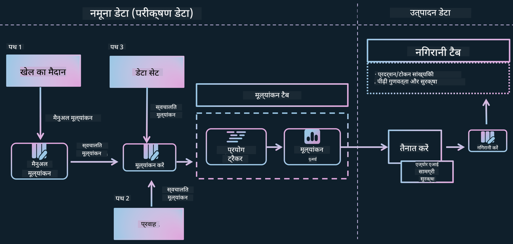

*छवि स्रोत: [Evaluation of generative AI applications](https://learn.microsoft.com/azure/ai-studio/concepts/evaluation-approach-gen-ai?wt.mc_id%3Dstudentamb_279723)*

> [!NOTE]
>
> Phi-3 / Phi-3.5 के बारे में अधिक जानकारी और अतिरिक्त संसाधनों के लिए कृपया [Phi-3CookBook](https://github.com/microsoft/Phi-3CookBook?wt.mc_id=studentamb_279723) देखें।

### आवश्यकताएँ

- [Python](https://www.python.org/downloads)
- [Azure subscription](https://azure.microsoft.com/free?wt.mc_id=studentamb_279723)
- [Visual Studio Code](https://code.visualstudio.com)
- Fine-tuned Phi-3 / Phi-3.5 मॉडल

### विषय सूची

1. [**परिदृश्य 1: Azure AI Foundry के Prompt flow मूल्यांकन का परिचय**](../../../../../../md/02.Application/01.TextAndChat/Phi3)

    - [सुरक्षा मूल्यांकन का परिचय](../../../../../../md/02.Application/01.TextAndChat/Phi3)
    - [प्रदर्शन मूल्यांकन का परिचय](../../../../../../md/02.Application/01.TextAndChat/Phi3)

1. [**परिदृश्य 2: Azure AI Foundry में Phi-3 / Phi-3.5 मॉडल का मूल्यांकन**](../../../../../../md/02.Application/01.TextAndChat/Phi3)

    - [शुरू करने से पहले](../../../../../../md/02.Application/01.TextAndChat/Phi3)
    - [Phi-3 / Phi-3.5 मॉडल का मूल्यांकन करने के लिए Azure OpenAI को तैनात करें](../../../../../../md/02.Application/01.TextAndChat/Phi3)
    - [Azure AI Foundry के Prompt flow मूल्यांकन का उपयोग करके Fine-tuned Phi-3 / Phi-3.5 मॉडल का मूल्यांकन करें](../../../../../../md/02.Application/01.TextAndChat/Phi3)

1. [बधाई हो!](../../../../../../md/02.Application/01.TextAndChat/Phi3)

## **परिदृश्य 1: Azure AI Foundry के Prompt flow मूल्यांकन का परिचय**

### सुरक्षा मूल्यांकन का परिचय

यह सुनिश्चित करने के लिए कि आपका AI मॉडल नैतिक और सुरक्षित है, इसे Microsoft के Responsible AI सिद्धांतों के अनुसार मूल्यांकन करना आवश्यक है। Azure AI Foundry में, सुरक्षा मूल्यांकन आपको आपके मॉडल की jailbreak हमलों के प्रति संवेदनशीलता और हानिकारक सामग्री उत्पन्न करने की क्षमता का आकलन करने की अनुमति देते हैं, जो सीधे इन सिद्धांतों के अनुरूप है।

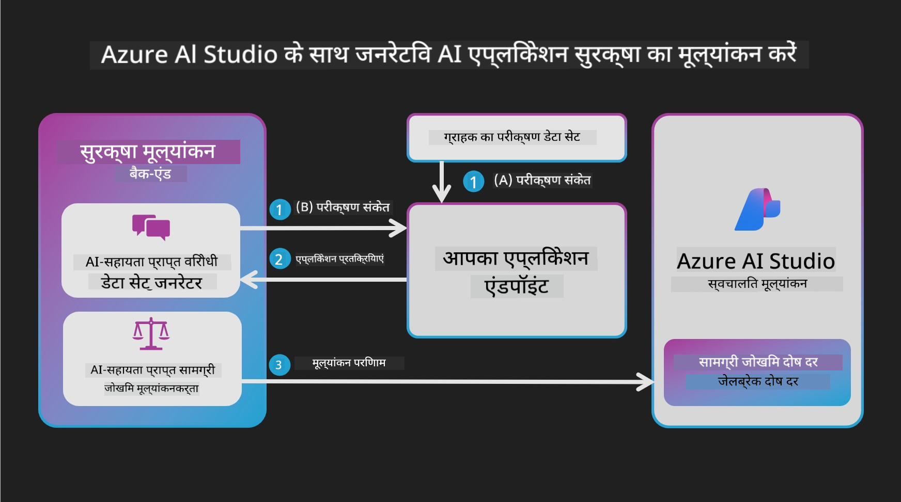

*छवि स्रोत: [Evaluation of generative AI applications](https://learn.microsoft.com/azure/ai-studio/concepts/evaluation-approach-gen-ai?wt.mc_id%3Dstudentamb_279723)*

#### Microsoft के Responsible AI सिद्धांत

तकनीकी कदम शुरू करने से पहले, Microsoft के Responsible AI सिद्धांतों को समझना आवश्यक है, जो AI सिस्टम के जिम्मेदार विकास, तैनाती और संचालन के लिए एक नैतिक ढांचा प्रदान करते हैं। ये सिद्धांत AI सिस्टम के डिजाइन, विकास और तैनाती में जिम्मेदारी सुनिश्चित करते हैं, ताकि AI तकनीकें निष्पक्ष, पारदर्शी और समावेशी तरीके से बनाई जाएं। ये सिद्धांत AI मॉडल की सुरक्षा के मूल्यांकन की नींव हैं।

Microsoft के Responsible AI सिद्धांतों में शामिल हैं:

- **निष्पक्षता और समावेशन**: AI सिस्टम सभी के साथ निष्पक्ष व्यवहार करें और समान परिस्थितियों वाले समूहों के साथ भेदभाव न करें। उदाहरण के लिए, जब AI सिस्टम चिकित्सा उपचार, ऋण आवेदन, या रोजगार पर मार्गदर्शन देते हैं, तो उन्हें समान लक्षण, वित्तीय स्थिति, या पेशेवर योग्यता वाले सभी लोगों को समान सिफारिशें करनी चाहिए।

- **विश्वसनीयता और सुरक्षा**: विश्वास बनाने के लिए, AI सिस्टम को विश्वसनीय, सुरक्षित और लगातार काम करना चाहिए। ये सिस्टम वैसे ही काम कर सकें जैसे उन्हें डिजाइन किया गया था, अप्रत्याशित परिस्थितियों में सुरक्षित प्रतिक्रिया दें, और हानिकारक हेरफेर का सामना कर सकें। उनका व्यवहार और संभालने वाली विभिन्न परिस्थितियाँ डिजाइन और परीक्षण के दौरान डेवलपर्स द्वारा अनुमानित स्थितियों को दर्शाती हैं।

- **पारदर्शिता**: जब AI सिस्टम ऐसे निर्णयों में मदद करते हैं जिनका लोगों के जीवन पर गहरा प्रभाव होता है, तो यह जरूरी है कि लोग समझें कि ये निर्णय कैसे लिए गए। उदाहरण के लिए, एक बैंक AI सिस्टम का उपयोग यह तय करने के लिए कर सकता है कि कोई व्यक्ति क्रेडिट योग्य है या नहीं। एक कंपनी AI सिस्टम का उपयोग सबसे योग्य उम्मीदवारों को चुनने के लिए कर सकती है।

- **गोपनीयता और सुरक्षा**: जैसे-जैसे AI अधिक व्यापक होता जा रहा है, व्यक्तिगत और व्यावसायिक जानकारी की सुरक्षा और गोपनीयता की रक्षा करना अधिक महत्वपूर्ण और जटिल होता जा रहा है। AI के साथ, गोपनीयता और डेटा सुरक्षा पर विशेष ध्यान देना आवश्यक है क्योंकि AI सिस्टम को सटीक और सूचित भविष्यवाणियां और निर्णय लेने के लिए डेटा तक पहुंच आवश्यक होती है।

- **जवाबदेही**: AI सिस्टम डिजाइन और तैनात करने वाले लोग अपने सिस्टम के संचालन के लिए जवाबदेह होने चाहिए। संगठन उद्योग मानकों का उपयोग करके जवाबदेही के नियम विकसित करें। ये नियम सुनिश्चित कर सकते हैं कि AI सिस्टम किसी भी ऐसे निर्णय का अंतिम प्राधिकारी न हो जो लोगों के जीवन को प्रभावित करता हो। वे यह भी सुनिश्चित कर सकते हैं कि मनुष्य अत्यधिक स्वायत्त AI सिस्टम पर सार्थक नियंत्रण बनाए रखें।

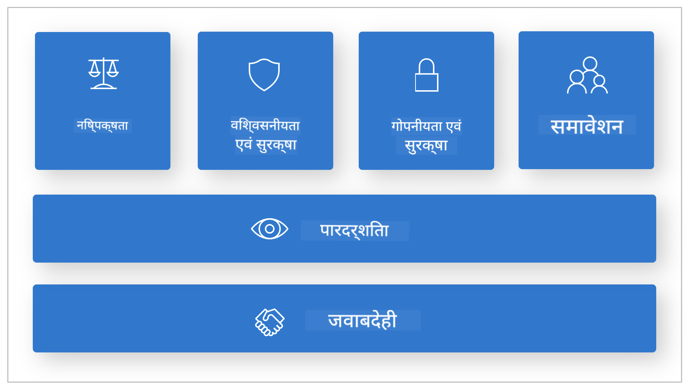

*छवि स्रोत: [What is Responsible AI?](https://learn.microsoft.com/azure/machine-learning/concept-responsible-ai?view=azureml-api-2&viewFallbackFrom=azureml-api-2%253fwt.mc_id%3Dstudentamb_279723)*

> [!NOTE]
> Microsoft के Responsible AI सिद्धांतों के बारे में अधिक जानने के लिए, कृपया [What is Responsible AI?](https://learn.microsoft.com/azure/machine-learning/concept-responsible-ai?view=azureml-api-2?wt.mc_id=studentamb_279723) देखें।

#### सुरक्षा मेट्रिक्स

इस ट्यूटोरियल में, आप Azure AI Foundry के सुरक्षा मेट्रिक्स का उपयोग करके Fine-tuned Phi-3 मॉडल की सुरक्षा का मूल्यांकन करेंगे। ये मेट्रिक्स मॉडल की हानिकारक सामग्री उत्पन्न करने की क्षमता और jailbreak हमलों के प्रति उसकी संवेदनशीलता का आकलन करने में मदद करते हैं। सुरक्षा मेट्रिक्स में शामिल हैं:

- **आत्म-हानि से संबंधित सामग्री**: यह मूल्यांकन करता है कि क्या मॉडल में आत्म-हानि से संबंधित सामग्री उत्पन्न करने की प्रवृत्ति है।
- **घृणास्पद और अनुचित सामग्री**: यह मूल्यांकन करता है कि क्या मॉडल में घृणास्पद या अनुचित सामग्री उत्पन्न करने की प्रवृत्ति है।
- **हिंसात्मक सामग्री**: यह मूल्यांकन करता है कि क्या मॉडल में हिंसात्मक सामग्री उत्पन्न करने की प्रवृत्ति है।
- **यौन सामग्री**: यह मूल्यांकन करता है कि क्या मॉडल में अनुचित यौन सामग्री उत्पन्न करने की प्रवृत्ति है।

इन पहलुओं का मूल्यांकन यह सुनिश्चित करता है कि AI मॉडल हानिकारक या आपत्तिजनक सामग्री उत्पन्न न करे, जो सामाजिक मूल्यों और नियामक मानकों के अनुरूप हो।


### प्रदर्शन मूल्यांकन का परिचय

यह सुनिश्चित करने के लिए कि आपका AI मॉडल अपेक्षित प्रदर्शन कर रहा है, इसके प्रदर्शन का प्रदर्शन मेट्रिक्स के आधार पर मूल्यांकन करना महत्वपूर्ण है। Azure AI Foundry में, प्रदर्शन मूल्यांकन आपको आपके मॉडल की सटीक, प्रासंगिक, और संगत प्रतिक्रियाएं उत्पन्न करने की क्षमता का आकलन करने की अनुमति देते हैं।


*छवि स्रोत: [Evaluation of generative AI applications](https://learn.microsoft.com/azure/ai-studio/concepts/evaluation-approach-gen-ai?wt.mc_id%3Dstudentamb_279723)*

#### प्रदर्शन मेट्रिक्स

इस ट्यूटोरियल में, आप Azure AI Foundry के प्रदर्शन मेट्रिक्स का उपयोग करके Fine-tuned Phi-3 / Phi-3.5 मॉडल के प्रदर्शन का मूल्यांकन करेंगे। ये मेट्रिक्स मॉडल की सटीक, प्रासंगिक, और संगत प्रतिक्रियाएं उत्पन्न करने की क्षमता का आकलन करने में मदद करते हैं। प्रदर्शन मेट्रिक्स में शामिल हैं:

- **ग्राउंडेडनेस**: यह मूल्यांकन करता है कि उत्पन्न उत्तर इनपुट स्रोत की जानकारी के साथ कितने मेल खाते हैं।
- **प्रासंगिकता**: यह मूल्यांकन करता है कि उत्पन्न प्रतिक्रियाएं दिए गए प्रश्नों के लिए कितनी उपयुक्त हैं।
- **संगति**: यह मूल्यांकन करता है कि उत्पन्न पाठ कितनी सहजता से बहता है, प्राकृतिक रूप से पढ़ता है, और मानव जैसी भाषा जैसा लगता है।
- **प्रवाहिता**: यह मूल्यांकन करता है कि उत्पन्न पाठ की भाषा दक्षता कैसी है।
- **GPT समानता**: यह उत्पन्न प्रतिक्रिया की समानता के लिए ग्राउंड ट्रूथ के साथ तुलना करता है।
- **F1 स्कोर**: यह उत्पन्न प्रतिक्रिया और स्रोत डेटा के बीच साझा शब्दों के अनुपात की गणना करता है।

ये मेट्रिक्स आपको मॉडल की सटीक, प्रासंगिक, और संगत प्रतिक्रियाएं उत्पन्न करने की क्षमता का मूल्यांकन करने में मदद करते हैं।


## **परिदृश्य 2: Azure AI Foundry में Phi-3 / Phi-3.5 मॉडल का मूल्यांकन**

### शुरू करने से पहले

यह ट्यूटोरियल पिछले ब्लॉग पोस्ट "[Fine-Tune and Integrate Custom Phi-3 Models with Prompt Flow: Step-by-Step Guide](https://techcommunity.microsoft.com/t5/educator-developer-blog/fine-tune-and-integrate-custom-phi-3-models-with-prompt-flow/ba-p/4178612?wt.mc_id=studentamb_279723)" और "[Fine-Tune and Integrate Custom Phi-3 Models with Prompt Flow in Azure AI Foundry](https://techcommunity.microsoft.com/t5/educator-developer-blog/fine-tune-and-integrate-custom-phi-3-models-with-prompt-flow-in/ba-p/4191726?wt.mc_id=studentamb_279723)" का अनुसरण है। इन पोस्ट्स में, हमने Azure AI Foundry में Phi-3 / Phi-3.5 मॉडल को फाइन-ट्यून करने और इसे Prompt flow के साथ एकीकृत करने की प्रक्रिया को समझाया था।

इस ट्यूटोरियल में, आप Azure AI Foundry में एक मूल्यांकनकर्ता के रूप में Azure OpenAI मॉडल को तैनात करेंगे और इसका उपयोग अपने Fine-tuned Phi-3 / Phi-3.5 मॉडल का मूल्यांकन करने के लिए करेंगे।

इस ट्यूटोरियल को शुरू करने से पहले, सुनिश्चित करें कि आपके पास निम्नलिखित आवश्यकताएँ हैं, जैसा कि पिछले ट्यूटोरियल में वर्णित है:

1. Fine-tuned Phi-3 / Phi-3.5 मॉडल का मूल्यांकन करने के लिए तैयार किया गया डेटासेट।
1. Phi-3 / Phi-3.5 मॉडल जिसे फाइन-ट्यून किया गया हो और Azure Machine Learning में तैनात किया गया हो।
1. Azure AI Foundry में आपके Fine-tuned Phi-3 / Phi-3.5 मॉडल के साथ एकीकृत Prompt flow।

> [!NOTE]
> आप *test_data.jsonl* फ़ाइल का उपयोग करेंगे, जो पिछले ब्लॉग पोस्ट्स में डाउनलोड किए गए **ULTRACHAT_200k** डेटासेट के डेटा फ़ोल्डर में स्थित है, Fine-tuned Phi-3 / Phi-3.5 मॉडल का मूल्यांकन करने के लिए।

#### Azure AI Foundry में Prompt flow के साथ कस्टम Phi-3 / Phi-3.5 मॉडल को एकीकृत करें (Code first approach)
> [!NOTE]  
> यदि आपने "[Fine-Tune and Integrate Custom Phi-3 Models with Prompt Flow in Azure AI Foundry](https://techcommunity.microsoft.com/t5/educator-developer-blog/fine-tune-and-integrate-custom-phi-3-models-with-prompt-flow-in/ba-p/4191726?wt.mc_id=studentamb_279723)" में वर्णित लो-कोड दृष्टिकोण अपनाया है, तो आप इस अभ्यास को छोड़कर अगले पर जा सकते हैं।  
> हालांकि, यदि आपने "[Fine-Tune and Integrate Custom Phi-3 Models with Prompt Flow: Step-by-Step Guide](https://techcommunity.microsoft.com/t5/educator-developer-blog/fine-tune-and-integrate-custom-phi-3-models-with-prompt-flow/ba-p/4178612?wt.mc_id=studentamb_279723)" में वर्णित कोड-प्रथम दृष्टिकोण का पालन करते हुए अपने Phi-3 / Phi-3.5 मॉडल को फाइन-ट्यून और डिप्लॉय किया है, तो अपने मॉडल को Prompt flow से कनेक्ट करने की प्रक्रिया थोड़ी अलग होगी। आप इस अभ्यास में इस प्रक्रिया को सीखेंगे।
आगे बढ़ने के लिए, आपको अपने फाइन-ट्यून किए गए Phi-3 / Phi-3.5 मॉडल को Azure AI Foundry में Prompt flow में इंटीग्रेट करना होगा।

#### Azure AI Foundry Hub बनाएं

प्रोजेक्ट बनाने से पहले आपको एक Hub बनाना होगा। Hub एक Resource Group की तरह काम करता है, जो आपको Azure AI Foundry के अंदर कई प्रोजेक्ट्स को व्यवस्थित और प्रबंधित करने की सुविधा देता है।

1. [Azure AI Foundry](https://ai.azure.com/?wt.mc_id=studentamb_279723) में साइन इन करें।

1. बाएं साइड टैब से **All hubs** चुनें।

1. नेविगेशन मेनू से **+ New hub** चुनें।

    

1. निम्नलिखित कार्य करें:

    - **Hub name** दर्ज करें। यह एक अनोखा नाम होना चाहिए।
    - अपनी Azure **Subscription** चुनें।
    - उपयोग करने के लिए **Resource group** चुनें (यदि आवश्यक हो तो नया बनाएं)।
    - अपनी पसंद की **Location** चुनें।
    - उपयोग करने के लिए **Connect Azure AI Services** चुनें (यदि आवश्यक हो तो नया बनाएं)।
    - **Connect Azure AI Search** के लिए **Skip connecting** चुनें।

    

1. **Next** चुनें।

#### Azure AI Foundry प्रोजेक्ट बनाएं

1. आपने जो Hub बनाया है, उसमें बाएं साइड टैब से **All projects** चुनें।

1. नेविगेशन मेनू से **+ New project** चुनें।

    

1. **Project name** दर्ज करें। यह एक अनोखा नाम होना चाहिए।

    

1. **Create a project** चुनें।

#### फाइन-ट्यून किए गए Phi-3 / Phi-3.5 मॉडल के लिए कस्टम कनेक्शन जोड़ें

अपने कस्टम Phi-3 / Phi-3.5 मॉडल को Prompt flow के साथ इंटीग्रेट करने के लिए, आपको मॉडल के endpoint और key को एक कस्टम कनेक्शन में सेव करना होगा। यह सेटअप Prompt flow में आपके कस्टम मॉडल तक पहुंच सुनिश्चित करता है।

#### फाइन-ट्यून किए गए Phi-3 / Phi-3.5 मॉडल की api key और endpoint uri सेट करें

1. [Azure ML Studio](https://ml.azure.com/home?wt.mc_id=studentamb_279723) पर जाएं।

1. उस Azure Machine learning workspace पर नेविगेट करें जिसे आपने बनाया है।

1. बाएं साइड टैब से **Endpoints** चुनें।

    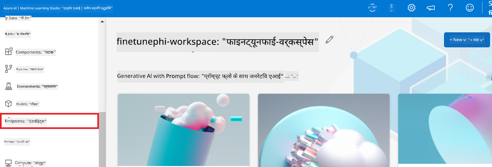

1. आपने जो endpoint बनाया है, उसे चुनें।

    

1. नेविगेशन मेनू से **Consume** चुनें।

1. अपनी **REST endpoint** और **Primary key** कॉपी करें।

    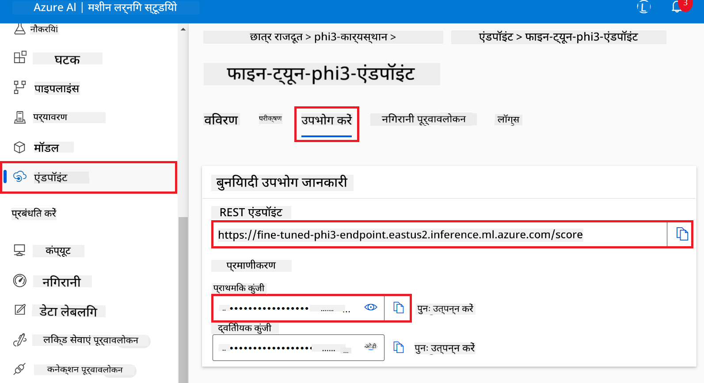

#### कस्टम कनेक्शन जोड़ें

1. [Azure AI Foundry](https://ai.azure.com/?wt.mc_id=studentamb_279723) पर जाएं।

1. उस Azure AI Foundry प्रोजेक्ट पर नेविगेट करें जिसे आपने बनाया है।

1. अपने प्रोजेक्ट में, बाएं साइड टैब से **Settings** चुनें।

1. **+ New connection** चुनें।

    

1. नेविगेशन मेनू से **Custom keys** चुनें।

    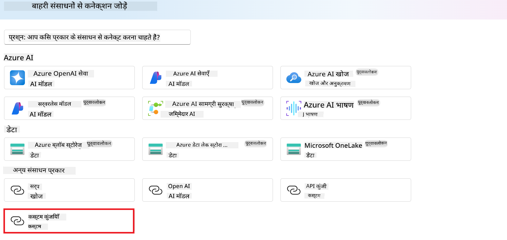

1. निम्नलिखित कार्य करें:

    - **+ Add key value pairs** चुनें।
    - key नाम के लिए **endpoint** दर्ज करें और Azure ML Studio से कॉपी किया गया endpoint value फ़ील्ड में पेस्ट करें।
    - फिर से **+ Add key value pairs** चुनें।
    - key नाम के लिए **key** दर्ज करें और Azure ML Studio से कॉपी किया गया key value फ़ील्ड में पेस्ट करें।
    - keys जोड़ने के बाद, key को एक्सपोज़ होने से रोकने के लिए **is secret** चुनें।

    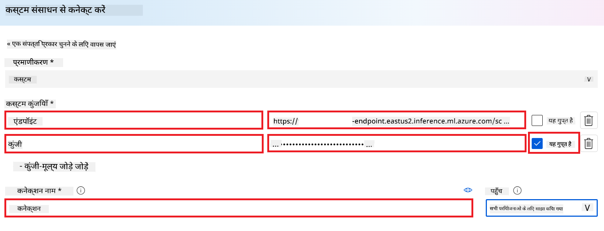

1. **Add connection** चुनें।

#### Prompt flow बनाएं

आपने Azure AI Foundry में एक कस्टम कनेक्शन जोड़ दिया है। अब, निम्नलिखित चरणों का उपयोग करके एक Prompt flow बनाएं। फिर, आप इस Prompt flow को कस्टम कनेक्शन से कनेक्ट करेंगे ताकि फाइन-ट्यून किए गए मॉडल का उपयोग Prompt flow के अंदर किया जा सके।

1. उस Azure AI Foundry प्रोजेक्ट पर नेविगेट करें जिसे आपने बनाया है।

1. बाएं साइड टैब से **Prompt flow** चुनें।

1. नेविगेशन मेनू से **+ Create** चुनें।

    

1. नेविगेशन मेनू से **Chat flow** चुनें।

    

1. उपयोग के लिए **Folder name** दर्ज करें।

    

1. **Create** चुनें।

#### अपने कस्टम Phi-3 / Phi-3.5 मॉडल के साथ चैट करने के लिए Prompt flow सेट करें

आपको फाइन-ट्यून किए गए Phi-3 / Phi-3.5 मॉडल को Prompt flow में इंटीग्रेट करना होगा। हालांकि, मौजूदा Prompt flow इस उद्देश्य के लिए डिज़ाइन नहीं किया गया है। इसलिए, आपको कस्टम मॉडल के इंटीग्रेशन के लिए Prompt flow को फिर से डिजाइन करना होगा।

1. Prompt flow में, मौजूदा flow को पुनर्निर्मित करने के लिए निम्नलिखित कार्य करें:

    - **Raw file mode** चुनें।
    - *flow.dag.yml* फ़ाइल में मौजूद सभी कोड को हटा दें।
    - *flow.dag.yml* में निम्नलिखित कोड जोड़ें।

        ```yml
        inputs:
          input_data:
            type: string
            default: "Who founded Microsoft?"

        outputs:
          answer:
            type: string
            reference: ${integrate_with_promptflow.output}

        nodes:
        - name: integrate_with_promptflow
          type: python
          source:
            type: code
            path: integrate_with_promptflow.py
          inputs:
            input_data: ${inputs.input_data}
        ```

    - **Save** चुनें।

    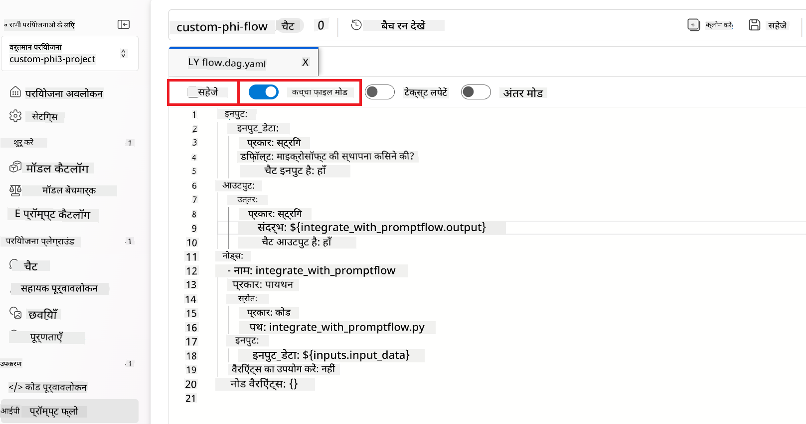

1. Prompt flow में कस्टम Phi-3 / Phi-3.5 मॉडल का उपयोग करने के लिए *integrate_with_promptflow.py* में निम्नलिखित कोड जोड़ें।

    ```python
    import logging
    import requests
    from promptflow import tool
    from promptflow.connections import CustomConnection

    # Logging setup
    logging.basicConfig(
        format="%(asctime)s - %(levelname)s - %(name)s - %(message)s",
        datefmt="%Y-%m-%d %H:%M:%S",
        level=logging.DEBUG
    )
    logger = logging.getLogger(__name__)

    def query_phi3_model(input_data: str, connection: CustomConnection) -> str:
        """
        Send a request to the Phi-3 / Phi-3.5 model endpoint with the given input data using Custom Connection.
        """

        # "connection" is the name of the Custom Connection, "endpoint", "key" are the keys in the Custom Connection
        endpoint_url = connection.endpoint
        api_key = connection.key

        headers = {
            "Content-Type": "application/json",
            "Authorization": f"Bearer {api_key}"
        }
    data = {
        "input_data": [input_data],
        "params": {
            "temperature": 0.7,
            "max_new_tokens": 128,
            "do_sample": True,
            "return_full_text": True
            }
        }
        try:
            response = requests.post(endpoint_url, json=data, headers=headers)
            response.raise_for_status()
            
            # Log the full JSON response
            logger.debug(f"Full JSON response: {response.json()}")

            result = response.json()["output"]
            logger.info("Successfully received response from Azure ML Endpoint.")
            return result
        except requests.exceptions.RequestException as e:
            logger.error(f"Error querying Azure ML Endpoint: {e}")
            raise

    @tool
    def my_python_tool(input_data: str, connection: CustomConnection) -> str:
        """
        Tool function to process input data and query the Phi-3 / Phi-3.5 model.
        """
        return query_phi3_model(input_data, connection)

    ```

    

> [!NOTE]
> Azure AI Foundry में Prompt flow के उपयोग के बारे में अधिक विस्तृत जानकारी के लिए, आप [Prompt flow in Azure AI Foundry](https://learn.microsoft.com/azure/ai-studio/how-to/prompt-flow) देख सकते हैं।

1. अपने मॉडल के साथ चैट सक्षम करने के लिए **Chat input**, **Chat output** चुनें।

    

1. अब आप अपने कस्टम Phi-3 / Phi-3.5 मॉडल के साथ चैट करने के लिए तैयार हैं। अगले अभ्यास में, आप सीखेंगे कि Prompt flow कैसे शुरू करें और इसे अपने फाइन-ट्यून किए गए Phi-3 / Phi-3.5 मॉडल के साथ चैट करने के लिए कैसे उपयोग करें।

> [!NOTE]
>
> पुनर्निर्मित flow इस चित्र की तरह दिखना चाहिए:
>
> 
>

#### Prompt flow शुरू करें

1. Prompt flow शुरू करने के लिए **Start compute sessions** चुनें।

    

1. पैरामीटर को रिन्यू करने के लिए **Validate and parse input** चुनें।

    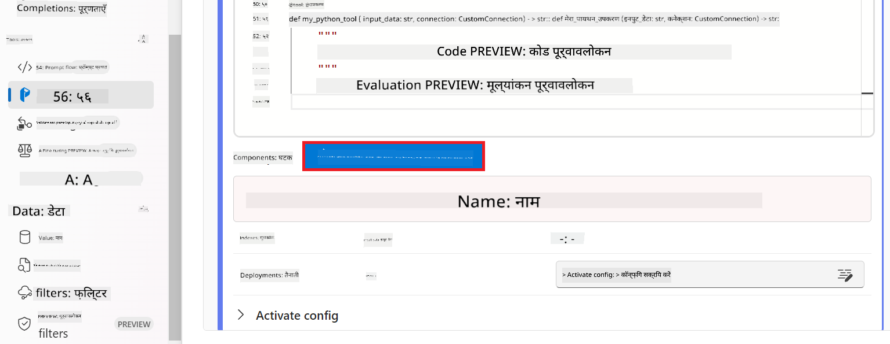

1. आपने जो कस्टम कनेक्शन बनाया है, उसके **connection** के **Value** को चुनें। उदाहरण के लिए, *connection*।

    

#### अपने कस्टम Phi-3 / Phi-3.5 मॉडल के साथ चैट करें

1. **Chat** चुनें।

    

1. परिणामों का एक उदाहरण यहाँ है: अब आप अपने कस्टम Phi-3 / Phi-3.5 मॉडल के साथ चैट कर सकते हैं। यह सलाह दी जाती है कि आप फाइन-ट्यूनिंग के लिए उपयोग किए गए डेटा के आधार पर प्रश्न पूछें।

    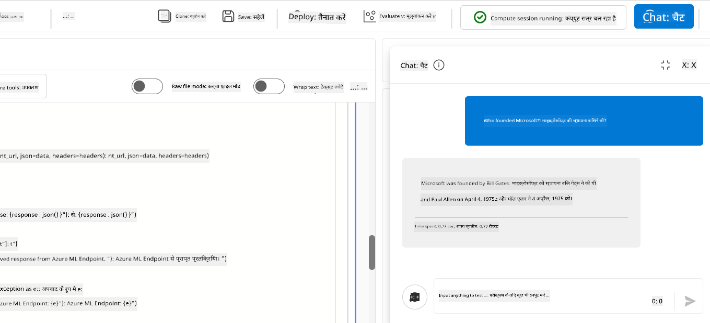

### Phi-3 / Phi-3.5 मॉडल का मूल्यांकन करने के लिए Azure OpenAI को डिप्लॉय करें

Phi-3 / Phi-3.5 मॉडल का Azure AI Foundry में मूल्यांकन करने के लिए, आपको एक Azure OpenAI मॉडल डिप्लॉय करना होगा। इस मॉडल का उपयोग Phi-3 / Phi-3.5 मॉडल के प्रदर्शन का मूल्यांकन करने के लिए किया जाएगा।

#### Azure OpenAI डिप्लॉय करें

1. [Azure AI Foundry](https://ai.azure.com/?wt.mc_id=studentamb_279723) में साइन इन करें।

1. उस Azure AI Foundry प्रोजेक्ट पर नेविगेट करें जिसे आपने बनाया है।

    

1. अपने प्रोजेक्ट में, बाएं साइड टैब से **Deployments** चुनें।

1. नेविगेशन मेनू से **+ Deploy model** चुनें।

1. **Deploy base model** चुनें।

    

1. वह Azure OpenAI मॉडल चुनें जिसे आप उपयोग करना चाहते हैं। उदाहरण के लिए, **gpt-4o**।

    

1. **Confirm** चुनें।

### Azure AI Foundry के Prompt flow मूल्यांकन का उपयोग करके फाइन-ट्यून किए गए Phi-3 / Phi-3.5 मॉडल का मूल्यांकन करें

### नया मूल्यांकन शुरू करें

1. [Azure AI Foundry](https://ai.azure.com/?wt.mc_id=studentamb_279723) पर जाएं।

1. उस Azure AI Foundry प्रोजेक्ट पर नेविगेट करें जिसे आपने बनाया है।

    

1. अपने प्रोजेक्ट में, बाएं साइड टैब से **Evaluation** चुनें।

1. नेविगेशन मेनू से **+ New evaluation** चुनें।

    

1. **Prompt flow** मूल्यांकन चुनें।

    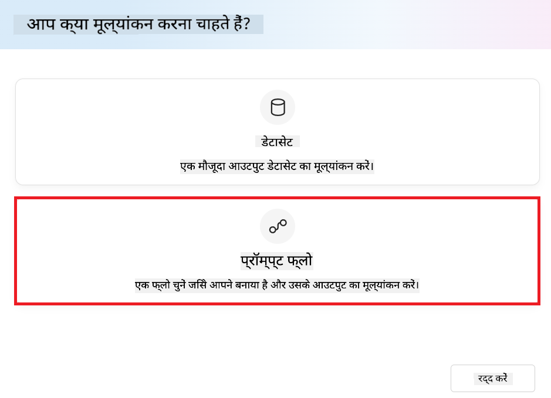

1. निम्नलिखित कार्य करें:

    - मूल्यांकन का नाम दर्ज करें। यह एक अनोखा नाम होना चाहिए।
    - टास्क प्रकार के रूप में **Question and answer without context** चुनें। क्योंकि इस ट्यूटोरियल में उपयोग किया गया **UlTRACHAT_200k** डेटासेट संदर्भ नहीं रखता।
    - उस prompt flow को चुनें जिसे आप मूल्यांकन करना चाहते हैं।

    

1. **Next** चुनें।

1. निम्नलिखित कार्य करें:

    - **Add your dataset** चुनें और डेटासेट अपलोड करें। उदाहरण के लिए, आप **ULTRACHAT_200k** डेटासेट के साथ शामिल *test_data.json1* टेस्ट डेटासेट फ़ाइल अपलोड कर सकते हैं।
    - अपने डेटासेट से मेल खाने वाला उचित **Dataset column** चुनें। उदाहरण के लिए, यदि आप **ULTRACHAT_200k** डेटासेट का उपयोग कर रहे हैं, तो **${data.prompt}** को डेटासेट कॉलम के रूप में चुनें।

    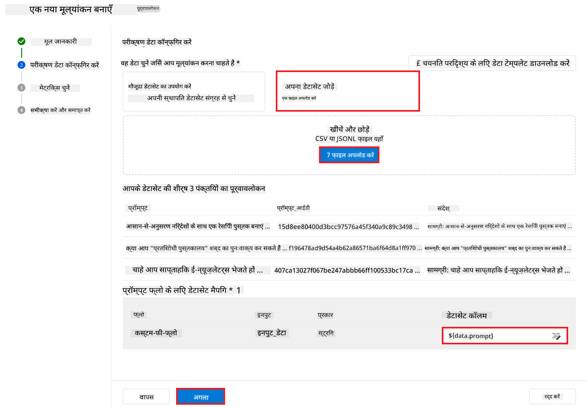

1. **Next** चुनें।

1. प्रदर्शन और गुणवत्ता मेट्रिक्स कॉन्फ़िगर करने के लिए निम्नलिखित कार्य करें:

    - उपयोग करने के लिए प्रदर्शन और गुणवत्ता मेट्रिक्स चुनें।
    - मूल्यांकन के लिए आपने जो Azure OpenAI मॉडल बनाया है, उसे चुनें। उदाहरण के लिए, **gpt-4o**।

    

1. जोखिम और सुरक्षा मेट्रिक्स कॉन्फ़िगर करने के लिए निम्नलिखित कार्य करें:

    - उपयोग करने के लिए जोखिम और सुरक्षा मेट्रिक्स चुनें।
    - दोष दर की गणना के लिए थ्रेशोल्ड चुनें। उदाहरण के लिए, **Medium**।
    - **question** के लिए, **Data source** को **{$data.prompt}** सेट करें।
    - **answer** के लिए, **Data source** को **{$run.outputs.answer}** सेट करें।
    - **ground_truth** के लिए, **Data source** को **{$data.message}** सेट करें।

    

1. **Next** चुनें।

1. मूल्यांकन शुरू करने के लिए **Submit** चुनें।

1. मूल्यांकन पूरा होने में कुछ समय लगेगा। आप प्रगति को **Evaluation** टैब में मॉनिटर कर सकते हैं।

### मूल्यांकन परिणामों की समीक्षा करें
> [!NOTE]
> नीचे प्रस्तुत परिणाम मूल्यांकन प्रक्रिया को समझाने के लिए हैं। इस ट्यूटोरियल में, हमने एक ऐसे मॉडल का उपयोग किया है जिसे अपेक्षाकृत छोटे डेटासेट पर फाइन-ट्यून किया गया है, जिससे परिणाम आदर्श से कम हो सकते हैं। वास्तविक परिणाम डेटासेट के आकार, गुणवत्ता, और विविधता के साथ-साथ मॉडल की विशिष्ट कॉन्फ़िगरेशन के आधार पर काफी भिन्न हो सकते हैं।
एक बार मूल्यांकन पूरा हो जाने के बाद, आप प्रदर्शन और सुरक्षा मेट्रिक्स दोनों के लिए परिणामों की समीक्षा कर सकते हैं।

1. प्रदर्शन और गुणवत्ता मेट्रिक्स:

    - मॉडल की क्षमता का मूल्यांकन करें कि वह संगत, प्रवाहपूर्ण और प्रासंगिक उत्तर प्रदान कर रहा है या नहीं।

    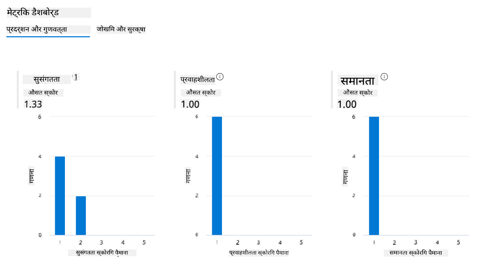

1. जोखिम और सुरक्षा मेट्रिक्स:

    - सुनिश्चित करें कि मॉडल के आउटपुट सुरक्षित हैं और Responsible AI Principles के अनुरूप हैं, जिससे कोई हानिकारक या आपत्तिजनक सामग्री न हो।

    

1. आप नीचे स्क्रॉल करके **विस्तृत मेट्रिक्स परिणाम** देख सकते हैं।

    

1. अपने कस्टम Phi-3 / Phi-3.5 मॉडल का प्रदर्शन और सुरक्षा मेट्रिक्स दोनों के खिलाफ मूल्यांकन करके, आप पुष्टि कर सकते हैं कि मॉडल न केवल प्रभावी है, बल्कि जिम्मेदार AI प्रथाओं का पालन भी करता है, जिससे यह वास्तविक दुनिया में तैनाती के लिए तैयार है।

## बधाई हो!

### आपने यह ट्यूटोरियल पूरा कर लिया है

आपने सफलतापूर्वक Azure AI Foundry में Prompt flow के साथ एकीकृत फाइन-ट्यून किए गए Phi-3 मॉडल का मूल्यांकन किया है। यह एक महत्वपूर्ण कदम है यह सुनिश्चित करने के लिए कि आपके AI मॉडल न केवल अच्छा प्रदर्शन करें, बल्कि Microsoft के Responsible AI सिद्धांतों का पालन भी करें, जिससे आप भरोसेमंद और विश्वसनीय AI एप्लिकेशन बना सकें।


## Azure संसाधनों की सफाई करें

अपने खाते पर अतिरिक्त शुल्क से बचने के लिए अपने Azure संसाधनों की सफाई करें। Azure पोर्टल पर जाएं और निम्नलिखित संसाधनों को हटा दें:

- Azure Machine learning संसाधन।
- Azure Machine learning मॉडल एंडपॉइंट।
- Azure AI Foundry प्रोजेक्ट संसाधन।
- Azure AI Foundry Prompt flow संसाधन।

### अगले कदम

#### दस्तावेज़ीकरण

- [Responsible AI डैशबोर्ड का उपयोग करके AI सिस्टम का आकलन करें](https://learn.microsoft.com/azure/machine-learning/concept-responsible-ai-dashboard?view=azureml-api-2&source=recommendations?wt.mc_id=studentamb_279723)
- [जनरेटिव AI के लिए मूल्यांकन और निगरानी मेट्रिक्स](https://learn.microsoft.com/azure/ai-studio/concepts/evaluation-metrics-built-in?tabs=definition?wt.mc_id=studentamb_279723)
- [Azure AI Foundry दस्तावेज़ीकरण](https://learn.microsoft.com/azure/ai-studio/?wt.mc_id=studentamb_279723)
- [Prompt flow दस्तावेज़ीकरण](https://microsoft.github.io/promptflow/?wt.mc_id=studentamb_279723)

#### प्रशिक्षण सामग्री

- [Microsoft के Responsible AI दृष्टिकोण का परिचय](https://learn.microsoft.com/training/modules/introduction-to-microsofts-responsible-ai-approach/?source=recommendations?wt.mc_id=studentamb_279723)
- [Azure AI Foundry का परिचय](https://learn.microsoft.com/training/modules/introduction-to-azure-ai-studio/?wt.mc_id=studentamb_279723)

### संदर्भ

- [Responsible AI क्या है?](https://learn.microsoft.com/azure/machine-learning/concept-responsible-ai?view=azureml-api-2?wt.mc_id=studentamb_279723)
- [Azure AI में नए टूल्स की घोषणा जो आपको अधिक सुरक्षित और भरोसेमंद जनरेटिव AI एप्लिकेशन बनाने में मदद करते हैं](https://azure.microsoft.com/blog/announcing-new-tools-in-azure-ai-to-help-you-build-more-secure-and-trustworthy-generative-ai-applications/?wt.mc_id=studentamb_279723)
- [जनरेटिव AI एप्लिकेशन का मूल्यांकन](https://learn.microsoft.com/azure/ai-studio/concepts/evaluation-approach-gen-ai?wt.mc_id%3Dstudentamb_279723)

**अस्वीकरण**:  
यह दस्तावेज़ AI अनुवाद सेवा [Co-op Translator](https://github.com/Azure/co-op-translator) का उपयोग करके अनुवादित किया गया है। जबकि हम सटीकता के लिए प्रयासरत हैं, कृपया ध्यान दें कि स्वचालित अनुवादों में त्रुटियाँ या असंगतियाँ हो सकती हैं। मूल दस्तावेज़ अपनी मूल भाषा में ही अधिकारिक स्रोत माना जाना चाहिए। महत्वपूर्ण जानकारी के लिए, पेशेवर मानव अनुवाद की सलाह दी जाती है। इस अनुवाद के उपयोग से उत्पन्न किसी भी गलतफहमी या गलत व्याख्या के लिए हम जिम्मेदार नहीं हैं।