<!--
CO_OP_TRANSLATOR_METADATA:
{
  "original_hash": "7799f9e2960966adc296d24cdf0d6486",
  "translation_date": "2025-04-04T18:08:03+00:00",
  "source_file": "md\\02.Application\\01.TextAndChat\\Phi3\\E2E_Phi-3-Evaluation_AIFoundry.md",
  "language_code": "hi"
}
-->
# Microsoft के उत्तरदायी AI सिद्धांतों पर ध्यान केंद्रित करते हुए Azure AI Foundry में Fine-tuned Phi-3 / Phi-3.5 मॉडल का मूल्यांकन करें

यह एंड-टू-एंड (E2E) सैंपल Microsoft Tech Community के गाइड "[Microsoft के उत्तरदायी AI पर ध्यान केंद्रित करते हुए Azure AI Foundry में Fine-tuned Phi-3 / 3.5 मॉडल का मूल्यांकन करें](https://techcommunity.microsoft.com/t5/educator-developer-blog/evaluate-fine-tuned-phi-3-3-5-models-in-azure-ai-studio-focusing/ba-p/4227850?WT.mc_id=aiml-137032-kinfeylo)" पर आधारित है।

## परिचय

### Azure AI Foundry में Fine-tuned Phi-3 / Phi-3.5 मॉडल की सुरक्षा और प्रदर्शन का मूल्यांकन कैसे करें?

कभी-कभी मॉडल को फाइन-ट्यून करने से अनपेक्षित या अवांछित प्रतिक्रियाएं उत्पन्न हो सकती हैं। यह सुनिश्चित करने के लिए कि मॉडल सुरक्षित और प्रभावी बना रहे, यह महत्वपूर्ण है कि मॉडल की क्षमता को हानिकारक सामग्री उत्पन्न करने और सटीक, प्रासंगिक और सामंजस्यपूर्ण प्रतिक्रियाएं देने की उसकी क्षमता का मूल्यांकन किया जाए। इस ट्यूटोरियल में, आप Azure AI Foundry में Prompt flow के साथ एकीकृत Fine-tuned Phi-3 / Phi-3.5 मॉडल की सुरक्षा और प्रदर्शन का मूल्यांकन करना सीखेंगे।

यह है Azure AI Foundry का मूल्यांकन प्रक्रिया।


*छवि स्रोत: [जनरेटिव AI एप्लिकेशन का मूल्यांकन](https://learn.microsoft.com/azure/ai-studio/concepts/evaluation-approach-gen-ai?wt.mc_id%3Dstudentamb_279723)*

> [!NOTE]
>
> Phi-3 / Phi-3.5 के बारे में अधिक विस्तृत जानकारी और अतिरिक्त संसाधनों का पता लगाने के लिए, कृपया [Phi-3CookBook](https://github.com/microsoft/Phi-3CookBook?wt.mc_id=studentamb_279723) पर जाएं।

### आवश्यकताएँ

- [Python](https://www.python.org/downloads)
- [Azure subscription](https://azure.microsoft.com/free?wt.mc_id=studentamb_279723)
- [Visual Studio Code](https://code.visualstudio.com)
- Fine-tuned Phi-3 / Phi-3.5 मॉडल

### सामग्री तालिका

1. [**परिदृश्य 1: Azure AI Foundry के Prompt flow मूल्यांकन का परिचय**](../../../../../../md/02.Application/01.TextAndChat/Phi3)

    - [सुरक्षा मूल्यांकन का परिचय](../../../../../../md/02.Application/01.TextAndChat/Phi3)
    - [प्रदर्शन मूल्यांकन का परिचय](../../../../../../md/02.Application/01.TextAndChat/Phi3)

1. [**परिदृश्य 2: Azure AI Foundry में Phi-3 / Phi-3.5 मॉडल का मूल्यांकन**](../../../../../../md/02.Application/01.TextAndChat/Phi3)

    - [शुरू करने से पहले](../../../../../../md/02.Application/01.TextAndChat/Phi3)
    - [Phi-3 / Phi-3.5 मॉडल का मूल्यांकन करने के लिए Azure OpenAI को तैनात करें](../../../../../../md/02.Application/01.TextAndChat/Phi3)
    - [Azure AI Foundry के Prompt flow मूल्यांकन का उपयोग करके Fine-tuned Phi-3 / Phi-3.5 मॉडल का मूल्यांकन करें](../../../../../../md/02.Application/01.TextAndChat/Phi3)

1. [बधाई!](../../../../../../md/02.Application/01.TextAndChat/Phi3)

## **परिदृश्य 1: Azure AI Foundry के Prompt flow मूल्यांकन का परिचय**

### सुरक्षा मूल्यांकन का परिचय

यह सुनिश्चित करने के लिए कि आपका AI मॉडल नैतिक और सुरक्षित है, इसे Microsoft के उत्तरदायी AI सिद्धांतों के खिलाफ मूल्यांकन करना आवश्यक है। Azure AI Foundry में, सुरक्षा मूल्यांकन आपको यह जांचने की अनुमति देता है कि आपका मॉडल जेलब्रेक हमलों के प्रति कितना संवेदनशील है और हानिकारक सामग्री उत्पन्न करने की उसकी क्षमता क्या है। यह प्रक्रिया इन सिद्धांतों के साथ सीधे मेल खाती है।


*छवि स्रोत: [जनरेटिव AI एप्लिकेशन का मूल्यांकन](https://learn.microsoft.com/azure/ai-studio/concepts/evaluation-approach-gen-ai?wt.mc_id%3Dstudentamb_279723)*

#### Microsoft के उत्तरदायी AI सिद्धांत

तकनीकी चरण शुरू करने से पहले, Microsoft के उत्तरदायी AI सिद्धांतों को समझना महत्वपूर्ण है। यह एक नैतिक ढांचा है जो AI सिस्टम के जिम्मेदार विकास, तैनाती और संचालन का मार्गदर्शन करता है। ये सिद्धांत AI तकनीकों को निष्पक्ष, पारदर्शी और समावेशी तरीके से बनाने की गारंटी देते हैं। AI मॉडल की सुरक्षा का मूल्यांकन इन्हीं सिद्धांतों पर आधारित है।

Microsoft के उत्तरदायी AI सिद्धांतों में शामिल हैं:

- **निष्पक्षता और समावेशिता**: AI सिस्टम को सभी के साथ निष्पक्षता से पेश आना चाहिए और समान स्थितियों वाले समूहों को अलग-अलग तरीकों से प्रभावित नहीं करना चाहिए। उदाहरण के लिए, जब AI सिस्टम चिकित्सा उपचार, ऋण आवेदन या रोजगार पर मार्गदर्शन प्रदान करता है, तो इसे समान लक्षण, वित्तीय परिस्थितियां या पेशेवर योग्यताओं वाले सभी व्यक्तियों को समान सिफारिशें देनी चाहिए।

- **विश्वसनीयता और सुरक्षा**: विश्वास बनाने के लिए, यह महत्वपूर्ण है कि AI सिस्टम विश्वसनीय, सुरक्षित और लगातार संचालित हों। इन सिस्टम्स को उनकी मूल डिज़ाइन के अनुसार संचालित होना चाहिए, अप्रत्याशित परिस्थितियों का सुरक्षित रूप से जवाब देना चाहिए और हानिकारक हेरफेर का विरोध करना चाहिए।

- **पारदर्शिता**: जब AI सिस्टम लोगों के जीवन पर भारी प्रभाव डालने वाले निर्णयों को सूचित करने में मदद करते हैं, तो यह महत्वपूर्ण है कि लोग समझें कि वे निर्णय कैसे किए गए।

- **गोपनीयता और सुरक्षा**: जैसे-जैसे AI अधिक प्रचलित हो रहा है, गोपनीयता की सुरक्षा और व्यक्तिगत और व्यावसायिक जानकारी को सुरक्षित करना अधिक महत्वपूर्ण और जटिल होता जा रहा है।

- **जवाबदेही**: AI सिस्टम डिज़ाइन और तैनात करने वाले लोगों को उनके सिस्टम के संचालन के लिए जवाबदेह होना चाहिए।

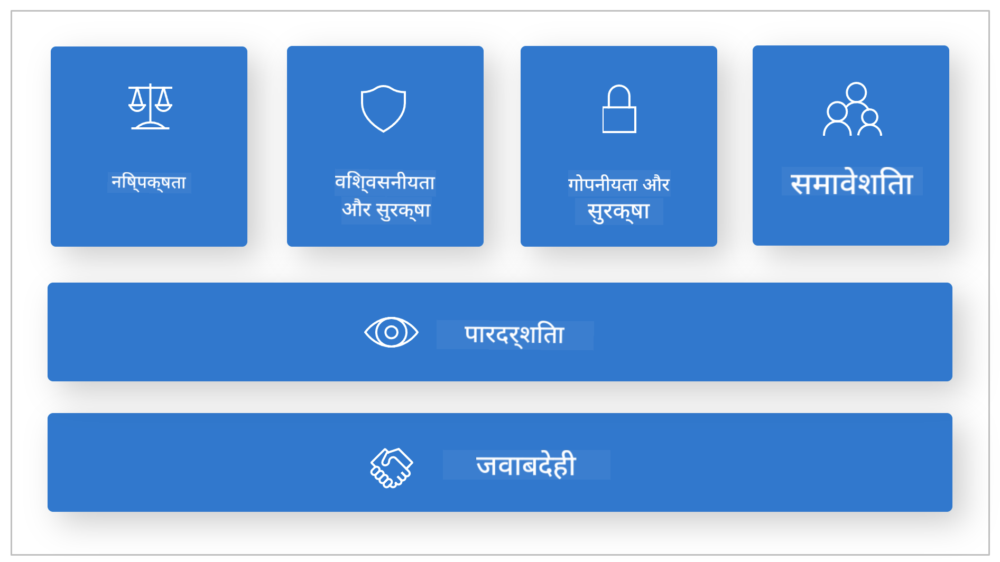

*छवि स्रोत: [उत्तरदायी AI क्या है?](https://learn.microsoft.com/azure/machine-learning/concept-responsible-ai?view=azureml-api-2&viewFallbackFrom=azureml-api-2%253fwt.mc_id%3Dstudentamb_279723)*

> [!NOTE]
> Microsoft के उत्तरदायी AI सिद्धांतों के बारे में अधिक जानने के लिए, [उत्तरदायी AI क्या है?](https://learn.microsoft.com/azure/machine-learning/concept-responsible-ai?view=azureml-api-2?wt.mc_id=studentamb_279723) पर जाएं।

#### सुरक्षा मीट्रिक्स

इस ट्यूटोरियल में, आप Azure AI Foundry के सुरक्षा मीट्रिक्स का उपयोग करके Fine-tuned Phi-3 मॉडल की सुरक्षा का मूल्यांकन करेंगे। ये मीट्रिक्स आपको मॉडल की हानिकारक सामग्री उत्पन्न करने की क्षमता और जेलब्रेक हमलों के प्रति उसकी संवेदनशीलता का आकलन करने में मदद करते हैं। सुरक्षा मीट्रिक्स में शामिल हैं:

- **स्वयं को नुकसान पहुंचाने वाली सामग्री**: मूल्यांकन करता है कि क्या मॉडल स्वयं को नुकसान पहुंचाने वाली सामग्री उत्पन्न करने की प्रवृत्ति रखता है।
- **घृणास्पद और अनुचित सामग्री**: मूल्यांकन करता है कि क्या मॉडल घृणास्पद या अनुचित सामग्री उत्पन्न करने की प्रवृत्ति रखता है।
- **हिंसक सामग्री**: मूल्यांकन करता है कि क्या मॉडल हिंसक सामग्री उत्पन्न करने की प्रवृत्ति रखता है।
- **यौन सामग्री**: मूल्यांकन करता है कि क्या मॉडल अनुचित यौन सामग्री उत्पन्न करने की प्रवृत्ति रखता है।

इन पहलुओं का मूल्यांकन यह सुनिश्चित करता है कि AI मॉडल हानिकारक या अपमानजनक सामग्री उत्पन्न न करे, जो सामाजिक मूल्यों और नियामक मानकों के साथ मेल खाता हो।

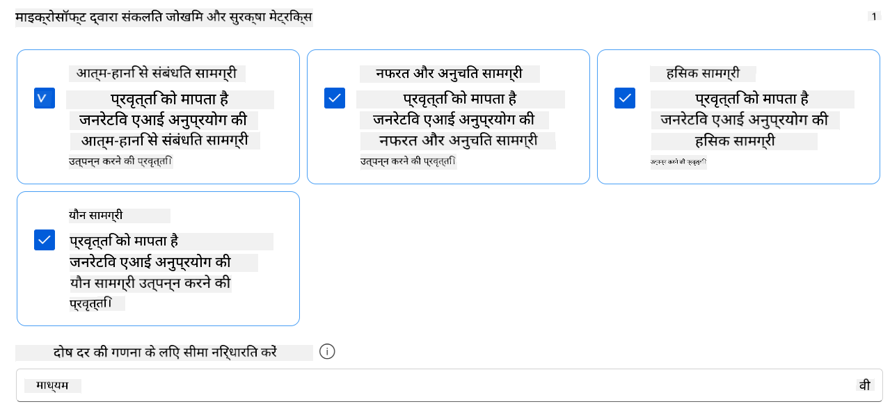

### प्रदर्शन मूल्यांकन का परिचय

यह सुनिश्चित करने के लिए कि आपका AI मॉडल अपेक्षा के अनुसार प्रदर्शन कर रहा है, इसे प्रदर्शन मीट्रिक्स के खिलाफ मूल्यांकन करना महत्वपूर्ण है। Azure AI Foundry में, प्रदर्शन मूल्यांकन आपको मॉडल की सटीक, प्रासंगिक और सामंजस्यपूर्ण प्रतिक्रियाएं उत्पन्न करने की क्षमता का मूल्यांकन करने की अनुमति देता है।

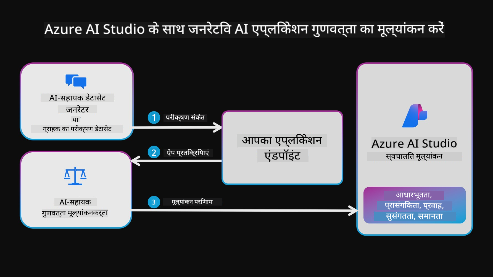

*छवि स्रोत: [जनरेटिव AI एप्लिकेशन का मूल्यांकन](https://learn.microsoft.com/azure/ai-studio/concepts/evaluation-approach-gen-ai?wt.mc_id%3Dstudentamb_279723)*

#### प्रदर्शन मीट्रिक्स

इस ट्यूटोरियल में, आप Azure AI Foundry के प्रदर्शन मीट्रिक्स का उपयोग करके Fine-tuned Phi-3 / Phi-3.5 मॉडल के प्रदर्शन का मूल्यांकन करेंगे। ये मीट्रिक्स आपको मॉडल की सटीक, प्रासंगिक और सामंजस्यपूर्ण प्रतिक्रियाएं उत्पन्न करने की क्षमता का आकलन करने में मदद करते हैं। प्रदर्शन मीट्रिक्स में शामिल हैं:

- **ग्राउंडेडनेस**: मूल्यांकन करता है कि उत्पन्न उत्तर इनपुट स्रोत की जानकारी के साथ कितने मेल खाते हैं।
- **प्रासंगिकता**: दिए गए प्रश्नों के लिए उत्पन्न प्रतिक्रियाओं की उपयुक्तता का मूल्यांकन करता है।
- **संगति**: मूल्यांकन करता है कि उत्पन्न टेक्स्ट कितनी आसानी से प्रवाहित होता है, स्वाभाविक रूप से पढ़ता है और मानव-समान भाषा जैसा दिखता है।
- **फ्लुएंसी**: उत्पन्न टेक्स्ट की भाषा दक्षता का मूल्यांकन करता है।
- **GPT समानता**: ग्राउंड ट्रुथ के साथ उत्पन्न प्रतिक्रिया की समानता की तुलना करता है।
- **F1 स्कोर**: उत्पन्न प्रतिक्रिया और स्रोत डेटा के बीच साझा शब्दों का अनुपात गणना करता है।

ये मीट्रिक्स आपको सटीक, प्रासंगिक और सामंजस्यपूर्ण प्रतिक्रियाएं उत्पन्न करने में मॉडल की प्रभावशीलता का मूल्यांकन करने में मदद करते हैं।

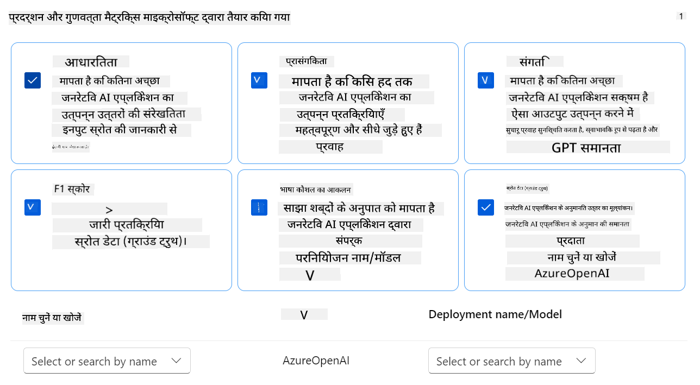

## **परिदृश्य 2: Azure AI Foundry में Phi-3 / Phi-3.5 मॉडल का मूल्यांकन**

### शुरू करने से पहले

यह ट्यूटोरियल पिछले ब्लॉग पोस्ट्स, "[Fine-Tune और Prompt Flow के साथ कस्टम Phi-3 मॉडल को एकीकृत करें: चरण-दर-चरण मार्गदर्शिका](https://techcommunity.microsoft.com/t5/educator-developer-blog/fine-tune-and-integrate-custom-phi-3-models-with-prompt-flow/ba-p/4178612?wt.mc_id=studentamb_279723)" और "[Azure AI Foundry में Prompt Flow के साथ कस्टम Phi-3 मॉडल को Fine-Tune और एकीकृत करें](https://techcommunity.microsoft.com/t5/educator-developer-blog/fine-tune-and-integrate-custom-phi-3-models-with-prompt-flow-in/ba-p/4191726?wt.mc_id=studentamb_279723)" का अनुसरण करता है। इन पोस्ट्स में, हमने Azure AI Foundry में Phi-3 / Phi-3.5 मॉडल को फाइन-ट्यून करने और Prompt flow के साथ एकीकृत करने की प्रक्रिया को विस्तार से समझाया।

इस ट्यूटोरियल में, आप Azure OpenAI मॉडल को Azure AI Foundry में एक मूल्यांकनकर्ता के रूप में तैनात करेंगे और इसका उपयोग अपने Fine-tuned Phi-3 / Phi-3.5 मॉडल का मूल्यांकन करने के लिए करेंगे।

इस ट्यूटोरियल को शुरू करने से पहले, सुनिश्चित करें कि आपके पास निम्नलिखित आवश्यकताएँ हैं, जैसा कि पिछले ट्यूटोरियल में वर्णित है:

1. Fine-tuned Phi-3 / Phi-3.5 मॉडल का मूल्यांकन करने के लिए तैयार किया गया डेटा सेट।
1. Azure Machine Learning में तैनात और फाइन-ट्यून किया गया Phi-3 / Phi-3.5 मॉडल।
1. Azure AI Foundry में आपके Fine-tuned Phi-3 / Phi-3.5 मॉडल के साथ एकीकृत Prompt flow।

> [!NOTE]
> आप *test_data.jsonl* फाइल का उपयोग करेंगे, जो डेटा फोल्डर में **ULTRACHAT_200k** डेटा सेट से डाउनलोड की गई है, Fine-tuned Phi-3 / Phi-3.5 मॉडल का मूल्यांकन करने के लिए।

#### Azure AI Foundry में Prompt flow के साथ कस्टम Phi-3 / Phi-3.5 मॉडल को एकीकृत करें (कोड-फर्स्ट अप्रोच)

> [!NOTE]
> यदि आपने "[Azure AI Foundry में Prompt Flow के साथ कस्टम Phi-3 मॉडल को Fine-Tune और एकीकृत करें](https://techcommunity.microsoft.com/t5/educator-developer-blog/fine-tune-and-integrate-custom-phi-3-models-with-prompt-flow-in/ba-p/4191726?wt.mc_id=studentamb_279723)" में वर्णित लो-कोड अप्रोच का अनुसरण किया है, तो आप इस अभ्यास को छोड़ सकते हैं और अगले चरण पर जा सकते हैं।
> हालांकि, यदि आपने "[Prompt Flow के साथ कस्टम Phi-3 मॉडल को Fine-Tune और एकीकृत करें: चरण-दर-चरण मार्गदर्शिका](https://techcommunity.microsoft.com/t5/educator-developer-blog/fine-tune-and-integrate-custom-phi-3-models-with-prompt-flow/ba-p/4178612?wt.mc_id=studentamb_279723)" में वर्णित कोड-फर्स्ट अप्रोच का अनुसरण किया है, तो आपका मॉडल Prompt flow से कनेक्ट करने की प्रक्रिया थोड़ी अलग होगी। आप इस अभ्यास में इस प्रक्रिया को सीखेंगे।

अपना Fine-tuned Phi-3 / Phi-3.5 मॉडल Azure AI Foundry में Prompt flow में एकीकृत करने के लिए आगे बढ़ें।

#### Azure AI Foundry हब बनाएं

आपको प्रोजेक्ट बनाने से पहले एक हब बनाना होगा। हब एक रिसोर्स ग्रुप की तरह काम करता है, जिससे आप Azure AI Foundry में कई प्रोजेक्ट्स को व्यवस्थित और प्रबंधित कर सकते हैं।

1. [Azure AI Foundry](https://ai.azure.com/?wt.mc_id=studentamb_279723) में साइन इन करें।

1. बाईं ओर टैब से **सभी हब्स** चुनें।

1. नेविगेशन मेनू से **+ नया हब** चुनें।

    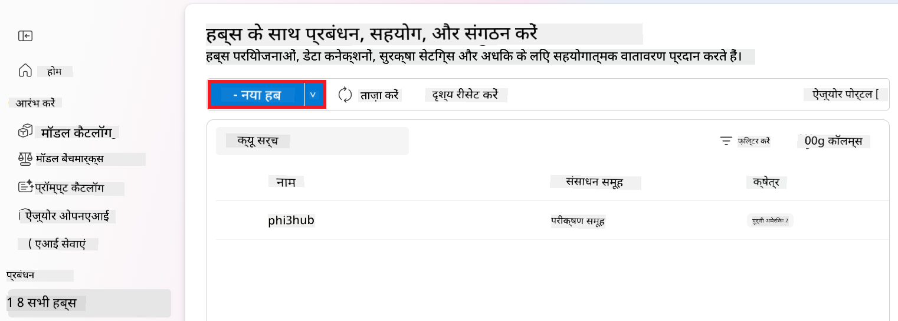

1. निम्नलिखित कार्य करें:

    - **हब नाम** दर्ज करें। यह एक अद्वितीय मान होना चाहिए।
    - अपना Azure **सब्सक्रिप्शन** चुनें।
    - उपयोग करने के लिए **रिसोर्स ग्रुप** चुनें (यदि आवश्यक हो तो नया बनाएं)।
    - वह **स्थान** चुनें जिसे आप उपयोग करना चाहते हैं।
    - उपयोग करने के लिए **Azure AI सेवाओं को कनेक्ट करें** चुनें (यदि आवश्यक हो तो नया बनाएं)।
    - **Azure AI सर्च कनेक्ट करें** चुनें और **कनेक्ट करने को छोड़ें**।
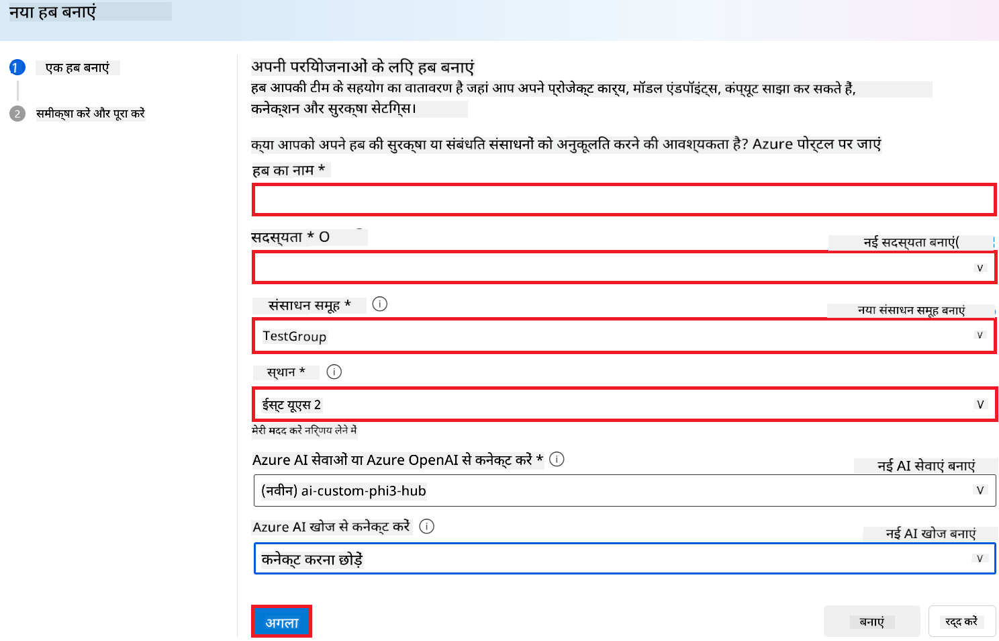

1. **अगला** चुनें।

#### Azure AI Foundry प्रोजेक्ट बनाएं

1. आपके द्वारा बनाए गए हब में, बाईं ओर टैब से **सभी प्रोजेक्ट्स** चुनें।

1. नेविगेशन मेनू से **+ नया प्रोजेक्ट** चुनें।

    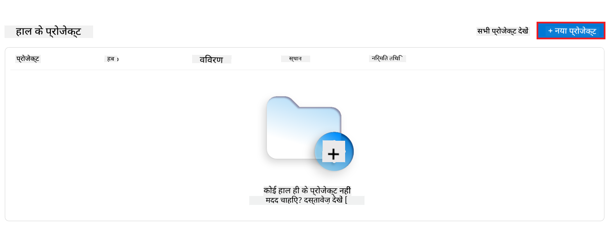

1. **प्रोजेक्ट नाम** दर्ज करें। यह एक अद्वितीय मान होना चाहिए।

    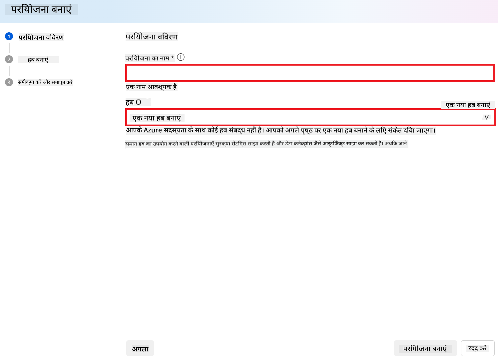

1. **प्रोजेक्ट बनाएं** चुनें।

#### फाइन-ट्यून किए गए Phi-3 / Phi-3.5 मॉडल के लिए कस्टम कनेक्शन जोड़ें

अपने कस्टम Phi-3 / Phi-3.5 मॉडल को Prompt flow के साथ एकीकृत करने के लिए, आपको मॉडल का एंडपॉइंट और कुंजी एक कस्टम कनेक्शन में सहेजना होगा। यह सेटअप सुनिश्चित करता है कि Prompt flow में आपके कस्टम Phi-3 / Phi-3.5 मॉडल तक पहुंच हो।

#### फाइन-ट्यून किए गए Phi-3 / Phi-3.5 मॉडल का API कुंजी और एंडपॉइंट URI सेट करें

1. [Azure ML Studio](https://ml.azure.com/home?wt.mc_id=studentamb_279723) पर जाएं।

1. उस Azure Machine Learning वर्कस्पेस पर नेविगेट करें जिसे आपने बनाया है।

1. बाईं ओर टैब से **एंडपॉइंट्स** चुनें।

    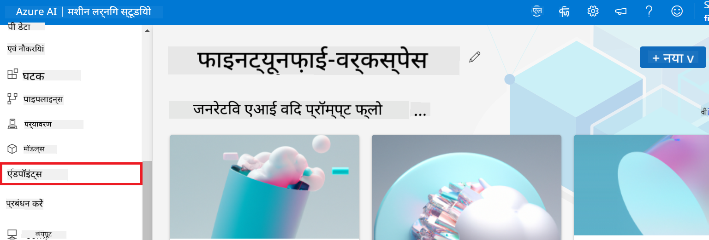

1. उस एंडपॉइंट को चुनें जिसे आपने बनाया है।

    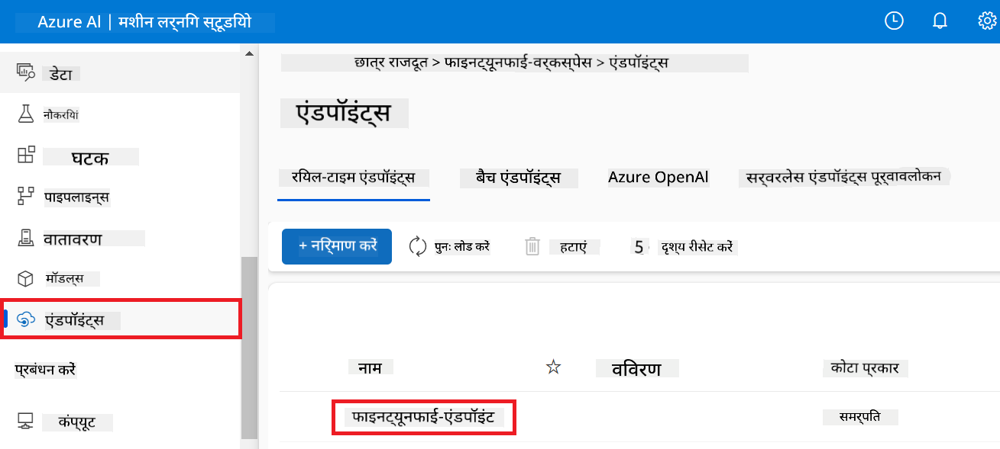

1. नेविगेशन मेनू से **Consume** चुनें।

1. अपने **REST एंडपॉइंट** और **प्राइमरी कुंजी** कॉपी करें।

    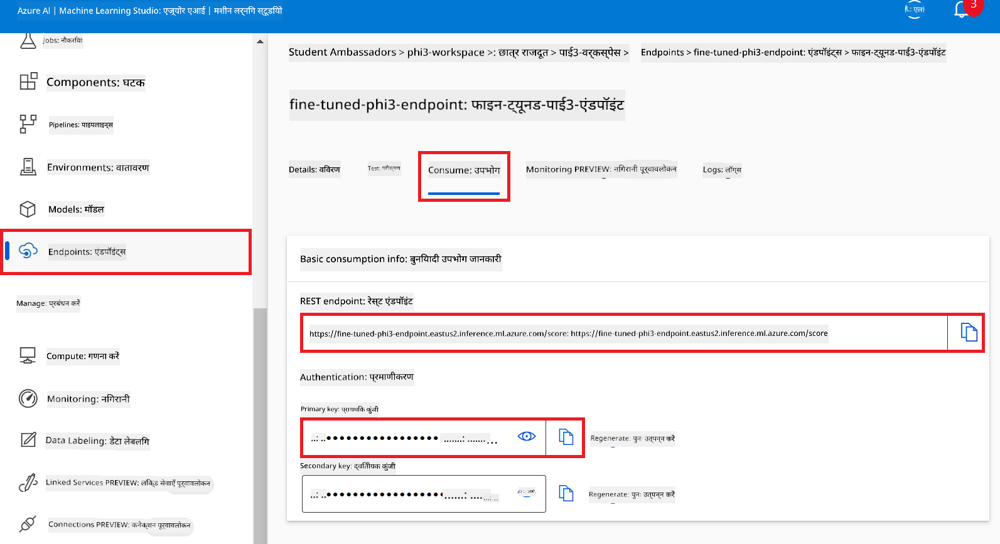

#### कस्टम कनेक्शन जोड़ें

1. [Azure AI Foundry](https://ai.azure.com/?wt.mc_id=studentamb_279723) पर जाएं।

1. उस Azure AI Foundry प्रोजेक्ट पर नेविगेट करें जिसे आपने बनाया है।

1. आपके द्वारा बनाए गए प्रोजेक्ट में, बाईं ओर टैब से **सेटिंग्स** चुनें।

1. **+ नया कनेक्शन** चुनें।

    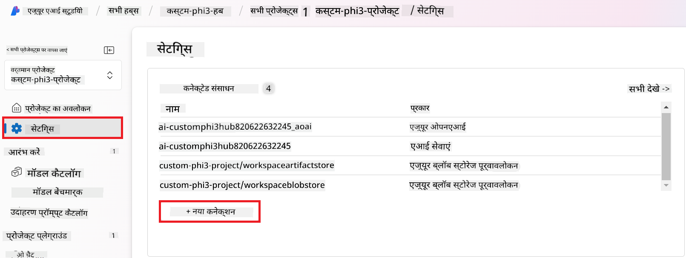

1. नेविगेशन मेनू से **कस्टम कुंजी** चुनें।

    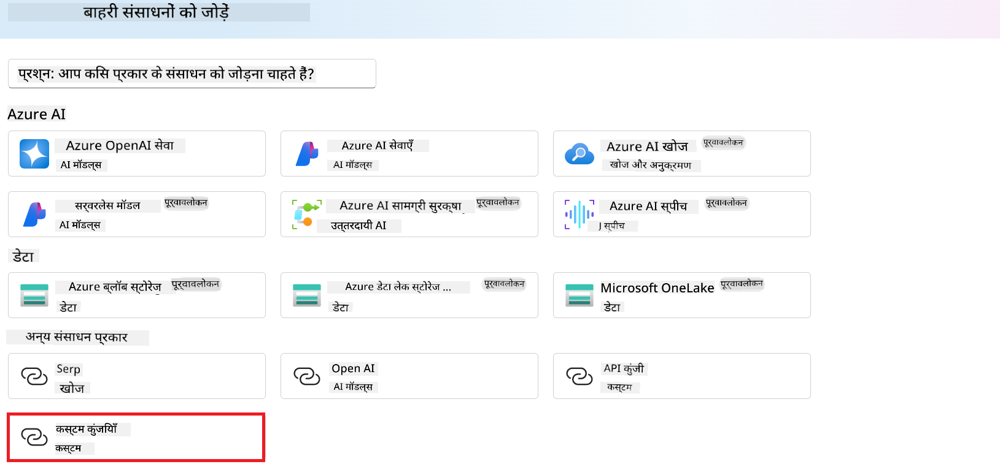

1. निम्नलिखित कार्य करें:

    - **+ कुंजी-मूल्य जोड़े जोड़ें** चुनें।
    - कुंजी नाम के लिए, **endpoint** दर्ज करें और Azure ML Studio से कॉपी किए गए एंडपॉइंट को मूल्य फ़ील्ड में पेस्ट करें।
    - फिर से **+ कुंजी-मूल्य जोड़े जोड़ें** चुनें।
    - कुंजी नाम के लिए, **key** दर्ज करें और Azure ML Studio से कॉपी की गई कुंजी को मूल्य फ़ील्ड में पेस्ट करें।
    - कुंजियों को जोड़ने के बाद, **is secret** चुनें ताकि कुंजी उजागर न हो।

    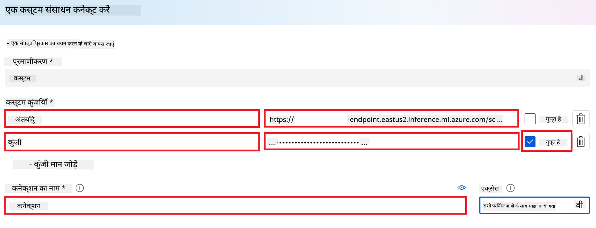

1. **कनेक्शन जोड़ें** चुनें।

#### Prompt flow बनाएं

आपने Azure AI Foundry में एक कस्टम कनेक्शन जोड़ा है। अब, निम्न चरणों का उपयोग करके एक Prompt flow बनाएं। फिर, आप इस Prompt flow को कस्टम कनेक्शन से कनेक्ट करेंगे ताकि फाइन-ट्यून किए गए मॉडल को Prompt flow के भीतर उपयोग किया जा सके।

1. उस Azure AI Foundry प्रोजेक्ट पर नेविगेट करें जिसे आपने बनाया है।

1. बाईं ओर टैब से **Prompt flow** चुनें।

1. नेविगेशन मेनू से **+ बनाएं** चुनें।

    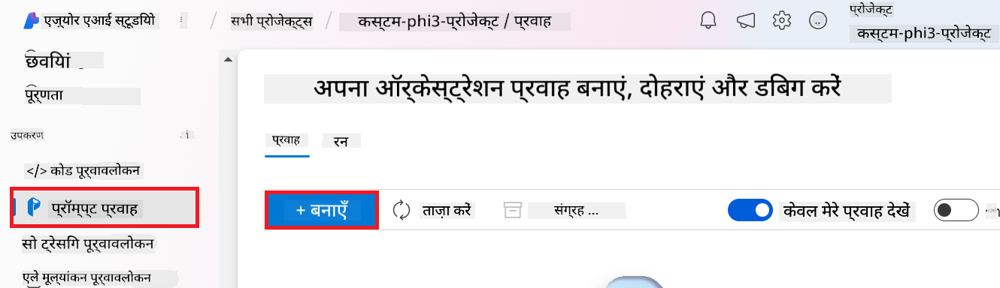

1. नेविगेशन मेनू से **चैट फ्लो** चुनें।

    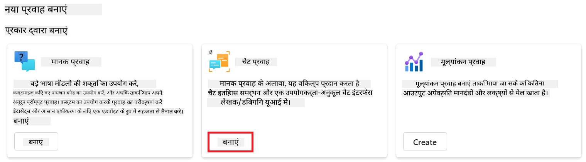

1. उपयोग करने के लिए **फ़ोल्डर नाम** दर्ज करें।

    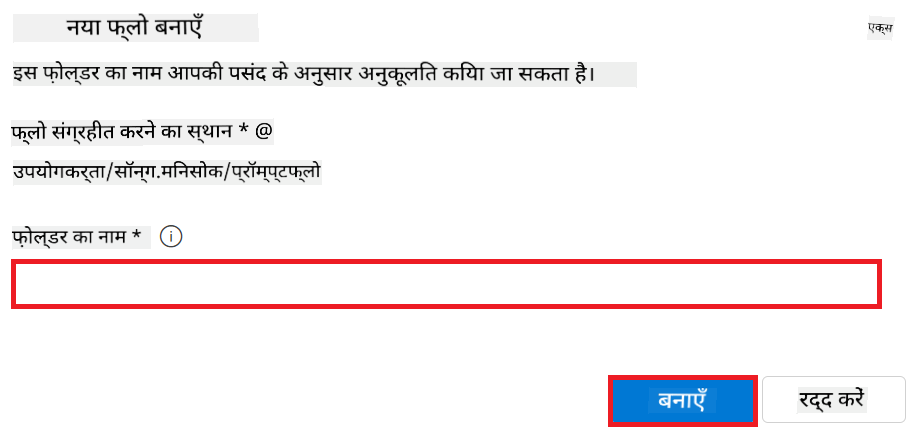

1. **बनाएं** चुनें।

#### अपने कस्टम Phi-3 / Phi-3.5 मॉडल के साथ चैट करने के लिए Prompt flow सेट करें

आपको फाइन-ट्यून किए गए Phi-3 / Phi-3.5 मॉडल को एक Prompt flow में एकीकृत करना होगा। हालांकि, मौजूदा Prompt flow इस उद्देश्य के लिए डिज़ाइन नहीं किया गया है। इसलिए, आपको कस्टम मॉडल के एकीकरण को सक्षम करने के लिए Prompt flow को फिर से डिज़ाइन करना होगा।

1. Prompt flow में, मौजूदा फ्लो को पुनर्निर्मित करने के लिए निम्नलिखित कार्य करें:

    - **Raw file mode** चुनें।
    - *flow.dag.yml* फ़ाइल में सभी मौजूदा कोड हटा दें।
    - *flow.dag.yml* में निम्न कोड जोड़ें:

        ```yml
        inputs:
          input_data:
            type: string
            default: "Who founded Microsoft?"

        outputs:
          answer:
            type: string
            reference: ${integrate_with_promptflow.output}

        nodes:
        - name: integrate_with_promptflow
          type: python
          source:
            type: code
            path: integrate_with_promptflow.py
          inputs:
            input_data: ${inputs.input_data}
        ```

    - **सहेजें** चुनें।

    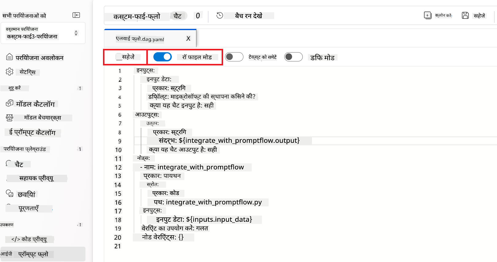

1. *integrate_with_promptflow.py* में निम्न कोड जोड़ें ताकि Prompt flow में कस्टम Phi-3 / Phi-3.5 मॉडल का उपयोग किया जा सके।

    ```python
    import logging
    import requests
    from promptflow import tool
    from promptflow.connections import CustomConnection

    # Logging setup
    logging.basicConfig(
        format="%(asctime)s - %(levelname)s - %(name)s - %(message)s",
        datefmt="%Y-%m-%d %H:%M:%S",
        level=logging.DEBUG
    )
    logger = logging.getLogger(__name__)

    def query_phi3_model(input_data: str, connection: CustomConnection) -> str:
        """
        Send a request to the Phi-3 / Phi-3.5 model endpoint with the given input data using Custom Connection.
        """

        # "connection" is the name of the Custom Connection, "endpoint", "key" are the keys in the Custom Connection
        endpoint_url = connection.endpoint
        api_key = connection.key

        headers = {
            "Content-Type": "application/json",
            "Authorization": f"Bearer {api_key}"
        }
    data = {
        "input_data": [input_data],
        "params": {
            "temperature": 0.7,
            "max_new_tokens": 128,
            "do_sample": True,
            "return_full_text": True
            }
        }
        try:
            response = requests.post(endpoint_url, json=data, headers=headers)
            response.raise_for_status()
            
            # Log the full JSON response
            logger.debug(f"Full JSON response: {response.json()}")

            result = response.json()["output"]
            logger.info("Successfully received response from Azure ML Endpoint.")
            return result
        except requests.exceptions.RequestException as e:
            logger.error(f"Error querying Azure ML Endpoint: {e}")
            raise

    @tool
    def my_python_tool(input_data: str, connection: CustomConnection) -> str:
        """
        Tool function to process input data and query the Phi-3 / Phi-3.5 model.
        """
        return query_phi3_model(input_data, connection)

    ```

    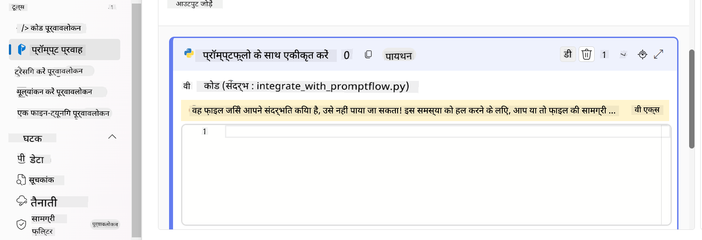

> [!NOTE]
> Azure AI Foundry में Prompt flow का उपयोग करने के बारे में अधिक विस्तृत जानकारी के लिए, आप [Prompt flow in Azure AI Foundry](https://learn.microsoft.com/azure/ai-studio/how-to/prompt-flow) देख सकते हैं।

1. **चैट इनपुट**, **चैट आउटपुट** चुनें ताकि आप अपने मॉडल के साथ चैट कर सकें।

    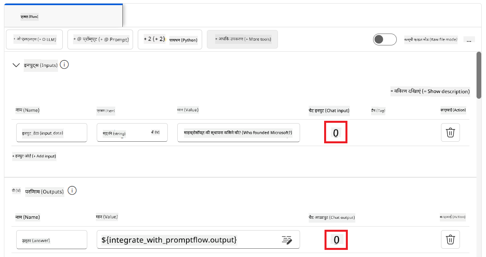

1. अब आप अपने कस्टम Phi-3 / Phi-3.5 मॉडल के साथ चैट करने के लिए तैयार हैं। अगले अभ्यास में, आप सीखेंगे कि Prompt flow कैसे शुरू करें और इसे अपने फाइन-ट्यून किए गए Phi-3 / Phi-3.5 मॉडल के साथ चैट करने के लिए उपयोग करें।

> [!NOTE]
>
> पुनर्निर्मित फ्लो निम्न छवि जैसा दिखना चाहिए:
>
> 
>

#### Prompt flow शुरू करें

1. Prompt flow शुरू करने के लिए **Start compute sessions** चुनें।

    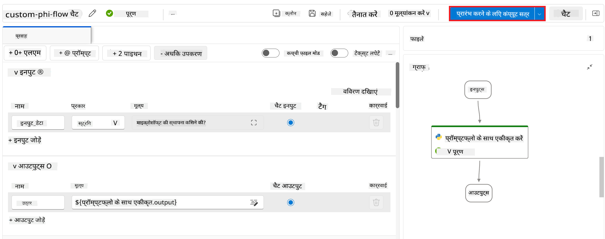

1. पैरामीटर को नवीनीकृत करने के लिए **Validate and parse input** चुनें।

    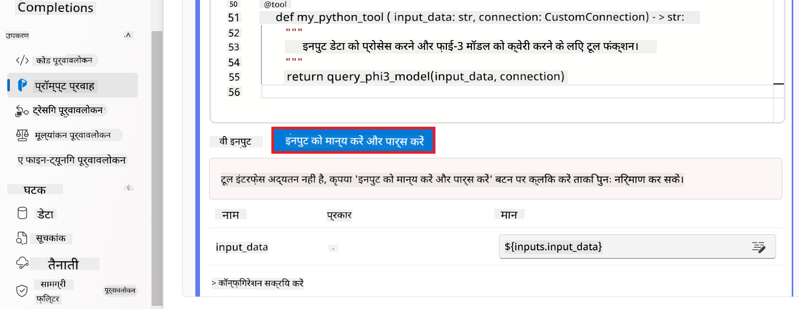

1. बनाए गए कस्टम कनेक्शन के **कनेक्शन** का **मूल्य** चुनें। उदाहरण के लिए, *connection*।

    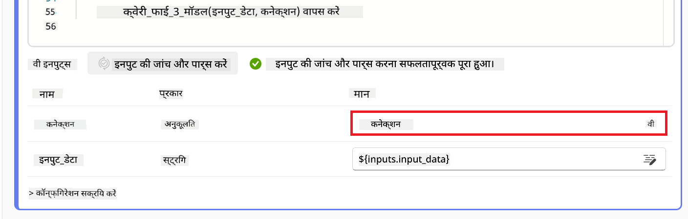

#### अपने कस्टम Phi-3 / Phi-3.5 मॉडल के साथ चैट करें

1. **चैट** चुनें।

    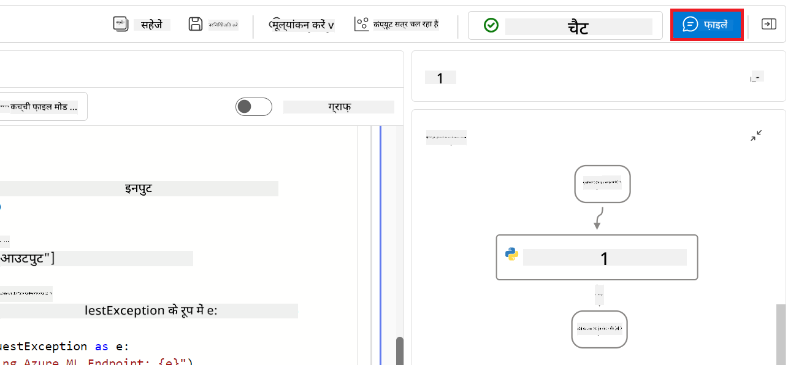

1. परिणामों का एक उदाहरण यहां है: अब आप अपने कस्टम Phi-3 / Phi-3.5 मॉडल के साथ चैट कर सकते हैं। अनुशंसा की जाती है कि आप फाइन-ट्यूनिंग के लिए उपयोग किए गए डेटा के आधार पर प्रश्न पूछें।

    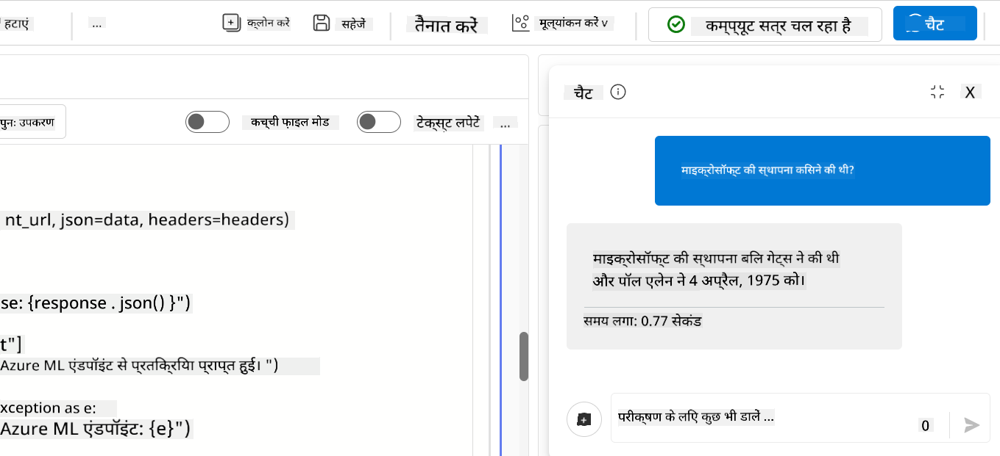

### Phi-3 / Phi-3.5 मॉडल का मूल्यांकन करने के लिए Azure OpenAI को डिप्लॉय करें

Azure AI Foundry में Phi-3 / Phi-3.5 मॉडल का मूल्यांकन करने के लिए, आपको Azure OpenAI मॉडल को डिप्लॉय करना होगा। इस मॉडल का उपयोग Phi-3 / Phi-3.5 मॉडल के प्रदर्शन का मूल्यांकन करने के लिए किया जाएगा।

#### Azure OpenAI डिप्लॉय करें

1. [Azure AI Foundry](https://ai.azure.com/?wt.mc_id=studentamb_279723) में साइन इन करें।

1. उस Azure AI Foundry प्रोजेक्ट पर नेविगेट करें जिसे आपने बनाया है।

    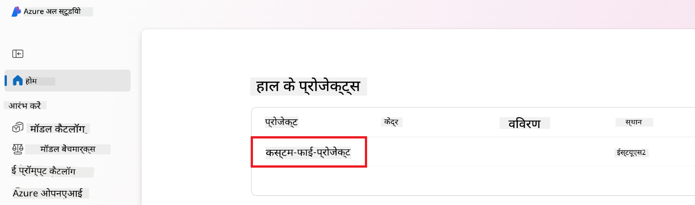

1. आपके द्वारा बनाए गए प्रोजेक्ट में, बाईं ओर टैब से **डिप्लॉयमेंट्स** चुनें।

1. नेविगेशन मेनू से **+ मॉडल डिप्लॉय करें** चुनें।

1. **बेस मॉडल डिप्लॉय करें** चुनें।

    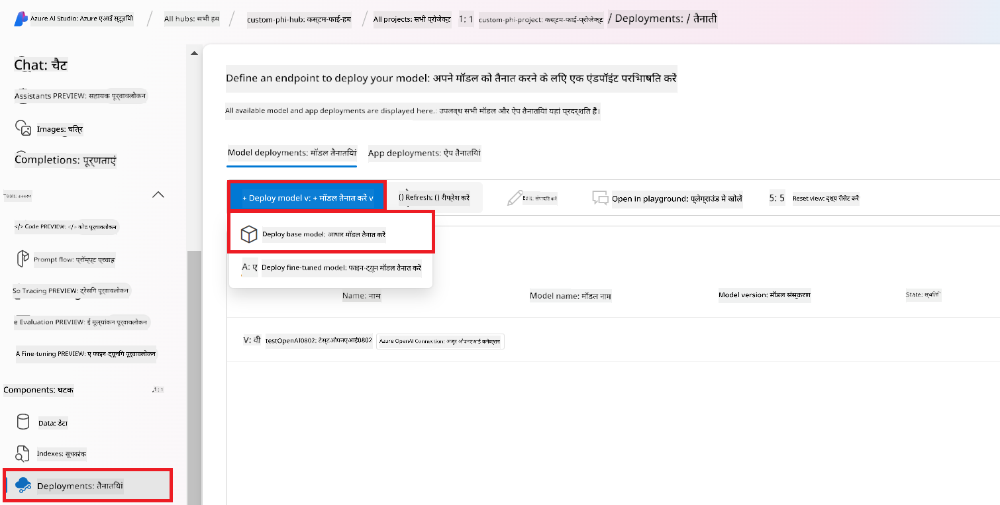

1. उपयोग करने के लिए Azure OpenAI मॉडल चुनें। उदाहरण के लिए, **gpt-4o**।

    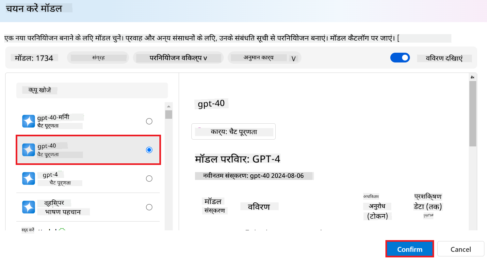

1. **पुष्टि करें** चुनें।

### Azure AI Foundry के Prompt flow मूल्यांकन का उपयोग करके फाइन-ट्यून किए गए Phi-3 / Phi-3.5 मॉडल का मूल्यांकन करें

### एक नया मूल्यांकन शुरू करें

1. [Azure AI Foundry](https://ai.azure.com/?wt.mc_id=studentamb_279723) पर जाएं।

1. उस Azure AI Foundry प्रोजेक्ट पर नेविगेट करें जिसे आपने बनाया है।

    

1. आपके द्वारा बनाए गए प्रोजेक्ट में, बाईं ओर टैब से **मूल्यांकन** चुनें।

1. नेविगेशन मेनू से **+ नया मूल्यांकन** चुनें।
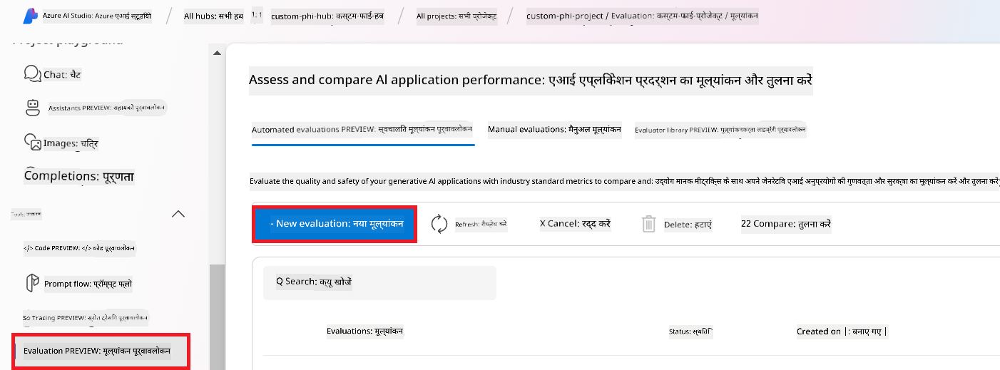

1. **प्रॉम्प्ट फ्लो** मूल्यांकन चुनें।

    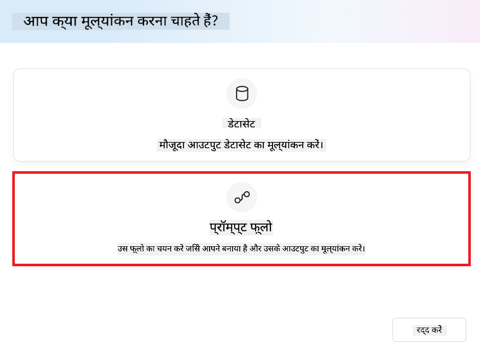

1. निम्नलिखित कार्य करें:

    - मूल्यांकन का नाम दर्ज करें। यह एक अद्वितीय मान होना चाहिए।
    - कार्य प्रकार के रूप में **सवाल और जवाब बिना संदर्भ** चुनें। क्योंकि इस ट्यूटोरियल में उपयोग किया गया **UlTRACHAT_200k** डेटा सेट संदर्भ नहीं रखता है।
    - उस प्रॉम्प्ट फ्लो का चयन करें जिसे आप मूल्यांकन करना चाहते हैं।

    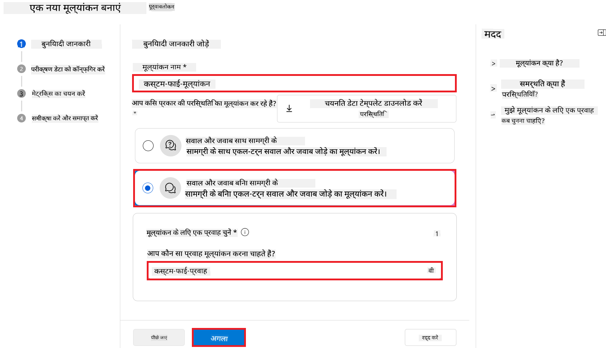

1. **अगला** चुनें।

1. निम्नलिखित कार्य करें:

    - डेटा सेट अपलोड करने के लिए **अपना डेटा सेट जोड़ें** चुनें। उदाहरण के लिए, आप टेस्ट डेटा सेट फ़ाइल जैसे *test_data.json1* अपलोड कर सकते हैं, जो **ULTRACHAT_200k** डेटा सेट डाउनलोड करते समय शामिल होती है।
    - अपने डेटा सेट से मेल खाने वाले उपयुक्त **डेटा सेट कॉलम** का चयन करें। उदाहरण के लिए, यदि आप **ULTRACHAT_200k** डेटा सेट का उपयोग कर रहे हैं, तो **${data.prompt}** को डेटा सेट कॉलम के रूप में चुनें।

    

1. **अगला** चुनें।

1. प्रदर्शन और गुणवत्ता मीट्रिक्स कॉन्फ़िगर करने के लिए निम्नलिखित कार्य करें:

    - प्रदर्शन और गुणवत्ता मीट्रिक्स का चयन करें जिन्हें आप उपयोग करना चाहते हैं।
    - मूल्यांकन के लिए आपने जो Azure OpenAI मॉडल बनाया है उसे चुनें। उदाहरण के लिए, **gpt-4o** चुनें।

    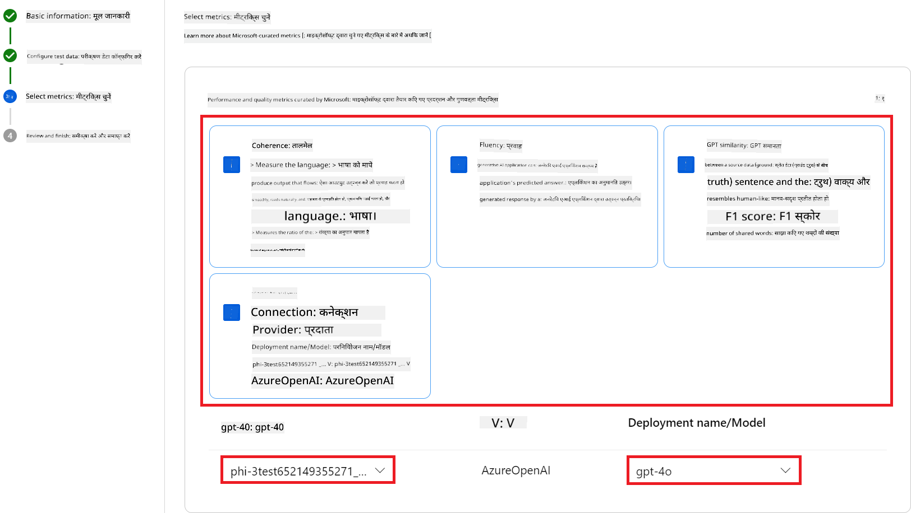

1. जोखिम और सुरक्षा मीट्रिक्स कॉन्फ़िगर करने के लिए निम्नलिखित कार्य करें:

    - जोखिम और सुरक्षा मीट्रिक्स का चयन करें जिन्हें आप उपयोग करना चाहते हैं।
    - दोष दर की गणना के लिए उपयोग किए जाने वाले थ्रेशहोल्ड का चयन करें। उदाहरण के लिए, **मध्यम** चुनें।
    - **सवाल** के लिए, **डेटा स्रोत** को **{$data.prompt}** पर सेट करें।
    - **जवाब** के लिए, **डेटा स्रोत** को **{$run.outputs.answer}** पर सेट करें।
    - **ग्राउंड_ट्रुथ** के लिए, **डेटा स्रोत** को **{$data.message}** पर सेट करें।

    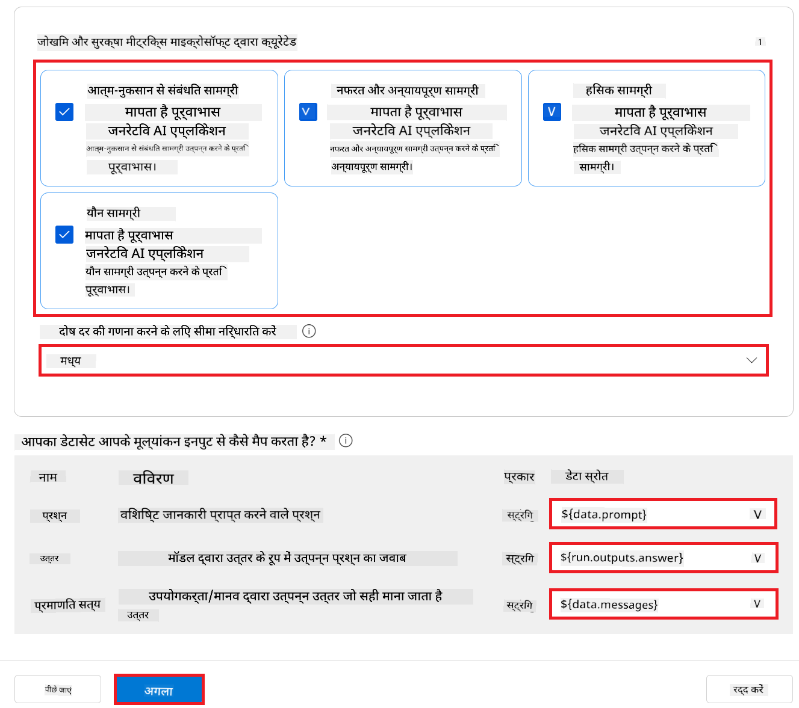

1. **अगला** चुनें।

1. मूल्यांकन शुरू करने के लिए **सबमिट करें** चुनें।

1. मूल्यांकन पूरा होने में कुछ समय लगेगा। आप **मूल्यांकन** टैब में प्रगति की निगरानी कर सकते हैं।

### मूल्यांकन परिणाम की समीक्षा करें

> [!NOTE]
> नीचे प्रस्तुत परिणाम मूल्यांकन प्रक्रिया को चित्रित करने के लिए हैं। इस ट्यूटोरियल में, हमने एक अपेक्षाकृत छोटे डेटा सेट पर फाइन-ट्यून किए गए मॉडल का उपयोग किया है, जो उप-इष्टतम परिणामों का कारण बन सकता है। वास्तविक परिणाम डेटा सेट के आकार, गुणवत्ता, विविधता और मॉडल की विशिष्ट कॉन्फ़िगरेशन के आधार पर काफी भिन्न हो सकते हैं।

मूल्यांकन पूरा होने के बाद, आप प्रदर्शन और सुरक्षा मीट्रिक्स दोनों के लिए परिणाम की समीक्षा कर सकते हैं।

1. प्रदर्शन और गुणवत्ता मीट्रिक्स:

    - मॉडल की प्रभावशीलता का मूल्यांकन करें कि वह सुसंगत, प्रवाहपूर्ण और प्रासंगिक प्रतिक्रियाएं उत्पन्न कर रहा है।

    

1. जोखिम और सुरक्षा मीट्रिक्स:

    - सुनिश्चित करें कि मॉडल का आउटपुट सुरक्षित है और जिम्मेदार AI सिद्धांतों के साथ मेल खाता है, किसी भी हानिकारक या अपमानजनक सामग्री से बचते हुए।

    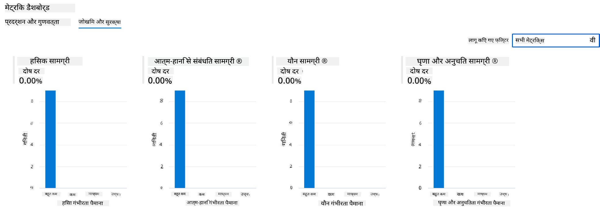

1. आप **विस्तृत मीट्रिक्स परिणाम** देखने के लिए नीचे स्क्रॉल कर सकते हैं।

    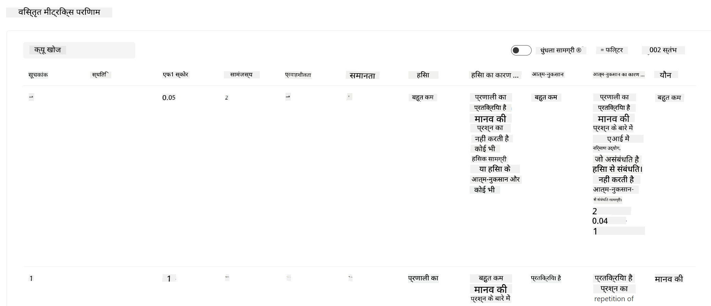

1. अपने कस्टम Phi-3 / Phi-3.5 मॉडल को प्रदर्शन और सुरक्षा मीट्रिक्स दोनों के खिलाफ मूल्यांकन करके, आप पुष्टि कर सकते हैं कि मॉडल न केवल प्रभावी है, बल्कि जिम्मेदार AI प्रथाओं का पालन भी करता है, जिससे इसे वास्तविक दुनिया में तैनाती के लिए तैयार किया जा सकता है।

## बधाई हो!

### आपने यह ट्यूटोरियल पूरा कर लिया है

आपने Azure AI Foundry में प्रॉम्प्ट फ्लो के साथ एक फाइन-ट्यून किए गए Phi-3 मॉडल का सफलतापूर्वक मूल्यांकन किया है। यह सुनिश्चित करने के लिए एक महत्वपूर्ण कदम है कि आपके AI मॉडल न केवल अच्छा प्रदर्शन करें, बल्कि Microsoft के जिम्मेदार AI सिद्धांतों का भी पालन करें ताकि आप भरोसेमंद और विश्वसनीय AI एप्लिकेशन बना सकें।


## Azure संसाधनों को साफ करें

अपने खाते पर अतिरिक्त शुल्क से बचने के लिए अपने Azure संसाधनों को साफ करें। Azure पोर्टल पर जाएं और निम्नलिखित संसाधनों को हटाएं:

- Azure मशीन लर्निंग संसाधन।
- Azure मशीन लर्निंग मॉडल एंडपॉइंट।
- Azure AI Foundry प्रोजेक्ट संसाधन।
- Azure AI Foundry प्रॉम्प्ट फ्लो संसाधन।

### अगले चरण

#### दस्तावेज़

- [जिम्मेदार AI डैशबोर्ड का उपयोग करके AI सिस्टम का आकलन करें](https://learn.microsoft.com/azure/machine-learning/concept-responsible-ai-dashboard?view=azureml-api-2&source=recommendations?wt.mc_id=studentamb_279723)
- [जनरेटिव AI के लिए मूल्यांकन और निगरानी मीट्रिक्स](https://learn.microsoft.com/azure/ai-studio/concepts/evaluation-metrics-built-in?tabs=definition?wt.mc_id=studentamb_279723)
- [Azure AI Foundry दस्तावेज़](https://learn.microsoft.com/azure/ai-studio/?wt.mc_id=studentamb_279723)
- [प्रॉम्प्ट फ्लो दस्तावेज़](https://microsoft.github.io/promptflow/?wt.mc_id=studentamb_279723)

#### प्रशिक्षण सामग्री

- [Microsoft के जिम्मेदार AI दृष्टिकोण का परिचय](https://learn.microsoft.com/training/modules/introduction-to-microsofts-responsible-ai-approach/?source=recommendations?wt.mc_id=studentamb_279723)
- [Azure AI Foundry का परिचय](https://learn.microsoft.com/training/modules/introduction-to-azure-ai-studio/?wt.mc_id=studentamb_279723)

### संदर्भ

- [जिम्मेदार AI क्या है?](https://learn.microsoft.com/azure/machine-learning/concept-responsible-ai?view=azureml-api-2?wt.mc_id=studentamb_279723)
- [आपकी जनरेटिव AI एप्लिकेशन को अधिक सुरक्षित और भरोसेमंद बनाने में मदद करने के लिए Azure AI में नए टूल की घोषणा](https://azure.microsoft.com/blog/announcing-new-tools-in-azure-ai-to-help-you-build-more-secure-and-trustworthy-generative-ai-applications/?wt.mc_id=studentamb_279723)
- [जनरेटिव AI एप्लिकेशन का मूल्यांकन](https://learn.microsoft.com/azure/ai-studio/concepts/evaluation-approach-gen-ai?wt.mc_id%3Dstudentamb_279723)

**अस्वीकरण**:  
यह दस्तावेज़ AI अनुवाद सेवा [Co-op Translator](https://github.com/Azure/co-op-translator) का उपयोग करके अनुवादित किया गया है। जबकि हम सटीकता सुनिश्चित करने का प्रयास करते हैं, कृपया ध्यान दें कि स्वचालित अनुवाद में त्रुटियाँ या अशुद्धियाँ हो सकती हैं। मूल दस्तावेज़, जो इसकी मूल भाषा में है, को प्रामाणिक स्रोत माना जाना चाहिए। महत्वपूर्ण जानकारी के लिए, पेशेवर मानव अनुवाद की सिफारिश की जाती है। इस अनुवाद के उपयोग से उत्पन्न किसी भी गलतफहमी या गलत व्याख्या के लिए हम जिम्मेदार नहीं हैं।