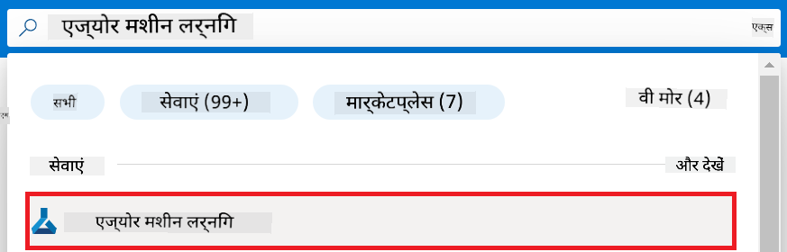
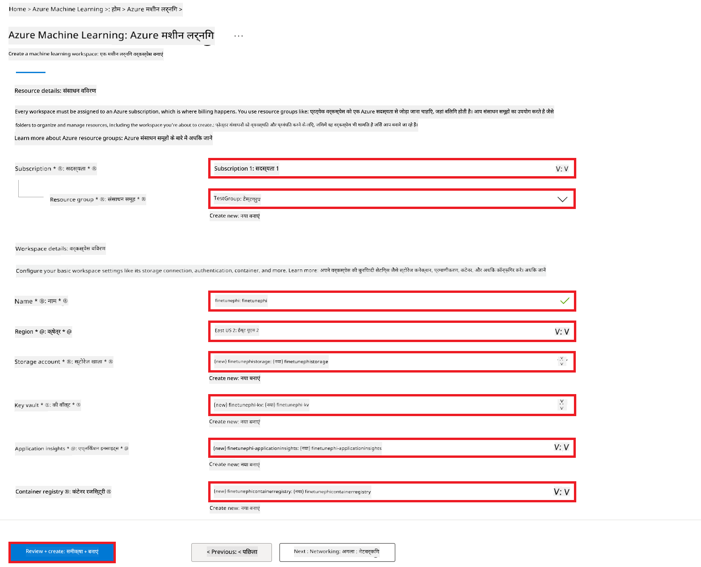
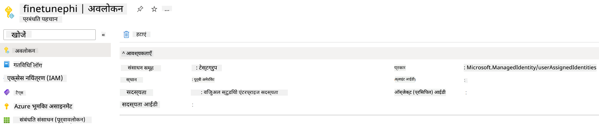

<!--
CO_OP_TRANSLATOR_METADATA:
{
  "original_hash": "7ca2c30fdb802664070e9cfbf92e24fe",
  "translation_date": "2026-01-05T16:30:50+00:00",
  "source_file": "md/02.Application/01.TextAndChat/Phi3/E2E_Phi-3-FineTuning_PromptFlow_Integration.md",
  "language_code": "hi"
}
-->
# कस्टम Phi-3 मॉडल को फाइन-ट्यून करें और Prompt flow के साथ एकीकृत करें

यह एंड-टू-एंड (E2E) उदाहरण Microsoft Tech Community के मार्गदर्शक "[Fine-Tune and Integrate Custom Phi-3 Models with Prompt Flow: Step-by-Step Guide](https://techcommunity.microsoft.com/t5/educator-developer-blog/fine-tune-and-integrate-custom-phi-3-models-with-prompt-flow/ba-p/4178612?WT.mc_id=aiml-137032-kinfeylo)" पर आधारित है। यह फाइन-ट्यूनिंग, तैनाती, और कस्टम Phi-3 मॉडलों को Prompt flow के साथ एकीकृत करने की प्रक्रियाओं को प्रस्तुत करता है।

## अवलोकन

इस E2E उदाहरण में, आप सीखेंगे कि Phi-3 मॉडल को कैसे फाइन-ट्यून करें और इसे Prompt flow के साथ कैसे एकीकृत करें। Azure Machine Learning और Prompt flow का लाभ उठाते हुए, आप कस्टम AI मॉडलों के तैनाती और उपयोग के लिए एक कार्यप्रवाह स्थापित करेंगे। यह E2E उदाहरण तीन परिदृश्यों में विभाजित है:

**परिदृश्य 1: Azure संसाधन सेटअप करें और फाइन-ट्यूनिंग के लिए तैयारी करें**

**परिदृश्य 2: Phi-3 मॉडल को फाइन-ट्यून करें और Azure Machine Learning Studio में तैनात करें**

**परिदृश्य 3: Prompt flow के साथ एकीकृत करें और अपने कस्टम मॉडल के साथ चैट करें**

यहाँ इस E2E उदाहरण का एक अवलोकन है।


### विषय सूची

1. **[परिदृश्य 1: Azure संसाधन सेटअप करें और फाइन-ट्यूनिंग के लिए तैयारी करें](../../../../../../md/02.Application/01.TextAndChat/Phi3)**
    - [Azure Machine Learning वर्कस्पेस बनाएं](../../../../../../md/02.Application/01.TextAndChat/Phi3)
    - [Azure सब्सक्रिप्शन में GPU कोटा का अनुरोध करें](../../../../../../md/02.Application/01.TextAndChat/Phi3)
    - [भूमिका असाइनमेंट जोड़ें](../../../../../../md/02.Application/01.TextAndChat/Phi3)
    - [प्रोजेक्ट सेटअप करें](../../../../../../md/02.Application/01.TextAndChat/Phi3)
    - [फाइन-ट्यूनिंग के लिए डेटासेट तैयार करें](../../../../../../md/02.Application/01.TextAndChat/Phi3)

1. **[परिदृश्य 2: Phi-3 मॉडल को फाइन-ट्यून करें और Azure Machine Learning Studio में तैनात करें](../../../../../../md/02.Application/01.TextAndChat/Phi3)**
    - [Azure CLI सेटअप करें](../../../../../../md/02.Application/01.TextAndChat/Phi3)
    - [Phi-3 मॉडल को फाइन-ट्यून करें](../../../../../../md/02.Application/01.TextAndChat/Phi3)
    - [फाइन-ट्यून किए गए मॉडल को तैनात करें](../../../../../../md/02.Application/01.TextAndChat/Phi3)

1. **[परिदृश्य 3: Prompt flow के साथ एकीकृत करें और अपने कस्टम मॉडल के साथ चैट करें](../../../../../../md/02.Application/01.TextAndChat/Phi3)**
    - [कस्टम Phi-3 मॉडल को Prompt flow के साथ एकीकृत करें](../../../../../../md/02.Application/01.TextAndChat/Phi3)
    - [अपने कस्टम मॉडल के साथ चैट करें](../../../../../../md/02.Application/01.TextAndChat/Phi3)

## परिदृश्य 1: Azure संसाधन सेट अप करें और फाइन-ट्यूनिंग के लिए तैयारी करें

### Azure Machine Learning वर्कस्पेस बनाएं

1. पोर्टल पेज के शीर्ष पर **search bar** में *azure machine learning* टाइप करें और दिखाए गए विकल्पों में से **Azure Machine Learning** चुनें।

    

1. नेविगेशन मेनू से **+ Create** चुनें।

1. नेविगेशन मेनू से **New workspace** चुनें।

    

1. निम्न कार्य करें:

    - अपनी Azure **Subscription** चुनें।
    - उपयोग करने के लिए **Resource group** चुनें (आवश्यक हो तो नया बनाएं)।
    - **Workspace Name** दर्ज करें। यह एक अद्वितीय मान होना चाहिए।
    - अपनी पसंद का **Region** चुनें।
    - उपयोग करने के लिए **Storage account** चुनें (आवश्यक हो तो नया बनाएं)।
    - उपयोग करने के लिए **Key vault** चुनें (आवश्यक हो तो नया बनाएं)।
    - उपयोग करने के लिए **Application insights** चुनें (आवश्यक हो तो नया बनाएं)।
    - उपयोग करने के लिए **Container registry** चुनें (आवश्यक हो तो नया बनाएं)।

    

1. **Review + Create** चुनें।

1. **Create** चुनें।

### Azure Subscription में GPU कोटा का अनुरोध करें

इस E2E उदाहरण में, आप फाइन-ट्यूनिंग के लिए *Standard_NC24ads_A100_v4 GPU* का उपयोग करेंगे, जिसके लिए कोटा अनुरोध आवश्यक है, और तैनाती के लिए *Standard_E4s_v3* CPU का उपयोग करेंगे, जिसके लिए कोटा अनुरोध आवश्यक नहीं है।

> [!NOTE]
>
> केवल Pay-As-You-Go सब्सक्रिप्शन (मानक सब्सक्रिप्शन प्रकार) GPU आवंटन के लिए पात्र हैं; लाभ वाली सब्सक्रिप्शन वर्तमान में समर्थित नहीं हैं।
>
> जो लाभ वाली सब्सक्रिप्शन (जैसे Visual Studio Enterprise Subscription) का उपयोग कर रहे हैं या जो फाइन-ट्यूनिंग और तैनाती प्रक्रिया को शीघ्रता से परीक्षण करना चाहते हैं, उनके लिए यह ट्यूटोरियल CPU का उपयोग करके न्यूनतम डेटासेट के साथ फाइन-ट्यूनिंग के लिए मार्गदर्शन भी प्रदान करता है। हालांकि, यह महत्वपूर्ण है कि फाइन-ट्यूनिंग के परिणाम GPU के साथ बड़े डेटासेट पर काफी बेहतर होते हैं।

1. [Azure ML Studio](https://ml.azure.com/home?wt.mc_id=studentamb_279723) पर जाएं।

1. *Standard NCADSA100v4 Family* कोटा अनुरोध करने के लिए निम्नलिखित कार्य करें:

    - बाएँ साइड टैब से **Quota** चुनें।
    - उपयोग करने के लिए **Virtual machine family** चुनें। उदाहरण के लिए, *Standard_NC24ads_A100_v4* GPU शामिल करने वाला **Standard NCADSA100v4 Family Cluster Dedicated vCPUs** चुनें।
    - नेविगेशन मेनू से **Request quota** चुनें।

        

    - Request quota पृष्ठ पर, आप जितने कोर सीमित करना चाहते हैं, वह **New cores limit** दर्ज करें। उदाहरण के लिए, 24।
    - Request quota पृष्ठ पर, GPU कोटा अनुरोध करने के लिए **Submit** चुनें।

> [!NOTE]
> अपनी आवश्यकता के अनुसार उपयुक्त GPU या CPU चुनने के लिए [Sizes for Virtual Machines in Azure](https://learn.microsoft.com/azure/virtual-machines/sizes/overview?tabs=breakdownseries%2Cgeneralsizelist%2Ccomputesizelist%2Cmemorysizelist%2Cstoragesizelist%2Cgpusizelist%2Cfpgasizelist%2Chpcsizelist) दस्तावेज़ देखें।

### भूमिका असाइनमेंट जोड़ें

अपने मॉडलों को फाइन-ट्यून और तैनात करने के लिए, आपको पहले एक User Assigned Managed Identity (UAI) बनानी होगी और उसे उपयुक्त अनुमतियाँ देनी होंगी। यह UAI तैनाती के दौरान प्रमाणीकरण के लिए उपयोग की जाएगी।

#### User Assigned Managed Identity (UAI) बनाएं

1. पोर्टल पेज के शीर्ष पर **search bar** में *managed identities* टाइप करें और दिखाए गए विकल्पों में से **Managed Identities** चुनें।

    

1. **+ Create** चुनें।

    

1. निम्न कार्य करें:

    - अपनी Azure **Subscription** चुनें।
    - उपयोग के लिए **Resource group** चुनें (जरूरत हो तो नया बनाएँ)।
    - अपनी पसंद का **Region** चुनें।
    - **Name** दर्ज करें। यह एक अद्वितीय मान होना चाहिए।

1. **Review + create** चुनें।

1. **+ Create** चुनें।

#### Managed Identity को Contributor भूमिका असाइन करें

1. उस Managed Identity संसाधन पर जाएं जिसे आपने बनाया है।

1. बाएँ साइड टैब से **Azure role assignments** चुनें।

1. नेविगेशन मेनू से **+Add role assignment** चुनें।

1. Add role assignment पेज के अंदर निम्न कार्य करें:
    - **Scope** को **Resource group** चुनें।
    - अपनी Azure **Subscription** चुनें।
    - उपयोग करने के लिए **Resource group** चुनें।
    - **Role** को **Contributor** चुनें।

    

1. **Save** चुनें।

#### Managed Identity को Storage Blob Data Reader भूमिका असाइन करें

1. पोर्टल पेज के शीर्ष पर **search bar** में *storage accounts* टाइप करें और दिखाए गए विकल्पों में से **Storage accounts** चुनें।

    

1. उस Storage account को चुनें जो आपने Azure Machine Learning वर्कस्पेस के साथ असाइन किया है। उदाहरण के लिए, *finetunephistorage*।

1. Add role assignment पेज पर नेविगेट करने के लिए निम्न कार्य करें:

    - उस Azure Storage account पर जाएं जो आपने बनाया है।
    - बाएँ साइड टैब से **Access Control (IAM)** चुनें।
    - नेविगेशन मेनू से **+ Add** चुनें।
    - नेविगेशन मेनू से **Add role assignment** चुनें।

    

1. Add role assignment पेज में, निम्न कार्य करें:

    - Role पेज में, **search bar** में *Storage Blob Data Reader* टाइप करें और दिखाए गए विकल्पों में से **Storage Blob Data Reader** चुनें।
    - Role पेज में, **Next** चुनें।
    - Members पेज में, **Assign access to** को **Managed identity** चुनें।
    - Members पेज में, **+ Select members** चुनें।
    - Select managed identities पेज में, अपनी Azure **Subscription** चुनें।
    - Select managed identities पेज में, **Managed identity** को **Manage Identity** चुनें।
    - Select managed identities पेज में, आपने जो Managed Identity बनाई है उसे चुनें। उदाहरण के लिए, *finetunephi-managedidentity*।
    - Select managed identities पेज में, **Select** चुनें।

    

1. **Review + assign** चुनें।

#### Managed Identity को AcrPull भूमिका असाइन करें

1. पोर्टल पेज के शीर्ष पर **search bar** में *container registries* टाइप करें और दिखाए गए विकल्पों में से **Container registries** चुनें।

    

1. उस Container registry को चुनें जो Azure Machine Learning वर्कस्पेस के साथ असाइन किया गया है। उदाहरण के लिए, *finetunephicontainerregistries*।

1. Add role assignment पेज पर नेविगेट करने के लिए निम्न कार्य करें:

    - बाएँ साइड टैब से **Access Control (IAM)** चुनें।
    - नेविगेशन मेनू से **+ Add** चुनें।
    - नेविगेशन मेनू से **Add role assignment** चुनें।

1. Add role assignment पेज में, निम्न कार्य करें:

    - Role पेज में, **search bar** में *AcrPull* टाइप करें और दिखाए गए विकल्पों में से **AcrPull** चुनें।
    - Role पेज में, **Next** चुनें।
    - Members पेज में, **Assign access to** को **Managed identity** चुनें।
    - Members पेज में, **+ Select members** चुनें।
    - Select managed identities पेज में, अपनी Azure **Subscription** चुनें।
    - Select managed identities पेज में, **Managed identity** को **Manage Identity** चुनें।
    - Select managed identities पेज में, आपने जो Managed Identity बनाई है उसे चुनें। उदाहरण के लिए, *finetunephi-managedidentity*।
    - Select managed identities पेज में, **Select** चुनें।
    - **Review + assign** चुनें।

### प्रोजेक्ट सेटअप करें

अब, आप एक फोल्डर बनाएंगे जिसमें काम करेंगे और एक वर्चुअल वातावरण सेट अप करेंगे ताकि एक ऐसा प्रोग्राम विकसित किया जा सके जो उपयोगकर्ताओं के साथ इंटरैक्ट करे तथा Azure Cosmos DB में संग्रहीत चैट इतिहास का उपयोग करके अपनी प्रतिक्रियाओं को सूचित करे।

#### काम करने के लिए एक फोल्डर बनाएं

1. टर्मिनल विंडो खोलें और निम्न कमांड टाइप करें ताकि डिफ़ॉल्ट पथ में *finetune-phi* नाम का फोल्डर बनाया जा सके।

    ```console
    mkdir finetune-phi
    ```

1. अपने टर्मिनल में निम्न कमांड टाइप करें ताकि बनाए गए *finetune-phi* फोल्डर में नेविगेट किया जा सके।

    ```console
    cd finetune-phi
    ```

#### एक वर्चुअल वातावरण बनाएं

1. अपने टर्मिनल में निम्न कमांड टाइप करें ताकि *.venv* नाम का वर्चुअल वातावरण बनाया जा सके।

    ```console
    python -m venv .venv
    ```

1. अपने टर्मिनल में निम्न कमांड टाइप करें ताकि वर्चुअल वातावरण सक्रिय किया जा सके।

    ```console
    .venv\Scripts\activate.bat
    ```

> [!NOTE]
>
> अगर यह काम कर गया, तो आपको कमांड प्रॉम्प्ट से पहले *(.venv)* दिखाई देना चाहिए।

#### आवश्यक पैकेज इंस्टॉल करें

1. अपने टर्मिनल में आवश्यक पैकेज इंस्टॉल करने के लिए निम्न कमांड टाइप करें।

    ```console
    pip install datasets==2.19.1
    pip install transformers==4.41.1
    pip install azure-ai-ml==1.16.0
    pip install torch==2.3.1
    pip install trl==0.9.4
    pip install promptflow==1.12.0
    ```

#### प्रोजेक्ट फाइल्स बनाएं
इस अभ्यास में, आप हमारे प्रोजेक्ट के लिए आवश्यक फाइलें बनाएंगे। इन फाइलों में डेटासेट डाउनलोड करने, Azure Machine Learning वातावरण सेटअप करने, Phi-3 मॉडल का फाइन-ट्यूनिंग करने, और फाइन-ट्यून किए गए मॉडल को डिप्लॉय करने के लिए स्क्रिप्टें शामिल हैं। आप फाइन-ट्यूनिंग वातावरण सेटअप करने के लिए एक *conda.yml* फाइल भी बनाएंगे।

इस अभ्यास में, आप:

- डेटासेट डाउनलोड करने के लिए *download_dataset.py* फाइल बनाएंगे।
- Azure Machine Learning वातावरण सेटअप करने के लिए *setup_ml.py* फाइल बनाएंगे।
- *finetuning_dir* फोल्डर में डेटासेट का उपयोग करके Phi-3 मॉडल को फाइन-ट्यून करने के लिए *fine_tune.py* फाइल बनाएंगे।
- फाइन-ट्यूनिंग वातावरण सेटअप करने के लिए *conda.yml* फाइल बनाएंगे।
- फाइन-ट्यून किए गए मॉडल को डिप्लॉय करने के लिए *deploy_model.py* फाइल बनाएंगे।
- फाइन-ट्यून किए गए मॉडल को एकीकृत करने और Prompt flow के उपयोग से मॉडल को execute करने के लिए *integrate_with_promptflow.py* फाइल बनाएंगे।
- Prompt flow के लिए वर्कफ़्लो संरचना सेटअप करने हेतु flow.dag.yml फाइल बनाएंगे।
- Azure जानकारी दर्ज करने के लिए *config.py* फाइल बनाएंगे।

> [!NOTE]
>
> पूर्ण फ़ोल्डर संरचना:
>
> ```text
> └── YourUserName
> .    └── finetune-phi
> .        ├── finetuning_dir
> .        │      └── fine_tune.py
> .        ├── conda.yml
> .        ├── config.py
> .        ├── deploy_model.py
> .        ├── download_dataset.py
> .        ├── flow.dag.yml
> .        ├── integrate_with_promptflow.py
> .        └── setup_ml.py
> ```

1. **Visual Studio Code** खोलें।

1. मेनू बार से **File** चुनें।

1. **Open Folder** चुनें।

1. उस *finetune-phi* फ़ोल्डर को चुनें जो आपने बनाया है, जो *C:\Users\yourUserName\finetune-phi* पर स्थित है।

    

1. Visual Studio Code की बायीं ओर पेन में राइट-क्लिक करें और **New File** चुनें, फिर *download_dataset.py* नामक नई फाइल बनाएँ।

1. Visual Studio Code की बायीं ओर पेन में राइट-क्लिक करें और **New File** चुनें, फिर *setup_ml.py* नामक नई फाइल बनाएँ।

1. Visual Studio Code की बायीं ओर पेन में राइट-क्लिक करें और **New File** चुनें, फिर *deploy_model.py* नामक नई फाइल बनाएँ।

    

1. Visual Studio Code की बायीं ओर पेन में राइट-क्लिक करें और **New Folder** चुनें, और *finetuning_dir* नामक नया फ़ोल्डर बनाएं।

1. *finetuning_dir* फ़ोल्डर में, *fine_tune.py* नामक नई फाइल बनाएं।

#### *conda.yml* फाइल बनाएं एवं कॉन्फ़िगर करें

1. Visual Studio Code की बायीं ओर पेन में राइट-क्लिक करें और **New File** चुनें, फिर *conda.yml* नामक नई फाइल बनाएँ।

1. *conda.yml* फाइल में निम्न कोड जोड़ें ताकि Phi-3 मॉडल के लिए फाइन-ट्यूनिंग वातावरण सेटअप हो सके।

    ```yml
    name: phi-3-training-env
    channels:
      - defaults
      - conda-forge
    dependencies:
      - python=3.10
      - pip
      - numpy<2.0
      - pip:
          - torch==2.4.0
          - torchvision==0.19.0
          - trl==0.8.6
          - transformers==4.41
          - datasets==2.21.0
          - azureml-core==1.57.0
          - azure-storage-blob==12.19.0
          - azure-ai-ml==1.16
          - azure-identity==1.17.1
          - accelerate==0.33.0
          - mlflow==2.15.1
          - azureml-mlflow==1.57.0
    ```

#### *config.py* फाइल बनाएं एवं कॉन्फ़िगर करें

1. Visual Studio Code की बायीं ओर पेन में राइट-क्लिक करें और **New File** चुनें, फिर *config.py* नामक नई फाइल बनाएँ।

1. अपनी Azure जानकारी शामिल करने के लिए *config.py* फाइल में निम्न कोड जोड़ें।

    ```python
    # Azure सेटिंग्स
    AZURE_SUBSCRIPTION_ID = "your_subscription_id"
    AZURE_RESOURCE_GROUP_NAME = "your_resource_group_name" # "TestGroup"

    # Azure मशीन लर्निंग सेटिंग्स
    AZURE_ML_WORKSPACE_NAME = "your_workspace_name" # "finetunephi-workspace"

    # Azure प्रबंधित पहचान सेटिंग्स
    AZURE_MANAGED_IDENTITY_CLIENT_ID = "your_azure_managed_identity_client_id"
    AZURE_MANAGED_IDENTITY_NAME = "your_azure_managed_identity_name" # "finetunephi-mangedidentity"
    AZURE_MANAGED_IDENTITY_RESOURCE_ID = f"/subscriptions/{AZURE_SUBSCRIPTION_ID}/resourceGroups/{AZURE_RESOURCE_GROUP_NAME}/providers/Microsoft.ManagedIdentity/userAssignedIdentities/{AZURE_MANAGED_IDENTITY_NAME}"

    # डेटासेट फ़ाइल पथ
    TRAIN_DATA_PATH = "data/train_data.jsonl"
    TEST_DATA_PATH = "data/test_data.jsonl"

    # फाइन-ट्यून मॉडल सेटिंग्स
    AZURE_MODEL_NAME = "your_fine_tuned_model_name" # "finetune-phi-model"
    AZURE_ENDPOINT_NAME = "your_fine_tuned_model_endpoint_name" # "finetune-phi-endpoint"
    AZURE_DEPLOYMENT_NAME = "your_fine_tuned_model_deployment_name" # "finetune-phi-deployment"

    AZURE_ML_API_KEY = "your_fine_tuned_model_api_key"
    AZURE_ML_ENDPOINT = "your_fine_tuned_model_endpoint_uri" # "https://{your-endpoint-name}.{your-region}.inference.ml.azure.com/score"
    ```

#### Azure पर्यावरण चर जोड़ें

1. Azure Subscription ID जोड़ने के लिए निम्न कार्य करें:

    - पोर्टल पेज के ऊपर **search bar** में *subscriptions* टाइप करें और उपलब्ध विकल्पों में से **Subscriptions** चुनें।
    - उस Azure Subscription को चुनें जिसका आप वर्तमान में उपयोग कर रहे हैं।
    - अपनी Subscription ID कॉपी करें और *config.py* फाइल में पेस्ट करें।

    

1. Azure Workspace नाम जोड़ने के लिए निम्न कार्य करें:

    - उस Azure Machine Learning संसाधन पर जाएं जिसे आपने बनाया है।
    - अपना अकाउंट नाम कॉपी करें और *config.py* फाइल में पेस्ट करें।

    

1. Azure Resource Group नाम जोड़ने के लिए निम्न कार्य करें:

    - उसी Azure Machine Learning संसाधन पर जाएं।
    - अपने Azure Resource Group का नाम कॉपी करके *config.py* फाइल में पेस्ट करें।

    

2. Azure Managed Identity नाम जोड़ने के लिए निम्न कार्य करें:

    - आपने जो Managed Identities संसाधन बनाया है, वहाँ जाएं।
    - अपनी Azure Managed Identity का नाम कॉपी करके *config.py* फाइल में पेस्ट करें।

    

### फाइन-ट्यूनिंग के लिए डेटासेट तैयार करें

इस अभ्यास में, आप *download_dataset.py* फाइल चलाकर *ULTRACHAT_200k* डेटासेट को लोकल वातावरण में डाउनलोड करेंगे। फिर इस डेटासेट का उपयोग Azure Machine Learning में Phi-3 मॉडल को फाइन-ट्यून करने के लिए करेंगे।

#### *download_dataset.py* का उपयोग कर अपना डेटासेट डाउनलोड करें

1. Visual Studio Code में *download_dataset.py* फाइल खोलें।

1. *download_dataset.py* में निम्न कोड जोड़ें।

    ```python
    import json
    import os
    from datasets import load_dataset
    from config import (
        TRAIN_DATA_PATH,
        TEST_DATA_PATH)

    def load_and_split_dataset(dataset_name, config_name, split_ratio):
        """
        Load and split a dataset.
        """
        # निर्दिष्ट नाम, कॉन्फ़िगरेशन, और विभाजन अनुपात के साथ डेटासेट लोड करें
        dataset = load_dataset(dataset_name, config_name, split=split_ratio)
        print(f"Original dataset size: {len(dataset)}")
        
        # डेटासेट को ट्रेन और टेस्ट सेट में विभाजित करें (80% ट्रेन, 20% टेस्ट)
        split_dataset = dataset.train_test_split(test_size=0.2)
        print(f"Train dataset size: {len(split_dataset['train'])}")
        print(f"Test dataset size: {len(split_dataset['test'])}")
        
        return split_dataset

    def save_dataset_to_jsonl(dataset, filepath):
        """
        Save a dataset to a JSONL file.
        """
        # यदि निर्देशिका मौजूद नहीं है तो उसे बनाएँ
        os.makedirs(os.path.dirname(filepath), exist_ok=True)
        
        # फ़ाइल को लिखने के मोड में खोलें
        with open(filepath, 'w', encoding='utf-8') as f:
            # डेटासेट के प्रत्येक रिकॉर्ड पर पुनरावृत्ति करें
            for record in dataset:
                # रिकॉर्ड को JSON ऑब्जेक्ट के रूप में डंप करें और उसे फ़ाइल में लिखें
                json.dump(record, f)
                # रिकॉर्ड को अलग करने के लिए न्यूलाइन कैरेक्टर लिखें
                f.write('\n')
        
        print(f"Dataset saved to {filepath}")

    def main():
        """
        Main function to load, split, and save the dataset.
        """
        # ULTRACHAT_200k डेटासेट को एक विशिष्ट कॉन्फ़िगरेशन और विभाजन अनुपात के साथ लोड और विभाजित करें
        dataset = load_and_split_dataset("HuggingFaceH4/ultrachat_200k", 'default', 'train_sft[:1%]')
        
        # विभाजन से ट्रेन और टेस्ट डेटासेट निकाले
        train_dataset = dataset['train']
        test_dataset = dataset['test']

        # ट्रेन डेटासेट को JSONL फ़ाइल में सहेजें
        save_dataset_to_jsonl(train_dataset, TRAIN_DATA_PATH)
        
        # टेस्ट डेटासेट को एक अलग JSONL फ़ाइल में सहेजें
        save_dataset_to_jsonl(test_dataset, TEST_DATA_PATH)

    if __name__ == "__main__":
        main()

    ```

> [!TIP]
>
> **CPU का उपयोग करते हुए न्यूनतम डेटासेट के साथ फाइन-ट्यूनिंग के लिए मार्गदर्शन**
>
> यदि आप फाइन-ट्यूनिंग के लिए CPU का उपयोग करना चाहते हैं, तो यह तरीका उन लोगों के लिए आदर्श है जिनके पास लाभ सदस्यता (जैसे Visual Studio Enterprise Subscription) है या जो फाइन-ट्यूनिंग और डिप्लॉयमेंट प्रक्रिया को जल्दी से परीक्षण करना चाहते हैं।
>
> `dataset = load_and_split_dataset("HuggingFaceH4/ultrachat_200k", 'default', 'train_sft[:1%]')` को इस प्रकार बदलें: `dataset = load_and_split_dataset("HuggingFaceH4/ultrachat_200k", 'default', 'train_sft[:10]')`
>

1. टर्मिनल में नीचे दिया गया कमांड टाइप करें ताकि स्क्रिप्ट चले और डेटासेट को आपके लोकल वातावरण में डाउनलोड किया जा सके।

    ```console
    python download_data.py
    ```

1. सुनिश्चित करें कि डेटासेट सफलतापूर्वक आपकी लोकल *finetune-phi/data* डायरेक्टरी में सेव हो गया है।

> [!NOTE]
>
> **डेटासेट का आकार और फाइन-ट्यूनिंग का समय**
>
> इस E2E नमूने में, आप केवल डेटासेट का 1% (`train_sft[:1%]`) उपयोग करते हैं। इससे डेटा की मात्रा काफी कम हो जाती है, जिससे अपलोड और फाइन-ट्यूनिंग दोनों प्रक्रियाएँ तेज़ हो जाती हैं। आप प्रशिक्षण समय और मॉडल प्रदर्शन के बीच सही संतुलन खोजने के लिए प्रतिशत समायोजित कर सकते हैं। डेटासेट के छोटे उपसेट का उपयोग करने से फाइन-ट्यूनिंग में लगने वाला समय कम हो जाता है, जिससे यह E2E नमूने के लिए अधिक प्रबंधनीय हो जाता है।

## परिदृश्य 2: Phi-3 मॉडल को फाइन-ट्यून करें और Azure Machine Learning Studio में डिप्लॉय करें

### Azure CLI सेट करें

अपने वातावरण को प्रमाणित करने के लिए आपको Azure CLI सेटअप करना होगा। Azure CLI आपको कमांड लाइन से सीधे Azure संसाधनों का प्रबंधन करने और Azure Machine Learning के लिए आवश्यक क्रेडेंशियल प्रदान करता है। शुरू करने के लिए [Azure CLI](https://learn.microsoft.com/cli/azure/install-azure-cli) इंस्टॉल करें।

1. टर्मिनल विंडो खोलें और अपने Azure खाते में लॉगिन करने के लिए नीचे दिया गया कमांड टाइप करें।

    ```console
    az login
    ```

1. अपने उपयोग के लिए Azure खाते का चयन करें।

1. अपने उपयोग के लिए Azure सदस्यता चुनें।

    

> [!TIP]
>
> यदि Azure में साइन इन करने में समस्या हो रही है, तो डिवाइस कोड का उपयोग करें। टर्मिनल विंडो खोलें और अपने Azure खाते में साइन इन करने के लिए नीचे दिया गया कमांड टाइप करें:
>
> ```console
> az login --use-device-code
> ```
>

### Phi-3 मॉडल का फाइन-ट्यून करें

इस अभ्यास में, आप दिए गए डेटासेट का उपयोग कर Phi-3 मॉडल को फाइन-ट्यून करेंगे। पहले, आप *fine_tune.py* फाइल में फाइन-ट्यूनिंग प्रक्रिया को परिभाषित करेंगे। फिर, Azure Machine Learning वातावरण सेटअप करेंगे और *setup_ml.py* फाइल को चलाकर फाइन-ट्यूनिंग प्रक्रिया शुरू करेंगे। यह स्क्रिप्ट सुनिश्चित करती है कि फाइन-ट्यूनिंग Azure Machine Learning वातावरण के भीतर हो।

*setup_ml.py* चलाने से, आप Azure Machine Learning वातावरण में फाइन-ट्यूनिंग प्रक्रिया चला पाएंगे।

#### *fine_tune.py* फाइल में कोड जोड़ें

1. *finetuning_dir* फ़ोल्डर में जाएं और Visual Studio Code में *fine_tune.py* फाइल खोलें।

1. *fine_tune.py* में निम्न कोड जोड़ें।

    ```python
    import argparse
    import sys
    import logging
    import os
    from datasets import load_dataset
    import torch
    import mlflow
    from transformers import AutoModelForCausalLM, AutoTokenizer, TrainingArguments
    from trl import SFTTrainer

    # MLflow में INVALID_PARAMETER_VALUE त्रुटि से बचने के लिए, MLflow एकीकरण को अक्षम करें
    os.environ["DISABLE_MLFLOW_INTEGRATION"] = "True"

    # लॉगिंग सेटअप
    logging.basicConfig(
        format="%(asctime)s - %(levelname)s - %(name)s - %(message)s",
        datefmt="%Y-%m-%d %H:%M:%S",
        handlers=[logging.StreamHandler(sys.stdout)],
        level=logging.WARNING
    )
    logger = logging.getLogger(__name__)

    def initialize_model_and_tokenizer(model_name, model_kwargs):
        """
        Initialize the model and tokenizer with the given pretrained model name and arguments.
        """
        model = AutoModelForCausalLM.from_pretrained(model_name, **model_kwargs)
        tokenizer = AutoTokenizer.from_pretrained(model_name)
        tokenizer.model_max_length = 2048
        tokenizer.pad_token = tokenizer.unk_token
        tokenizer.pad_token_id = tokenizer.convert_tokens_to_ids(tokenizer.pad_token)
        tokenizer.padding_side = 'right'
        return model, tokenizer

    def apply_chat_template(example, tokenizer):
        """
        Apply a chat template to tokenize messages in the example.
        """
        messages = example["messages"]
        if messages[0]["role"] != "system":
            messages.insert(0, {"role": "system", "content": ""})
        example["text"] = tokenizer.apply_chat_template(
            messages, tokenize=False, add_generation_prompt=False
        )
        return example

    def load_and_preprocess_data(train_filepath, test_filepath, tokenizer):
        """
        Load and preprocess the dataset.
        """
        train_dataset = load_dataset('json', data_files=train_filepath, split='train')
        test_dataset = load_dataset('json', data_files=test_filepath, split='train')
        column_names = list(train_dataset.features)

        train_dataset = train_dataset.map(
            apply_chat_template,
            fn_kwargs={"tokenizer": tokenizer},
            num_proc=10,
            remove_columns=column_names,
            desc="Applying chat template to train dataset",
        )

        test_dataset = test_dataset.map(
            apply_chat_template,
            fn_kwargs={"tokenizer": tokenizer},
            num_proc=10,
            remove_columns=column_names,
            desc="Applying chat template to test dataset",
        )

        return train_dataset, test_dataset

    def train_and_evaluate_model(train_dataset, test_dataset, model, tokenizer, output_dir):
        """
        Train and evaluate the model.
        """
        training_args = TrainingArguments(
            bf16=True,
            do_eval=True,
            output_dir=output_dir,
            eval_strategy="epoch",
            learning_rate=5.0e-06,
            logging_steps=20,
            lr_scheduler_type="cosine",
            num_train_epochs=3,
            overwrite_output_dir=True,
            per_device_eval_batch_size=4,
            per_device_train_batch_size=4,
            remove_unused_columns=True,
            save_steps=500,
            seed=0,
            gradient_checkpointing=True,
            gradient_accumulation_steps=1,
            warmup_ratio=0.2,
        )

        trainer = SFTTrainer(
            model=model,
            args=training_args,
            train_dataset=train_dataset,
            eval_dataset=test_dataset,
            max_seq_length=2048,
            dataset_text_field="text",
            tokenizer=tokenizer,
            packing=True
        )

        train_result = trainer.train()
        trainer.log_metrics("train", train_result.metrics)

        mlflow.transformers.log_model(
            transformers_model={"model": trainer.model, "tokenizer": tokenizer},
            artifact_path=output_dir,
        )

        tokenizer.padding_side = 'left'
        eval_metrics = trainer.evaluate()
        eval_metrics["eval_samples"] = len(test_dataset)
        trainer.log_metrics("eval", eval_metrics)

    def main(train_file, eval_file, model_output_dir):
        """
        Main function to fine-tune the model.
        """
        model_kwargs = {
            "use_cache": False,
            "trust_remote_code": True,
            "torch_dtype": torch.bfloat16,
            "device_map": None,
            "attn_implementation": "eager"
        }

        # pretrained_model_name = "microsoft/Phi-3-mini-4k-instruct"
        pretrained_model_name = "microsoft/Phi-3.5-mini-instruct"

        with mlflow.start_run():
            model, tokenizer = initialize_model_and_tokenizer(pretrained_model_name, model_kwargs)
            train_dataset, test_dataset = load_and_preprocess_data(train_file, eval_file, tokenizer)
            train_and_evaluate_model(train_dataset, test_dataset, model, tokenizer, model_output_dir)

    if __name__ == "__main__":
        parser = argparse.ArgumentParser()
        parser.add_argument("--train-file", type=str, required=True, help="Path to the training data")
        parser.add_argument("--eval-file", type=str, required=True, help="Path to the evaluation data")
        parser.add_argument("--model_output_dir", type=str, required=True, help="Directory to save the fine-tuned model")
        args = parser.parse_args()
        main(args.train_file, args.eval_file, args.model_output_dir)

    ```

1. *fine_tune.py* फाइल को सेव करें और बंद करें।

> [!TIP]
> **आप Phi-3.5 मॉडल भी फाइन-ट्यून कर सकते हैं**
>
> *fine_tune.py* फाइल में, आप `pretrained_model_name` को `"microsoft/Phi-3-mini-4k-instruct"` से किसी भी अन्य मॉडल नाम में बदल सकते हैं जिसे आप फाइन-ट्यून करना चाहते हैं। उदाहरण के लिए, अगर आप इसे `"microsoft/Phi-3.5-mini-instruct"` में बदलें, तो आप Phi-3.5-mini-instruct मॉडल का उपयोग फाइन-ट्यूनिंग के लिए कर रहे होंगे। पसंदीदा मॉडल नाम खोजने और उपयोग करने के लिए [Hugging Face](https://huggingface.co/) पर जाएं, मॉडल खोजें, और उसका नाम अपने स्क्रिप्ट के `pretrained_model_name` फ़ील्ड में कॉपी पेस्ट करें।
>
> <image type="content" src="../../../../imgs/02/FineTuning-PromptFlow/finetunephi3.5.png" alt-text="Fine tune Phi-3.5.">
>

#### *setup_ml.py* फाइल में कोड जोड़ें

1. Visual Studio Code में *setup_ml.py* फाइल खोलें।

1. *setup_ml.py* में निम्न कोड जोड़ें।

    ```python
    import logging
    from azure.ai.ml import MLClient, command, Input
    from azure.ai.ml.entities import Environment, AmlCompute
    from azure.identity import AzureCliCredential
    from config import (
        AZURE_SUBSCRIPTION_ID,
        AZURE_RESOURCE_GROUP_NAME,
        AZURE_ML_WORKSPACE_NAME,
        TRAIN_DATA_PATH,
        TEST_DATA_PATH
    )

    # स्थिरांक

    # प्रशिक्षण के लिए CPU इंस्टेंस का उपयोग करने के लिए नीचे की पंक्तियों को अनकमेंट करें
    # COMPUTE_INSTANCE_TYPE = "Standard_E16s_v3" # cpu
    # COMPUTE_NAME = "cpu-e16s-v3"
    # DOCKER_IMAGE_NAME = "mcr.microsoft.com/azureml/openmpi4.1.0-ubuntu20.04:latest"

    # प्रशिक्षण के लिए GPU इंस्टेंस का उपयोग करने के लिए नीचे की पंक्तियों को अनकमेंट करें
    COMPUTE_INSTANCE_TYPE = "Standard_NC24ads_A100_v4"
    COMPUTE_NAME = "gpu-nc24s-a100-v4"
    DOCKER_IMAGE_NAME = "mcr.microsoft.com/azureml/curated/acft-hf-nlp-gpu:59"

    CONDA_FILE = "conda.yml"
    LOCATION = "eastus2" # अपने कंप्यूट क्लस्टर के स्थान से बदलें
    FINETUNING_DIR = "./finetuning_dir" # फाइन-ट्यूनिंग स्क्रिप्ट का पथ
    TRAINING_ENV_NAME = "phi-3-training-environment" # प्रशिक्षण वातावरण का नाम
    MODEL_OUTPUT_DIR = "./model_output" # Azure ML में मॉडल आउटपुट निर्देशिका का पथ

    # प्रक्रिया को ट्रैक करने के लिए लॉगिंग सेटअप
    logger = logging.getLogger(__name__)
    logging.basicConfig(
        format="%(asctime)s - %(levelname)s - %(name)s - %(message)s",
        datefmt="%Y-%m-%d %H:%M:%S",
        level=logging.WARNING
    )

    def get_ml_client():
        """
        Initialize the ML Client using Azure CLI credentials.
        """
        credential = AzureCliCredential()
        return MLClient(credential, AZURE_SUBSCRIPTION_ID, AZURE_RESOURCE_GROUP_NAME, AZURE_ML_WORKSPACE_NAME)

    def create_or_get_environment(ml_client):
        """
        Create or update the training environment in Azure ML.
        """
        env = Environment(
            image=DOCKER_IMAGE_NAME,  # वातावरण के लिए डॉकर छवि
            conda_file=CONDA_FILE,  # कोंडा वातावरण फाइल
            name=TRAINING_ENV_NAME,  # वातावरण का नाम
        )
        return ml_client.environments.create_or_update(env)

    def create_or_get_compute_cluster(ml_client, compute_name, COMPUTE_INSTANCE_TYPE, location):
        """
        Create or update the compute cluster in Azure ML.
        """
        try:
            compute_cluster = ml_client.compute.get(compute_name)
            logger.info(f"Compute cluster '{compute_name}' already exists. Reusing it for the current run.")
        except Exception:
            logger.info(f"Compute cluster '{compute_name}' does not exist. Creating a new one with size {COMPUTE_INSTANCE_TYPE}.")
            compute_cluster = AmlCompute(
                name=compute_name,
                size=COMPUTE_INSTANCE_TYPE,
                location=location,
                tier="Dedicated",  # कंप्यूट क्लस्टर की टियर
                min_instances=0,  # न्यूनतम इंस्टेंस की संख्या
                max_instances=1  # अधिकतम इंस्टेंस की संख्या
            )
            ml_client.compute.begin_create_or_update(compute_cluster).wait()  # क्लस्टर के बनने का इंतजार करें
        return compute_cluster

    def create_fine_tuning_job(env, compute_name):
        """
        Set up the fine-tuning job in Azure ML.
        """
        return command(
            code=FINETUNING_DIR,  # fine_tune.py का पथ
            command=(
                "python fine_tune.py "
                "--train-file ${{inputs.train_file}} "
                "--eval-file ${{inputs.eval_file}} "
                "--model_output_dir ${{inputs.model_output}}"
            ),
            environment=env,  # प्रशिक्षण वातावरण
            compute=compute_name,  # उपयोग करने के लिए कंप्यूट क्लस्टर
            inputs={
                "train_file": Input(type="uri_file", path=TRAIN_DATA_PATH),  # प्रशिक्षण डेटा फ़ाइल का पथ
                "eval_file": Input(type="uri_file", path=TEST_DATA_PATH),  # मूल्यांकन डेटा फ़ाइल का पथ
                "model_output": MODEL_OUTPUT_DIR
            }
        )

    def main():
        """
        Main function to set up and run the fine-tuning job in Azure ML.
        """
        # ML क्लाइंट इनिशियलाइज़ करें
        ml_client = get_ml_client()

        # वातावरण बनाएं
        env = create_or_get_environment(ml_client)
        
        # मौजूदा कंप्यूट क्लस्टर बनाएं या प्राप्त करें
        create_or_get_compute_cluster(ml_client, COMPUTE_NAME, COMPUTE_INSTANCE_TYPE, LOCATION)

        # फाइन-ट्यूनिंग जॉब बनाएं और सबमिट करें
        job = create_fine_tuning_job(env, COMPUTE_NAME)
        returned_job = ml_client.jobs.create_or_update(job)  # जॉब सबमिट करें
        ml_client.jobs.stream(returned_job.name)  # जॉब लॉग्स को स्ट्रीम करें
        
        # जॉब नाम कैप्चर करें
        job_name = returned_job.name
        print(f"Job name: {job_name}")

    if __name__ == "__main__":
        main()

    ```

1. `COMPUTE_INSTANCE_TYPE`, `COMPUTE_NAME`, और `LOCATION` को अपनी विशिष्ट जानकारी से बदलें।

    ```python
   # प्रशिक्षण के लिए GPU इंस्टेंस का उपयोग करने के लिए निम्नलिखित पंक्तियों को अनकमेंट करें
    COMPUTE_INSTANCE_TYPE = "Standard_NC24ads_A100_v4"
    COMPUTE_NAME = "gpu-nc24s-a100-v4"
    ...
    LOCATION = "eastus2" # अपने कंप्यूट क्लस्टर के स्थान से बदलें
    ```

> [!TIP]
>
> **CPU के साथ न्यूनतम डेटासेट पर फाइन-ट्यूनिंग के लिए मार्गदर्शन**
>
> यदि आप CPU का उपयोग करके फाइन-ट्यूनिंग करना चाहते हैं, तो यह तरीका उन लोगों के लिए उपयुक्त है जिनके पास लाभ सदस्यता (जैसे Visual Studio Enterprise Subscription) है या जो फाइन-ट्यूनिंग और डिप्लॉयमेंट प्रक्रिया जल्दी से टेस्ट करना चाहते हैं।
>
> 1. *setup_ml* फाइल खोलें।
> 1. `COMPUTE_INSTANCE_TYPE`, `COMPUTE_NAME`, और `DOCKER_IMAGE_NAME` को निम्नलिखित के साथ बदलें। अगर आपके पास *Standard_E16s_v3* तक पहुंच नहीं है, तो आप समकक्ष CPU इंस्टेंस का उपयोग कर सकते हैं या नया कोटा अनुरोध कर सकते हैं।
> 1. `LOCATION` को अपनी विशिष्ट जानकारी से बदलें।
>
>    ```python
>    # Uncomment the following lines to use a CPU instance for training
>    COMPUTE_INSTANCE_TYPE = "Standard_E16s_v3" # cpu
>    COMPUTE_NAME = "cpu-e16s-v3"
>    DOCKER_IMAGE_NAME = "mcr.microsoft.com/azureml/openmpi4.1.0-ubuntu20.04:latest"
>    LOCATION = "eastus2" # Replace with the location of your compute cluster
>    ```
>

1. *setup_ml.py* स्क्रिप्ट चलाने के लिए टर्मिनल में निम्न कमांड टाइप करें ताकि Azure Machine Learning में फाइन-ट्यूनिंग प्रक्रिया शुरू हो सके।

    ```python
    python setup_ml.py
    ```

1. इस अभ्यास में, आपने सफलतापूर्वक Azure Machine Learning का उपयोग करके Phi-3 मॉडल को फाइन-ट्यून किया। *setup_ml.py* स्क्रिप्ट चलाकर, आपने Azure Machine Learning वातावरण सेटअप किया और *fine_tune.py* में परिभाषित फाइन-ट्यूनिंग प्रक्रिया शुरू की। कृपया ध्यान दें कि फाइन-ट्यूनिंग प्रक्रिया में काफी समय लग सकता है। `python setup_ml.py` कमांड चलाने के बाद, आपको प्रक्रिया पूरी होने तक प्रतीक्षा करनी होगी। आप टर्मिनल में दिए गए लिंक के माध्यम से Azure Machine Learning पोर्टल में जाकर फाइन-ट्यूनिंग जॉब की स्थिति मॉनीटर कर सकते हैं।

    

### फाइन-ट्यून किए गए मॉडल को डिप्लॉय करें

फाइन-ट्यून किए गए Phi-3 मॉडल को Prompt Flow के साथ एकीकृत करने के लिए, आपको मॉडल को रियल-टाइम इन्फरेंस के लिए उपलब्ध कराने हेतु डिप्लॉय करना होगा। इस प्रक्रिया में मॉडल रजिस्टर करना, ऑनलाइन एंडपॉइंट बनाना, और मॉडल डिप्लॉय करना शामिल है।

#### डिप्लॉयमेंट के लिए मॉडल नाम, एंडपॉइंट नाम, और डिप्लॉयमेंट नाम सेट करें

1. *config.py* फाइल खोलें।

1. `AZURE_MODEL_NAME = "your_fine_tuned_model_name"` को अपनी पसंद के मॉडल नाम से बदलें।

1. `AZURE_ENDPOINT_NAME = "your_fine_tuned_model_endpoint_name"` को अपनी पसंद के एंडपॉइंट नाम से बदलें।

1. `AZURE_DEPLOYMENT_NAME = "your_fine_tuned_model_deployment_name"` को अपनी पसंद के डिप्लॉयमेंट नाम से बदलें।

#### *deploy_model.py* फाइल में कोड जोड़ें

*deploy_model.py* फाइल चलाने से डिप्लॉयमेंट प्रक्रिया पूरी तरह से स्वचालित हो जाती है। यह मॉडल को रजिस्टर करता है, एंडपॉइंट बनाता है, और config.py में निर्दिष्ट सेटिंग्स के अनुसार डिप्लॉयमेंट करता है, जिसमें मॉडल नाम, एंडपॉइंट नाम, और डिप्लॉयमेंट नाम शामिल हैं।

1. Visual Studio Code में *deploy_model.py* फाइल खोलें।

1. *deploy_model.py* में निम्न कोड जोड़ें।

    ```python
    import logging
    from azure.identity import AzureCliCredential
    from azure.ai.ml import MLClient
    from azure.ai.ml.entities import Model, ProbeSettings, ManagedOnlineEndpoint, ManagedOnlineDeployment, IdentityConfiguration, ManagedIdentityConfiguration, OnlineRequestSettings
    from azure.ai.ml.constants import AssetTypes

    # कॉन्फ़िगरेशन आयात
    from config import (
        AZURE_SUBSCRIPTION_ID,
        AZURE_RESOURCE_GROUP_NAME,
        AZURE_ML_WORKSPACE_NAME,
        AZURE_MANAGED_IDENTITY_RESOURCE_ID,
        AZURE_MANAGED_IDENTITY_CLIENT_ID,
        AZURE_MODEL_NAME,
        AZURE_ENDPOINT_NAME,
        AZURE_DEPLOYMENT_NAME
    )

    # स्थिरांक
    JOB_NAME = "your-job-name"
    COMPUTE_INSTANCE_TYPE = "Standard_E4s_v3"

    deployment_env_vars = {
        "SUBSCRIPTION_ID": AZURE_SUBSCRIPTION_ID,
        "RESOURCE_GROUP_NAME": AZURE_RESOURCE_GROUP_NAME,
        "UAI_CLIENT_ID": AZURE_MANAGED_IDENTITY_CLIENT_ID,
    }

    # लॉगिंग सेटअप
    logging.basicConfig(
        format="%(asctime)s - %(levelname)s - %(name)s - %(message)s",
        datefmt="%Y-%m-%d %H:%M:%S",
        level=logging.DEBUG
    )
    logger = logging.getLogger(__name__)

    def get_ml_client():
        """Initialize and return the ML Client."""
        credential = AzureCliCredential()
        return MLClient(credential, AZURE_SUBSCRIPTION_ID, AZURE_RESOURCE_GROUP_NAME, AZURE_ML_WORKSPACE_NAME)

    def register_model(ml_client, model_name, job_name):
        """Register a new model."""
        model_path = f"azureml://jobs/{job_name}/outputs/artifacts/paths/model_output"
        logger.info(f"Registering model {model_name} from job {job_name} at path {model_path}.")
        run_model = Model(
            path=model_path,
            name=model_name,
            description="Model created from run.",
            type=AssetTypes.MLFLOW_MODEL,
        )
        model = ml_client.models.create_or_update(run_model)
        logger.info(f"Registered model ID: {model.id}")
        return model

    def delete_existing_endpoint(ml_client, endpoint_name):
        """Delete existing endpoint if it exists."""
        try:
            endpoint_result = ml_client.online_endpoints.get(name=endpoint_name)
            logger.info(f"Deleting existing endpoint {endpoint_name}.")
            ml_client.online_endpoints.begin_delete(name=endpoint_name).result()
            logger.info(f"Deleted existing endpoint {endpoint_name}.")
        except Exception as e:
            logger.info(f"No existing endpoint {endpoint_name} found to delete: {e}")

    def create_or_update_endpoint(ml_client, endpoint_name, description=""):
        """Create or update an endpoint."""
        delete_existing_endpoint(ml_client, endpoint_name)
        logger.info(f"Creating new endpoint {endpoint_name}.")
        endpoint = ManagedOnlineEndpoint(
            name=endpoint_name,
            description=description,
            identity=IdentityConfiguration(
                type="user_assigned",
                user_assigned_identities=[ManagedIdentityConfiguration(resource_id=AZURE_MANAGED_IDENTITY_RESOURCE_ID)]
            )
        )
        endpoint_result = ml_client.online_endpoints.begin_create_or_update(endpoint).result()
        logger.info(f"Created new endpoint {endpoint_name}.")
        return endpoint_result

    def create_or_update_deployment(ml_client, endpoint_name, deployment_name, model):
        """Create or update a deployment."""

        logger.info(f"Creating deployment {deployment_name} for endpoint {endpoint_name}.")
        deployment = ManagedOnlineDeployment(
            name=deployment_name,
            endpoint_name=endpoint_name,
            model=model.id,
            instance_type=COMPUTE_INSTANCE_TYPE,
            instance_count=1,
            environment_variables=deployment_env_vars,
            request_settings=OnlineRequestSettings(
                max_concurrent_requests_per_instance=3,
                request_timeout_ms=180000,
                max_queue_wait_ms=120000
            ),
            liveness_probe=ProbeSettings(
                failure_threshold=30,
                success_threshold=1,
                period=100,
                initial_delay=500,
            ),
            readiness_probe=ProbeSettings(
                failure_threshold=30,
                success_threshold=1,
                period=100,
                initial_delay=500,
            ),
        )
        deployment_result = ml_client.online_deployments.begin_create_or_update(deployment).result()
        logger.info(f"Created deployment {deployment.name} for endpoint {endpoint_name}.")
        return deployment_result

    def set_traffic_to_deployment(ml_client, endpoint_name, deployment_name):
        """Set traffic to the specified deployment."""
        try:
            # वर्तमान एंडपॉइंट विवरण प्राप्त करें
            endpoint = ml_client.online_endpoints.get(name=endpoint_name)
            
            # डिबगिंग के लिए वर्तमान ट्रैफ़िक आवंटन लॉग करें
            logger.info(f"Current traffic allocation: {endpoint.traffic}")
            
            # डिप्लॉयमेंट के लिए ट्रैफ़िक आवंटन सेट करें
            endpoint.traffic = {deployment_name: 100}
            
            # नए ट्रैफ़िक आवंटन के साथ एंडपॉइंट अपडेट करें
            endpoint_poller = ml_client.online_endpoints.begin_create_or_update(endpoint)
            updated_endpoint = endpoint_poller.result()
            
            # डिबगिंग के लिए अपडेट किया गया ट्रैफ़िक आवंटन लॉग करें
            logger.info(f"Updated traffic allocation: {updated_endpoint.traffic}")
            logger.info(f"Set traffic to deployment {deployment_name} at endpoint {endpoint_name}.")
            return updated_endpoint
        except Exception as e:
            # प्रक्रिया के दौरान होने वाली किसी भी त्रुटि को लॉग करें
            logger.error(f"Failed to set traffic to deployment: {e}")
            raise


    def main():
        ml_client = get_ml_client()

        registered_model = register_model(ml_client, AZURE_MODEL_NAME, JOB_NAME)
        logger.info(f"Registered model ID: {registered_model.id}")

        endpoint = create_or_update_endpoint(ml_client, AZURE_ENDPOINT_NAME, "Endpoint for finetuned Phi-3 model")
        logger.info(f"Endpoint {AZURE_ENDPOINT_NAME} is ready.")

        try:
            deployment = create_or_update_deployment(ml_client, AZURE_ENDPOINT_NAME, AZURE_DEPLOYMENT_NAME, registered_model)
            logger.info(f"Deployment {AZURE_DEPLOYMENT_NAME} is created for endpoint {AZURE_ENDPOINT_NAME}.")

            set_traffic_to_deployment(ml_client, AZURE_ENDPOINT_NAME, AZURE_DEPLOYMENT_NAME)
            logger.info(f"Traffic is set to deployment {AZURE_DEPLOYMENT_NAME} at endpoint {AZURE_ENDPOINT_NAME}.")
        except Exception as e:
            logger.error(f"Failed to create or update deployment: {e}")

    if __name__ == "__main__":
        main()

    ```

1. `JOB_NAME` प्राप्त करने के लिए निम्न कार्य करें:

    - उस Azure Machine Learning संसाधन पर जाएं जिसे आपने बनाया है।
    - **Studio web URL** चुनें ताकि Azure Machine Learning वर्कस्पेस खुल सके।
    - बाएँ टैब से **Jobs** चुनें।
    - फाइन-ट्यूनिंग के लिए प्रयोग चुने। उदाहरण के लिए, *finetunephi*।
    - बनाई गई जॉब को चुनें।
    - अपनी नौकरी का नाम `JOB_NAME = "your-job-name"` में *deploy_model.py* फ़ाइल में कॉपी और पेस्ट करें।

1. `COMPUTE_INSTANCE_TYPE` को अपनी विशिष्ट जानकारी के साथ बदलें।

1. *deploy_model.py* स्क्रिप्ट को चलाने और Azure Machine Learning में परिनियोजन प्रक्रिया शुरू करने के लिए निम्नलिखित कमांड टाइप करें।

    ```python
    python deploy_model.py
    ```

> [!WARNING]
> अपने खाते पर अतिरिक्त शुल्क से बचने के लिए, Azure Machine Learning वर्कस्पेस में बनाए गए endpoint को हटाना सुनिश्चित करें।
>

#### Azure Machine Learning वर्कस्पेस में परिनियोजन स्थिति जांचें

1. [Azure ML Studio](https://ml.azure.com/home?wt.mc_id=studentamb_279723) पर जाएं।

1. उस Azure Machine Learning वर्कस्पेस पर जाएं जिसे आपने बनाया था।

1. Azure Machine Learning वर्कस्पेस खोलने के लिए **Studio web URL** चुनें।

1. बाएँ साइड टैब से **Endpoints** चुनें।

    

2. उस endpoint का चयन करें जिसे आपने बनाया था।

    

3. इस पृष्ठ पर, आप परिनियोजन प्रक्रिया के दौरान बनाए गए endpoints का प्रबंधन कर सकते हैं।

## परिदृश्य 3: Prompt flow के साथ एकीकरण और अपने कस्टम मॉडल के साथ चैट करें

### कस्टम Phi-3 मॉडल को Prompt flow के साथ एकीकृत करें

अपने फाइन-ट्यून किए गए मॉडल को सफलतापूर्वक परिनियोजित करने के बाद, अब आप इसे Prompt flow के साथ एकीकृत कर सकते हैं ताकि आप अपने मॉडल का उपयोग रीयल-टाइम अनुप्रयोगों में कर सकें, जिससे आपके कस्टम Phi-3 मॉडल के साथ विभिन्न इंटरैक्टिव कार्य संभव हो सकें।

#### फाइन-ट्यून किए गए Phi-3 मॉडल की api key और endpoint uri सेट करें

1. उस Azure Machine Learning वर्कस्पेस पर जाएं जिसे आपने बनाया था।
1. बाएँ साइड टैब से **Endpoints** चुनें।
1. उस endpoint का चयन करें जिसे आपने बनाया था।
1. नेविगेशन मेनू से **Consume** चुनें।
1. अपनी **REST endpoint** को कॉपी करें और *config.py* फ़ाइल में `AZURE_ML_ENDPOINT = "your_fine_tuned_model_endpoint_uri"` की जगह चिपकाएं।
1. अपनी **Primary key** को कॉपी करें और *config.py* फ़ाइल में `AZURE_ML_API_KEY = "your_fine_tuned_model_api_key"` की जगह चिपकाएं।

    

#### *flow.dag.yml* फ़ाइल में कोड जोड़ें

1. Visual Studio Code में *flow.dag.yml* फ़ाइल खोलें।

1. *flow.dag.yml* में निम्नलिखित कोड जोड़ें।

    ```yml
    inputs:
      input_data:
        type: string
        default: "Who founded Microsoft?"

    outputs:
      answer:
        type: string
        reference: ${integrate_with_promptflow.output}

    nodes:
    - name: integrate_with_promptflow
      type: python
      source:
        type: code
        path: integrate_with_promptflow.py
      inputs:
        input_data: ${inputs.input_data}
    ```

#### *integrate_with_promptflow.py* फ़ाइल में कोड जोड़ें

1. Visual Studio Code में *integrate_with_promptflow.py* फ़ाइल खोलें।

1. *integrate_with_promptflow.py* में निम्नलिखित कोड जोड़ें।

    ```python
    import logging
    import requests
    from promptflow.core import tool
    import asyncio
    import platform
    from config import (
        AZURE_ML_ENDPOINT,
        AZURE_ML_API_KEY
    )

    # लॉगिंग सेटअप
    logging.basicConfig(
        format="%(asctime)s - %(levelname)s - %(name)s - %(message)s",
        datefmt="%Y-%m-%d %H:%M:%S",
        level=logging.DEBUG
    )
    logger = logging.getLogger(__name__)

    def query_azml_endpoint(input_data: list, endpoint_url: str, api_key: str) -> str:
        """
        Send a request to the Azure ML endpoint with the given input data.
        """
        headers = {
            "Content-Type": "application/json",
            "Authorization": f"Bearer {api_key}"
        }
        data = {
            "input_data": [input_data],
            "params": {
                "temperature": 0.7,
                "max_new_tokens": 128,
                "do_sample": True,
                "return_full_text": True
            }
        }
        try:
            response = requests.post(endpoint_url, json=data, headers=headers)
            response.raise_for_status()
            result = response.json()[0]
            logger.info("Successfully received response from Azure ML Endpoint.")
            return result
        except requests.exceptions.RequestException as e:
            logger.error(f"Error querying Azure ML Endpoint: {e}")
            raise

    def setup_asyncio_policy():
        """
        Setup asyncio event loop policy for Windows.
        """
        if platform.system() == 'Windows':
            asyncio.set_event_loop_policy(asyncio.WindowsSelectorEventLoopPolicy())
            logger.info("Set Windows asyncio event loop policy.")

    @tool
    def my_python_tool(input_data: str) -> str:
        """
        Tool function to process input data and query the Azure ML endpoint.
        """
        setup_asyncio_policy()
        return query_azml_endpoint(input_data, AZURE_ML_ENDPOINT, AZURE_ML_API_KEY)

    ```

### अपने कस्टम मॉडल के साथ चैट करें

1. *deploy_model.py* स्क्रिप्ट चलाने और Azure Machine Learning में परिनियोजन प्रक्रिया शुरू करने के लिए निम्नलिखित कमांड टाइप करें।

    ```python
    pf flow serve --source ./ --port 8080 --host localhost
    ```

1. यहाँ परिणामों का एक उदाहरण है: अब आप अपने कस्टम Phi-3 मॉडल के साथ चैट कर सकते हैं। यह सलाह दी जाती है कि आप फाइन-ट्यूनिंग में उपयोग किए गए डेटा के आधार पर प्रश्न पूछें।

    

---

<!-- CO-OP TRANSLATOR DISCLAIMER START -->
**अस्वीकरण**:  
यह दस्तावेज़ एआई अनुवाद सेवा [Co-op Translator](https://github.com/Azure/co-op-translator) का उपयोग करके अनुवादित किया गया है। जबकि हम सटीकता के लिए प्रयासरत हैं, कृपया ध्यान दें कि स्वचालित अनुवाद में त्रुटियाँ या असत्यताएँ हो सकती हैं। मूल भाषा में दस्तावेज़ को प्रामाणिक स्रोत माना जाना चाहिए। महत्वपूर्ण जानकारी के लिए, पेशेवर मानव अनुवाद की सलाह दी जाती है। इस अनुवाद के उपयोग से उत्पन्न किसी भी गलतफहमी या गलत व्याख्या के लिए हम उत्तरदायी नहीं हैं।
<!-- CO-OP TRANSLATOR DISCLAIMER END -->