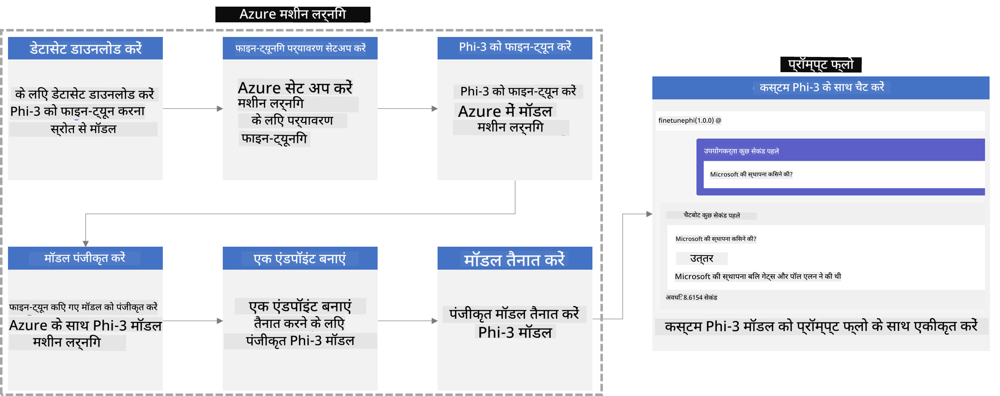
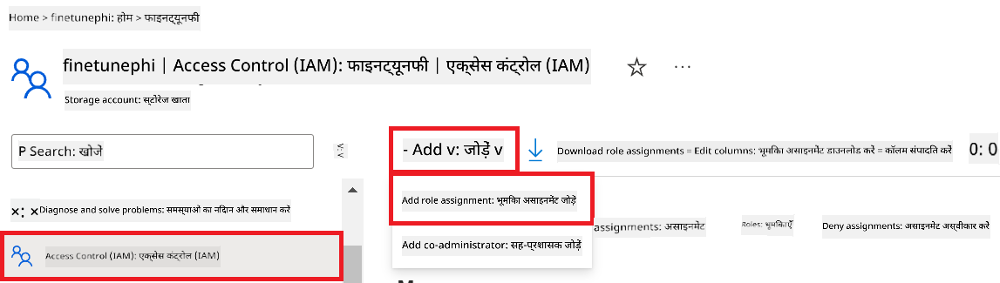
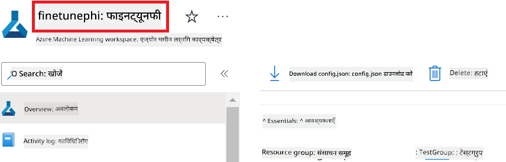
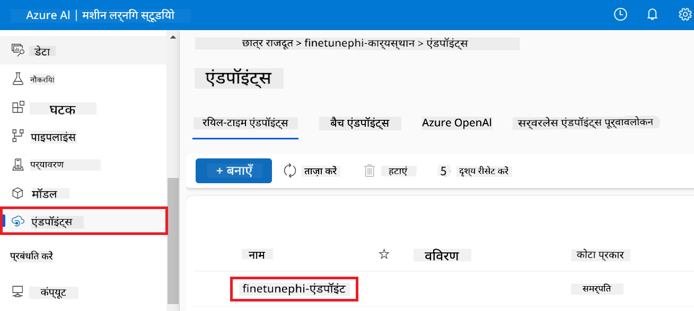
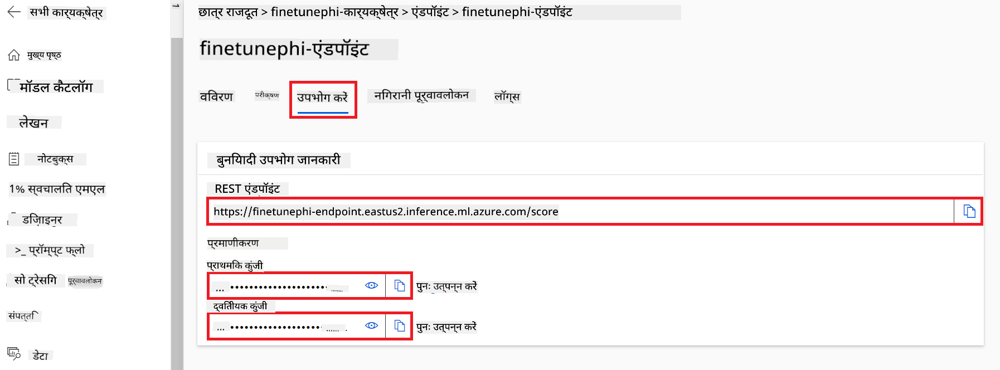

<!--
CO_OP_TRANSLATOR_METADATA:
{
  "original_hash": "7ca2c30fdb802664070e9cfbf92e24fe",
  "translation_date": "2026-01-05T01:38:22+00:00",
  "source_file": "md/02.Application/01.TextAndChat/Phi3/E2E_Phi-3-FineTuning_PromptFlow_Integration.md",
  "language_code": "hi"
}
-->
# फाइन-ट्यून और कस्टम Phi-3 मॉडल को Prompt flow के साथ इंटीग्रेट करें

यह एंड-टू-एंड (E2E) नमूना Microsoft Tech Community के गाइड "[Fine-Tune and Integrate Custom Phi-3 Models with Prompt Flow: Step-by-Step Guide](https://techcommunity.microsoft.com/t5/educator-developer-blog/fine-tune-and-integrate-custom-phi-3-models-with-prompt-flow/ba-p/4178612?WT.mc_id=aiml-137032-kinfeylo)" पर आधारित है। यह Phi-3 मॉडल के फाइन-ट्यूनिंग, डिप्लॉयमेंट, और Prompt flow के साथ इंटीग्रेशन की प्रक्रियाओं का परिचय देता है।

## अवलोकन

इस E2E नमूने में, आप सीखेंगे कि Phi-3 मॉडल को कैसे फाइन-ट्यून किया जाए और इसे Prompt flow के साथ कैसे इंटीग्रेट किया जाए। Azure Machine Learning और Prompt flow का उपयोग करके आप कस्टम AI मॉडल्स को डिप्लॉय और उपयोग करने के लिए एक वर्कफ़्लो स्थापित करेंगे। यह E2E नमूना तीन परिदृश्यों में विभाजित है:

**परिदृश्य 1: Azure संसाधनों की सेटअप और फाइन-ट्यूनिंग के लिए तैयारी**

**परिदृश्य 2: Phi-3 मॉडल को फाइन-ट्यून करना और Azure Machine Learning Studio में डिप्लॉय करना**

**परिदृश्य 3: Prompt flow के साथ इंटीग्रेट करना और अपने कस्टम मॉडल के साथ चैट करना**

यहाँ इस E2E नमूने का एक अवलोकन है।



### विषय सूची

1. **[परिदृश्य 1: Azure संसाधनों की सेटअप और फाइन-ट्यूनिंग के लिए तैयारी](../../../../../../md/02.Application/01.TextAndChat/Phi3)**
    - [Azure Machine Learning वर्कस्पेस बनाएं](../../../../../../md/02.Application/01.TextAndChat/Phi3)
    - [Azure सब्सक्रिप्शन में GPU कोटा अनुरोध करें](../../../../../../md/02.Application/01.TextAndChat/Phi3)
    - [रोल असाइनमेंट जोड़ें](../../../../../../md/02.Application/01.TextAndChat/Phi3)
    - [परियोजना सेट अप करें](../../../../../../md/02.Application/01.TextAndChat/Phi3)
    - [फाइन-ट्यूनिंग के लिए डेटासेट तैयार करें](../../../../../../md/02.Application/01.TextAndChat/Phi3)

1. **[परिदृश्य 2: Phi-3 मॉडल को फाइन-ट्यून करें और Azure Machine Learning Studio में डिप्लॉय करें](../../../../../../md/02.Application/01.TextAndChat/Phi3)**
    - [Azure CLI सेट अप करें](../../../../../../md/02.Application/01.TextAndChat/Phi3)
    - [Phi-3 मॉडल को फाइन-ट्यून करें](../../../../../../md/02.Application/01.TextAndChat/Phi3)
    - [फाइन-ट्यून किए गए मॉडल को डिप्लॉय करें](../../../../../../md/02.Application/01.TextAndChat/Phi3)

1. **[परिदृश्य 3: Prompt flow के साथ इंटीग्रेट करें और अपने कस्टम मॉडल के साथ चैट करें](../../../../../../md/02.Application/01.TextAndChat/Phi3)**
    - [कस्टम Phi-3 मॉडल को Prompt flow के साथ इंटीग्रेट करें](../../../../../../md/02.Application/01.TextAndChat/Phi3)
    - [अपने कस्टम मॉडल के साथ चैट करें](../../../../../../md/02.Application/01.TextAndChat/Phi3)

## Scenario 1: Set up Azure resources and Prepare for fine-tuning

### Create an Azure Machine Learning Workspace

1. टॉप पर स्थित पोर्टल पेज के **search bar** में *azure machine learning* टाइप करें और प्रदर्शित विकल्पों में से **Azure Machine Learning** चुनें।

    

1. नेविगेशन मेनू से **+ Create** चुनें।

1. नेविगेशन मेनू से **New workspace** चुनें।

    

1. निम्न कार्य करें:

    - अपनी Azure **Subscription** चुनें।
    - उपयोग करने के लिए **Resource group** चुनें (आवश्यक होने पर नया बनाएं)।
    - **Workspace Name** दर्ज करें। यह एक अद्वितीय मान होना चाहिए।
    - उपयोग करने के लिए **Region** चुनें।
    - उपयोग करने के लिए **Storage account** चुनें (आवश्यक होने पर नया बनाएं)।
    - उपयोग करने के लिए **Key vault** चुनें (आवश्यक होने पर नया बनाएं)।
    - उपयोग करने के लिए **Application insights** चुनें (आवश्यक होने पर नया बनाएं)।
    - उपयोग करने के लिए **Container registry** चुनें (आवश्यक होने पर नया बनाएं)।

    

1. **Review + Create** चुनें।

1. **Create** चुनें।

### Request GPU quotas in Azure Subscription

इस E2E नमूने में, आप फाइन-ट्यूनिंग के लिए *Standard_NC24ads_A100_v4 GPU* का उपयोग करेंगे, जिसके लिए कोटा अनुरोध आवश्यक है, और डिप्लॉयमेंट के लिए *Standard_E4s_v3* CPU का उपयोग करेंगे, जिसके लिए कोटा अनुरोध आवश्यक नहीं है।

> [!NOTE]
>
> Only Pay-As-You-Go subscriptions (the standard subscription type) are eligible for GPU allocation; benefit subscriptions are not currently supported.
>
> For those using benefit subscriptions (such as Visual Studio Enterprise Subscription) or those looking to quickly test the fine-tuning and deployment process, this tutorial also provides guidance for fine-tuning with a minimal dataset using a CPU. However, it is important to note that fine-tuning results are significantly better when using a GPU with larger datasets.

1. यहां जाएँ: [Azure ML Studio](https://ml.azure.com/home?wt.mc_id=studentamb_279723).

1. *Standard NCADSA100v4 Family* कोटा का अनुरोध करने के लिए निम्न कार्य करें:

    - बाएँ साइड टैब से **Quota** चुनें।
    - उपयोग करने के लिए **Virtual machine family** चुनें। उदाहरण के लिए, **Standard NCADSA100v4 Family Cluster Dedicated vCPUs** चुनें, जिसमें *Standard_NC24ads_A100_v4* GPU शामिल है।
    - नेविगेशन मेनू से **Request quota** चुनें।

        

    - Request quota पृष्ठ के अंदर, वह **New cores limit** दर्ज करें जिसे आप उपयोग करना चाहते हैं। उदाहरण के लिए, 24।
    - Request quota पृष्ठ के अंदर, GPU कोटा अनुरोध करने के लिए **Submit** चुनें।

> [!NOTE]
> आप अपनी आवश्यकताओं के अनुसार उपयुक्त GPU या CPU का चयन करने के लिए [Sizes for Virtual Machines in Azure](https://learn.microsoft.com/azure/virtual-machines/sizes/overview?tabs=breakdownseries%2Cgeneralsizelist%2Ccomputesizelist%2Cmemorysizelist%2Cstoragesizelist%2Cgpusizelist%2Cfpgasizelist%2Chpcsizelist) दस्तावेज़ का संदर्भ ले सकते हैं।

### Add role assignment

अपने मॉडलों को फाइन-ट्यून और डिप्लॉय करने के लिए, आपको पहले एक User Assigned Managed Identity (UAI) बनानी होगी और उसे उपयुक्त अनुमतियां असाइन करनी होंगी। यह UAI डिप्लॉयमेंट के दौरान प्रमाणिकरण के लिए उपयोग की जाएगी

#### Create User Assigned Managed Identity(UAI)

1. टॉप पर स्थित पोर्टल पेज के **search bar** में *managed identities* टाइप करें और प्रदर्शित विकल्पों में से **Managed Identities** चुनें।

    

1. **+ Create** चुनें।

    

1. निम्न कार्य करें:

    - अपनी Azure **Subscription** चुनें।
    - उपयोग करने के लिए **Resource group** चुनें (आवश्यक होने पर नया बनाएं)।
    - उपयोग करने के लिए **Region** चुनें।
    - **Name** दर्ज करें। यह एक अद्वितीय मान होना चाहिए।

1. **Review + create** चुनें।

1. **+ Create** चुनें।

#### Add Contributor role assignment to Managed Identity

1. उस Managed Identity रिसोर्स पर नेविगेट करें जिसे आपने बनाया था।

1. बाएँ साइड टैब से **Azure role assignments** चुनें।

1. नेविगेशन मेनू से **+Add role assignment** चुनें।

1. Add role assignment पृष्ठ के अंदर, निम्न कार्य करें:
    - **Scope** को **Resource group** पर सेट करें।
    - अपनी Azure **Subscription** चुनें।
    - उपयोग करने के लिए **Resource group** चुनें।
    - **Role** में **Contributor** चुनें।

    

1. **Save** चुनें।

#### Add Storage Blob Data Reader role assignment to Managed Identity

1. टॉप पर स्थित पोर्टल पेज के **search bar** में *storage accounts* टाइप करें और प्रदर्शित विकल्पों में से **Storage accounts** चुनें।

    

1. उस Storage account को चुनें जो आपने Azure Machine Learning वर्कस्पेस के साथ एसोसिएट किया था। उदाहरण के लिए, *finetunephistorage*।

1. Add role assignment पृष्ठ पर नेविगेट करने के लिए निम्न कार्य करें:

    - आपने जो Azure Storage account बनाया है उस पर नेविगेट करें।
    - बाएँ साइड टैब से **Access Control (IAM)** चुनें।
    - नेविगेशन मेनू से **+ Add** चुनें।
    - नेविगेशन मेनू से **Add role assignment** चुनें।

    

1. Add role assignment पृष्ठ के अंदर, निम्न कार्य करें:

    - Role पृष्ठ के अंदर, **search bar** में *Storage Blob Data Reader* टाइप करें और प्रदर्शित विकल्पों में से **Storage Blob Data Reader** चुनें।
    - Role पृष्ठ के अंदर, **Next** चुनें।
    - Members पृष्ठ के अंदर, **Assign access to** को **Managed identity** पर सेट करें।
    - Members पृष्ठ के अंदर, **+ Select members** चुनें।
    - Select managed identities पृष्ठ के अंदर, अपनी Azure **Subscription** चुनें।
    - Select managed identities पृष्ठ के अंदर, **Managed identity** को **Manage Identity** के रूप में चुनें।
    - Select managed identities पृष्ठ के अंदर, आपने जो Manage Identity बनाई है उसे चुनें। उदाहरण के लिए, *finetunephi-managedidentity*।
    - Select managed identities पृष्ठ के अंदर, **Select** चुनें।

    

1. **Review + assign** चुनें।

#### Add AcrPull role assignment to Managed Identity

1. टॉप पर स्थित पोर्टल पेज के **search bar** में *container registries* टाइप करें और प्रदर्शित विकल्पों में से **Container registries** चुनें।

    

1. उस container registry को चुनें जो Azure Machine Learning वर्कस्पेस से संबद्ध है। उदाहरण के लिए, *finetunephicontainerregistries*

1. Add role assignment पृष्ठ पर नेविगेट करने के लिए निम्न कार्य करें:

    - बाएँ साइड टैब से **Access Control (IAM)** चुनें।
    - नेविगेशन मेनू से **+ Add** चुनें।
    - नेविगेशन मेनू से **Add role assignment** चुनें।

1. Add role assignment पृष्ठ के अंदर, निम्न कार्य करें:

    - Role पृष्ठ के अंदर, **search bar** में *AcrPull* टाइप करें और प्रदर्शित विकल्पों में से **AcrPull** चुनें।
    - Role पृष्ठ के अंदर, **Next** चुनें।
    - Members पृष्ठ के अंदर, **Assign access to** को **Managed identity** पर सेट करें।
    - Members पृष्ठ के अंदर, **+ Select members** चुनें।
    - Select managed identities पृष्ठ के अंदर, अपनी Azure **Subscription** चुनें।
    - Select managed identities पृष्ठ के अंदर, **Managed identity** को **Manage Identity** के रूप में चुनें।
    - Select managed identities पृष्ठ के अंदर, आपने जो Manage Identity बनाई है उसे चुनें। उदाहरण के लिए, *finetunephi-managedidentity*।
    - Select managed identities पृष्ठ के अंदर, **Select** चुनें।
    - **Review + assign** चुनें।

### Set up project

अब, आप एक फ़ोल्डर बनाएँगे जिसमें आप काम करेंगे और एक वर्चुअल वातावरण सेट अप करेंगे ताकि एक ऐसा प्रोग्राम विकसित किया जा सके जो उपयोगकर्ताओं के साथ इंटरैक्ट करे और Azure Cosmos DB में संग्रहीत चैट इतिहास का उपयोग करके अपने उत्तरों को सूचित करे।

#### Create a folder to work inside it

1. एक टर्मिनल विंडो खोलें और डिफ़ॉल्ट पथ में *finetune-phi* नामक फ़ोल्डर बनाने के लिए निम्न कमांड टाइप करें।

    ```console
    mkdir finetune-phi
    ```

1. अपने टर्मिनल में *finetune-phi* फ़ोल्डर में नेविगेट करने के लिए निम्न कमांड टाइप करें।

    ```console
    cd finetune-phi
    ```

#### Create a virtual environment

1. अपने टर्मिनल में *.venv* नामक वर्चुअल वातावरण बनाने के लिए निम्न कमांड टाइप करें।

    ```console
    python -m venv .venv
    ```

1. वर्चुअल वातावरण को सक्रिय करने के लिए अपने टर्मिनल में निम्न कमांड टाइप करें।

    ```console
    .venv\Scripts\activate.bat
    ```

> [!NOTE]
>
> If it worked, you should see *(.venv)* before the command prompt.

#### Install the required packages

1. अपने टर्मिनल में आवश्यक पैकेज स्थापित करने के लिए निम्न कमांड टाइप करें।

    ```console
    pip install datasets==2.19.1
    pip install transformers==4.41.1
    pip install azure-ai-ml==1.16.0
    pip install torch==2.3.1
    pip install trl==0.9.4
    pip install promptflow==1.12.0
    ```

#### Create project files
In this अभ्यास में, आप हमारे प्रोजेक्ट के लिए आवश्यक फ़ाइलें बनाएँगे। इन फाइलों में डेटासेट डाउनलोड करने, Azure Machine Learning वातावरण सेटअप करने, Phi-3 मॉडल को फाइन-ट्यून करने, और फाइन-ट्यून किए गए मॉडल को डिप्लॉय करने के स्क्रिप्ट शामिल हैं। आप फाइन-ट्यूनिंग वातावरण सेट करने के लिए एक *conda.yml* फाइल भी बनाएँगे।

इस अभ्यास में, आप:

- Create a *download_dataset.py* file to download the dataset.
- Create a *setup_ml.py* file to set up the Azure Machine Learning environment.
- Create a *fine_tune.py* file in the *finetuning_dir* folder to fine-tune the Phi-3 model using the dataset.
- Create a *conda.yml* file to setup fine-tuning environment.
- Create a *deploy_model.py* file to deploy the fine-tuned model.
- Create a *integrate_with_promptflow.py* file, to integrate the fine-tuned model and execute the model using Prompt flow.
- Create a flow.dag.yml file, to set up the workflow structure for Prompt flow.
- Create a *config.py* file to enter Azure information.

> [!NOTE]
>
> पूरा फ़ोल्डर संरचना:
>
> ```text
> └── YourUserName
> .    └── finetune-phi
> .        ├── finetuning_dir
> .        │      └── fine_tune.py
> .        ├── conda.yml
> .        ├── config.py
> .        ├── deploy_model.py
> .        ├── download_dataset.py
> .        ├── flow.dag.yml
> .        ├── integrate_with_promptflow.py
> .        └── setup_ml.py
> ```

1. **Visual Studio Code** खोलें।

1. मेन्यू बार से **File** चुनें।

1. **Open Folder** चुनें।

1. उस *finetune-phi* फ़ोल्डर का चयन करें जो आपने बनाया था, और जो स्थित है *C:\Users\yourUserName\finetune-phi* पर।

    

1. Visual Studio Code के बाएँ पेन में, राइट-क्लिक करके **New File** चुनें और *download_dataset.py* नाम की एक नई फ़ाइल बनायें।

1. Visual Studio Code के बाएँ पेन में, राइट-क्लिक करके **New File** चुनें और *setup_ml.py* नाम की एक नई फ़ाइल बनायें।

1. Visual Studio Code के बाएँ पेन में, राइट-क्लिक करके **New File** चुनें और *deploy_model.py* नाम की एक नई फ़ाइल बनायें।

    

1. Visual Studio Code के बाएँ पेन में, राइट-क्लिक करके **New Folder** चुनें और *finetuning_dir* नाम का एक नया फ़ोल्डर बनायें।

1. *finetuning_dir* फ़ोल्डर में, *fine_tune.py* नाम की एक नई फ़ाइल बनायें।

#### Create and Configure *conda.yml* file

1. Visual Studio Code के बाएँ पेन में, राइट-क्लिक करके **New File** चुनें और *conda.yml* नाम की एक नई फ़ाइल बनायें।

1. Phi-3 मॉडल के लिए फाइन-ट्यूनिंग वातावरण सेटअप करने हेतु *conda.yml* फ़ाइल में निम्नलिखित कोड जोड़ें।

    ```yml
    name: phi-3-training-env
    channels:
      - defaults
      - conda-forge
    dependencies:
      - python=3.10
      - pip
      - numpy<2.0
      - pip:
          - torch==2.4.0
          - torchvision==0.19.0
          - trl==0.8.6
          - transformers==4.41
          - datasets==2.21.0
          - azureml-core==1.57.0
          - azure-storage-blob==12.19.0
          - azure-ai-ml==1.16
          - azure-identity==1.17.1
          - accelerate==0.33.0
          - mlflow==2.15.1
          - azureml-mlflow==1.57.0
    ```

#### Create and Configure *config.py* file

1. Visual Studio Code के बाएँ पेन में, राइट-क्लिक करके **New File** चुनें और *config.py* नाम की एक नई फ़ाइल बनायें।

1. अपनी Azure जानकारी शामिल करने के लिए *config.py* फ़ाइल में निम्नलिखित कोड जोड़ें।

    ```python
    # Azure सेटिंग्स
    AZURE_SUBSCRIPTION_ID = "your_subscription_id"
    AZURE_RESOURCE_GROUP_NAME = "your_resource_group_name" # "TestGroup"

    # Azure मशीन लर्निंग सेटिंग्स
    AZURE_ML_WORKSPACE_NAME = "your_workspace_name" # "finetunephi-workspace"

    # Azure प्रबंधित पहचान सेटिंग्स
    AZURE_MANAGED_IDENTITY_CLIENT_ID = "your_azure_managed_identity_client_id"
    AZURE_MANAGED_IDENTITY_NAME = "your_azure_managed_identity_name" # "finetunephi-mangedidentity"
    AZURE_MANAGED_IDENTITY_RESOURCE_ID = f"/subscriptions/{AZURE_SUBSCRIPTION_ID}/resourceGroups/{AZURE_RESOURCE_GROUP_NAME}/providers/Microsoft.ManagedIdentity/userAssignedIdentities/{AZURE_MANAGED_IDENTITY_NAME}"

    # डेटासेट फ़ाइल पथ
    TRAIN_DATA_PATH = "data/train_data.jsonl"
    TEST_DATA_PATH = "data/test_data.jsonl"

    # फाइन-ट्यून किए गए मॉडल सेटिंग्स
    AZURE_MODEL_NAME = "your_fine_tuned_model_name" # "finetune-phi-model"
    AZURE_ENDPOINT_NAME = "your_fine_tuned_model_endpoint_name" # "finetune-phi-endpoint"
    AZURE_DEPLOYMENT_NAME = "your_fine_tuned_model_deployment_name" # "finetune-phi-deployment"

    AZURE_ML_API_KEY = "your_fine_tuned_model_api_key"
    AZURE_ML_ENDPOINT = "your_fine_tuned_model_endpoint_uri" # "https://{your-endpoint-name}.{your-region}.inference.ml.azure.com/score"
    ```

#### Azure पर्यावरण चर जोड़ें

1. Azure Subscription ID जोड़ने के लिए निम्न कार्य करें:

    - पोर्टल पेज के शीर्ष पर **search bar** में *subscriptions* टाइप करें और दिखाई देने वाले विकल्पों में से **Subscriptions** चुनें।
    - वह Azure Subscription चुनें जिसका आप वर्तमान में उपयोग कर रहे हैं।
    - अपनी Subscription ID कॉपी करके *config.py* फ़ाइल में पेस्ट करें।

    

1. Azure Workspace Name जोड़ने के लिए निम्न कार्य करें:

    - उस Azure Machine Learning संसाधन पर जाएँ जिसे आपने बनाया था।
    - अपना अकाउंट नाम कॉपी करके *config.py* फ़ाइल में पेस्ट करें।

    

1. Azure Resource Group Name जोड़ने के लिए निम्न कार्य करें:

    - उस Azure Machine Learning संसाधन पर जाएँ जिसे आपने बनाया था।
    - अपना Azure Resource Group Name कॉपी करके *config.py* फ़ाइल में पेस्ट करें।

    

2. Azure Managed Identity name जोड़ने के लिए निम्न कार्य करें:

    - उस Managed Identities रिसोर्स पर जाएँ जो आपने बनाया था।
    - अपना Azure Managed Identity नाम कॉपी करके *config.py* फ़ाइल में पेस्ट करें।

    

### फाइन-ट्यूनिंग के लिए डेटासेट तैयार करें

इस अभ्यास में, आप अपने लोकल वातावरण में *ULTRACHAT_200k* डेटासेट डाउनलोड करने के लिए *download_dataset.py* फ़ाइल चलाएँगे। फिर आप इस डेटासेट का उपयोग Azure Machine Learning में Phi-3 मॉडल को फाइन-ट्यून करने के लिए करेंगे।

#### *download_dataset.py* के माध्यम से अपना डेटासेट डाउनलोड करें

1. Visual Studio Code में *download_dataset.py* फ़ाइल खोलें।

1. *download_dataset.py* में निम्नलिखित कोड जोड़ें।

    ```python
    import json
    import os
    from datasets import load_dataset
    from config import (
        TRAIN_DATA_PATH,
        TEST_DATA_PATH)

    def load_and_split_dataset(dataset_name, config_name, split_ratio):
        """
        Load and split a dataset.
        """
        # निर्दिष्ट नाम, कॉन्फ़िगरेशन और विभाजन अनुपात के साथ डेटासेट लोड करें
        dataset = load_dataset(dataset_name, config_name, split=split_ratio)
        print(f"Original dataset size: {len(dataset)}")
        
        # डेटासेट को ट्रेन और टेस्ट सेट में विभाजित करें (80% ट्रेन, 20% टेस्ट)
        split_dataset = dataset.train_test_split(test_size=0.2)
        print(f"Train dataset size: {len(split_dataset['train'])}")
        print(f"Test dataset size: {len(split_dataset['test'])}")
        
        return split_dataset

    def save_dataset_to_jsonl(dataset, filepath):
        """
        Save a dataset to a JSONL file.
        """
        # यदि निर्देशिका मौजूद नहीं है तो उसे बनाएं
        os.makedirs(os.path.dirname(filepath), exist_ok=True)
        
        # फ़ाइल को लिखने के मोड में खोलें
        with open(filepath, 'w', encoding='utf-8') as f:
            # डेटासेट के प्रत्येक रिकॉर्ड पर क्रमशः जाएँ
            for record in dataset:
                # रिकॉर्ड को JSON ऑब्जेक्ट के रूप में डंप करके फ़ाइल में लिखें
                json.dump(record, f)
                # रिकॉर्ड्स को अलग करने के लिए एक नई पंक्ति लिखें
                f.write('\n')
        
        print(f"Dataset saved to {filepath}")

    def main():
        """
        Main function to load, split, and save the dataset.
        """
        # ULTRACHAT_200k डेटासेट को एक विशिष्ट कॉन्फ़िगरेशन और विभाजन अनुपात के साथ लोड और विभाजित करें
        dataset = load_and_split_dataset("HuggingFaceH4/ultrachat_200k", 'default', 'train_sft[:1%]')
        
        # विभाजन से ट्रेन और टेस्ट डेटासेट निकालें
        train_dataset = dataset['train']
        test_dataset = dataset['test']

        # ट्रेन डेटासेट को एक JSONL फ़ाइल में सहेजें
        save_dataset_to_jsonl(train_dataset, TRAIN_DATA_PATH)
        
        # टेस्ट डेटासेट को एक अलग JSONL फ़ाइल में सहेजें
        save_dataset_to_jsonl(test_dataset, TEST_DATA_PATH)

    if __name__ == "__main__":
        main()

    ```

> [!TIP]
>
> **CPU का उपयोग करके न्यूनतम डेटासेट के साथ फाइन-ट्यूनिंग के लिए मार्गदर्शन**
>
> यदि आप फाइन-ट्यूनिंग के लिए CPU का उपयोग करना चाहते हैं, तो यह तरीका उन लोगों के लिए आदर्श है जिनके पास benefit subscriptions (जैसे Visual Studio Enterprise Subscription) हैं या जो फाइन-ट्यूनिंग और डिप्लॉयमेंट प्रक्रिया को जल्दी से परीक्षण करना चाहते हैं।
>
> `dataset = load_and_split_dataset("HuggingFaceH4/ultrachat_200k", 'default', 'train_sft[:1%]')` को `dataset = load_and_split_dataset("HuggingFaceH4/ultrachat_200k", 'default', 'train_sft[:10]')` से बदलें
>

1. अपने टर्मिनल के अंदर निम्न कमांड टाइप करें ताकि स्क्रिप्ट चले और डेटासेट आपके लोकल वातावरण में डाउनलोड हो जाए।

    ```console
    python download_data.py
    ```

1. सत्यापित करें कि डेटासेट सफलतापूर्वक आपकी लोकल *finetune-phi/data* डायरेक्टरी में सहेजा गया है।

> [!NOTE]
>
> **डेटासेट आकार और फाइन-ट्यूनिंग समय**
>
> इस E2E नमूने में, आप केवल डेटासेट का 1% उपयोग करते हैं (`train_sft[:1%]`)। इससे डाटा की मात्रा काफी घट जाती है, जिससे अपलोड और फाइन-ट्यूनिंग प्रक्रियाएँ तेज हो जाती हैं। आप प्रशिक्षण समय और मॉडल प्रदर्शन के बीच संतुलन खोजने के लिए प्रतिशत समायोजित कर सकते हैं। डेटासेट के छोटे उपसमुच्चय का उपयोग फाइन-ट्यूनिंग के लिए आवश्यक समय को कम करता है, जिससे यह E2E नमूने के लिए अधिक प्रबंधनीय हो जाता है।

## परिदृश्य 2: Phi-3 मॉडल का फाइन-ट्यून और Azure Machine Learning Studio में डिप्लॉय करें

### Azure CLI सेट अप करें

आपको अपने वातावरण को प्रमाणीकृत करने के लिए Azure CLI सेट अप करना होगा। Azure CLI आपको कमांड लाइन से सीधे Azure संसाधनों का प्रबंधन करने की अनुमति देता है और Azure Machine Learning को इन संसाधनों तक पहुँच के लिए आवश्यक क्रेडेंशियल प्रदान करता है। शुरू करने के लिए [Azure CLI](https://learn.microsoft.com/cli/azure/install-azure-cli) इंस्टॉल करें

1. एक टर्मिनल विंडो खोलें और अपने Azure खाते में लॉग इन करने के लिए निम्न कमांड टाइप करें।

    ```console
    az login
    ```

1. अपने उपयोग के लिए अपना Azure खाता चुनें।

1. उपयोग करने के लिए अपनी Azure subscription चुनें।

    

> [!TIP]
>
> यदि आप Azure में साइन-इन करने में समस्या कर रहे हैं, तो डिवाइस कोड का उपयोग करने का प्रयास करें। एक टर्मिनल विंडो खोलें और अपने Azure खाते में साइन-इन करने के लिए निम्न कमांड टाइप करें:
>
> ```console
> az login --use-device-code
> ```
>

### Phi-3 मॉडल को फाइन-ट्यून करें

इस अभ्यास में, आप प्रदान किए गए डेटासेट का उपयोग करके Phi-3 मॉडल को फाइन-ट्यून करेंगे। पहले, आप *fine_tune.py* फ़ाइल में फाइन-ट्यूनिंग प्रक्रिया को परिभाषित करेंगे। फिर, आप Azure Machine Learning वातावरण को कॉन्फ़िगर करेंगे और *setup_ml.py* फ़ाइल चलाकर फाइन-ट्यूनिंग प्रक्रिया आरम्भ करेंगे। यह स्क्रिप्ट सुनिश्चित करती है कि फाइन-ट्यूनिंग Azure Machine Learning वातावरण के भीतर हो रही है।

*setup_ml.py* चलाने से, आप Azure Machine Learning वातावरण में फाइन-ट्यूनिंग प्रक्रिया चलाएँगे।

#### *fine_tune.py* फ़ाइल में कोड जोड़ें

1. *finetuning_dir* फ़ोल्डर पर नेविगेट करें और Visual Studio Code में *fine_tune.py* फ़ाइल खोलें।

1. *fine_tune.py* में निम्नलिखित कोड जोड़ें।

    ```python
    import argparse
    import sys
    import logging
    import os
    from datasets import load_dataset
    import torch
    import mlflow
    from transformers import AutoModelForCausalLM, AutoTokenizer, TrainingArguments
    from trl import SFTTrainer

    # MLflow में INVALID_PARAMETER_VALUE त्रुटि से बचने के लिए MLflow एकीकरण अक्षम करें
    os.environ["DISABLE_MLFLOW_INTEGRATION"] = "True"

    # लॉगिंग सेटअप
    logging.basicConfig(
        format="%(asctime)s - %(levelname)s - %(name)s - %(message)s",
        datefmt="%Y-%m-%d %H:%M:%S",
        handlers=[logging.StreamHandler(sys.stdout)],
        level=logging.WARNING
    )
    logger = logging.getLogger(__name__)

    def initialize_model_and_tokenizer(model_name, model_kwargs):
        """
        Initialize the model and tokenizer with the given pretrained model name and arguments.
        """
        model = AutoModelForCausalLM.from_pretrained(model_name, **model_kwargs)
        tokenizer = AutoTokenizer.from_pretrained(model_name)
        tokenizer.model_max_length = 2048
        tokenizer.pad_token = tokenizer.unk_token
        tokenizer.pad_token_id = tokenizer.convert_tokens_to_ids(tokenizer.pad_token)
        tokenizer.padding_side = 'right'
        return model, tokenizer

    def apply_chat_template(example, tokenizer):
        """
        Apply a chat template to tokenize messages in the example.
        """
        messages = example["messages"]
        if messages[0]["role"] != "system":
            messages.insert(0, {"role": "system", "content": ""})
        example["text"] = tokenizer.apply_chat_template(
            messages, tokenize=False, add_generation_prompt=False
        )
        return example

    def load_and_preprocess_data(train_filepath, test_filepath, tokenizer):
        """
        Load and preprocess the dataset.
        """
        train_dataset = load_dataset('json', data_files=train_filepath, split='train')
        test_dataset = load_dataset('json', data_files=test_filepath, split='train')
        column_names = list(train_dataset.features)

        train_dataset = train_dataset.map(
            apply_chat_template,
            fn_kwargs={"tokenizer": tokenizer},
            num_proc=10,
            remove_columns=column_names,
            desc="Applying chat template to train dataset",
        )

        test_dataset = test_dataset.map(
            apply_chat_template,
            fn_kwargs={"tokenizer": tokenizer},
            num_proc=10,
            remove_columns=column_names,
            desc="Applying chat template to test dataset",
        )

        return train_dataset, test_dataset

    def train_and_evaluate_model(train_dataset, test_dataset, model, tokenizer, output_dir):
        """
        Train and evaluate the model.
        """
        training_args = TrainingArguments(
            bf16=True,
            do_eval=True,
            output_dir=output_dir,
            eval_strategy="epoch",
            learning_rate=5.0e-06,
            logging_steps=20,
            lr_scheduler_type="cosine",
            num_train_epochs=3,
            overwrite_output_dir=True,
            per_device_eval_batch_size=4,
            per_device_train_batch_size=4,
            remove_unused_columns=True,
            save_steps=500,
            seed=0,
            gradient_checkpointing=True,
            gradient_accumulation_steps=1,
            warmup_ratio=0.2,
        )

        trainer = SFTTrainer(
            model=model,
            args=training_args,
            train_dataset=train_dataset,
            eval_dataset=test_dataset,
            max_seq_length=2048,
            dataset_text_field="text",
            tokenizer=tokenizer,
            packing=True
        )

        train_result = trainer.train()
        trainer.log_metrics("train", train_result.metrics)

        mlflow.transformers.log_model(
            transformers_model={"model": trainer.model, "tokenizer": tokenizer},
            artifact_path=output_dir,
        )

        tokenizer.padding_side = 'left'
        eval_metrics = trainer.evaluate()
        eval_metrics["eval_samples"] = len(test_dataset)
        trainer.log_metrics("eval", eval_metrics)

    def main(train_file, eval_file, model_output_dir):
        """
        Main function to fine-tune the model.
        """
        model_kwargs = {
            "use_cache": False,
            "trust_remote_code": True,
            "torch_dtype": torch.bfloat16,
            "device_map": None,
            "attn_implementation": "eager"
        }

        # pretrained_model_name = "microsoft/Phi-3-mini-4k-instruct"
        pretrained_model_name = "microsoft/Phi-3.5-mini-instruct"

        with mlflow.start_run():
            model, tokenizer = initialize_model_and_tokenizer(pretrained_model_name, model_kwargs)
            train_dataset, test_dataset = load_and_preprocess_data(train_file, eval_file, tokenizer)
            train_and_evaluate_model(train_dataset, test_dataset, model, tokenizer, model_output_dir)

    if __name__ == "__main__":
        parser = argparse.ArgumentParser()
        parser.add_argument("--train-file", type=str, required=True, help="Path to the training data")
        parser.add_argument("--eval-file", type=str, required=True, help="Path to the evaluation data")
        parser.add_argument("--model_output_dir", type=str, required=True, help="Directory to save the fine-tuned model")
        args = parser.parse_args()
        main(args.train_file, args.eval_file, args.model_output_dir)

    ```

1. *fine_tune.py* फ़ाइल सहेजें और बंद करें।

> [!TIP]
> **आप Phi-3.5 मॉडल का फाइन-ट्यून भी कर सकते हैं**
>
> *fine_tune.py* फ़ाइल में, आप `pretrained_model_name` को `"microsoft/Phi-3-mini-4k-instruct"` से किसी भी मॉडल में बदल सकते हैं जिसे आप फाइन-ट्यून करना चाहते हैं। उदाहरण के लिए, यदि आप इसे `"microsoft/Phi-3.5-mini-instruct"` में बदलते हैं, तो आप Phi-3.5-mini-instruct मॉडल का उपयोग फाइन-ट्यूनिंग के लिए कर रहे होंगे। अपनी पसंद का मॉडल नाम खोजने और उपयोग करने के लिए [Hugging Face](https://huggingface.co/) पर जाएँ, अपना इच्छित मॉडल खोजें, और फिर उसका नाम अपने स्क्रिप्ट में `pretrained_model_name` फ़ील्ड में कॉपी-पेस्ट करें।
>
> <image type="content" src="../../../../imgs/02/FineTuning-PromptFlow/finetunephi3.5.png" alt-text="Phi-3.5 को फाइन-ट्यून करें।">
>

#### *setup_ml.py* फ़ाइल में कोड जोड़ें

1. Visual Studio Code में *setup_ml.py* फ़ाइल खोलें।

1. *setup_ml.py* में निम्नलिखित कोड जोड़ें।

    ```python
    import logging
    from azure.ai.ml import MLClient, command, Input
    from azure.ai.ml.entities import Environment, AmlCompute
    from azure.identity import AzureCliCredential
    from config import (
        AZURE_SUBSCRIPTION_ID,
        AZURE_RESOURCE_GROUP_NAME,
        AZURE_ML_WORKSPACE_NAME,
        TRAIN_DATA_PATH,
        TEST_DATA_PATH
    )

    # स्थिरांक

    # प्रशिक्षण के लिए CPU इंस्टेंस का उपयोग करने के लिए निम्नलिखित पंक्तियों की टिप्पणी हटाएं
    # COMPUTE_INSTANCE_TYPE = "Standard_E16s_v3" # सीपीयू
    # COMPUTE_NAME = "cpu-e16s-v3"
    # DOCKER_IMAGE_NAME = "mcr.microsoft.com/azureml/openmpi4.1.0-ubuntu20.04:latest"

    # प्रशिक्षण के लिए GPU इंस्टेंस का उपयोग करने के लिए निम्नलिखित पंक्तियों की टिप्पणी हटाएं
    COMPUTE_INSTANCE_TYPE = "Standard_NC24ads_A100_v4"
    COMPUTE_NAME = "gpu-nc24s-a100-v4"
    DOCKER_IMAGE_NAME = "mcr.microsoft.com/azureml/curated/acft-hf-nlp-gpu:59"

    CONDA_FILE = "conda.yml"
    LOCATION = "eastus2" # अपने कंप्यूट क्लस्टर के स्थान के साथ बदलें
    FINETUNING_DIR = "./finetuning_dir" # फाइन-ट्यूनिंग स्क्रिप्ट का पथ
    TRAINING_ENV_NAME = "phi-3-training-environment" # प्रशिक्षण वातावरण का नाम
    MODEL_OUTPUT_DIR = "./model_output" # Azure ML में मॉडल आउटपुट निर्देशिका का पथ

    # प्रक्रिया को ट्रैक करने के लिए लॉगिंग सेटअप
    logger = logging.getLogger(__name__)
    logging.basicConfig(
        format="%(asctime)s - %(levelname)s - %(name)s - %(message)s",
        datefmt="%Y-%m-%d %H:%M:%S",
        level=logging.WARNING
    )

    def get_ml_client():
        """
        Initialize the ML Client using Azure CLI credentials.
        """
        credential = AzureCliCredential()
        return MLClient(credential, AZURE_SUBSCRIPTION_ID, AZURE_RESOURCE_GROUP_NAME, AZURE_ML_WORKSPACE_NAME)

    def create_or_get_environment(ml_client):
        """
        Create or update the training environment in Azure ML.
        """
        env = Environment(
            image=DOCKER_IMAGE_NAME,  # पर्यावरण के लिए Docker इमेज
            conda_file=CONDA_FILE,  # Conda एनवायरनमेंट फ़ाइल
            name=TRAINING_ENV_NAME,  # एनवायरनमेंट का नाम
        )
        return ml_client.environments.create_or_update(env)

    def create_or_get_compute_cluster(ml_client, compute_name, COMPUTE_INSTANCE_TYPE, location):
        """
        Create or update the compute cluster in Azure ML.
        """
        try:
            compute_cluster = ml_client.compute.get(compute_name)
            logger.info(f"Compute cluster '{compute_name}' already exists. Reusing it for the current run.")
        except Exception:
            logger.info(f"Compute cluster '{compute_name}' does not exist. Creating a new one with size {COMPUTE_INSTANCE_TYPE}.")
            compute_cluster = AmlCompute(
                name=compute_name,
                size=COMPUTE_INSTANCE_TYPE,
                location=location,
                tier="Dedicated",  # कंप्यूट क्लस्टर की श्रेणी
                min_instances=0,  # इंस्टेंस की न्यूनतम संख्या
                max_instances=1  # इंस्टेंस की अधिकतम संख्या
            )
            ml_client.compute.begin_create_or_update(compute_cluster).wait()  # क्लस्टर के बनाए जाने का इंतजार करें
        return compute_cluster

    def create_fine_tuning_job(env, compute_name):
        """
        Set up the fine-tuning job in Azure ML.
        """
        return command(
            code=FINETUNING_DIR,  # fine_tune.py का पथ
            command=(
                "python fine_tune.py "
                "--train-file ${{inputs.train_file}} "
                "--eval-file ${{inputs.eval_file}} "
                "--model_output_dir ${{inputs.model_output}}"
            ),
            environment=env,  # प्रशिक्षण वातावरण
            compute=compute_name,  # उपयोग करने के लिए कंप्यूट क्लस्टर
            inputs={
                "train_file": Input(type="uri_file", path=TRAIN_DATA_PATH),  # प्रशिक्षण डेटा फ़ाइल का पथ
                "eval_file": Input(type="uri_file", path=TEST_DATA_PATH),  # मूल्यांकन डेटा फ़ाइल का पथ
                "model_output": MODEL_OUTPUT_DIR
            }
        )

    def main():
        """
        Main function to set up and run the fine-tuning job in Azure ML.
        """
        # ML क्लाइंट आरंभ करें
        ml_client = get_ml_client()

        # एनवायरनमेंट बनाएं
        env = create_or_get_environment(ml_client)
        
        # कंप्यूट क्लस्टर बनाएं या मौजूदा क्लस्टर प्राप्त करें
        create_or_get_compute_cluster(ml_client, COMPUTE_NAME, COMPUTE_INSTANCE_TYPE, LOCATION)

        # फाइन-ट्यूनिंग जॉब बनाएं और सबमिट करें
        job = create_fine_tuning_job(env, COMPUTE_NAME)
        returned_job = ml_client.jobs.create_or_update(job)  # जॉब सबमिट करें
        ml_client.jobs.stream(returned_job.name)  # जॉब लॉग्स स्ट्रीम करें
        
        # जॉब का नाम रिकॉर्ड करें
        job_name = returned_job.name
        print(f"Job name: {job_name}")

    if __name__ == "__main__":
        main()

    ```

1. `COMPUTE_INSTANCE_TYPE`, `COMPUTE_NAME`, और `LOCATION` को अपनी विशिष्ट जानकारी से बदलें।

    ```python
   # ट्रेनिंग के लिए GPU इंस्टेंस उपयोग करने हेतु निम्नलिखित पंक्तियों की टिप्पणी हटाएँ
    COMPUTE_INSTANCE_TYPE = "Standard_NC24ads_A100_v4"
    COMPUTE_NAME = "gpu-nc24s-a100-v4"
    ...
    LOCATION = "eastus2" # इसे अपने कंप्यूट क्लस्टर के स्थान से बदलें
    ```

> [!TIP]
>
> **CPU का उपयोग करके न्यूनतम डेटासेट के साथ फाइन-ट्यूनिंग के लिए मार्गदर्शन**
>
> यदि आप फाइन-ट्यूनिंग के लिए CPU का उपयोग करना चाहते हैं, तो यह तरीका उन लोगों के लिए आदर्श है जिनके पास benefit subscriptions (जैसे Visual Studio Enterprise Subscription) हैं या जो फाइन-ट्यूनिंग और डिप्लॉयमेंट प्रक्रिया को जल्दी से परीक्षण करना चाहते हैं।
>
> 1. *setup_ml* फ़ाइल खोलें।
> 1. `COMPUTE_INSTANCE_TYPE`, `COMPUTE_NAME`, और `DOCKER_IMAGE_NAME` को निम्न से बदलें। यदि आपके पास *Standard_E16s_v3* तक पहुँच नहीं है, तो आप समकक्ष CPU इंस्टेंस का उपयोग कर सकते हैं या नया कोटा अनुरोध कर सकते हैं।
> 1. `LOCATION` को अपनी विशिष्ट जानकारी से बदलें।
>
>    ```python
>    # Uncomment the following lines to use a CPU instance for training
>    COMPUTE_INSTANCE_TYPE = "Standard_E16s_v3" # cpu
>    COMPUTE_NAME = "cpu-e16s-v3"
>    DOCKER_IMAGE_NAME = "mcr.microsoft.com/azureml/openmpi4.1.0-ubuntu20.04:latest"
>    LOCATION = "eastus2" # Replace with the location of your compute cluster
>    ```
>

1. *setup_ml.py* स्क्रिप्ट चलाने और Azure Machine Learning में फाइन-ट्यूनिंग प्रक्रिया प्रारम्भ करने के लिए निम्न कमांड टाइप करें।

    ```python
    python setup_ml.py
    ```

1. इस अभ्यास में, आपने सफलतापूर्वक Azure Machine Learning का उपयोग करके Phi-3 मॉडल को फाइन-ट्यून किया। *setup_ml.py* स्क्रिप्ट चलाने से, आपने Azure Machine Learning वातावरण सेटअप किया और *fine_tune.py* फ़ाइल में परिभाषित फाइन-ट्यूनिंग प्रक्रिया शुरू की। कृपया ध्यान दें कि फाइन-ट्यूनिंग प्रक्रिया में काफी समय लग सकता है। `python setup_ml.py` कमांड चलाने के बाद, आपको प्रक्रिया पूरा होने तक प्रतीक्षा करनी होगी। आप टर्मिनल में दिए गए लिंक का अनुसरण करके Azure Machine Learning पोर्टल में फाइन-ट्यूनिंग जॉब की स्थिति मॉनिटर कर सकते हैं।

    

### फाइन-ट्यून किए गए मॉडल को डिप्लॉय करें

फाइन-ट्यून किए गए Phi-3 मॉडल को Prompt Flow के साथ एकीकृत करने के लिए, आपको मॉडल को रियल-टाइम इनफरेंस के लिए एक्सेस करने योग्य बनाने हेतु डिप्लॉय करना होगा। इस प्रक्रिया में मॉडल को रजिस्टर करना, एक ऑनलाइन एंडपॉइंट बनाना, और मॉडल को डिप्लॉय करना शामिल है।

#### डिप्लॉयमेंट के लिए मॉडल नाम, एंडपॉइंट नाम, और डिप्लॉयमेंट नाम सेट करें

1. *config.py* फ़ाइल खोलें।

1. `AZURE_MODEL_NAME = "your_fine_tuned_model_name"` को अपने मॉडल के लिए इच्छित नाम से बदलें।

1. `AZURE_ENDPOINT_NAME = "your_fine_tuned_model_endpoint_name"` को अपने एंडपॉइंट के लिए इच्छित नाम से बदलें।

1. `AZURE_DEPLOYMENT_NAME = "your_fine_tuned_model_deployment_name"` को अपने डिप्लॉयमेंट के लिए इच्छित नाम से बदलें।

#### *deploy_model.py* फ़ाइल में कोड जोड़ें

*deploy_model.py* फ़ाइल चलाने से संपूर्ण डिप्लॉयमेंट प्रक्रिया स्वचालित हो जाती है। यह मॉडल को रजिस्टर करता है, एक एंडपॉइंट बनाता है, और config.py फ़ाइल में निर्दिष्ट सेटिंग्स के आधार पर मॉडल को डिप्लॉय करता है, जिसमें मॉडल नाम, एंडपॉइंट नाम, और डिप्लॉयमेंट नाम शामिल हैं।

1. Visual Studio Code में *deploy_model.py* फ़ाइल खोलें।

1. *deploy_model.py* में निम्नलिखित कोड जोड़ें।

    ```python
    import logging
    from azure.identity import AzureCliCredential
    from azure.ai.ml import MLClient
    from azure.ai.ml.entities import Model, ProbeSettings, ManagedOnlineEndpoint, ManagedOnlineDeployment, IdentityConfiguration, ManagedIdentityConfiguration, OnlineRequestSettings
    from azure.ai.ml.constants import AssetTypes

    # कॉन्फ़िगरेशन आयात
    from config import (
        AZURE_SUBSCRIPTION_ID,
        AZURE_RESOURCE_GROUP_NAME,
        AZURE_ML_WORKSPACE_NAME,
        AZURE_MANAGED_IDENTITY_RESOURCE_ID,
        AZURE_MANAGED_IDENTITY_CLIENT_ID,
        AZURE_MODEL_NAME,
        AZURE_ENDPOINT_NAME,
        AZURE_DEPLOYMENT_NAME
    )

    # स्थिरांक
    JOB_NAME = "your-job-name"
    COMPUTE_INSTANCE_TYPE = "Standard_E4s_v3"

    deployment_env_vars = {
        "SUBSCRIPTION_ID": AZURE_SUBSCRIPTION_ID,
        "RESOURCE_GROUP_NAME": AZURE_RESOURCE_GROUP_NAME,
        "UAI_CLIENT_ID": AZURE_MANAGED_IDENTITY_CLIENT_ID,
    }

    # लॉगिंग सेटअप
    logging.basicConfig(
        format="%(asctime)s - %(levelname)s - %(name)s - %(message)s",
        datefmt="%Y-%m-%d %H:%M:%S",
        level=logging.DEBUG
    )
    logger = logging.getLogger(__name__)

    def get_ml_client():
        """Initialize and return the ML Client."""
        credential = AzureCliCredential()
        return MLClient(credential, AZURE_SUBSCRIPTION_ID, AZURE_RESOURCE_GROUP_NAME, AZURE_ML_WORKSPACE_NAME)

    def register_model(ml_client, model_name, job_name):
        """Register a new model."""
        model_path = f"azureml://jobs/{job_name}/outputs/artifacts/paths/model_output"
        logger.info(f"Registering model {model_name} from job {job_name} at path {model_path}.")
        run_model = Model(
            path=model_path,
            name=model_name,
            description="Model created from run.",
            type=AssetTypes.MLFLOW_MODEL,
        )
        model = ml_client.models.create_or_update(run_model)
        logger.info(f"Registered model ID: {model.id}")
        return model

    def delete_existing_endpoint(ml_client, endpoint_name):
        """Delete existing endpoint if it exists."""
        try:
            endpoint_result = ml_client.online_endpoints.get(name=endpoint_name)
            logger.info(f"Deleting existing endpoint {endpoint_name}.")
            ml_client.online_endpoints.begin_delete(name=endpoint_name).result()
            logger.info(f"Deleted existing endpoint {endpoint_name}.")
        except Exception as e:
            logger.info(f"No existing endpoint {endpoint_name} found to delete: {e}")

    def create_or_update_endpoint(ml_client, endpoint_name, description=""):
        """Create or update an endpoint."""
        delete_existing_endpoint(ml_client, endpoint_name)
        logger.info(f"Creating new endpoint {endpoint_name}.")
        endpoint = ManagedOnlineEndpoint(
            name=endpoint_name,
            description=description,
            identity=IdentityConfiguration(
                type="user_assigned",
                user_assigned_identities=[ManagedIdentityConfiguration(resource_id=AZURE_MANAGED_IDENTITY_RESOURCE_ID)]
            )
        )
        endpoint_result = ml_client.online_endpoints.begin_create_or_update(endpoint).result()
        logger.info(f"Created new endpoint {endpoint_name}.")
        return endpoint_result

    def create_or_update_deployment(ml_client, endpoint_name, deployment_name, model):
        """Create or update a deployment."""

        logger.info(f"Creating deployment {deployment_name} for endpoint {endpoint_name}.")
        deployment = ManagedOnlineDeployment(
            name=deployment_name,
            endpoint_name=endpoint_name,
            model=model.id,
            instance_type=COMPUTE_INSTANCE_TYPE,
            instance_count=1,
            environment_variables=deployment_env_vars,
            request_settings=OnlineRequestSettings(
                max_concurrent_requests_per_instance=3,
                request_timeout_ms=180000,
                max_queue_wait_ms=120000
            ),
            liveness_probe=ProbeSettings(
                failure_threshold=30,
                success_threshold=1,
                period=100,
                initial_delay=500,
            ),
            readiness_probe=ProbeSettings(
                failure_threshold=30,
                success_threshold=1,
                period=100,
                initial_delay=500,
            ),
        )
        deployment_result = ml_client.online_deployments.begin_create_or_update(deployment).result()
        logger.info(f"Created deployment {deployment.name} for endpoint {endpoint_name}.")
        return deployment_result

    def set_traffic_to_deployment(ml_client, endpoint_name, deployment_name):
        """Set traffic to the specified deployment."""
        try:
            # वर्तमान एंडपॉइंट विवरण प्राप्त करें
            endpoint = ml_client.online_endpoints.get(name=endpoint_name)
            
            # डिबगिंग के लिए वर्तमान ट्रैफ़िक आवंटन को लॉग करें
            logger.info(f"Current traffic allocation: {endpoint.traffic}")
            
            # डिप्लॉयमेंट के लिए ट्रैफ़िक आवंटन सेट करें
            endpoint.traffic = {deployment_name: 100}
            
            # नए ट्रैफ़िक आवंटन के साथ एंडपॉइंट को अपडेट करें
            endpoint_poller = ml_client.online_endpoints.begin_create_or_update(endpoint)
            updated_endpoint = endpoint_poller.result()
            
            # डिबगिंग के लिए अपडेट किया गया ट्रैफ़िक आवंटन लॉग करें
            logger.info(f"Updated traffic allocation: {updated_endpoint.traffic}")
            logger.info(f"Set traffic to deployment {deployment_name} at endpoint {endpoint_name}.")
            return updated_endpoint
        except Exception as e:
            # प्रक्रिया के दौरान होने वाली किसी भी त्रुटि को लॉग करें
            logger.error(f"Failed to set traffic to deployment: {e}")
            raise


    def main():
        ml_client = get_ml_client()

        registered_model = register_model(ml_client, AZURE_MODEL_NAME, JOB_NAME)
        logger.info(f"Registered model ID: {registered_model.id}")

        endpoint = create_or_update_endpoint(ml_client, AZURE_ENDPOINT_NAME, "Endpoint for finetuned Phi-3 model")
        logger.info(f"Endpoint {AZURE_ENDPOINT_NAME} is ready.")

        try:
            deployment = create_or_update_deployment(ml_client, AZURE_ENDPOINT_NAME, AZURE_DEPLOYMENT_NAME, registered_model)
            logger.info(f"Deployment {AZURE_DEPLOYMENT_NAME} is created for endpoint {AZURE_ENDPOINT_NAME}.")

            set_traffic_to_deployment(ml_client, AZURE_ENDPOINT_NAME, AZURE_DEPLOYMENT_NAME)
            logger.info(f"Traffic is set to deployment {AZURE_DEPLOYMENT_NAME} at endpoint {AZURE_ENDPOINT_NAME}.")
        except Exception as e:
            logger.error(f"Failed to create or update deployment: {e}")

    if __name__ == "__main__":
        main()

    ```

1. `JOB_NAME` प्राप्त करने के लिए निम्न कार्य करें:

    - उस Azure Machine Learning संसाधन पर नेविगेट करें जिसे आपने बनाया था।
    - Azure Machine Learning वर्कस्पेस खोलने के लिए **Studio web URL** चुनें।
    - बाएँ साइड टैब से **Jobs** चुनें।
    - फाइन-ट्यूनिंग के लिए प्रयोग (experiment) चुनें। उदाहरण के लिए, *finetunephi*।
    - उस जॉब को चुनें जो आपने बनाया था।
    - अपने जॉब नाम को *deploy_model.py* फ़ाइल में `JOB_NAME = "your-job-name"` में कॉपी और पेस्ट करें।

1. अपने विशिष्ट विवरणों के साथ `COMPUTE_INSTANCE_TYPE` बदलें।

1. *deploy_model.py* स्क्रिप्ट चलाने और Azure Machine Learning में डिप्लॉयमेंट प्रक्रिया शुरू करने के लिए निम्नलिखित कमांड टाइप करें।

    ```python
    python deploy_model.py
    ```

> [!WARNING]
> अतिरिक्त शुल्क से बचने के लिए, सुनिश्चित करें कि Azure Machine Learning वर्कस्पेस में बनाया गया एंडपॉइंट हटा दिया गया है।
>

#### Azure Machine Learning वर्कस्पेस में डिप्लॉयमेंट स्थिति जांचें

1. [Azure ML Studio](https://ml.azure.com/home?wt.mc_id=studentamb_279723) पर जाएँ।

1. उस Azure Machine Learning वर्कस्पेस पर जाएँ जिसे आपने बनाया था।

1. Azure Machine Learning वर्कस्पेस खोलने के लिए **Studio web URL** चुनें।

1. बाएँ साइड टैब से **Endpoints** चुनें।

    

2. वह endpoint चुनें जिसे आपने बनाया था।

    

3. इस पृष्ठ पर, आप डिप्लॉयमेंट प्रक्रिया के दौरान बनाए गए एंडपॉइंट्स का प्रबंधन कर सकते हैं।

## परिदृश्य 3: Prompt flow के साथ एकीकृत करें और अपने कस्टम मॉडल के साथ चैट करें

### कस्टम Phi-3 मॉडल को Prompt flow के साथ एकीकृत करें

अपने फाइन-ट्यून किए गए मॉडल को सफलतापूर्वक डिप्लॉय करने के बाद, आप अब इसे Prompt flow के साथ एकीकृत कर सकते हैं ताकि अपने मॉडल का उपयोग रियल-टाइम एप्लिकेशनों में कर सकें, और अपने कस्टम Phi-3 मॉडल के साथ विभिन्न इंटरैक्टिव कार्यों को सक्षम कर सकें।

#### फाइन-ट्यून किए गए Phi-3 मॉडल की API कुंजी और endpoint URI सेट करें

1. उस Azure Machine Learning वर्कस्पेस पर जाएँ जिसे आपने बनाया था।
1. बाएँ साइड टैब से **Endpoints** चुनें।
1. वह endpoint चुनें जिसे आपने बनाया था।
1. नेविगेशन मेन्यू से **Consume** चुनें।
1. अपना **REST endpoint** कॉपी करके *config.py* फ़ाइल में पेस्ट करें, और `AZURE_ML_ENDPOINT = "your_fine_tuned_model_endpoint_uri"` को अपने **REST endpoint** से बदल दें।
1. अपनी **Primary key** कॉपी करके *config.py* फ़ाइल में पेस्ट करें, और `AZURE_ML_API_KEY = "your_fine_tuned_model_api_key"` को अपनी **Primary key** से बदल दें।

    

#### *flow.dag.yml* फ़ाइल में कोड जोड़ें

1. Visual Studio Code में *flow.dag.yml* फ़ाइल खोलें।

1. निम्नलिखित कोड *flow.dag.yml* में जोड़ें।

    ```yml
    inputs:
      input_data:
        type: string
        default: "Who founded Microsoft?"

    outputs:
      answer:
        type: string
        reference: ${integrate_with_promptflow.output}

    nodes:
    - name: integrate_with_promptflow
      type: python
      source:
        type: code
        path: integrate_with_promptflow.py
      inputs:
        input_data: ${inputs.input_data}
    ```

#### *integrate_with_promptflow.py* फ़ाइल में कोड जोड़ें

1. Visual Studio Code में *integrate_with_promptflow.py* फ़ाइल खोलें।

1. निम्नलिखित कोड *integrate_with_promptflow.py* में जोड़ें।

    ```python
    import logging
    import requests
    from promptflow.core import tool
    import asyncio
    import platform
    from config import (
        AZURE_ML_ENDPOINT,
        AZURE_ML_API_KEY
    )

    # लॉगिंग सेटअप
    logging.basicConfig(
        format="%(asctime)s - %(levelname)s - %(name)s - %(message)s",
        datefmt="%Y-%m-%d %H:%M:%S",
        level=logging.DEBUG
    )
    logger = logging.getLogger(__name__)

    def query_azml_endpoint(input_data: list, endpoint_url: str, api_key: str) -> str:
        """
        Send a request to the Azure ML endpoint with the given input data.
        """
        headers = {
            "Content-Type": "application/json",
            "Authorization": f"Bearer {api_key}"
        }
        data = {
            "input_data": [input_data],
            "params": {
                "temperature": 0.7,
                "max_new_tokens": 128,
                "do_sample": True,
                "return_full_text": True
            }
        }
        try:
            response = requests.post(endpoint_url, json=data, headers=headers)
            response.raise_for_status()
            result = response.json()[0]
            logger.info("Successfully received response from Azure ML Endpoint.")
            return result
        except requests.exceptions.RequestException as e:
            logger.error(f"Error querying Azure ML Endpoint: {e}")
            raise

    def setup_asyncio_policy():
        """
        Setup asyncio event loop policy for Windows.
        """
        if platform.system() == 'Windows':
            asyncio.set_event_loop_policy(asyncio.WindowsSelectorEventLoopPolicy())
            logger.info("Set Windows asyncio event loop policy.")

    @tool
    def my_python_tool(input_data: str) -> str:
        """
        Tool function to process input data and query the Azure ML endpoint.
        """
        setup_asyncio_policy()
        return query_azml_endpoint(input_data, AZURE_ML_ENDPOINT, AZURE_ML_API_KEY)

    ```

### अपने कस्टम मॉडल के साथ चैट करें

1. *deploy_model.py* स्क्रिप्ट चलाने और Azure Machine Learning में डिप्लॉयमेंट प्रक्रिया शुरू करने के लिए निम्नलिखित कमांड टाइप करें।

    ```python
    pf flow serve --source ./ --port 8080 --host localhost
    ```

1. परिणामों का एक उदाहरण यहाँ है: अब आप अपने कस्टम Phi-3 मॉडल के साथ चैट कर सकते हैं। यह अनुशंसित है कि प्रश्न उन डेटा पर आधारित हों जिनका उपयोग फाइन-ट्यूनिंग के लिए किया गया था।

    

---

<!-- CO-OP TRANSLATOR DISCLAIMER START -->
अस्वीकरण:
यह दस्तावेज़ AI अनुवाद सेवा [Co-op Translator](https://github.com/Azure/co-op-translator) का उपयोग करके अनुवादित किया गया है। जबकि हम सटीकता के लिए प्रयासरत हैं, कृपया ध्यान दें कि स्वचालित अनुवादों में त्रुटियाँ या अशुद्धियाँ हो सकती हैं। मूल भाषा में उपलब्ध दस्तावेज़ को आधिकारिक स्रोत माना जाना चाहिए। महत्वपूर्ण जानकारी के लिए पेशेवर मानव अनुवाद की सलाह दी जाती है। हम इस अनुवाद के उपयोग से उत्पन्न किसी भी गलतफहमी या गलत व्याख्या के लिए उत्तरदायी नहीं हैं।
<!-- CO-OP TRANSLATOR DISCLAIMER END -->