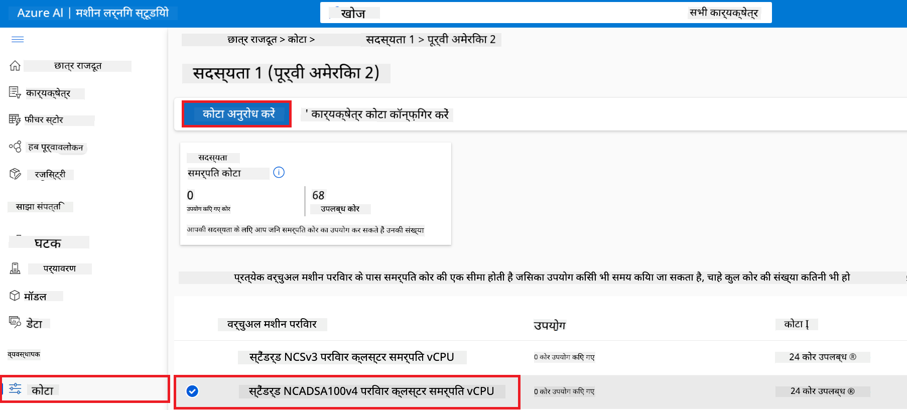
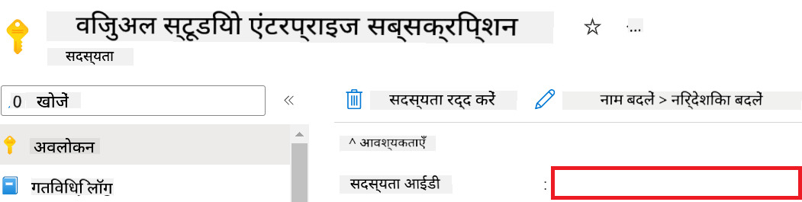
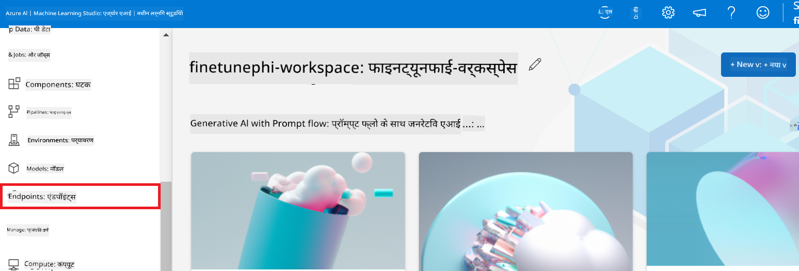

<!--
CO_OP_TRANSLATOR_METADATA:
{
  "original_hash": "455be2b7b9c3390d367d528f8fab2aa0",
  "translation_date": "2025-05-08T05:41:08+00:00",
  "source_file": "md/02.Application/01.TextAndChat/Phi3/E2E_Phi-3-FineTuning_PromptFlow_Integration.md",
  "language_code": "hi"
}
-->
# Fine-tune और Prompt flow के साथ कस्टम Phi-3 मॉडल को इंटीग्रेट करें

यह end-to-end (E2E) उदाहरण Microsoft Tech Community की गाइड "[Fine-Tune and Integrate Custom Phi-3 Models with Prompt Flow: Step-by-Step Guide](https://techcommunity.microsoft.com/t5/educator-developer-blog/fine-tune-and-integrate-custom-phi-3-models-with-prompt-flow/ba-p/4178612?WT.mc_id=aiml-137032-kinfeylo)" पर आधारित है। इसमें कस्टम Phi-3 मॉडल को fine-tune, deploy और Prompt flow के साथ integrate करने की प्रक्रिया बताई गई है।

## अवलोकन

इस E2E उदाहरण में, आप सीखेंगे कि Phi-3 मॉडल को कैसे fine-tune करें और उसे Prompt flow के साथ कैसे integrate करें। Azure Machine Learning और Prompt flow का उपयोग करके, आप कस्टम AI मॉडल को deploy और उपयोग करने के लिए एक workflow स्थापित करेंगे। यह E2E उदाहरण तीन परिदृश्यों में विभाजित है:

**परिदृश्य 1: Azure संसाधनों की सेटअप और fine-tuning के लिए तैयारी**

**परिदृश्य 2: Phi-3 मॉडल को fine-tune करना और Azure Machine Learning Studio में deploy करना**

**परिदृश्य 3: Prompt flow के साथ इंटीग्रेशन और अपने कस्टम मॉडल के साथ चैट करना**

यहाँ इस E2E उदाहरण का एक अवलोकन है।


### विषय सूची

1. **[परिदृश्य 1: Azure संसाधनों की सेटअप और fine-tuning के लिए तैयारी](../../../../../../md/02.Application/01.TextAndChat/Phi3)**
    - [Azure Machine Learning Workspace बनाना](../../../../../../md/02.Application/01.TextAndChat/Phi3)
    - [Azure Subscription में GPU कोटा के लिए अनुरोध करना](../../../../../../md/02.Application/01.TextAndChat/Phi3)
    - [Role assignment जोड़ना](../../../../../../md/02.Application/01.TextAndChat/Phi3)
    - [प्रोजेक्ट सेटअप करना](../../../../../../md/02.Application/01.TextAndChat/Phi3)
    - [Fine-tuning के लिए dataset तैयार करना](../../../../../../md/02.Application/01.TextAndChat/Phi3)

1. **[परिदृश्य 2: Phi-3 मॉडल को fine-tune करना और Azure Machine Learning Studio में deploy करना](../../../../../../md/02.Application/01.TextAndChat/Phi3)**
    - [Azure CLI सेटअप करना](../../../../../../md/02.Application/01.TextAndChat/Phi3)
    - [Phi-3 मॉडल को fine-tune करना](../../../../../../md/02.Application/01.TextAndChat/Phi3)
    - [Fine-tuned मॉडल को deploy करना](../../../../../../md/02.Application/01.TextAndChat/Phi3)

1. **[परिदृश्य 3: Prompt flow के साथ इंटीग्रेट करना और अपने कस्टम मॉडल से चैट करना](../../../../../../md/02.Application/01.TextAndChat/Phi3)**
    - [कस्टम Phi-3 मॉडल को Prompt flow के साथ इंटीग्रेट करना](../../../../../../md/02.Application/01.TextAndChat/Phi3)
    - [अपने कस्टम मॉडल से चैट करना](../../../../../../md/02.Application/01.TextAndChat/Phi3)

## परिदृश्य 1: Azure संसाधनों की सेटअप और fine-tuning के लिए तैयारी

### Azure Machine Learning Workspace बनाना

1. पोर्टल पेज के ऊपर **search bar** में *azure machine learning* टाइप करें और दिखाई देने वाले विकल्पों में से **Azure Machine Learning** चुनें।

    

1. नेविगेशन मेनू से **+ Create** चुनें।

1. नेविगेशन मेनू से **New workspace** चुनें।

    

1. निम्नलिखित कार्य करें:

    - अपनी Azure **Subscription** चुनें।
    - उपयोग करने के लिए **Resource group** चुनें (यदि आवश्यक हो तो नया बनाएं)।
    - **Workspace Name** दर्ज करें। यह एक अनूठा नाम होना चाहिए।
    - उपयोग करने के लिए **Region** चुनें।
    - उपयोग करने के लिए **Storage account** चुनें (यदि आवश्यक हो तो नया बनाएं)।
    - उपयोग करने के लिए **Key vault** चुनें (यदि आवश्यक हो तो नया बनाएं)।
    - उपयोग करने के लिए **Application insights** चुनें (यदि आवश्यक हो तो नया बनाएं)।
    - उपयोग करने के लिए **Container registry** चुनें (यदि आवश्यक हो तो नया बनाएं)।

    

1. **Review + Create** चुनें।

1. **Create** चुनें।

### Azure Subscription में GPU कोटा के लिए अनुरोध करना

इस E2E उदाहरण में, आप fine-tuning के लिए *Standard_NC24ads_A100_v4 GPU* का उपयोग करेंगे, जिसके लिए कोटा अनुरोध आवश्यक है, और deployment के लिए *Standard_E4s_v3* CPU का उपयोग करेंगे, जिसके लिए कोटा अनुरोध की आवश्यकता नहीं है।

> [!NOTE]
>
> केवल Pay-As-You-Go सब्सक्रिप्शन (साधारण सब्सक्रिप्शन प्रकार) GPU आवंटन के लिए पात्र हैं; benefit सब्सक्रिप्शन वर्तमान में समर्थित नहीं हैं।
>
> जो benefit सब्सक्रिप्शन (जैसे Visual Studio Enterprise Subscription) का उपयोग कर रहे हैं या जो fine-tuning और deployment प्रक्रिया को जल्दी से परीक्षण करना चाहते हैं, उनके लिए यह ट्यूटोरियल CPU के साथ न्यूनतम dataset का उपयोग करके fine-tuning के लिए भी मार्गदर्शन प्रदान करता है। हालांकि, यह ध्यान देना महत्वपूर्ण है कि GPU और बड़े datasets के साथ fine-tuning के परिणाम काफी बेहतर होते हैं।

1. [Azure ML Studio](https://ml.azure.com/home?wt.mc_id=studentamb_279723) पर जाएं।

1. *Standard NCADSA100v4 Family* कोटा अनुरोध करने के लिए निम्नलिखित कार्य करें:

    - बाएं साइड टैब से **Quota** चुनें।
    - उपयोग करने के लिए **Virtual machine family** चुनें। उदाहरण के लिए, **Standard NCADSA100v4 Family Cluster Dedicated vCPUs** चुनें, जिसमें *Standard_NC24ads_A100_v4* GPU शामिल है।
    - नेविगेशन मेनू से **Request quota** चुनें।

        

    - Request quota पेज पर, आप जितने **New cores limit** चाहते हैं, वह दर्ज करें। उदाहरण के लिए, 24।
    - Request quota पेज पर, GPU कोटा के लिए **Submit** चुनें।

> [!NOTE]
> अपनी आवश्यकताओं के अनुसार GPU या CPU का चयन करने के लिए [Sizes for Virtual Machines in Azure](https://learn.microsoft.com/azure/virtual-machines/sizes/overview?tabs=breakdownseries%2Cgeneralsizelist%2Ccomputesizelist%2Cmemorysizelist%2Cstoragesizelist%2Cgpusizelist%2Cfpgasizelist%2Chpcsizelist) दस्तावेज़ देखें।

### Role assignment जोड़ना

अपने मॉडल को fine-tune और deploy करने के लिए, आपको पहले एक User Assigned Managed Identity (UAI) बनानी होगी और उसे उचित अनुमतियाँ देनी होंगी। यह UAI deployment के दौरान प्रमाणीकरण के लिए उपयोग की जाएगी।

#### User Assigned Managed Identity (UAI) बनाएं

1. पोर्टल पेज के ऊपर **search bar** में *managed identities* टाइप करें और दिखाई देने वाले विकल्पों में से **Managed Identities** चुनें।

    

1. **+ Create** चुनें।

    

1. निम्नलिखित कार्य करें:

    - अपनी Azure **Subscription** चुनें।
    - उपयोग करने के लिए **Resource group** चुनें (यदि आवश्यक हो तो नया बनाएं)।
    - उपयोग करने के लिए **Region** चुनें।
    - **Name** दर्ज करें। यह एक अनूठा नाम होना चाहिए।

1. **Review + create** चुनें।

1. **+ Create** चुनें।

#### Managed Identity को Contributor role असाइन करें

1. उस Managed Identity संसाधन पर जाएं जिसे आपने बनाया है।

1. बाएं साइड टैब से **Azure role assignments** चुनें।

1. नेविगेशन मेनू से **+ Add role assignment** चुनें।

1. Add role assignment पेज में निम्नलिखित कार्य करें:
    - **Scope** को **Resource group** पर सेट करें।
    - अपनी Azure **Subscription** चुनें।
    - उपयोग करने के लिए **Resource group** चुनें।
    - **Role** को **Contributor** पर सेट करें।

    

1. **Save** चुनें।

#### Managed Identity को Storage Blob Data Reader role असाइन करें

1. पोर्टल पेज के ऊपर **search bar** में *storage accounts* टाइप करें और दिखाई देने वाले विकल्पों में से **Storage accounts** चुनें।

    

1. उस storage account को चुनें जो आपने Azure Machine Learning workspace के साथ जोड़ा है। उदाहरण के लिए, *finetunephistorage*।

1. Add role assignment पेज पर जाने के लिए निम्नलिखित कार्य करें:

    - Azure Storage account पर जाएं जिसे आपने बनाया है।
    - बाएं साइड टैब से **Access Control (IAM)** चुनें।
    - नेविगेशन मेनू से **+ Add** चुनें।
    - नेविगेशन मेनू से **Add role assignment** चुनें।

    

1. Add role assignment पेज में निम्नलिखित कार्य करें:

    - Role पेज में, **search bar** में *Storage Blob Data Reader* टाइप करें और विकल्पों में से **Storage Blob Data Reader** चुनें।
    - Role पेज में, **Next** चुनें।
    - Members पेज में, **Assign access to** के तहत **Managed identity** चुनें।
    - Members पेज में, **+ Select members** चुनें।
    - Select managed identities पेज में, अपनी Azure **Subscription** चुनें।
    - Select managed identities पेज में, **Managed identity** के लिए **Manage Identity** चुनें।
    - Select managed identities पेज में, उस Manage Identity को चुनें जिसे आपने बनाया है। उदाहरण के लिए, *finetunephi-managedidentity*।
    - Select managed identities पेज में, **Select** चुनें।

    

1. **Review + assign** चुनें।

#### Managed Identity को AcrPull role असाइन करें

1. पोर्टल पेज के ऊपर **search bar** में *container registries* टाइप करें और दिखाई देने वाले विकल्पों में से **Container registries** चुनें।

    

1. उस container registry को चुनें जो Azure Machine Learning workspace के साथ जुड़ा है। उदाहरण के लिए, *finetunephicontainerregistries*।

1. Add role assignment पेज पर जाने के लिए निम्नलिखित कार्य करें:

    - बाएं साइड टैब से **Access Control (IAM)** चुनें।
    - नेविगेशन मेनू से **+ Add** चुनें।
    - नेविगेशन मेनू से **Add role assignment** चुनें।

1. Add role assignment पेज में निम्नलिखित कार्य करें:

    - Role पेज में, **search bar** में *AcrPull* टाइप करें और विकल्पों में से **AcrPull** चुनें।
    - Role पेज में, **Next** चुनें।
    - Members पेज में, **Assign access to** के तहत **Managed identity** चुनें।
    - Members पेज में, **+ Select members** चुनें।
    - Select managed identities पेज में, अपनी Azure **Subscription** चुनें।
    - Select managed identities पेज में, **Managed identity** के लिए **Manage Identity** चुनें।
    - Select managed identities पेज में, उस Manage Identity को चुनें जिसे आपने बनाया है। उदाहरण के लिए, *finetunephi-managedidentity*।
    - Select managed identities पेज में, **Select** चुनें।
    - **Review + assign** चुनें।

### प्रोजेक्ट सेटअप करना

अब, आप एक फोल्डर बनाएंगे जिसमें काम करेंगे और एक वर्चुअल एनवायरनमेंट सेटअप करेंगे ताकि एक ऐसा प्रोग्राम विकसित किया जा सके जो उपयोगकर्ताओं के साथ इंटरैक्ट करे और Azure Cosmos DB में संग्रहित चैट इतिहास का उपयोग करके प्रतिक्रियाएँ प्रदान करे।

#### काम करने के लिए फोल्डर बनाएं

1. टर्मिनल विंडो खोलें और डिफ़ॉल्ट पथ में *finetune-phi* नाम का फोल्डर बनाने के लिए निम्न कमांड टाइप करें।

    ```console
    mkdir finetune-phi
    ```

1. टर्मिनल में निम्न कमांड टाइप करके *finetune-phi* फोल्डर में जाएं।

    ```console
    cd finetune-phi
    ```

#### वर्चुअल एनवायरनमेंट बनाएं

1. टर्मिनल में निम्न कमांड टाइप करके *.venv* नाम का वर्चुअल एनवायरनमेंट बनाएं।

    ```console
    python -m venv .venv
    ```

1. टर्मिनल में निम्न कमांड टाइप करके वर्चुअल एनवायरनमेंट को सक्रिय करें।

    ```console
    .venv\Scripts\activate.bat
    ```

> [!NOTE]
>
> यदि यह सफल रहा, तो कमांड प्रॉम्प्ट से पहले *(.venv)* दिखाई देगा।

#### आवश्यक पैकेज इंस्टॉल करें

1. टर्मिनल में निम्न कमांड टाइप करके आवश्यक पैकेज इंस्टॉल करें।

    ```console
    pip install datasets==2.19.1
    pip install transformers==4.41.1
    pip install azure-ai-ml==1.16.0
    pip install torch==2.3.1
    pip install trl==0.9.4
    pip install promptflow==1.12.0
    ```

#### प्रोजेक्ट फाइलें बनाएं

इस अभ्यास में, आप प्रोजेक्ट के लिए आवश्यक फाइलें बनाएंगे। इनमें dataset डाउनलोड करने, Azure Machine Learning सेटअप करने, Phi-3 मॉडल को fine-tune करने, और fine-tuned मॉडल को deploy करने के लिए स्क्रिप्ट शामिल हैं। साथ ही, आप fine-tuning एनवायरनमेंट सेटअप के लिए *conda.yml* फाइल भी बनाएंगे।

इस अभ्यास में आप करेंगे:

- dataset डाउनलोड करने के लिए *download_dataset.py* फाइल बनाएंगे।
- Azure Machine Learning सेटअप के लिए *setup_ml.py* फाइल बनाएंगे।
- *finetuning_dir* फोल्डर में *fine_tune.py* फाइल बनाएंगे, जो dataset का उपयोग करके Phi-3 मॉडल को fine-tune करेगी।
- fine-tuning एनवायरनमेंट सेटअप के लिए *conda.yml* फाइल बनाएंगे।
- fine-tuned मॉडल को deploy करने के लिए *deploy_model.py* फाइल बनाएंगे।
- fine-tuned मॉडल को Prompt flow के साथ इंटीग्रेट करने और उसे चलाने के लिए *integrate_with_promptflow.py* फाइल बनाएंगे।
- Prompt flow के लिए workflow संरचना सेटअप करने के लिए flow.dag.yml फाइल बनाएंगे।
- Azure जानकारी दर्ज करने के लिए *config.py* फाइल बनाएंगे।

> [!NOTE]
>
> पूर्ण फोल्डर संरचना:
>
> ```text
> └── YourUserName
> .    └── finetune-phi
> .        ├── finetuning_dir
> .        │      └── fine_tune.py
> .        ├── conda.yml
> .        ├── config.py
> .        ├── deploy_model.py
> .        ├── download_dataset.py
> .        ├── flow.dag.yml
> .        ├── integrate_with_promptflow.py
> .        └── setup_ml.py
> ```

1. **Visual Studio Code** खोलें।

1. मेनू बार से **File** चुनें।

1. **Open Folder** चुनें।

1. *finetune-phi* फोल्डर चुनें जो आपने बनाया है, जो कि *C:\Users\yourUserName\finetune-phi* में स्थित है।

    

1. Visual Studio Code के बाएं पेन में, राइट-क्लिक करें और **New File** चुनें, फिर *download_dataset.py* नाम की नई फाइल बनाएं।

1. Visual Studio Code के बाएं पेन में, राइट-क्लिक करें और **New File** चुनें, फिर *setup_ml.py* नाम की नई फाइल बनाएं।

1. Visual Studio Code के बाएं पेन में, राइट-क्लिक करें और **New File** चुनें, फिर *deploy_model.py* नाम की नई फाइल बनाएं।

    

1. Visual Studio Code के बाएं पेन में, राइट-क्लिक करें और **New Folder** चुनें, फिर *finetuning_dir* नाम का नया फोल्डर बनाएं।

1. *finetuning_dir* फोल्डर में, *fine_tune.py* नाम की नई फाइल बनाएं।

#### *conda.yml* फाइल बनाएं और कॉन्फ़िगर करें

1. Visual Studio Code के बाएं पेन में, राइट-क्लिक करें और **New File** चुनें, फिर *conda.yml* नाम की नई फाइल बनाएं।

1. *conda.yml* फाइल में निम्न कोड जोड़ें ताकि Phi-3 मॉडल के लिए fine-tuning एनवायरनमेंट सेटअप हो सके।

    ```yml
    name: phi-3-training-env
    channels:
      - defaults
      - conda-forge
    dependencies:
      - python=3.10
      - pip
      - numpy<2.0
      - pip:
          - torch==2.4.0
          - torchvision==0.19.0
          - trl==0.8.6
          - transformers==4.41
          - datasets==2.21.0
          - azureml-core==1.57.0
          - azure-storage-blob==12.19.0
          - azure-ai-ml==1.16
          - azure-identity==1.17.1
          - accelerate==0.33.0
          - mlflow==2.15.1
          - azureml-mlflow==1.57.0
    ```

#### *config.py* फाइल बनाएं और कॉन्फ़िगर करें

1. Visual Studio Code के बाएं पेन में, राइट-क्लिक करें और **New File** चुनें, फिर *config.py* नाम की नई फाइल बनाएं।

1. *config.py* फाइल में अपनी Azure जानकारी जोड़ने के लिए निम्न कोड डालें।

    ```python
    # Azure settings
    AZURE_SUBSCRIPTION_ID = "your_subscription_id"
    AZURE_RESOURCE_GROUP_NAME = "your_resource_group_name" # "TestGroup"

    # Azure Machine Learning settings
    AZURE_ML_WORKSPACE_NAME = "your_workspace_name" # "finetunephi-workspace"

    # Azure Managed Identity settings
    AZURE_MANAGED_IDENTITY_CLIENT_ID = "your_azure_managed_identity_client_id"
    AZURE_MANAGED_IDENTITY_NAME = "your_azure_managed_identity_name" # "finetunephi-mangedidentity"
    AZURE_MANAGED_IDENTITY_RESOURCE_ID = f"/subscriptions/{AZURE_SUBSCRIPTION_ID}/resourceGroups/{AZURE_RESOURCE_GROUP_NAME}/providers/Microsoft.ManagedIdentity/userAssignedIdentities/{AZURE_MANAGED_IDENTITY_NAME}"

    # Dataset file paths
    TRAIN_DATA_PATH = "data/train_data.jsonl"
    TEST_DATA_PATH = "data/test_data.jsonl"

    # Fine-tuned model settings
    AZURE_MODEL_NAME = "your_fine_tuned_model_name" # "finetune-phi-model"
    AZURE_ENDPOINT_NAME = "your_fine_tuned_model_endpoint_name" # "finetune-phi-endpoint"
    AZURE_DEPLOYMENT_NAME = "your_fine_tuned_model_deployment_name" # "finetune-phi-deployment"

    AZURE_ML_API_KEY = "your_fine_tuned_model_api_key"
    AZURE_ML_ENDPOINT = "your_fine_tuned_model_endpoint_uri" # "https://{your-endpoint-name}.{your-region}.inference.ml.azure.com/score"
    ```

#### Azure environment variables जोड़ें

1. Azure Subscription ID जोड़ने के लिए निम्नलिखित कार्य करें:

    - पोर्टल पेज के ऊपर **search


1. Azure Workspace Name जोड़ने के लिए निम्नलिखित कार्य करें:

    - उस Azure Machine Learning संसाधन पर जाएं जिसे आपने बनाया है।
    - अपना अकाउंट नाम *config.py* फ़ाइल में कॉपी और पेस्ट करें।

    

1. Azure Resource Group Name जोड़ने के लिए निम्नलिखित कार्य करें:

    - उस Azure Machine Learning संसाधन पर जाएं जिसे आपने बनाया है।
    - अपना Azure Resource Group Name *config.py* फ़ाइल में कॉपी और पेस्ट करें।

    

2. Azure Managed Identity नाम जोड़ने के लिए निम्नलिखित कार्य करें:

    - उस Managed Identities संसाधन पर जाएं जिसे आपने बनाया है।
    - अपना Azure Managed Identity नाम *config.py* फ़ाइल में कॉपी और पेस्ट करें।

    

### Fine-tuning के लिए dataset तैयार करें

इस अभ्यास में, आप *download_dataset.py* फ़ाइल चलाकर *ULTRACHAT_200k* datasets को अपने लोकल वातावरण में डाउनलोड करेंगे। फिर आप इस dataset का उपयोग Azure Machine Learning में Phi-3 मॉडल को fine-tune करने के लिए करेंगे।

#### *download_dataset.py* का उपयोग करके अपना dataset डाउनलोड करें

1. Visual Studio Code में *download_dataset.py* फ़ाइल खोलें।

1. *download_dataset.py* में निम्नलिखित कोड जोड़ें।

    ```python
    import json
    import os
    from datasets import load_dataset
    from config import (
        TRAIN_DATA_PATH,
        TEST_DATA_PATH)

    def load_and_split_dataset(dataset_name, config_name, split_ratio):
        """
        Load and split a dataset.
        """
        # Load the dataset with the specified name, configuration, and split ratio
        dataset = load_dataset(dataset_name, config_name, split=split_ratio)
        print(f"Original dataset size: {len(dataset)}")
        
        # Split the dataset into train and test sets (80% train, 20% test)
        split_dataset = dataset.train_test_split(test_size=0.2)
        print(f"Train dataset size: {len(split_dataset['train'])}")
        print(f"Test dataset size: {len(split_dataset['test'])}")
        
        return split_dataset

    def save_dataset_to_jsonl(dataset, filepath):
        """
        Save a dataset to a JSONL file.
        """
        # Create the directory if it does not exist
        os.makedirs(os.path.dirname(filepath), exist_ok=True)
        
        # Open the file in write mode
        with open(filepath, 'w', encoding='utf-8') as f:
            # Iterate over each record in the dataset
            for record in dataset:
                # Dump the record as a JSON object and write it to the file
                json.dump(record, f)
                # Write a newline character to separate records
                f.write('\n')
        
        print(f"Dataset saved to {filepath}")

    def main():
        """
        Main function to load, split, and save the dataset.
        """
        # Load and split the ULTRACHAT_200k dataset with a specific configuration and split ratio
        dataset = load_and_split_dataset("HuggingFaceH4/ultrachat_200k", 'default', 'train_sft[:1%]')
        
        # Extract the train and test datasets from the split
        train_dataset = dataset['train']
        test_dataset = dataset['test']

        # Save the train dataset to a JSONL file
        save_dataset_to_jsonl(train_dataset, TRAIN_DATA_PATH)
        
        # Save the test dataset to a separate JSONL file
        save_dataset_to_jsonl(test_dataset, TEST_DATA_PATH)

    if __name__ == "__main__":
        main()

    ```

> [!TIP]
>
> **CPU का उपयोग करके न्यूनतम dataset से fine-tuning के लिए मार्गदर्शन**
>
> यदि आप CPU का उपयोग करके fine-tuning करना चाहते हैं, तो यह तरीका उन लोगों के लिए उपयुक्त है जिनके पास benefit subscriptions हैं (जैसे Visual Studio Enterprise Subscription) या जो जल्दी से fine-tuning और deployment प्रक्रिया को टेस्ट करना चाहते हैं।
>
> `dataset = load_and_split_dataset("HuggingFaceH4/ultrachat_200k", 'default', 'train_sft[:1%]')` with `dataset = load_and_split_dataset("HuggingFaceH4/ultrachat_200k", 'default', 'train_sft[:10]')` से बदलें
>

1. टर्मिनल में निम्नलिखित कमांड टाइप करें ताकि स्क्रिप्ट चले और dataset आपके लोकल वातावरण में डाउनलोड हो जाए।

    ```console
    python download_data.py
    ```

1. सुनिश्चित करें कि datasets सफलतापूर्वक आपके लोकल *finetune-phi/data* डायरेक्टरी में सेव हो गए हैं।

> [!NOTE]
>
> **Dataset का आकार और fine-tuning का समय**
>
> इस E2E उदाहरण में, आप केवल dataset का 1% (`train_sft[:1%]`) उपयोग करते हैं। इससे डेटा की मात्रा काफी कम हो जाती है, जिससे अपलोड और fine-tuning दोनों प्रक्रिया तेज़ हो जाती हैं। आप training समय और मॉडल प्रदर्शन के बीच सही संतुलन खोजने के लिए प्रतिशत को समायोजित कर सकते हैं। dataset के छोटे हिस्से का उपयोग करने से fine-tuning में लगने वाला समय कम होता है, जिससे यह E2E उदाहरण के लिए अधिक प्रबंधनीय बन जाता है।

## Scenario 2: Phi-3 मॉडल को Fine-tune करें और Azure Machine Learning Studio में Deploy करें

### Azure CLI सेटअप करें

अपने वातावरण को प्रमाणित करने के लिए आपको Azure CLI सेटअप करना होगा। Azure CLI आपको कमांड लाइन से सीधे Azure संसाधनों का प्रबंधन करने की अनुमति देता है और Azure Machine Learning को इन संसाधनों तक पहुंचने के लिए आवश्यक क्रेडेंशियल प्रदान करता है। शुरू करने के लिए [Azure CLI](https://learn.microsoft.com/cli/azure/install-azure-cli) इंस्टॉल करें।

1. टर्मिनल विंडो खोलें और Azure अकाउंट में लॉगिन करने के लिए निम्नलिखित कमांड टाइप करें।

    ```console
    az login
    ```

1. उपयोग के लिए अपना Azure अकाउंट चुनें।

1. उपयोग के लिए अपना Azure subscription चुनें।

    

> [!TIP]
>
> यदि Azure में साइन इन करने में समस्या हो रही है, तो डिवाइस कोड का उपयोग करने का प्रयास करें। टर्मिनल विंडो खोलें और Azure अकाउंट में साइन इन करने के लिए निम्नलिखित कमांड टाइप करें:
>
> ```console
> az login --use-device-code
> ```
>

### Phi-3 मॉडल को Fine-tune करें

इस अभ्यास में, आप प्रदान किए गए dataset का उपयोग करके Phi-3 मॉडल को fine-tune करेंगे। पहले, आप *fine_tune.py* फ़ाइल में fine-tuning प्रक्रिया को परिभाषित करेंगे। फिर, आप Azure Machine Learning वातावरण को कॉन्फ़िगर करेंगे और *setup_ml.py* फ़ाइल चलाकर fine-tuning प्रक्रिया शुरू करेंगे। यह स्क्रिप्ट सुनिश्चित करता है कि fine-tuning Azure Machine Learning वातावरण में ही हो।

*setup_ml.py* चलाकर, आप Azure Machine Learning वातावरण में fine-tuning प्रक्रिया चलाएंगे।

#### *fine_tune.py* फ़ाइल में कोड जोड़ें

1. *finetuning_dir* फ़ोल्डर में जाएं और Visual Studio Code में *fine_tune.py* फ़ाइल खोलें।

1. *fine_tune.py* में निम्नलिखित कोड जोड़ें।

    ```python
    import argparse
    import sys
    import logging
    import os
    from datasets import load_dataset
    import torch
    import mlflow
    from transformers import AutoModelForCausalLM, AutoTokenizer, TrainingArguments
    from trl import SFTTrainer

    # To avoid the INVALID_PARAMETER_VALUE error in MLflow, disable MLflow integration
    os.environ["DISABLE_MLFLOW_INTEGRATION"] = "True"

    # Logging setup
    logging.basicConfig(
        format="%(asctime)s - %(levelname)s - %(name)s - %(message)s",
        datefmt="%Y-%m-%d %H:%M:%S",
        handlers=[logging.StreamHandler(sys.stdout)],
        level=logging.WARNING
    )
    logger = logging.getLogger(__name__)

    def initialize_model_and_tokenizer(model_name, model_kwargs):
        """
        Initialize the model and tokenizer with the given pretrained model name and arguments.
        """
        model = AutoModelForCausalLM.from_pretrained(model_name, **model_kwargs)
        tokenizer = AutoTokenizer.from_pretrained(model_name)
        tokenizer.model_max_length = 2048
        tokenizer.pad_token = tokenizer.unk_token
        tokenizer.pad_token_id = tokenizer.convert_tokens_to_ids(tokenizer.pad_token)
        tokenizer.padding_side = 'right'
        return model, tokenizer

    def apply_chat_template(example, tokenizer):
        """
        Apply a chat template to tokenize messages in the example.
        """
        messages = example["messages"]
        if messages[0]["role"] != "system":
            messages.insert(0, {"role": "system", "content": ""})
        example["text"] = tokenizer.apply_chat_template(
            messages, tokenize=False, add_generation_prompt=False
        )
        return example

    def load_and_preprocess_data(train_filepath, test_filepath, tokenizer):
        """
        Load and preprocess the dataset.
        """
        train_dataset = load_dataset('json', data_files=train_filepath, split='train')
        test_dataset = load_dataset('json', data_files=test_filepath, split='train')
        column_names = list(train_dataset.features)

        train_dataset = train_dataset.map(
            apply_chat_template,
            fn_kwargs={"tokenizer": tokenizer},
            num_proc=10,
            remove_columns=column_names,
            desc="Applying chat template to train dataset",
        )

        test_dataset = test_dataset.map(
            apply_chat_template,
            fn_kwargs={"tokenizer": tokenizer},
            num_proc=10,
            remove_columns=column_names,
            desc="Applying chat template to test dataset",
        )

        return train_dataset, test_dataset

    def train_and_evaluate_model(train_dataset, test_dataset, model, tokenizer, output_dir):
        """
        Train and evaluate the model.
        """
        training_args = TrainingArguments(
            bf16=True,
            do_eval=True,
            output_dir=output_dir,
            eval_strategy="epoch",
            learning_rate=5.0e-06,
            logging_steps=20,
            lr_scheduler_type="cosine",
            num_train_epochs=3,
            overwrite_output_dir=True,
            per_device_eval_batch_size=4,
            per_device_train_batch_size=4,
            remove_unused_columns=True,
            save_steps=500,
            seed=0,
            gradient_checkpointing=True,
            gradient_accumulation_steps=1,
            warmup_ratio=0.2,
        )

        trainer = SFTTrainer(
            model=model,
            args=training_args,
            train_dataset=train_dataset,
            eval_dataset=test_dataset,
            max_seq_length=2048,
            dataset_text_field="text",
            tokenizer=tokenizer,
            packing=True
        )

        train_result = trainer.train()
        trainer.log_metrics("train", train_result.metrics)

        mlflow.transformers.log_model(
            transformers_model={"model": trainer.model, "tokenizer": tokenizer},
            artifact_path=output_dir,
        )

        tokenizer.padding_side = 'left'
        eval_metrics = trainer.evaluate()
        eval_metrics["eval_samples"] = len(test_dataset)
        trainer.log_metrics("eval", eval_metrics)

    def main(train_file, eval_file, model_output_dir):
        """
        Main function to fine-tune the model.
        """
        model_kwargs = {
            "use_cache": False,
            "trust_remote_code": True,
            "torch_dtype": torch.bfloat16,
            "device_map": None,
            "attn_implementation": "eager"
        }

        # pretrained_model_name = "microsoft/Phi-3-mini-4k-instruct"
        pretrained_model_name = "microsoft/Phi-3.5-mini-instruct"

        with mlflow.start_run():
            model, tokenizer = initialize_model_and_tokenizer(pretrained_model_name, model_kwargs)
            train_dataset, test_dataset = load_and_preprocess_data(train_file, eval_file, tokenizer)
            train_and_evaluate_model(train_dataset, test_dataset, model, tokenizer, model_output_dir)

    if __name__ == "__main__":
        parser = argparse.ArgumentParser()
        parser.add_argument("--train-file", type=str, required=True, help="Path to the training data")
        parser.add_argument("--eval-file", type=str, required=True, help="Path to the evaluation data")
        parser.add_argument("--model_output_dir", type=str, required=True, help="Directory to save the fine-tuned model")
        args = parser.parse_args()
        main(args.train_file, args.eval_file, args.model_output_dir)

    ```

1. *fine_tune.py* फ़ाइल को सेव करें और बंद करें।

> [!TIP]
> **आप Phi-3.5 मॉडल को भी fine-tune कर सकते हैं**
>
> *fine_tune.py* फ़ाइल में, आप `pretrained_model_name` from `"microsoft/Phi-3-mini-4k-instruct"` to any model you want to fine-tune. For example, if you change it to `"microsoft/Phi-3.5-mini-instruct"`, you'll be using the Phi-3.5-mini-instruct model for fine-tuning. To find and use the model name you prefer, visit [Hugging Face](https://huggingface.co/), search for the model you're interested in, and then copy and paste its name into the `pretrained_model_name` फील्ड को अपनी स्क्रिप्ट में बदल सकते हैं।
>
> :::image type="content" source="../../imgs/03/FineTuning-PromptFlow/finetunephi3.5.png" alt-text="Fine tune Phi-3.5.":::
>

#### *setup_ml.py* फ़ाइल में कोड जोड़ें

1. Visual Studio Code में *setup_ml.py* फ़ाइल खोलें।

1. *setup_ml.py* में निम्नलिखित कोड जोड़ें।

    ```python
    import logging
    from azure.ai.ml import MLClient, command, Input
    from azure.ai.ml.entities import Environment, AmlCompute
    from azure.identity import AzureCliCredential
    from config import (
        AZURE_SUBSCRIPTION_ID,
        AZURE_RESOURCE_GROUP_NAME,
        AZURE_ML_WORKSPACE_NAME,
        TRAIN_DATA_PATH,
        TEST_DATA_PATH
    )

    # Constants

    # Uncomment the following lines to use a CPU instance for training
    # COMPUTE_INSTANCE_TYPE = "Standard_E16s_v3" # cpu
    # COMPUTE_NAME = "cpu-e16s-v3"
    # DOCKER_IMAGE_NAME = "mcr.microsoft.com/azureml/openmpi4.1.0-ubuntu20.04:latest"

    # Uncomment the following lines to use a GPU instance for training
    COMPUTE_INSTANCE_TYPE = "Standard_NC24ads_A100_v4"
    COMPUTE_NAME = "gpu-nc24s-a100-v4"
    DOCKER_IMAGE_NAME = "mcr.microsoft.com/azureml/curated/acft-hf-nlp-gpu:59"

    CONDA_FILE = "conda.yml"
    LOCATION = "eastus2" # Replace with the location of your compute cluster
    FINETUNING_DIR = "./finetuning_dir" # Path to the fine-tuning script
    TRAINING_ENV_NAME = "phi-3-training-environment" # Name of the training environment
    MODEL_OUTPUT_DIR = "./model_output" # Path to the model output directory in azure ml

    # Logging setup to track the process
    logger = logging.getLogger(__name__)
    logging.basicConfig(
        format="%(asctime)s - %(levelname)s - %(name)s - %(message)s",
        datefmt="%Y-%m-%d %H:%M:%S",
        level=logging.WARNING
    )

    def get_ml_client():
        """
        Initialize the ML Client using Azure CLI credentials.
        """
        credential = AzureCliCredential()
        return MLClient(credential, AZURE_SUBSCRIPTION_ID, AZURE_RESOURCE_GROUP_NAME, AZURE_ML_WORKSPACE_NAME)

    def create_or_get_environment(ml_client):
        """
        Create or update the training environment in Azure ML.
        """
        env = Environment(
            image=DOCKER_IMAGE_NAME,  # Docker image for the environment
            conda_file=CONDA_FILE,  # Conda environment file
            name=TRAINING_ENV_NAME,  # Name of the environment
        )
        return ml_client.environments.create_or_update(env)

    def create_or_get_compute_cluster(ml_client, compute_name, COMPUTE_INSTANCE_TYPE, location):
        """
        Create or update the compute cluster in Azure ML.
        """
        try:
            compute_cluster = ml_client.compute.get(compute_name)
            logger.info(f"Compute cluster '{compute_name}' already exists. Reusing it for the current run.")
        except Exception:
            logger.info(f"Compute cluster '{compute_name}' does not exist. Creating a new one with size {COMPUTE_INSTANCE_TYPE}.")
            compute_cluster = AmlCompute(
                name=compute_name,
                size=COMPUTE_INSTANCE_TYPE,
                location=location,
                tier="Dedicated",  # Tier of the compute cluster
                min_instances=0,  # Minimum number of instances
                max_instances=1  # Maximum number of instances
            )
            ml_client.compute.begin_create_or_update(compute_cluster).wait()  # Wait for the cluster to be created
        return compute_cluster

    def create_fine_tuning_job(env, compute_name):
        """
        Set up the fine-tuning job in Azure ML.
        """
        return command(
            code=FINETUNING_DIR,  # Path to fine_tune.py
            command=(
                "python fine_tune.py "
                "--train-file ${{inputs.train_file}} "
                "--eval-file ${{inputs.eval_file}} "
                "--model_output_dir ${{inputs.model_output}}"
            ),
            environment=env,  # Training environment
            compute=compute_name,  # Compute cluster to use
            inputs={
                "train_file": Input(type="uri_file", path=TRAIN_DATA_PATH),  # Path to the training data file
                "eval_file": Input(type="uri_file", path=TEST_DATA_PATH),  # Path to the evaluation data file
                "model_output": MODEL_OUTPUT_DIR
            }
        )

    def main():
        """
        Main function to set up and run the fine-tuning job in Azure ML.
        """
        # Initialize ML Client
        ml_client = get_ml_client()

        # Create Environment
        env = create_or_get_environment(ml_client)
        
        # Create or get existing compute cluster
        create_or_get_compute_cluster(ml_client, COMPUTE_NAME, COMPUTE_INSTANCE_TYPE, LOCATION)

        # Create and Submit Fine-Tuning Job
        job = create_fine_tuning_job(env, COMPUTE_NAME)
        returned_job = ml_client.jobs.create_or_update(job)  # Submit the job
        ml_client.jobs.stream(returned_job.name)  # Stream the job logs
        
        # Capture the job name
        job_name = returned_job.name
        print(f"Job name: {job_name}")

    if __name__ == "__main__":
        main()

    ```

1. `COMPUTE_INSTANCE_TYPE`, `COMPUTE_NAME`, and `LOCATION` को अपनी विशिष्ट जानकारी से बदलें।

    ```python
   # Uncomment the following lines to use a GPU instance for training
    COMPUTE_INSTANCE_TYPE = "Standard_NC24ads_A100_v4"
    COMPUTE_NAME = "gpu-nc24s-a100-v4"
    ...
    LOCATION = "eastus2" # Replace with the location of your compute cluster
    ```

> [!TIP]
>
> **CPU का उपयोग करके न्यूनतम dataset से fine-tuning के लिए मार्गदर्शन**
>
> यदि आप CPU का उपयोग करके fine-tuning करना चाहते हैं, तो यह तरीका उन लोगों के लिए उपयुक्त है जिनके पास benefit subscriptions हैं (जैसे Visual Studio Enterprise Subscription) या जो जल्दी से fine-tuning और deployment प्रक्रिया को टेस्ट करना चाहते हैं।
>
> 1. *setup_ml* फ़ाइल खोलें।
> 1. `COMPUTE_INSTANCE_TYPE`, `COMPUTE_NAME`, and `DOCKER_IMAGE_NAME` with the following. If you do not have access to *Standard_E16s_v3*, you can use an equivalent CPU instance or request a new quota.
> 1. Replace `LOCATION` को अपनी विशिष्ट जानकारी से बदलें।
>
>    ```python
>    # Uncomment the following lines to use a CPU instance for training
>    COMPUTE_INSTANCE_TYPE = "Standard_E16s_v3" # cpu
>    COMPUTE_NAME = "cpu-e16s-v3"
>    DOCKER_IMAGE_NAME = "mcr.microsoft.com/azureml/openmpi4.1.0-ubuntu20.04:latest"
>    LOCATION = "eastus2" # Replace with the location of your compute cluster
>    ```
>

1. *setup_ml.py* स्क्रिप्ट चलाने और Azure Machine Learning में fine-tuning प्रक्रिया शुरू करने के लिए निम्नलिखित कमांड टाइप करें।

    ```python
    python setup_ml.py
    ```

1. इस अभ्यास में, आपने सफलतापूर्वक Azure Machine Learning का उपयोग करके Phi-3 मॉडल को fine-tune किया। *setup_ml.py* स्क्रिप्ट चलाकर, आपने Azure Machine Learning वातावरण सेटअप किया और *fine_tune.py* फ़ाइल में परिभाषित fine-tuning प्रक्रिया शुरू की। कृपया ध्यान दें कि fine-tuning प्रक्रिया में काफी समय लग सकता है। `python setup_ml.py` command, you need to wait for the process to complete. You can monitor the status of the fine-tuning job by following the link provided in the terminal to the Azure Machine Learning portal.

    

### Deploy the fine-tuned model

To integrate the fine-tuned Phi-3 model with Prompt Flow, you need to deploy the model to make it accessible for real-time inference. This process involves registering the model, creating an online endpoint, and deploying the model.

#### Set the model name, endpoint name, and deployment name for deployment

1. Open *config.py* file.

1. Replace `AZURE_MODEL_NAME = "your_fine_tuned_model_name"` with the desired name for your model.

1. Replace `AZURE_ENDPOINT_NAME = "your_fine_tuned_model_endpoint_name"` with the desired name for your endpoint.

1. Replace `AZURE_DEPLOYMENT_NAME = "your_fine_tuned_model_deployment_name"` में अपनी deployment के लिए इच्छित नाम का उपयोग करें।

#### *deploy_model.py* फ़ाइल में कोड जोड़ें

*deploy_model.py* फ़ाइल चलाने से पूरी deployment प्रक्रिया स्वचालित हो जाती है। यह मॉडल को रजिस्टर करता है, एक endpoint बनाता है, और config.py फ़ाइल में निर्दिष्ट सेटिंग्स के आधार पर deployment करता है, जिसमें मॉडल का नाम, endpoint का नाम, और deployment का नाम शामिल है।

1. Visual Studio Code में *deploy_model.py* फ़ाइल खोलें।

1. *deploy_model.py* में निम्नलिखित कोड जोड़ें।

    ```python
    import logging
    from azure.identity import AzureCliCredential
    from azure.ai.ml import MLClient
    from azure.ai.ml.entities import Model, ProbeSettings, ManagedOnlineEndpoint, ManagedOnlineDeployment, IdentityConfiguration, ManagedIdentityConfiguration, OnlineRequestSettings
    from azure.ai.ml.constants import AssetTypes

    # Configuration imports
    from config import (
        AZURE_SUBSCRIPTION_ID,
        AZURE_RESOURCE_GROUP_NAME,
        AZURE_ML_WORKSPACE_NAME,
        AZURE_MANAGED_IDENTITY_RESOURCE_ID,
        AZURE_MANAGED_IDENTITY_CLIENT_ID,
        AZURE_MODEL_NAME,
        AZURE_ENDPOINT_NAME,
        AZURE_DEPLOYMENT_NAME
    )

    # Constants
    JOB_NAME = "your-job-name"
    COMPUTE_INSTANCE_TYPE = "Standard_E4s_v3"

    deployment_env_vars = {
        "SUBSCRIPTION_ID": AZURE_SUBSCRIPTION_ID,
        "RESOURCE_GROUP_NAME": AZURE_RESOURCE_GROUP_NAME,
        "UAI_CLIENT_ID": AZURE_MANAGED_IDENTITY_CLIENT_ID,
    }

    # Logging setup
    logging.basicConfig(
        format="%(asctime)s - %(levelname)s - %(name)s - %(message)s",
        datefmt="%Y-%m-%d %H:%M:%S",
        level=logging.DEBUG
    )
    logger = logging.getLogger(__name__)

    def get_ml_client():
        """Initialize and return the ML Client."""
        credential = AzureCliCredential()
        return MLClient(credential, AZURE_SUBSCRIPTION_ID, AZURE_RESOURCE_GROUP_NAME, AZURE_ML_WORKSPACE_NAME)

    def register_model(ml_client, model_name, job_name):
        """Register a new model."""
        model_path = f"azureml://jobs/{job_name}/outputs/artifacts/paths/model_output"
        logger.info(f"Registering model {model_name} from job {job_name} at path {model_path}.")
        run_model = Model(
            path=model_path,
            name=model_name,
            description="Model created from run.",
            type=AssetTypes.MLFLOW_MODEL,
        )
        model = ml_client.models.create_or_update(run_model)
        logger.info(f"Registered model ID: {model.id}")
        return model

    def delete_existing_endpoint(ml_client, endpoint_name):
        """Delete existing endpoint if it exists."""
        try:
            endpoint_result = ml_client.online_endpoints.get(name=endpoint_name)
            logger.info(f"Deleting existing endpoint {endpoint_name}.")
            ml_client.online_endpoints.begin_delete(name=endpoint_name).result()
            logger.info(f"Deleted existing endpoint {endpoint_name}.")
        except Exception as e:
            logger.info(f"No existing endpoint {endpoint_name} found to delete: {e}")

    def create_or_update_endpoint(ml_client, endpoint_name, description=""):
        """Create or update an endpoint."""
        delete_existing_endpoint(ml_client, endpoint_name)
        logger.info(f"Creating new endpoint {endpoint_name}.")
        endpoint = ManagedOnlineEndpoint(
            name=endpoint_name,
            description=description,
            identity=IdentityConfiguration(
                type="user_assigned",
                user_assigned_identities=[ManagedIdentityConfiguration(resource_id=AZURE_MANAGED_IDENTITY_RESOURCE_ID)]
            )
        )
        endpoint_result = ml_client.online_endpoints.begin_create_or_update(endpoint).result()
        logger.info(f"Created new endpoint {endpoint_name}.")
        return endpoint_result

    def create_or_update_deployment(ml_client, endpoint_name, deployment_name, model):
        """Create or update a deployment."""

        logger.info(f"Creating deployment {deployment_name} for endpoint {endpoint_name}.")
        deployment = ManagedOnlineDeployment(
            name=deployment_name,
            endpoint_name=endpoint_name,
            model=model.id,
            instance_type=COMPUTE_INSTANCE_TYPE,
            instance_count=1,
            environment_variables=deployment_env_vars,
            request_settings=OnlineRequestSettings(
                max_concurrent_requests_per_instance=3,
                request_timeout_ms=180000,
                max_queue_wait_ms=120000
            ),
            liveness_probe=ProbeSettings(
                failure_threshold=30,
                success_threshold=1,
                period=100,
                initial_delay=500,
            ),
            readiness_probe=ProbeSettings(
                failure_threshold=30,
                success_threshold=1,
                period=100,
                initial_delay=500,
            ),
        )
        deployment_result = ml_client.online_deployments.begin_create_or_update(deployment).result()
        logger.info(f"Created deployment {deployment.name} for endpoint {endpoint_name}.")
        return deployment_result

    def set_traffic_to_deployment(ml_client, endpoint_name, deployment_name):
        """Set traffic to the specified deployment."""
        try:
            # Fetch the current endpoint details
            endpoint = ml_client.online_endpoints.get(name=endpoint_name)
            
            # Log the current traffic allocation for debugging
            logger.info(f"Current traffic allocation: {endpoint.traffic}")
            
            # Set the traffic allocation for the deployment
            endpoint.traffic = {deployment_name: 100}
            
            # Update the endpoint with the new traffic allocation
            endpoint_poller = ml_client.online_endpoints.begin_create_or_update(endpoint)
            updated_endpoint = endpoint_poller.result()
            
            # Log the updated traffic allocation for debugging
            logger.info(f"Updated traffic allocation: {updated_endpoint.traffic}")
            logger.info(f"Set traffic to deployment {deployment_name} at endpoint {endpoint_name}.")
            return updated_endpoint
        except Exception as e:
            # Log any errors that occur during the process
            logger.error(f"Failed to set traffic to deployment: {e}")
            raise


    def main():
        ml_client = get_ml_client()

        registered_model = register_model(ml_client, AZURE_MODEL_NAME, JOB_NAME)
        logger.info(f"Registered model ID: {registered_model.id}")

        endpoint = create_or_update_endpoint(ml_client, AZURE_ENDPOINT_NAME, "Endpoint for finetuned Phi-3 model")
        logger.info(f"Endpoint {AZURE_ENDPOINT_NAME} is ready.")

        try:
            deployment = create_or_update_deployment(ml_client, AZURE_ENDPOINT_NAME, AZURE_DEPLOYMENT_NAME, registered_model)
            logger.info(f"Deployment {AZURE_DEPLOYMENT_NAME} is created for endpoint {AZURE_ENDPOINT_NAME}.")

            set_traffic_to_deployment(ml_client, AZURE_ENDPOINT_NAME, AZURE_DEPLOYMENT_NAME)
            logger.info(f"Traffic is set to deployment {AZURE_DEPLOYMENT_NAME} at endpoint {AZURE_ENDPOINT_NAME}.")
        except Exception as e:
            logger.error(f"Failed to create or update deployment: {e}")

    if __name__ == "__main__":
        main()

    ```

1. `JOB_NAME`:

    - Navigate to Azure Machine Learning resource that you created.
    - Select **Studio web URL** to open the Azure Machine Learning workspace.
    - Select **Jobs** from the left side tab.
    - Select the experiment for fine-tuning. For example, *finetunephi*.
    - Select the job that you created.
    - Copy and paste your job Name into the `JOB_NAME = "your-job-name"` in *deploy_model.py* file.

1. Replace `COMPUTE_INSTANCE_TYPE` को अपनी विशिष्ट जानकारी से बदलें।

1. *deploy_model.py* स्क्रिप्ट चलाने और Azure Machine Learning में deployment प्रक्रिया शुरू करने के लिए निम्नलिखित कमांड टाइप करें।

    ```python
    python deploy_model.py
    ```

> [!WARNING]
> अपने खाते पर अतिरिक्त शुल्क से बचने के लिए, Azure Machine Learning workspace में बनाए गए endpoint को डिलीट करना न भूलें।
>

#### Azure Machine Learning Workspace में deployment स्थिति जांचें

1. [Azure ML Studio](https://ml.azure.com/home?wt.mc_id=studentamb_279723) पर जाएं।

1. उस Azure Machine Learning workspace पर जाएं जिसे आपने बनाया है।

1. Azure Machine Learning workspace खोलने के लिए **Studio web URL** चुनें।

1. बाएं साइड टैब से **Endpoints** चुनें।

    

2. उस endpoint को चुनें जिसे आपने बनाया है।

    

3. इस पेज पर, आप deployment प्रक्रिया के दौरान बनाए गए endpoints का प्रबंधन कर सकते हैं।

## Scenario 3: Prompt flow के साथ इंटीग्रेट करें और अपने कस्टम मॉडल से चैट करें

### कस्टम Phi-3 मॉडल को Prompt flow के साथ इंटीग्रेट करें

अपने fine-tuned मॉडल को सफलतापूर्वक deploy करने के बाद, आप अब इसे Prompt flow के साथ इंटीग्रेट कर सकते हैं ताकि आप अपने मॉडल का रियल-टाइम एप्लिकेशन में उपयोग कर सकें, जिससे अपने कस्टम Phi-3 मॉडल के साथ विभिन्न इंटरैक्टिव कार्य संभव हो सकें।

#### Fine-tuned Phi-3 मॉडल की api key और endpoint uri सेट करें

1. उस Azure Machine Learning workspace पर जाएं जिसे आपने बनाया है।
1. बाएं साइड टैब से **Endpoints** चुनें।
1. उस endpoint को चुनें जिसे आपने बनाया है।
1. नेविगेशन मेनू से **Consume** चुनें।
1. अपनी **REST endpoint** को *config.py* फ़ाइल में कॉपी और पेस्ट करें, `AZURE_ML_ENDPOINT = "your_fine_tuned_model_endpoint_uri"` with your **REST endpoint**.
1. Copy and paste your **Primary key** into the *config.py* file, replacing `AZURE_ML_API_KEY = "your_fine_tuned_model_api_key"` को अपनी **Primary key** के साथ बदलते हुए।

    

#### *flow.dag.yml* फ़ाइल में कोड जोड़ें

1. Visual Studio Code में *flow.dag.yml* फ़ाइल खोलें।

1. *flow.dag.yml* में निम्नलिखित कोड जोड़ें।

    ```yml
    inputs:
      input_data:
        type: string
        default: "Who founded Microsoft?"

    outputs:
      answer:
        type: string
        reference: ${integrate_with_promptflow.output}

    nodes:
    - name: integrate_with_promptflow
      type: python
      source:
        type: code
        path: integrate_with_promptflow.py
      inputs:
        input_data: ${inputs.input_data}
    ```

#### *integrate_with_promptflow.py* फ़ाइल में कोड जोड़ें

1. Visual Studio Code में *integrate_with_promptflow.py* फ़ाइल खोलें।

1. *integrate_with_promptflow.py* में निम्नलिखित कोड जोड़ें।

    ```python
    import logging
    import requests
    from promptflow.core import tool
    import asyncio
    import platform
    from config import (
        AZURE_ML_ENDPOINT,
        AZURE_ML_API_KEY
    )

    # Logging setup
    logging.basicConfig(
        format="%(asctime)s - %(levelname)s - %(name)s - %(message)s",
        datefmt="%Y-%m-%d %H:%M:%S",
        level=logging.DEBUG
    )
    logger = logging.getLogger(__name__)

    def query_azml_endpoint(input_data: list, endpoint_url: str, api_key: str) -> str:
        """
        Send a request to the Azure ML endpoint with the given input data.
        """
        headers = {
            "Content-Type": "application/json",
            "Authorization": f"Bearer {api_key}"
        }
        data = {
            "input_data": [input_data],
            "params": {
                "temperature": 0.7,
                "max_new_tokens": 128,
                "do_sample": True,
                "return_full_text": True
            }
        }
        try:
            response = requests.post(endpoint_url, json=data, headers=headers)
            response.raise_for_status()
            result = response.json()[0]
            logger.info("Successfully received response from Azure ML Endpoint.")
            return result
        except requests.exceptions.RequestException as e:
            logger.error(f"Error querying Azure ML Endpoint: {e}")
            raise

    def setup_asyncio_policy():
        """
        Setup asyncio event loop policy for Windows.
        """
        if platform.system() == 'Windows':
            asyncio.set_event_loop_policy(asyncio.WindowsSelectorEventLoopPolicy())
            logger.info("Set Windows asyncio event loop policy.")

    @tool
    def my_python_tool(input_data: str) -> str:
        """
        Tool function to process input data and query the Azure ML endpoint.
        """
        setup_asyncio_policy()
        return query_azml_endpoint(input_data, AZURE_ML_ENDPOINT, AZURE_ML_API_KEY)

    ```

### अपने कस्टम मॉडल से चैट करें

1. *deploy_model.py* स्क्रिप्ट चलाने और Azure Machine Learning में deployment प्रक्रिया शुरू करने के लिए निम्नलिखित कमांड टाइप करें।

    ```python
    pf flow serve --source ./ --port 8080 --host localhost
    ```

1. परिणामों का एक उदाहरण इस प्रकार है: अब आप अपने कस्टम Phi-3 मॉडल से चैट कर सकते हैं। सुझाव है कि आप fine-tuning के लिए उपयोग किए गए डेटा के आधार पर प्रश्न पूछें।

    

**अस्वीकरण**:  
यह दस्तावेज़ AI अनुवाद सेवा [Co-op Translator](https://github.com/Azure/co-op-translator) का उपयोग करके अनुवादित किया गया है। जबकि हम सटीकता के लिए प्रयासरत हैं, कृपया ध्यान दें कि स्वचालित अनुवादों में त्रुटियाँ या असंगतियाँ हो सकती हैं। मूल दस्तावेज़ अपनी मूल भाषा में प्रामाणिक स्रोत माना जाना चाहिए। महत्वपूर्ण जानकारी के लिए, पेशेवर मानव अनुवाद की सलाह दी जाती है। इस अनुवाद के उपयोग से उत्पन्न किसी भी गलतफहमी या गलत व्याख्या के लिए हम जिम्मेदार नहीं हैं।