# Azure AI Foundry में Prompt flow के साथ कस्टम Phi-3 मॉडल को फाइन-ट्यून और इंटीग्रेट करें

यह एंड-टू-एंड (E2E) सैंपल Microsoft Tech Community के "[Azure AI Foundry में Prompt Flow के साथ कस्टम Phi-3 मॉडल को फाइन-ट्यून और इंटीग्रेट करें](https://techcommunity.microsoft.com/t5/educator-developer-blog/fine-tune-and-integrate-custom-phi-3-models-with-prompt-flow-in/ba-p/4191726?WT.mc_id=aiml-137032-kinfeylo)" गाइड पर आधारित है। यह कस्टम Phi-3 मॉडलों को फाइन-ट्यूनिंग, तैनाती, और Azure AI Foundry में Prompt flow के साथ एकीकृत करने की प्रक्रियाओं का परिचय देता है। E2E सैंपल "[Prompt Flow के साथ कस्टम Phi-3 मॉडल को फाइन-ट्यून और इंटीग्रेट करें](./E2E_Phi-3-FineTuning_PromptFlow_Integration.md)" से अलग, जिसमें स्थानीय रूप से कोड चलाना शामिल था, यह ट्यूटोरियल पूरी तरह से Azure AI / ML Studio के भीतर आपके मॉडल को फाइन-ट्यून और इंटीग्रेट करने पर केंद्रित है।

## अवलोकन

इस E2E सैंपल में, आप सीखेंगे कि कैसे Phi-3 मॉडल को फाइन-ट्यून किया जाए और Azure AI Foundry में Prompt flow के साथ एकीकृत किया जाए। Azure AI / ML Studio का उपयोग करके, आप कस्टम AI मॉडल को तैनात करने और उपयोग करने के लिए एक वर्कफ़्लो स्थापित करेंगे। यह E2E सैंपल तीन परिदृश्यों में विभाजित है:

**परिदृश्य 1: Azure संसाधनों को सेट अप करें और फाइन-ट्यूनिंग के लिए तैयारी करें**

**परिदृश्य 2: Phi-3 मॉडल को फाइन-ट्यून करें और Azure Machine Learning Studio में तैनात करें**

**परिदृश्य 3: Prompt flow के साथ एकीकृत करें और Azure AI Foundry में अपने कस्टम मॉडल से चैट करें**

यहाँ इस E2E सैंपल का एक अवलोकन है।


### सामग्री तालिका

1. **[परिदृश्य 1: Azure संसाधनों को सेट अप करें और फाइन-ट्यूनिंग के लिए तैयारी करें](../../../../../../md/02.Application/01.TextAndChat/Phi3)**
    - [Azure मशीन लर्निंग वर्कस्पेस बनाएँ](../../../../../../md/02.Application/01.TextAndChat/Phi3)
    - [Azure सब्सक्रिप्शन में GPU कोटा का अनुरोध करें](../../../../../../md/02.Application/01.TextAndChat/Phi3)
    - [रोल असाइनमेंट जोड़ें](../../../../../../md/02.Application/01.TextAndChat/Phi3)
    - [प्रोजेक्ट सेट अप करें](../../../../../../md/02.Application/01.TextAndChat/Phi3)
    - [फाइन-ट्यूनिंग के लिए डेटासेट तैयार करें](../../../../../../md/02.Application/01.TextAndChat/Phi3)

1. **[परिदृश्य 2: Phi-3 मॉडल को फाइन-ट्यून करें और Azure Machine Learning Studio में तैनात करें](../../../../../../md/02.Application/01.TextAndChat/Phi3)**
    - [Phi-3 मॉडल को फाइन-ट्यून करें](../../../../../../md/02.Application/01.TextAndChat/Phi3)
    - [फाइन-ट्यून किए गए Phi-3 मॉडल को तैनात करें](../../../../../../md/02.Application/01.TextAndChat/Phi3)

1. **[परिदृश्य 3: Prompt flow के साथ एकीकृत करें और Azure AI Foundry में अपने कस्टम मॉडल से चैट करें](../../../../../../md/02.Application/01.TextAndChat/Phi3)**
    - [कस्टम Phi-3 मॉडल को Prompt flow के साथ एकीकृत करें](../../../../../../md/02.Application/01.TextAndChat/Phi3)
    - [अपने कस्टम Phi-3 मॉडल से चैट करें](../../../../../../md/02.Application/01.TextAndChat/Phi3)

## परिदृश्य 1: Azure संसाधनों को सेट अप करें और फाइन-ट्यूनिंग के लिए तैयारी करें

### Azure मशीन लर्निंग वर्कस्पेस बनाएँ

1. पोर्टल पेज के शीर्ष पर **सर्च बार** में *azure machine learning* टाइप करें और दिखाए गए विकल्पों में से **Azure Machine Learning** चुनें।

    

2. नेविगेशन मेनू से **+ Create** चुनें।

3. नेविगेशन मेनू से **New workspace** चुनें।

    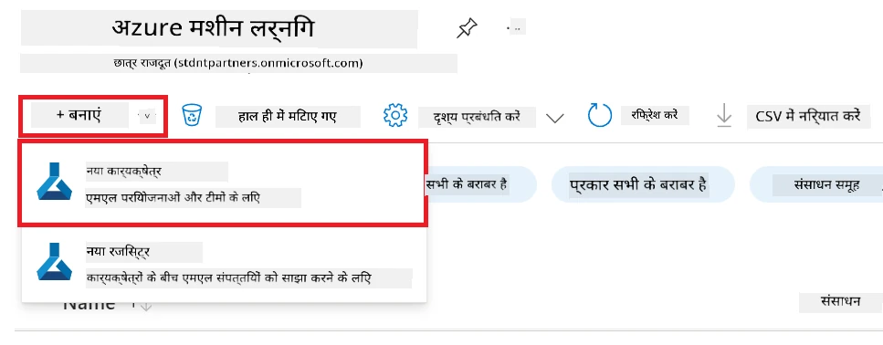

4. निम्नलिखित कार्य करें:

    - अपनी Azure **सब्सक्रिप्शन** चुनें।
    - उपयोग के लिए **Resource group** चुनें (आवश्यक होने पर नया बनाएं)।
    - **Workspace Name** दर्ज करें। यह एक अद्वितीय मान होना चाहिए।
    - वह **Region** चुनें जिसका आप उपयोग करना चाहते हैं।
    - उपयोग के लिए **Storage account** चुनें (आवश्यक होने पर नया बनाएं)।
    - उपयोग के लिए **Key vault** चुनें (आवश्यक होने पर नया बनाएं)।
    - उपयोग के लिए **Application insights** चुनें (आवश्यक होने पर नया बनाएं)।
    - उपयोग के लिए **Container registry** चुनें (आवश्यक होने पर नया बनाएं)।

    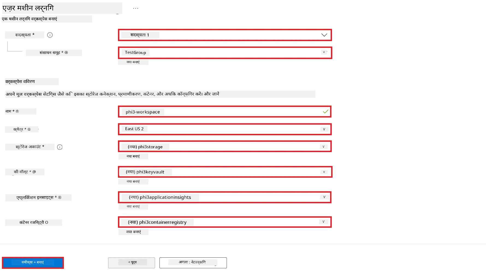

5. **Review + Create** चुनें।

6. **Create** चुनें।

### Azure सब्सक्रिप्शन में GPU कोटा का अनुरोध करें

इस ट्यूटोरियल में, आप Phi-3 मॉडल को फाइन-ट्यून और तैनात करना सीखेंगे, GPU का उपयोग करते हुए। फाइन-ट्यूनिंग के लिए, आप *Standard_NC24ads_A100_v4* GPU का उपयोग करेंगे, जिसके लिए कोटा अनुरोध आवश्यक है। तैनाती के लिए, आप *Standard_NC6s_v3* GPU का उपयोग करेंगे, जिसके लिए भी कोटा अनुरोध आवश्यक है।

> [!NOTE]
>
> केवल Pay-As-You-Go सब्सक्रिप्शन (मानक सब्सक्रिप्शन प्रकार) GPU आवंटन के लिए पात्र हैं; लाभ सब्सक्रिप्शन वर्तमान में समर्थित नहीं हैं।
>

1. [Azure ML Studio](https://ml.azure.com/home?wt.mc_id=studentamb_279723) पर जाएं।

1. *Standard NCADSA100v4 Family* कोटा का अनुरोध करने के लिए निम्न करें:

    - बाएँ पैनल से **Quota** चुनें।
    - उपयोग के लिए **Virtual machine family** चुनें। उदाहरण के लिए, **Standard NCADSA100v4 Family Cluster Dedicated vCPUs** चुनें, जिसमें *Standard_NC24ads_A100_v4* GPU शामिल है।
    - नेविगेशन मेनू से **Request quota** चुनें।

        

    - Request quota पेज पर, उपयोग के लिए **New cores limit** दर्ज करें। उदाहरण के लिए, 24।
    - Request quota पेज पर, GPU कोटा का अनुरोध करने के लिए **Submit** चुनें।

1. *Standard NCSv3 Family* कोटा का अनुरोध करने के लिए निम्न करें:

    - बाएँ पैनल से **Quota** चुनें।
    - उपयोग के लिए **Virtual machine family** चुनें। उदाहरण के लिए, **Standard NCSv3 Family Cluster Dedicated vCPUs** चुनें, जिसमें *Standard_NC6s_v3* GPU शामिल है।
    - नेविगेशन मेनू से **Request quota** चुनें।
    - Request quota पेज पर, उपयोग के लिए **New cores limit** दर्ज करें। उदाहरण के लिए, 24।
    - Request quota पेज पर, GPU कोटा का अनुरोध करने के लिए **Submit** चुनें।

### रोल असाइनमेंट जोड़ें

अपने मॉडलों को फाइन-ट्यून और तैनात करने के लिए, आपको पहले एक User Assigned Managed Identity (UAI) बनानी होगी और इसे उपयुक्त अनुमतियां प्रदान करनी होंगी। तैनाती के दौरान प्रमाणीकरण के लिए यह UAI उपयोग की जाएगी।

#### User Assigned Managed Identity (UAI) बनाएँ

1. पोर्टल पेज के शीर्ष पर **सर्च बार** में *managed identities* टाइप करें और दिखाए गए विकल्पों में से **Managed Identities** चुनें।

    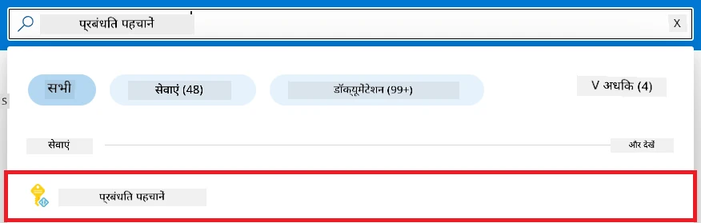

1. **+ Create** चुनें।

    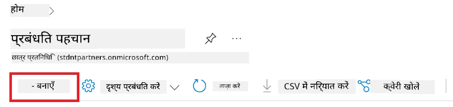

1. निम्नलिखित कार्य करें:

    - अपनी Azure **सब्सक्रिप्शन** चुनें।
    - उपयोग के लिए **Resource group** चुनें (आवश्यक होने पर नया बनाएं)।
    - वह **Region** चुनें जिसका आप उपयोग करना चाहते हैं।
    - **Name** दर्ज करें। यह एक अद्वितीय मान होना चाहिए।

    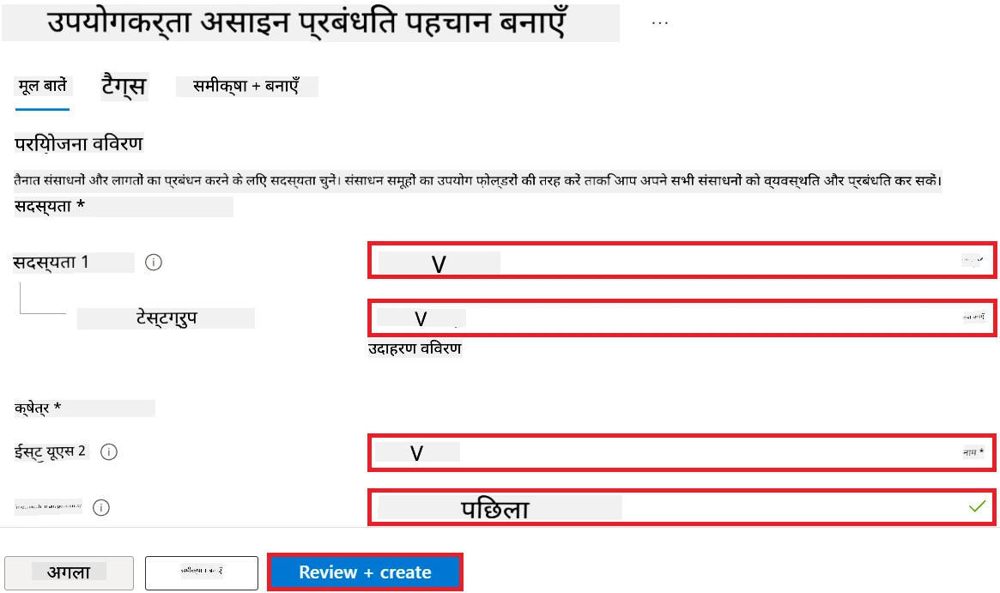

1. **Review + create** चुनें।

1. **+ Create** चुनें।

#### Managed Identity को Contributor रोल असाइनमेंट जोड़ें

1. उस Managed Identity रिसोर्स पर नेविगेट करें जिसे आपने बनाया है।

1. बाएँ पैनल से **Azure role assignments** चुनें।

1. नेविगेशन मेनू से **+Add role assignment** चुनें।

1. Add role assignment पेज में, निम्न करें:
    - **Scope** के रूप में **Resource group** चुनें।
    - अपनी Azure **सब्सक्रिप्शन** चुनें।
    - उपयोग के लिए **Resource group** चुनें।
    - **Role** के रूप में **Contributor** चुनें।

    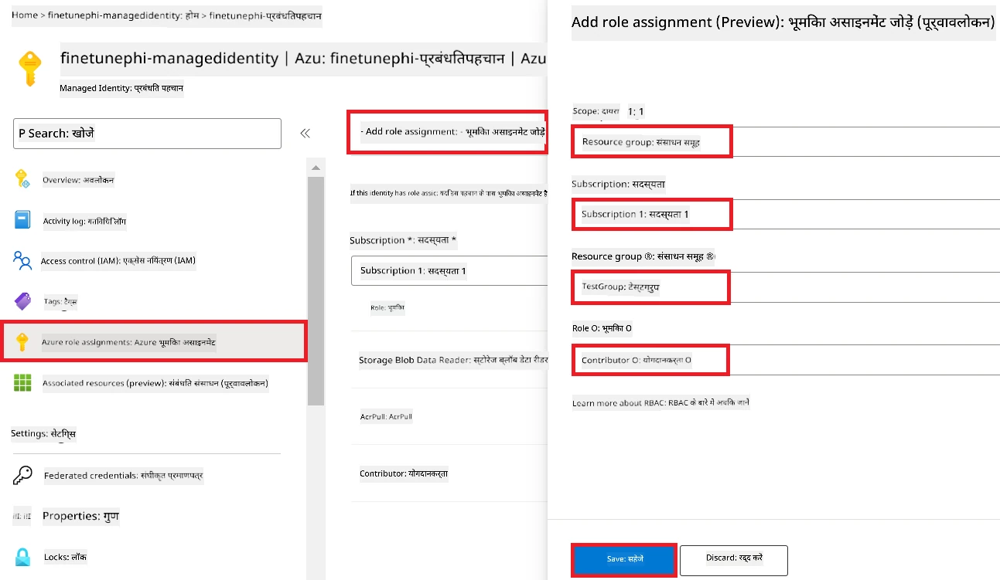

2. **Save** चुनें।

#### Managed Identity को Storage Blob Data Reader रोल असाइनमेंट जोड़ें

1. पोर्टल पेज के शीर्ष पर **सर्च बार** में *storage accounts* टाइप करें और दिखाए गए विकल्पों में से **Storage accounts** चुनें।

    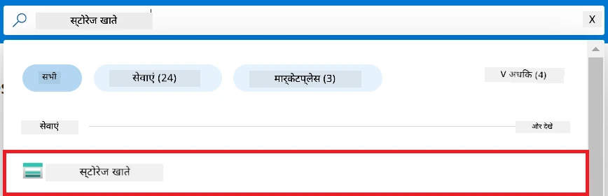

1. उस Storage account को चुनें जो Azure Machine Learning वर्कस्पेस से जुड़ा है जिसे आपने बनाया है। उदाहरण के लिए, *finetunephistorage*।

1. Add role assignment पेज पर नेविगेट करने के लिए निम्न करें:

    - उस Azure Storage account पर नेविगेट करें जिसे आपने बनाया है।
    - बाएँ पैनल से **Access Control (IAM)** चुनें।
    - नेविगेशन मेनू से **+ Add** चुनें।
    - नेविगेशन मेनू से **Add role assignment** चुनें।

    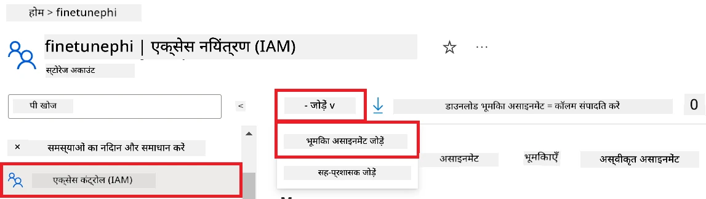

1. Add role assignment पेज में, निम्नलिखित करें:

    - Role पेज में, **सर्च बार** में *Storage Blob Data Reader* टाइप करें और दिखाई देने वाले विकल्पों में से **Storage Blob Data Reader** चुनें।
    - Role पेज में, **Next** चुनें।
    - Members पेज में, **Assign access to** के लिए **Managed identity** चुनें।
    - Members पेज में, **+ Select members** चुनें।
    - Select managed identities पेज में, अपनी Azure **सब्सक्रिप्शन** चुनें।
    - Select managed identities पेज में, **Managed identity** के लिए **Manage Identity** चुनें।
    - Select managed identities पेज में, वह Manage Identity चुनें जिसे आपने बनाया है। उदाहरण के लिए, *finetunephi-managedidentity*।
    - Select managed identities पेज में, **Select** चुनें।

    

1. **Review + assign** चुनें।

#### Managed Identity को AcrPull रोल असाइनमेंट जोड़ें

1. पोर्टल पेज के शीर्ष पर **सर्च बार** में *container registries* टाइप करें और दिखाए गए विकल्पों में से **Container registries** चुनें।

    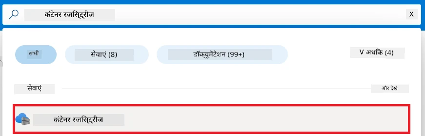

1. उस Container registry को चुनें जो Azure Machine Learning वर्कस्पेस से जुड़ा है। उदाहरण के लिए, *finetunephicontainerregistry*

1. Add role assignment पेज पर नेविगेट करने के लिए निम्न करें:

    - बाएँ पैनल से **Access Control (IAM)** चुनें।
    - नेविगेशन मेनू से **+ Add** चुनें।
    - नेविगेशन मेनू से **Add role assignment** चुनें।

1. Add role assignment पेज में, निम्नलिखित करें:

    - Role पेज में, **सर्च बार** में *AcrPull* टाइप करें और दिखाई देने वाले विकल्पों में से **AcrPull** चुनें।
    - Role पेज में, **Next** चुनें।
    - Members पेज में, **Assign access to** के लिए **Managed identity** चुनें।
    - Members पेज में, **+ Select members** चुनें।
    - Select managed identities पेज में, अपनी Azure **सब्सक्रिप्शन** चुनें।
    - Select managed identities पेज में, **Managed identity** के लिए **Manage Identity** चुनें।
    - Select managed identities पेज में, वह Managed Identity चुनें जिसे आपने बनाया है। उदाहरण के लिए, *finetunephi-managedidentity*।
    - Select managed identities पेज में, **Select** चुनें।
    - **Review + assign** चुनें।

### प्रोजेक्ट सेट अप करें

फाइन-ट्यूनिंग के लिए आवश्यक डेटासेट डाउनलोड करने के लिए, आप एक लोकल वातावरण सेट करेंगे।

इस अभ्यास में, आप

- एक फोल्डर बनाएंगे जिसमें आप काम करेंगे।
- एक वर्चुअल एनवायरनमेंट बनाएंगे।
- आवश्यक पैकेज इंस्टॉल करेंगे।
- डेटासेट डाउनलोड करने के लिए *download_dataset.py* फाइल बनाएंगे।

#### काम करने के लिए एक फोल्डर बनाएँ

1. टर्मिनल विंडो खोलें और निम्न कमांड टाइप करके डिफ़ॉल्ट पथ में *finetune-phi* नाम का फोल्डर बनाएँ।

    ```console
    mkdir finetune-phi
    ```

2. अपने टर्मिनल के अंदर निम्न कमांड टाइप करें ताकि आप उस *finetune-phi* फोल्डर में जा सकें जिसे आपने बनाया था।

    ```console
    cd finetune-phi
    ```

#### एक वर्चुअल एनवायरनमेंट बनाएं

1. अपने टर्मिनल के अंदर निम्न कमांड टाइप करें ताकि एक वर्चुअल एनवायरनमेंट *.venv* के नाम से बनाया जा सके।

    ```console
    python -m venv .venv
    ```

2. अपने टर्मिनल के अंदर निम्न कमांड टाइप करें ताकि वर्चुअल एनवायरनमेंट को सक्रिय किया जा सके।

    ```console
    .venv\Scripts\activate.bat
    ```

> [!NOTE]
> यदि यह सफल हुआ, तो आपको कमांड प्रॉम्प्ट से पहले *(.venv)* दिखाई देगा।

#### आवश्यक पैकेज इंस्टॉल करें

1. अपने टर्मिनल के अंदर निम्न कमांड टाइप करें ताकि आवश्यक पैकेज इंस्टॉल किए जा सकें।

    ```console
    pip install datasets==2.19.1
    ```

#### `download_dataset.py` बनाएँ

> [!NOTE]
> पूरा फोल्डर संरचना:
>
> ```text
> └── YourUserName
> .    └── finetune-phi
> .        └── download_dataset.py
> ```

1. **Visual Studio Code** खोलें।

1. मेनू बार से **File** चुनें।

1. **Open Folder** चुनें।

1. उस *finetune-phi* फोल्डर को चुनें जिसे आपने बनाया है, जो *C:\Users\yourUserName\finetune-phi* स्थित है।

    

1. Visual Studio Code के बाएं पैनल में, राइट-क्लिक करें और **New File** चुनें ताकि *download_dataset.py* नाम की एक नई फाइल बनाई जा सके।

    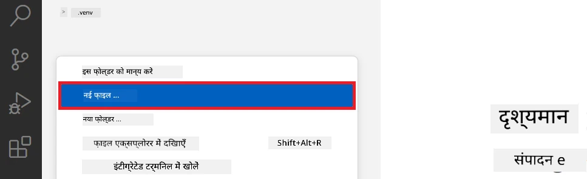

### फाइन-ट्यूनिंग के लिए डेटासेट तैयार करें

इस अभ्यास में, आप *download_dataset.py* फाइल चलाएंगे ताकि *ultrachat_200k* डेटासेट को अपने लोकल वातावरण में डाउनलोड किया जा सके। फिर आप इस डेटासेट का उपयोग Azure Machine Learning में Phi-3 मॉडल को फाइन-ट्यून करने के लिए करेंगे।

इस अभ्यास में, आप:

- *download_dataset.py* फाइल में कोड जोड़ेंगे ताकि डेटासेट डाउनलोड हो सकें।
- *download_dataset.py* फाइल को चलाकर डेटासेट को अपने लोकल वातावरण में डाउनलोड करेंगे।

#### *download_dataset.py* का उपयोग करके अपना डेटासेट डाउनलोड करें

1. Visual Studio Code में *download_dataset.py* फाइल खोलें।

1. *download_dataset.py* फाइल में निम्न कोड जोड़ें।

    ```python
    import json
    import os
    from datasets import load_dataset

    def load_and_split_dataset(dataset_name, config_name, split_ratio):
        """
        Load and split a dataset.
        """
        # निर्दिष्ट नाम, कॉन्फ़िगरेशन, और विभाजन अनुपात के साथ डेटासेट लोड करें
        dataset = load_dataset(dataset_name, config_name, split=split_ratio)
        print(f"Original dataset size: {len(dataset)}")
        
        # डेटासेट को ट्रेन और टेस्ट सेट में विभाजित करें (80% ट्रेन, 20% टेस्ट)
        split_dataset = dataset.train_test_split(test_size=0.2)
        print(f"Train dataset size: {len(split_dataset['train'])}")
        print(f"Test dataset size: {len(split_dataset['test'])}")
        
        return split_dataset

    def save_dataset_to_jsonl(dataset, filepath):
        """
        Save a dataset to a JSONL file.
        """
        # यदि निर्देशिका मौजूद नहीं है तो उसे बनाएं
        os.makedirs(os.path.dirname(filepath), exist_ok=True)
        
        # लिखने के मोड में फ़ाइल खोलें
        with open(filepath, 'w', encoding='utf-8') as f:
            # डेटासेट के प्रत्येक रिकॉर्ड पर पुनरावृत्ति करें
            for record in dataset:
                # रिकॉर्ड को JSON ऑब्जेक्ट के रूप में डंप करें और इसे फ़ाइल में लिखें
                json.dump(record, f)
                # रिकॉर्ड्स को अलग करने के लिए एक नया लाइन कैरेक्टर लिखें
                f.write('\n')
        
        print(f"Dataset saved to {filepath}")

    def main():
        """
        Main function to load, split, and save the dataset.
        """
        # ULTRACHAT_200k डेटासेट को एक विशेष कॉन्फ़िगरेशन और विभाजन अनुपात के साथ लोड और विभाजित करें
        dataset = load_and_split_dataset("HuggingFaceH4/ultrachat_200k", 'default', 'train_sft[:1%]')
        
        # विभाजन से ट्रेन और टेस्ट डेटासेट निकालें
        train_dataset = dataset['train']
        test_dataset = dataset['test']

        # ट्रेन डेटासेट को एक JSONL फ़ाइल में सहेजें
        save_dataset_to_jsonl(train_dataset, "data/train_data.jsonl")
        
        # टेस्ट डेटासेट को एक अलग JSONL फ़ाइल में सहेजें
        save_dataset_to_jsonl(test_dataset, "data/test_data.jsonl")

    if __name__ == "__main__":
        main()

    ```

1. अपने टर्मिनल के अंदर निम्न कमांड टाइप करें ताकि स्क्रिप्ट चलायी जा सके और डेटासेट को अपने लोकल वातावरण में डाउनलोड किया जा सके।

    ```console
    python download_dataset.py
    ```

1. जांचें कि डेटासेट सफलतापूर्वक आपके लोकल *finetune-phi/data* डायरेक्टरी में सेव हो गया है।

> [!NOTE]
>
> #### डेटासेट आकार और फाइन-ट्यूनिंग समय पर नोट
>
> इस ट्यूटोरियल में, आप केवल डेटासेट का 1% (`split='train[:1%]'`) इस्तेमाल करते हैं। इससे डेटा की मात्रा काफी कम हो जाती है, जिससे अपलोड और फाइन-ट्यूनिंग दोनों प्रक्रिया तेज हो जाती हैं। आप प्रतिशत घटाकर या बढ़ाकर प्रशिक्षण समय और मॉडल प्रदर्शन के बीच सही संतुलन पा सकते हैं। डेटासेट के छोटे उपसमूह का उपयोग करने से फाइन-ट्यूनिंग में लगे समय में कमी आती है, जिससे यह ट्यूटोरियल के लिए अधिक प्रबंधनीय हो जाता है।

## परिदृश्य 2: Phi-3 मॉडल को फाइन-ट्यून करें और Azure Machine Learning Studio में डिप्लॉय करें

### Phi-3 मॉडल को फाइन-ट्यून करें

इस अभ्यास में, आप Azure Machine Learning Studio में Phi-3 मॉडल को फाइन-ट्यून करेंगे।

इस अभ्यास में, आप:

- फाइन-ट्यूनिंग के लिए कंप्यूटर क्लस्टर बनाएंगे।
- Azure Machine Learning Studio में Phi-3 मॉडल को फाइन-ट्यून करेंगे।

#### फाइन-ट्यूनिंग के लिए कंप्यूटर क्लस्टर बनाएं

1. [Azure ML Studio](https://ml.azure.com/home?wt.mc_id=studentamb_279723) पर जाएँ।

1. बाएँ साइड टैब से **Compute** चुनें।

1. नेविगेशन मेनू से **Compute clusters** चुनें।

1. **+ New** चुनें।

    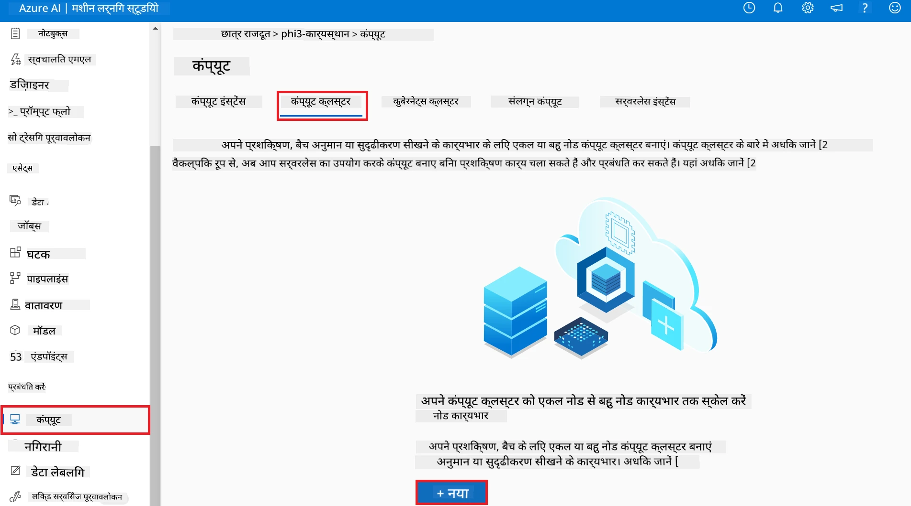

1. निम्नलिखित कार्य करें:

    - वह **Region** चुनें जिसे आप उपयोग करना चाहते हैं।
    - **Virtual machine tier** को **Dedicated** पर सेट करें।
    - **Virtual machine type** को **GPU** पर सेट करें।
    - **Virtual machine size** फिल्टर को **Select from all options** पर सेट करें।
    - **Virtual machine size** को **Standard_NC24ads_A100_v4** चुनें।

    

1. **Next** चुनें।

1. निम्नलिखित कार्य करें:

    - **Compute name** दर्ज करें। यह एक अद्वितीय मान होना चाहिए।
    - **Minimum number of nodes** को **0** पर सेट करें।
    - **Maximum number of nodes** को **1** पर सेट करें।
    - **Idle seconds before scale down** को **120** पर सेट करें।

    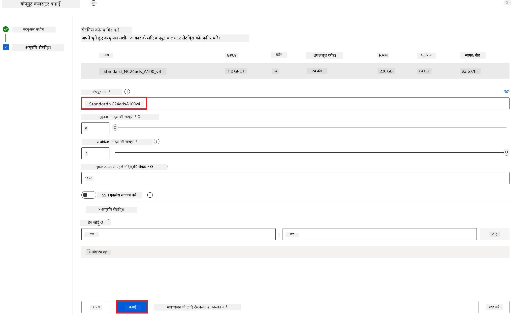

1. **Create** चुनें।

#### Phi-3 मॉडल को फाइन-ट्यून करें

1. [Azure ML Studio](https://ml.azure.com/home?wt.mc_id=studentamb_279723) पर जाएँ।

1. वह Azure Machine Learning वर्कस्पेस चुनें जिसे आपने बनाया है।

    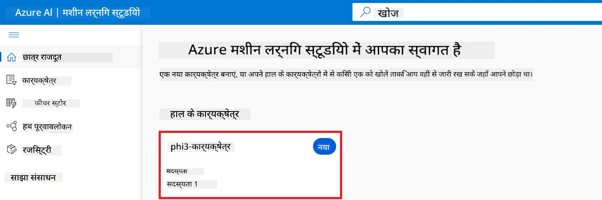

1. निम्नलिखित कार्य करें:

    - बाएँ साइड टैब से **Model catalog** चुनें।
    - **search bar** में *phi-3-mini-4k* टाइप करें और दिखाई देने वाले विकल्पों में से **Phi-3-mini-4k-instruct** चुनें।

    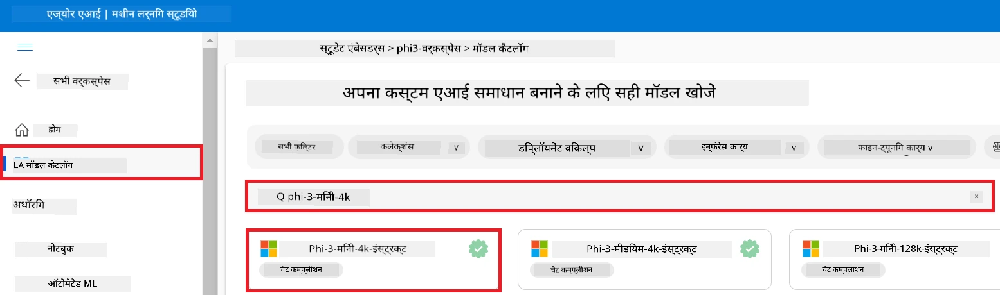

1. नेविगेशन मेनू से **Fine-tune** चुनें।

    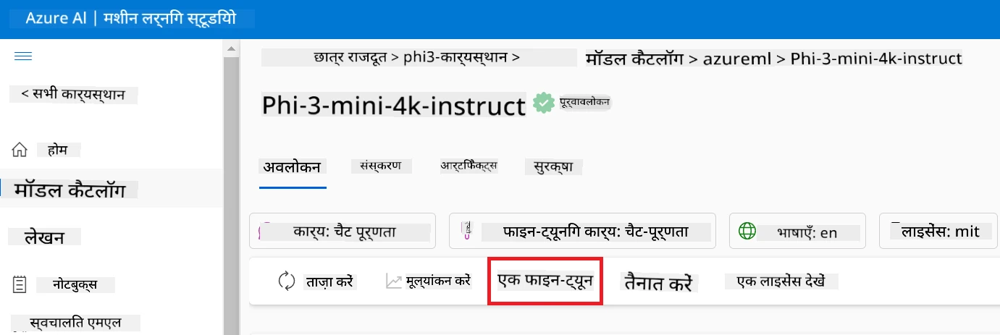

1. निम्नलिखित कार्य करें:

    - **Select task type** को **Chat completion** पर सेट करें।
    - **+ Select data** पर क्लिक करें और **Training data** अपलोड करें।
    - वैलिडेशन डेटा अपलोड प्रकार को **Provide different validation data** पर सेट करें।
    - **+ Select data** पर क्लिक करें और **Validation data** अपलोड करें।

    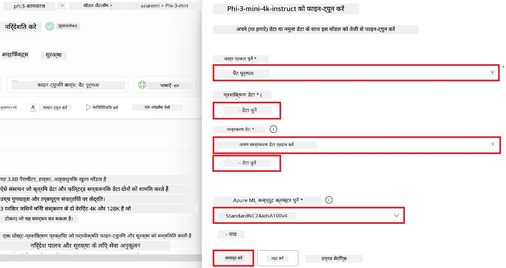

> [!TIP]
>
> आप **Advanced settings** चुनकर कॉन्फ़िगरेशन जैसे **learning_rate** और **lr_scheduler_type** कस्टमाइज़ कर सकते हैं ताकि फाइन-ट्यूनिंग प्रक्रिया आपके खास आवश्यकताओं के अनुसार बेहतर हो सके।

1. **Finish** चुनें।

1. इस अभ्यास में, आपने सफलतापूर्वक Azure Machine Learning का उपयोग करके Phi-3 मॉडल को फाइन-ट्यून किया है। कृपया ध्यान दें कि फाइन-ट्यूनिंग प्रक्रिया में काफी समय लग सकता है। फाइन-ट्यूनिंग जॉब चलाने के बाद, आपको इसके पूर्ण होने तक प्रतीक्षा करनी होगी। आप Azure Machine Learning Workspace में बाएँ साइड के Jobs टैब पर जाकर फाइन-ट्यूनिंग जॉब की स्थिति देख सकते हैं। अगले सेरीज में, आप फाइन-ट्यून किए गए मॉडल को डिप्लॉय करेंगे और इसे Prompt flow के साथ इंटीग्रेट करेंगे।

    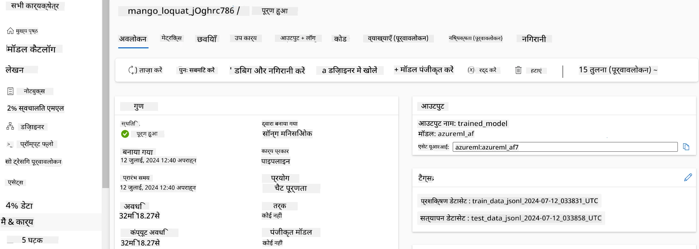

### फाइन-ट्यून किए गए Phi-3 मॉडल को डिप्लॉय करें

फाइन-ट्यून किए गए Phi-3 मॉडल को Prompt flow के साथ इंटीग्रेट करने के लिए, आपको मॉडल को डिप्लॉय करना होगा ताकि यह रियल-टाइम इंफरेंस के लिए उपलब्ध हो सके। इस प्रक्रिया में मॉडल का रजिस्ट्रेशन, ऑनलाइन एंडपॉइंट बनाना और मॉडल को डिप्लॉय करना शामिल है।

इस अभ्यास में, आप:

- Azure Machine Learning वर्कस्पेस में फाइन-ट्यून किए गए मॉडल को रजिस्टर करेंगे।
- एक ऑनलाइन एंडपॉइंट बनाएंगे।
- रजिस्टर किए गए फाइन-ट्यून मॉडल को डिप्लॉय करेंगे।

#### फाइन-ट्यून मॉडल को रजिस्टर करें

1. [Azure ML Studio](https://ml.azure.com/home?wt.mc_id=studentamb_279723) पर जाएँ।

1. वह Azure Machine Learning वर्कस्पेस चुनें जिसे आपने बनाया है।

    

1. बाएँ साइड टैब से **Models** चुनें।
1. **+ Register** चुनें।
1. **From a job output** चुनें।

    

1. उस जॉब को चुनें जिसे आपने बनाया है।

    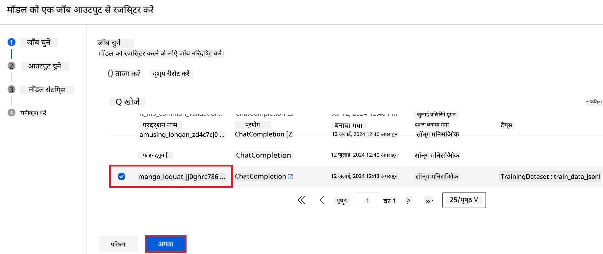

1. **Next** चुनें।

1. **Model type** को **MLflow** चुनें।

1. सुनिश्चित करें कि **Job output** चुना हुआ हो; यह स्वचालित रूप से चुना जाना चाहिए।

    

2. **Next** चुनें।

3. **Register** चुनें।

    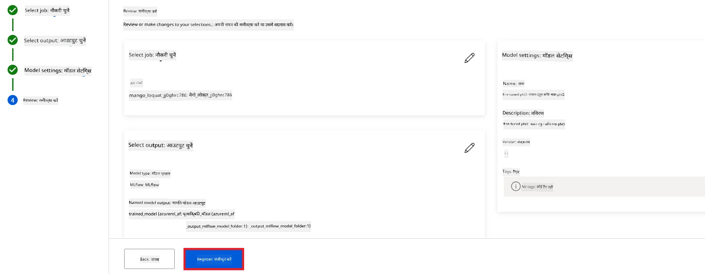

4. आप अपने रजिस्टर किए हुए मॉडल को बाएं साइड के **Models** मेनू में जाकर देख सकते हैं।

    

#### फाइन-ट्यून मॉडल को डिप्लॉय करें

1. उस Azure Machine Learning वर्कस्पेस पर जाएँ जिसे आपने बनाया है।

1. बाएं साइड टैब से **Endpoints** चुनें।

1. नेविगेशन मेनू से **Real-time endpoints** चुनें।

    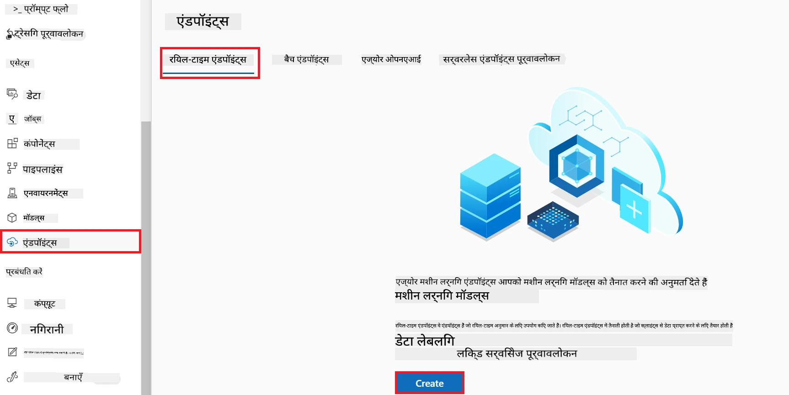

1. **Create** चुनें।

1. उस रजिस्टर किए गए मॉडल को चुनें जिसे आपने बनाया है।

    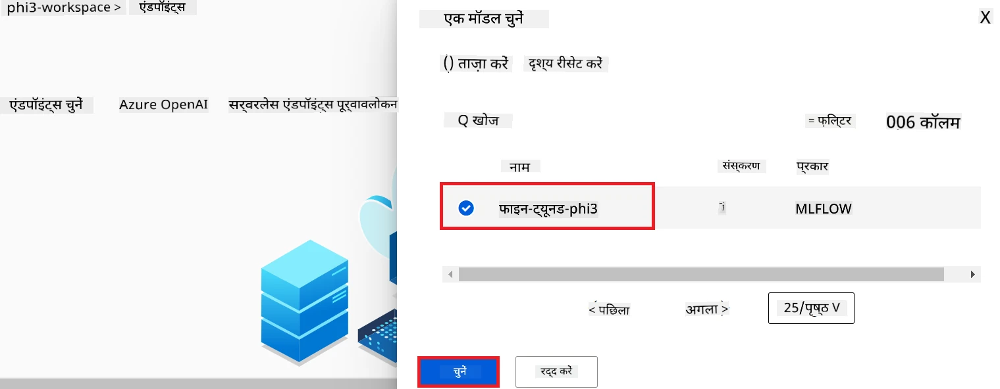

1. **Select** चुनें।

1. निम्नलिखित कार्य करें:

    - **Virtual machine** को *Standard_NC6s_v3* चुनें।
    - जिस **Instance count** का आप उपयोग करना चाहते हैं उसे चुनें। उदाहरण के लिए, *1*।
    - **Endpoint** को **New** चुनें ताकि एक नया एंडपॉइंट बनाया जा सके।
    - **Endpoint name** दर्ज करें। यह एक अद्वितीय मान होना चाहिए।
    - **Deployment name** दर्ज करें। यह एक अद्वितीय मान होना चाहिए।

    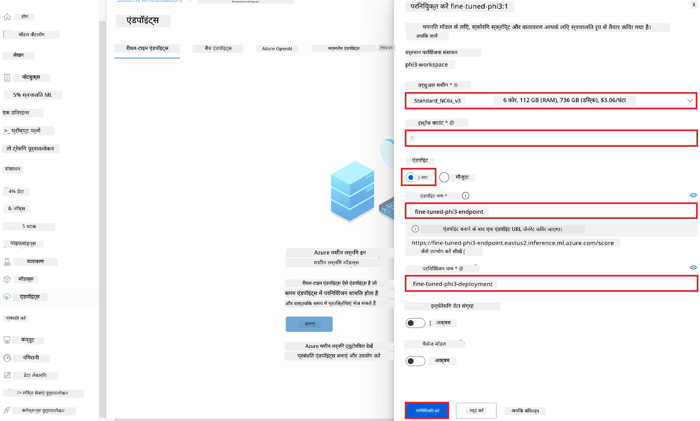

1. **Deploy** चुनें।

> [!WARNING]
> आपके खाते पर अतिरिक्त शुल्क से बचने के लिए, कृपया Azure Machine Learning वर्कस्पेस में बनाए गए एंडपॉइंट को हटा दें।
>

#### Azure Machine Learning Workspace में डिप्लॉयमेंट स्थिति जांचें

1. उस Azure Machine Learning वर्कस्पेस पर जाएँ जिसे आपने बनाया है।

1. बाएँ साइड टैब से **Endpoints** चुनें।

1. उस एंडपॉइंट को चुनें जिसे आपने बनाया है।

    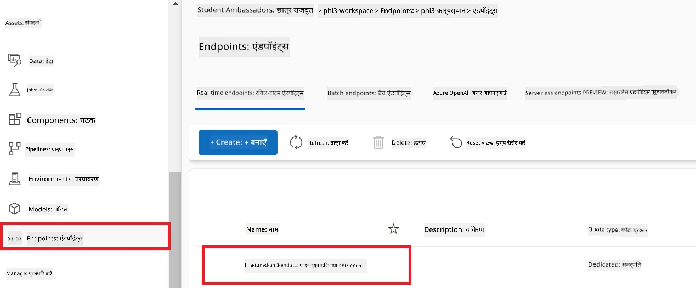

1. इस पेज पर, आप डिप्लॉयमेंट प्रक्रिया के दौरान एंडपॉइंट्स को प्रबंधित कर सकते हैं।

> [!NOTE]
> एक बार डिप्लॉयमेंट पूरा हो जाने पर, सुनिश्चित करें कि **Live traffic** को **100%** पर सेट किया गया है। यदि नहीं है, तो ट्रैफिक सेटिंग्स को समायोजित करने के लिए **Update traffic** चुनें। ध्यान दें कि यदि ट्रैफिक 0% पर सेट है, तो आप मॉडल का परीक्षण नहीं कर सकते।
>
> 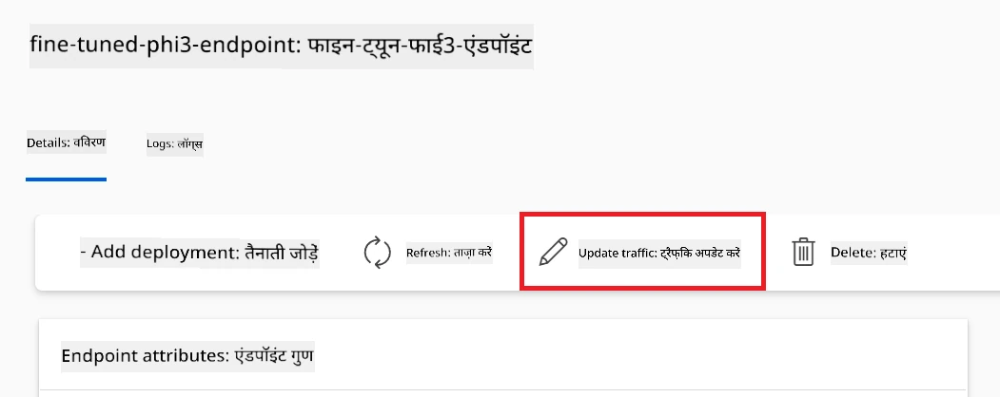
>

## परिदृश्य 3: Prompt flow के साथ इंटीग्रेट करें और Azure AI Foundry में अपने कस्टम मॉडल से चैट करें

### कस्टम Phi-3 मॉडल को Prompt flow के साथ इंटीग्रेट करें

अपना फाइन-ट्यून किया हुआ मॉडल सफलतापूर्वक डिप्लॉय करने के बाद, आप अब इसे Prompt Flow के साथ इंटीग्रेट कर सकते हैं ताकि आप अपने मॉडल का इस्तेमाल रियल-टाइम एप्लिकेशन में कर सकें, जिससे आपके कस्टम Phi-3 मॉडल के साथ कई इंटरैक्टिव कार्य संभव हो सकें।

इस अभ्यास में, आप:

- Azure AI Foundry हब बनाएंगे।
- Azure AI Foundry प्रोजेक्ट बनाएंगे।
- Prompt flow बनाएंगे।
- फाइन-ट्यून किए गए Phi-3 मॉडल के लिए एक कस्टम कनेक्शन जोड़ेंगे।
- अपने कस्टम Phi-3 मॉडल के साथ चैट करने के लिए Prompt flow सेट अप करेंगे।

> [!NOTE]
> आप Azure ML Studio का उपयोग करके भी Promptflow के साथ इंटीग्रेट कर सकते हैं। समान इंटीग्रेशन प्रक्रिया Azure ML Studio पर भी लागू की जा सकती है।

#### Azure AI Foundry हब बनाएँ

प्रोजेक्ट बनाने से पहले आपको एक हब बनाना होगा। हब एक Resource Group की तरह काम करता है, जो आपको Azure AI Foundry में कई प्रोजेक्ट्स को व्यवस्थित और प्रबंधित करने की अनुमति देता है।

1. [Azure AI Foundry](https://ai.azure.com/?WT.mc_id=aiml-137032-kinfeylo) पर जाएँ।

1. बाएँ साइड टैब से **All hubs** चुनें।

1. नेविगेशन मेनू से **+ New hub** चुनें।
    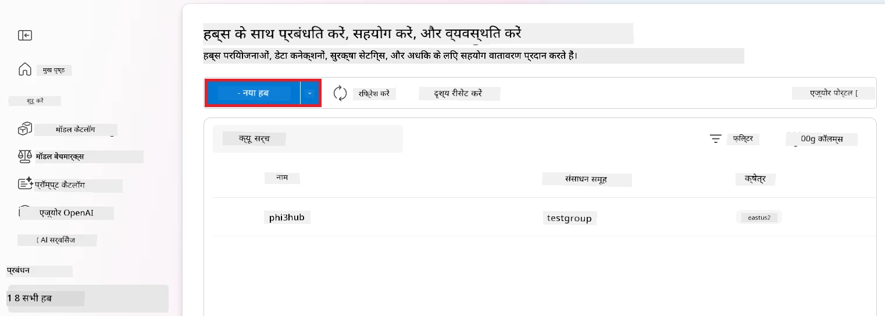

1. निम्नलिखित कार्य करें:

    - **हब नाम** दर्ज करें। यह एक अनूठा मान होना चाहिए।
    - अपनी Azure **सब्सक्रिप्शन** का चयन करें।
    - उपयोग करने के लिए **रिसोर्स समूह** चुनें (यदि आवश्यक हो तो नया बनाएं)।
    - उपयोग करने के लिए **स्थान** चुनें।
    - उपयोग करने के लिए **Azure AI सेवाओं से कनेक्ट करें** चुनें (यदि आवश्यक हो तो नया बनाएं)।
    - **Azure AI खोज से कनेक्ट करें** को **कनेक्ट करना छोड़ें** पर चुनें।

    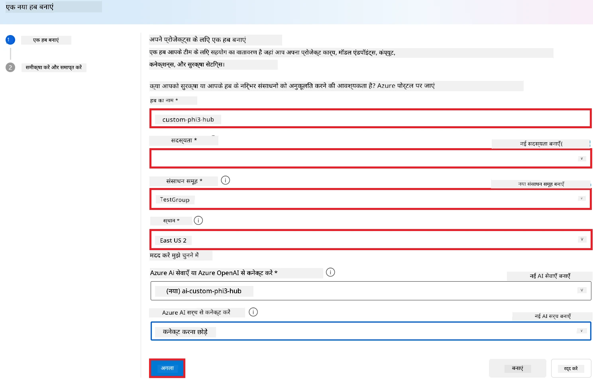

1. **अगला** चुनें।

#### Azure AI Foundry परियोजना बनाएं

1. आपने जो हब बनाया है, उसमें बाएँ तरफ़ के टैब से **सभी परियोजनाएं** चुनें।

1. नेविगेशन मेनू से **+ नई परियोजना** चुनें।

    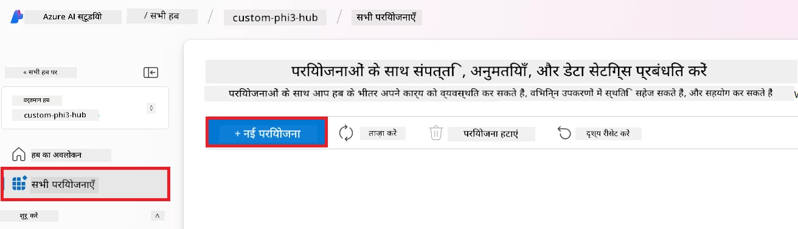

1. **परियोजना नाम** दर्ज करें। यह एक अनूठा मान होना चाहिए।

    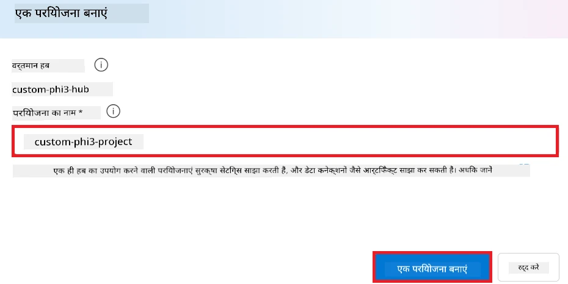

1. **परियोजना बनाएं** चुनें।

#### फ़ाइन-ट्यून किए गए Phi-3 मॉडल के लिए एक कस्टम कनेक्शन जोड़ें

अपने कस्टम Phi-3 मॉडल को Prompt flow के साथ एकीकृत करने के लिए, आपको मॉडल के एंडपॉइंट और कुंजी को एक कस्टम कनेक्शन में सहेजना होगा। यह सेटअप Prompt flow में आपके कस्टम Phi-3 मॉडल तक पहुंच सुनिश्चित करता है।

#### फ़ाइन-ट्यून किए गए Phi-3 मॉडल की API कुंजी और एंडपॉइंट URI सेट करें

1. [Azure ML Studio](https://ml.azure.com/home?WT.mc_id=aiml-137032-kinfeylo) पर जाएं।

1. उस Azure मशीन लर्निंग कार्यक्षेत्र पर जाएं जिसे आपने बनाया है।

1. बाएँ तरफ के टैब से **एंडपॉइंट्स** चुनें।

    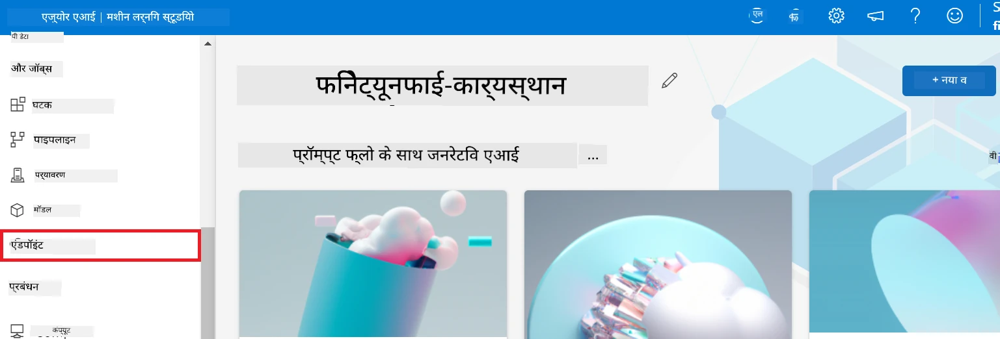

1. उस एंडपॉइंट का चयन करें जिसे आपने बनाया है।

    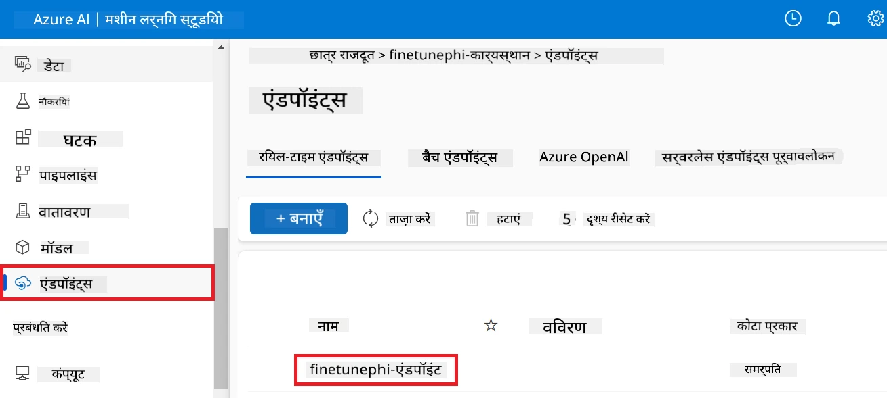

1. नेविगेशन मेनू से **उपयोग करें** चुनें।

1. अपनी **REST एंडपॉइंट** और **प्राथमिक कुंजी** कॉपी करें।

    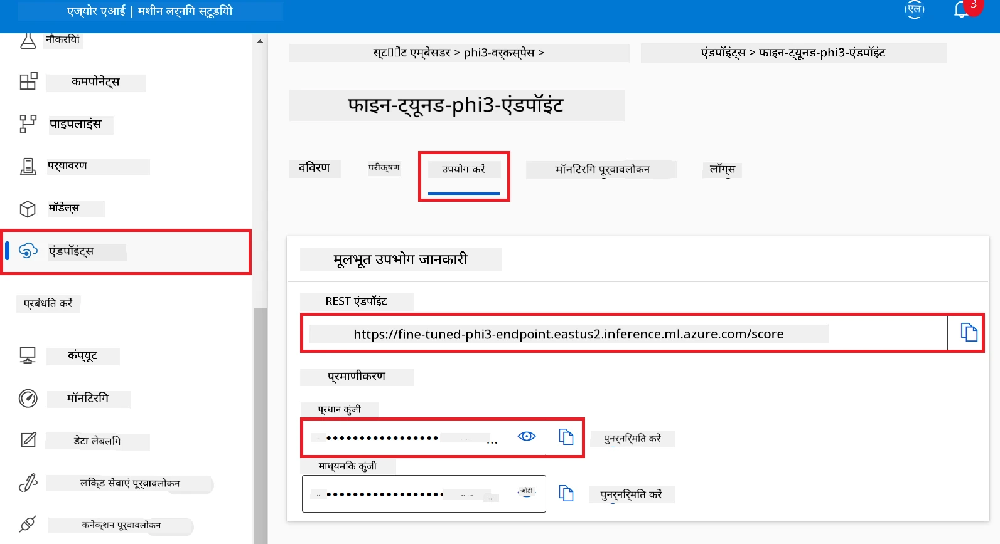

#### कस्टम कनेक्शन जोड़ें

1. [Azure AI Foundry](https://ai.azure.com/?WT.mc_id=aiml-137032-kinfeylo) पर जाएं।

1. Azure AI Foundry परियोजना पर जाएं जिसे आपने बनाया है।

1. उस परियोजना में बाएँ तरफ के टैब से **सेटिंग्स** चुनें।

1. **+ नया कनेक्शन** चुनें।

    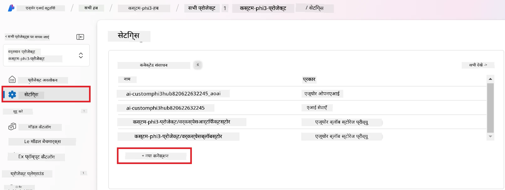

1. नेविगेशन मेनू से **कस्टम कुंजी** चुनें।

    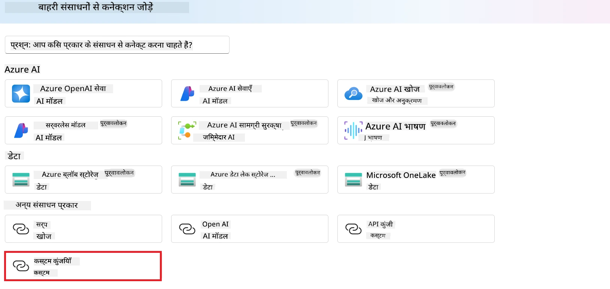

1. निम्नलिखित कार्य करें:

    - **+ कुंजी मूल्य जोड़ें** चुनें।
    - कुंजी नाम के लिए **endpoint** दर्ज करें और Azure ML Studio से कॉपी किया गया एंडपॉइंट मान क्षेत्र में चिपकाएं।
    - फिर से **+ कुंजी मूल्य जोड़ें** चुनें।
    - कुंजी नाम के लिए **key** दर्ज करें और Azure ML Studio से कॉपी किया गया कुंजी मान क्षेत्र में चिपकाएं।
    - कुंजियाँ जोड़ने के बाद, कुंजी के उजागर होने से रोकने के लिए **is secret** चुनें।

    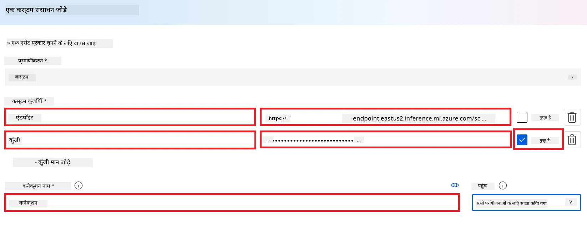

1. **कनेक्शन जोड़ें** चुनें।

#### Prompt flow बनाएं

आपने Azure AI Foundry में एक कस्टम कनेक्शन जोड़ा है। अब, निम्नलिखित चरणों का उपयोग करके एक Prompt flow बनाएं। फिर, आप इस Prompt flow को कस्टम कनेक्शन से कनेक्ट करेंगे ताकि आप फ़ाइन-ट्यून मॉडल को Prompt flow के अंदर उपयोग कर सकें।

1. Azure AI Foundry परियोजना पर जाएं जिसे आपने बनाया है।

1. बाएँ तरफ के टैब से **Prompt flow** चुनें।

1. नेविगेशन मेनू से **+ बनाएं** चुनें।

    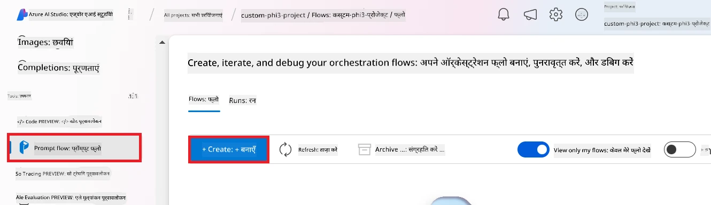

1. नेविगेशन मेनू से **चैट फ्लो** चुनें।

    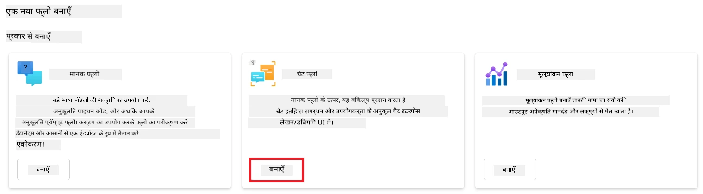

1. उपयोग करने के लिए **फ़ोल्डर नाम** दर्ज करें।

    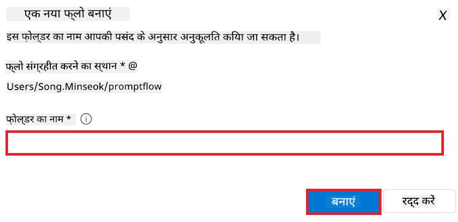

2. **बनाएं** चुनें।

#### अपने कस्टम Phi-3 मॉडल के साथ चैट करने के लिए Prompt flow सेट अप करें

आपको फ़ाइन-ट्यून किए गए Phi-3 मॉडल को Prompt flow में एकीकृत करना होगा। हालांकि, जो मौजूद Prompt flow प्रदान किया गया है वह इस उद्देश्य के लिए डिज़ाइन नहीं किया गया है। इसलिए, आपको कस्टम मॉडल को एकीकृत करने के लिए Prompt flow को पुनः डिज़ाइन करना होगा।

1. Prompt flow में, मौजूदा फ्लो को पुनर्निर्मित करने के लिए निम्न कार्य करें:

    - **Raw file mode** चुनें।
    - *flow.dag.yml* फ़ाइल में सभी मौजूदा कोड हटाएं।
    - *flow.dag.yml* फ़ाइल में निम्न कोड जोड़ें।

        ```yml
        inputs:
          input_data:
            type: string
            default: "Who founded Microsoft?"

        outputs:
          answer:
            type: string
            reference: ${integrate_with_promptflow.output}

        nodes:
        - name: integrate_with_promptflow
          type: python
          source:
            type: code
            path: integrate_with_promptflow.py
          inputs:
            input_data: ${inputs.input_data}
        ```

    - **सहेजें** चुनें।

    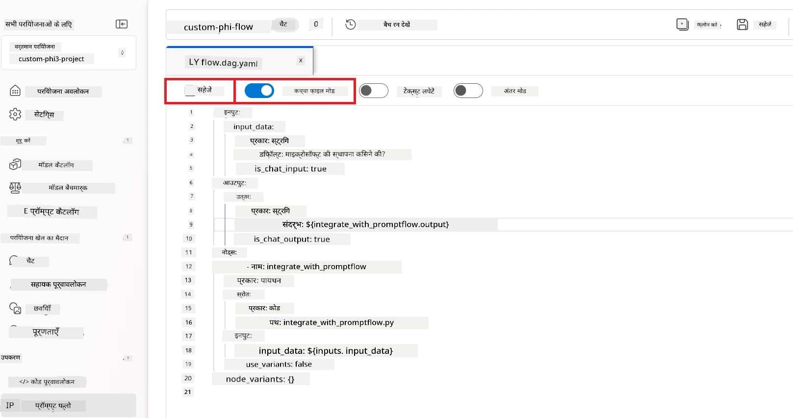

1. *integrate_with_promptflow.py* फ़ाइल में निम्न कोड जोड़ें ताकि Prompt flow में कस्टम Phi-3 मॉडल का उपयोग किया जा सके।

    ```python
    import logging
    import requests
    from promptflow import tool
    from promptflow.connections import CustomConnection

    # लॉगिंग सेटअप
    logging.basicConfig(
        format="%(asctime)s - %(levelname)s - %(name)s - %(message)s",
        datefmt="%Y-%m-%d %H:%M:%S",
        level=logging.DEBUG
    )
    logger = logging.getLogger(__name__)

    def query_phi3_model(input_data: str, connection: CustomConnection) -> str:
        """
        Send a request to the Phi-3 model endpoint with the given input data using Custom Connection.
        """

        # "connection" कस्टम कनेक्शन का नाम है, "endpoint", "key" कस्टम कनेक्शन में कुंजी हैं
        endpoint_url = connection.endpoint
        api_key = connection.key

        headers = {
            "Content-Type": "application/json",
            "Authorization": f"Bearer {api_key}"
        }
        data = {
            "input_data": {
                "input_string": [
                    {"role": "user", "content": input_data}
                ],
                "parameters": {
                    "temperature": 0.7,
                    "max_new_tokens": 128
                }
            }
        }
        try:
            response = requests.post(endpoint_url, json=data, headers=headers)
            response.raise_for_status()
            
            # पूर्ण JSON प्रतिक्रिया लॉग करें
            logger.debug(f"Full JSON response: {response.json()}")

            result = response.json()["output"]
            logger.info("Successfully received response from Azure ML Endpoint.")
            return result
        except requests.exceptions.RequestException as e:
            logger.error(f"Error querying Azure ML Endpoint: {e}")
            raise

    @tool
    def my_python_tool(input_data: str, connection: CustomConnection) -> str:
        """
        Tool function to process input data and query the Phi-3 model.
        """
        return query_phi3_model(input_data, connection)

    ```

    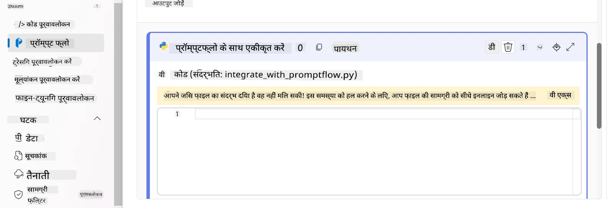

> [!NOTE]
> Azure AI Foundry में Prompt flow का उपयोग करने की अधिक विस्तृत जानकारी के लिए, आप [Azure AI Foundry में Prompt flow](https://learn.microsoft.com/azure/ai-studio/how-to/prompt-flow) देख सकते हैं।

1. **Chat input**, **Chat output** चुनें ताकि अपने मॉडल के साथ चैट सक्षम हो सके।

    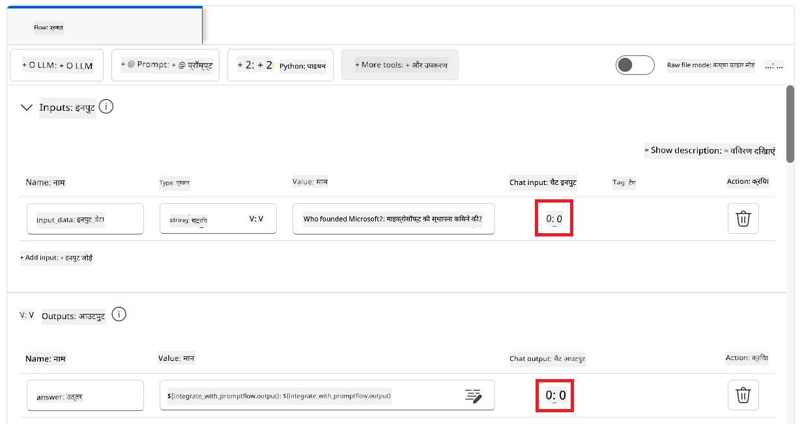

1. अब आप अपने कस्टम Phi-3 मॉडल के साथ चैट करने के लिए तैयार हैं। अगली एक्सरसाइज में, आप सीखेंगे कि Prompt flow कैसे शुरू करें और इसका उपयोग अपने फ़ाइन-ट्यून किए गए Phi-3 मॉडल के साथ चैट करने के लिए कैसे करें।

> [!NOTE]
>
> पुनर्निर्मित फ्लो नीचे दी गई छवि जैसा दिखना चाहिए:
>
> 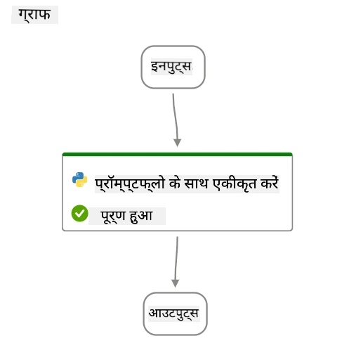
>

### अपने कस्टम Phi-3 मॉडल के साथ चैट करें

अब जब आपने अपने कस्टम Phi-3 मॉडल को फ़ाइन-ट्यून और Prompt flow के साथ एकीकृत कर लिया है, तो आप इसके साथ बातचीत शुरू करने के लिए तैयार हैं। यह अभ्यास आपको Prompt flow का उपयोग करके अपने मॉडल के साथ चैट सेट अप और शुरू करने की प्रक्रिया मार्गदर्शन करेगा। इन चरणों का पालन करके, आप विभिन्न कार्यों और वार्तालापों के लिए अपने फ़ाइन-ट्यून किए गए Phi-3 मॉडल की क्षमताओं का पूरा उपयोग कर पाएंगे।

- Prompt flow का उपयोग करके अपने कस्टम Phi-3 मॉडल के साथ चैट करें।

#### Prompt flow शुरू करें

1. Prompt flow शुरू करने के लिए **स्टार्ट कंप्यूट सेशंस** चुनें।

    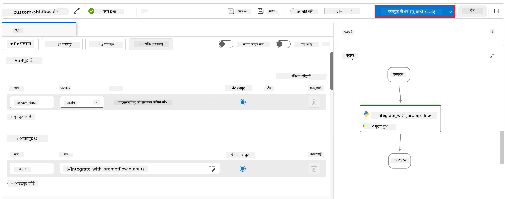

1. पैरामीटर को नवीनीकृत करने के लिए **इनपुट सत्यापित करें और पार्स करें** चुनें।

    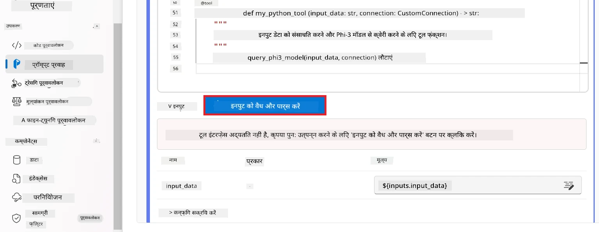

1. आपने जो कस्टम कनेक्शन बनाया है, उसके **connection** के **मान** को चुनें। उदाहरण के लिए, *connection*।

    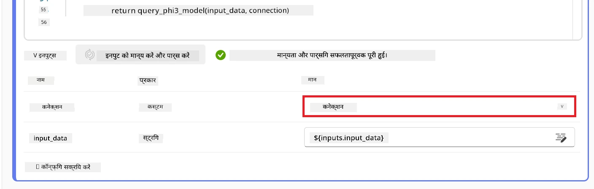

#### अपने कस्टम मॉडल के साथ चैट करें

1. **चैट** चुनें।

    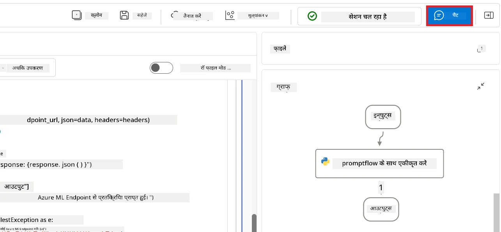

1. परिणामों का एक उदाहरण यहाँ है: अब आप अपने कस्टम Phi-3 मॉडल के साथ चैट कर सकते हैं। इसे फ़ाइन-ट्यूनिंग के लिए उपयोग किए गए डेटा के आधार पर प्रश्न पूछने की सिफारिश की जाती है।

    

---

<!-- CO-OP TRANSLATOR DISCLAIMER START -->
**अस्वीकरण**:  
इस दस्तावेज़ का अनुवाद एआई अनुवाद सेवा [Co-op Translator](https://github.com/Azure/co-op-translator) का उपयोग करके किया गया है। जबकि हम सटीकता के लिए प्रयासरत हैं, कृपया ध्यान रखें कि स्वचालित अनुवाद में त्रुटियाँ या गलतियाँ हो सकती हैं। मूल दस्तावेज़ अपनी मूल भाषा में प्रमाणीकरण स्रोत माना जाना चाहिए। महत्वपूर्ण जानकारी के लिए, पेशेवर मानव अनुवाद की अनुशंसा की जाती है। इस अनुवाद के उपयोग से उत्पन्न किसी भी गलतफहमी या व्याख्या के लिए हम उत्तरदायी नहीं हैं।
<!-- CO-OP TRANSLATOR DISCLAIMER END -->