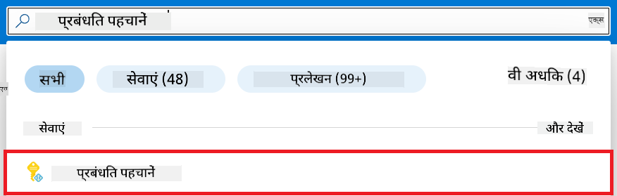
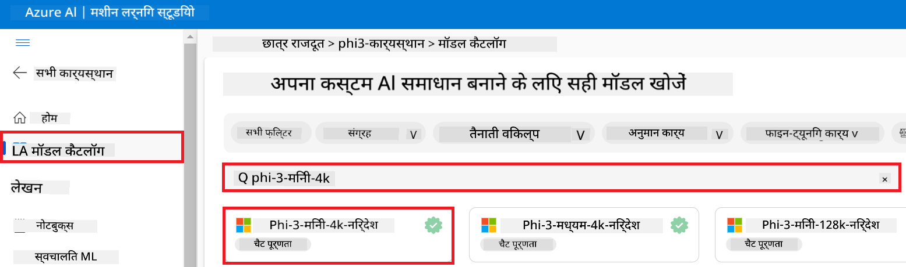
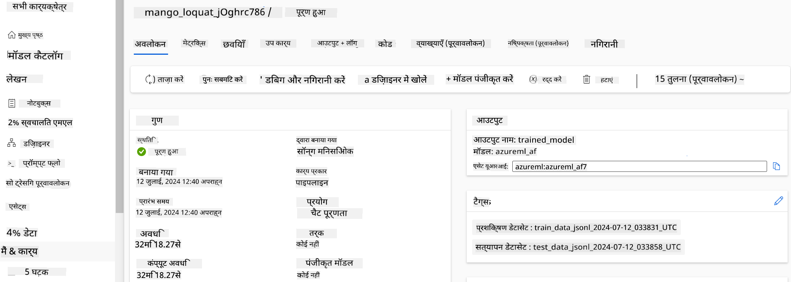
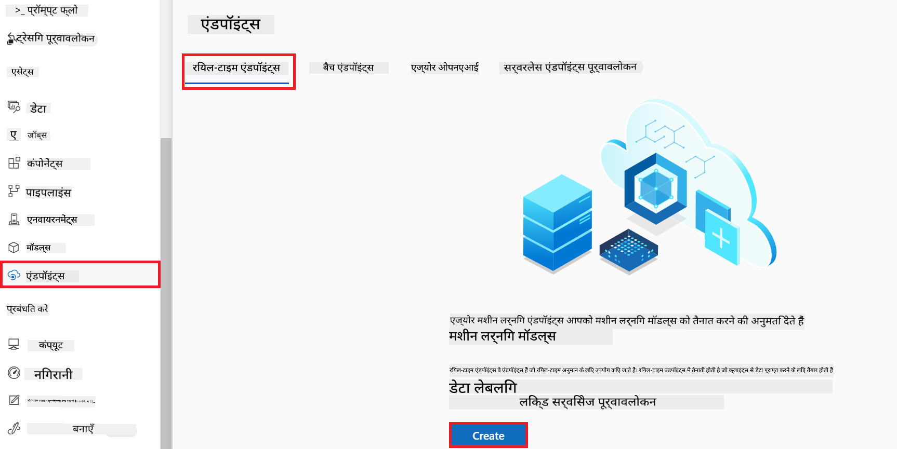
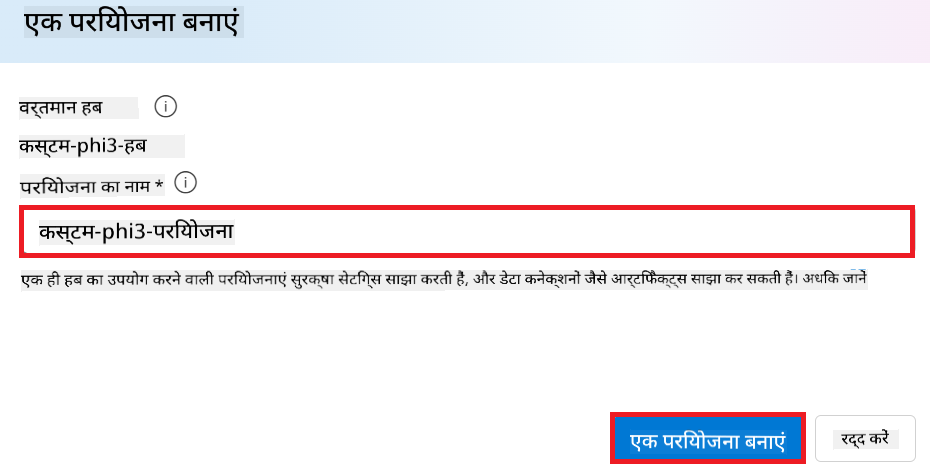
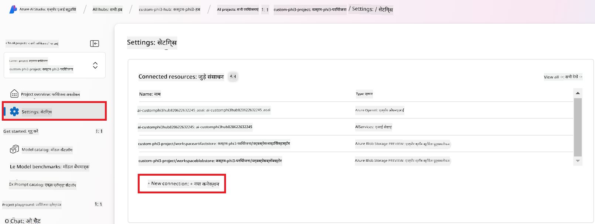
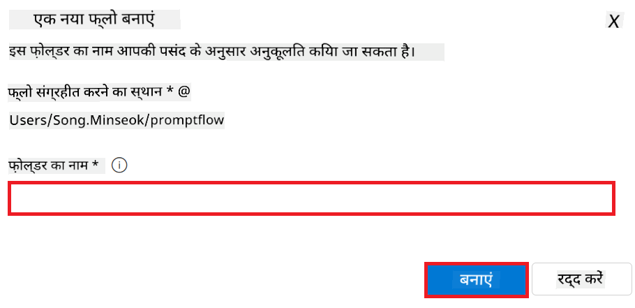
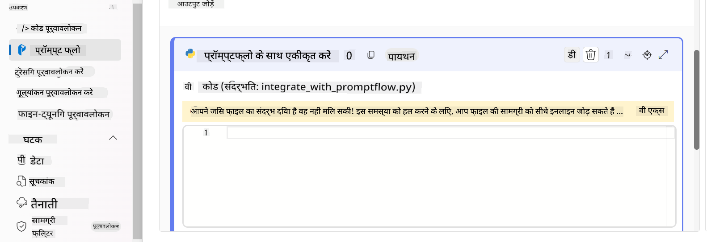
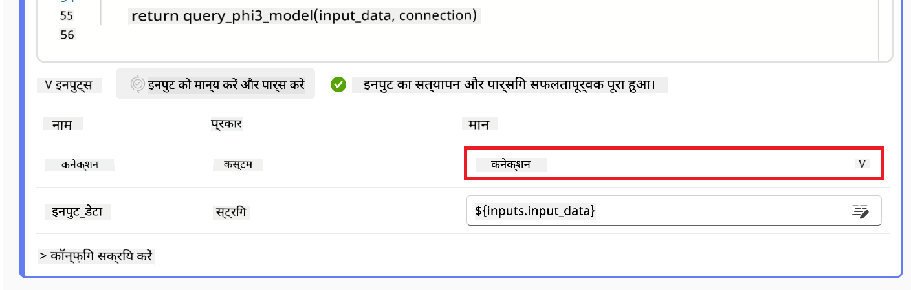

<!--
CO_OP_TRANSLATOR_METADATA:
{
  "original_hash": "ecbd9179a21edbaafaf114d47f09f3e3",
  "translation_date": "2025-05-08T05:48:23+00:00",
  "source_file": "md/02.Application/01.TextAndChat/Phi3/E2E_Phi-3-FineTuning_PromptFlow_Integration_AIFoundry.md",
  "language_code": "hi"
}
-->
# Azure AI Foundry में Prompt flow के साथ कस्टम Phi-3 मॉडल को फाइन-ट्यून और इंटीग्रेट करें

यह एंड-टू-एंड (E2E) उदाहरण Microsoft Tech Community के "[Fine-Tune and Integrate Custom Phi-3 Models with Prompt Flow in Azure AI Foundry](https://techcommunity.microsoft.com/t5/educator-developer-blog/fine-tune-and-integrate-custom-phi-3-models-with-prompt-flow-in/ba-p/4191726?WT.mc_id=aiml-137032-kinfeylo)" गाइड पर आधारित है। यह कस्टम Phi-3 मॉडल को फाइन-ट्यून, डिप्लॉय और Azure AI Foundry में Prompt flow के साथ इंटीग्रेट करने की प्रक्रियाओं का परिचय देता है।  
इस E2E उदाहरण के विपरीत, "[Fine-Tune and Integrate Custom Phi-3 Models with Prompt Flow](./E2E_Phi-3-FineTuning_PromptFlow_Integration.md)" जिसमें कोड लोकली चलाना शामिल था, यह ट्यूटोरियल पूरी तरह से Azure AI / ML Studio में आपके मॉडल को फाइन-ट्यून और इंटीग्रेट करने पर केंद्रित है।

## अवलोकन

इस E2E उदाहरण में, आप Phi-3 मॉडल को फाइन-ट्यून करना और इसे Azure AI Foundry में Prompt flow के साथ इंटीग्रेट करना सीखेंगे। Azure AI / ML Studio का उपयोग करके, आप कस्टम AI मॉडल को डिप्लॉय और उपयोग करने के लिए एक वर्कफ़्लो स्थापित करेंगे। यह E2E उदाहरण तीन परिदृश्यों में विभाजित है:

**परिदृश्य 1: Azure संसाधनों की सेटअप और फाइन-ट्यूनिंग की तैयारी**

**परिदृश्य 2: Phi-3 मॉडल का फाइन-ट्यून और Azure Machine Learning Studio में डिप्लॉयमेंट**

**परिदृश्य 3: Prompt flow के साथ इंटीग्रेशन और Azure AI Foundry में अपने कस्टम मॉडल के साथ चैट करना**

यहाँ इस E2E उदाहरण का एक संक्षिप्त परिचय है।


### विषय सूची

1. **[परिदृश्य 1: Azure संसाधनों की सेटअप और फाइन-ट्यूनिंग की तैयारी](../../../../../../md/02.Application/01.TextAndChat/Phi3)**
    - [Azure Machine Learning Workspace बनाएँ](../../../../../../md/02.Application/01.TextAndChat/Phi3)
    - [Azure Subscription में GPU कोटा के लिए अनुरोध करें](../../../../../../md/02.Application/01.TextAndChat/Phi3)
    - [रोल असाइनमेंट जोड़ें](../../../../../../md/02.Application/01.TextAndChat/Phi3)
    - [प्रोजेक्ट सेटअप करें](../../../../../../md/02.Application/01.TextAndChat/Phi3)
    - [फाइन-ट्यूनिंग के लिए डेटासेट तैयार करें](../../../../../../md/02.Application/01.TextAndChat/Phi3)

1. **[परिदृश्य 2: Phi-3 मॉडल का फाइन-ट्यून और Azure Machine Learning Studio में डिप्लॉय करें](../../../../../../md/02.Application/01.TextAndChat/Phi3)**
    - [Phi-3 मॉडल को फाइन-ट्यून करें](../../../../../../md/02.Application/01.TextAndChat/Phi3)
    - [फाइन-ट्यून किए गए Phi-3 मॉडल को डिप्लॉय करें](../../../../../../md/02.Application/01.TextAndChat/Phi3)

1. **[परिदृश्य 3: Prompt flow के साथ इंटीग्रेट करें और Azure AI Foundry में अपने कस्टम मॉडल के साथ चैट करें](../../../../../../md/02.Application/01.TextAndChat/Phi3)**
    - [कस्टम Phi-3 मॉडल को Prompt flow के साथ इंटीग्रेट करें](../../../../../../md/02.Application/01.TextAndChat/Phi3)
    - [अपने कस्टम Phi-3 मॉडल के साथ चैट करें](../../../../../../md/02.Application/01.TextAndChat/Phi3)

## परिदृश्य 1: Azure संसाधनों की सेटअप और फाइन-ट्यूनिंग की तैयारी

### Azure Machine Learning Workspace बनाएँ

1. पोर्टल पेज के शीर्ष पर **search bar** में *azure machine learning* टाइप करें और दिखाई देने वाले विकल्पों में से **Azure Machine Learning** चुनें।

    

2. नेविगेशन मेनू से **+ Create** चुनें।

3. नेविगेशन मेनू से **New workspace** चुनें।

    

4. निम्नलिखित कार्य करें:

    - अपनी Azure **Subscription** चुनें।  
    - उपयोग के लिए **Resource group** चुनें (आवश्यक हो तो नया बनाएं)।  
    - **Workspace Name** दर्ज करें। यह एक अद्वितीय नाम होना चाहिए।  
    - उपयोग करने के लिए **Region** चुनें।  
    - उपयोग के लिए **Storage account** चुनें (आवश्यक हो तो नया बनाएं)।  
    - उपयोग के लिए **Key vault** चुनें (आवश्यक हो तो नया बनाएं)।  
    - उपयोग के लिए **Application insights** चुनें (आवश्यक हो तो नया बनाएं)।  
    - उपयोग के लिए **Container registry** चुनें (आवश्यक हो तो नया बनाएं)।  

    

5. **Review + Create** चुनें।

6. **Create** चुनें।

### Azure Subscription में GPU कोटा के लिए अनुरोध करें

इस ट्यूटोरियल में, आप GPUs का उपयोग करके Phi-3 मॉडल को फाइन-ट्यून और डिप्लॉय करना सीखेंगे। फाइन-ट्यूनिंग के लिए, आप *Standard_NC24ads_A100_v4* GPU का उपयोग करेंगे, जिसके लिए कोटा अनुरोध आवश्यक है। डिप्लॉयमेंट के लिए, आप *Standard_NC6s_v3* GPU का उपयोग करेंगे, जिसके लिए भी कोटा अनुरोध करना होगा।

> [!NOTE]  
> केवल Pay-As-You-Go सब्सक्रिप्शन (मानक सब्सक्रिप्शन प्रकार) GPU आवंटन के लिए पात्र हैं; लाभ सब्सक्रिप्शन फिलहाल समर्थित नहीं हैं।  
>

1. [Azure ML Studio](https://ml.azure.com/home?wt.mc_id=studentamb_279723) पर जाएं।

1. *Standard NCADSA100v4 Family* कोटा के लिए अनुरोध करने हेतु निम्नलिखित करें:

    - बाएँ टैब से **Quota** चुनें।  
    - उपयोग के लिए **Virtual machine family** चुनें। उदाहरण के लिए, *Standard NCADSA100v4 Family Cluster Dedicated vCPUs*, जिसमें *Standard_NC24ads_A100_v4* GPU शामिल है।  
    - नेविगेशन मेनू से **Request quota** चुनें।  

        

    - Request quota पेज में, उपयोग के लिए **New cores limit** दर्ज करें। उदाहरण के लिए, 24।  
    - Request quota पेज में, GPU कोटा के लिए **Submit** चुनें।  

1. *Standard NCSv3 Family* कोटा के लिए अनुरोध करने हेतु निम्नलिखित करें:

    - बाएँ टैब से **Quota** चुनें।  
    - उपयोग के लिए **Virtual machine family** चुनें। उदाहरण के लिए, *Standard NCSv3 Family Cluster Dedicated vCPUs*, जिसमें *Standard_NC6s_v3* GPU शामिल है।  
    - नेविगेशन मेनू से **Request quota** चुनें।  
    - Request quota पेज में, उपयोग के लिए **New cores limit** दर्ज करें। उदाहरण के लिए, 24।  
    - Request quota पेज में, GPU कोटा के लिए **Submit** चुनें।  

### रोल असाइनमेंट जोड़ें

अपने मॉडल को फाइन-ट्यून और डिप्लॉय करने के लिए, आपको पहले एक User Assigned Managed Identity (UAI) बनानी होगी और उसे उचित अनुमतियाँ देनी होंगी। यह UAI डिप्लॉयमेंट के दौरान प्रमाणीकरण के लिए उपयोग की जाएगी।

#### User Assigned Managed Identity (UAI) बनाएँ

1. पोर्टल पेज के शीर्ष पर **search bar** में *managed identities* टाइप करें और दिखाई देने वाले विकल्पों में से **Managed Identities** चुनें।

    

1. **+ Create** चुनें।

    

1. निम्नलिखित कार्य करें:

    - अपनी Azure **Subscription** चुनें।  
    - उपयोग के लिए **Resource group** चुनें (आवश्यक हो तो नया बनाएं)।  
    - उपयोग के लिए **Region** चुनें।  
    - **Name** दर्ज करें। यह एक अद्वितीय नाम होना चाहिए।  

    

1. **Review + create** चुनें।

1. **+ Create** चुनें।

#### Managed Identity को Contributor रोल असाइनमेंट जोड़ें

1. उस Managed Identity संसाधन पर जाएं जिसे आपने बनाया है।

1. बाएँ टैब से **Azure role assignments** चुनें।

1. नेविगेशन मेनू से **+Add role assignment** चुनें।

1. Add role assignment पेज में निम्नलिखित करें:  
    - **Scope** को **Resource group** पर सेट करें।  
    - अपनी Azure **Subscription** चुनें।  
    - उपयोग के लिए **Resource group** चुनें।  
    - **Role** को **Contributor** पर सेट करें।  

    

2. **Save** चुनें।

#### Managed Identity को Storage Blob Data Reader रोल असाइनमेंट जोड़ें

1. पोर्टल पेज के शीर्ष पर **search bar** में *storage accounts* टाइप करें और दिखाई देने वाले विकल्पों में से **Storage accounts** चुनें।

    

1. उस storage account को चुनें जो आपके Azure Machine Learning workspace से जुड़ा है। उदाहरण के लिए, *finetunephistorage*।

1. Add role assignment पेज पर जाने के लिए निम्नलिखित करें:

    - Azure Storage account पर जाएं जो आपने बनाया है।  
    - बाएँ टैब से **Access Control (IAM)** चुनें।  
    - नेविगेशन मेनू से **+ Add** चुनें।  
    - नेविगेशन मेनू से **Add role assignment** चुनें।  

    

1. Add role assignment पेज में निम्नलिखित करें:

    - Role पेज में, **search bar** में *Storage Blob Data Reader* टाइप करें और विकल्पों में से **Storage Blob Data Reader** चुनें।  
    - Role पेज में, **Next** चुनें।  
    - Members पेज में, **Assign access to** के रूप में **Managed identity** चुनें।  
    - Members पेज में, **+ Select members** चुनें।  
    - Select managed identities पेज में, अपनी Azure **Subscription** चुनें।  
    - Select managed identities पेज में, **Managed identity** के लिए **Manage Identity** चुनें।  
    - Select managed identities पेज में, आपने जो Managed Identity बनाई है उसे चुनें। उदाहरण के लिए, *finetunephi-managedidentity*।  
    - Select managed identities पेज में, **Select** चुनें।  

    

1. **Review + assign** चुनें।

#### Managed Identity को AcrPull रोल असाइनमेंट जोड़ें

1. पोर्टल पेज के शीर्ष पर **search bar** में *container registries* टाइप करें और दिखाई देने वाले विकल्पों में से **Container registries** चुनें।

    

1. उस container registry को चुनें जो आपके Azure Machine Learning workspace से जुड़ा है। उदाहरण के लिए, *finetunephicontainerregistry*

1. Add role assignment पेज पर जाने के लिए निम्नलिखित करें:

    - बाएँ टैब से **Access Control (IAM)** चुनें।  
    - नेविगेशन मेनू से **+ Add** चुनें।  
    - नेविगेशन मेनू से **Add role assignment** चुनें।  

1. Add role assignment पेज में निम्नलिखित करें:

    - Role पेज में, **search bar** में *AcrPull* टाइप करें और विकल्पों में से **AcrPull** चुनें।  
    - Role पेज में, **Next** चुनें।  
    - Members पेज में, **Assign access to** के रूप में **Managed identity** चुनें।  
    - Members पेज में, **+ Select members** चुनें।  
    - Select managed identities पेज में, अपनी Azure **Subscription** चुनें।  
    - Select managed identities पेज में, **Managed identity** के लिए **Manage Identity** चुनें।  
    - Select managed identities पेज में, आपने जो Managed Identity बनाई है उसे चुनें। उदाहरण के लिए, *finetunephi-managedidentity*।  
    - Select managed identities पेज में, **Select** चुनें।  
    - **Review + assign** चुनें।  

### प्रोजेक्ट सेटअप करें

फाइन-ट्यूनिंग के लिए आवश्यक डेटासेट डाउनलोड करने के लिए, आप एक लोकल एनवायरनमेंट सेटअप करेंगे।

इस अभ्यास में, आप:

- काम करने के लिए एक फोल्डर बनाएंगे।  
- एक वर्चुअल एनवायरनमेंट बनाएंगे।  
- आवश्यक पैकेज इंस्टॉल करेंगे।  
- डेटासेट डाउनलोड करने के लिए *download_dataset.py* फाइल बनाएंगे।  

#### काम करने के लिए फोल्डर बनाएँ

1. टर्मिनल विंडो खोलें और डिफ़ॉल्ट पथ में *finetune-phi* नामक फोल्डर बनाने के लिए निम्न कमांड टाइप करें।

    ```console
    mkdir finetune-phi
    ```

2. टर्मिनल में निम्न कमांड टाइप करके *finetune-phi* फोल्डर में जाएं।

    ```console
    cd finetune-phi
    ```

#### वर्चुअल एनवायरनमेंट बनाएँ

1. टर्मिनल में निम्न कमांड टाइप करके *.venv* नामक वर्चुअल एनवायरनमेंट बनाएँ।

    ```console
    python -m venv .venv
    ```

2. टर्मिनल में निम्न कमांड टाइप करके वर्चुअल एनवायरनमेंट को सक्रिय करें।

    ```console
    .venv\Scripts\activate.bat
    ```

> [!NOTE]  
> यदि यह सफल रहा, तो कमांड प्रॉम्प्ट के पहले *(.venv)* दिखाई देगा।

#### आवश्यक पैकेज इंस्टॉल करें

1. टर्मिनल में निम्न कमांड टाइप करके आवश्यक पैकेज इंस्टॉल करें।

    ```console
    pip install datasets==2.19.1
    ```

#### `download_dataset.py` बनाएँ

> [!NOTE]  
> पूर्ण फोल्डर संरचना:  
>  
> ```text
> └── YourUserName
> .    └── finetune-phi
> .        └── download_dataset.py
> ```

1. **Visual Studio Code** खोलें।

1. मेनू बार से **File** चुनें।

1. **Open Folder** चुनें।

1. उस *finetune-phi* फोल्डर को चुनें जो आपने बनाया है, जो *C:\Users\yourUserName\finetune-phi* में स्थित है।

    

1. Visual Studio Code के बाएँ पेन में, राइट-क्लिक करें और **New File** चुनें, फिर *download_dataset.py* नामक नई फाइल बनाएं।

    

### फाइन-ट्यूनिंग के लिए डेटासेट तैयार करें

इस अभ्यास में, आप *download_dataset.py* फाइल चलाकर *ultrachat_200k* डेटासेट को अपने लोकल एनवायरनमेंट में डाउनलोड करेंगे। फिर आप इस डेटासेट का उपयोग Azure Machine Learning में Phi-3 मॉडल को फाइन-ट्यून करने के लिए करेंगे।

इस अभ्यास में, आप:

- *download_dataset.py* फाइल में कोड जोड़ेंगे ताकि डेटासेट डाउनलोड हो सके।  
- *download_dataset.py* फाइल चलाकर डेटासेट को अपने लोकल एनवायरनमेंट में डाउनलोड करेंगे।  

#### *download_dataset.py* का उपयोग करके डेटासेट डाउनलोड करें

1. Visual Studio Code में *download_dataset.py* फाइल खोलें।

1. *download_dataset.py* फाइल में निम्नलिखित कोड जोड़ें।

    ```python
    import json
    import os
    from datasets import load_dataset

    def load_and_split_dataset(dataset_name, config_name, split_ratio):
        """
        Load and split a dataset.
        """
        # Load the dataset with the specified name, configuration, and split ratio
        dataset = load_dataset(dataset_name, config_name, split=split_ratio)
        print(f"Original dataset size: {len(dataset)}")
        
        # Split the dataset into train and test sets (80% train, 20% test)
        split_dataset = dataset.train_test_split(test_size=0.2)
        print(f"Train dataset size: {len(split_dataset['train'])}")
        print(f"Test dataset size: {len(split_dataset['test'])}")
        
        return split_dataset

    def save_dataset_to_jsonl(dataset, filepath):
        """
        Save a dataset to a JSONL file.
        """
        # Create the directory if it does not exist
        os.makedirs(os.path.dirname(filepath), exist_ok=True)
        
        # Open the file in write mode
        with open(filepath, 'w', encoding='utf-8') as f:
            # Iterate over each record in the dataset
            for record in dataset:
                # Dump the record as a JSON object and write it to the file
                json.dump(record, f)
                # Write a newline character to separate records
                f.write('\n')
        
        print(f"Dataset saved to {filepath}")

    def main():
        """
        Main function to load, split, and save the dataset.
        """
        # Load and split the ULTRACHAT_200k dataset with a specific configuration and split ratio
        dataset = load_and_split_dataset("HuggingFaceH4/ultrachat_200k", 'default', 'train_sft[:1%]')
        
        # Extract the train and test datasets from the split
        train_dataset = dataset['train']
        test_dataset = dataset['test']

        # Save the train dataset to a JSONL file
        save_dataset_to_jsonl(train_dataset, "data/train_data.jsonl")
        
        # Save the test dataset to a separate JSONL file
        save_dataset_to_jsonl(test_dataset, "data/test_data.jsonl")

    if __name__ == "__main__":
        main()

    ```

1. टर्मिनल में निम्न कमांड टाइप करके स्क्रिप्ट चलाएं और डेटासेट अपने लोकल एनवायरनमेंट में डाउनलोड करें।

    ```console
    python download_dataset.py
    ```

1. सुनिश्चित करें कि डेटासेट सफलतापूर्वक आपके लोकल *finetune-phi/data* डायरेक्टरी में सेव हो गया है।

> [!NOTE]  
> #### डेटासेट साइज और फाइन-ट्यूनिंग समय पर नोट  

1. [Azure ML Studio](https://ml.azure.com/home?wt.mc_id=studentamb_279723) पर जाएं।

1. बाईं तरफ के टैब से **Compute** चुनें।

1. नेविगेशन मेनू से **Compute clusters** चुनें।

1. **+ New** चुनें।

    

1. निम्न कार्य करें:

    - उस **Region** को चुनें जिसे आप उपयोग करना चाहते हैं।
    - **Virtual machine tier** को **Dedicated** पर सेट करें।
    - **Virtual machine type** को **GPU** पर सेट करें।
    - **Virtual machine size** फ़िल्टर को **Select from all options** पर सेट करें।
    - **Virtual machine size** को **Standard_NC24ads_A100_v4** चुनें।

    

1. **Next** चुनें।

1. निम्न कार्य करें:

    - **Compute name** दर्ज करें। यह एक अनूठा नाम होना चाहिए।
    - **Minimum number of nodes** को **0** पर सेट करें।
    - **Maximum number of nodes** को **1** पर सेट करें।
    - **Idle seconds before scale down** को **120** पर सेट करें।

    

1. **Create** चुनें।

#### Phi-3 मॉडल का फाइन-ट्यून करें

1. [Azure ML Studio](https://ml.azure.com/home?wt.mc_id=studentamb_279723) पर जाएं।

1. उस Azure Machine Learning workspace को चुनें जिसे आपने बनाया था।

    

1. निम्न कार्य करें:

    - बाईं तरफ के टैब से **Model catalog** चुनें।
    - **search bar** में *phi-3-mini-4k* टाइप करें और दिखाई देने वाले विकल्पों में से **Phi-3-mini-4k-instruct** चुनें।

    

1. नेविगेशन मेनू से **Fine-tune** चुनें।

    

1. निम्न कार्य करें:

    - **Select task type** को **Chat completion** पर सेट करें।
    - **+ Select data** पर क्लिक करके **Traning data** अपलोड करें।
    - Validation data अपलोड प्रकार को **Provide different validation data** पर सेट करें।
    - **+ Select data** पर क्लिक करके **Validation data** अपलोड करें।

    

    > [!TIP]
    >
    > आप **Advanced settings** चुनकर **learning_rate** और **lr_scheduler_type** जैसी सेटिंग्स को कस्टमाइज़ कर सकते हैं ताकि फाइन-ट्यूनिंग प्रक्रिया को अपनी आवश्यकताओं के अनुसार बेहतर बनाया जा सके।

1. **Finish** चुनें।

1. इस अभ्यास में, आपने सफलतापूर्वक Azure Machine Learning का उपयोग करके Phi-3 मॉडल का फाइन-ट्यून किया है। कृपया ध्यान दें कि फाइन-ट्यूनिंग प्रक्रिया में काफी समय लग सकता है। फाइन-ट्यूनिंग जॉब चलाने के बाद, इसे पूरा होने तक प्रतीक्षा करें। आप अपने Azure Machine Learning Workspace के बाईं तरफ के Jobs टैब में जाकर फाइन-ट्यूनिंग जॉब की स्थिति मॉनिटर कर सकते हैं। अगले भाग में, आप फाइन-ट्यून किए गए मॉडल को डिप्लॉय करेंगे और इसे Prompt flow के साथ इंटीग्रेट करेंगे।

    

### फाइन-ट्यून किए गए Phi-3 मॉडल को डिप्लॉय करें

फाइन-ट्यून किए गए Phi-3 मॉडल को Prompt flow के साथ इंटीग्रेट करने के लिए, आपको मॉडल को डिप्लॉय करना होगा ताकि वह रियल-टाइम इनफेरेंस के लिए उपलब्ध हो सके। इस प्रक्रिया में मॉडल का रजिस्ट्रेशन, एक ऑनलाइन एंडपॉइंट बनाना, और मॉडल को डिप्लॉय करना शामिल है।

इस अभ्यास में, आप:

- Azure Machine Learning workspace में फाइन-ट्यून किए गए मॉडल को रजिस्टर करेंगे।
- एक ऑनलाइन एंडपॉइंट बनाएंगे।
- रजिस्टर किए गए फाइन-ट्यून Phi-3 मॉडल को डिप्लॉय करेंगे।

#### फाइन-ट्यून किए गए मॉडल को रजिस्टर करें

1. [Azure ML Studio](https://ml.azure.com/home?wt.mc_id=studentamb_279723) पर जाएं।

1. उस Azure Machine Learning workspace को चुनें जिसे आपने बनाया था।

    

1. बाईं तरफ के टैब से **Models** चुनें।
1. **+ Register** चुनें।
1. **From a job output** चुनें।

    

1. उस जॉब को चुनें जिसे आपने बनाया था।

    

1. **Next** चुनें।

1. **Model type** को **MLflow** पर सेट करें।

1. सुनिश्चित करें कि **Job output** चयनित है; यह स्वचालित रूप से चुना जाना चाहिए।

    

2. **Next** चुनें।

3. **Register** चुनें।

    

4. आप अपने रजिस्टर किए गए मॉडल को बाईं तरफ के टैब में **Models** मेनू से देख सकते हैं।

    

#### फाइन-ट्यून किए गए मॉडल को डिप्लॉय करें

1. उस Azure Machine Learning workspace पर जाएं जिसे आपने बनाया था।

1. बाईं तरफ के टैब से **Endpoints** चुनें।

1. नेविगेशन मेनू से **Real-time endpoints** चुनें।

    

1. **Create** चुनें।

1. अपने रजिस्टर किए गए मॉडल को चुनें।

    

1. **Select** चुनें।

1. निम्न कार्य करें:

    - **Virtual machine** को *Standard_NC6s_v3* पर सेट करें।
    - उपयोग करने के लिए **Instance count** चुनें, जैसे *1*।
    - **Endpoint** को **New** पर सेट करें ताकि नया एंडपॉइंट बनाया जा सके।
    - **Endpoint name** दर्ज करें। यह अनूठा होना चाहिए।
    - **Deployment name** दर्ज करें। यह भी अनूठा होना चाहिए।

    

1. **Deploy** चुनें।

> [!WARNING]
> अपने खाते पर अतिरिक्त शुल्क से बचने के लिए, कृपया Azure Machine Learning workspace में बनाए गए एंडपॉइंट को डिलीट करना न भूलें।
>

#### Azure Machine Learning Workspace में डिप्लॉयमेंट की स्थिति जांचें

1. उस Azure Machine Learning workspace पर जाएं जिसे आपने बनाया था।

1. बाईं तरफ के टैब से **Endpoints** चुनें।

1. उस एंडपॉइंट को चुनें जिसे आपने बनाया था।

    

1. इस पेज पर, आप डिप्लॉयमेंट प्रक्रिया के दौरान एंडपॉइंट्स का प्रबंधन कर सकते हैं।

> [!NOTE]
> डिप्लॉयमेंट पूरा होने के बाद, सुनिश्चित करें कि **Live traffic** **100%** पर सेट है। यदि नहीं है, तो ट्रैफ़िक सेटिंग्स को समायोजित करने के लिए **Update traffic** चुनें। ध्यान दें कि यदि ट्रैफ़िक 0% पर है, तो आप मॉडल का परीक्षण नहीं कर सकते।
>
> 
>

## परिदृश्य 3: Prompt flow के साथ इंटीग्रेट करें और Azure AI Foundry में अपने कस्टम मॉडल से चैट करें

### कस्टम Phi-3 मॉडल को Prompt flow के साथ इंटीग्रेट करें

अपने फाइन-ट्यून किए गए मॉडल को सफलतापूर्वक डिप्लॉय करने के बाद, अब आप इसे Prompt Flow के साथ इंटीग्रेट कर सकते हैं ताकि आप अपने मॉडल का रियल-टाइम एप्लिकेशन में उपयोग कर सकें, जिससे आपके कस्टम Phi-3 मॉडल के साथ विभिन्न इंटरैक्टिव टास्क संभव हो सकें।

इस अभ्यास में, आप:

- Azure AI Foundry Hub बनाएंगे।
- Azure AI Foundry प्रोजेक्ट बनाएंगे।
- Prompt flow बनाएंगे।
- फाइन-ट्यून किए गए Phi-3 मॉडल के लिए कस्टम कनेक्शन जोड़ेंगे।
- अपने कस्टम Phi-3 मॉडल के साथ चैट करने के लिए Prompt flow सेटअप करेंगे।

> [!NOTE]
> आप Azure ML Studio का उपयोग करके भी Promptflow के साथ इंटीग्रेशन कर सकते हैं। यह इंटीग्रेशन प्रक्रिया Azure ML Studio पर भी समान रूप से लागू होती है।

#### Azure AI Foundry Hub बनाएँ

प्रोजेक्ट बनाने से पहले आपको एक Hub बनाना होगा। Hub एक Resource Group की तरह काम करता है, जो Azure AI Foundry के भीतर कई प्रोजेक्ट्स को व्यवस्थित और प्रबंधित करने की सुविधा देता है।

1. [Azure AI Foundry](https://ai.azure.com/?WT.mc_id=aiml-137032-kinfeylo) पर जाएं।

1. बाईं तरफ के टैब से **All hubs** चुनें।

1. नेविगेशन मेनू से **+ New hub** चुनें।

    

1. निम्न कार्य करें:

    - **Hub name** दर्ज करें। यह एक अनूठा नाम होना चाहिए।
    - अपनी Azure **Subscription** चुनें।
    - उपयोग करने के लिए **Resource group** चुनें (यदि आवश्यक हो तो नया बनाएं)।
    - उपयोग करने के लिए **Location** चुनें।
    - उपयोग करने के लिए **Connect Azure AI Services** चुनें (यदि आवश्यक हो तो नया बनाएं)।
    - **Connect Azure AI Search** को **Skip connecting** पर सेट करें।

    

1. **Next** चुनें।

#### Azure AI Foundry प्रोजेक्ट बनाएँ

1. आपने जो Hub बनाया है, उसमें बाईं तरफ के टैब से **All projects** चुनें।

1. नेविगेशन मेनू से **+ New project** चुनें।

    

1. **Project name** दर्ज करें। यह अनूठा होना चाहिए।

    

1. **Create a project** चुनें।

#### फाइन-ट्यून किए गए Phi-3 मॉडल के लिए कस्टम कनेक्शन जोड़ें

अपने कस्टम Phi-3 मॉडल को Prompt flow के साथ इंटीग्रेट करने के लिए, आपको मॉडल के एंडपॉइंट और की को एक कस्टम कनेक्शन में सेव करना होगा। यह सेटअप Prompt flow में आपके कस्टम Phi-3 मॉडल तक पहुँच सुनिश्चित करता है।

#### फाइन-ट्यून किए गए Phi-3 मॉडल की api key और endpoint uri सेट करें

1. [Azure ML Studio](https://ml.azure.com/home?WT.mc_id=aiml-137032-kinfeylo) पर जाएं।

1. उस Azure Machine Learning workspace में नेविगेट करें जिसे आपने बनाया था।

1. बाईं तरफ के टैब से **Endpoints** चुनें।

    

1. उस एंडपॉइंट को चुनें जिसे आपने बनाया था।

    

1. नेविगेशन मेनू से **Consume** चुनें।

1. अपना **REST endpoint** और **Primary key** कॉपी करें।


#### कस्टम कनेक्शन जोड़ें

1. [Azure AI Foundry](https://ai.azure.com/?WT.mc_id=aiml-137032-kinfeylo) पर जाएं।

1. उस Azure AI Foundry प्रोजेक्ट पर नेविगेट करें जिसे आपने बनाया है।

1. अपने बनाए गए प्रोजेक्ट में, बाएँ साइड टैब से **Settings** चुनें।

1. **+ New connection** चुनें।

    

1. नेविगेशन मेनू से **Custom keys** चुनें।

    

1. निम्न कार्य करें:

    - **+ Add key value pairs** चुनें।
    - key नाम के लिए **endpoint** दर्ज करें और Azure ML Studio से कॉपी किया गया endpoint value फ़ील्ड में पेस्ट करें।
    - फिर से **+ Add key value pairs** चुनें।
    - key नाम के लिए **key** दर्ज करें और Azure ML Studio से कॉपी किया गया key value फ़ील्ड में पेस्ट करें।
    - keys जोड़ने के बाद, key को एक्सपोज़ होने से रोकने के लिए **is secret** चुनें।

    

1. **Add connection** चुनें।

#### Prompt flow बनाएं

आपने Azure AI Foundry में एक कस्टम कनेक्शन जोड़ दिया है। अब, निम्न चरणों का पालन करके एक Prompt flow बनाएं। फिर, आप इस Prompt flow को कस्टम कनेक्शन से जोड़ेंगे ताकि आप fine-tuned मॉडल का उपयोग Prompt flow के भीतर कर सकें।

1. उस Azure AI Foundry प्रोजेक्ट पर जाएं जिसे आपने बनाया है।

1. बाएँ साइड टैब से **Prompt flow** चुनें।

1. नेविगेशन मेनू से **+ Create** चुनें।

    

1. नेविगेशन मेनू से **Chat flow** चुनें।

    

1. उपयोग के लिए **Folder name** दर्ज करें।

    

2. **Create** चुनें।

#### अपने कस्टम Phi-3 मॉडल के साथ चैट करने के लिए Prompt flow सेट करें

आपको fine-tuned Phi-3 मॉडल को Prompt flow में इंटीग्रेट करना होगा। हालांकि, मौजूदा Prompt flow इस उद्देश्य के लिए डिज़ाइन नहीं किया गया है। इसलिए, आपको कस्टम मॉडल को इंटीग्रेट करने के लिए Prompt flow को फिर से डिज़ाइन करना होगा।

1. Prompt flow में, मौजूदा flow को पुनर्निर्मित करने के लिए निम्न कार्य करें:

    - **Raw file mode** चुनें।
    - *flow.dag.yml* फ़ाइल में मौजूद सभी कोड हटा दें।
    - *flow.dag.yml* फ़ाइल में निम्न कोड जोड़ें।

        ```yml
        inputs:
          input_data:
            type: string
            default: "Who founded Microsoft?"

        outputs:
          answer:
            type: string
            reference: ${integrate_with_promptflow.output}

        nodes:
        - name: integrate_with_promptflow
          type: python
          source:
            type: code
            path: integrate_with_promptflow.py
          inputs:
            input_data: ${inputs.input_data}
        ```

    - **Save** चुनें।

    

1. कस्टम Phi-3 मॉडल को Prompt flow में उपयोग करने के लिए *integrate_with_promptflow.py* फ़ाइल में निम्न कोड जोड़ें।

    ```python
    import logging
    import requests
    from promptflow import tool
    from promptflow.connections import CustomConnection

    # Logging setup
    logging.basicConfig(
        format="%(asctime)s - %(levelname)s - %(name)s - %(message)s",
        datefmt="%Y-%m-%d %H:%M:%S",
        level=logging.DEBUG
    )
    logger = logging.getLogger(__name__)

    def query_phi3_model(input_data: str, connection: CustomConnection) -> str:
        """
        Send a request to the Phi-3 model endpoint with the given input data using Custom Connection.
        """

        # "connection" is the name of the Custom Connection, "endpoint", "key" are the keys in the Custom Connection
        endpoint_url = connection.endpoint
        api_key = connection.key

        headers = {
            "Content-Type": "application/json",
            "Authorization": f"Bearer {api_key}"
        }
        data = {
            "input_data": {
                "input_string": [
                    {"role": "user", "content": input_data}
                ],
                "parameters": {
                    "temperature": 0.7,
                    "max_new_tokens": 128
                }
            }
        }
        try:
            response = requests.post(endpoint_url, json=data, headers=headers)
            response.raise_for_status()
            
            # Log the full JSON response
            logger.debug(f"Full JSON response: {response.json()}")

            result = response.json()["output"]
            logger.info("Successfully received response from Azure ML Endpoint.")
            return result
        except requests.exceptions.RequestException as e:
            logger.error(f"Error querying Azure ML Endpoint: {e}")
            raise

    @tool
    def my_python_tool(input_data: str, connection: CustomConnection) -> str:
        """
        Tool function to process input data and query the Phi-3 model.
        """
        return query_phi3_model(input_data, connection)

    ```

    

> [!NOTE]
> Azure AI Foundry में Prompt flow का उपयोग करने के लिए अधिक विस्तृत जानकारी के लिए, आप [Prompt flow in Azure AI Foundry](https://learn.microsoft.com/azure/ai-studio/how-to/prompt-flow) देख सकते हैं।

1. अपने मॉडल के साथ चैट सक्षम करने के लिए **Chat input**, **Chat output** चुनें।

    

1. अब आप अपने कस्टम Phi-3 मॉडल के साथ चैट करने के लिए तैयार हैं। अगले अभ्यास में, आप सीखेंगे कि Prompt flow कैसे शुरू करें और इसका उपयोग अपने fine-tuned Phi-3 मॉडल के साथ चैट करने के लिए कैसे करें।

> [!NOTE]
>
> पुनर्निर्मित flow नीचे दी गई छवि जैसा दिखना चाहिए:
>
> 
>

### अपने कस्टम Phi-3 मॉडल के साथ चैट करें

अब जब आपने अपने कस्टम Phi-3 मॉडल को fine-tune और Prompt flow के साथ इंटीग्रेट कर लिया है, तो आप इसके साथ बातचीत शुरू करने के लिए तैयार हैं। यह अभ्यास आपको Prompt flow का उपयोग करके अपने मॉडल के साथ चैट सेटअप और शुरू करने की प्रक्रिया में मार्गदर्शन करेगा। इन चरणों का पालन करके, आप अपने fine-tuned Phi-3 मॉडल की क्षमताओं का पूर्ण उपयोग विभिन्न कार्यों और संवादों के लिए कर सकेंगे।

- Prompt flow का उपयोग करके अपने कस्टम Phi-3 मॉडल के साथ चैट करें।

#### Prompt flow शुरू करें

1. Prompt flow शुरू करने के लिए **Start compute sessions** चुनें।

    

1. पैरामीटर नवीनीकरण के लिए **Validate and parse input** चुनें।

    

1. आपने जो कस्टम कनेक्शन बनाया है, उसे **connection** के **Value** में चुनें। उदाहरण के लिए, *connection*।

    

#### अपने कस्टम मॉडल के साथ चैट करें

1. **Chat** चुनें।

    

1. यहाँ परिणामों का एक उदाहरण है: अब आप अपने कस्टम Phi-3 मॉडल के साथ चैट कर सकते हैं। सुझाव दिया जाता है कि fine-tuning के लिए उपयोग किए गए डेटा के आधार पर प्रश्न पूछें।

    

**अस्वीकरण**:  
इस दस्तावेज़ का अनुवाद AI अनुवाद सेवा [Co-op Translator](https://github.com/Azure/co-op-translator) का उपयोग करके किया गया है। जबकि हम सटीकता के लिए प्रयासरत हैं, कृपया ध्यान दें कि स्वचालित अनुवादों में त्रुटियाँ या असंगतियाँ हो सकती हैं। मूल दस्तावेज़ को उसकी मूल भाषा में अधिकारिक स्रोत माना जाना चाहिए। महत्वपूर्ण जानकारी के लिए, पेशेवर मानव अनुवाद की सिफारिश की जाती है। इस अनुवाद के उपयोग से उत्पन्न किसी भी गलतफहमी या गलत व्याख्या के लिए हम जिम्मेदार नहीं हैं।