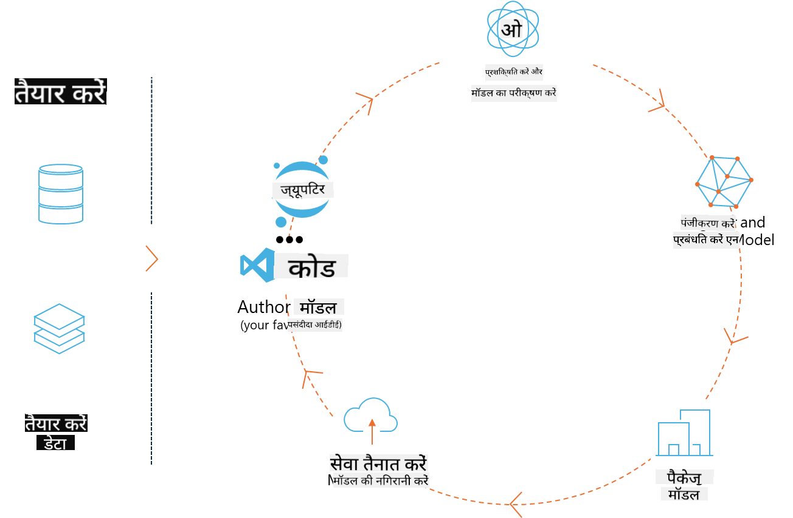
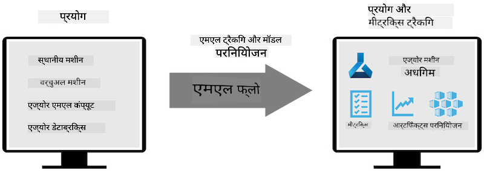
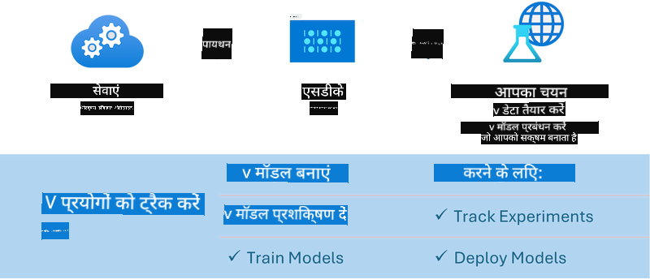

<!--
CO_OP_TRANSLATOR_METADATA:
{
  "original_hash": "1e42c399dcc2fa477925d3ef4038d403",
  "translation_date": "2025-04-04T18:21:53+00:00",
  "source_file": "md\\02.Application\\01.TextAndChat\\Phi3\\E2E_Phi-3-MLflow.md",
  "language_code": "hi"
}
-->
# एमएलफ्लो

[MLflow](https://mlflow.org/) एक ओपन-सोर्स प्लेटफ़ॉर्म है जिसे मशीन लर्निंग जीवनचक्र को प्रबंधित करने के लिए डिज़ाइन किया गया है।



एमएलफ्लो का उपयोग एमएल जीवनचक्र को प्रबंधित करने के लिए किया जाता है, जिसमें प्रयोग, पुनरुत्पादन, तैनाती और एक केंद्रीय मॉडल रजिस्ट्री शामिल है। एमएलफ्लो वर्तमान में चार घटक प्रदान करता है:

- **एमएलफ्लो ट्रैकिंग:** प्रयोग, कोड, डेटा कॉन्फ़िगरेशन और परिणामों को रिकॉर्ड और क्वेरी करें।
- **एमएलफ्लो प्रोजेक्ट्स:** डेटा साइंस कोड को एक ऐसे फॉर्मेट में पैकेज करें जो किसी भी प्लेटफ़ॉर्म पर रन को पुनरुत्पादित कर सके।
- **एमएलफ्लो मॉडल्स:** मशीन लर्निंग मॉडल्स को विभिन्न सर्विंग वातावरणों में तैनात करें।
- **मॉडल रजिस्ट्री:** मॉडल्स को एक केंद्रीय रिपॉजिटरी में स्टोर, एनोटेट और प्रबंधित करें।

यह प्रयोगों को ट्रैक करने, कोड को पुनरुत्पादित करने योग्य रन में पैकेज करने, और मॉडल्स को साझा और तैनात करने की क्षमताएं प्रदान करता है। एमएलफ्लो डैटाब्रिक्स में एकीकृत है और विभिन्न एमएल लाइब्रेरीज़ को सपोर्ट करता है, जिससे यह लाइब्रेरी-अज्ञेय बनता है। इसे किसी भी मशीन लर्निंग लाइब्रेरी और किसी भी प्रोग्रामिंग भाषा के साथ उपयोग किया जा सकता है, क्योंकि यह सुविधा के लिए REST API और CLI प्रदान करता है।



एमएलफ्लो की प्रमुख विशेषताओं में शामिल हैं:

- **एक्सपेरिमेंट ट्रैकिंग:** पैरामीटर्स और परिणामों को रिकॉर्ड और तुलना करें।
- **मॉडल प्रबंधन:** मॉडल्स को विभिन्न सर्विंग और इनफेरेंस प्लेटफॉर्म्स पर तैनात करें।
- **मॉडल रजिस्ट्री:** एमएलफ्लो मॉडल्स के जीवनचक्र को सामूहिक रूप से प्रबंधित करें, जिसमें संस्करण और एनोटेशन शामिल हैं।
- **प्रोजेक्ट्स:** एमएल कोड को साझा करने या प्रोडक्शन उपयोग के लिए पैकेज करें।

एमएलफ्लो एमएलऑप्स लूप को भी सपोर्ट करता है, जिसमें डेटा तैयार करना, मॉडल्स को पंजीकृत और प्रबंधित करना, मॉडल्स को निष्पादन के लिए पैकेज करना, सेवाओं को तैनात करना, और मॉडल्स की निगरानी करना शामिल है। इसका उद्देश्य प्रोटोटाइप से प्रोडक्शन वर्कफ़्लो में स्थानांतरित करने की प्रक्रिया को सरल बनाना है, विशेष रूप से क्लाउड और एज वातावरणों में।

## एंड-टू-एंड परिदृश्य - एक रैपर बनाना और एमएलफ्लो मॉडल के रूप में Phi-3 का उपयोग करना

इस एंड-टू-एंड नमूने में, हम Phi-3 छोटे भाषा मॉडल (SLM) के चारों ओर एक रैपर बनाने के दो अलग-अलग दृष्टिकोण प्रदर्शित करेंगे और फिर इसे एमएलफ्लो मॉडल के रूप में लोकल या क्लाउड में चलाएंगे, जैसे कि Azure मशीन लर्निंग कार्यक्षेत्र में।



| प्रोजेक्ट | विवरण | स्थान |
| ------------ | ----------- | -------- |
| ट्रांसफॉर्मर पाइपलाइन | यदि आप एमएलफ्लो के एक्सपेरिमेंटल ट्रांसफॉर्मर्स फ्लेवर के साथ HuggingFace मॉडल का उपयोग करना चाहते हैं, तो ट्रांसफॉर्मर पाइपलाइन रैपर बनाने का सबसे आसान विकल्प है। | [**TransformerPipeline.ipynb**](../../../../../../code/06.E2E/E2E_Phi-3-MLflow_TransformerPipeline.ipynb) |
| कस्टम पायथन रैपर | इस लेखन के समय, ट्रांसफॉर्मर पाइपलाइन HuggingFace मॉडल्स के लिए एमएलफ्लो रैपर जनरेशन को ONNX फॉर्मेट में सपोर्ट नहीं करती थी, भले ही एक्सपेरिमेंटल ऑप्टिमम पायथन पैकेज का उपयोग किया गया हो। ऐसे मामलों में, आप एमएलफ्लो मोड के लिए अपना कस्टम पायथन रैपर बना सकते हैं। | [**CustomPythonWrapper.ipynb**](../../../../../../code/06.E2E/E2E_Phi-3-MLflow_CustomPythonWrapper.ipynb) |

## प्रोजेक्ट: ट्रांसफॉर्मर पाइपलाइन

1. आपको एमएलफ्लो और HuggingFace से संबंधित पायथन पैकेज की आवश्यकता होगी:

    ``` Python
    import mlflow
    import transformers
    ```

2. इसके बाद, आपको HuggingFace रजिस्ट्री में लक्ष्य Phi-3 मॉडल का संदर्भ देकर एक ट्रांसफॉर्मर पाइपलाइन शुरू करनी चाहिए। जैसा कि _Phi-3-mini-4k-instruct_ के मॉडल कार्ड से देखा जा सकता है, इसका कार्य "टेक्स्ट जनरेशन" प्रकार का है:

    ``` Python
    pipeline = transformers.pipeline(
        task = "text-generation",
        model = "microsoft/Phi-3-mini-4k-instruct"
    )
    ```

3. अब आप अपने Phi-3 मॉडल की ट्रांसफॉर्मर पाइपलाइन को एमएलफ्लो फॉर्मेट में सेव कर सकते हैं और अतिरिक्त विवरण प्रदान कर सकते हैं, जैसे लक्ष्य आर्टिफैक्ट्स पथ, विशिष्ट मॉडल कॉन्फ़िगरेशन सेटिंग्स और इनफेरेंस API प्रकार:

    ``` Python
    model_info = mlflow.transformers.log_model(
        transformers_model = pipeline,
        artifact_path = "phi3-mlflow-model",
        model_config = model_config,
        task = "llm/v1/chat"
    )
    ```

## प्रोजेक्ट: कस्टम पायथन रैपर

1. हम यहां माइक्रोसॉफ्ट के [ONNX Runtime generate() API](https://github.com/microsoft/onnxruntime-genai) का उपयोग कर सकते हैं, जो ONNX मॉडल की इनफेरेंस और टोकन्स को एन्कोड/डीकोड करता है। आपको अपने लक्ष्य कंप्यूट के लिए _onnxruntime_genai_ पैकेज चुनना होगा, नीचे दिए गए उदाहरण में CPU को लक्षित किया गया है:

    ``` Python
    import mlflow
    from mlflow.models import infer_signature
    import onnxruntime_genai as og
    ```

1. हमारी कस्टम क्लास दो मेथड्स को लागू करती है: _load_context()_ **ONNX मॉडल**, **जेनरेटर पैरामीटर्स**, और **टोकनाइज़र** को प्रारंभ करने के लिए; और _predict()_ प्रदान किए गए प्रॉम्प्ट के लिए आउटपुट टोकन्स उत्पन्न करने के लिए:

    ``` Python
    class Phi3Model(mlflow.pyfunc.PythonModel):
        def load_context(self, context):
            # Retrieving model from the artifacts
            model_path = context.artifacts["phi3-mini-onnx"]
            model_options = {
                 "max_length": 300,
                 "temperature": 0.2,         
            }
        
            # Defining the model
            self.phi3_model = og.Model(model_path)
            self.params = og.GeneratorParams(self.phi3_model)
            self.params.set_search_options(**model_options)
            
            # Defining the tokenizer
            self.tokenizer = og.Tokenizer(self.phi3_model)
    
        def predict(self, context, model_input):
            # Retrieving prompt from the input
            prompt = model_input["prompt"][0]
            self.params.input_ids = self.tokenizer.encode(prompt)
    
            # Generating the model's response
            response = self.phi3_model.generate(self.params)
    
            return self.tokenizer.decode(response[0][len(self.params.input_ids):])
    ```

1. अब आप _mlflow.pyfunc.log_model()_ फंक्शन का उपयोग करके Phi-3 मॉडल के लिए एक कस्टम पायथन रैपर (पिकल फॉर्मेट में), मूल ONNX मॉडल और आवश्यक डिपेंडेंसीज़ के साथ जनरेट कर सकते हैं:

    ``` Python
    model_info = mlflow.pyfunc.log_model(
        artifact_path = artifact_path,
        python_model = Phi3Model(),
        artifacts = {
            "phi3-mini-onnx": "cpu_and_mobile/cpu-int4-rtn-block-32-acc-level-4",
        },
        input_example = input_example,
        signature = infer_signature(input_example, ["Run"]),
        extra_pip_requirements = ["torch", "onnxruntime_genai", "numpy"],
    )
    ```

## उत्पन्न एमएलफ्लो मॉडल्स के सिग्नेचर

1. ऊपर दिए गए ट्रांसफॉर्मर पाइपलाइन प्रोजेक्ट के चरण 3 में, हमने एमएलफ्लो मॉडल के टास्क को "_llm/v1/chat_" पर सेट किया। ऐसा निर्देश मॉडल के API रैपर को जनरेट करता है, जो OpenAI के चैट API के साथ संगत है, जैसा कि नीचे दिखाया गया है:

    ``` Python
    {inputs: 
      ['messages': Array({content: string (required), name: string (optional), role: string (required)}) (required), 'temperature': double (optional), 'max_tokens': long (optional), 'stop': Array(string) (optional), 'n': long (optional), 'stream': boolean (optional)],
    outputs: 
      ['id': string (required), 'object': string (required), 'created': long (required), 'model': string (required), 'choices': Array({finish_reason: string (required), index: long (required), message: {content: string (required), name: string (optional), role: string (required)} (required)}) (required), 'usage': {completion_tokens: long (required), prompt_tokens: long (required), total_tokens: long (required)} (required)],
    params: 
      None}
    ```

1. परिणामस्वरूप, आप अपना प्रॉम्प्ट निम्नलिखित फॉर्मेट में सबमिट कर सकते हैं:

    ``` Python
    messages = [{"role": "user", "content": "What is the capital of Spain?"}]
    ```

1. फिर, OpenAI API-संगत पोस्ट-प्रोसेसिंग का उपयोग करें, जैसे _response[0][‘choices’][0][‘message’][‘content’]_, अपने आउटपुट को इस प्रकार सुंदर बनाने के लिए:

    ``` JSON
    Question: What is the capital of Spain?
    
    Answer: The capital of Spain is Madrid. It is the largest city in Spain and serves as the political, economic, and cultural center of the country. Madrid is located in the center of the Iberian Peninsula and is known for its rich history, art, and architecture, including the Royal Palace, the Prado Museum, and the Plaza Mayor.
    
    Usage: {'prompt_tokens': 11, 'completion_tokens': 73, 'total_tokens': 84}
    ```

1. ऊपर दिए गए कस्टम पायथन रैपर प्रोजेक्ट के चरण 3 में, हमने एमएलफ्लो पैकेज को एक दिए गए इनपुट उदाहरण से मॉडल के सिग्नेचर को जनरेट करने की अनुमति दी। हमारे एमएलफ्लो रैपर का सिग्नेचर इस प्रकार दिखाई देगा:

    ``` Python
    {inputs: 
      ['prompt': string (required)],
    outputs: 
      [string (required)],
    params: 
      None}
    ```

1. इसलिए, हमारे प्रॉम्प्ट को "prompt" डिक्शनरी की कुंजी को इस तरह से शामिल करना होगा:

    ``` Python
    {"prompt": "<|system|>You are a stand-up comedian.<|end|><|user|>Tell me a joke about atom<|end|><|assistant|>",}
    ```

1. मॉडल का आउटपुट तब स्ट्रिंग फॉर्मेट में प्रदान किया जाएगा:

    ``` JSON
    Alright, here's a little atom-related joke for you!
    
    Why don't electrons ever play hide and seek with protons?
    
    Because good luck finding them when they're always "sharing" their electrons!
    
    Remember, this is all in good fun, and we're just having a little atomic-level humor!
    ```

**अस्वीकरण**:  
यह दस्तावेज़ AI अनुवाद सेवा [Co-op Translator](https://github.com/Azure/co-op-translator) का उपयोग करके अनुवादित किया गया है। हालांकि हम सटीकता सुनिश्चित करने का प्रयास करते हैं, कृपया ध्यान दें कि स्वचालित अनुवाद में त्रुटियां या अशुद्धियां हो सकती हैं। मूल दस्तावेज़, जो इसकी मूल भाषा में है, को आधिकारिक स्रोत माना जाना चाहिए। महत्वपूर्ण जानकारी के लिए, पेशेवर मानव अनुवाद की सिफारिश की जाती है। इस अनुवाद के उपयोग से उत्पन्न किसी भी गलतफहमी या गलत व्याख्या के लिए हम जिम्मेदार नहीं हैं।