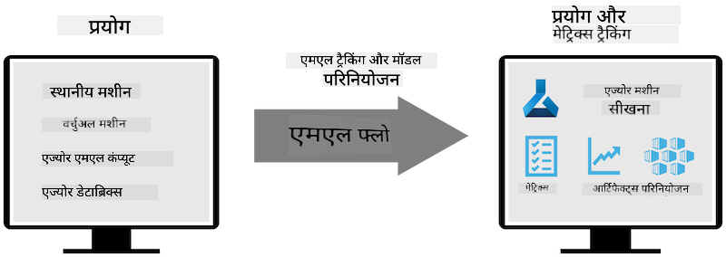
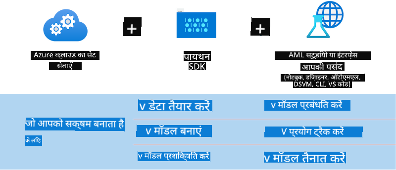

<!--
CO_OP_TRANSLATOR_METADATA:
{
  "original_hash": "f61c383bbf0c3dac97e43f833c258731",
  "translation_date": "2025-05-08T05:36:13+00:00",
  "source_file": "md/02.Application/01.TextAndChat/Phi3/E2E_Phi-3-MLflow.md",
  "language_code": "hi"
}
-->
# MLflow

[MLflow](https://mlflow.org/) एक ओपन-सोर्स प्लेटफॉर्म है जो मशीन लर्निंग के पूरे लाइफसायकल को मैनेज करने के लिए बनाया गया है।


MLFlow का उपयोग मशीन लर्निंग के लाइफसायकल को मैनेज करने के लिए किया जाता है, जिसमें एक्सपेरिमेंटेशन, पुनरुत्पादकता, डिप्लॉयमेंट और एक केंद्रीय मॉडल रजिस्ट्री शामिल है। MLflow वर्तमान में चार कंपोनेंट्स प्रदान करता है।

- **MLflow Tracking:** एक्सपेरिमेंट्स, कोड, डेटा कॉन्फिग और परिणामों को रिकॉर्ड और क्वेरी करें।
- **MLflow Projects:** डेटा साइंस कोड को ऐसे फॉर्मेट में पैकेज करें जिससे किसी भी प्लेटफॉर्म पर रन को पुनरुत्पादित किया जा सके।
- **Mlflow Models:** मशीन लर्निंग मॉडल्स को विभिन्न सर्विंग वातावरणों में डिप्लॉय करें।
- **Model Registry:** मॉडल्स को एक केंद्रीय रिपॉजिटरी में स्टोर, एनोटेट और मैनेज करें।

यह एक्सपेरिमेंट्स को ट्रैक करने, कोड को पुनरुत्पादित रन में पैकेज करने, और मॉडल्स को साझा करने व डिप्लॉय करने की क्षमताएं प्रदान करता है। MLFlow Databricks में इंटीग्रेटेड है और विभिन्न ML लाइब्रेरीज का समर्थन करता है, जिससे यह लाइब्रेरी-एग्नोस्टिक बन जाता है। इसे किसी भी मशीन लर्निंग लाइब्रेरी और किसी भी प्रोग्रामिंग भाषा के साथ इस्तेमाल किया जा सकता है, क्योंकि यह सुविधा के लिए REST API और CLI प्रदान करता है।



MLFlow की प्रमुख विशेषताएं निम्नलिखित हैं:

- **Experiment Tracking:** पैरामीटर्स और परिणामों को रिकॉर्ड और तुलना करें।
- **Model Management:** मॉडल्स को विभिन्न सर्विंग और इन्फरेंस प्लेटफॉर्म्स पर डिप्लॉय करें।
- **Model Registry:** MLflow मॉडल्स के लाइफसायकल को मिलकर मैनेज करें, जिसमें वर्शनिंग और एनोटेशन शामिल हैं।
- **Projects:** ML कोड को साझा करने या प्रोडक्शन उपयोग के लिए पैकेज करें।

MLFlow MLOps लूप का भी समर्थन करता है, जिसमें डेटा की तैयारी, मॉडल्स का रजिस्ट्रेशन और मैनेजमेंट, मॉडल्स को निष्पादन के लिए पैकेजिंग, सर्विसेज का डिप्लॉयमेंट और मॉडल्स की मॉनिटरिंग शामिल है। इसका उद्देश्य प्रोटोटाइप से प्रोडक्शन वर्कफ़्लो तक के प्रोसेस को सरल बनाना है, खासकर क्लाउड और एज वातावरणों में।

## E2E Scenario - Phi-3 के चारों ओर एक रैपर बनाना और MLFlow मॉडल के रूप में उपयोग करना

इस E2E उदाहरण में हम Phi-3 छोटे भाषा मॉडल (SLM) के चारों ओर रैपर बनाने के दो अलग-अलग तरीके दिखाएंगे और फिर इसे MLFlow मॉडल के रूप में लोकली या क्लाउड में, जैसे कि Azure Machine Learning वर्कस्पेस में चलाएंगे।



| प्रोजेक्ट | विवरण | स्थान |
| ------------ | ----------- | -------- |
| Transformer Pipeline | अगर आप MLFlow के एक्सपेरिमेंटल ट्रांसफॉर्मर्स फ्लेवर के साथ HuggingFace मॉडल का उपयोग करना चाहते हैं, तो Transformer Pipeline रैपर बनाने का सबसे आसान विकल्प है। | [**TransformerPipeline.ipynb**](../../../../../../code/06.E2E/E2E_Phi-3-MLflow_TransformerPipeline.ipynb) |
| Custom Python Wrapper | लेखन के समय, ट्रांसफॉर्मर पाइपलाइन MLFlow रैपर जनरेशन को ONNX फॉर्मेट में HuggingFace मॉडलों के लिए सपोर्ट नहीं करता था, भले ही एक्सपेरिमेंटल optimum Python पैकेज हो। ऐसे मामलों के लिए, आप MLFlow मॉडल के लिए अपना कस्टम Python रैपर बना सकते हैं। | [**CustomPythonWrapper.ipynb**](../../../../../../code/06.E2E/E2E_Phi-3-MLflow_CustomPythonWrapper.ipynb) |

## प्रोजेक्ट: Transformer Pipeline

1. आपको MLFlow और HuggingFace से संबंधित Python पैकेज की आवश्यकता होगी:

    ``` Python
    import mlflow
    import transformers
    ```

2. इसके बाद, आपको HuggingFace रजिस्ट्री में लक्षित Phi-3 मॉडल को संदर्भित करके ट्रांसफॉर्मर पाइपलाइन इनिशिएट करनी चाहिए। जैसा कि _Phi-3-mini-4k-instruct_ के मॉडल कार्ड में दिखाया गया है, इसका टास्क "Text Generation" प्रकार का है:

    ``` Python
    pipeline = transformers.pipeline(
        task = "text-generation",
        model = "microsoft/Phi-3-mini-4k-instruct"
    )
    ```

3. अब आप अपने Phi-3 मॉडल की ट्रांसफॉर्मर पाइपलाइन को MLFlow फॉर्मेट में सेव कर सकते हैं और अतिरिक्त विवरण जैसे टारगेट आर्टिफैक्ट्स पथ, विशिष्ट मॉडल कॉन्फ़िगरेशन सेटिंग्स और इन्फरेंस API प्रकार प्रदान कर सकते हैं:

    ``` Python
    model_info = mlflow.transformers.log_model(
        transformers_model = pipeline,
        artifact_path = "phi3-mlflow-model",
        model_config = model_config,
        task = "llm/v1/chat"
    )
    ```

## प्रोजेक्ट: Custom Python Wrapper

1. हम यहाँ Microsoft के [ONNX Runtime generate() API](https://github.com/microsoft/onnxruntime-genai) का उपयोग कर सकते हैं ONNX मॉडल के इन्फरेंस और टोकन एन्कोडिंग / डिकोडिंग के लिए। आपको अपने टारगेट कंप्यूट के लिए _onnxruntime_genai_ पैकेज चुनना होगा, नीचे दिए गए उदाहरण में CPU टारगेट है:

    ``` Python
    import mlflow
    from mlflow.models import infer_signature
    import onnxruntime_genai as og
    ```

1. हमारी कस्टम क्लास दो मेथड्स को इम्प्लीमेंट करती है: _load_context()_ जो Phi-3 Mini 4K Instruct के **ONNX मॉडल**, **जनरेटर पैरामीटर्स** और **टोकनाइज़र** को इनिशियलाइज़ करता है; और _predict()_ जो दिए गए प्रॉम्प्ट के लिए आउटपुट टोकन जनरेट करता है:

    ``` Python
    class Phi3Model(mlflow.pyfunc.PythonModel):
        def load_context(self, context):
            # Retrieving model from the artifacts
            model_path = context.artifacts["phi3-mini-onnx"]
            model_options = {
                 "max_length": 300,
                 "temperature": 0.2,         
            }
        
            # Defining the model
            self.phi3_model = og.Model(model_path)
            self.params = og.GeneratorParams(self.phi3_model)
            self.params.set_search_options(**model_options)
            
            # Defining the tokenizer
            self.tokenizer = og.Tokenizer(self.phi3_model)
    
        def predict(self, context, model_input):
            # Retrieving prompt from the input
            prompt = model_input["prompt"][0]
            self.params.input_ids = self.tokenizer.encode(prompt)
    
            # Generating the model's response
            response = self.phi3_model.generate(self.params)
    
            return self.tokenizer.decode(response[0][len(self.params.input_ids):])
    ```

1. अब आप _mlflow.pyfunc.log_model()_ फंक्शन का उपयोग कर सकते हैं Phi-3 मॉडल के लिए एक कस्टम Python रैपर (पिकल फॉर्मेट में) जनरेट करने के लिए, साथ ही ओरिजिनल ONNX मॉडल और आवश्यक डिपेंडेंसिस के साथ:

    ``` Python
    model_info = mlflow.pyfunc.log_model(
        artifact_path = artifact_path,
        python_model = Phi3Model(),
        artifacts = {
            "phi3-mini-onnx": "cpu_and_mobile/cpu-int4-rtn-block-32-acc-level-4",
        },
        input_example = input_example,
        signature = infer_signature(input_example, ["Run"]),
        extra_pip_requirements = ["torch", "onnxruntime_genai", "numpy"],
    )
    ```

## जनरेट किए गए MLFlow मॉडलों के सिग्नेचर

1. ऊपर Transformer Pipeline प्रोजेक्ट के चरण 3 में, हमने MLFlow मॉडल के टास्क को “_llm/v1/chat_” सेट किया था। ऐसी निर्देशना मॉडल का API रैपर जनरेट करती है, जो OpenAI के चैट API के साथ कम्पैटिबल होता है, जैसा कि नीचे दिखाया गया है:

    ``` Python
    {inputs: 
      ['messages': Array({content: string (required), name: string (optional), role: string (required)}) (required), 'temperature': double (optional), 'max_tokens': long (optional), 'stop': Array(string) (optional), 'n': long (optional), 'stream': boolean (optional)],
    outputs: 
      ['id': string (required), 'object': string (required), 'created': long (required), 'model': string (required), 'choices': Array({finish_reason: string (required), index: long (required), message: {content: string (required), name: string (optional), role: string (required)} (required)}) (required), 'usage': {completion_tokens: long (required), prompt_tokens: long (required), total_tokens: long (required)} (required)],
    params: 
      None}
    ```

1. परिणामस्वरूप, आप अपने प्रॉम्प्ट को निम्नलिखित फॉर्मेट में सबमिट कर सकते हैं:

    ``` Python
    messages = [{"role": "user", "content": "What is the capital of Spain?"}]
    ```

1. फिर, OpenAI API-संगत पोस्ट-प्रोसेसिंग का उपयोग करें, जैसे _response[0][‘choices’][0][‘message’][‘content’]_, ताकि आपका आउटपुट इस तरह सुंदर बने:

    ``` JSON
    Question: What is the capital of Spain?
    
    Answer: The capital of Spain is Madrid. It is the largest city in Spain and serves as the political, economic, and cultural center of the country. Madrid is located in the center of the Iberian Peninsula and is known for its rich history, art, and architecture, including the Royal Palace, the Prado Museum, and the Plaza Mayor.
    
    Usage: {'prompt_tokens': 11, 'completion_tokens': 73, 'total_tokens': 84}
    ```

1. ऊपर Custom Python Wrapper प्रोजेक्ट के चरण 3 में, हमने MLFlow पैकेज को मॉडल के सिग्नेचर को दिए गए इनपुट उदाहरण से जनरेट करने की अनुमति दी है। हमारे MLFlow रैपर का सिग्नेचर इस तरह दिखेगा:

    ``` Python
    {inputs: 
      ['prompt': string (required)],
    outputs: 
      [string (required)],
    params: 
      None}
    ```

1. इसलिए, हमारे प्रॉम्प्ट में "prompt" डिक्शनरी की को शामिल होना चाहिए, कुछ इस तरह:

    ``` Python
    {"prompt": "<|system|>You are a stand-up comedian.<|end|><|user|>Tell me a joke about atom<|end|><|assistant|>",}
    ```

1. मॉडल का आउटपुट फिर स्ट्रिंग फॉर्मेट में प्रदान किया जाएगा:

    ``` JSON
    Alright, here's a little atom-related joke for you!
    
    Why don't electrons ever play hide and seek with protons?
    
    Because good luck finding them when they're always "sharing" their electrons!
    
    Remember, this is all in good fun, and we're just having a little atomic-level humor!
    ```

**अस्वीकरण**:  
इस दस्तावेज़ का अनुवाद AI अनुवाद सेवा [Co-op Translator](https://github.com/Azure/co-op-translator) का उपयोग करके किया गया है। जबकि हम सटीकता के लिए प्रयासरत हैं, कृपया ध्यान दें कि स्वचालित अनुवादों में त्रुटियाँ या गलतियां हो सकती हैं। मूल दस्तावेज़ अपनी मूल भाषा में ही आधिकारिक स्रोत माना जाना चाहिए। महत्वपूर्ण जानकारी के लिए पेशेवर मानव अनुवाद की सलाह दी जाती है। इस अनुवाद के उपयोग से उत्पन्न किसी भी गलतफहमी या गलत व्याख्या के लिए हम उत्तरदायी नहीं हैं।