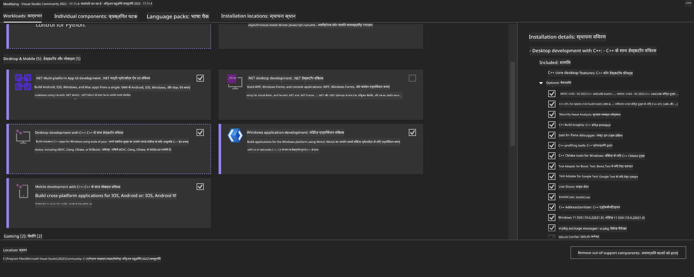
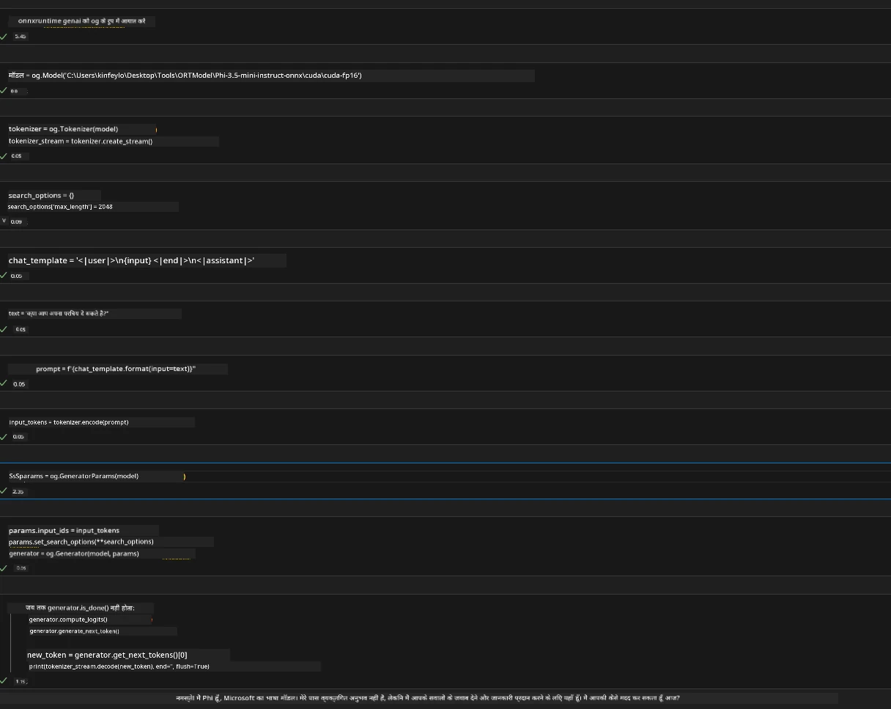
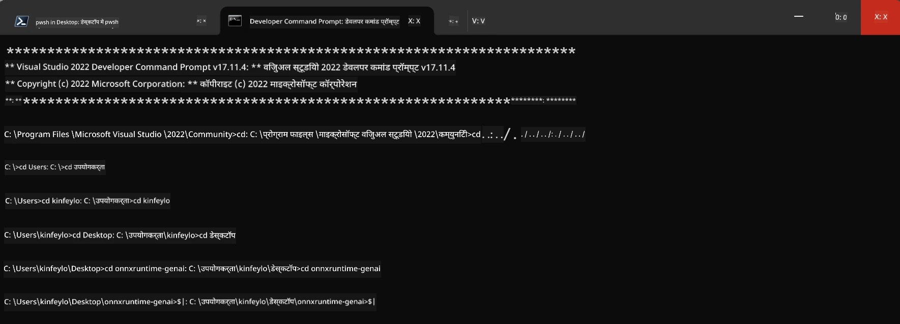

# **OnnxRuntime GenAI Windows GPU के लिए मार्गदर्शिका**

यह मार्गदर्शिका Windows पर GPU के साथ ONNX Runtime (ORT) सेटअप और उपयोग करने के चरण प्रदान करती है। इसका उद्देश्य आपके मॉडल के लिए GPU एक्सेलेरेशन का लाभ उठाना है, जिससे प्रदर्शन और दक्षता में सुधार हो।

दस्तावेज़ में निम्नलिखित विषयों पर मार्गदर्शन दिया गया है:

- पर्यावरण सेटअप: CUDA, cuDNN, और ONNX Runtime जैसी आवश्यक निर्भरताओं को स्थापित करने के निर्देश।
- कॉन्फ़िगरेशन: GPU संसाधनों का प्रभावी उपयोग करने के लिए पर्यावरण और ONNX Runtime को कैसे कॉन्फ़िगर करें।
- अनुकूलन सुझाव: बेहतर प्रदर्शन के लिए GPU सेटिंग्स को कैसे फाइन-ट्यून करें।

### **1. Python 3.10.x /3.11.8**

   ***Note*** अपने Python पर्यावरण के लिए [miniforge](https://github.com/conda-forge/miniforge/releases/latest/download/Miniforge3-Windows-x86_64.exe) का उपयोग करने की सलाह दी जाती है

   ```bash

   conda create -n pydev python==3.11.8

   conda activate pydev

   ```

   ***Reminder*** यदि आपने Python ONNX लाइब्रेरी इंस्टॉल की है, तो कृपया उसे अनइंस्टॉल कर दें

### **2. winget के साथ CMake इंस्टॉल करें**


   ```bash

   winget install -e --id Kitware.CMake

   ```

### **3. Visual Studio 2022 - Desktop Development with C++ इंस्टॉल करें**

   ***Note*** यदि आप कंपाइल नहीं करना चाहते हैं तो इस चरण को छोड़ सकते हैं




### **4. NVIDIA ड्राइवर इंस्टॉल करें**

1. **NVIDIA GPU ड्राइवर**  [https://www.nvidia.com/en-us/drivers/](https://www.nvidia.com/en-us/drivers/)

2. **NVIDIA CUDA 12.4** [https://developer.nvidia.com/cuda-12-4-0-download-archive](https://developer.nvidia.com/cuda-12-4-0-download-archive)

3. **NVIDIA CUDNN 9.4**  [https://developer.nvidia.com/cudnn-downloads](https://developer.nvidia.com/cudnn-downloads)

***Reminder*** कृपया इंस्टॉलेशन प्रक्रिया में डिफ़ॉल्ट सेटिंग्स का उपयोग करें

### **5. NVIDIA पर्यावरण सेट करें**

NVIDIA CUDNN 9.4 के lib, bin, include फ़ोल्डर को NVIDIA CUDA 12.4 के lib, bin, include में कॉपी करें

- *'C:\Program Files\NVIDIA\CUDNN\v9.4\bin\12.6'* की फाइलें *'C:\Program Files\NVIDIA GPU Computing Toolkit\CUDA\v12.4\bin'* में कॉपी करें

- *'C:\Program Files\NVIDIA\CUDNN\v9.4\include\12.6'* की फाइलें *'C:\Program Files\NVIDIA GPU Computing Toolkit\CUDA\v12.4\include'* में कॉपी करें

- *'C:\Program Files\NVIDIA\CUDNN\v9.4\lib\12.6'* की फाइलें *'C:\Program Files\NVIDIA GPU Computing Toolkit\CUDA\v12.4\lib\x64'* में कॉपी करें


### **6. Phi-3.5-mini-instruct-onnx डाउनलोड करें**


   ```bash

   winget install -e --id Git.Git

   winget install -e --id GitHub.GitLFS

   git lfs install

   git clone https://huggingface.co/microsoft/Phi-3.5-mini-instruct-onnx

   ```

### **7. InferencePhi35Instruct.ipynb चलाएं**

   [Notebook](../../../../../../code/09.UpdateSamples/Aug/ortgpu-phi35-instruct.ipynb) खोलें और इसे निष्पादित करें





### **8. ORT GenAI GPU कंपाइल करें**


   ***Note*** 
   
   1. कृपया सबसे पहले onnx, onnxruntime और onnxruntime-genai से संबंधित सभी पैकेज अनइंस्टॉल करें

   
   ```bash

   pip list 
   
   ```

   फिर सभी onnxruntime लाइब्रेरीज़ अनइंस्टॉल करें, जैसे कि 


   ```bash

   pip uninstall onnxruntime

   pip uninstall onnxruntime-genai

   pip uninstall onnxruntume-genai-cuda
   
   ```

   2. Visual Studio एक्सटेंशन सपोर्ट जांचें 

   जांचें कि C:\Program Files\NVIDIA GPU Computing Toolkit\CUDA\v12.4\extras में C:\Program Files\NVIDIA GPU Computing Toolkit\CUDA\v12.4\extras\visual_studio_integration मौजूद है या नहीं। 
   
   यदि नहीं है, तो अन्य CUDA टूलकिट ड्राइवर फ़ोल्डर्स देखें और visual_studio_integration फ़ोल्डर और उसकी सामग्री को C:\Program Files\NVIDIA GPU Computing Toolkit\CUDA\v12.4\extras\visual_studio_integration में कॉपी करें


   - यदि आप कंपाइल नहीं करना चाहते हैं तो इस चरण को छोड़ सकते हैं


   ```bash

   git clone https://github.com/microsoft/onnxruntime-genai

   ```

   - [https://github.com/microsoft/onnxruntime/releases/download/v1.19.2/onnxruntime-win-x64-gpu-1.19.2.zip](https://github.com/microsoft/onnxruntime/releases/download/v1.19.2/onnxruntime-win-x64-gpu-1.19.2.zip) से डाउनलोड करें

   - onnxruntime-win-x64-gpu-1.19.2.zip को अनज़िप करें, और इसे **ort** नाम दें, फिर ort फ़ोल्डर को onnxruntime-genai में कॉपी करें

   - Windows Terminal का उपयोग करते हुए, VS 2022 के Developer Command Prompt में जाएं और onnxruntime-genai पर जाएं



   - इसे अपने Python पर्यावरण के साथ कंपाइल करें

   
   ```bash

   cd onnxruntime-genai

   python build.py --use_cuda  --cuda_home "C:\Program Files\NVIDIA GPU Computing Toolkit\CUDA\v12.4" --config Release
 

   cd build/Windows/Release/Wheel

   pip install .whl

   ```

**अस्वीकरण**:  
यह दस्तावेज़ AI अनुवाद सेवा [Co-op Translator](https://github.com/Azure/co-op-translator) का उपयोग करके अनुवादित किया गया है। जबकि हम सटीकता के लिए प्रयासरत हैं, कृपया ध्यान दें कि स्वचालित अनुवादों में त्रुटियाँ या अशुद्धियाँ हो सकती हैं। मूल दस्तावेज़ अपनी मूल भाषा में ही अधिकारिक स्रोत माना जाना चाहिए। महत्वपूर्ण जानकारी के लिए, पेशेवर मानव अनुवाद की सलाह दी जाती है। इस अनुवाद के उपयोग से उत्पन्न किसी भी गलतफहमी या गलत व्याख्या के लिए हम जिम्मेदार नहीं हैं।