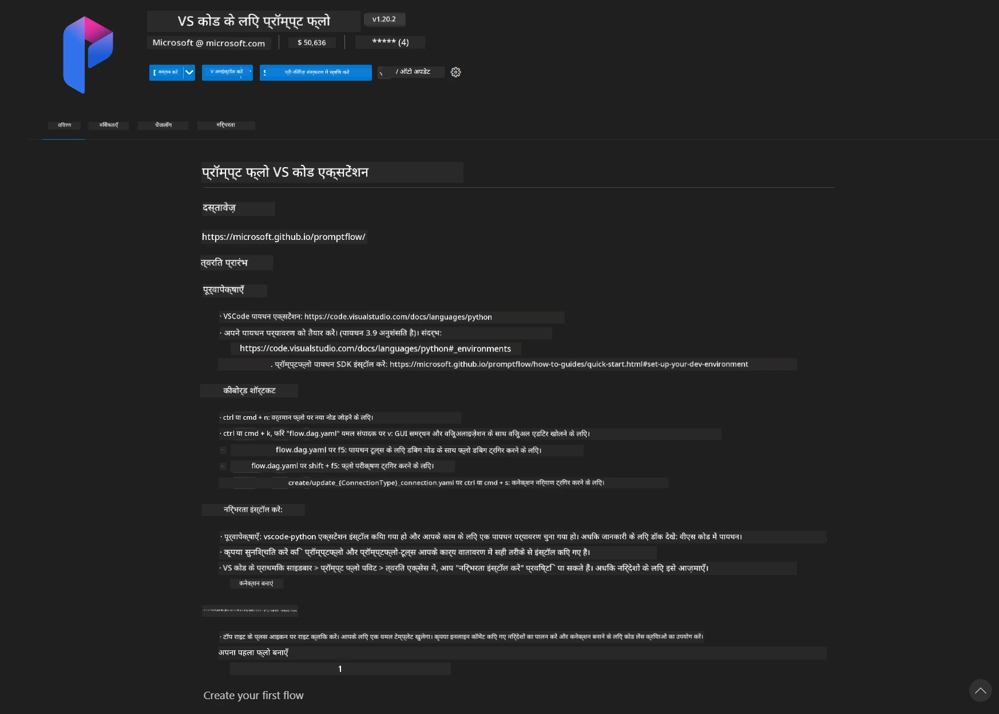
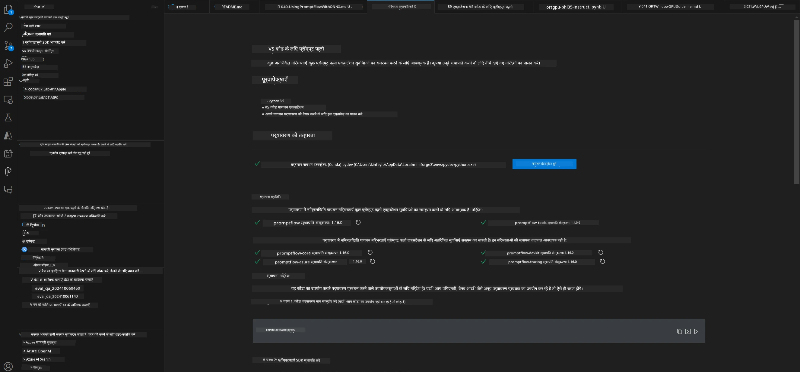
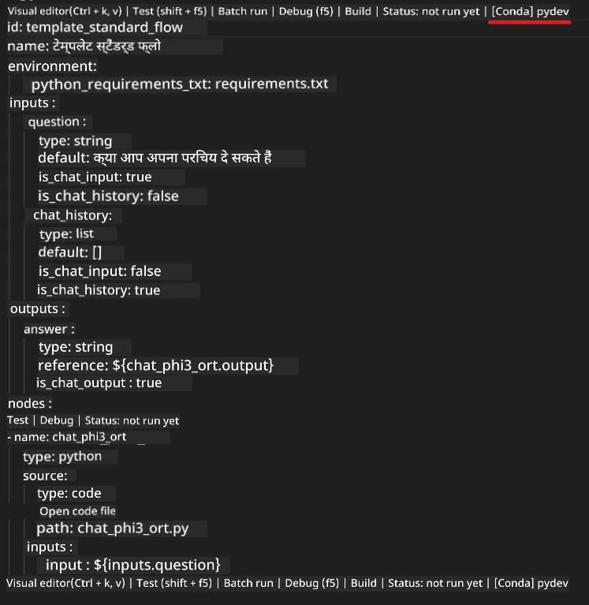
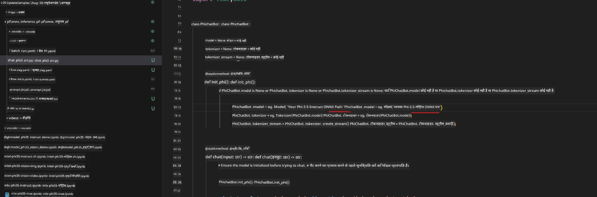
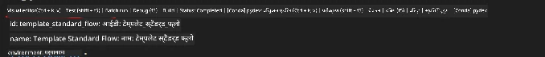
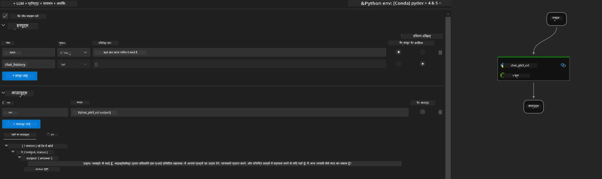
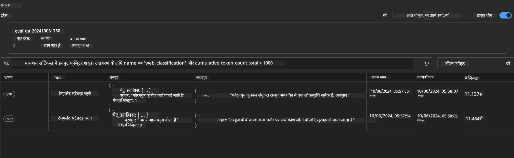

<!--
CO_OP_TRANSLATOR_METADATA:
{
  "original_hash": "92e7dac1e5af0dd7c94170fdaf6860fe",
  "translation_date": "2025-07-17T02:58:39+00:00",
  "source_file": "md/02.Application/01.TextAndChat/Phi3/UsingPromptFlowWithONNX.md",
  "language_code": "hi"
}
-->
# Windows GPU का उपयोग करके Phi-3.5-Instruct ONNX के साथ Prompt flow समाधान बनाना

निम्नलिखित दस्तावेज़ यह उदाहरण प्रस्तुत करता है कि Phi-3 मॉडल पर आधारित AI एप्लिकेशन विकसित करने के लिए ONNX (Open Neural Network Exchange) के साथ PromptFlow का उपयोग कैसे किया जाए।

PromptFlow एक विकास उपकरणों का समूह है, जो LLM-आधारित (Large Language Model) AI एप्लिकेशन के संपूर्ण विकास चक्र को सरल बनाने के लिए डिज़ाइन किया गया है, जिसमें विचार-विमर्श, प्रोटोटाइपिंग, परीक्षण और मूल्यांकन शामिल हैं।

PromptFlow को ONNX के साथ एकीकृत करके, डेवलपर्स निम्न कर सकते हैं:

- मॉडल प्रदर्शन का अनुकूलन करें: कुशल मॉडल इन्फरेंस और तैनाती के लिए ONNX का लाभ उठाएं।
- विकास को सरल बनाएं: वर्कफ़्लो प्रबंधन और दोहराए जाने वाले कार्यों को स्वचालित करने के लिए PromptFlow का उपयोग करें।
- सहयोग को बढ़ावा दें: एक एकीकृत विकास वातावरण प्रदान करके टीम के सदस्यों के बीच बेहतर सहयोग को सक्षम करें।

**Prompt flow** एक विकास उपकरणों का समूह है, जो LLM-आधारित AI एप्लिकेशन के संपूर्ण विकास चक्र को सरल बनाने के लिए डिज़ाइन किया गया है, जिसमें विचार-विमर्श, प्रोटोटाइपिंग, परीक्षण, मूल्यांकन से लेकर उत्पादन तैनाती और निगरानी तक शामिल है। यह प्रॉम्प्ट इंजीनियरिंग को बहुत आसान बनाता है और आपको उत्पादन गुणवत्ता वाले LLM ऐप्स बनाने में सक्षम बनाता है।

Prompt flow OpenAI, Azure OpenAI Service, और कस्टमाइजेबल मॉडल्स (Huggingface, स्थानीय LLM/SLM) से कनेक्ट हो सकता है। हम Phi-3.5 के क्वांटाइज़्ड ONNX मॉडल को स्थानीय एप्लिकेशन में तैनात करने की उम्मीद करते हैं। Prompt flow हमें अपने व्यवसाय की बेहतर योजना बनाने और Phi-3.5 पर आधारित स्थानीय समाधान पूरा करने में मदद कर सकता है। इस उदाहरण में, हम Windows GPU पर आधारित Prompt flow समाधान पूरा करने के लिए ONNX Runtime GenAI लाइब्रेरी को संयोजित करेंगे।

## **इंस्टॉलेशन**

### **Windows GPU के लिए ONNX Runtime GenAI**

Windows GPU के लिए ONNX Runtime GenAI सेट करने के लिए इस गाइडलाइन को पढ़ें [यहाँ क्लिक करें](./ORTWindowGPUGuideline.md)

### **VSCode में Prompt flow सेटअप करें**

1. Prompt flow VS Code एक्सटेंशन इंस्टॉल करें



2. Prompt flow VS Code एक्सटेंशन इंस्टॉल करने के बाद, एक्सटेंशन पर क्लिक करें, और **Installation dependencies** चुनें, इस गाइडलाइन का पालन करते हुए अपने पर्यावरण में Prompt flow SDK इंस्टॉल करें



3. [Sample Code](../../../../../../code/09.UpdateSamples/Aug/pf/onnx_inference_pf) डाउनलोड करें और VS Code में इस सैंपल को खोलें


4. अपनी Python पर्यावरण चुनने के लिए **flow.dag.yaml** खोलें



   अपनी Phi-3.5-instruct ONNX मॉडल का स्थान बदलने के लिए **chat_phi3_ort.py** खोलें



5. अपने prompt flow को परीक्षण के लिए चलाएं

**flow.dag.yaml** खोलें और विज़ुअल एडिटर पर क्लिक करें



इस पर क्लिक करने के बाद, इसे चलाकर परीक्षण करें



1. आप टर्मिनल में बैच चला सकते हैं ताकि अधिक परिणाम देख सकें

```bash

pf run create --file batch_run.yaml --stream --name 'Your eval qa name'    

```

आप अपने डिफ़ॉल्ट ब्राउज़र में परिणाम देख सकते हैं



**अस्वीकरण**:  
यह दस्तावेज़ AI अनुवाद सेवा [Co-op Translator](https://github.com/Azure/co-op-translator) का उपयोग करके अनुवादित किया गया है। जबकि हम सटीकता के लिए प्रयासरत हैं, कृपया ध्यान दें कि स्वचालित अनुवादों में त्रुटियाँ या अशुद्धियाँ हो सकती हैं। मूल दस्तावेज़ अपनी मूल भाषा में ही अधिकारिक स्रोत माना जाना चाहिए। महत्वपूर्ण जानकारी के लिए, पेशेवर मानव अनुवाद की सलाह दी जाती है। इस अनुवाद के उपयोग से उत्पन्न किसी भी गलतफहमी या गलत व्याख्या के लिए हम जिम्मेदार नहीं हैं।