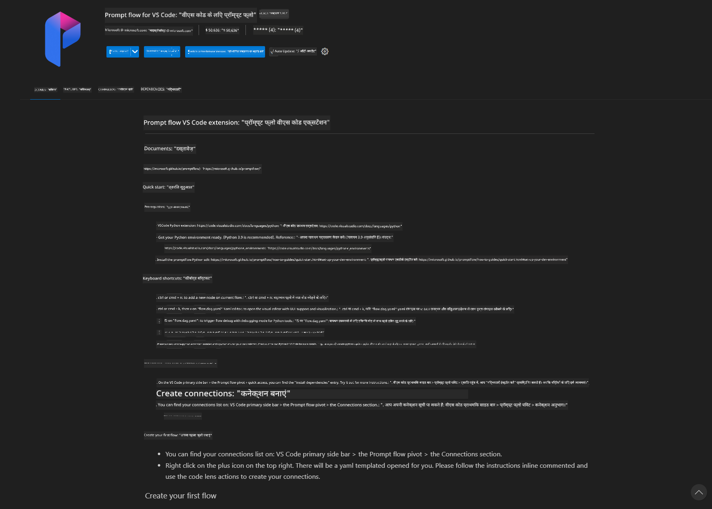
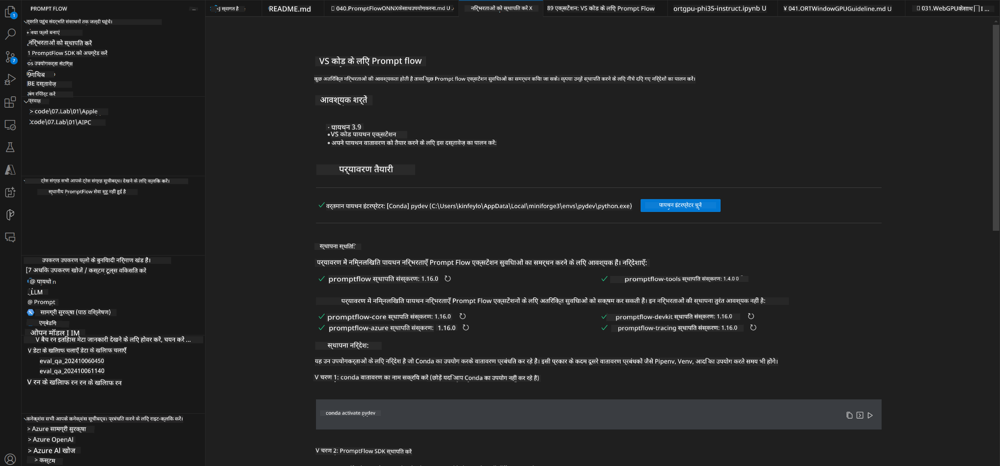
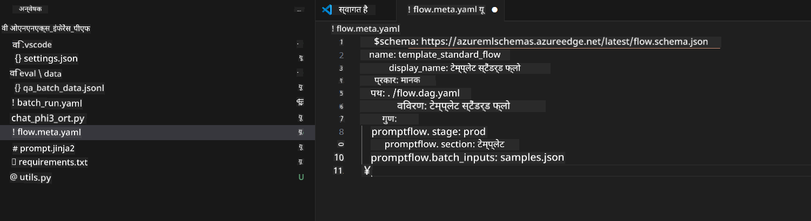
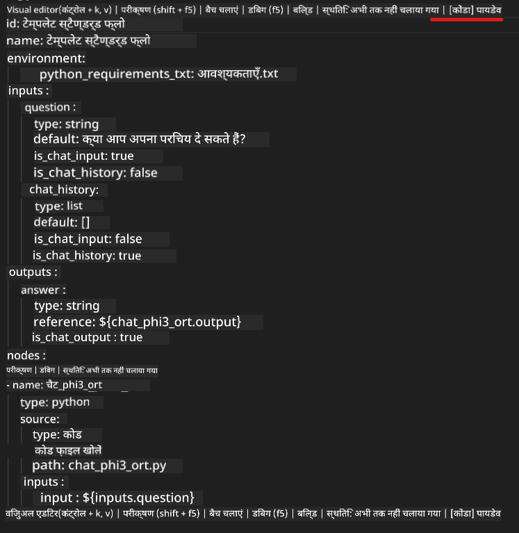
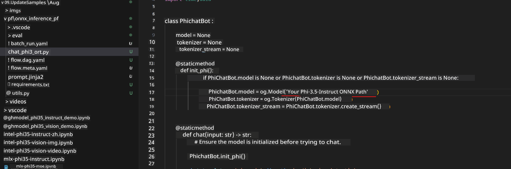
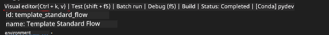
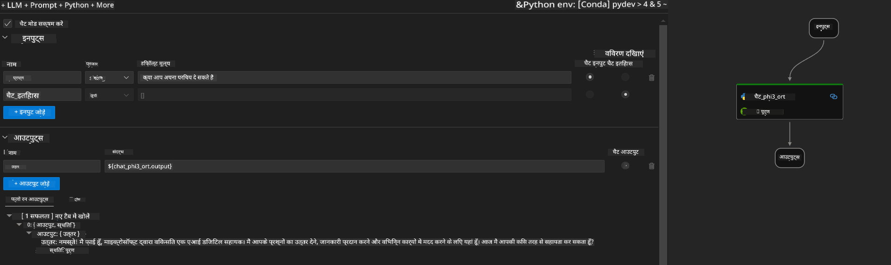
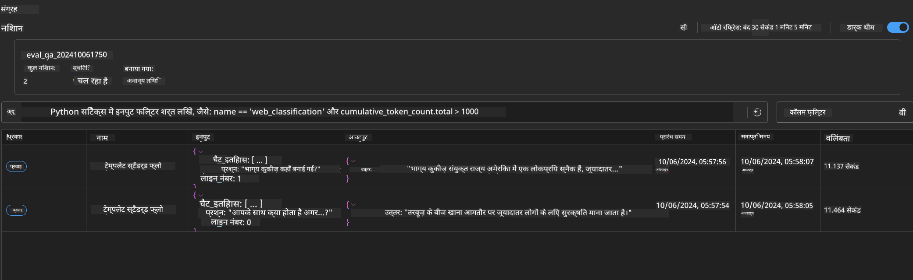

<!--
CO_OP_TRANSLATOR_METADATA:
{
  "original_hash": "20c7e34651318736a2606d351fcc37d0",
  "translation_date": "2025-04-04T18:25:11+00:00",
  "source_file": "md\\02.Application\\01.TextAndChat\\Phi3\\UsingPromptFlowWithONNX.md",
  "language_code": "hi"
}
-->
# Windows GPU का उपयोग करके Phi-3.5-Instruct ONNX के साथ Prompt Flow समाधान बनाना

निम्न दस्तावेज़ एक उदाहरण है कि कैसे ONNX (Open Neural Network Exchange) के साथ PromptFlow का उपयोग करके Phi-3 मॉडल पर आधारित AI एप्लिकेशन विकसित किए जा सकते हैं।

PromptFlow एक डेवलपमेंट टूल्स का सेट है जो LLM-आधारित (Large Language Model) AI एप्लिकेशन के एंड-टू-एंड डेवलपमेंट चक्र को सरल बनाता है, जिसमें विचार निर्माण, प्रोटोटाइपिंग, परीक्षण और मूल्यांकन शामिल है।

PromptFlow को ONNX के साथ एकीकृत करके, डेवलपर्स निम्नलिखित लाभ प्राप्त कर सकते हैं:

- **मॉडल प्रदर्शन को अनुकूलित करें**: ONNX का उपयोग करके मॉडल इन्फेरेंस और डिप्लॉयमेंट को अधिक कुशल बनाएं।
- **डेवलपमेंट को सरल बनाएं**: वर्कफ़्लो को प्रबंधित करने और दोहराव वाले कार्यों को स्वचालित करने के लिए PromptFlow का उपयोग करें।
- **सहयोग को बढ़ावा दें**: टीम के सदस्यों के बीच बेहतर सहयोग को सक्षम करने के लिए एकीकृत डेवलपमेंट वातावरण प्रदान करें।

**Prompt flow** एक डेवलपमेंट टूल्स का सेट है जो LLM-आधारित AI एप्लिकेशन के एंड-टू-एंड डेवलपमेंट चक्र को सरल बनाता है, जिसमें विचार निर्माण, प्रोटोटाइपिंग, परीक्षण, मूल्यांकन, उत्पादन में डिप्लॉयमेंट और मॉनिटरिंग शामिल है। यह प्रॉम्प्ट इंजीनियरिंग को काफी आसान बनाता है और आपको उत्पादन गुणवत्ता वाले LLM एप्लिकेशन बनाने में सक्षम बनाता है।

Prompt flow OpenAI, Azure OpenAI Service, और कस्टमाइज़ेबल मॉडल्स (Huggingface, स्थानीय LLM/SLM) से जुड़ सकता है। हम Phi-3.5 के क्वांटाइज़्ड ONNX मॉडल को स्थानीय एप्लिकेशन में डिप्लॉय करना चाहते हैं। Prompt flow हमें अपने व्यवसाय की बेहतर योजना बनाने और Phi-3.5 पर आधारित स्थानीय समाधान पूरा करने में मदद कर सकता है। इस उदाहरण में, हम ONNX Runtime GenAI लाइब्रेरी को Windows GPU पर आधारित Prompt flow समाधान पूरा करने के लिए जोड़ेंगे।

## **इंस्टॉलेशन**

### **Windows GPU के लिए ONNX Runtime GenAI**

Windows GPU के लिए ONNX Runtime GenAI सेट करने के लिए इस गाइड को पढ़ें [यहां क्लिक करें](./ORTWindowGPUGuideline.md)

### **VSCode में Prompt flow सेट करें**

1. Prompt flow VS Code एक्सटेंशन इंस्टॉल करें



2. Prompt flow VS Code एक्सटेंशन इंस्टॉल करने के बाद, एक्सटेंशन पर क्लिक करें और **Installation dependencies** चुनें। इस गाइडलाइन का पालन करते हुए अपनी एन्वायरनमेंट में Prompt flow SDK इंस्टॉल करें।



3. [सैंपल कोड](../../../../../../code/09.UpdateSamples/Aug/pf/onnx_inference_pf) डाउनलोड करें और इस सैंपल को VS Code में खोलें।



4. **flow.dag.yaml** खोलें और अपना Python एन्वायरनमेंट चुनें।



   **chat_phi3_ort.py** खोलें और अपने Phi-3.5-instruct ONNX मॉडल का लोकेशन बदलें।



5. अपना Prompt flow चलाकर परीक्षण करें।

**flow.dag.yaml** खोलें और विजुअल एडिटर पर क्लिक करें।



इस पर क्लिक करने के बाद, इसे चलाएं और परीक्षण करें।



1. आप टर्मिनल में बैच चलाकर अधिक परिणाम देख सकते हैं।

```bash

pf run create --file batch_run.yaml --stream --name 'Your eval qa name'    

```

आप अपने डिफॉल्ट ब्राउज़र में परिणाम देख सकते हैं।



**अस्वीकरण**:  
यह दस्तावेज़ AI अनुवाद सेवा [Co-op Translator](https://github.com/Azure/co-op-translator) का उपयोग करके अनुवादित किया गया है। जबकि हम सटीकता सुनिश्चित करने का प्रयास करते हैं, कृपया ध्यान दें कि स्वचालित अनुवाद में त्रुटियाँ या गलतियाँ हो सकती हैं। मूल दस्तावेज़, जो इसकी मूल भाषा में है, को प्रामाणिक स्रोत माना जाना चाहिए। महत्वपूर्ण जानकारी के लिए, पेशेवर मानव अनुवाद की सिफारिश की जाती है। इस अनुवाद के उपयोग से उत्पन्न किसी भी गलतफहमी या गलत व्याख्या के लिए हम उत्तरदायी नहीं हैं।