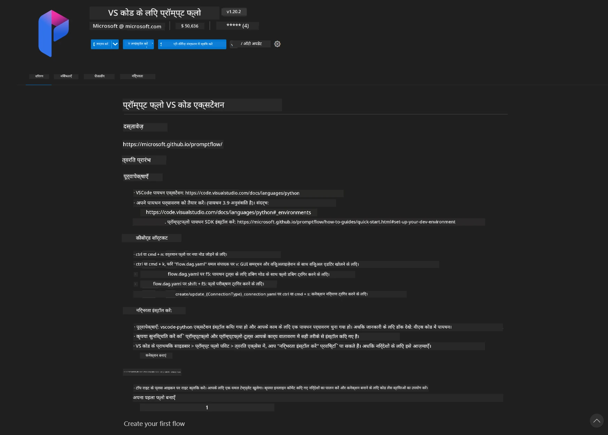
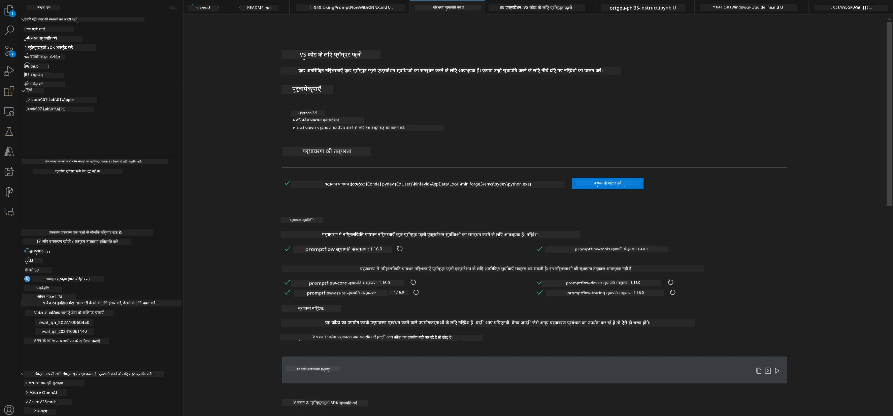
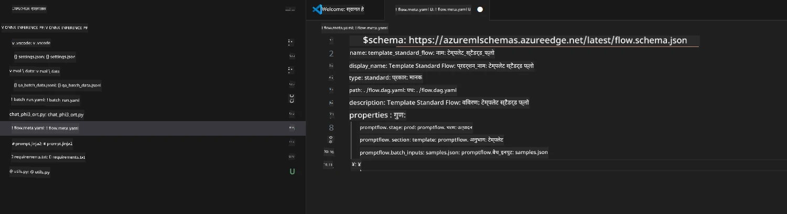
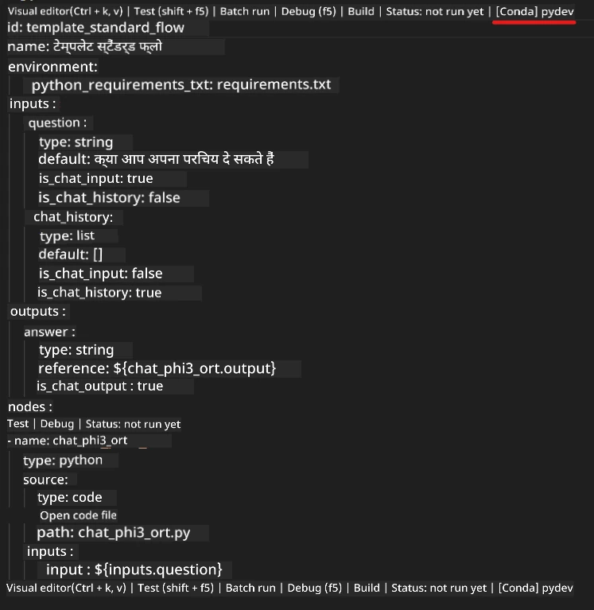
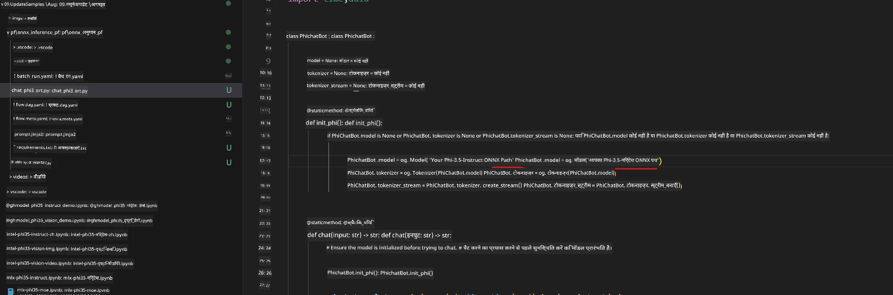
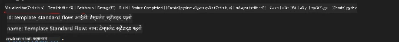
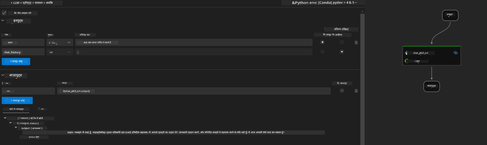
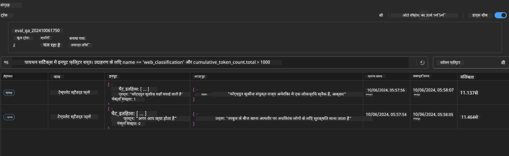

# Phi-3.5-Instruct ONNX के साथ Windows GPU का उपयोग करके Prompt flow समाधान बनाना 

निम्नलिखित दस्तावेज़ एक उदाहरण है कि Phi-3 मॉडलों पर आधारित AI अनुप्रयोग विकसित करने के लिए ONNX (Open Neural Network Exchange) के साथ PromptFlow का उपयोग कैसे करें।

PromptFlow एक विकास उपकरणों का समूह है जिसे LLM-आधारित (Large Language Model) AI अनुप्रयोगों के संपूर्ण विकास चक्र को सरल बनाने के लिए डिज़ाइन किया गया है, जिसमें विचार-विमर्श, प्रोटोटाइपिंग से लेकर परीक्षण और मूल्यांकन शामिल हैं।

PromptFlow को ONNX के साथ एकीकृत करके, डेवलपर्स निम्न कर सकते हैं:

- मॉडल प्रदर्शन को अनुकूलित करें: कुशल मॉडल निष्पादन और तैनाती के लिए ONNX का उपयोग करें।
- विकास सरल बनाएं: वर्कफ़्लो को प्रबंधित करने और दोहराए जाने वाले कार्यों को स्वचालित करने के लिए PromptFlow का उपयोग करें।
- सहयोग बढ़ाएं: एक एकीकृत विकास वातावरण प्रदान करके टीम के सदस्यों के बीच बेहतर सहयोग को सुविधाजनक बनाएं।

**Prompt flow** विकास उपकरणों का एक समूह है जिसे LLM-आधारित AI अनुप्रयोगों के अंत से अंत तक विकास चक्र को सरल बनाने के लिए डिज़ाइन किया गया है, जिसमें विचार-विमर्श, प्रोटोटाइपिंग, परीक्षण, मूल्यांकन से लेकर उत्पादन तैनाती और निगरानी तक शामिल है। यह prompt इंजीनियरिंग को बहुत आसान बनाता है और आपको उत्पादन गुणवत्ता के साथ LLM ऐप्स बनाने में सक्षम बनाता है।

Prompt flow OpenAI, Azure OpenAI सेवा, और अनुकूलनीय मॉडलों (Huggingface, स्थानीय LLM/SLM) से जुड़ सकता है। हम Phi-3.5 के क्वांटाइज्ड ONNX मॉडल को स्थानीय अनुप्रयोगों पर तैनात करने की उम्मीद करते हैं। Prompt flow हमें हमारे व्यवसाय की बेहतर योजना बनाने और Phi-3.5 पर आधारित स्थानीय समाधानों को पूरा करने में मदद कर सकता है। इस उदाहरण में, हम Prompt flow समाधान को Windows GPU पर आधारित पूरा करने के लिए ONNX Runtime GenAI लाइब्रेरी को जोड़ेंगे।

## **स्थापना**

### **Windows GPU के लिए ONNX Runtime GenAI**

Windows GPU के लिए ONNX Runtime GenAI सेट करने के लिए इस मार्गदर्शिका को पढ़ें [यहाँ क्लिक करें](./ORTWindowGPUGuideline.md)

### **VSCode में Prompt flow सेट करें**

1. Prompt flow VS Code एक्सटेंशन इंस्टॉल करें



2. Prompt flow VS Code एक्सटेंशन इंस्टॉल करने के बाद, एक्सटेंशन पर क्लिक करें, और **Installation dependencies** चुनें, इस मार्गदर्शिका का पालन करके अपने वातावरण में Prompt flow SDK स्थापित करें



3. [Sample Code](../../../../../../code/09.UpdateSamples/Aug/pf/onnx_inference_pf) डाउनलोड करें और इस सैंपल को VS Code में खोलें



4. अपनी Python एन्वायरनमेंट चुनने के लिए **flow.dag.yaml** खोलें



   अपनी Phi-3.5-instruct ONNX मॉडल स्थान बदलने के लिए **chat_phi3_ort.py** खोलें



5. परीक्षण के लिए अपनी prompt flow चलाएं

**flow.dag.yaml** खोलें और विज़ुअल एडिटर पर क्लिक करें



इसे क्लिक करने के बाद, परीक्षण के लिए इसे चलाएं



1. आप अधिक परिणाम जांचने के लिए टर्मिनल में बैच चला सकते हैं


```bash

pf run create --file batch_run.yaml --stream --name 'Your eval qa name'    

```

आप अपने डिफ़ॉल्ट ब्राउज़र में परिणाम देख सकते हैं




---

<!-- CO-OP TRANSLATOR DISCLAIMER START -->
**अस्वीकरण**:
इस दस्तावेज़ का अनुवाद AI अनुवाद सेवा [Co-op Translator](https://github.com/Azure/co-op-translator) का उपयोग करके किया गया है। जबकि हम सटीकता के लिए प्रयास करते हैं, कृपया ध्यान दें कि स्वचालित अनुवादों में त्रुटियाँ या अशुद्धियाँ हो सकती हैं। मूल दस्तावेज़ अपनी मूल भाषा में ही प्रामाणिक स्रोत माना जाना चाहिए। महत्वपूर्ण जानकारी के लिए, पेशेवर मानव अनुवाद की सिफारिश की जाती है। इस अनुवाद के उपयोग से उत्पन्न किसी भी गलतफहमी या गलत व्याख्या के लिए हम उत्तरदायी नहीं हैं।
<!-- CO-OP TRANSLATOR DISCLAIMER END -->