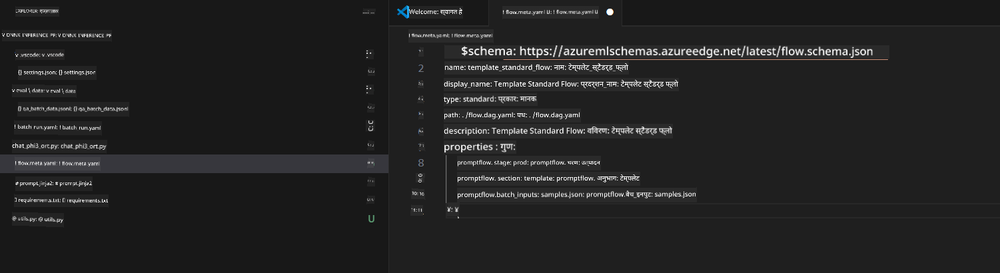

<!--
CO_OP_TRANSLATOR_METADATA:
{
  "original_hash": "92e7dac1e5af0dd7c94170fdaf6860fe",
  "translation_date": "2025-05-08T05:37:03+00:00",
  "source_file": "md/02.Application/01.TextAndChat/Phi3/UsingPromptFlowWithONNX.md",
  "language_code": "hi"
}
-->
# Windows GPU का उपयोग करके Phi-3.5-Instruct ONNX के साथ Prompt flow समाधान बनाना

निम्नलिखित दस्तावेज़ यह उदाहरण है कि कैसे PromptFlow का उपयोग ONNX (Open Neural Network Exchange) के साथ Phi-3 मॉडल पर आधारित AI एप्लिकेशन विकसित करने के लिए किया जाता है।

PromptFlow एक विकास उपकरणों का समूह है, जो LLM-आधारित (Large Language Model) AI एप्लिकेशन के अंत-से-अंत विकास चक्र को सरल बनाता है, विचार से लेकर प्रोटोटाइपिंग, परीक्षण और मूल्यांकन तक।

PromptFlow को ONNX के साथ एकीकृत करके, डेवलपर्स निम्न कर सकते हैं:

- मॉडल प्रदर्शन अनुकूलित करें: ONNX का उपयोग करके मॉडल इनफेरेंस और डिप्लॉयमेंट को प्रभावी बनाएं।
- विकास को सरल बनाएं: PromptFlow का उपयोग करके वर्कफ़्लो प्रबंधित करें और दोहराए जाने वाले कार्यों को स्वचालित करें।
- सहयोग बढ़ाएं: एकीकृत विकास वातावरण प्रदान करके टीम के सदस्यों के बीच बेहतर सहयोग संभव बनाएं।

**Prompt flow** विकास उपकरणों का एक समूह है, जो LLM-आधारित AI एप्लिकेशन के पूरे विकास चक्र को सुव्यवस्थित करता है, जिसमें विचार, प्रोटोटाइपिंग, परीक्षण, मूल्यांकन से लेकर उत्पादन तैनाती और निगरानी शामिल हैं। यह prompt इंजीनियरिंग को बहुत आसान बनाता है और आपको उत्पादन गुणवत्ता वाले LLM एप्लिकेशन बनाने में सक्षम बनाता है।

Prompt flow OpenAI, Azure OpenAI Service, और अनुकूलन योग्य मॉडल (Huggingface, स्थानीय LLM/SLM) से कनेक्ट कर सकता है। हम Phi-3.5 के क्वांटाइज्ड ONNX मॉडल को स्थानीय एप्लिकेशन में तैनात करने की उम्मीद करते हैं। Prompt flow हमें अपने व्यवसाय की बेहतर योजना बनाने और Phi-3.5 आधारित स्थानीय समाधान पूरा करने में मदद कर सकता है। इस उदाहरण में, हम Windows GPU पर आधारित Prompt flow समाधान पूरा करने के लिए ONNX Runtime GenAI लाइब्रेरी को संयोजित करेंगे।

## **इंस्टॉलेशन**

### **Windows GPU के लिए ONNX Runtime GenAI**

Windows GPU के लिए ONNX Runtime GenAI सेट करने के लिए इस मार्गदर्शिका को पढ़ें [यहाँ क्लिक करें](./ORTWindowGPUGuideline.md)

### **VSCode में Prompt flow सेट अप करें**

1. Prompt flow VS Code एक्सटेंशन इंस्टॉल करें


2. Prompt flow VS Code एक्सटेंशन इंस्टॉल करने के बाद, एक्सटेंशन पर क्लिक करें और **Installation dependencies** चुनें, इस मार्गदर्शिका का पालन करते हुए अपने पर्यावरण में Prompt flow SDK इंस्टॉल करें


3. [Sample Code](../../../../../../code/09.UpdateSamples/Aug/pf/onnx_inference_pf) डाउनलोड करें और VS Code का उपयोग करके इस सैंपल को खोलें



4. **flow.dag.yaml** खोलकर अपना Python पर्यावरण चुनें


   **chat_phi3_ort.py** खोलकर अपने Phi-3.5-instruct ONNX मॉडल का स्थान बदलें


5. अपने prompt flow को परीक्षण के लिए चलाएं

**flow.dag.yaml** खोलें और विजुअल एडिटर पर क्लिक करें


इसके बाद इसे क्लिक करें, और परीक्षण के लिए चलाएं


1. आप टर्मिनल में बैच चला सकते हैं ताकि अधिक परिणाम देख सकें


```bash

pf run create --file batch_run.yaml --stream --name 'Your eval qa name'    

```

आप अपने डिफ़ॉल्ट ब्राउज़र में परिणाम देख सकते हैं


**अस्वीकरण**:  
इस दस्तावेज़ का अनुवाद AI अनुवाद सेवा [Co-op Translator](https://github.com/Azure/co-op-translator) का उपयोग करके किया गया है। जबकि हम सटीकता के लिए प्रयासरत हैं, कृपया ध्यान दें कि स्वचालित अनुवादों में त्रुटियाँ या गलतियाँ हो सकती हैं। मूल दस्तावेज़ को उसकी मूल भाषा में प्रामाणिक स्रोत माना जाना चाहिए। महत्वपूर्ण जानकारी के लिए, पेशेवर मानव अनुवाद की सिफारिश की जाती है। इस अनुवाद के उपयोग से उत्पन्न किसी भी गलतफहमी या गलत व्याख्या के लिए हम जिम्मेदार नहीं हैं।