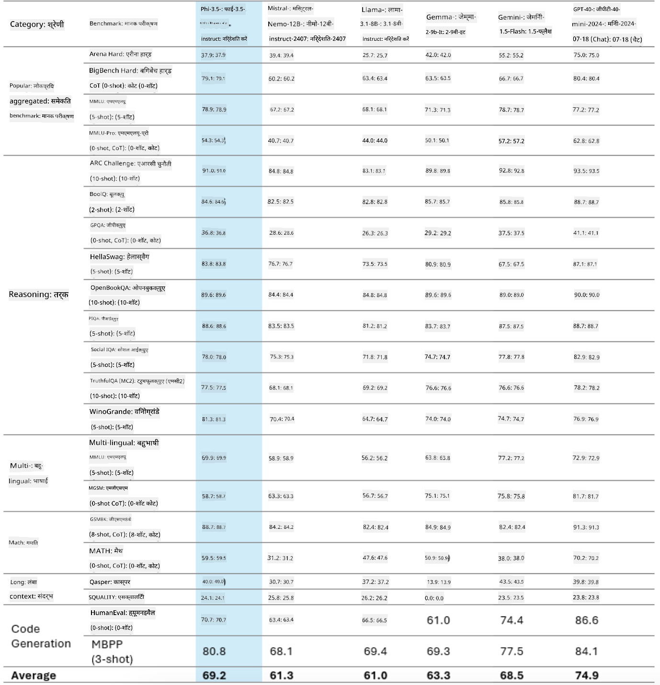
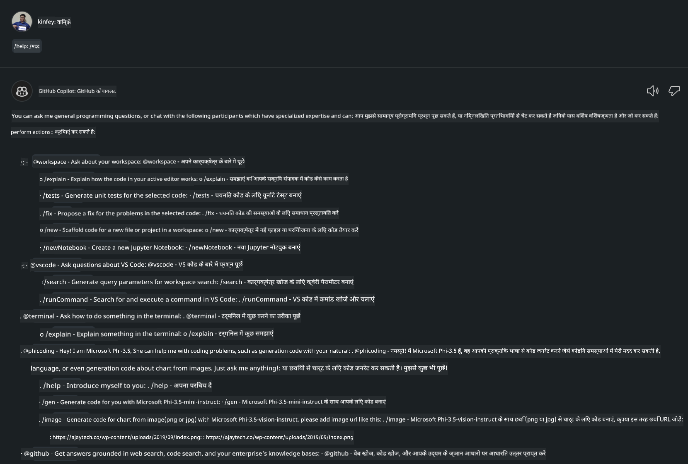
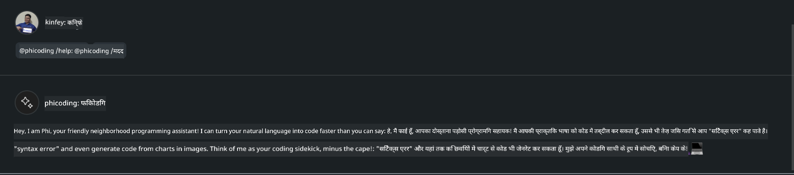

<!--
CO_OP_TRANSLATOR_METADATA:
{
  "original_hash": "35bf81388ac6917277b8d9a0c39bdc70",
  "translation_date": "2025-07-17T03:23:31+00:00",
  "source_file": "md/02.Application/02.Code/Phi3/CreateVSCodeChatAgentWithGitHubModels.md",
  "language_code": "hi"
}
-->
# **GitHub Models के Phi-3.5 के साथ अपना खुद का Visual Studio Code Chat Copilot Agent बनाएं**

क्या आप Visual Studio Code Copilot का उपयोग कर रहे हैं? खासकर Chat में, आप विभिन्न एजेंट्स का उपयोग करके Visual Studio Code में प्रोजेक्ट बनाने, लिखने और मेंटेन करने की क्षमता बढ़ा सकते हैं। Visual Studio Code एक API प्रदान करता है जो कंपनियों और व्यक्तियों को उनके व्यवसाय के आधार पर विभिन्न एजेंट बनाने की अनुमति देता है ताकि वे अपने विशिष्ट क्षेत्रों में अपनी क्षमताओं का विस्तार कर सकें। इस लेख में, हम GitHub Models के **Phi-3.5-mini-instruct (128k)** और **Phi-3.5-vision-instruct (128k)** पर ध्यान केंद्रित करेंगे ताकि आप अपना खुद का Visual Studio Code Agent बना सकें।

## **GitHub Models पर Phi-3.5 के बारे में**

हम जानते हैं कि Phi-3/3.5-mini-instruct, Phi-3/3.5 परिवार में, कोड समझने और जनरेट करने की मजबूत क्षमता रखता है, और यह Gemma-2-9b और Mistral-Nemo-12B-instruct-2407 की तुलना में बेहतर है।



नवीनतम GitHub Models पहले से ही Phi-3.5-mini-instruct (128k) और Phi-3.5-vision-instruct (128k) मॉडल्स तक पहुंच प्रदान करते हैं। डेवलपर्स इन्हें OpenAI SDK, Azure AI Inference SDK, और REST API के माध्यम से एक्सेस कर सकते हैं।


***Note:*** यहां Azure AI Inference SDK का उपयोग करने की सलाह दी जाती है, क्योंकि यह प्रोडक्शन वातावरण में Azure Model Catalog के साथ बेहतर स्विच कर सकता है।

नीचे GitHub Models के साथ इंटीग्रेशन के बाद कोड जनरेशन परिदृश्य में **Phi-3.5-mini-instruct (128k)** और **Phi-3.5-vision-instruct (128k)** के परिणाम दिए गए हैं, साथ ही निम्नलिखित उदाहरणों की तैयारी भी की गई है।

**Demo: GitHub Models Phi-3.5-mini-instruct (128k) से प्रॉम्प्ट के आधार पर कोड जनरेट करें** ([यहाँ क्लिक करें](../../../../../../code/09.UpdateSamples/Aug/ghmodel_phi35_instruct_demo.ipynb))

**Demo: GitHub Models Phi-3.5-vision-instruct (128k) से इमेज के आधार पर कोड जनरेट करें** ([यहाँ क्लिक करें](../../../../../../code/09.UpdateSamples/Aug/ghmodel_phi35_vision_demo.ipynb))


## **GitHub Copilot Chat Agent के बारे में**

GitHub Copilot Chat Agent कोड के आधार पर विभिन्न प्रोजेक्ट परिदृश्यों में अलग-अलग कार्य पूरे कर सकता है। सिस्टम में चार एजेंट हैं: workspace, github, terminal, vscode


एजेंट के नाम के साथ ‘@’ जोड़कर, आप संबंधित कार्य को जल्दी पूरा कर सकते हैं। उद्यमों के लिए, यदि आप अपनी व्यवसाय से संबंधित सामग्री जैसे आवश्यकताएं, कोडिंग, टेस्ट स्पेसिफिकेशन, और रिलीज़ जोड़ते हैं, तो आप GitHub Copilot के आधार पर अधिक शक्तिशाली एंटरप्राइज प्राइवेट फंक्शंस प्राप्त कर सकते हैं।

Visual Studio Code Chat Agent ने अब आधिकारिक रूप से अपना API जारी कर दिया है, जिससे उद्यम या उद्यम डेवलपर्स विभिन्न सॉफ़्टवेयर व्यवसाय इकोसिस्टम के आधार पर एजेंट विकसित कर सकते हैं। Visual Studio Code Extension Development के विकास तरीके के आधार पर, आप आसानी से Visual Studio Code Chat Agent API के इंटरफेस तक पहुंच सकते हैं। हम इस प्रक्रिया के आधार पर विकास कर सकते हैं।


यह विकास परिदृश्य तृतीय-पक्ष मॉडल API (जैसे GitHub Models, Azure Model Catalog, और ओपन सोर्स मॉडल्स पर आधारित स्वयं निर्मित सेवाएं) तक पहुंच का समर्थन करता है और GitHub Copilot द्वारा प्रदान किए गए gpt-35-turbo, gpt-4, और gpt-4o मॉडल्स का भी उपयोग कर सकता है।

## **Phi-3.5 के आधार पर @phicoding एजेंट जोड़ें**

हम Phi-3.5 की प्रोग्रामिंग क्षमताओं को इंटीग्रेट करने की कोशिश करते हैं ताकि कोड लिखना, इमेज जनरेशन कोड और अन्य कार्य पूरे किए जा सकें। Phi-3.5 के इर्द-गिर्द बनाया गया एक एजेंट - @PHI पूरा करें, जिनमें निम्नलिखित कुछ कार्य हैं:

1. GitHub Copilot द्वारा प्रदान किए गए GPT-4o के आधार पर **@phicoding /help** कमांड के माध्यम से स्व-परिचय जनरेट करें

2. **Phi-3.5-mini-instruct (128k)** के आधार पर विभिन्न प्रोग्रामिंग भाषाओं के लिए कोड **@phicoding /gen** कमांड के माध्यम से जनरेट करें

3. **Phi-3.5-vision-instruct (128k)** और इमेज कम्प्लीशन के आधार पर कोड **@phicoding /image** कमांड के माध्यम से जनरेट करें


## **संबंधित चरण**

1. npm का उपयोग करके Visual Studio Code Extension विकास समर्थन इंस्टॉल करें

```bash

npm install --global yo generator-code 

```

2. Visual Studio Code Extension प्लगइन बनाएं (Typescript विकास मोड का उपयोग करते हुए, नाम phiext)

```bash

yo code 

```

3. बनाए गए प्रोजेक्ट को खोलें और package.json संशोधित करें। यहाँ संबंधित निर्देश और कॉन्फ़िगरेशन हैं, साथ ही GitHub Models की कॉन्फ़िगरेशन भी। ध्यान दें कि आपको यहाँ अपना GitHub Models टोकन जोड़ना होगा।

```json

{
  "name": "phiext",
  "displayName": "phiext",
  "description": "",
  "version": "0.0.1",
  "engines": {
    "vscode": "^1.93.0"
  },
  "categories": [
    "AI",
    "Chat"
  ],
  "activationEvents": [],
  "enabledApiProposals": [
      "chatVariableResolver"
  ],
  "main": "./dist/extension.js",
  "contributes": {
    "chatParticipants": [
        {
            "id": "chat.phicoding",
            "name": "phicoding",
            "description": "Hey! I am Microsoft Phi-3.5, She can help me with coding problems, such as generation code with your natural language, or even generation code about chart from images. Just ask me anything!",
            "isSticky": true,
            "commands": [
                {
                    "name": "help",
                    "description": "Introduce myself to you"
                },
                {
                    "name": "gen",
                    "description": "Generate code for you with Microsoft Phi-3.5-mini-instruct"
                },
                {
                    "name": "image",
                    "description": "Generate code for chart from image(png or jpg) with Microsoft Phi-3.5-vision-instruct, please add image url like this : https://ajaytech.co/wp-content/uploads/2019/09/index.png"
                }
            ]
        }
    ],
    "commands": [
        {
            "command": "phicoding.namesInEditor",
            "title": "Use Microsoft Phi 3.5 in Editor"
        }
    ],
    "configuration": {
      "type": "object",
      "title": "githubmodels",
      "properties": {
        "githubmodels.endpoint": {
          "type": "string",
          "default": "https://models.inference.ai.azure.com",
          "description": "Your GitHub Models Endpoint",
          "order": 0
        },
        "githubmodels.api_key": {
          "type": "string",
          "default": "Your GitHub Models Token",
          "description": "Your GitHub Models Token",
          "order": 1
        },
        "githubmodels.phi35instruct": {
          "type": "string",
          "default": "Phi-3.5-mini-instruct",
          "description": "Your Phi-35-Instruct Model",
          "order": 2
        },
        "githubmodels.phi35vision": {
          "type": "string",
          "default": "Phi-3.5-vision-instruct",
          "description": "Your Phi-35-Vision Model",
          "order": 3
        }
      }
    }
  },
  "scripts": {
    "vscode:prepublish": "npm run package",
    "compile": "webpack",
    "watch": "webpack --watch",
    "package": "webpack --mode production --devtool hidden-source-map",
    "compile-tests": "tsc -p . --outDir out",
    "watch-tests": "tsc -p . -w --outDir out",
    "pretest": "npm run compile-tests && npm run compile && npm run lint",
    "lint": "eslint src",
    "test": "vscode-test"
  },
  "devDependencies": {
    "@types/vscode": "^1.93.0",
    "@types/mocha": "^10.0.7",
    "@types/node": "20.x",
    "@typescript-eslint/eslint-plugin": "^8.3.0",
    "@typescript-eslint/parser": "^8.3.0",
    "eslint": "^9.9.1",
    "typescript": "^5.5.4",
    "ts-loader": "^9.5.1",
    "webpack": "^5.94.0",
    "webpack-cli": "^5.1.4",
    "@vscode/test-cli": "^0.0.10",
    "@vscode/test-electron": "^2.4.1"
  },
  "dependencies": {
    "@types/node-fetch": "^2.6.11",
    "node-fetch": "^3.3.2",
    "@azure-rest/ai-inference": "latest",
    "@azure/core-auth": "latest",
    "@azure/core-sse": "latest"
  }
}


```

4. src/extension.ts को संशोधित करें

```typescript

// The module 'vscode' contains the VS Code extensibility API
// Import the module and reference it with the alias vscode in your code below
import * as vscode from 'vscode';
import ModelClient from "@azure-rest/ai-inference";
import { AzureKeyCredential } from "@azure/core-auth";


interface IPhiChatResult extends vscode.ChatResult {
    metadata: {
        command: string;
    };
}


const MODEL_SELECTOR: vscode.LanguageModelChatSelector = { vendor: 'copilot', family: 'gpt-4o' };

function isValidImageUrl(url: string): boolean {
    const regex = /^(https?:\/\/.*\.(?:png|jpg))$/i;
    return regex.test(url);
}
  

// This method is called when your extension is activated
// Your extension is activated the very first time the command is executed
export function activate(context: vscode.ExtensionContext) {

    const codinghandler: vscode.ChatRequestHandler = async (request: vscode.ChatRequest, context: vscode.ChatContext, stream: vscode.ChatResponseStream, token: vscode.CancellationToken): Promise<IPhiChatResult> => {


        const config : any = vscode.workspace.getConfiguration('githubmodels');
        const endPoint: string = config.get('endpoint');
        const apiKey: string = config.get('api_key');
        const phi35instruct: string = config.get('phi35instruct');
        const phi35vision: string = config.get('phi35vision');
        
        if (request.command === 'help') {

            const content = "Welcome to Coding assistant with Microsoft Phi-3.5"; 
            stream.progress(content);


            try {
                const [model] = await vscode.lm.selectChatModels(MODEL_SELECTOR);
                if (model) {
                    const messages = [
                        vscode.LanguageModelChatMessage.User("Please help me express this content in a humorous way: I am a programming assistant who can help you convert natural language into code and generate code based on the charts in the images. output format like this : Hey I am Phi ......")
                    ];
                    const chatResponse = await model.sendRequest(messages, {}, token);
                    for await (const fragment of chatResponse.text) {
                        stream.markdown(fragment);
                    }
                }
            } catch(err) {
                console.log(err);
            }


            return { metadata: { command: 'help' } };

        }

        
        if (request.command === 'gen') {

            const content = "Welcome to use phi-3.5 to generate code";

            stream.progress(content);

            const client = new ModelClient(endPoint, new AzureKeyCredential(apiKey));

            const response = await client.path("/chat/completions").post({
              body: {
                messages: [
                  { role:"system", content: "You are a coding assistant.Help answer all code generation questions." },
                  { role:"user", content: request.prompt }
                ],
                model: phi35instruct,
                temperature: 0.4,
                max_tokens: 1000,
                top_p: 1.
              }
            });

            stream.markdown(response.body.choices[0].message.content);

            return { metadata: { command: 'gen' } };

        }


        
        if (request.command === 'image') {


            const content = "Welcome to use phi-3.5 to generate code from image(png or jpg),image url like this:https://ajaytech.co/wp-content/uploads/2019/09/index.png";

            stream.progress(content);

            if (!isValidImageUrl(request.prompt)) {
                stream.markdown('Please provide a valid image URL');
                return { metadata: { command: 'image' } };
            }
            else
            {

                const client = new ModelClient(endPoint, new AzureKeyCredential(apiKey));
    
                const response = await client.path("/chat/completions").post({
                    body: {
                      messages: [
                        { role: "system", content: "You are a helpful assistant that describes images in details." },
                        { role: "user", content: [
                            { type: "text", text: "Please generate code according to the chart in the picture according to the following requirements\n1. Keep all information in the chart, including data and text\n2. Do not generate additional information that is not included in the chart\n3. Please extract data from the picture, do not generate it from csv\n4. Please save the regenerated chart as a chart and save it to ./output/demo.png"},
                            { type: "image_url", image_url: {url: request.prompt}
                            }
                          ]
                        }
                      ],
                      model: phi35vision,
                      temperature: 0.4,
                      max_tokens: 2048,
                      top_p: 1.
                    }
                  });
    
                
                stream.markdown(response.body.choices[0].message.content);
    
                return { metadata: { command: 'image' } };
            }


        }


        return { metadata: { command: '' } };
    };


    const phi_ext = vscode.chat.createChatParticipant("chat.phicoding", codinghandler);

    phi_ext.iconPath = new vscode.ThemeIcon('sparkle');


    phi_ext.followupProvider = {
        provideFollowups(result: IPhiChatResult, context: vscode.ChatContext, token: vscode.CancellationToken) {
            return [{
                prompt: 'Let us coding with Phi-3.5 😋😋😋😋',
                label: vscode.l10n.t('Enjoy coding with Phi-3.5'),
                command: 'help'
            } satisfies vscode.ChatFollowup];
        }
    };

    context.subscriptions.push(phi_ext);
}

// This method is called when your extension is deactivated
export function deactivate() {}


```

6. चलाना

***/help***



***@phicoding /help***



***@phicoding /gen***


***@phicoding /image***


आप सैंपल कोड डाउनलोड कर सकते हैं: [यहाँ क्लिक करें](../../../../../../code/09.UpdateSamples/Aug/vscode)

## **संसाधन**

1. GitHub Models के लिए साइन अप करें [https://gh.io/models](https://gh.io/models)

2. Visual Studio Code Extension Development सीखें [https://code.visualstudio.com/api/get-started/your-first-extension](https://code.visualstudio.com/api/get-started/your-first-extension)

3. Visual Studio Code Copilot Chat API के बारे में जानें [https://code.visualstudio.com/api/extension-guides/chat](https://code.visualstudio.com/api/extension-guides/chat)

**अस्वीकरण**:  
यह दस्तावेज़ AI अनुवाद सेवा [Co-op Translator](https://github.com/Azure/co-op-translator) का उपयोग करके अनुवादित किया गया है। जबकि हम सटीकता के लिए प्रयासरत हैं, कृपया ध्यान दें कि स्वचालित अनुवादों में त्रुटियाँ या असंगतियाँ हो सकती हैं। मूल दस्तावेज़ अपनी मूल भाषा में ही अधिकारिक स्रोत माना जाना चाहिए। महत्वपूर्ण जानकारी के लिए, पेशेवर मानव अनुवाद की सलाह दी जाती है। इस अनुवाद के उपयोग से उत्पन्न किसी भी गलतफहमी या गलत व्याख्या के लिए हम जिम्मेदार नहीं हैं।